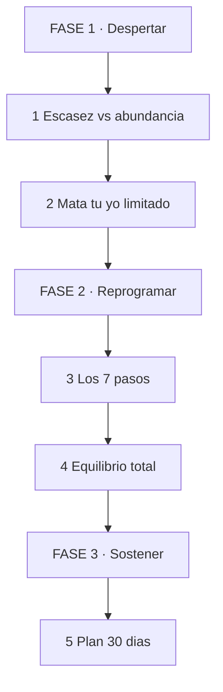
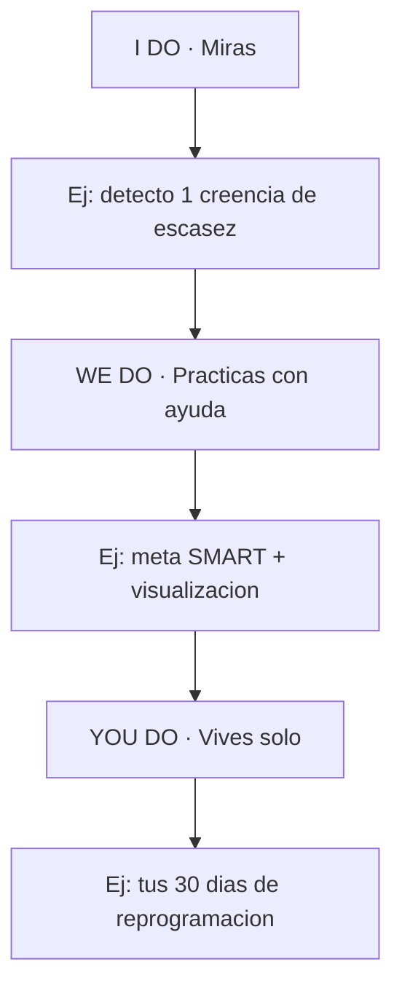

# 🚀 MASTERCLASS: Reprograma tu Mente para el Éxito 🧠💰

## 🎯 INTRODUCCIÓN: POR QUÉ ESTA MASTERCLASS ES DIFERENTE 💡

La clave del éxito en los negocios no es solo trabajar duro ni la estrategia de marketing. Es desarrollar la mentalidad correcta.

Muchos vienen condicionados desde la infancia con creencias limitantes que instalan una **mentalidad de escasez** que sabotea su potencial. Esta guía propone el camino inverso: transitar a una **mentalidad de abundancia** con equilibrio en todas las áreas — negocio y bienestar personal.

> **🎯 Objetivo de Aprendizaje** — Al final podrás detectar tu mentalidad de escasez, aplicar los 7 pasos de reprogramación mental y sostenerlos 30 días.

> **⚠️ Advertencia honesta** — Esto no es magia ni positivismo vacío. Es entrenar foco, metas y hábitos. Sin acción, la visualización no sirve.

---

## 🗺️ MAPA DE LA RUTA — LEE DE ARRIBA HACIA ABAJO 🗺️

Cómo leerlo: empiezas en FASE 1, bajas hasta FASE 3. Sin detectar tu escasez, los 7 pasos no pegan.

| Fase 🧩 | Qué logras 🎯 | Habilidad 🛠️ |
|------|---------------|--------------|
| **FASE 1 · Despertar** (1-2) | Ves tus creencias limitantes | Detectar + Decidir |
| **FASE 2 · Reprogramar** (3-4) | Aplicas los 7 pasos con equilibrio | Entrenar + Equilibrar |
| **FASE 3 · Sostener** (5) | Hábito de 30 días funcionando | Persistir |

### Cómo vas a aprender: I Do → We Do → You Do

---

## 🔍 PARTE 1: ESCASEZ vs ABUNDANCIA

### 1.1 Cómo te programaron

Desde niños absorbemos frases que se vuelven creencias: "el dinero es malo", "no es para gente como nosotros", "más vale poco seguro". Eso forma la mentalidad de escasez: ver límites antes que posibilidades.

| Escasez 🚩 | Abundancia 🟢 |
|------------|---------------|
| "No hay suficiente para todos" | "Hay formas de crearlo" |
| Evita riesgos, se queda quieto | Calcula riesgos y actúa |
| El fracaso lo define | El fracaso le enseña |
| Compite con envidia | Aprende de otros |
| Solo trabajo, sin vida | Equilibrio negocio + bienestar |

> **📌 Idea clave** — La escasez no es tu culpa, pero sostenerla sí es tu decisión.

### 1.2 Ejercicio: detecta tus 3 frases

Escribe las 3 frases sobre dinero/éxito que más escuchaste de niño. Al lado, escribe su versión de abundancia. Ese papel es tu punto de partida.

---

## 🔥 PARTE 2: MATA TU YO LIMITADO

El cambio exige "matar" tu versión pasada y limitada para adoptar una visión expansiva de lo posible. No es olvidar tu historia: es dejar de obedecerla.

| Paso 📋 | Acción 🎯 |
|---------|-----------|
| 1 | Nombra tu límite: "soy malo vendiendo" |
| 2 | Busca 1 contra-evidencia real de tu vida |
| 3 | Define tu nueva identidad en 1 frase: "aprendo a vender cada semana" |
| 4 | Actúa 1 vez como esa nueva versión hoy mismo |

> **📌 Idea clave** — No esperes sentirte capaz para actuar. Actúa y tu cerebro registrará la evidencia.

---

## 🛠️ PARTE 3: LOS 7 PASOS PARA REPROGRAMAR TU MENTE

### Paso 1 — Visualiza tu éxito

Usa la capacidad de tu cerebro para enfocarse en tu realidad deseada. Visualiza con detalle sensorial: dónde estás, qué haces, cómo se siente. 5 minutos al día, misma escena.

### Paso 2 — Metas claras con SMART

Dale a tu cerebro objetivos accionables: específicos, medibles, alcanzables, relevantes y con fecha.

| Mal ❌ | SMART ✅ |
|--------|----------|
| "Quiero ganar más" | "Facturo $X con 3 clientes antes del 30-nov" |

### Paso 3 — Actitud positiva ante el fallo

Mantente abierto a aprender incluso de los fracasos. Pregunta estándar: "¿qué me enseña esto que me ahorra el próximo error?"

### Paso 4 — Automotívate con mini-victorias

Celebra wins pequeños para mantener la energía. Lista diaria de 3 avances, aunque sean mínimos.

### Paso 5 — Diálogo interno positivo

Adopta la creencia de que eres capaz de encontrar soluciones. Cambia "no puedo" por "todavía no sé cómo, voy a averiguarlo".

### Paso 6 — Resiliencia

Acepta que desafíos y fracasos son parte del proceso. La resiliencia no es no caer: es el tiempo que tardas en levantarte.

### Paso 7 — Persistencia

Dale tiempo a tu cerebro para formar nuevas rutas neuronales orientadas al éxito. La constancia diaria le gana a la intensidad esporádica.

> **📌 Idea clave** — Los 7 pasos funcionan en cadena: visualizar sin meta es soñar; meta sin persistencia es empezar 10 veces.

---

## ⚖️ PARTE 4: EQUILIBRIO TOTAL

La abundancia real incluye todas las áreas: negocio, salud, relaciones, energía. Crecer facturando y romperte por dentro no es éxito.

| Área 📋 | Señal de equilibrio 🎯 |
|---------|------------------------|
| Negocio | Metas claras + acción semanal |
| Cuerpo | Sueño, movimiento, energía estable |
| Mente | Diálogo interno que suma |
| Relaciones | Gente que te impulsa, no que te drena |

Revisión semanal de 10 minutos: puntúa cada área 1-10 y ajusta la más baja la próxima semana.

---

## 📅 PARTE 5: PLAN 30 DÍAS

| Semana 🗓️ | Enfoque 🎯 | Entregable 🏗️ |
|------------|-----------|---------------|
| 1 | Detección | 3 creencias + sus versiones de abundancia |
| 2 | 7 pasos diario | Visualización 5min + 1 meta SMART + lista de wins |
| 3 | Resiliencia en acción | 1 fracaso analizado con lección escrita |
| 4 | Identidad nueva | 1 frase de identidad + evidencia de 30 días |

> **📌 Idea clave** — 30 días no te cambian la vida. Te cambian la dirección, que es lo que importa.

---

## 🧩 PARTE 6: I DO / WE DO / YOU DO

### 6.1 I Do — Detecta 1 creencia

| Paso | Acción | Resultado |
|------|--------|-----------|
| 1 | Escribe 1 frase limitante | Creencia visible |
| 2 | Escribe su versión abundante | Alternativa clara |
| 3 | 1 acción como la nueva versión | Evidencia real |

### 6.2 We Do — Meta SMART + visualización

| Decisión | Opción | Por qué |
|----------|--------|---------|
| Meta | 1 SMART a 30 días | Cerebro con target |
| Escena | 1 visualización fija | Foco repetible |
| Ritual | 5 min cada mañana | Constancia > intensidad |

### 6.3 You Do — Tus 30 días

| Criterio | Peso |
|----------|------|
| Ritual diario cumplido 25+/30 | 30% |
| 1 meta SMART con avance medible | 30% |
| Diario de wins + 1 fracaso analizado | 20% |
| Revisión de equilibrio semanal | 20% |

---

## ✅ CHECKLIST FINAL

| Bloque 📦 | Check ✔️ |
|--------|-------|
| Escasez | 3 creencias detectadas y reescritas |
| Identidad | 1 frase de nueva versión + 1 acción |
| 7 pasos | Ritual diario activo |
| Equilibrio | 4 áreas revisadas semanalmente |
| 30 días | Evidencia escrita del cambio |

---

## 📝 PREGUNTAS DE VERIFICACIÓN

1. ¿Cuáles son tus 3 frases de escasez heredadas y su versión de abundancia?
2. Convierte "quiero que me vaya bien" en una meta SMART a 30 días.
3. Describe tu escena de visualización en 3 líneas sensoriales.
4. Cuenta un fracaso reciente: ¿qué lección te ahorra el próximo error?
5. ¿Qué área de tu equilibrio está más baja y qué harás esta semana?

---

## 📖 GLOSARIO

| Término | Definición |
|---------|------------|
| **Escasez** | Creencia de que no hay suficiente; frena acción |
| **Abundancia** | Visión de posibilidades + equilibrio integral |
| **SMART** | Meta específica, medible, alcanzable, relevante, temporal |
| **Visualización** | Enfocar el cerebro en la realidad deseada |
| **Diálogo interno** | Lo que te dices; programa tu conducta |
| **Resiliencia** | Velocidad de recuperación ante el fallo |
| **Persistencia** | Constancia que crea nuevas rutas neuronales |

*Basada en la charla de Judit Català sobre mindset, escasez/abundancia y los 7 pasos.*
