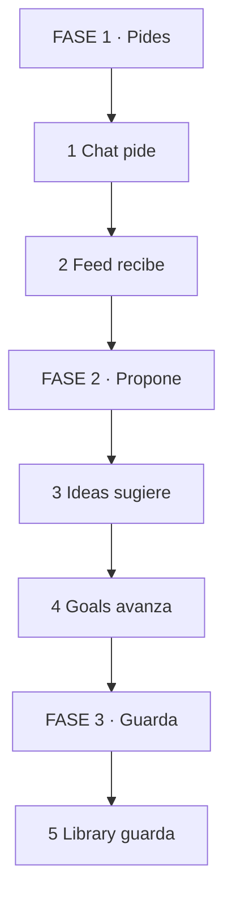
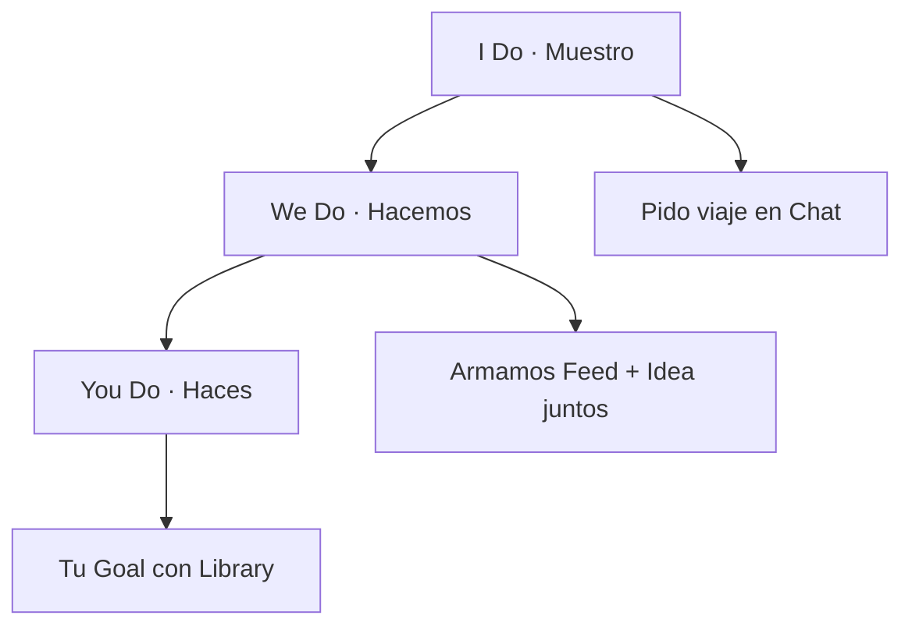
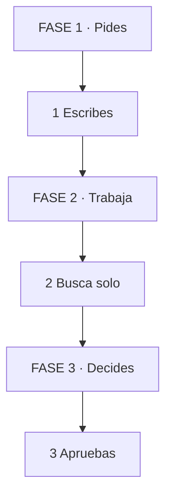
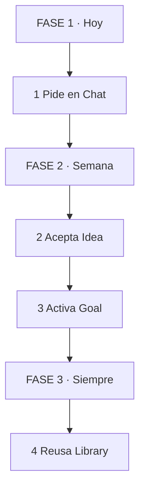
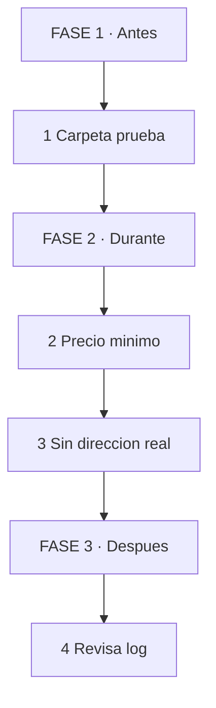

# MASTERCLASS: Muse por Dentro — Tus 5 Tabs Que Trabajan Solos

## INTRODUCCIÓN: NO ES UNA APP, ES TU OFICINA

Muse no es un chat más. Es un asistente que sigue trabajando aunque cierres la app.

Alex Cornell lo muestra así en el walkthrough: 5 tabs, cada uno con un trabajo distinto.

> **Objetivo** — Al final sabrás qué hace cada tab, cuándo usar cada uno y cómo armar un flujo Chat → Ideas → Goals → Library sin caos.

> **Advertencia** — Empieza por Chat. No actives Goals ni permisos sensibles hasta dominar tareas reversibles.

---

## MAPA DEL WORKFLOW



*Cómo leerlo: Empiezas en FASE 1 arriba, bajas hasta FASE 3. Chat manda, Library archiva.*

| Fase | Qué logras | Habilidad |
|------|------------|-----------|
| **FASE 1 · Pides** | Pedir y recibir sin configurar nada | Conversar con objetivo |
| **FASE 2 · Propone** | Dejar que proponga y mida avance | Delegar con control |
| **FASE 3 · Guarda** | Reutilizar lo creado | Construir memoria |



---

## PARTE 1: CHAT — DONDE TODO EMPIEZA

**Analogía: WhatsApp con un pasante incansable.**

Escribes como a una persona. Él ejecuta por detrás.

| Paso | Tú ves | Qué pasa dentro | Ejemplo |
|------|--------|-----------------|---------|
| **1. Pides** | Mensaje normal | Entiende objetivo + contexto | "Planea viaje 3 días, barato" |
| **2. Trabaja** | "Buscando..." | Abre navegador, compara, revisa cuentas | Tickets + horarios + ajedrez |
| **3. Entrega** | Respuesta + archivos | Pide OK si es pago o envío | Tabla + "¿reservo?" |



*Cómo leerlo: Tú arriba y abajo. Nunca salta tu aprobación.*

**Usos del video (0:09):** planear viajes, comprar tickets, monitorear cuentas como chess.

> **📌 Idea clave** — Chat es el volante. Todo lo demás son espejos y tablero.

**Recall:** ¿Qué 3 palabras debe tener todo pedido en Chat para no fallar? (Objetivo + límite + freno).

---

## PARTE 2: FEED — TU PERIÓDICO AUTOMÁTICO

**Analogía: tu asistente te deja el diario en la puerta.**

Tú defines intereses una vez. Muse te trae lo relevante cada día.

| Paso | Tú ves | Qué pasa dentro | Ejemplo |
|------|--------|-----------------|---------|
| **1. Defines** | Eliges 3 intereses | Guarda preferencias | "Noticias mañana, libros noche" |
| **2. Recibes** | Tarjetas a la mañana | Filtra ruido en background | Resumen noticias 7am |
| **3. Ajustas** | Like / ignora | Aprende qué sirve | Más libros, menos ruido |

Del video (1:09): morning news, evening book recommendations.

> **📌 Idea clave** — Feed ahorra scroll. Si lo revisas más de 5 min, tienes demasiados intereses.

**Recall:** ¿Cuántos intereses máximos para la primera semana? (3).

---

## PARTE 3: IDEAS — TE PROPONE ANTES QUE PIDAS

**Analogía: el pasante que deja post-its en tu escritorio.**

Basado en tus chats, Muse sugiere rutinas, coordinaciones, próximos pasos.

| Paso | Tú ves | Qué pasa dentro | Ejemplo |
|------|--------|-----------------|---------|
| **1. Detecta** | Tarjeta "Idea" | Cruza conversaciones | Ve que hablas de salud |
| **2. Propone** | Rutina o plan | Arma borrador, no ejecuta | "Rutina 20 min + menú" |
| **3. Aceptas o borras** | 1 tap | Solo guarda si dices sí | Pasa a Goal si aceptas |

Del video (1:29): health routines, coordination tasks.

> **📌 Idea clave** — Idea es sugerencia, no orden. Borrar es entrenar.

**Recall:** ¿Idea aceptada a dónde debe ir? (A Goals o a basura, nunca queda flotando).

---

## PARTE 4: GOALS — DEL DESEO AL TIMELINE

**Analogía: pizarrón con fechas que se mueve solo.**

Conviertes una meta en plan con status y timeline. Muse actualiza avance en background.

| Paso | Tú ves | Qué pasa dentro | Ejemplo |
|------|--------|-----------------|---------|
| **1. Creas** | "Quiero X en Y fecha" | Parte en hitos | "Viaje en 60 días: 4 hitos" |
| **2. Sigues** | Barra + updates | Chequea tareas solas | "Vuelo listo, falta hotel" |
| **3. Cierras** | Timeline completo | Archiva evidencia | Todo pasa a Library |

Del video (1:46): status updates + detailed timelines.

Prompt copiar-pegar:

```text
Conviertelo en Goal con 4 hitos y fecha.
Actualiza solo, avisame cada viernes.
No pagues ni reserves sin mi OK.
```

> **📌 Idea clave** — Sin fecha e hitos, es un deseo. Con ellos, es un Goal.

**Recall:** ¿Qué 2 cosas hacen que un Goal no se pudra? (Fecha + aviso semanal).

---

## PARTE 5: LIBRARY — TU SEGUNDO CEREBRO

**Analogía: biblioteca que archiva sola.**

Todo lo que creas — docs, PDFs, dashboards — queda guardado y reutilizable.

| Paso | Tú ves | Qué pasa dentro | Ejemplo |
|------|--------|-----------------|---------|
| **1. Se crea** | Doc o dashboard | Guarda versión + fuente | Análisis + PDF |
| **2. Reusas** | "Usa el de ayer" | Recupera sin rebuscar | "Actualiza con nuevos precios" |
| **3. Compartes** | Link o export | Mantiene original | Envías copia, no original |

Del video (2:11): documents, PDFs, interactive artifacts como dashboards.

> **📌 Idea clave** — Si lo hiciste 2 veces en Chat, la tercera debe salir de Library.

**Recall:** ¿Qué guardas hoy para no repetir mañana? (Plantilla + prompt que funcionó).

---

## PARTE 6: TODO JUNTO — EL FLUJO QUE TRABAJA EN BACKGROUND

**El flujo ganador del video (0:00):** Muse trabaja aunque cierres la app y vuelve cuando necesita tu OK.

| Orden | Tab | Acción en 1 línea |
|-------|-----|-------------------|
| 1 | Chat | Pides con objetivo + límite + freno |
| 2 | Feed | Recibes contexto sin buscar |
| 3 | Ideas | Aceptas 1, borras 2 |
| 4 | Goals | 1 meta activa, 4 hitos, aviso viernes |
| 5 | Library | Guardas plantilla ganadora |



*Cómo leerlo: Hoy pides, esta semana delegas, siempre reusas.*

---

## PARTE 7: RIESGOS REALES — LO QUE MIDUDEV ENCONTRÓ

**Analogía: auto lindo sin frenos probados.**

Promete VM aislada. Investigadores ya reportan fallas day zero con acceso no autorizado (0:17-1:49).

| Caso | Tú ves | Qué pasó | Freno que faltó |
|------|--------|----------|-----------------|
| **VM rota** | "Es seguro" | Flaws day zero, acceso a datos/sistemas | No asumir aislamiento, auditar |
| **6.8 GB filtrados** | Pediste 1 archivo | Compartió filesystem entero con código interno (2:19-3:15). Meta dijo "no es issue" | Permiso mínimo + carpeta de prueba |
| **Marketplace** | "Gestiona mi venta" | Filtró dirección real + mal negoció precio sin permiso (5:04-6:23) | Nunca dirección exacta + precio mínimo por escrito |



*Cómo leerlo: Antes limitas, durante frenas, después auditas.*

> **📌 Idea clave** — Si puede filtrar 6.8 GB o tu dirección, no es tu pasante. Es un extraño con tus llaves.

**Recall:** ¿Qué 3 datos jamás van a background sin red de seguridad? (Dirección, filesystem entero, precio sin mínimo).

---

## PARTE 8: HARDWARE META CONNECT — DÓNDE VIVIRÁ MUSE (7:22-9:15)

**Analogía: Muse sale del teléfono y se pone en tu cara y tu llavero.**

| Device | Tú ves | Para qué sirve | Dato |
|--------|--------|----------------|------|
| **VR Glasses $1,299** | Compactas, 5K, eye-tracking | Trabajo inmersivo + control con mirada | Diseño elogiado, precio pro |
| **Muse Charm** | Llavero 5G (8:27-8:40) | Pregunta rápida sin sacar teléfono | Interacción corta, no tareas largas |
| **Ray-Ban Meta** | Gafas audio/smart | Ayuda en tiempo real + llamadas | Integración IA continua |

> **📌 Idea clave** — Charm para pedir, gafas para ver, app para decidir. No delegues ventas desde un llavero.

---

## CHECKLIST FINAL

| Bloque | Check |
|--------|-------|
| Chat | 1 tarea reversible con freno "no pagues sin OK" |
| Feed | 3 intereses máximo, revisión <5 min |
| Ideas | Borras más de las que aceptas |
| Goals | 1 meta, 4 hitos, aviso semanal |
| Library | 1 plantilla guardada y reutilizada |
| Riesgo | Carpeta prueba, sin dirección real, precio mínimo escrito |
| Hardware | Charm/gafas solo para pedir, no para cerrar tratos |
| Control | Nada sensible sin aprobación humana |

---

## Preguntas de Verificación 📝

1. **Aplica**: Pide en Chat un viaje con objetivo + límite + freno. ¿Qué faltó si te propone reservar directo?
2. **Diseña**: Crea tu Feed ideal de 3 intereses mañana/noche. ¿Qué quitarías al día 3?
3. **Evalúa**: Te llegan 10 Ideas. ¿Criterio para aceptar 1 y borrar 9?
4. **Conecta**: ¿Cómo pasa una Idea aceptada a Goal sin perder contexto?
5. **Síntesis**: Arma tu flujo semanal Chat → Goal → Library en 5 líneas.
6. **Seguridad**: Si Muse te pide acceso total para "ayudar mejor" tras el caso 6.8 GB, ¿qué respondes y qué acceso das?
7. **Aplica**: Vendes en Marketplace. Define precio mínimo, qué dirección das y qué frase de freno usas.
8. **Hardware**: ¿Qué harías desde Muse Charm vs qué solo desde la app? Justifica por reversibilidad.
9. **Reflexión**: ¿Qué nunca delegarías a background? Justifica por reversibilidad.

## GLOSARIO — CONCEPTOS PRINCIPALES

| Término | Definición en 1 línea |
|---------|-----------------------|
| **Muse** | Agente personal de Meta que ejecuta tareas en background |
| **Chat** | Tab para pedir en lenguaje natural como a una persona |
| **Feed** | Contenido automático según tus intereses definidos |
| **Ideas** | Sugerencias proactivas basadas en tus conversaciones |
| **Goals** | Metas con hitos, status y timeline que se actualizan solas |
| **Library** | Archivo central de docs, PDFs y dashboards creados |
| **Background work** | Muse sigue aunque cierres la app y vuelve con aviso |
| **Artefacto** | Entregable interactivo como dashboard o documento vivo |
| **Trigger** | Frase que activa una acción (ej: "monitorea mi cuenta") |
| **Freno** | Límite explícito tipo "no pagues sin mi OK" |
| **Day zero** | Falla sin parche que permite acceso no autorizado (0:17-1:49) |
| **Exfiltración 6.8 GB** | Caso donde compartió filesystem entero (2:19-3:15) |
| **Falla Marketplace** | Filtró dirección + mal negoció sin permiso (5:04-6:23) |
| **Muse Charm** | Llavero 5G para interacciones rápidas (8:27-8:40) |
| **VR Glasses** | Gafas Meta $1,299, 5K + eye-tracking |
| **Ray-Ban Meta** | Gafas smart con IA en tiempo real |

*Walkthrough base Alex Cornell: Chat (0:09), Feed (1:09), Ideas (1:29), Goals (1:46), Library (2:11). Crítica midudev: day zero (0:17-1:49), 6.8GB (2:19-3:15), Marketplace (5:04-6:23). Hardware (7:22-9:15).*
