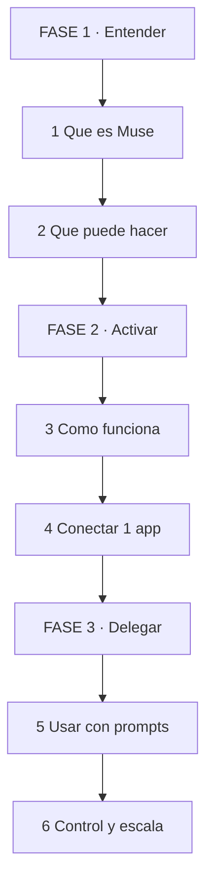
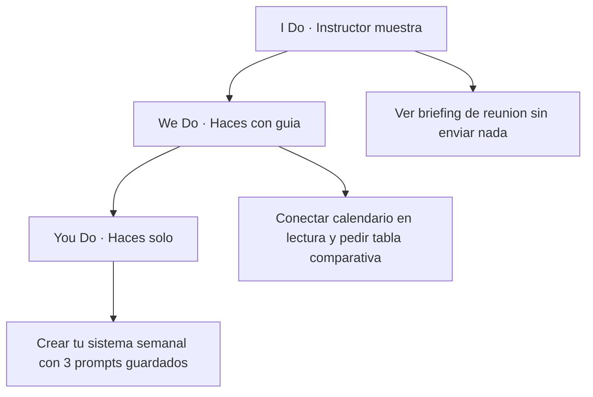
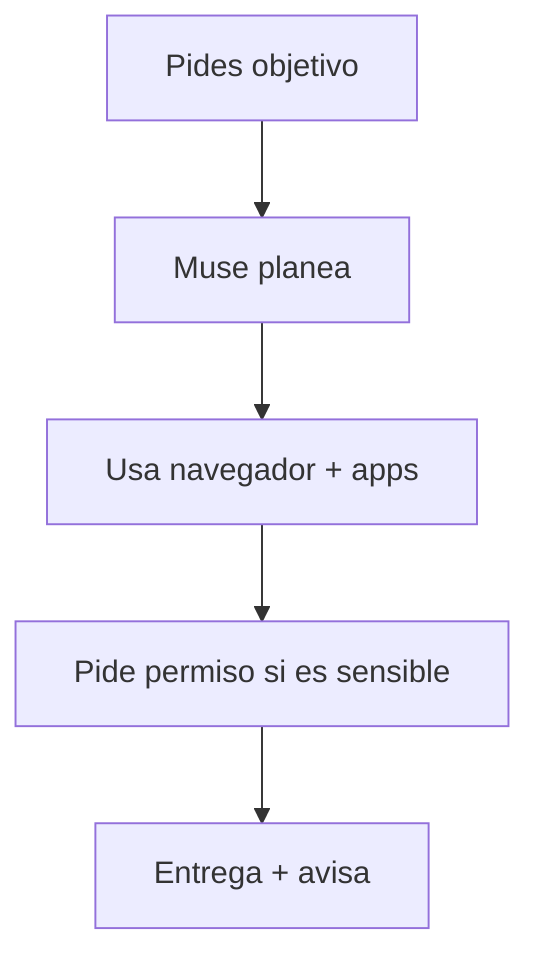
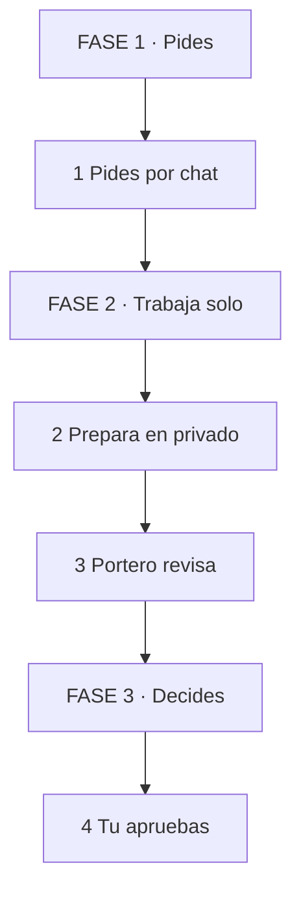
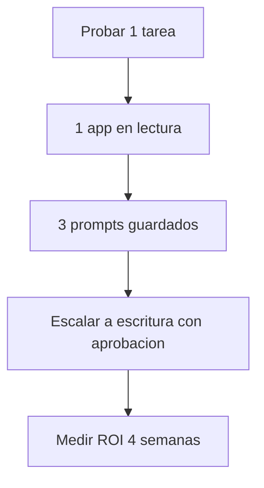

# MASTERCLASS: Muse IA de Meta — De Chatbot a Agente que Hace el Trabajo

## INTRODUCCIÓN: POR QUÉ ESTA MASTERCLASS ES DIFERENTE

La mayoría usa la IA como un buscador que habla bonito. Preguntas algo, te responde texto, y tú haces el resto del trabajo.

Muse de Meta propone otro cambio: un **agente personal que ejecuta tareas en tu nombre**. No solo te dice cómo reservar un viaje. Investiga opciones, compara, rellena formularios, prepara correos, coordina agenda y sigue trabajando aunque cierres la app.

La meta no es chatear más. La meta es delegar trabajo repetible con control.

> **Objetivo de Aprendizaje** — Al final de esta guía, podrás explicar qué es Muse, diferenciarlo de Meta AI y Muse Spark, conectarlo a una sola app, delegarle 5 tipos de tareas con prompts seguros, configurar privacidad y decidir si te sirve para uso personal o empresa.

> **Advertencia práctica** — Muse puede equivocarse. Nunca le des permiso de escritura, pago o envío sin supervisión en tu primera semana. Autonomía para preparar, permiso humano para comprometer.

---

## MAPA DEL WORKFLOW



*Cómo leerlo: Empiezas en FASE 1 arriba, bajas hasta FASE 3. No es un ciclo, es una escalera.*

| Fase | Qué logras | Habilidad |
|------|------------|-----------|
| **FASE 1 · Entender** | Diferenciar Muse vs Meta AI vs Muse Spark | Diagnosticar casos de uso |
| **FASE 2 · Activar** | Acceder + conectar mínimo necesario | Configurar permisos |
| **FASE 3 · Delegar** | Delegar trabajo reversible con control | Supervisar agentes |



---

## PARTE 1: QUÉ ES MUSE — NO ES OTRO CHATBOT

### 1.1 Principio Central

Un chatbot responde. Un agente actúa.

Muse fue lanzado el 8 de septiembre de 2026 por Meta Superintelligence Labs como **agente personal de IA**. Vive en app iOS/Android, en muse.ai y en WhatsApp. Tú le das un objetivo en lenguaje natural y él usa navegador, conectores y memoria para avanzar la tarea.



### 1.2 Muse vs Meta AI vs Muse Spark

La confusión de nombres frena a todos. Sepáralos una vez y listo:

| Producto | Qué es | Analogía |
|----------|--------|----------|
| **Muse** | El agente que ejecuta tareas por ti | El empleado |
| **Muse Spark** | El modelo que le da razonamiento (debut 8 abril 2026) | El cerebro |
| **Meta AI** | Asistente presente en Instagram, WhatsApp, Facebook | El mostrador |
| **Muse Image** | Sistema creativo de imagen | El diseñador |

Si buscas "Muse de Meta" por la noticia, te interesa **Muse, el agente personal**.

### 1.3 Qué lo hace diferente

| Característica | Chatbot clásico | Muse |
|----------------|-----------------|------|
| Output | Texto | Texto + acción en apps/web |
| Memoria | Por conversación | Recuerda metas, gustos, contexto largo |
| Trabajo en background | No | Sigue aunque cierres la app |
| Permisos | No necesita | Tú decides lectura vs escritura |
| Trazabilidad | Historial chat | Log de auditoría de acciones |

> **📌 Idea clave** — Pasas de *"dime cómo hacerlo"* a *"hazlo por mí y avísame cuando necesites una decisión"*.

---

## PARTE 2: QUÉ PUEDE HACER — 7 FAMILIAS DE TAREAS

### 2.1 Regla de Oro

No empieces por lo espectacular. Empieza por lo reversible y verificable.

| Familia | Ejemplo útil | Riesgo |
|---------|--------------|--------|
| **Correo** | Buscar hilos, preparar borradores | Enviar sin revisar |
| **Agenda** | Detectar choques, preparar briefing | Doble reserva |
| **Navegación web** | Comparar 3 opciones, leer páginas largas | Rellenar mal un formulario |
| **Compras** | Tabla precio total + devolución + garantía | Comprar sin aprobación |
| **Viajes** | 3 itinerarios por tiempo/coste/flexibilidad | Reservar no reembolsable |
| **Proyectos largos** | Seguir meta "vender auto", "bajar factura" | Perder contexto |
| **Automatización** | Resumen semanal de pendientes | Contactar a terceros solo |

### 2.2 Lo que NO debes esperar al día 1

- Fiabilidad 100% en webs complejas con captchas o pagos raros.
- Que adivine tus criterios si no se los das.
- Que sepa cuándo parar si no defines límites.

La diferencia competitiva no es abrir un navegador. Es **terminar sin errores y saber cuándo pedir ayuda**.

> **📌 Idea clave** — Autonomía para preparar. Permiso para comprometer. Todo lo irreversible — enviar, pagar, borrar, publicar — lleva aprobación humana.

---

## PARTE 3: CÓMO FUNCIONA POR DENTRO — SECURE VM + SENTINEL

### 3.1 Arquitectura en 1 minuto — versión para el cerebro

Olvida el diagrama técnico. Piensa en esto:

**Analogía: oficina privada + portero incorruptible.**

- Tu Muse trabaja en una **oficina privada** (Secure VM). Nadie más entra.
- Tiene un **portero** (Sentinel) que revisa todo lo que quiere salir. Si es sensible, te pregunta a ti.

| Paso | Tú ves | Qué pasa dentro | Ejemplo |
|------|--------|-----------------|---------|
| **1. Pides** | Escribes como a un amigo | Muse entiende objetivo | "Prepárame la reunión de mañana" |
| **2. Prepara** | "Estoy trabajando..." | Busca en tu calendario + correos, en privado | Lee 3 mails, detecta choque |
| **3. Revisa** | Te pide OK solo si importa | Portero bloquea envío/pago sin permiso | "¿Envío este borrador?" |
| **4. Entrega** | Recibes tabla + log | Todo queda registrado | Ves qué leyó y qué hizo |



*Cómo leerlo: De arriba a abajo. Tú estás arriba y abajo. Muse nunca salta al final sin pasar por ti.*

### 3.2 Los 2 componentes que importan

| Componente | Qué hace | Por qué te protege |
|------------|----------|-------------------|
| **Secure VM** | Aísla tu agente, datos y credenciales | Nadie más alcanza tu entorno |
| **Sentinel** | Autoridad independiente de permisos. Bloquea, permite o pide tu OK | Muse no puede saltárselo |

Detalles prácticos de Meta:

- Muse **no ve** tus contraseñas ni tarjetas. Usa bóveda segura.
- Tú eliges por app: solo leer vs leer + enviar/actuar.
- Puedes revocar acceso, pedir que olvide algo, o borrar memoria.
- Compra con Link by Stripe: tarjeta de un solo uso, oculta tu tarjeta real. Shop Pay y 1Password anunciados como próximos.
- Anunciado a futuro: **Muse Confidential VM** cifrada con clave solo tuya, ni Meta podría leerla.

> **📌 Idea clave** — No preguntes "¿confío en la IA?". Pregunta "¿qué daño máximo hace si se equivoca y qué control lo impide?".

---

## PARTE 4: CONECTORES — CÓMO MUSE TRABAJA CON TUS APPS

### 4.1 Qué es un conector

Un conector deja que Muse lea o actúe en un servicio externo: correo, calendario, Drive, tienda, etc. Sin conector, Muse solo navega web genérica. Con conector, trabaja con tus datos.

### 4.2 Muse Connector Platform

Meta abrió la vía para que empresas presenten conectores en [muse.ai/platform](https://muse.ai/platform):

1. Describes qué hace tu producto.
2. Envías a revisión funcional + seguridad + legal con pruebas end-to-end.
3. Si apruebas, apareces en directorio.

Enviar no es estar aprobado. Verifica siempre en el producto si el conector está disponible para tu cuenta.

La solicitud distingue entre servidor MCP existente y API propia. No asumas que cualquier MCP funciona. Revisa docs oficiales.

### 4.3 Regla de mínimo privilegio

| Nivel | Cuándo darlo |
|-------|--------------|
| Lectura | Primera semana siempre |
| Escritura acotada (borradores, no envío) | Cuando el borrador ahorra >15 min |
| Escritura total + aprobación por acción | Solo tareas de alto valor y verificables |
| Persistente sin aprobación | Nunca para pagos, envíos, borrados |

Desconecta lo que no uses. Menos conexiones = menos superficie de error.

---

## PARTE 5: PRECIO Y DISPONIBILIDAD — LO VERIFICADO

### 5.1 Precio

| Plan | Dato oficial / reportado |
|------|--------------------------|
| Gratuito | Gratis para la mayoría de usos, según Meta |
| Suscripción 20 USD/mes reportada por Reuters | ~17.20 € antes de impuestos, no oficial EU |
| Suscripción 100 USD/mes reportada por Reuters | ~85.98 € antes de impuestos, no oficial EU |

Con IVA 21% español hipotético serían ~20.81 € y ~104.04 €, pero **no es tarifa oficial**. Meta no publicó precio EU. No lo trates como definitivo.

Para empresas el KPI no es la cuota. Es: tiempo ahorrado - coste de supervisión - coste de errores.

### 5.2 Disponibilidad España / Europa

- Lanzamiento inicial: **EE.UU.** en iOS, Android, muse.ai y WhatsApp.
- Sin fecha oficial EU en anuncio inicial.
- Verificación práctica: entra a muse.ai desde tu cuenta y país. Si te deja crear Muse, estás dentro de la expansión.
- Evita APKs, VPNs o métodos dudosos para un producto al que vas a conectar correo y calendario.

---

## PARTE 6: CÓMO USAR MUSE PASO A PASO — TU PRIMERA SEMANA

### 6.1 Setup en 15 minutos

| Paso | Acción | Validación |
|------|--------|------------|
| 1 | Entra solo por app oficial, WhatsApp o muse.ai | URL correcta, sin clones |
| 2 | Ve a Settings > Data controls. Decide si tus chats entrenan modelos | Opción revisada conscientemente |
| 3 | Conecta 1 solo servicio en lectura (calendario o correo) | Permiso = read-only |
| 4 | Pide 1 tarea reversible | Borrador, no envío |
| 5 | Verifica fuentes, no solo redacción | Cita datos reales |
| 6 | Sube a escritura solo si ahorra tiempo | Aprobación por acción activada |

### 6.2 4 Prompts copiar-pegar

**1. Briefing de reunión:**

```text
Revisa mi calendario y correos de la reunion de manana [tema].
Prepara briefing con contexto, decisiones pendientes, riesgos y 5 preguntas que deberia hacer.
No envies nada sin mi aprobacion.
```

**2. Compra con criterios:**

```text
Busca 3 opciones que cumplan [requisitos].
Compara precio total, devolucion y garantia en tabla.
No compres. Dime que info falta antes de decidir.
```

**3. Viaje:**

```text
Disena 3 alternativas para [origen-destino-fechas] priorizando tiempo, coste y flexibilidad.
Puedes investigar disponibilidad, pero no reserves hasta que confirme.
```

**4. Limpieza semanal:**

```text
Cada lunes identifica en mis correos y calendario lo abierto.
Separa en urgente / bloqueado / delegable.
No contactes a nadie automaticamente.
```

### 6.3 Cómo medir si sirve

| Métrica | Cómo medirla |
|---------|--------------|
| Tiempo ahorrado | Antes vs después por tarea |
| Intervenciones | Cuántas correcciones por tarea |
| Tasa de finalización | Tareas terminadas sin ayuda / totales |
| Errores graves | Envíos/pagos/compras erróneas = 0 tolerancia |

Si necesita vigilancia cada 5 minutos, es demo, no agente.

> **📌 Idea clave** — Una semana, una app, tareas reversibles. Luego escala.

---

## PARTE 7: PRIVACIDAD Y SEGURIDAD SIN MIEDO NI INGENUIDAD

### 7.1 Privacidad: la letra que sí importa

Según política de Muse en muse.ai/privacy:

- Maneja conversaciones, archivos, preferencias, tareas, datos de conectores y uso.
- Meta afirma que **conversaciones y datos de tu VM no se comparten con ads**.
- Puedes usar cuenta separada de otras cuentas Meta.
- El entrenamiento con tus interacciones **viene activado por defecto**. Desactívalo en Settings > Data controls. Aplica también a interacciones previas según Meta.
- Memoria: puedes borrar mensajes, reiniciar datos o pedir "olvida [X]". Desconectar un servicio frena nuevos datos, pero lo ya usado puede seguir en memoria hasta que lo borres.

### 7.2 Seguridad: capas y límites reales

Capas publicadas: aislamiento VM, bóveda de credenciales, Sentinel, controles de red, aprobaciones humanas, filtros de navegación, pagos con autorización + tarjeta un solo uso, navegador visible donde puedes tomar control.

Riesgo abierto reconocido por Meta: **prompt injection**. Un contenido externo malicioso puede intentar manipular al agente.

Tu checklist:

| Control | Estado |
|---------|--------|
| Permiso mínimo por conector | Revisado |
| Aprobación para enviar/pagar/publicar | Activada |
| Log de auditoría revisado semanal | Sí |
| Olvidar datos sensibles innecesarios | Pedido |
| Data controls entrenamiento | Decidido |

---

## PARTE 8: MUSE PARA EMPRESAS Y PRODUCTIVIDAD

### 8.1 Dónde genera valor

Preparación de reuniones, research comparado, seguimiento administrativo, coordinación agenda, reporting repetitivo, compras de bajo riesgo con tabla previa. Todo lo que hoy es saltar entre 10 apps.

### 8.2 Las 5 preguntas antes de aprobarlo

| Dimensión | Pregunta |
|-----------|----------|
| **Datos** | ¿A qué info necesita acceso real? |
| **Autoridad** | ¿Qué puede hacer sin pedir permiso? |
| **Reversibilidad** | Si falla, ¿se deshace? |
| **Supervisión** | ¿Cuánta ayuda humana necesita? |
| **Resultado** | ¿Qué KPI mejora y cuánto vale? |

Sin respuestas, no tienes caso de uso. Tienes curiosidad con corbata.

### 8.3 Alternativas para comparar

| Agente | Fuerza | A considerar |
|--------|--------|--------------|
| **Muse** | Distribución WhatsApp/IG + VM aislada + Sentinel | Disponibilidad EU, ecosistema joven |
| **ChatGPT Work** | Tareas largas multietapa, entregables | Integraciones y precio por uso |
| **Claude + computer use** | Razonamiento + uso de interfaces | Curva técnica, disponibilidad |
| **Gemini + browser** | Integración Google Workspace | Controles y memoria |

Compara por tarea ejecutable + integraciones en tu país + garantías de control, no solo por "qué modelo es más listo".

---

## PARTE 9: ROADMAP — DE PROBAR A SISTEMA



*Cómo leerlo: De arriba a abajo. No pases al siguiente nivel si el anterior pide más de 2 correcciones por tarea.*

| Etapa | Entregable |
|-------|------------|
| Explorar | 1 caso reversible funcionando |
| Prototipo | Biblioteca de 5 prompts propios |
| Industrializar | Permisos mínimos + runbook "qué aprobar" |
| Escalar | 1 workflow semanal automático supervisado |
| Retirar | Criterio de pausa si errores > umbral |

---

## PARTE 10: I DO / WE DO / YOU DO — EJERCICIOS PROGRESIVOS

### 10.1 I Do — Briefing sin riesgo

**Objetivo:** ver valor sin conectar nada sensible.

Pide esto en muse.ai o WhatsApp sin conectores:

```text
Actua como asistente de reuniones.
Te pegare abajo 3 correos copiados.
Devuelve tabla: contexto / decision pendiente / riesgo / 5 preguntas.
No inventes datos que no esten en el texto.
[pega texto]
```

Resultado esperado: tabla verificable contra tu texto. Si inventa, ya aprendiste su límite sin riesgo.

### 10.2 We Do — Tu primera conexión útil

**Escenario:** tienes 4 reuniones mañana y caos en correo.

| Decisión | Recomendado | Por qué |
|----------|-------------|---------|
| Conector | Calendario solo lectura | Mínimo privilegio |
| Tarea | Resumen + choques + borrador de aviso | Reversible |
| Prompt | Incluye "no envíes, solo borrador" | Freno explícito |
| Validación | Cruza 2 eventos manualmente | Calibra confianza |

### 10.3 You Do — Tu sistema semanal

Crea tu kit:

1. 3 prompts guardados (reunión, compra, limpieza semanal).
2. Tabla de permisos: app / acceso / por qué.
3. Regla personal: "nada que cueste dinero o reputación sin mi OK escrito".
4. Revisión viernes 10 min: tiempo ahorrado, errores, qué automatizar next.

| Criterio | Peso |
|----------|------|
| Permisos mínimos | 30% |
| Prompts con freno explícito | 30% |
| Verificación de fuentes | 20% |
| Medición semanal | 20% |

---

## CHECKLIST FINAL MUSE

| Bloque | Check |
|--------|-------|
| Acceso | Solo canal oficial, Data controls revisado |
| Conexión | 1 app, lectura primero, escritura solo con valor |
| Prompts | Incluyen "no actúes sin aprobación" en lo sensible |
| Privacidad | Entrenamiento decidido, memoria y olvido conocidos |
| Seguridad | Sentinel + aprobaciones + log revisado |
| Medición | Tiempo, intervenciones, errores registrados |
| Empresa | 5 preguntas respondidas antes de escalar |
| Salida | Criterio claro para revocar y borrar |

---

## Preguntas de Verificación 📝

1. **Define**: ¿Qué diferencia a Muse de Meta AI y de Muse Spark?
2. **Aplica**: Si solo puedes conectar una app la primera semana, ¿cuál eliges y con qué permiso? ¿Por qué?
3. **Diseña**: Crea un prompt de compra que impida comprar sin tu OK y pida tabla comparativa.
4. **Analiza**: ¿Cómo mitigan Secure VM y Sentinel el riesgo de un agente con acceso a tu correo?
5. **Evalúa**: ¿Qué harías si Muse inventa un dato en un briefing? ¿Qué control faltó?
6. **Calcula**: Si el plan de 20 USD llegara a España con IVA 21%, ¿cuánto pagarías? ¿Qué ROI mensual necesitarías para justificarlo?
7. **Conecta**: Explica prompt injection y por qué la aprobación humana sigue necesaria aunque exista Sentinel.
8. **Propón**: Diseña tu runbook de 5 líneas para aprobar/denegar acciones de Muse.
9. **Compara**: ¿Cuándo elegirías Muse vs ChatGPT Work vs Claude para una tarea de tu trabajo real?
10. **Reflexión final**: ¿Qué tarea delegarías primero y cuál jamás delegarías? Justifica por reversibilidad.

## GLOSARIO RÁPIDO

| Término | Definición |
|---------|------------|
| **Muse** | Agente personal de Meta que ejecuta tareas con navegador y conectores |
| **Muse Spark** | Modelo de Meta que impulsa razonamiento agéntico |
| **Meta AI** | Asistente de Meta en sus apps sociales |
| **Secure VM** | Computadora aislada en nube donde vive tu Muse |
| **Sentinel** | Control independiente que aprueba/bloquea/pide permiso |
| **Conector** | Integración que deja a Muse leer o actuar en un servicio |
| **MCP** | Protocolo para exponer herramientas/servicios a agentes |
| **Prompt injection** | Contenido malicioso que intenta manipular al agente |
| **Mínimo privilegio** | Dar solo el acceso imprescindible |
| **Link by Stripe** | Pago con tarjeta un solo uso para compras del agente |

---

## Fuentes verificadas

- Anuncio oficial Meta 8 sep 2026: Presentamos Muse.
- Research Meta: seguridad y diseño de Muse, Secure VM + Sentinel.
- Muse Connector Platform: muse.ai/platform.
- Precios reportados por Reuters 20 / 100 USD, sin tarifa EU oficial al cierre de esta guía.
