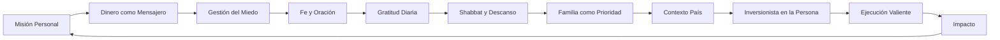
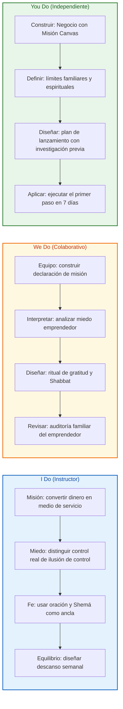
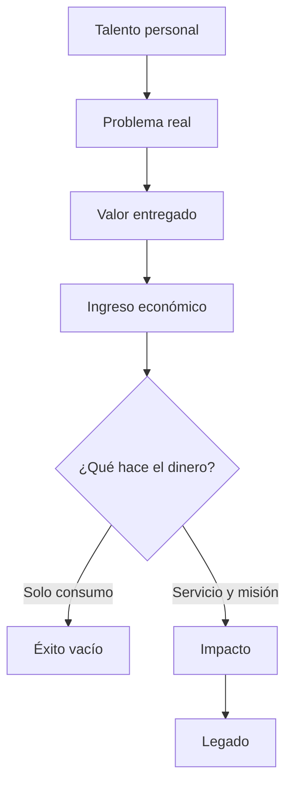
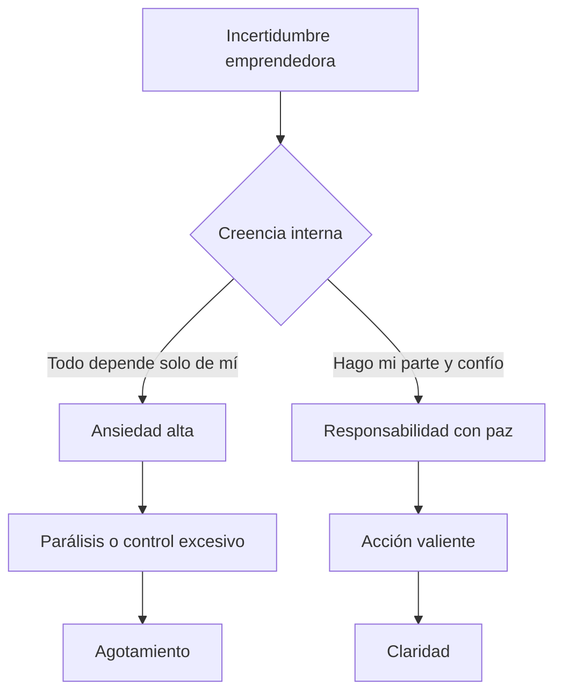
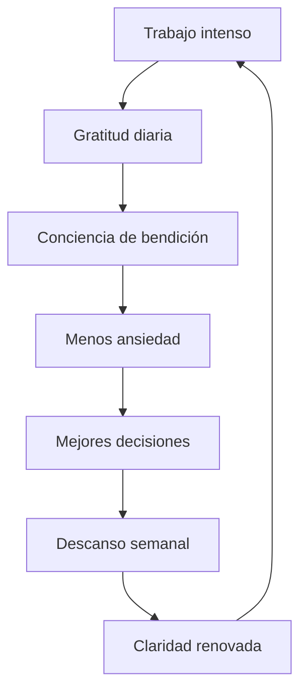
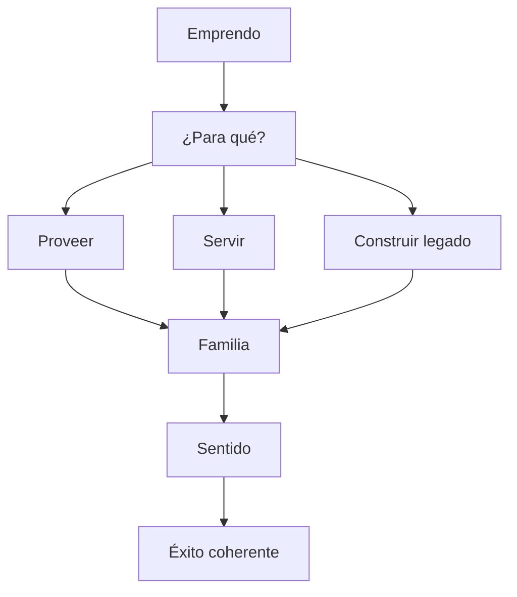
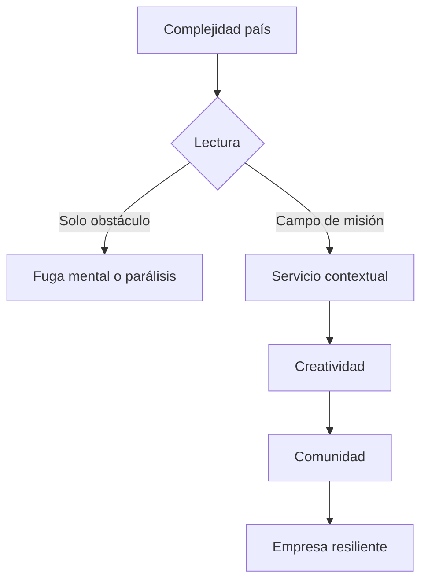
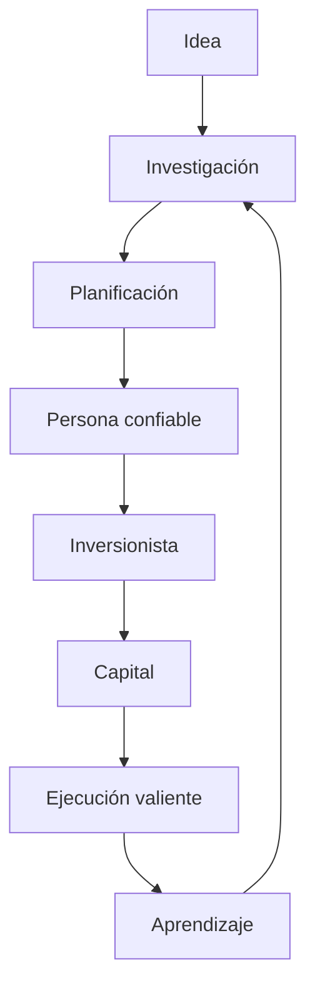
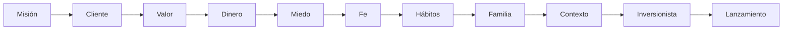

# MASTERCLASS: Negocio con Misión — Emprender desde Fe, Familia y Servicio con el Rabino Shui Rosenblum

## INTRODUCCIÓN: POR QUÉ ESTA MASTERCLASS ES DIFERENTE

La mayoría de las guías de emprendimiento empiezan por la idea, el mercado, el modelo de negocio o la inversión. Esta masterclass empieza por una pregunta más profunda: ¿para qué estás construyendo lo que estás construyendo?

En este episodio de Café con Emprendedores, Daniel entrevista al Rabino Shui Rosenblum, director de Jabad Venezuela. Con 31 años en el país, el rabino ofrece una perspectiva espiritual del emprendimiento: el negocio no existe solo para producir dinero, sino para servir a una misión personal y comunitaria.

El dinero no es el centro. El dinero es un mensajero.

El miedo no desaparece porque tengas un plan perfecto. Se reduce cuando reconoces que no controlas todos los resultados, pero sí eres responsable de actuar con integridad, preparación y valentía.

El descanso no es una pérdida de productividad. El Shabbat y los hábitos de gratitud funcionan como actos de fe: recordatorios de que tu vida no puede depender únicamente de tu esfuerzo constante.

La familia no es un obstáculo para el éxito. Es el núcleo desde el cual el éxito debe tener sentido.

Venezuela no se presenta como un escenario ideal desde la comodidad, sino como un lugar de misión, bendición y calidad humana.

> **Objetivo de Aprendizaje** — Al final de esta guía, podrás construir un marco de emprendimiento con misión: redefinir el rol del dinero, gestionar el miedo desde la fe, diseñar hábitos de equilibrio, priorizar la familia, leer tu contexto como campo de servicio y lanzarte con planificación y valentía.

> **Advertencia educativa** — Este contenido es formativo y espiritual. No sustituye asesoría religiosa, financiera, legal o psicológica profesional. Usa esta guía como marco de reflexión y acción emprendedora.

---

## MAPA DEL WORKFLOW DE NEGOCIO CON MISIÓN



| Fase | Pregunta que responde | Output principal |
|------|-----------------------|------------------|
| **Misión Personal** | ¿Qué bien quiero que pase a través de mi trabajo? | Declaración de misión |
| **Dinero como Mensajero** | ¿Estoy usando el dinero o el dinero me está usando a mí? | Relación sana con ingresos y crecimiento |
| **Gestión del Miedo** | ¿Qué estoy creyendo que controlo? | Mapa de ansiedad y control real |
| **Fe y Oración** | ¿Cómo sostengo mi acción cuando el resultado no depende solo de mí? | Práctica espiritual de anclaje |
| **Gratitud Diaria** | ¿Qué bendiciones ya están presentes? | Ritual diario de reconocimiento |
| **Shabbat y Descanso** | ¿Puedo parar sin colapsar? | Límites de descanso semanal |
| **Familia como Prioridad** | ¿Mi éxito profesional está destruyendo lo que dice proteger? | Auditoría familiar |
| **Contexto País** | ¿Qué oportunidad de servicio existe donde estoy? | Mapa de oportunidad local |
| **Inversionista en la Persona** | ¿Qué tipo de persona estoy construyendo además de mi empresa? | Narrativa de confianza |
| **Ejecución Valiente** | ¿Qué paso mínimo debo dar ahora? | Plan de lanzamiento |



---

## PARTE 1: MISIÓN DETRÁS DEL NEGOCIO — EL DINERO COMO MENSAJERO

### 1.1 Principio Central

La primera reestructuración que propone el rabino es cambiar la pregunta central del emprendimiento.

La pregunta no es solamente:

```text
¿Cuánto dinero puedo ganar?
```

La pregunta más profunda es:

```text
¿Qué bien puede pasar a través de mis manos, mi talento, mi empresa y mis recursos?
```

Emprender no se reduce a maximizar ingresos. El dinero puede ser una herramienta de servicio, protección, expansión, empleo, ayuda, educación, comunidad y legado. Pero cuando el dinero se convierte en objetivo final, el negocio pierde dirección espiritual.



### 1.2 Negocio centrado en dinero vs. negocio centrado en misión

| Negocio centrado en dinero | Negocio centrado en misión |
|----------------------------|----------------------------|
| Pregunta cuánto puede extraer | Pregunta cuánto puede aportar |
| Mide éxito solo por ganancia | Mide éxito por valor, servicio y sostenibilidad |
| Usa personas como recursos | Reconoce dignidad humana en clientes, equipo y comunidad |
| Se expande sin límites | Crece con responsabilidad |
| Ve el fracaso como humillación | Ve el fracaso como aprendizaje |
| El dinero es objetivo final | El dinero es mensajero de una misión |

### 1.3 El dinero como mensajero

El dinero comunica algo. Puede comunicar codicia, miedo, generosidad, responsabilidad, vanidad, servicio o bendición. No es neutral porque nunca actúa solo: siempre está conectado con la intención de quien lo administra.

| Intención detrás del dinero | Mensaje que transmite |
|-----------------------------|-----------------------|
| Miedo | Necesito acumular para sentirme seguro |
| Vanidad | Necesito demostrar que valgo |
| Control | Necesito que todo dependa de mí |
| Servicio | Necesito recursos para hacer más bien |
| Legado | Necesito construir algo que siga ayudando |
| Libertad | Necesito margen para elegir mejor |

### 1.4 Protocolo del dinero como mensajero

```python
class DineroComoMensajero:
    def __init__(self, ingreso, proposito):
        self.ingreso = ingreso
        self.proposito = proposito
        self.usos = []

    def asignar(self, porcentaje, uso):
        self.usos.append({
            "porcentaje": porcentaje,
            "uso": uso,
            "mision": self.proposito,
        })

    def revisar_intencion(self):
        if not self.proposito:
            return "El dinero se volvió objetivo en sí mismo"
        if not self.usos:
            return "El ingreso existe, pero no tiene dirección"
        return "El dinero está alineado con una misión"

    def distribucion_base(self):
        return {
            "sostenibilidad": "mantener el negocio vivo",
            "familia": "proteger el núcleo personal",
            "equipo": "pagar con justicia",
            "comunidad": "contribuir al entorno",
            "crecimiento": "expandir capacidad de servicio",
        }
```

### 1.5 Señales de que tu negocio perdió la misión

| Señal | Lo que parece | Lo que puede significar |
|-------|---------------|-------------------------|
| Trabajas más pero sientes menos propósito | Crecimiento | Desalineación |
| Cada decisión se reduce a dinero rápido | Pragmatismo | Pérdida de valores |
| Te cuesta celebrar el éxito | Humildad | Vacío de sentido |
| Ves clientes solo como ventas | Enfoque comercial | Reducción humana |
| No sabes para quién estás sirviendo | Estrategia | Falta de misión |
| El crecimiento aumenta ansiedad | Ambición | Falta de fe y límites |

### 1.6 Ejercicio: Declaración de misión en cinco capas

| Capa | Pregunta | Respuesta |
|------|----------|-----------|
| **1. Problema** | ¿Qué dolor, necesidad o deseo atiende mi negocio? | |
| **2. Personas** | ¿A quién quiero servir específicamente? | |
| **3. Valor** | ¿Qué transformación ofrezco? | |
| **4. Dinero** | ¿Cómo se convierte el ingreso en bien? | |
| **5. Legado** | ¿Qué quiero que siga existiendo gracias a este trabajo? | |

```text
Mi negocio existe para servir a ____________________________.

Ayudo a resolver __________________________________________.

La transformación que ofrezco es __________________________.

El dinero que recibo se convierte en ______________________.

El legado que quiero construir es __________________________.
```

### 1.7 I Do — Diagnóstico de misión

**Objetivo:** distinguir entre un negocio que solo busca dinero y un negocio que usa el dinero para una misión.

| Paso | Acción | Resultado |
|------|--------|-----------|
| 1 | Escribe cuánto dinero quieres ganar | Claridad material |
| 2 | Escribe qué quieres hacer con ese dinero | Dirección |
| 3 | Identifica a quién beneficia | Alcance |
| 4 | Define qué valor no negociarías por dinero | Límite ético |
| 5 | Redacta una misión de una frase | Declaración inicial |

### 1.8 We Do — Convertir una idea en misión

**Caso:** una persona quiere abrir un restaurante.

| Pregunta superficial | Pregunta con misión |
|----------------------|---------------------|
| ¿Cuánto puedo vender? | ¿Qué experiencia quiero crear para las personas? |
| ¿Qué menú es más rentable? | ¿Qué alimento, cultura o encuentro quiero servir? |
| ¿Cómo reduzco costos? | ¿Cómo pago justamente y evito dañar calidad? |
| ¿Cómo atraigo más clientes? | ¿Cómo genero comunidad alrededor de la mesa? |
| ¿Cómo escalo? | ¿Cómo mantengo propósito al crecer? |

### 1.9 You Do — Tu frase de misión

Escribe una frase que combine negocio, servicio y dinero como mensajero.

| Elemento | Ejemplo |
|----------|---------|
| A quién sirves | Familias que necesitan alimentación saludable |
| Qué problema resuelves | Falta de tiempo y opciones nutritivas |
| Qué valor entregas | Comidas prácticas, sanas y cercanas |
| Qué hace el dinero | Sostiene empleo, crecimiento y ayuda comunitaria |
| Frase final | "Mi negocio ayuda a familias ocupadas a comer mejor, mientras usa sus ingresos para generar empleo digno y servir a la comunidad" |

---

## PARTE 2: GESTIÓN DEL MIEDO Y LA ANSIEDAD — FE FRENTE A LA ILUSIÓN DE CONTROL

### 2.1 Principio Central

El miedo a emprender muchas veces nace de una creencia equivocada: creer que si planificamos todo, controlaremos el resultado.

El rabino señala una paradoja espiritual: mientras más crees que todo depende exclusivamente de ti, más ansiedad produces. La fe no elimina la responsabilidad de prepararse. La fe reordena la responsabilidad: haces tu parte con excelencia y reconoces que el resultado final no está completamente en tus manos.



### 2.2 Control real vs. control aparente

| Control real | Control aparente |
|--------------|------------------|
| Prepararte | Garantizar el resultado |
| Investigar | Predecir el mercado |
| Practicar | Controlar la reacción de otros |
| Ahorrar | Evitar toda pérdida |
| Orar | Tener certeza absoluta |
| Ejecutar | No equivocarte nunca |
| Aprender | Controlar el timing perfecto |
| Ser íntegro | Controlar todas las variables externas |

### 2.3 El miedo emprendedor común

| Miedo | Creencia oculta | Recalibración |
|-------|-----------------|---------------|
| Miedo a fracasar | Si fracaso, no valgo | El fracaso es información, no identidad |
| Miedo a perder dinero | Si pierdo, quedo desprotegido | La protección también requiere fe y acción prudente |
| Miedo al qué dirán | Mi valor depende de la opinión pública | La misión vale más que la aprobación |
| Miedo a no controlar | Necesito certeza total | La fe sostiene la acción sin certeza absoluta |
| Miedo a decepcionar | Debo complacer a todos | La responsabilidad no es controlarlo todo |
| Miedo a empezar | Si no empieza, no falla | La parálisis también tiene costo |

### 2.4 Fe como recalibración de la ansiedad

La fe no es pasividad. En el marco del episodio, la fe aparece como una forma de sostener la acción cuando el resultado no está completamente bajo tu control.

| Sin fe | Con fe |
|--------|--------|
| Hago todo solo | Hago mi parte y reconozco una soberanía mayor |
| Necesito controlar el resultado | Necesito ser fiel al proceso |
| La ansiedad domina la decisión | La responsabilidad guía la acción |
| El error destruye mi identidad | El error enseña y corrige |
| El descanso parece peligroso | El descanso confirma que no soy Dios |

### 2.5 Shemá como práctica de enfoque

El rabino menciona la importancia de la fe y la oración, citando el Shemá. En este contexto práctico, el Shemá puede entenderse como una práctica de centralizar la atención: recordar que hay una verdad mayor que tu ansiedad inmediata.

No se trata de repetir palabras para evitar actuar. Se trata de volver al centro antes de actuar.

```text
Pausa → Recuerdo → Declaro → Actúo
```

| Momento | Práctica | Efecto |
|---------|----------|--------|
| Antes de decidir | Pausar y respirar | Reduce reacción impulsiva |
| Antes de lanzar | Recordar tu misión | Ordena prioridades |
| Ante la ansiedad | Declarar confianza | Reduce ilusión de control |
| Después de actuar | Soltar resultado | Evita obsesión |

### 2.6 Mapa de ansiedad emprendedora

```python
class MapaAnsiedad:
    def __init__(self, miedo):
        self.miedo = miedo
        self.control_real = []
        self.control_aparente = []
        self.accion_fe = ""

    def diagnosticar(self):
        return {
            "miedo": self.miedo,
            "creencia": self._creencia_oculta(),
            "energia": "ansiedad",
        }

    def _creencia_oculta(self):
        return "Estoy creyendo que debo controlar el resultado final"

    def agregar_control_real(self, accion):
        self.control_real.append(accion)

    def soltar_control_aparente(self, resultado):
        self.control_aparente.append(resultado)

    def accion_con_fe(self):
        return {
            "preparacion": self.control_real,
            "soltar": self.control_aparente,
            "siguiente_paso": self.accion_fe,
        }
```

### 2.7 Señales de que la ansiedad está tomando decisiones

| Señal | Riesgo | Corrección |
|-------|--------|------------|
| Pospones el lanzamiento indefinidamente | Parálisis | Definir siguiente paso mínimo |
| Cambias de idea cada semana | Inestabilidad | Mantener criterio 30 días |
| Pides opinión a demasiadas personas | Confusión | Consultar solo mentores clave |
| Revisas números obsesivamente | Miedo | Revisar con horario definido |
| Trabajas sin descanso | Falsa seguridad | Programar Shabbat o descanso semanal |
| Confundes urgencia con importancia | Caos | Priorizar misión y familia |

### 2.8 I Do — Reclasificar un miedo

**Objetivo:** convertir un miedo abstracto en acciones concretas y soltar lo incontrolable.

| Paso | Acción | Resultado |
|------|--------|-----------|
| 1 | Escribe tu miedo principal | Miedo identificado |
| 2 | Escribe qué crees que debes controlar | Creencia oculta |
| 3 | Separa lo que sí puedes hacer | Acciones reales |
| 4 | Separa lo que no puedes controlar | Soltar resultado |
| 5 | Define una acción de fe | Paso concreto |

### 2.9 We Do — Analizar un caso de miedo

**Caso:** alguien quiere lanzar una consultora, pero teme no conseguir clientes.

| Pregunta | Respuesta esperada |
|----------|--------------------|
| ¿Qué controla? | Oferta, portafolio, conversaciones, propuesta de valor |
| ¿Qué no controla? | Decisión inmediata de cada prospecto |
| ¿Cuál es la acción realista? | Hablar con 30 prospectos en 30 días |
| ¿Cuál es la práctica de fe? | Hacer su parte y no convertir cada no en sentencia |
| ¿Cuál es el límite saludable? | No sacrificar familia ni descanso por ansiedad |

### 2.10 You Do — Tu mapa de miedo

Completa esta tabla con tu situación real.

| Miedo | Control real | Control aparente | Acción con fe |
|-------|--------------|------------------|---------------|
| | | | |
| | | | |
| | | | |

---

## PARTE 3: HÁBITOS Y EQUILIBRIO — GRATITUD DIARIA Y SHABBAT

### 3.1 Principio Central

El equilibrio no es un lujo para emprendedores. Es una estructura espiritual y operativa.

El rabino destaca hábitos como la gratitud diaria y el Shabbat. La gratitud cambia la percepción: deja de mirar solo lo que falta y empieza a reconocer lo que ya está presente. El Shabbat introduce un límite: hay un tiempo para trabajar y un tiempo para parar.

Descansar no significa abandonar tu responsabilidad. Significa reconocer que tu vida no puede depender únicamente de tu esfuerzo constante.



### 3.2 Gratitud diaria como antídoto contra la escasez

La gratitud no niega los problemas. Los ordena. Una persona agradecida no dice que todo está perfecto; dice que no todo está roto.

| Sin gratitud | Con gratitud |
|--------------|--------------|
| Ves solo lo que falta | Ves también lo recibido |
| Comparas constantemente | Reconoces tu camino |
| Trabajas desde carencia | Trabajas desde abundancia responsable |
| El éxito nunca alcanza | Cada avance tiene valor |
| La ansiedad domina | La confianza crece |

### 3.3 Ritual de gratitud diaria

```text
Cada noche, responde:

1. ¿Qué recibí hoy que no merecía por esfuerzo propio?
2. ¿Quién me ayudó de alguna forma?
3. ¿Qué problema fue menor de lo que imaginaba?
4. ¿Qué oportunidad apareció en medio de una dificultad?
5. ¿Por qué puedo descansar hoy?
```

### 3.4 Shabbat como acto de fe

El Shabbat no es simplemente un día libre. En esta masterclass lo abordamos como un sistema de límites espirituales: un tiempo semanal para dejar de producir, dejar de optimizar y recordar que tu valor no depende de tu productividad.

| Elemento | Significado práctico |
|----------|----------------------|
| Parar de trabajar | Reconocer límites humanos |
| No optimizar | Soltar control operativo |
| Estar con familia | Reordenar prioridades |
| Orar y estudiar | Conectar con sentido |
| Comer y descansar | Recibir el mundo como regalo |
| Volver el domingo | Retomar con claridad |

### 3.5 Descanso semanal y mentalidad emprendedora

| Creencia emprendedora común | Recalibración |
|-----------------------------|---------------|
| Si paro, pierdo | Si nunca paro, pierdo claridad |
| El descanso es para cuando termine | El descanso es parte del sistema |
| Trabajar más siempre produce más | La claridad también produce mejores decisiones |
| Mi empresa depende de mi esfuerzo constante | Mi empresa necesita dirección, límites y confianza |
| Descansar es debilidad | Descansar es fe en acción |

### 3.6 Sistema de equilibrio

```python
class SistemaEquilibrio:
    def __init__(self):
        self.gratitud_diaria = []
        self.descanso_semanal = False
        self.familia = 0
        self.trabajo = 0

    def registrar_gratitud(self, item):
        self.gratitud_diaria.append(item)

    def activar_descanso_semanal(self):
        self.descanso_semanal = True

    def balance(self):
        if self.trabajo > 0 and self.familia == 0:
            return "Desequilibrio: el éxito profesional está desplazando el núcleo"
        if self.descanso_semanal and self.gratitud_diaria:
            return "Equilibrio: trabajo con fe, descanso y reconocimiento"
        return "Revisar hábitos"
```

### 3.7 Hábitos mínimos recomendados

| Hábito | Frecuencia | Duración mínima | Propósito |
|--------|------------|-----------------|-----------|
| Gratitud diaria | Todos los días | 3 minutos | Reordenar percepción |
| Revisión de misión | Semanal | 10 minutos | Alinear decisiones |
| Descanso semanal | Semanal | 24 horas o bloque protegido | Fe y recuperación |
| Conversación familiar | Semanal | 30 minutos | Prioridad real |
| Revisión de finanzas | Semanal | 20 minutos | Orden sin obsesión |
| Oración o reflexión | Diario | 5 minutos | Centro espiritual |

### 3.8 Señales de desequilibrio

| Señal | Lo que estás sacrificando | Riesgo |
|-------|---------------------------|--------|
| Trabajas de noche todos los días | Sueño y claridad | Agotamiento |
| Cancelas familia repetidamente | Vínculos | Éxito vacío |
| No puedes descansar sin culpa | Paz | Ansiedad crónica |
| Revisas el negocio en cada momento libre | Presencia | Vida fragmentada |
| No agradeces nada porque falta algo | Alegría | Mentalidad de escasez |
| Confundes urgencia con misión | Discernimiento | Caos |

### 3.9 I Do — Rutina diaria de gratitud

**Objetivo:** crear un hábito simple que no dependa de motivación.

| Paso | Acción | Resultado |
|------|--------|-----------|
| 1 | Elegir hora fija | Constancia |
| 2 | Escribir tres bendiciones | Reconocimiento |
| 3 | Nombrar una persona que ayudó | Humildad |
| 4 | Identificar una dificultad reinterpretada | Resiliencia |
| 5 | Cerrar con intención de descanso | Paz |

### 3.10 We Do — Diseñar un Shabbat emprendedor

**Escenario:** tienes un negocio digital y sientes que si desconectas, algo se rompe.

| Pregunta | Respuesta esperada |
|----------|--------------------|
| ¿Qué debe quedar protegido? | Familia, oración, descanso, comida, presencia |
| ¿Qué puedes delegar o apagar? | Notificaciones, métricas, tareas no urgentes |
| ¿Qué límite comunicas? | Horario de desconexión y emergencia real |
| ¿Qué haces antes de parar? | Cerrar pendientes críticos |
| ¿Qué haces al volver? | Revisar con calma, no con pánico |

### 3.11 You Do — Tu regla de equilibrio

Completa:

```text
Durante los próximos 30 días, practicaré gratitud diaria escribiendo:
1. ______________________________________
2. ______________________________________
3. ______________________________________

Mi descanso semanal será:
Día/horario: ______________________________________
Límite principal: __________________________________
Actividad central: _________________________________

Mi familia sabrá que este límite significa:
__________________________________________________
```

---

## PARTE 4: FAMILIA COMO PRIORIDAD — EL ÉXITO QUE NO DEBE CONTRADECIRSE

### 4.1 Principio Central

La familia no es un accesorio del éxito. Es el núcleo de la sociedad y una de las razones principales por las que muchas personas emprenden.

El rabino plantea una contradicción fundamental: no puedes construir un negocio para proteger o mejorar la vida de tu familia si, en el proceso, destruyes la relación con esa familia.



### 4.2 Familia como núcleo, no como costo

| Visión distorsionada | Visión con misión |
|----------------------|-------------------|
| Mi familia espera mientras construyo | Mi familia es parte del propósito |
| Ahora sacrifico todo, luego recupero | Algunas pérdidas no se recuperan |
| El negocio justifica mi ausencia | El negocio debe servir a la vida, no reemplazarla |
| El éxito profesional compensa lo familiar | El éxito incompleto no compensa vínculos rotos |
| Trabajo para mi familia en silencio | También debo estar presente de forma visible |

### 4.3 La contradicción del emprendedor ausente

| Frase común | Contradicción |
|-------------|---------------|
| "Lo hago por mi familia" | Pero tu familia no recibe tu presencia |
| "Es solo por ahora" | El ahora se convierte en estilo de vida |
| "No entienden mi presión" | No estás comunicando ni invitando |
| "Cuando tenga éxito, estaré más" | El éxito puede aumentar demandas |
| "Necesito sacrificarme" | El sacrificio no debe volverse abandono |

### 4.4 Auditoría familiar del emprendedor

| Área | Pregunta | Puntuación 1-5 |
|------|----------|----------------|
| Presencia física | ¿Estoy realmente disponible en casa? | |
| Presencia emocional | ¿Escucho sin estar mentalmente en el negocio? | |
| Tiempo protegido | ¿Tengo momentos sin celular ni trabajo? | |
| Coherencia | ¿Mis valores familiares se practican o solo se predican? | |
| Descanso compartido | ¿Mi familia recibe mi descanso o mi agotamiento? | |
| Comunicación | ¿Explico mis metas sin usarlas como excusa? | |
| Servicio | ¿Ayudo en casa o solo proveo dinero? | |
| Legado | ¿Qué recordarán mis hijos o seres queridos de esta etapa? | |

### 4.5 Límites familiares no negociables

| Límite | Ejemplo | Motivo |
|--------|---------|--------|
| Cena sin celular | 30 minutos diarios | Presencia |
| Día o bloque familiar | Domingo por la mañana | Memoria familiar |
| Horario de cierre | No revisar métricas después de cierta hora | Descanso |
| Conversación semanal | Revisar estado familiar | Comunicación |
| Vacaciones protegidas | Sin trabajo salvo emergencia real | Recuerdo compartido |
| Oración o reflexión familiar | Momento semanal | Sentido |

### 4.6 El dinero como servicio familiar

El dinero puede proteger a la familia, pero no puede reemplazar a la familia.

| Dinero puede comprar | Dinero no puede comprar |
|----------------------|-------------------------|
| Mejor vivienda | Presencia real |
| Educación | Confianza |
| Seguridad | Tiempo recuperado |
| Viajes | Escucha |
| Comodidad | Vínculo |
| Oportunidades | Legado emocional |

### 4.7 I Do — Auditoría familiar guiada

**Objetivo:** detectar contradicciones entre tu discurso de éxito y tu vida familiar real.

| Paso | Acción | Resultado |
|------|--------|-----------|
| 1 | Escribe por qué emprendes | Propósito declarado |
| 2 | Escribe a quién dices servir | Familia objetivo |
| 3 | Evalúa presencia real | Brecha |
| 4 | Identifica una excusa frecuente | Patrón |
| 5 | Define un límite no negociable | Corrección |

### 4.8 We Do — Rediseñar una semana

**Escenario:** una persona trabaja 70 horas semanales y dice que lo hace por su familia.

| Área | Estado actual | Rediseño |
|------|---------------|----------|
| Celular en casa | Siempre activo | Bloque sin notificaciones |
| Cenas | Irregulares | 4 cenas protegidas |
| Descanso | Inexistente | Medio día semanal |
| Conversación | Solo logística | 20 minutos de escucha real |
| Trabajo nocturno | Diario | Máximo 2 noches planificadas |
| Familia | Recibe sobras de energía | Recibe energía protegida |

### 4.9 You Do — Tu contrato familiar

Completa:

```text
Emprendo para servir a mi familia de estas formas:
1. ______________________________________
2. ______________________________________
3. ______________________________________

Pero no quiero que mi familia recuerde esta etapa como:
__________________________________________________

Durante los próximos 30 días, protegeré:
Momento: ______________________________________
Límite: _______________________________________
Acción concreta: ______________________________
```

---

## PARTE 5: EMPRENDER EN VENEZUELA — MISIÓN EN MEDIO DE LA COMPLEJIDAD

### 5.1 Principio Central

El rabino explica por qué sigue eligiendo Venezuela a pesar de la situación país. Su respuesta no es ingenua ni romantiza la crisis. Se basa en una lectura espiritual: el lugar donde hay necesidad también puede ser un campo de bendición, servicio y misión.

Venezuela aparece en el episodio como un territorio difícil, pero lleno de calidad humana. Para un emprendedor, esto cambia la pregunta:

```text
¿Por qué emprender aquí?
```

por:

```text
¿Qué bien puedo construir precisamente aquí?
```



### 5.2 No romantizar la crisis, pero tampoco reducirla a crisis

| Error común | Recalibración |
|-------------|---------------|
| Ignorar la dificultad | Reconocer la realidad sin quedar atrapado en ella |
| Convertir queja en identidad | Buscar oportunidad dentro de la necesidad |
| Compararse con países estables | Servir desde el contexto concreto |
| Esperar condiciones perfectas | Construir con recursos disponibles |
| Ver solo carencia | Ver también resiliencia, fe y creatividad |

### 5.3 Mapa de bendiciones en contexto difícil

| Dificultad | Bendición o capacidad visible | Oportunidad emprendedora |
|------------|-------------------------------|--------------------------|
| Inestabilidad económica | Adaptabilidad | Modelos flexibles |
| Migración | Redes internacionales | Comercio, servicios y comunidad |
| Escasez de confianza | Valor de la reputación | Marcas honestas |
| Necesidad social | Sentido de servicio | Soluciones accesibles |
| Creatividad forzada | Innovación práctica | Productos simples y útiles |
| Comunidad resiliente | Vínculos fuertes | Negocios con propósito |

### 5.4 Venezuela como lugar de misión

El rabino destaca la calidad humana de la gente venezolana. En un marco de negocio con misión, la calidad humana no es solo un dato emocional: es capital social.

| Capital | Cómo se manifiesta | Cómo se convierte en negocio |
|---------|--------------------|------------------------------|
| Resiliencia | Capacidad de seguir | Equipos que soportan cambios |
| Creatividad | Soluciones con pocos recursos | Innovación frugal |
| Comunidad | Redes de ayuda | Clientes fieles y referidos |
| Fe | Sentido en dificultad | Propósito compartido |
| Hospitalidad | Trato humano | Experiencia diferenciada |

### 5.5 Preguntas para emprender en contexto difícil

| Pregunta | Por qué importa |
|----------|-----------------|
| ¿Qué necesidad real veo todos los días? | La necesidad cercana suele ser oportunidad |
| ¿Qué problema puedo resolver con recursos limitados? | La simplicidad sobrevive mejor |
| ¿A quién puedo servir mejor que otros? | El nicho reduce dispersión |
| ¿Qué confianza puedo construir? | En entornos difíciles, confianza es ventaja |
| ¿Qué bien puede quedar después de mi empresa? | La misión sostiene la resistencia |

### 5.6 Matriz de oportunidad local

```python
class OportunidadLocal:
    def __init__(self, contexto):
        self.contexto = contexto
        self.necesidad = []
        self.capacidad = []
        self.comunidad = []
        self.servicio = ""

    def agregar_necesidad(self, item):
        self.necesidad.append(item)

    def agregar_capacidad(self, item):
        self.capacidad.append(item)

    def agregar_comunidad(self, item):
        self.comunidad.append(item)

    def evaluar(self):
        if self.necesidad and self.capacidad and self.comunidad:
            return "Hay base para una oportunidad con misión"
        return "Falta claridad: investigar más"
```

### 5.7 Señales de oportunidad en Venezuela

| Señal | Lectura |
|-------|---------|
| Muchas personas resuelven problemas de forma improvisada | Hay demanda de soluciones más ordenadas |
| La confianza es escasa | Una marca confiable puede destacar |
| Hay redes comunitarias fuertes | El boca a boca puede crecer rápido |
| Los recursos son limitados | La simplicidad es ventaja |
| La gente valora el trato humano | La experiencia puede diferenciarte |
| Hay dolor social visible | El servicio puede ser parte del modelo |

### 5.8 I Do — Mapa de contexto

**Objetivo:** dejar de ver el país solo como obstáculo y empezar a leerlo como campo de oportunidad.

| Paso | Acción | Resultado |
|------|--------|-----------|
| 1 | Lista 5 dificultades reales | Realismo |
| 2 | Lista 5 capacidades humanas visibles | Bendiciones |
| 3 | Identifica 3 necesidades repetidas | Oportunidad |
| 4 | Define qué problema puedes atender | Enfoque |
| 5 | Redacta una misión contextual | Sentido |

### 5.9 We Do — De dificultad a oportunidad

**Caso:** una ciudad tiene problemas de transporte y logística.

| Dificultad | Necesidad | Oportunidad |
|------------|-----------|-------------|
| Transporte irregular | Entregas confiables | Servicio logístico local |
| Poca confianza | Trazabilidad | Sistema de seguimiento simple |
| Costos altos | Optimización | Rutas compartidas |
| Clientes frustrados | Comunicación | Atención humana y clara |
| Comercios pequeños | Escala limitada | Red de distribución comunitaria |

### 5.10 You Do — Tu oportunidad venezolana

Completa:

```text
Una dificultad real de mi contexto es:
__________________________________________________

Una capacidad humana que veo en mi comunidad es:
__________________________________________________

Una necesidad que puedo atender es:
__________________________________________________

Una forma de servir con mi negocio es:
__________________________________________________
```

---

## PARTE 6: CONSEJOS PARA EMPRENDEDORES — INVERSIÓN, PERSONA Y LANZAMIENTO

### 6.1 Principio Central

El rabino ofrece un consejo claro: los inversionistas no solo financian un proyecto; invierten en la persona.

Esto cambia la lógica del emprendedor. No basta con tener una idea atractiva. Debes construir una persona confiable, preparada, transparente y valiente.

La ejecución también importa. Después de investigar y planificar, llega un momento en que la valentía debe superar la búsqueda infinita de certeza.



### 6.2 El inversionista invierte en la persona

| Lo que cree el emprendedor | Lo que ve el inversionista |
|----------------------------|----------------------------|
| "Tengo una gran idea" | ¿Puedes ejecutarla? |
| "Necesito dinero" | ¿Puedo confiar en cómo la usarás? |
| "El mercado es enorme" | ¿Entiendes al cliente real? |
| "Mi plan es perfecto" | ¿Puedes adaptarte cuando falle? |
| "Quiero crecer rápido" | ¿Tienes disciplina y carácter? |

### 6.3 Atributos que construyen confianza

| Atributo | Cómo se demuestra |
|----------|-------------------|
| Integridad | Dices la verdad incluso cuando incomoda |
| Claridad | Sabes explicar problema, cliente y modelo |
| Disciplina | Haces lo que dices que harás |
| Humildad | Escuchas feedback sin defenderte |
| Valentía | Actúas después de preparar |
| Responsabilidad | Asumes errores y corriges |
| Misión | No solo buscas dinero rápido |
| Cuidado familiar | Tienes límites y no eres caos humano |

### 6.4 Investigación antes de lanzarse

Lanzarse no significa improvisar. El consejo del rabino combina investigación, planificación y valentía.

| Etapa | Pregunta | Output |
|-------|----------|--------|
| Investigación | ¿Existe el problema? | Entrevistas y datos |
| Cliente | ¿Quién lo vive más fuerte? | Perfil claro |
| Solución | ¿Qué ofreces? | Propuesta simple |
| Modelo | ¿Cómo se sostiene? | Ingresos y costos |
| Riesgo | ¿Qué puede fallar? | Plan de mitigación |
| Fe | ¿Qué no controlo? | Soltar resultado |
| Acción | ¿Cuál es el siguiente paso? | Lanzamiento mínimo |

### 6.5 Checklist de lanzamiento con valentía

```python
class LanzamientoConValentia:
    def __init__(self):
        self.investigacion = False
        self.plan = False
        self.cliente_claro = False
        self.primer_paso = ""
        self.miedo = ""

    def investigar(self, entrevistas, datos):
        self.investigacion = entrevistas >= 10 and datos

    def planificar(self, costo, precio, canal):
        self.plan = bool(costo and precio and canal)

    def definir_cliente(self, cliente):
        self.cliente_claro = bool(cliente)

    def lanzar(self):
        if self.investigacion and self.plan and self.cliente_claro:
            return "Ejecuta el primer paso"
        return "Prepara más antes de lanzar"
```

### 6.6 La trampa de la preparación infinita

| Preparación sana | Preparación infinita |
|------------------|----------------------|
| Reduce riesgos importantes | Evita exposición |
| Tiene fecha límite | Siempre pide más tiempo |
| Genera confianza | Genera ansiedad |
| Lleva a acción | Posterga acción |
| Acepta incertidumbre | Busca certeza imposible |

### 6.7 Fórmula de valentía emprendedora

```text
Valentía = investigación suficiente + planificación mínima + acción concreta + fe para soltar resultado
```

| Componente | Riesgo si falta |
|------------|-----------------|
| Investigación suficiente | Improvisación |
| Planificación mínima | Caos |
| Acción concreta | Parálisis |
| Fe para soltar | Ansiedad |
| Misión clara | Vacío |

### 6.8 Señales de que estás listo para lanzarte

| Señal | Interpretación |
|-------|----------------|
| Entiendes el problema del cliente | No estás vendiendo al aire |
| Tienes una oferta simple | Puedes empezar sin complejidad |
| Sabes cuánto cuesta y cómo cobrar | Hay base económica |
| Hablaste con personas reales | Hay validación inicial |
| Tienes miedo pero puedes actuar | La valentía no requiere ausencia de miedo |
| Tu familia y descanso tienen límites | No estás construyendo sobre autodestrucción |
| El dinero tiene misión | No estás persiguiendo solo ganancia |

### 6.9 I Do — Preparar una conversación con inversionista

**Objetivo:** comunicar que el proyecto no solo necesita capital, sino una persona confiable.

| Pregunta del inversionista | Respuesta esperada |
|----------------------------|--------------------|
| ¿Por qué tú? | Historia, experiencia, disciplina |
| ¿Qué problema resuelves? | Cliente y dolor claros |
| ¿Qué investigaste? | Entrevistas y datos |
| ¿Qué harás con el capital? | Uso específico |
| ¿Qué riesgos ves? | Honestidad |
| ¿Cuál es tu misión? | Sentido más allá del dinero |

### 6.10 We Do — Diseñar un lanzamiento mínimo

**Escenario:** quieres vender un servicio profesional.

| Elemento | Lanzamiento mínimo |
|----------|--------------------|
| Cliente | 20 personas específicas |
| Oferta | Una solución clara |
| Prueba | 5 conversaciones |
| Precio | Propuesta inicial |
| Canal | WhatsApp, LinkedIn o referidos |
| Métrica | Conversaciones agendadas |
| Límite | No sacrificar familia ni descanso |
| Fe | Soltar respuestas inmediatas |

### 6.11 You Do — Tu plan de lanzamiento

Completa:

```text
Mi próximo lanzamiento será:
__________________________________________________

He investigado con:
Número de personas entrevistadas: __________________

Mi cliente ideal es:
__________________________________________________

Mi oferta inicial es:
__________________________________________________

El primer paso que debo ejecutar es:
__________________________________________________

La fecha límite para ejecutarlo es:
__________________________________________________

Lo que no controlo y debo soltar es:
__________________________________________________
```

---

## PARTE 7: NEGOCIO CON MISIÓN CANVAS — EL MARCO COMPLETO

### 7.1 Principio Central

La masterclass necesita convertirse en sistema. El Negocio con Misión Canvas une los temas del episodio en una sola herramienta práctica: dinero, fe, miedo, hábitos, familia, contexto, inversión y lanzamiento.

No es un canvas para llenar una vez. Es un mapa vivo para revisar antes de tomar decisiones importantes.



### 7.2 Canvas completo

| Bloque | Pregunta guía | Output |
|--------|---------------|--------|
| **Misión** | ¿Qué bien quiero que pase a través de este negocio? | Declaración de misión |
| **Cliente** | ¿A quién sirvo específicamente? | Perfil de cliente |
| **Problema** | ¿Qué dolor o necesidad resuelvo? | Problema validado |
| **Valor** | ¿Qué transformación ofrezco? | Propuesta clara |
| **Dinero** | ¿Cómo se convierte el ingreso en bien? | Uso alineado |
| **Miedo** | ¿Qué estoy creyendo que controlo? | Mapa de ansiedad |
| **Fe** | ¿Cómo sostengo la acción sin control total? | Práctica espiritual |
| **Hábitos** | ¿Qué rutinas me mantienen centrado? | Gratitud y descanso |
| **Familia** | ¿Mi éxito protege o desplaza a mi familia? | Límites familiares |
| **Contexto** | ¿Qué oportunidad existe donde estoy? | Mapa local |
| **Inversionista** | ¿Qué confianza estoy construyendo? | Narrativa personal |
| **Lanzamiento** | ¿Cuál es el siguiente paso valiente? | Acción concreta |

### 7.3 Plantilla de uso

```text
1. Misión:
__________________________________________________

2. Cliente:
__________________________________________________

3. Problema:
__________________________________________________

4. Valor:
__________________________________________________

5. Dinero como mensajero:
__________________________________________________

6. Miedo principal:
__________________________________________________

7. Control real:
__________________________________________________

8. Control aparente:
__________________________________________________

9. Práctica de fe:
__________________________________________________

10. Gratitud diaria:
__________________________________________________

11. Descanso semanal:
__________________________________________________

12. Límite familiar:
__________________________________________________

13. Oportunidad en mi contexto:
__________________________________________________

14. Confianza que debo construir:
__________________________________________________

15. Próximo paso de lanzamiento:
__________________________________________________
```

### 7.4 Revisión semanal

| Pregunta | Respuesta |
|----------|-----------|
| ¿Tomé decisiones alineadas con mi misión? | |
| ¿Usé el dinero como medio o como fin? | |
| ¿Qué miedo apareció? | |
| ¿Qué acción real tomé? | |
| ¿Qué resultado solté? | |
| ¿Practiqué gratitud? | |
| ¿Respeté descanso y familia? | |
| ¿Qué aprendí del contexto? | |
| ¿Construí confianza con otros? | |
| ¿Cuál es el siguiente paso? | |

### 7.5 Semáforo de alineación

| Estado | Señal | Acción |
|--------|-------|--------|
| **Verde** | Misión, dinero, familia y fe están alineados | Continuar y escalar con cuidado |
| **Amarillo** | Hay crecimiento, pero aparecen desequilibrios | Revisar límites y hábitos |
| **Rojo** | El negocio está dañando familia, fe o integridad | Pausar, corregir o rediseñar |

### 7.6 I Do — Llenar el canvas con un ejemplo

**Caso:** una persona quiere crear una academia online de formación profesional.

| Bloque | Ejemplo |
|--------|---------|
| Misión | Ayudar a jóvenes a conseguir mejores oportunidades |
| Cliente | Estudiantes y profesionales jóvenes |
| Problema | Falta de habilidades prácticas |
| Valor | Cursos cortos, aplicables y acompañados |
| Dinero | Sostener instructores y becas |
| Miedo | No vender suficiente |
| Control real | Crear piloto y hablar con 30 personas |
| Control aparente | Que todos compren |
| Fe | Orar, preparar y soltar resultado |
| Hábitos | Gratitud diaria y descanso semanal |
| Familia | No trabajar viernes por la noche |
| Contexto | Alta necesidad de formación accesible |
| Inversionista | Demostrar disciplina y claridad |
| Lanzamiento | Abrir primer curso piloto |

### 7.7 We Do — Revisar un canvas existente

**Tarea:** toma un proyecto real y evalúa cada bloque.

| Bloque | Está claro | Falta claridad | Acción |
|--------|------------|----------------|--------|
| Misión | | | |
| Cliente | | | |
| Problema | | | |
| Dinero | | | |
| Miedo | | | |
| Familia | | | |
| Contexto | | | |
| Lanzamiento | | | |

### 7.8 You Do — Tu canvas inicial

Completa los 15 campos de la plantilla. No busques perfección. Busca honestidad.

| Regla | Motivo |
|-------|--------|
| Responde en una frase | Claridad |
| Usa ejemplos concretos | Evita abstracción |
| Incluye límites familiares | Coherencia |
| Incluye un miedo real | Trabajo profundo |
| Define un paso ejecutable | Acción |

---

## PARTE 8: I DO / WE DO / YOU DO — EJERCICIOS PROGRESIVOS

### 8.1 I Do — Misión de negocio guiada

**Objetivo:** convertir una idea de negocio en una declaración de misión.

| Paso | Acción | Resultado |
|------|--------|-----------|
| 1 | Escribe tu idea en una frase | Claridad inicial |
| 2 | Define a quién sirve | Cliente |
| 3 | Define qué problema resuelve | Dolor |
| 4 | Define qué transformación ofrece | Valor |
| 5 | Define qué hará el dinero | Mensajero |
| 6 | Redacta misión final | Dirección |

```text
Mi negocio ayuda a __________________________ a resolver __________________________
mediante __________________________, para que puedan __________________________.
El dinero que genere servirá para __________________________.
```

### 8.2 We Do — Analizar el miedo de lanzar

**Escenario:** un emprendedor tiene una oferta lista, pero lleva seis meses sin lanzar.

| Pregunta | Respuesta esperada |
|----------|--------------------|
| ¿Qué miedo aparece? | Rechazo, fracaso, pérdida, juicio |
| ¿Qué cree que controla? | La reacción del mercado |
| ¿Qué puede controlar? | Oferta, conversaciones, mejora |
| ¿Qué debe soltar? | Aprobación inmediata |
| ¿Cuál es el próximo paso? | Hablar con 10 clientes potenciales |

### 8.3 You Do — Práctica de fe antes de actuar

Completa:

```text
Hoy haré mi parte en:
__________________________________________________

No controlo:
__________________________________________________

Mi práctica de fe será:
__________________________________________________

Mi siguiente acción será:
__________________________________________________
```

### 8.4 I Do — Gratitud diaria

**Objetivo:** instalar un hábito simple y sostenible.

| Paso | Acción | Resultado |
|------|--------|-----------|
| 1 | Elegir hora fija | Constancia |
| 2 | Escribir tres bendiciones | Reconocimiento |
| 3 | Nombrar una persona | Humildad |
| 4 | Reinterpretar una dificultad | Resiliencia |
| 5 | Cerrar con descanso | Paz |

### 8.5 We Do — Diseñar descanso semanal

**Escenario:** quieres implementar un Shabbat o descanso semanal protegido.

| Pregunta | Respuesta esperada |
|----------|--------------------|
| ¿Qué debe cerrar antes de parar? | Pendientes críticos |
| ¿Qué notificaciones apagarás? | Trabajo, métricas, clientes |
| ¿Qué actividad familiar protegerás? | Comida, paseo, conversación |
| ¿Qué emergencia real justifica romperlo? | Solo urgencias críticas |
| ¿Cómo volverás sin ansiedad? | Revisión calmada al terminar |

### 8.6 You Do — Auditoría familiar de 30 días

Durante 30 días, registra:

| Día | Estuve presente | Escuché sin celular | Descansé | Agradecí |
|-----|-----------------|---------------------|----------|----------|
| 1 | | | | |
| 7 | | | | |
| 14 | | | | |
| 21 | | | | |
| 30 | | | | |

### 8.7 I Do — Lectura del contexto

**Objetivo:** convertir una dificultad local en oportunidad de servicio.

| Paso | Acción | Resultado |
|------|--------|-----------|
| 1 | Lista una dificultad del país | Realidad |
| 2 | Lista una fortaleza humana visible | Bendición |
| 3 | Identifica una necesidad concreta | Oportunidad |
| 4 | Define una solución mínima | Servicio |
| 5 | Conecta con tu misión | Sentido |

### 8.8 We Do — Narrativa para inversionista

**Escenario:** buscas financiamiento para un proyecto.

| Pregunta | Respuesta esperada |
|----------|--------------------|
| ¿Por qué este problema importa? | Dolor real |
| ¿Por qué tú puedes resolverlo? | Capacidad y carácter |
| ¿Qué investigaste? | Validación |
| ¿Qué harás con el dinero? | Uso claro |
| ¿Qué misión sostiene el proyecto? | Sentido |
| ¿Qué riesgos conoces? | Honestidad |

### 8.9 You Do — Lanzamiento en 7 días

| Día | Acción |
|-----|--------|
| 1 | Definir cliente y problema |
| 2 | Escribir oferta simple |
| 3 | Hablar con 3 personas |
| 4 | Ajustar oferta |
| 5 | Definir precio o propuesta |
| 6 | Preparar mensaje de lanzamiento |
| 7 | Enviar a 10 personas o publicar oferta |

### 8.10 Cierre práctico

| Nivel | Debes poder hacer |
|-------|-------------------|
| **I Do** | Seguir el marco del rabino para reinterpretar dinero, miedo, descanso y familia |
| **We Do** | Construir misión, mapa de miedo, hábitos y narrativa de inversión |
| **You Do** | Aplicar el Negocio con Misión Canvas y ejecutar un lanzamiento mínimo |

---

## CHECKLIST FINAL DE NEGOCIO CON MISIÓN

| Bloque | Check |
|--------|-------|
| **Misión** | Puedo explicar qué bien quiero construir más allá del dinero |
| **Dinero** | Uso el ingreso como medio de servicio, no como objetivo final |
| **Miedo** | Identifiqué qué estoy creyendo que controlo |
| **Fe** | Tengo una práctica espiritual para sostener la acción |
| **Gratitud** | Practico reconocimiento diario |
| **Descanso** | Protejo un tiempo semanal para parar |
| **Familia** | Definí límites para que el éxito no destruya lo que dice proteger |
| **Contexto** | Veo mi país como campo de oportunidad y servicio |
| **Inversionista** | Construyo confianza como persona, no solo como proyecto |
| **Investigación** | Hablé con clientes reales antes de escalar |
| **Planificación** | Tengo costos, precio, canal y riesgos claros |
| **Valentía** | Definí un próximo paso y una fecha de ejecución |
| **Coherencia** | Mi negocio refleja mis valores espirituales y familiares |

---

## PREGUNTAS DE VERIFICACIÓN

Responde cada pregunta basándote en los conceptos de esta masterclass. Escribe tus respuestas o compártelas para profundizar tu aprendizaje.

### Preguntas sobre Misión y Dinero

1. **Aplica**: Tu negocio genera más ingresos, pero sientes que perdió propósito. ¿Qué preguntas usarías para recalibrarlo?

2. **Analiza**: ¿Cuál es la diferencia entre usar el dinero como herramienta y vivir persiguiendo dinero como validación?

### Preguntas sobre Miedo y Fe

3. **Diseña**: Crea un mapa de ansiedad para un emprendedor que teme lanzar su producto. Incluye control real, control aparente y acción con fe.

4. **Reflexiona**: ¿Por qué la fe puede reducir la ansiedad sin eliminar la responsabilidad de prepararse?

### Preguntas sobre Hábitos y Familia

5. **Evalúa**: Si una persona trabaja 70 horas semanales y dice que lo hace por su familia, ¿qué contradicción podrías señalar?

6. **Propón un sistema**: Diseña una rutina semanal que incluya gratitud diaria, descanso protegido y conversación familiar.

### Preguntas sobre Venezuela y Contexto

7. **Conecta**: ¿Cómo puede una dificultad del país convertirse en oportunidad de servicio sin romantizar la crisis?

8. **Síntesis**: Elige una necesidad real de tu entorno. Conviértela en una oportunidad de negocio con misión.

### Preguntas Integradoras

9. **Diseña**: Usa el Negocio con Misión Canvas para un proyecto que quieras lanzar. Completa al menos 10 de los 15 bloques.

10. **Reflexión final**: De los temas de esta masterclass — misión, dinero, miedo, fe, gratitud, descanso, familia, contexto, inversión y lanzamiento —, ¿cuál te resulta más difícil de practicar? ¿Por qué?

---

## GLOSARIO RÁPIDO

| Término | Definición |
|---------|------------|
| **Negocio con misión** | Empresa o proyecto construido para servir un propósito más allá de la ganancia |
| **Dinero como mensajero** | Idea de que el dinero comunica y ejecuta la intención de quien lo administra |
| **Soberanía divina** | Reconocimiento espiritual de que el resultado final no depende exclusivamente del ser humano |
| **Shemá** | Declaración central de fe mencionada en el episodio como ancla espiritual ante la ansiedad |
| **Shabbat** | Descanso semanal que funciona como acto de fe, límite y reconexión familiar |
| **Gratitud diaria** | Práctica de reconocer bendiciones presentes para reducir mentalidad de escasez |
| **Fe operativa** | Fe que no reemplaza la acción, sino que sostiene la acción responsable |
| **Familia como núcleo** | Principio que ubica la familia como centro de sentido, no como obstáculo del éxito |
| **Contexto país** | Realidad social, económica y humana donde se emprende |
| **Inversionista en la persona** | Idea de que quien financia un proyecto evalúa carácter, confianza y capacidad de ejecución |
| **Lanzamiento valiente** | Acción emprendedora después de investigar y planificar, sin esperar certeza absoluta |
| **Servicio** | Orientación del negocio hacia el bien de otras personas |
| **Legado** | Impacto que permanece más allá del resultado económico inmediato |
