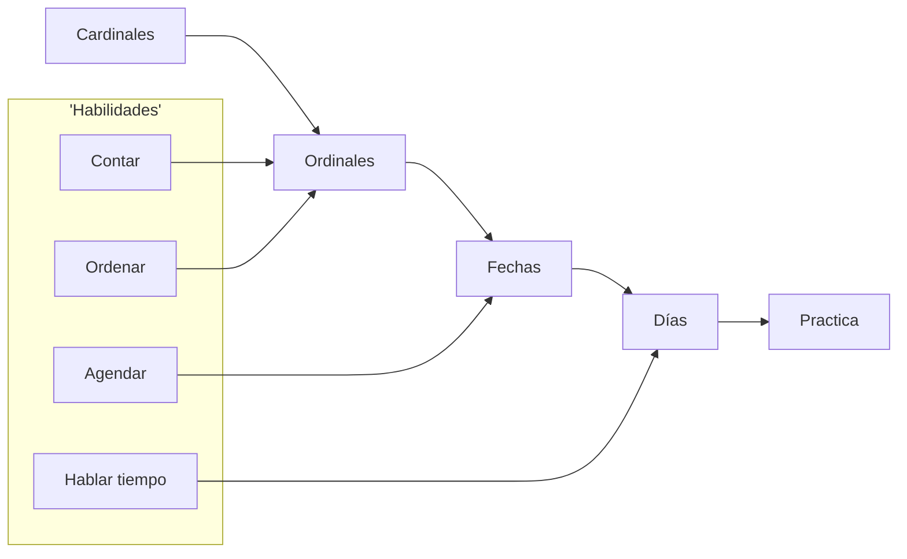
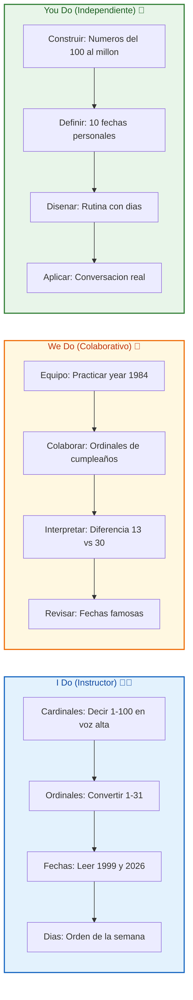
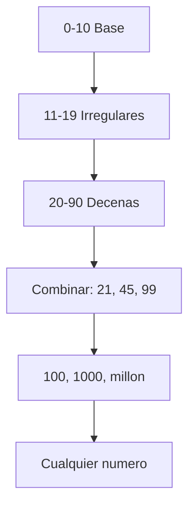
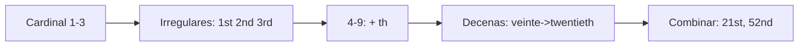

# MASTERCLASS: Los Números en Inglés — Cardinales, Ordinales, Fechas y Días 🔢📅

## INTRODUCCIÓN: POR QUÉ ESTE MASTERCLASS ES DIFERENTE 🚀

Los números parecen fáciles... hasta que abres la boca en inglés y dices *"twenty-th"* 😅. El problema no es que sean difíciles: es que **nadie te enseñó el sistema detrás**. Una vez entiendes la lógica, del 1 al 1.000.000 es pura fórmula.

Este masterclass propone otro camino: en vez de memorizar de a uno, vas a aprender el **motor de los números en inglés** 🧠. Cardinales (para contar), ordinales (para ordenar), fechas (para sobrevivir en el mundo real) y días (para no quedar mal en una reunión).

La meta no es saberse el 7.452 de memoria. La meta es **construir cualquier número sobre la marcha** con reglas que nunca fallan.

> **Objetivo de Aprendizaje** 🎯 — Al final de esta guía, podrás contar, ordenar, decir fechas y días en inglés, identificar las trampas clásicas (¡trece vs thirty!) y practicar con ejercicios progresivos I Do / We Do / You Do.

> **Advertencia educativa** ⚠️ — Este contenido es formativo para aprender inglés. La pronunciación varía entre el inglés de EE. UU. y el del Reino Unido; ambas son válidas.

---

## MAPA DEL WORKFLOW 🗺️



| Fase | Pregunta que responde | Output principal |
|------|-----------------------|------------------|
| **Cardinales** | ¿Cuántos hay? | 1, 2, 3... one, two, three |
| **Ordinales** | ¿En qué posición? | 1st, 2nd, 3rd... first, second |
| **Fechas** | ¿Qué día es? | March 5th, 2026 |
| **Días** | ¿Qué día de la semana? | Monday, Tuesday |
| **Práctica** | ¿Lo domino? | Ejercicios y fluidez |



---

## PARTE 1: CARDINALES — EL MOTOR PARA CONTAR 🔢

### 1.1 Principio Central 💡

Los cardinales son los números para **contar y cantidad**: one, two, three... No dicen orden, dicen *cuántos*. Toda la numeración en inglés se construye con una docena de piezas y 3 reglas.



### 1.2 La base sagrada: 0 al 10 🌟

| Número | Inglés | Pronunciación aproximada |
|--------|--------|--------------------------|
| 0 | **zero** (o *oh* en teléfono) | síro /óu |
| 1 | **one** | uán |
| 2 | **two** | tú |
| 3 | **three** | zrí |
| 4 | **four** | fóor |
| 5 | **five** | fáiv |
| 6 | **six** | sics |
| 7 | **seven** | séven |
| 8 | **eight** | éit |
| 9 | **nine** | náin |
| 10 | **ten** | ten |

> **Tip del profe** 🧠 — En telefónicos y códigos, el 0 se dice **"oh"**: 305 → *three oh five*. Pero para matemática, di **zero**.

### 1.3 Los rebeldes: 11 al 19 ⚠️

Estos son irregulares y NO siguen la regla de "decena + unidad". ¡Memorízalos!

| Número | Inglés | Truco |
|--------|--------|-------|
| 11 | **eleven** | 🔥 rebelde puro |
| 12 | **twelve** | 🔥 rebelde puro |
| 13 | **thirteen** | three + teen |
| 14 | **fourteen** | four + teen |
| 15 | **fifteen** | five + teen (cambio leve) |
| 16 | **sixteen** | six + teen |
| 17 | **seventeen** | seven + teen |
| 18 | **eighteen** | eight + teen (la 't' se pierde) |
| 19 | **nineteen** | nine + teen |

> **Tip** 💡 — De 13 a 19 terminan en **-teen** y se acentúa la SEGUNDA sílaba: thir**TEEN**, nine**TEEN**. Ese acento es clave para no confundir con 30/90.

### 1.4 Las decenas: 20, 30, 40... 🏗️

| Número | Inglés | Nota |
|--------|--------|------|
| 20 | **twenty** | 🔥 no es "twoty" |
| 30 | **thirty** | three → thir |
| 40 | **forty** | ⚠️ SIN 'u' (no fourty) |
| 50 | **fifty** | five → fif |
| 60 | **sixty** | six → six |
| 70 | **seventy** | seven |
| 80 | **eighty** | eight → eigh |
| 90 | **ninety** | nine |

> **Trampa mortal** 💀 — **forty** se escribe SIN 'u'. *Four* tiene 'u', pero *forty* NO. Es la palabra mal escrita más famosa de los exámenes.

### 1.5 La fórmula mágica: combinar ➕

Para cualquier número del 21 al 99 usas: **decena + "-" + unidad**.

| Número | Inglés | Lectura |
|--------|--------|---------|
| 21 | **twenty-one** | twenty one |
| 34 | **thirty-four** | thirty four |
| 45 | **forty-five** | forty five |
| 67 | **sixty-seven** | sixty seven |
| 99 | **ninety-nine** | ninety nine |

> **Regla de oro** ✅ — Siempre con GUION (-) entre decena y unidad. *Twenty-one*, nunca "twenty one" pegado.

### 1.6 Grandes números: cientos, miles, millones 🏔️

| Número | Inglés | Ejemplo |
|--------|--------|---------|
| 100 | **one hundred** | 150 → one hundred fifty |
| 1.000 | **one thousand** | 2.300 → two thousand three hundred |
| 1.000.000 | **one million** | 1.500.000 → one million five hundred thousand |
| 1.000.000.000 | **one billion** | — |

> **Tip** 🇬🇧 — En inglés británico a veces usan **"and"** después de hundred: *one hundred and fifty*. En EE. UU. suelen omitirlo. Ambos correctos.

| Número | Inglés completo |
|--------|-----------------|
| 123 | one hundred twenty-three |
| 1.987 | one thousand nine hundred eighty-seven |
| 45.000 | forty-five thousand |
| 2.000.025 | two million twenty-five |

### 1.7 Ejemplo de conversión paso a paso 🔧

Queremos decir **7.452**:

1. Miles: *seven thousand*
2. Centenas: *four hundred*
3. Decenas+unidad: *fifty-two*
4. Unión: **seven thousand four hundred fifty-two** ✅

```text
7.452 = seven thousand four hundred fifty-two
```

---

## PARTE 2: ORDINALES — PARA PONER EN ORDEN 🥇🥈🥉

### 2.1 Qué es un ordinal

Los ordinales indican **posición u orden**: first (1º), second (2º), third (3º)... Se usan para pisos, fechas, lugares y competiciones.



### 2.2 Los irregulares sagrados (1º, 2º, 3º) ⚡

| Ordinal | Inglés | Abreviatura |
|---------|--------|-------------|
| 1º | **first** | 1st |
| 2º | **second** | 2nd |
| 3º | **third** | 3rd |

> **Tip** 🧠 — La abreviatura viene de la ÚLTIMA letra de la palabra: fir**ST** → 1**st**, secon**D** → 2**nd**, thir**D** → 3**rd**. Salvo eso, todo lo demás es **-th**.

### 2.3 La regla general: + "th" 📐

| Cardinal | Ordinal | Abreviatura |
|----------|---------|-------------|
| 4 | **fourth** | 4th |
| 5 | **fifth** | 5th ⚠️ (four → fif) |
| 6 | **sixth** | 6th |
| 7 | **seventh** | 7th |
| 8 | **eighth** | 8th ⚠️ (solo una t) |
| 9 | **ninth** | 9th ⚠️ (se pierde la e) |
| 10 | **tenth** | 10th |
| 11 | **eleventh** | 11th |
| 12 | **twelfth** | 12th ⚠️ (ve → f) |
| 13 | **thirteenth** | 13th |

> **Trampas** 💀 —
> - **fifth** (no "fiveth")
> - **eighth** (una sola t, no "eightth")
> - **ninth** (sin la e de nine)
> - **twelfth** (la v se vuelve f)

### 2.4 Decenas ordinales 🔄

Para las decenas, cambias la **y** final por **-ieth**:

| Cardinal | Ordinal | Abreviatura |
|----------|---------|-------------|
| 20 | **twentieth** | 20th |
| 30 | **thirtieth** | 30th |
| 40 | **fortieth** | 40th |
| 50 | **fiftieth** | 50th |
| 90 | **ninetieth** | 90th |

### 2.5 Combinados: 21º, 52º, 99º 🧩

Solo la ÚLTIMA palabra se vuelve ordinal:

| Número | Ordinal | Abreviatura |
|--------|---------|-------------|
| 21 | **twenty-first** | 21st |
| 22 | **twenty-second** | 22nd |
| 34 | **thirty-fourth** | 34th |
| 52 | **fifty-second** | 52nd |
| 99 | **ninety-ninth** | 99th |
| 100 | **one hundredth** | 100th |

> **Regla** ✅ — *twenty-first*, no "twentieth-first". El ordinal va al final.

---

## PARTE 3: FECHAS — A SOBREVIVIR EN EL MUNDO REAL 📅

### 3.1 Dos formatos, elige uno 🌍

| Formato | Ejemplo | Uso |
|---------|---------|-----|
| **Mes + día ordinal** | March 5th | EE. UU. 🇺🇸 |
| **Día ordinal + month** | 5th March | Reino Unido 🇬🇧 |

Ambos se dicen igual: **"March fifth"** o **"the fifth of March"**.

> **Tip del profe** 💡 — En conversación, el ordinal es Rey: *March 5th* se lee **"March fifth"**, NUNCA "march five".

### 3.2 Años: la regla del par 📆

Los años se leen en **dos bloques de dos dígitos**:

| Año | Lectura | Nota |
|-----|---------|------|
| 1999 | **nineteen ninety-nine** | bloque + bloque |
| 2026 | **twenty twenty-six** | 🔥 desde el 2000 así |
| 1984 | **nineteen eighty-four** | — |
| 2000 | **two thousand** | — |
| 2005 | **two thousand five** | o "twenty oh five" |
| 2012 | **twenty twelve** | — |

> **Trampa** ⚠️ — Años del 2000 en adelante se leen como números normales: 2026 = *twenty twenty-six*. Los del siglo XX (1900s) van en bloques: 1984 = *nineteen eighty-four*.

### 3.3 Fechas completas con año 🗓️

| Fecha | Inglés escrito | Lectura |
|-------|----------------|---------|
| 5/3/2026 | March 5th, 2026 | March fifth, twenty twenty-six |
| 1/1/2000 | January 1st, 2000 | January first, two thousand |
| 25/12/1999 | December 25th, 1999 | December twenty-fifth, nineteen ninety-nine |
| 7/7/2007 | July 7th, 2007 | July seventh, two thousand seven |

### 3.4 Fechas especiales y abreviaciones 🎯

| Término | Inglés |
|---------|--------|
| BC (antes de Cristo) | **BC** (va después): 100 BC |
| AD (después de Cristo) | **AD** (va antes): AD 50 |
| Siglo | **century**: 21st century |
| Década | **decade**: the 90s |
| Milenio | **millennium** |

> **Tip** 💡 — Para decir "los 90" (década) di **"the nineties"**. Para "2000s" di **"the two thousands"**.

### 3.5 Ejemplo paso a paso 🔧

Fecha: **14 de febrero de 2015**

1. Día ordinal: *fourteenth*
2. Mes: *February*
3. Año: *twenty fifteen*
4. Unión: **February fourteenth, twenty fifteen** ✅

---

## PARTE 4: DÍAS — LA SEMANA Y EL TIEMPO 📆☀️

### 4.1 Los 7 días (con acento) 🗓️

| Día | Inglés | Acento en |
|-----|--------|-----------|
| Lunes | **Monday** | LUNday |
| Martes | **Tuesday** | TUESday |
| Miércoles | **Wednesday** | WENSday ⚠️ (la 'd' no suena) |
| Jueves | **Thursday** | THURSday |
| Viernes | **Friday** | FRIday |
| Sábado | **Saturday** | SATurday |
| Domingo | **Sunday** | SUNday |

> **Trampa clásica** 💀 — **Wednesday** se pronuncia **"WENS-day"**. La 'd' del medio es muda. Es la palabra más tropezada del principiante.

### 4.2 Abreviaturas y orden 🔤

| Día | Abreviatura |
|-----|-------------|
| Mon | Monday |
| Tue | Tuesday |
| Wed | Wednesday |
| Thu | Thursday |
| Fri | Friday |
| Sat | Saturday |
| Sun | Sunday |

> **Tip** 🧠 — La semana en inglés empieza en **Sunday** (calendarios EE. UU.). En conversación cotidiana igual funciona empezar por Monday.

### 4.3 Preposiciones de tiempo ⏰

| Preposición | Uso | Ejemplo |
|-------------|-----|---------|
| **on** | días y fechas | on Monday, on March 5th |
| **in** | meses, años, siglos | in July, in 2026, in winter |
| **at** | horas | at 3 p.m., at noon |

> **Regla mnemotécnica** ✅ — **on** día (la línea del día), **in** periodo amplio, **at** punto exacto.

### 4.4 Partes del día 🌅

| Franja | Inglés |
|--------|--------|
| Mañana | **morning** (in the morning) |
| Tarde | **afternoon** |
| Tarde-noche | **evening** |
| Noche | **night** (at night) |
| Mediodía | **noon** (at noon) |
| Medianoche | **midnight** |

### 4.5 Ejemplos de uso real 💬

| Español | Inglés |
|---------|--------|
| El lunes a las 9 | on Monday at 9 a.m. |
| En julio de 2026 | in July 2026 |
| Los viernes por la tarde | on Friday afternoons |
| Mi cumpleaños es el 3 de mayo | My birthday is on May 3rd |
| Nos vemos el domingo | See you on Sunday |

---

## PARTE 5: TRAMPAS CLÁSICAS — NO CAIGAS 💀🚫

### 5.1 Las 5 confusiones que te delatan

| Confusión | Error | Correcto |
|-----------|-------|----------|
| 13 vs 30 | *thirtyteen* | thirteen / thirty |
| 14 vs 40 | *fourty* | fourteen / **forty** |
| 15 vs 50 | *fivety* | fifteen / fifty |
| 16 vs 60 | *sixtyteen* | sixteen / sixty |
| 18 vs 80 | *eightteen* | eighteen / eighty |

> **Tip de pronunciación** 🔊 — **-teen** (13-19) acentúa la SEGUNDA sílaba y suena aguda. **-ty** (20-90) acentúa la PRIMERA y suena grave. *THIRteen* vs *THIRty*.

### 5.2 Cardinal vs Ordinal en fechas

| Mal ❌ | Bien ✅ |
|--------|---------|
| March five | March fifth |
| The 5 of March | the fifth of March |
| 2026 as twenty six | twenty twenty-six |
| on 5th March the | on March 5th |

### 5.3 Números grandes mal separados

| Error ❌ | Correcto ✅ |
|----------|-------------|
| one hundred thousand million | one hundred million (100.000.000) |
| two million thousand | two million (2.000.000) |

> **Tip** 🧠 — En inglés escrito se usan COMAS para miles (1,000,000), no puntos. Y se agrupan de 3 en 3.

---

## PARTE 6: I DO / WE DO / YOU DO — EJERCICIOS PROGRESIVOS 🏋️

### 6.1 I Do — Contar en voz alta (Instructor) 👨‍🏫

**Objetivo:** decir números del 1 al 100 sin pensar.

| Paso | Acción | Resultado esperado |
|------|--------|--------------------|
| 1 | Repite 1-10 | one... ten |
| 2 | Repite 11-19 | once... nineteen |
| 3 | Repite decenas 20-90 | twenty... ninety |
| 4 | Combina 21, 34, 67 | twenty-one... |
| 5 | Salta la trampa 13/30 | thirteen / thirty |
| 6 | Di 47, 58, 99 | forty-seven, fifty-eight, ninety-nine |

```text
Practica en voz alta:
47  -> forty-seven
58  -> fifty-eight
99  -> ninety-nine
```

**Interpretación guiada:**
- Si dudas en 13 vs 30, enfócate en el ACENTO: thirTEEN (agudo) vs THIRty (grave).
- Si escribes *fourty*, corrige a **forty** inmediatamente.

### 6.2 We Do — Cumpleaños en ordinales 🤝

**Escenario:** comparte tu cumpleaños con un compañero.

| Decisión | Opción recomendada | Justificación |
|----------|--------------------|---------------|
| Formato | Month + ordinal | March 5th |
| Lectura | "March fifth" | ordinal, no cardinal |
| Con año | + "nineteen ninety..." | bloques de 2 |
| Preposición | "on" + día | on March 5th |

```text
Mi cumpleaños: 5 de marzo de 1990
-> My birthday is on March 5th, 1990
-> (lectura) March fifth, nineteen ninety
```

### 6.3 You Do — Tus 10 fechas personales 💪

**Tarea:** escribe 10 fechas importantes tuyas en inglés con lectura.

| # | Fecha | Inglés escrito | Lectura |
|---|-------|----------------|---------|
| 1 | ____ | ____ | ____ |
| 2 | ____ | ____ | ____ |

Criterios de evaluación:

| Criterio | Peso |
|----------|------|
| Ordinal correcto | 30% |
| Año bien leído | 30% |
| Preposición correcta | 20% |
| Pronunciación | 20% |

### 6.4 I Do — Años famosos 📜

| Año | Lectura |
|-----|---------|
| 1492 | fourteen ninety-two |
| 1776 | seventeen seventy-six |
| 1969 | nineteen sixty-nine |
| 2001 | two thousand one |
| 2026 | twenty twenty-six |

### 6.5 We Do — Diferencia 13 vs 30 👂

**Caso:** un audio dice "thirty" pero tú oyes "thirteen".

| Pregunta | Respuesta esperada |
|----------|--------------------|
| ¿Dónde está el acento? | THIRty = grave; thirTEEN = agudo |
| ¿Termina en -ty o -teen? | -ty grave = decena |
| ¿Es cantidad grande? | 30 > 13 siempre |
| ¿Cómo practicar? | repetir pares: 13/30, 14/40, 15/50 |

### 6.6 You Do — Rutina con días 🗓️

**Tarea:** describe tu semana usando *on*, *in*, *at*.

```text
Ejemplo:
- On Monday I study English at 7 p.m.
- In July I travel.
- On Friday night we watch movies.
```

### 6.7 I Do — Números grandes 🏔️

```text
7.452  -> seven thousand four hundred fifty-two
1.987  -> one thousand nine hundred eighty-seven
45.000 -> forty-five thousand
2.000.025 -> two million twenty-five
```

### 6.8 We Do — Revisar errores comunes 🔍

| Error | Corrección |
|-------|------------|
| fourty | forty |
| fiveth | fifth |
| eightth | eighth |
| March five | March fifth |
| WEDnesday | WENSday |

### 6.9 You Do — Conversación real 💬

**Reto:** graba un audio de 30 segundos diciendo:
1. Tu número de teléfono (con "oh" para el 0).
2. Tu fecha de nacimiento.
3. Tu día favorito de la semana y por qué.

### 6.10 Cierre práctico 🏁

| Nivel | Debes poder hacer |
|-------|-------------------|
| **I Do** | Seguir ejemplos de cardinales, ordinales, fechas y días |
| **We Do** | Corregir errores y practicar en pareja |
| **You Do** | Construir tus propias fechas y sostener conversación |

---

## CHECKLIST FINAL DE LOS NÚMEROS EN INGLÉS ✅

| Bloque | Check |
|--------|-------|
| Cardinales | Base 0-10, 11-19, decenas y combinación dominadas |
| Ordinales | 1st/2nd/3rd irregulares y regla +th clara |
| Trampas | forty sin u, fifth, eighth, twelfth, Wednesday |
| Fechas | Mes + ordinal + año en bloques |
| Años | 1900s en bloques, 2000s como número |
| Días | 7 días y preposiciones on/in/at |
| Pronunciación | acento -teen vs -ty controlado |
| Práctica | 10 fechas personales y audio grabado |

---

## Preguntas de Verificación 📝

Responde cada pregunta basándote en la masterclass.

### Preguntas sobre Cardinales

1. **Aplica**: Escribe en inglés el número **7.452** y léelo en voz alta.

2. **Analiza**: ¿Por qué *forty* se escribe sin 'u' si viene de *four*? Da 2 ejemplos más de palabras "trampa".

### Preguntas sobre Ordinales

3. **Diseña**: Convierte en ordinales: 1, 2, 3, 5, 8, 12, 21, 52, 99. Escribe palabra y abreviatura.

4. **Reflexiona**: ¿Por qué la abreviatura de "first" es 1st y no 1th?

### Preguntas sobre Fechas

5. **Calcula**: ¿Cómo se lee el año 1984? ¿Y el 2026? Explica la diferencia de regla.

6. **Evalúa**: Escribe y lee "14 de febrero de 2015". ¿Qué preposición usarías si dices "on February 14th"?

### Preguntas Integradoras

7. **Conecta**: Explica la diferencia de pronunciación entre *thirteen* y *thirty* y por qué importa en telefónicos.

8. **Propón**: Describe tu rutina semanal usando al menos 3 días y las preposiciones on/in/at.

9. **Síntesis**: Escribe tu fecha de nacimiento completa en inglés (día ordinal, mes, año leído) y grábala mentalmente.

10. **Reflexión final**: De todo lo aprendido, ¿qué trampa crees que te delataría más como principiante y cómo la vas a corregir?

## GLOSARIO RÁPIDO 📖

| Término | Definición |
|---------|------------|
| **Cardinal** | Número para contar cantidad (one, two, three) |
| **Ordinal** | Número para ordenar posición (1st, 2nd, 3rd) |
| **-teen** | Terminación del 13 al 19, acento agudo |
| **-ty** | Terminación de decenas 20-90, acento grave |
| **Hundred** | 100 |
| **Thousand** | 1.000 |
| **Million** | 1.000.000 |
| **BC / AD** | Antes / después de Cristo |
| **on / in / at** | Preposiciones de día, periodo y hora |
| **Wednesday** | Miércoles, pronunciado "WENS-day" |

---

## ANEXO: FORMATO IDEAL PARA ESTUDIAR NÚMEROS 🧠

### Recomendaciones de práctica

El cerebro aprende números por **repetición espaciada** y **uso real**. No memorices listas muertas: úsalos.

```text
Rutina diaria de 5 minutos:
1. Di en voz alta los números del 1 al 31 (ordinales).
2. Lee 3 años en voz alta.
3. Di tu fecha de nacimiento.
4. Di qué día es hoy: "Today is Wednesday."
```

### Lo que hace agradable una guía al cerebro 🧠

- **Emojis y colores** 🎨 activan la memoria visual.
- **Ejemplos concretos** 🔧 anclan el patrón.
- **Trampas señaladas** 💀 preparan el error antes de cometerlo.
- **Ejercicios progresivos** 🏋️ construyen confianza.

> **Frase del profe** 🌟 — *"Los números en inglés no se memorizan, se CONSTRUYEN. Aprende el motor y el millón viene solo."*
