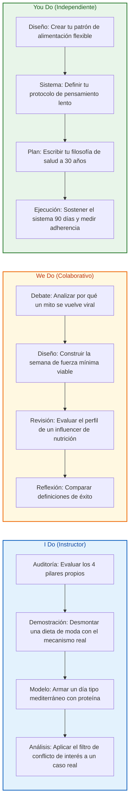
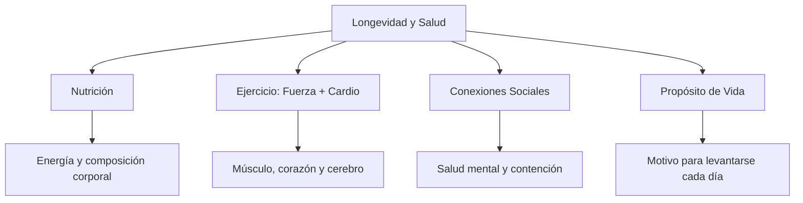
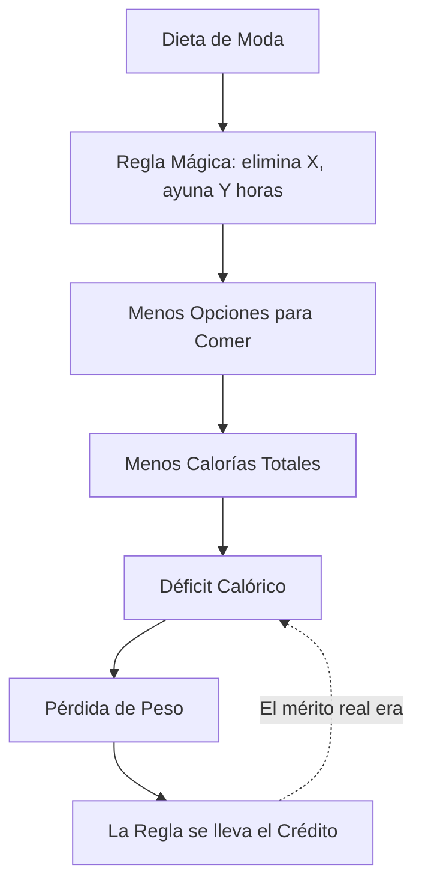
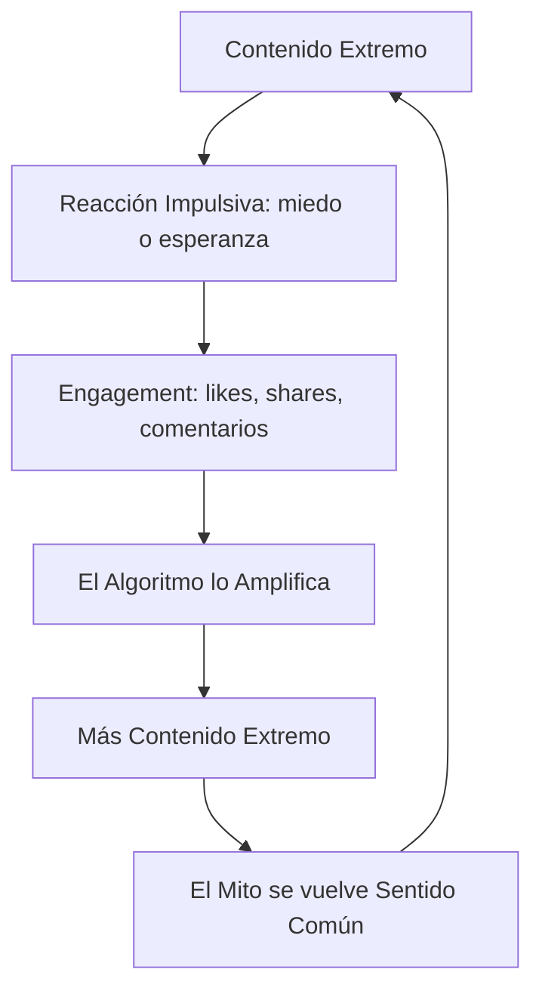
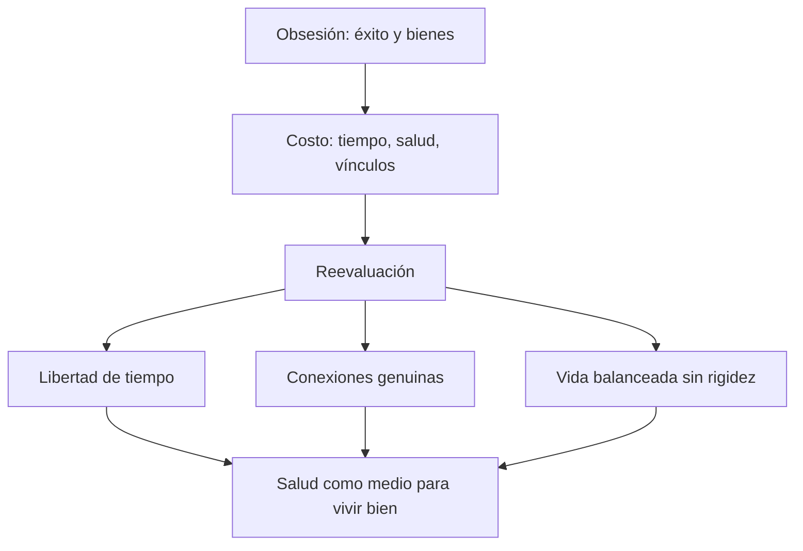

# MASTERCLASS: Nutrición, Fuerza y Longevidad — El Sistema Flexible de Francis Holway

## INTRODUCCIÓN: POR QUÉ ESTE MASTERCLASS ES DIFERENTE

La industria de la nutrición vende reglas mágicas: elimina esto, prohíbe aquello, come solo en esta ventana horaria. Cada año nace una dieta nueva que promete ser "la definitiva". Y cada año, millones de personas abandonan esa dieta y saltan a la siguiente.

Francis Holway, nutricionista deportivo de renombre, propone otro camino: entender los mecanismos reales detrás de la salud y la longevidad, en lugar de obedecer reglas. En una conversación profunda sobre nutrición, entrenamiento y filosofía de vida, Holway desmonta los mitos más rentables de la industria y los reemplaza por algo menos sexy pero infinitamente más útil: **principios sostenibles**.

La meta no es seguir la dieta perfecta. La meta es construir un sistema de vida que puedas sostener durante décadas — con músculo fuerte, mente crítica y libertad de tiempo.

> **Objetivo de Aprendizaje** — Al final de esta guía, podrás identificar los 4 pilares reales de la longevidad, explicar por qué toda dieta restrictiva funciona (o falla) por el mismo mecanismo, diseñar un patrón de alimentación flexible tipo mediterráneo con proteína suficiente, filtrar información nutricional con pensamiento lento y alinear tu salud con una filosofía de vida sin rigidez.

> **Advertencia educativa** — Este contenido es formativo y está basado en una conversación divulgativa. Nada de lo aquí expuesto reemplaza la consulta con un médico o nutricionista matriculado. Antes de cambiar tu alimentación o rutina de ejercicio, especialmente si tienes condiciones previas, consulta con un profesional de la salud.

---

## MAPA DEL SISTEMA


| Fase | Pregunta que responde | Output principal |
|------|-----------------------|------------------|
| **Diagnóstico** | ¿Sobre qué base se construye una vida larga y sana? | Los 4 pilares priorizados |
| **Fuerza** | ¿Qué tipo de ejercicio protege más al envejecer? | Plan mínimo de fuerza + cardio |
| **Mitos** | ¿Por qué "funcionan" las dietas de moda? | Detector de reglas mágicas |
| **Dieta Flexible** | ¿Cuál es la mejor dieta del mundo? | Patrón mediterráneo + proteína |
| **Pensamiento Lento** | ¿Por qué creemos mentiras nutricionales? | Protocolo de análisis crítico |
| **Filtro de Industria** | ¿Quién paga la recomendación que escuchas? | Checklist de conflictos de interés |
| **Filosofía** | ¿Para qué quieres vivir más? | Definición personal de éxito |
| **Sistema Personal** | ¿Cómo lo sostienes 30 años? | Rutina propia sin rigidez |



---

## PARTE 1: DIAGNÓSTICO — LOS 4 PILARES DE LA LONGEVIDAD

### 1.1 Principio Central

La longevidad no se construye con un superalimento ni con un suplemento caro. Se construye sobre una base de cuatro pilares que se sostienen mutuamente. Holway lo resume con claridad: la base de una vida larga y funcional es **nutrición, ejercicio (cardiovascular y de fuerza), conexiones sociales y un propósito de vida claro**.

Quitar un pilar no tumba el edificio de inmediato. Pero lo debilita de forma silenciosa durante años.



### 1.2 Los 4 pilares en detalle

| Pilar | Qué aporta | Señal de descuido | Práctica mínima |
|-------|------------|-------------------|-----------------|
| **Nutrición** | Energía, composición corporal, salud metabólica | Dietas yo-yo, culpa al comer | Patrón flexible sostenible |
| **Ejercicio** | Músculo, corazón, hueso, cerebro | Sedentarismo, solo caminar | Fuerza 2-3x/semana + cardio |
| **Conexiones sociales** | Salud mental, pertenencia, contención | Aislamiento, relaciones transaccionales | Tiempo genuino con personas |
| **Propósito** | Dirección, motivación, resiliencia | Vacío, vivir en piloto automático | Un motivo claro que trascienda lo material |

### 1.3 El error del enfoque parcial

El error más común es obsesionarse con un solo pilar. Hay quien optimiza la dieta al gramo pero no entrena. Hay quien entrena todos los días pero duerme mal y no ve a nadie. Hay quien tiene éxito profesional y propósito, pero un cuerpo que se deteriora.

| Perfil desbalanceado | Qué optimiza | Qué paga |
|----------------------|--------------|----------|
| El "fitness extremo" | Dieta y ejercicio | Relaciones, flexibilidad, salud mental |
| El "ejecutivo exitoso" | Propósito y carrera | Cuerpo, energía, tiempo |
| El "sano aislado" | Nutrición perfecta | Conexión humana, disfrute |
| El "social sin base" | Vínculos y placer | Salud metabólica, energía |

> **📌 Idea clave** — La longevidad es un sistema de 4 pilares: nutrición, ejercicio, vínculos y propósito. Optimizar uno y abandonar los demás no es salud; es obsesión disfrazada.

---

## PARTE 2: FUERZA — EL SEGURO DE VIDA QUE NADIE TE VENDE

### 2.1 El pilar más subestimado

De todo lo que puedes hacer para envejecer bien, Holway destaca un componente como uno de los más vitales: **el entrenamiento de fuerza**.

El músculo no es estética. Es funcionalidad: levantarte del suelo, subir escaleras, cargar la compra, no caerte a los 75. La pérdida de masa muscular con la edad no es un problema de apariencia; es un problema de independencia.

### 2.2 Cuádriceps y cerebro: la conexión inesperada

Uno de los datos más potentes de la conversación: existe una correlación notable entre la **fuerza de cuádriceps y la reducción del declive cognitivo**.

¿La lógica? Las piernas fuertes actúan como una **bomba de circulación sanguínea**. Músculos grandes y activos en la parte inferior del cuerpo ayudan a impulsar la sangre de vuelta al corazón y al cerebro. Mejor circulación, mejor irrigación cerebral, mejor salud cognitiva a largo plazo.


### 2.3 Qué priorizar según la década

| Etapa | Prioridad de fuerza | Objetivo real |
|-------|---------------------|---------------|
| **20-30 años** | Construir base muscular | Acumular "ahorro" de músculo y hueso |
| **30-50 años** | Mantener y progresar | No perder lo construido, proteger articulaciones |
| **50-65 años** | Fuerza funcional y potencia | Independencia, prevención de caídas |
| **65+ años** | Fuerza + equilibrio | Autonomía: levantarse, caminar, cargar |

### 2.4 Fuerza y cardio: no es uno u otro

Holway incluye **ambos** en la base: cardiovascular y fuerza. No compiten; se complementan.

| Tipo | Qué protege | Error típico |
|------|-------------|--------------|
| **Fuerza** | Músculo, hueso, metabolismo, cerebro, independencia | "El cardio basta para estar sano" |
| **Cardio** | Corazón, pulmones, capacidad aeróbica, salud vascular | "Pesas solo, no hace falta cardio" |

> **📌 Idea clave** — Entrenar fuerza es el seguro de vida más barato que existe. Tus cuádriceps de hoy son tu circulación cerebral y tu independencia de mañana.

---

## PARTE 3: MITOS NUTRICIONALES — EL MOTOR REAL DETRÁS DE TODA DIETA

### 3.1 La revelación incómoda

Holway desmonta el negocio de las dietas con una sola idea: **la mayoría de las dietas restrictivas funcionan principalmente por déficit calórico, no por las reglas "mágicas" que promueven**.

No es la cetosis. No es la ventana de ayuno. No es eliminar el gluten. Es que, al cortar grupos enteros de alimentos u horarios, terminas comiendo menos calorías. La regla mágica es el envoltorio; el mecanismo real es energético.



### 3.2 Traducción de las dietas famosas

| Dieta | Regla "mágica" que vende | Mecanismo real dominante |
|-------|--------------------------|--------------------------|
| **Keto / cetogénica** | "La grasa se quema en cetosis" | Eliminación de carbohidratos = menos calorías y apetito reducido |
| **Ayuno intermitente** | "La ventana horaria activa la autofagia" | Menos horas para comer = menos ingesta total |
| **Low carb** | "Los carbohidratos engordan" | Corte de calorías vía restricción de un macronutriente |
| **Detox / ayunos de jugos** | "Limpia las toxinas" | Restricción calórica severa temporal |
| **Paleo** | "Come como tu ancestro" | Menos ultraprocesados = menos densidad calórica |
| **Sin gluten (sin celiaquía)** | "El gluten inflama" | Menos panificados = menos calorías |

### 3.3 Por qué el marketing vence a la fisiología

La frase "come menos calorías de las que gastas" no vende libros. La frase "descubre el interruptor hormonal que tu médico te oculta" sí.

Las reglas mágicas cumplen una función psicológica:

- Son simples de entender y de contar.
- Dan identidad de grupo ("yo soy keto").
- Prometen un secreto, no un esfuerzo.
- Permiten culpar a un villano (carbohidratos, gluten, horarios) en lugar de revisar hábitos.

> **📌 Idea clave** — Antes de adoptar cualquier dieta, pregúntate: ¿cuál es el mecanismo real? Si la respuesta honesta es "comer menos calorías", ya entendiste el 90% de la nutrición para composición corporal.

---

## PARTE 4: LA DIETA FLEXIBLE — LA MEJOR DIETA ES LA QUE PUEDES SOSTENER

### 4.1 El patrón ganador según Holway

Si la mayoría de las dietas funcionan por el mismo mecanismo, ¿cuál elegir? La respuesta de Holway es directa: **la "mejor" dieta es la sostenible**. Y su referencia práctica: un patrón tipo **mediterráneo con proteína suficiente**, con enfoque flexible.

Flexible no significa "sin estructura". Significa que la estructura no colapsa cuando comes fuera de casa, cuando hay un cumpleaños o cuando viajas.

### 4.2 Componentes del patrón

| Componente | Qué significa en la práctica | Por qué dura décadas |
|------------|------------------------------|----------------------|
| **Base mediterránea** | Vegetales, frutas, legumbres, aceite de oliva, pescado, frutos secos, granos | Variedad, saciedad, placer, evidencia acumulada |
| **Proteína suficiente** | Una fuente de proteína en cada comida principal | Protege el músculo (pilar de longevidad) y da saciedad |
| **Flexibilidad** | Espacio para comidas sociales y gustos personales | Elimina el ciclo restricción-abandono |
| **Mínimo de ultraprocesados** | No prohibidos, pero no son la base | Reduce densidad calórica sin rigidez |

### 4.3 Plantilla de día tipo

```text
DÍA TIPO — PATRÓN FLEXIBLE
─────────────────────────────────────────
Desayuno:  Proteína + fruta + grano integral
Almuerzo:  Proteína + vegetales abundantes + carbohidrato + oliva
Merienda:  Proteína ligera o fruta + frutos secos
Cena:      Proteína + vegetales + carbohidrato moderado
─────────────────────────────────────────
Regla 80/20: el 80% de la semana sigue el patrón;
el 20% es vida real: cenas, cumpleaños, antojos.
─────────────────────────────────────────
Checklist diario:
[ ] ¿Comí proteína en cada comida principal?
[ ] ¿Hubo vegetales o frutas en el día?
[ ] ¿La comida me dejó con energía, no con culpa?
[ ] ¿Podría comer así dentro de 10 años?
```

### 4.4 Adherencia: la métrica que nadie mide

La industria mide cuánto peso pierdes en 8 semanas. La pregunta correcta es otra: **¿puedes seguir comiendo así en 8 años?**

| Criterio de evaluación | Dieta mágica típica | Patrón flexible |
|------------------------|---------------------|-----------------|
| Resultado a 8 semanas | Rápido | Moderado |
| Resultado a 2 años | Frecuente rebote | Sostenido |
| Vida social | Complicada | Compatible |
| Relación con la comida | Culpa y reglas | Normalidad |
| Requiere fuerza de voluntad extrema | Sí | No |

> **📌 Idea clave** — No existe la mejor dieta del mundo; existe la mejor dieta para ti, que es la que puedes sostener. Mediterráneo + proteína suficiente + flexibilidad es el candidato con más evidencia y menos drama.

---

## PARTE 5: PENSAMIENTO RÁPIDO VS LENTO — NUTRICIÓN EN LA ERA DEL SCROLL

### 5.1 El problema de fondo

Holway señala un fenómeno que explica por qué los mitos nutricionales prosperan: el auge de las redes sociales incentiva el **"pensamiento rápido"** — reacciones impulsivas, titulares, extremos — por sobre el **"pensamiento lento"** — razonamiento analítico, contexto, matices.

El algoritmo no premia la verdad. Premia la reacción. Y nada genera más reacción que un extremo: "este alimento te está matando" o "este truco derrite la grasa".



### 5.2 Dos modos de pensar la nutrición

| Señal | Pensamiento rápido | Pensamiento lento |
|-------|--------------------|--------------------|
| Fuente | Un reel de 30 segundos | Estudios, consensos, profesionales |
| Lenguaje | "Nunca", "siempre", "milagro", "veneno" | "Depende", "en contexto", "en promedio" |
| Reacción | Cambiar todo hoy | Evaluar, comparar, decidir |
| Villanos | Un alimento culpable | Patrones y contextos |
| Resultado | Extremos y abandono | Ajustes sostenibles |

### 5.3 Protocolo de pensamiento lento

Antes de creer o aplicar una afirmación nutricional, ejecútala por este filtro:

| Paso | Pregunta |
|------|----------|
| 1 | ¿Quién lo dice y qué gana con que yo lo crea? |
| 2 | ¿Es una regla mágica o un mecanismo real? |
| 3 | ¿Qué dice el consenso, no solo un estudio aislado? |
| 4 | ¿Es sostenible o es otro extremo de 30 días? |
| 5 | ¿Sobrevive esta idea al test de "podría hacerlo 10 años"? |

> **📌 Idea clave** — Las redes entrenan tu pensamiento rápido: impulso, titular, extremo. La salud a largo plazo se construye con pensamiento lento: mecanismo, contexto, sostenibilidad.

---

## PARTE 6: FILTRO DE INDUSTRIA — QUIÉN PAGA LA OPINIÓN QUE ESCUCHAS

### 6.1 El elefante en la habitación

Holway toca un tema incómodo y necesario: **muchos comités y recomendaciones nutricionales están influenciados por sponsors corporativos**. Cuando una tendencia dietética explota en popularidad, conviene preguntarse si detrás hay ciencia acumulada o intereses financieros.

No se trata de paranoia. Se trata de alfabetización: entender que la información nutricional también es un mercado.

### 6.2 Señales de alarma

| Señal de alarma | Qué puede indicar | Qué hacer |
|-----------------|-------------------|-----------|
| El comunicador vende el producto que recomienda | Conflicto de interés directo | Buscar fuentes independientes |
| "Estudios demuestran" sin citar cuáles | Marketing disfrazado de ciencia | Pedir la referencia real |
| Un solo nutriente o alimento es el villano/héroe | Simplificación comercial | Volver al patrón completo |
| Urgencia: "la industria te lo oculta" | Narrativa de conspiración vendible | Pensamiento lento |
| Tendencia que explota de golpe en redes | Posible campaña o moda | Esperar, revisar consensos |
| Comité o fundación con sponsors de la industria | Recomendaciones sesgadas | Revisar quién financia |

### 6.3 La pregunta de oro

Toda recomendación nutricional puede pasar por una única pregunta antes de adoptarla:

```text
¿Esta recomendación me acerca a un patrón
sostenible y basado en evidencia,
o me acerca a comprar algo?
```

> **📌 Idea clave** — La transparencia importa: antes de seguir una tendencia dietética, sigue el dinero. Si quien promueve la regla se beneficia de ella, exige el doble de evidencia.

---

## PARTE 7: FILOSOFÍA DE VIDA — DE LA OBSESIÓN A LA LIBERTAD

### 7.1 La evolución de Holway

La conversación no termina en macros y entrenamiento. Holway comparte su evolución personal: pasó de estar **obsesionado con el éxito profesional y los bienes materiales** a valorar algo distinto — **la libertad de tiempo, las conexiones humanas genuinas y una vida balanceada y saludable sin restricciones rígidas**.

Es el mismo patrón que predica en nutrición, aplicado a la vida: menos reglas mágicas, más sostenibilidad.

### 7.2 El antes y el después

| Dimensión | Etapa de obsesión | Etapa de libertad |
|-----------|-------------------|-------------------|
| **Éxito** | Logros, títulos, ingresos | Tiempo propio y salud |
| **Bienes** | Acumular, mostrar | Tener lo suficiente |
| **Tiempo** | Moneda que se gasta en trabajo | Activo más valioso |
| **Relaciones** | Networking, transaccionales | Conexiones genuinas |
| **Salud** | Herramienta de rendimiento | Base de una vida buena |
| **Reglas** | Rigidez y autoexigencia | Balance sin restricciones rígidas |

### 7.3 La coherencia final

Hay una coherencia elegante en el mensaje completo:

- La mejor dieta es la **sostenible**, no la perfecta.
- El mejor entrenamiento es el que **sostienes décadas**, no el más duro.
- La mejor vida es la que tiene **salud, vínculos, propósito y tiempo**, no la que acumula más.



> **📌 Idea clave** — Vivir más no es la meta final; es el medio. La meta es una vida con tiempo, vínculos y salud suficiente para disfrutarlo. Sin rigidez, porque la rigidez no se sostiene.

---

## PARTE 8: I DO / WE DO / YOU DO — EJERCICIOS PROGRESIVOS

### 8.1 I Do — Auditoría de los 4 pilares

**Objetivo:** diagnosticar tu base de longevidad antes de cambiar nada.

| Paso | Acción | Resultado esperado |
|------|--------|--------------------|
| 1 | Puntúa tu nutrición del 1 al 10 | Número honesto |
| 2 | Puntúa tu ejercicio (fuerza + cardio) | Número honesto |
| 3 | Puntúa tus conexiones sociales | Número honesto |
| 4 | Puntúa tu propósito de vida | Número honesto |
| 5 | Identifica el pilar más bajo | Tu prioridad real |
| 6 | Define una acción mínima para ese pilar | Próximo paso concreto |

**Interpretación guiada:**

- Si el ejercicio está bajo y no entrenas fuerza: ese es tu mayor apalancamiento.
- Si la nutrición está baja pero haces dietas yo-yo: el problema no es disciplina, es el patrón.
- Si vínculos y propósito están bajos: ninguna dieta arregla eso; empieza por ahí.

### 8.2 We Do — Desmontar una dieta de moda

**Escenario:** llega a tus manos una dieta viral que promete "reiniciar tu metabolismo" eliminando un grupo de alimentos durante 21 días.

**Tarea colaborativa:** analizarla con la tabla de mecanismos.

| Pregunta | Respuesta esperada |
|----------|--------------------|
| ¿Cuál es la regla mágica? | Eliminar X / ayunar Y horas |
| ¿Cuál es el mecanismo real? | Probable déficit calórico |
| ¿Es sostenible 2 años? | Casi nunca |
| ¿Qué pasa el día 22? | Regreso al patrón anterior |
| ¿Quién gana con su viralidad? | Seguir el dinero |

### 8.3 You Do — Diseñar tu patrón flexible

**Tarea:** construye tu día tipo usando la plantilla de la Parte 4.

Debe incluir:

- Proteína en cada comida principal.
- Vegetales o frutas a lo largo del día.
- Una regla 80/20 explícita para vida social.
- Cero alimentos "prohibidos" que no puedas sostener 10 años.

| Criterio de evaluación | Peso |
|------------------------|------|
| Sostenibilidad real | 30% |
| Proteína suficiente | 25% |
| Base tipo mediterránea | 20% |
| Flexibilidad social | 15% |
| Simplicidad | 10% |

### 8.4 I Do — Semana de fuerza mínima viable

**Objetivo:** iniciar el pilar más subestimado sin complejidad.

| Paso | Acción | Validación |
|------|--------|------------|
| 1 | 2-3 sesiones de fuerza por semana | Agendadas como cita fija |
| 2 | Incluir piernas (cuádriceps) cada semana | Sentadilla, zancada o prensa |
| 3 | Progresión simple | Un poco más de peso o reps con el tiempo |
| 4 | Cardio complementario | Caminatas, bici, natación |
| 5 | Registrar adherencia | % de sesiones cumplidas al mes |

### 8.5 We Do — Auditar a un influencer de nutrición

**Escenario:** un creador con millones de seguidores promueve un protocolo extremo y vende suplementos propios.

| Paso | Acción |
|------|--------|
| 1 | Listar qué vende (productos, cursos, marcas) |
| 2 | Detectar lenguaje de extremos ("nunca", "siempre", "tóxico") |
| 3 | Contrastar una afirmación con el consenso científico |
| 4 | Aplicar la pregunta de oro: ¿patrón sostenible o venta? |
| 5 | Emitir veredicto con evidencia, no con impulso |

### 8.6 You Do — Tu sistema de salud a 30 años

**Tarea:** escribe tu filosofía personal de salud en una página.

Debe responder:

1. ¿Cómo entreno fuerza de forma sostenible?
2. ¿Cuál es mi patrón de alimentación por defecto?
3. ¿Cómo protejo mis conexiones sociales?
4. ¿Cuál es mi propósito y cómo lo reviso cada año?
5. ¿Qué hago cuando aparece una nueva dieta de moda? (tu protocolo de pensamiento lento)

### 8.7 Cierre práctico

| Nivel | Debes poder hacer |
|-------|-------------------|
| **I Do** | Auditar tus 4 pilares, entender el mecanismo real de cualquier dieta y ejecutar una semana mínima de fuerza |
| **We Do** | Desmontar mitos con otros, auditar fuentes de información y debatir qué significa una vida saludable |
| **You Do** | Diseñar y sostener tu propio sistema: patrón flexible, entrenamiento de fuerza, filtro crítico y filosofía de largo plazo |

---

## CHECKLIST FINAL DEL SISTEMA FLEXIBLE

| Bloque | Check |
|--------|-------|
| Pilares | Nutrición, ejercicio, vínculos y propósito auditados y priorizados |
| Fuerza | 2-3 sesiones semanales con piernas incluidas + cardio complementario |
| Mitos | Toda dieta evaluada por mecanismo real, no por regla mágica |
| Nutrición | Patrón mediterráneo flexible con proteína suficiente y regla 80/20 |
| Pensamiento | Protocolo de pensamiento lento activo ante titulares y extremos |
| Industria | Filtro de conflicto de interés aplicado a toda recomendación |
| Filosofía | Definición propia de éxito: tiempo, vínculos, salud sin rigidez |
| Sostenibilidad | Todo el sistema pasa el test de "¿puedo hacerlo 10 años?" |

---

## Preguntas de Verificación 📝

Responde cada pregunta basándote en los conceptos de esta master class. Escribe tus respuestas o compártelas para profundizar tu aprendizaje.

### Preguntas sobre los Pilares de Longevidad

1. **Aplica**: Si tu nutrición es un 8/10 pero tus conexiones sociales son un 3/10, ¿dónde deberías invertir tu energía primero y por qué?

2. **Analiza**: ¿Por qué el entrenamiento de fuerza se considera uno de los componentes más vitales para envejecer bien, incluso por encima de objetivos estéticos?

### Preguntas sobre Fuerza y Cerebro

3. **Explica**: Describe la cadena que conecta la fuerza de cuádriceps con la reducción del declive cognitivo. ¿Qué papel juega la circulación?

4. **Diseña**: Crea una semana mínima viable de ejercicio para una persona sedentaria de 55 años que nunca entrenó fuerza.

### Preguntas sobre Mitos Nutricionales

5. **Desmonta**: Elige una dieta de moda actual y explica cuál es su regla mágica y cuál es su mecanismo real dominante.

6. **Reflexiona**: Si el déficit calórico es el motor de casi todas las dietas, ¿por qué la industria sigue vendiendo reglas mágicas? ¿Qué necesidades psicológicas satisfacen?

### Preguntas sobre Pensamiento Lento e Industria

7. **Evalúa**: Un influencer con 2 millones de seguidores afirma que un alimento común es "tóxico" y vende el suplemento alternativo. Aplica el protocolo de pensamiento lento paso a paso.

8. **Conecta**: ¿Cómo se relacionan el pensamiento rápido de las redes sociales con la influencia de sponsors corporativos en las recomendaciones nutricionales?

### Preguntas Integradoras

9. **Síntesis**: Diseña tu sistema completo: patrón de alimentación flexible, plan de fuerza, filtro de información y filosofía de vida. Identifica el eslabón más débil.

10. **Reflexión final**: Holway pasó de la obsesión por el éxito material a valorar tiempo, vínculos y balance. ¿Qué relación hay entre esa evolución y su postura de "dieta flexible sin rigidez"? ¿Qué te dice eso sobre la salud como filosofía?

---

## GLOSARIO RÁPIDO

| Término | Definición |
|---------|------------|
| **Déficit calórico** | Consumir menos calorías de las que se gastan; motor real de la pérdida de peso |
| **Dieta flexible** | Patrón de alimentación estructurado pero sin prohibiciones rígidas |
| **Patrón mediterráneo** | Estilo de alimentación basado en vegetales, oliva, legumbres, pescado y granos |
| **Proteína suficiente** | Incluir una fuente de proteína en cada comida principal para proteger músculo y dar saciedad |
| **Pensamiento rápido** | Reacción impulsiva a titulares y extremos; dominante en redes sociales |
| **Pensamiento lento** | Razonamiento analítico que evalúa mecanismo, contexto y sostenibilidad |
| **Regla mágica** | Justificación llamativa de una dieta que oculta el mecanismo real (déficit calórico) |
| **Adherencia** | Capacidad de sostener un patrón en el tiempo; la métrica que define si una dieta sirve |
| **Conflicto de interés** | Situación donde quien recomienda se beneficia económicamente de la recomendación |
| **Declive cognitivo** | Deterioro de funciones mentales con la edad; correlaciona con menor fuerza de piernas |
| **Sostenibilidad** | Test de largo plazo: ¿podría mantener esto 10 años sin sufrimiento? |
| **Libertad de tiempo** | Capacidad de decidir sobre tu tiempo; activo central en la filosofía de Holway |
