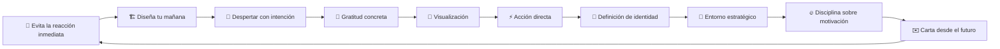
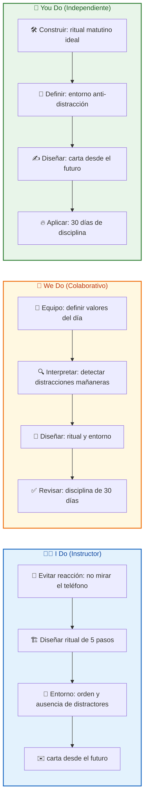
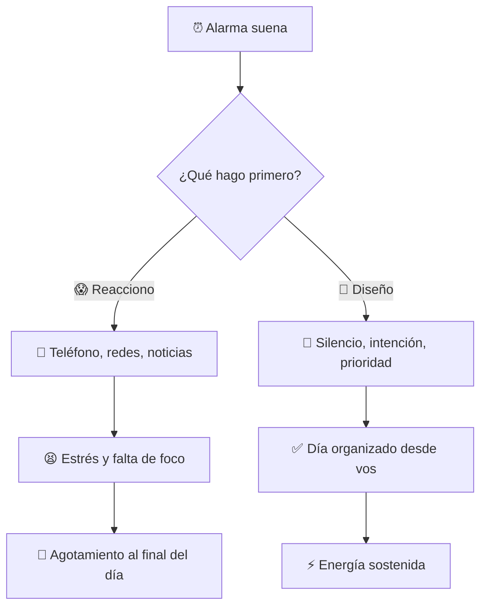
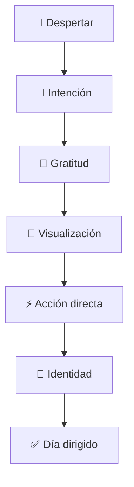
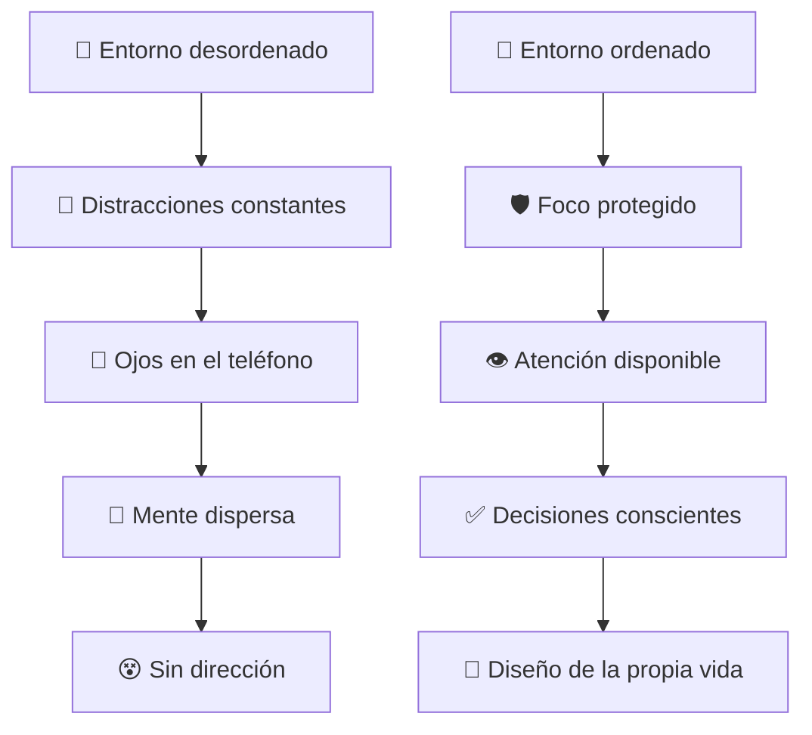
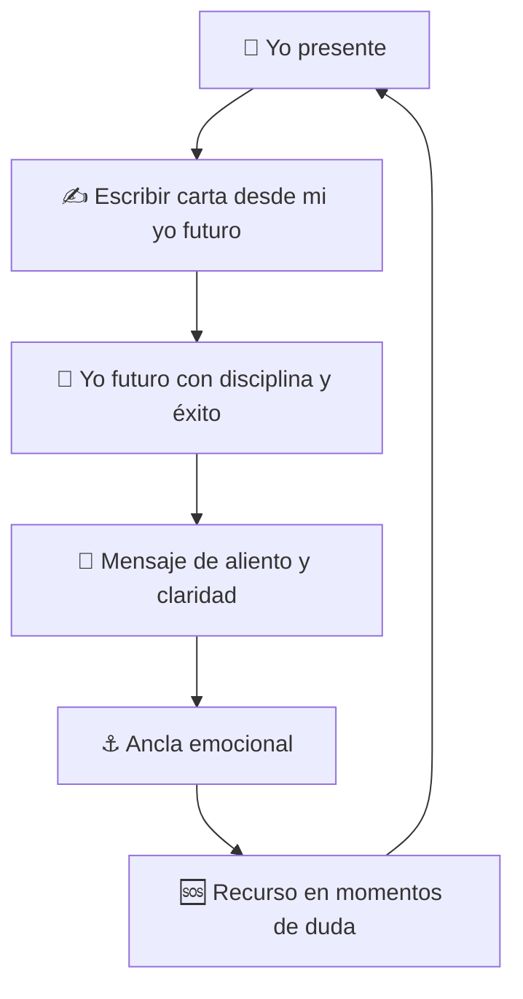
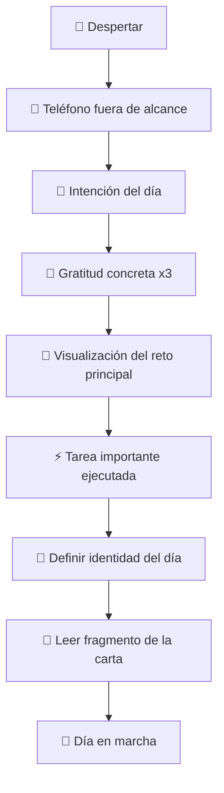

## 🎯 ¿Qué vas a aprender

En este contenido desarrollarás un sistema práctico para transformar tus mañanas y tu rendimiento diario:

- 🚨 Por qué la mayoría de las personas empiezan el día reaccionando en lugar de dirigiendo
- 🏗️ Cómo diseñar un ritual matutino que defina tu energía, foco y liderazgo personal
- ⚙️ El sistema de **5 pasos** para el control mental: intención, gratitud, visualización, acción e identidad
- 🔮 El papel del entorno estratégico en tu capacidad de enfoque
- ✉️ El ejercicio de la carta desde tu versión futura como ancla de disciplina

---

# MASTERCLASS: El Poder de tu Mañana ☀️ — Rituales Matutinos, Disciplina y Liderazgo Personal

## 🎬 INTRODUCCIÓN: POR QUÉ ESTA MASTERCLASS ES DIFERENTE

La mayoría de los libros de productividad empiezan por la lista de tareas, las apps o las técnicas de gestión del tiempo. Esta masterclass empieza por un momento mucho más básico y mucho más poderoso: **el primer minuto de tu día**.

⏰ Los primeros minutos del día definen tu enfoque, tu energía ⚡ y tu capacidad de liderazgo personal 👑. Si empezás reaccionando a estímulos externos (📳 alarma, 📱 teléfono, 📲 redes sociales), el resto del día se organiza alrededor de las prioridades de otros. Si empezás con intención 🎯, el resto del día se organiza alrededor de tus prioridades.

En esta charla, el creador explica por qué tomar el control de tu mañana no es un lujo: es el primer acto de liderazgo sobre tu propia vida 💪. No se trata de madrugar a las 5 AM por moda. Se trata de proteger el primer momento del día para ordenar tu mente, definir tu foco y ejecutar lo importante antes de que el ruido empiece.

El ejercicio de la carta desde tu versión futura es la herramienta final: un ancla emocional ⚓ que te recuerda quién estás decidiendo ser cuando la motivación se apaga.

> **🎯 Objetivo de Aprendizaje** — Al final de esta guía, podrás diseñar un ritual matutino sostenible, aplicar el sistema de 5 pasos para el control mental, modificar tu entorno estratégico y escribir tu carta desde el futuro como ancla de disciplina.

> **⚠️ Advertencia educativa** — Este contenido es formativo. No sustituye asesoría psicológica, médica ni profesional. Úsalo como marco de reflexión y acción personal.

---

## 🗺️ MAPA DEL WORKFLOW DE LA MAÑANA



| 🚀 Fase | ❓ Pregunta que responde | 🎁 Output principal |
|---------|--------------------------|---------------------|
| **Reacción vs. diseño** | ¿Por qué la mayoría pierde el control de su mañana? | 🧠 Conciencia del patrón automático |
| **Diseño matutino** | ¿Qué protegés y qué ordenás en tu mañana? | 📋 Rutina con propósito |
| **Intención** | ¿Cómo querés sentirte y qué querés lograr hoy? | 🧭 Dirección del día |
| **Gratitud** | ¿Qué aspectos específicos valorás hoy? | 🔄 Cambio de perspectiva |
| **Visualización** | ¿Cómo se ve el éxito en tus retos de hoy? | 🗺️ Mapa mental previo |
| **Acción** | ¿Cuál es la tarea más importante que podés ejecutar? | 🏗️ Avance tangible |
| **Identidad** | ¿Qué carácter y actitud elegís hoy? | 🎭 Elección consciente |
| **Entorno** | ¿Qué elementos de tu espacio te ayudan o te distraen? | 🌍 Diseño ambiental |
| **Disciplina** | ¿Por qué 30 días transforman tu identidad? | 🔄 Cambio sostenible |
| **Carta futura** | ¿Qué te diría tu versión futura en un momento de duda? | ⚓ Ancla emocional |



---

## 🕐 PARTE 1: LA TRAMPA DE LA REACCIÓN INMEDIATA (0:59 - 1:30)

### 🎯 1.1 Principio Central

😱 La mayoría de las personas comienza el día en estado de reacción. La alarma suena 📳, el teléfono está al alcance de la mano 🤳, y antes de haber abierto los ojos 👀 ya están respondiendo a estímulos externos: mensajes 📱, notificaciones 🔔, redes sociales 📱, noticias 📰.

Esa forma de empezar genera estrés 😫, falta de dirección 🧭 y la sensación de que el día te pertenece menos de lo que debería. No es casualidad que muchas personas terminen la semana con la sensación de haber vivido días ajenos.

👑 El primer acto de liderazgo personal es dejar de reaccionar para empezar a diseñar 🎨.



### 📊 1.2 Reacción vs. diseño

| 😱 Reacción inmediata | 🧘 Diseño consciente |
|-----------------------|----------------------|
| 📱 Mirar el teléfono primero | 🛡️ Proteger los primeros minutos |
| 📰 Consumir noticias o redes antes de pensar | 🎯 Ordenar prioridades antes de consumir |
| 🧠 Empezar el día con el cerebro de otro | 🧠 Empezar el día con tu propia dirección |
| 😰 Sentirse víctima del ritmo externo | 😎 Sentirse dueño del propio foco |
| 🪫 Agotamiento al final de la mañana | ⚡ Energía sostenida |

### 🔥 1.3 Por qué la reacción es tan adictiva

| Factor | 🎯 Efecto |
|--------|----------|
| 🍩 Dopamina inmediata | El teléfono genera recompensa rápida |
| ✅ Sensación de productividad | Responder mensajes se siente útil |
| 😨 FOMO | Miedo a perderse algo importante |
| 🧠 Hábito automatizado | El cerebro repite lo que funciona |
| 🌐 Entorno diseñado para distraer | Apps y notificaciones compiten por tu atención |

### 💻 1.4 Protocolo de la primera hora

```python
class RitualMatutino:
    def __init__(self):
        self.telefono = "📵 fuera de alcance"
        self.orden = ["intencion", "gratitud", "visualizacion", "accion", "identidad"]
        self.duracion = "15-30 minutos"
        self.entorno = "ordenado y silencioso"

    def ejecutar(self):
        return {
            "reaccion": "❌ omitida",
            "diseno": "✅ activo",
            "resultado": "🎯 día dirigido desde vos",
        }

    def validar(self):
        return self.telefono != "al alcance" and len(self.orden) == 5
```

### 🏋️ 1.5 I Do — Diagnosticar tu mañana actual

**🎯 Objetivo:** tomar conciencia del patrón actual sin juicio.

| Paso | 🔨 Acción | 🎁 Resultado |
|------|-----------|--------------|
| 1️⃣ | Escribir qué haces en los primeros 20 minutos | 📋 Patrón actual |
| 2️⃣ | Marcar qué es reacción y qué es diseño | 🧠 Conciencia |
| 3️⃣ | Identificar la reacción más costosa | 🎯 Foco de cambio |
| 4️⃣ | Definir una sustitución simple | 🚀 Primer paso |

### 🤝 1.6 We Do — Diseñar la primera hora ideal

**🎭 Escenario:** alguien quiere dejar de mirar el teléfono al despertar.

| 😰 Momento actual | ✅ Nueva conducta | 🎯 Señal de éxito |
|-------------------|-------------------|-------------------|
| ⏰ Alarma → 📱 teléfono | ⏰ Alarma → 🧘 respirar 3 veces | No toca el celular en los primeros 10 minutos |
| 📱 Redes en la cama | 💧 Agua + ritual corto | Se levanta con dirección |
| 📰 Noticias en el desayuno | 📝 Gratitud escrita | El desayuno es momento de calma |

### 📝 1.7 You Do — Tu contrato con tu mañana

```text
📋 En los primeros 20 minutos del día, a partir de mañana:

✅ Voy a hacer (diseño):
1. __________________________________________________
2. __________________________________________________
3. __________________________________________________

❌ Voy a evitar (reacción):
1. __________________________________________________
2. __________________________________________________

🎯 La señal de que lo logré es:
__________________________________________________
```

---

## 🧠 PARTE 2: SISTEMA DE 5 PASOS PARA EL CONTROL MENTAL (4:35 - 5:54)

### 🎯 2.1 Principio Central

🧠 El control mental matutino no es un ejercicio de pensamiento positivo. Es un sistema de **5 pasos** ⚙️ que ordena la mente antes de que el mundo 🌍 empiece a pedirle cosas.

Cada paso tiene una función específica: la intención define el rumbo 🧭, la gratitud cambia la perspectiva 🔄, la visualización prepara el éxito 🏆, la acción ejecuta lo importante ⚡ y la identidad elige quién sos en el proceso 🦁.



### 🎯 2.2 Paso 1: Despertar con intención

Definí cómo querés sentirte y qué querés lograr hoy. No es una lista de tareas. Es una dirección emocional y práctica.

| ❓ Pregunta | 💡 Ejemplo de respuesta |
|--------------|--------------------------|
| ¿Cómo quiero sentirme hoy? | "Presente, tranquilo, enfocado 🧘" |
| ¿Qué quiero conseguir hoy? | "Avanzar el proyecto principal 🏗️" |
| ¿Qué tipo de día quiero? | "Un día de progreso, no de perfección ✨" |

### 🙏 2.3 Paso 2: Gratitud concreta

Enfocáte en aspectos específicos que valorás. La gratitud no es un ejercicio genérico de "agradecer por todo". Es un ejercicio de reconocer lo que ya está funcionando para cambiar tu perspectiva desde la escasez hacia la oportunidad.

| 😕 Gratitud vaga | ✅ Gratitud concreta |
|-------------------|----------------------|
| "Agradezco mi familia" | "Agradezco que mi hermano me escribió ayer 💬" |
| "Agradezco mi trabajo" | "Agradezco que esta semana pude resolver el problema del cliente ✅" |
| "Agradezco la salud" | "Agradezco que puedo caminar sin dolor hoy 🦿" |

### 🧠 2.4 Paso 3: Visualización

Ensaya mentalmente el éxito en tus retos diarios. No es fantasía. Es preparación psicológica 🧠: tu cerebro no distingue mucho entre una escena imaginada con intensidad y una escena real. Si te visualizás manejando bien una situación difícil, cuando llegue el momento real estarás más calmado y más competente.

| 🔢 Paso | 🔨 Acción |
|---------|----------|
| 1️⃣ | Cerrar los ojos 1 minuto 👁️ |
| 2️⃣ | Visualizar el reto del día 🎯 |
| 3️⃣ | Ver cómo lo manejás con calma y competencia 😎 |
| 4️⃣ | Sentir la satisfacción del resultado ✨ |
| 5️⃣ | Abrir los ojos y ejecutar 🚀 |

### ⚡ 2.5 Paso 4: Acción directa

Ejecutá la tarea más importante para avanzar hacia tus metas 🏆. Este paso convierte el ritual en resultado. No es suficiente con pensar bien: tenés que mover la primera pieza antes de que el mundo te invada con sus prioridades.

| 📋 Criterio | ✅ Acción |
|-------------|----------|
| 🎯 Tarea más importante | Definirla la noche anterior o en el ritual |
| 🌅 Primera hora | Avanzar al menos un paso concreto |
| 💪 Sin perfección | Avanzar 5 minutos ya es victoria |
| 🛡️ Protegida | No ver mails ni mensajes antes de esta acción |

### 🦁 2.6 Paso 5: Definición de identidad

Elegí conscientemente el carácter y la actitud con la que actuarás hoy. La productividad no es solo hacer cosas. Es hacerlas desde una identidad elegida, no desde un estado reactivo.

| 🎭 Identidad posible | ⚡ Acta en consecuencia |
|-----------------------|--------------------------|
| "Soy una persona disciplinada 💪" | No pospone la tarea importante |
| "Soy una persona calmada 🧘" | No reacciona con ansiedad al primer problema |
| "Soy una persona generosa ❤️" | Busca dar incluso cuando está ocupado |
| "Soy una persona valiente 🦁" | Hace la llamada difícil o empieza el proyecto |

### 🏋️ 2.7 I Do — Aplicar los 5 pasos a un día real

**🎯 Objetivo:** experimentar el sistema completo en un día elegido.

| 🔢 Paso | ⏰ Momento | 🔨 Acción concreta | 🎯 Resultado esperado |
|---------|-----------|--------------------|-----------------------|
| 1️⃣ | Al despertar, definir intención en una frase | 🧭 Dirección clara |
| 2️⃣ | Agradecer 3 cosas específicas | 🔄 Cambio de perspectiva |
| 3️⃣ | Visualizar la reunión difícil del día | 😌 Calma previa |
| 4️⃣ | Ejecutar la tarea más importante primero | 🏗️ Avance tangible |
| 5️⃣ | Declarar la identidad del día | 🎭 Actitud elegida |

### 🤝 2.8 We Do — Diseñar los 5 pasos para un emprendedor

**🎭 Escenario:** un emprendedor tiene una semana difícil por delante.

| 🔢 Paso | 🎯 Aplicación específica |
|---------|---------------------------|
| 🧭 Intención | "Hoy respondo sin ansiedad y avanzo sin distraerme" |
| 🙏 Gratitud | "Agradezco que mi equipo confía en mí" |
| 🧠 Visualización | "Visualizo la reunión de ventas saliendo bien 📈" |
| ⚡ Acción | "Escribir el mensaje de seguimiento antes de abrir correo 📧" |
| 🦁 Identidad | "Hoy soy un líder que escucha antes de reaccionar 👂" |

### 📝 2.9 You Do — Tu sistema de 5 pasos

Completa:

```text
📋 Mi intención de hoy es:
__________________________________________________

🙏 Agradezco específicamente:
1. __________________________________________________
2. __________________________________________________
3. __________________________________________________

🧠 Visualizo este reto hoy:
__________________________________________________

⚡ La acción directa que ejecuto primero es:
__________________________________________________

🦁 La identidad que elijo hoy es:
__________________________________________________
```

---

## 🔮 PARTE 3: ENTORNO ESTRATÉGICO Y CONSISTENCIA (8:18 - 8:47, 14:16)

### 🎯 3.1 Principio Central

🧠 Tu mente absorbe lo que te rodea. No es una metáfora: es un hecho con implicancias prácticas. Un espacio ordenado 🧹, silencioso 🤫 y libre de distractores no es un lujo estético. Es una **herramienta de liderazgo personal** 👑.

Mantener el teléfono lejos 📵, la mesa despejada 🪑 y el entorno alineado con tu foco no es "ser organizado". Es proteger tu capacidad de dirigirte antes de que el mundo 🌍 empiece a hacerlo por vos.



### 📋 3.2 Entorno estratégico: elementos clave

| 🎯 Elemento | ✅ Estado deseado | 💡 Por qué |
|-------------|-------------------|------------|
| 📱 Teléfono | 📵 Fuera del alcance visual | Reduce la tentación de reacción |
| 🪑 Mesa de trabajo | Solo lo necesario para la tarea | Reduce la carga cognitiva |
| 🔔 Notificaciones | 🚫 Desactivadas en la mañana | Protege la atención |
| 🌍 Espacio físico | Ordenado, ventilado, con luz natural ☀️ | Refuerza claridad mental |
| 🔊 Sonido | 🤫 Silencio o música instrumental 🎵 | Facilita la concentración profunda |
| 👕 Ropa | Cómoda, lista desde la noche anterior | Elimina decisiones tempranas |

### 🔥 3.3 Disciplina sobre motivación

La motivación es emocional y volátil 😂. La disciplina es estructural y repetitiva 🧱. El progreso real no viene de los momentos de inspiración. Viene de la constancia de un ritual ejecutado incluso cuando no tenés ganas.

| 🎢 Motivación | 🧱 Disciplina |
|---------------|---------------|
| 😂 Depende del estado de ánimo | Se ejecuta sin importar el estado |
| ⚡ Aparece en momentos de inspiración | Se construye en momentos de cansancio |
| 📈 Genera avances irregulares | Genera progreso acumulativo |
| 📉 Se acaba cuando el entusiasmo baja | Se convierte en identidad |

### 📅 3.4 La regla de los 30 días

El creador enfatiza que comprometerse con un ritual durante 30 días no solo genera resultados: transforma la identidad. Después de 30 días, ya no es "un ritual que hago". Es "algo que soy" 🦁.

| 📆 Día 1-7 | 📆 Día 8-21 | 📆 Día 22-30 | ✨ Después del día 30 |
|------------|------------|-------------|----------------------|
| 😤 Esfuerzo consciente | 😐 Empieza a ser automático | ✅ Se siente natural | 🦁 Es parte de la identidad |
| 😓 Olvidos frecuentes | 🥱 Menos resistencia | 😊 Menos resistencia | 😍 Se extraña si no se hace |

### ⚠️ 3.5 Errores comunes en la construcción de disciplina

| ❌ Error | 😰 Síntoma | ✅ Solución |
|----------|-----------|------------|
| Empezar con too much 😵 | Agotamiento en la primera semana | Empezar con 5 minutos |
| Depender de la motivación 😂 | No lo hacés los días malos | Atar a un evento existente (ej: cepillarse los dientes) |
| No proteger el entorno 🌚 | Recaer por distractores visibles | Modificar el espacio antes de dormir |
| Medir solo el resultado grande 📈 | Desmotivación si el avance es lento | Medir la reps, no el resultado |
| Saltarse un día por excusa 😴 | Se convierte en dos, luego en cero | Regla del no-romper-la-cadena con misericordia |

### 🏋️ 3.6 I Do — Modificar tu entorno estratégico

**🎯 Objetivo:** transformar tu espacio matutino en una herramienta de foco.

| Paso | 🔨 Acción | 🎁 Resultado |
|------|-----------|--------------|
| 1️⃣ | Elegir la zona de ritual (silla, mesa, rincón) | 🪑 Espacio definido |
| 2️⃣ | Mover el teléfono fuera de alcance 📵 | Eliminar reacción automática |
| 3️⃣ | Dejar el texto del ritual a la vista 👁️ | Recordatorio visual |
| 4️⃣ | Preparar la ropa la noche anterior 👕 | Eliminar decisión matutina |
| 5️⃣ | Probar el entorno mañana 🧪 | Validación real |

### 🤝 3.7 We Do — Diseñar una regla de 30 días

**🎭 Escenario:** un equipo quiere comprometerse con un ritual matutino colectivo o individual.

| 📅 Semana | 🎯 Objetivo | 🔨 Acción |
|-----------|-------------|----------|
| 1️⃣ | Diseñar el ritual de 5 pasos ⚙️ | Escribirlo y probarlo |
| 2️⃣ | Proteger el entorno 🔮 | Eliminar distractores |
| 3️⃣ | Medir solo la reps 📊 | Contar días cumplidos, no resultados |
| 4️⃣ | Integrar la identidad 🦁 | Declarar "soy alguien que hace esto" |

### 📝 3.8 You Do — Tu contrato de 30 días

```text
📋 Mi ritual matutino durará:
__________________________________________________ minutos

⏰ Lo ejecutaré todos los días a las:
__________________________________________________

🔮 El entorno que lo protege es:
__________________________________________________

📅 La regla de estos 30 días es:
__________________________________________________

🔄 Si fallo un día, la rebote es:
__________________________________________________
```

---

## ✉️ PARTE 4: EJERCICIO DE LA CARTA DESDE TU VERSIÓN FUTURA (12:09 - 13:05)

### 🎯 4.1 Principio Central

✉️ El ejercicio de la carta consiste en escribir desde la perspectiva de tu "versión futura" 🦁 —esa versión de vos que ya tiene la disciplina 🔥, el éxito 🏆 y la claridad 💡 que estás buscando— un mensaje dirigido a tu yo presente 🙋.

No es un ejercicio de fantasía 🦄. Es un ejercicio de anclaje emocional ⚓: cuando estés cansado 😴, dubitativo 🤔 o con ganas de abandonar 🏳️, esa carta te recuerda quién estás decidiendo ser y por qué vale la pena el esfuerzo 💪.



### 📋 4.2 Estructura de la carta desde el futuro

| 🎯 Elemento | 📝 Detalle |
|-------------|------------|
| 📤 Desde | Tu yo futuro con disciplina instalada 🦁 |
| 📥 Hacia | Tu yo presente en proceso 🙋 |
| 🎭 Tono | Comprensivo, firme, alentador ❤️ |
| 📖 Contenido | Recuerdos de cuando querías abandonar, razones para seguir, la vida que ganaste al persistir |

### ❓ 4.3 Preguntas guía para la carta

```text
1. ¿Qué recuerdo de los momentos en que quisiste abandonar quiero destacar?
2. ¿Qué aprendizaje me dio ese momento que ahora valoro?
3. ¿Cómo es mi vida hoy gracias a esa disciplina?
4. ¿Qué me hubiera querido escuchar en ese momento difícil?
5. ¿Qué me digo ahora sobre la importancia de seguir?
```

### 📖 4.4 Ejemplo de carta (fragmento)

```text
✉️ Querido yo del pasado:

Te escribo desde el día en que finalmente lo entendiste 💡. No fue el día
del gran éxito 🏆. Fue un martes cualquiera 📅, después de semanas de mostrar
sin ver resultados 📉. Quiero recordarte algo:

Esa mañana que querías apagar la alarma ⏰ y no hacer el ritual...
lo hiciste igual 💪. Y ese día no pasó nada extraordinario ✨. Pero fue la
repetición número 27 de ese pequeño acto de disciplina 🔥, y en la 28
algo cambió 🔄. No el resultado. Sos vos 🦁. Tu mirada sobre lo que era
"no vale la pena" cambió por "esto me está construyendo" 🏗️.

Hoy tengo la vida que soñabas 🌟. No porque el camino fue fácil 🛤️, sino
porque lo recorriste incluso cuando no veías el final 🏁.
```

### 🛠️ 4.5 Cómo usar la carta en la práctica

| ⏰ Momento de uso | 🔨 Acción |
|-------------------|-----------|
| 🌅 Antes de empezar el día | Leer un fragmento antes del ritual |
| 🤔 Cuando sientas dudas | Abrirla y leer la frase que te escribiste |
| 😓 Cuando quieras abandonar | Recordar quién te escribió y por qué |
| 📅 En la revisión semanal | Releerla entera y ajustar lo necesario |

### 🏋️ 4.6 I Do — Escribir la primera versión de la carta

**🎯 Objetivo:** crear un recurso emocional concreto.

| Paso | 🔨 Acción | 🎁 Resultado |
|------|-----------|--------------|
| 1️⃣ | Cerrar los ojos 2 minutos y visualizar tu yo futuro 👁️ | Conexión emocional |
| 2️⃣ | Escribir como si ese yo futuro hablara ahora ✍️ | ⚓ Ancla creada |
| 3️⃣ | Incluir un momento específico de duda | 🎯 Credibilidad |
| 4️⃣ | Incluir la vida que ganaste al persistir | ✨ Sentido |
| 5️⃣ | Guardarla en un lugar visible 📌 | 📱 Accesibilidad |

### 🤝 4.7 We Do — Leer y ajustar cartas en pareja o equipo

**🎭 Escenario:** dos personas comparten sus cartas para sostener la disciplina mutuamente.

| 🎯 Elemento | 🔨 Acción |
|-------------|-----------|
| 📖 Compartir | Leer la carta en voz alta |
| 👁️ Observar | Detecta frases que resuenan más |
| ✏️ Ajustar | Agregar la frase que más te impactó |
| 🤝 Comprometerse | Revisitar la carta en 7 días |

### 📝 4.8 You Do — Tu carta desde el futuro

Completa:

```text
✉️ Querido yo del presente:

Te escribo desde _______________________________________.

En este momento estás sintiendo __________________________,
pero te quiero recordar que _______________________________.

Esa decisión que estás por tomar (o evitar) es
_______________________________________________________

Lo que ganaste al persistir es:
__________________________________________________

Tu identidad actual, desde mi mirada, es:
__________________________________________________

Seguí. No porque yo lo diga. Sino porque el futuro que estás
construyendo vale cada repetición.

Con afecto,
Tu yo del futuro 🦁
```

---

## 🧩 PARTE 5: RITUAL MATUTINO COMPLETO — PONIENDO TODO JUNTO

### 🎯 5.1 Principio Central

🧩 Un ritual matutino no es una lista de tareas que hay que cumplir para sentirse productivo. Es una **secuencia diseñada** 🎨 para proteger tu foco 👁️, cambiar tu perspectiva 🔄 y ejecutar lo importante ⚡ antes de que el ruido exterior 📢 tome el control.

⏰ La duración ideal es entre **15 y 30 minutos**. No más larga: lo que no es sostenible no es ritual, es obligación 😓.



### ⚙️ 5.2 Protocolo completo de 5 pasos

| 🔢 Paso | ⏰ Duración | 🔨 Acción | 🎁 Resultado |
|---------|-------------|-----------|--------------|
| 1️⃣ | 2 min | 🎯 Definir intención del día en una frase | 🧭 Dirección |
| 2️⃣ | 2 min | 🙏 Agradecer 3 cosas específicas | 🔄 Perspectiva |
| 3️⃣ | 3 min | 🧠 Visualizar el reto principal del día | 🧠 Preparación mental |
| 4️⃣ | 10-20 min | ⚡ Ejecutar la tarea más importante | 🏗️ Avance tangible |
| 5️⃣ | 2 min | 🦁 Declarar la identidad del día y leer la carta | ⚓ Ancla emocional |

### 🗓️ 5.3 Ejemplo de un día real con el ritual

```text
🌅 6:30 — Despertar, no tocar el teléfono
6:32 — 🎯 Intención: "Hoy respondo sin ansiedad y avanzo sin distraerme"
6:34 — 🙏 Gratitud: café, salud, oportunidad de trabajar en lo que me gusta
6:37 — 🧠 Visualización: la reunión de las 10 sale bien, escucho activamente
6:40 — ⚡ Acción directa: escribir el mensaje importante antes de abrir correo
6:50 — 🦁 Identidad: "Soy una persona que elige antes de reaccionar"
6:52 — 📖 Leer fragmento de la carta desde el futuro
6:55 — 📱 Ahora sí: mirar el teléfono y empezar el día 🚀
```

### 🎭 5.4 Variantes del ritual

| 👤 Perfil | 🎯 Variante recomendada | ⏰ Duración |
|-----------|--------------------------|-------------|
| 🦉 Madrugador extremo | Extender visualización y gratitud | 30-40 min |
| 🌅 Madrugador moderado | Ritual enfocado en acción | 15 min |
| 🐦 No madrugador | Ritual corto antes de empezar la jornada | 10 min |
| 🏢 Emprendedor | Agregar revisión de métricas principales | 25 min |
| 📚 Estudiante | Agregar repaso rápido del día | 20 min |

### ⚠️ 5.5 Errores comunes al implementar el ritual

| ❌ Error | 😰 Consecuencia | ✅ Solución |
|----------|----------------|------------|
| Hacerlo perfecto o no hacerlo 😵 | Abandono rápido | Empezar con 5 minutos |
| Mezclar el ritual con el teléfono 📱 | Dilución de la práctica | 📵 Teléfono fuera de alcance siempre |
| Cambiar el ritual cada semana 🔄 | No construir hábito | Mantener el mismo ritual 30 días |
| Juzgar los días malos 😓 | Culpa que destruye la consistencia | Un día malo no cancela la racha |
| Buscar resultados inmediatos 📈 | Desmotivación | Medir reps, no resultados |

### 🏋️ 5.6 I Do — Construir tu ritual personal

**🎯 Objetivo:** armar un ritual que puedas sostener mañana mismo.

| Paso | 🔨 Acción | 🎁 Resultado |
|------|-----------|--------------|
| 1️⃣ | Elegir 3 pasos del sistema de 5 ⚙️ | 🎭 Ritual personalizado |
| 2️⃣ | Definir duración total ⏰ | Realismo |
| 3️⃣ | Elegir horario fijo ⏰ | Constancia |
| 4️⃣ | Preparar el entorno la noche anterior 🔮 | Facilidad |
| 5️⃣ | Ejecutarlo mañana 🚀 | Validación |

### 🤝 5.7 We Do — Ajustar el ritual después de una semana

**🎭 Escenario:** alguien probó el ritual y lo abandonó.

| ❓ Pregunta | 💡 Respuesta esperada |
|-------------|------------------------|
| ¿Qué paso falló? | No protegió el teléfono 📱 |
| ¿Qué lo generó? | Mensajes matutinos inesperados |
| ¿Qué ajuste? | Teléfono en otra habitación la noche anterior |
| ¿Qué se mantiene? | La gratitud funcionó 🙏 |
| ¿Próximo intento? | Conservar los pasos que funcionaron, ajustar uno |

### 📝 5.8 You Do — Tu ritual de 21 días

```text
📋 Mi ritual matutino de 21 días:

⏰ Horario: __________________________________________________

🪑 Lugar: __________________________________________________

🔢 Pasos:
1. __________________________________________________ (min)
2. __________________________________________________ (min)
3. __________________________________________________ (min)
4. __________________________________________________ (min)
5. __________________________________________________ (min)

⏱️ Total aproximado: ______________________________________ minutos

📵 Teléfono: __________________________________________________

🔮 Entorno: __________________________________________________

⚓ Ancla emocional (carta): __________________________________
```

---

## 🏆 COMPARATIVA FINAL

| 🧩 Concepto | 📝 Definición práctica | 🎁 Resultado esperado |
|-------------|------------------------|-----------------------|
| **😱 Reacción inmediata** | Empezar el día respondiendo a estímulos externos | 😫 Estrés, falta de foco |
| **🧘 Diseño matutino** | Proteger el primer momento para definir prioridades | ✅ Día dirigido por vos |
| **🎯 Intención** | Definir cómo querés sentirte y qué querés lograr | 🧭 Dirección clara |
| **🙏 Gratitud** | Enfocarse en aspectos específicos que valoras | 🔄 Perspectiva de oportunidad |
| **🧠 Visualización** | Ensayar mentalmente el éxito en retos diarios | 🧠 Preparación psicológica |
| **⚡ Acción directa** | Ejecutar la tarea más importante primero | 🏗️ Avance tangible |
| **🦁 Identidad** | Elegir conscientemente el carácter del día | 👑 Liderazgo personal |
| **🔮 Entorno estratégico** | Ordenar el espacio y alejar distractores | 🛡️ Foco sostenido |
| **🔥 Disciplina** | Repetición durante 30 días sin depender de la motivación | 🔄 Cambio de identidad |
| **✉️ Carta futura** | Escribir desde tu versión con disciplina como ancla | ⚓ Recurso emocional en la duda |

---

## 🏁 CONCLUSIÓN

> ☀️ Tu mañana no es solo el comienzo del día. Es el primer acto de liderazgo sobre tu propia vida. Si no tomás el control en los primeros minutos, el mundo lo hará por vos.

🎤 El creador de esta guía no te pide que te levantes a las 5 AM ⏰, que hagas una rutina de 2 horas 🕐 ni que te conviertas en una máquina de productividad 🤖. Te pide algo más simple y más poderoso 💎: que los primeros minutos de tu día sean tuyos.

No por egoísmo 😌. Por eficiencia espiritual y operativa ⚡. Una mente ordenada 🧹, agradecida 🙏, visualizada 🧠 y enfocada 🎯 genera una vida ordenada, agradecida, visualizada y enfocada ✨.

El sistema de 5 pasos ⚙️ no es una lista para cumplir. Es un menú 🍽️ para diseñar tu propia versión. La gratitud 🙏 y la visualización 🧠 no son ejercicios de autoayuda vacía: son herramientas de reencuadre cognitivo respaldadas por décadas de estudio en psicología 🧑‍⚕️ y rendimiento 📈. La identidad 🦁 no es una frase de afirmación vacía: es la elección más poderosa que podés hacer porque define la totalidad de cómo interpretás y respondés al mundo 🌍.

Y la disciplina 🔥... la disciplina no es un castigo. La disciplina es el acto de confiar en tu yo del futuro 🦁 más de lo que confiás en tu comodidad del presente 🛋️. Los 30 días no son una meta 🏁. Son el umbral a partir del cual dejás de ser alguien que intenta y pasás a ser alguien que es ✨.

---

## ✅ CHECKLIST FINAL

| 🧩 Bloque | ✅ Check |
|-----------|----------|
| 🚨 Reacción | Identifiqué mi reacción matutina más costosa |
| 🏗️ Diseño | Diseñé mi ritual de los 5 pasos ⚙️ |
| 🔮 Entorno | Modifiqué mi espacio para proteger el foco |
| 🔥 Disciplina | Me comprometí con 30 días de repetición |
| ✉️ Carta | Escribí mi carta desde el yo futuro |
| 🦁 Identidad | Declaré quién elijo ser hoy |

---

## 📝 PREGUNTAS DE VERIFICACIÓN

1. **🎯 Aplica**: Si tu primer acto al despertar es mirar el teléfono 📱, ¿qué estás priorizando: tu dirección o la dirección de otros?
2. **🔍 Analiza**: ¿Cómo cambia tu día cuando empezás reaccionando versus cuando empezás diseñando?
3. **🎨 Diseña**: Escribí tu ritual matutino en 5 pasos con duración aproximada. ¿Podés ejecutarlo mañana sin esfuerzo?
4. **💭 Reflexiona**: El creador dice que 30 días de disciplina transforman la identidad. ¿Qué identidad querés construir en los próximos 30 días?

---

## 📖 GLOSARIO RÁPIDO

| 📚 Término | 📝 Definición |
|------------|---------------|
| **🧘 Ritual matutino** | Secuencia intencional de acciones en los primeros minutos del día |
| **😱 Reacción inmediata** | Empezar el día respondiendo a estímulos externos sin filtro |
| **🏗️ Diseño consciente** | Proteger el primer momento para definir prioridades propias |
| **🎯 Intención** | Define cómo querés sentirte y qué querés lograr hoy |
| **🙏 Gratitud concreta** | Agradecimiento por aspectos específicos, no genérico |
| **🧠 Visualización** | Ensayo mental del éxito en retos diarios |
| **⚡ Acción directa** | Ejecutar la tarea más importante antes de que el ruido empiece |
| **🦁 Identidad** | Elección consciente del carácter y la actitud del día |
| **🔮 Entorno estratégico** | Espacio físico diseñado para reforzar el foco |
| **🔥 Disciplina** | Repetición sostenida independientemente de la motivación |
| **✉️ Carta desde el futuro** | Ancla emocional escrita desde la versión futura de vos |
| **👑 Liderazgo personal** | Capacidad de dirigir la propia vida antes de que otros lo hagan |

---

