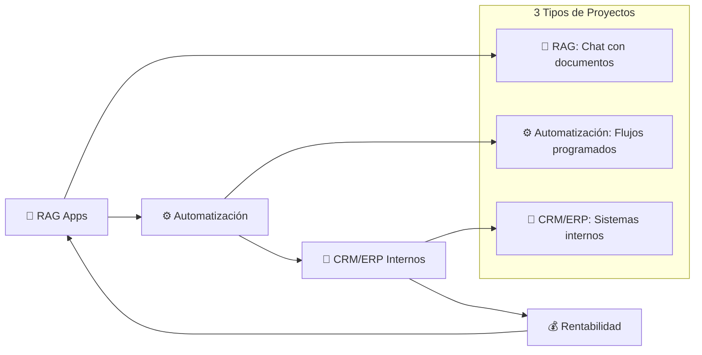
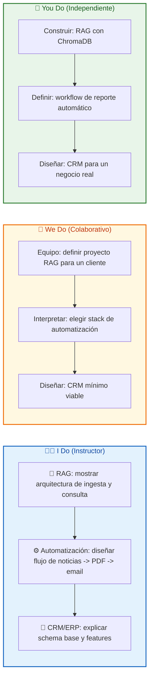

## 🎯 ¿Qué vas a aprender

En este contenido desarrollarás la visión práctica para identificar y construir los proyectos más demandados del mercado:

- 💡 Los 3 tipos de proyectos que siguen generando ingresos estables incluso en la era de la IA
- 🛠️ Stack tecnológico recomendado para cada uno
- ⚠️ Errores comunes que te harán perder clientes
- 📝 Ejemplos conceptuales listos para adaptar
- 💰 Estrategias para posicionarte y vender estos servicios

---

# MASTERCLASS: Proyectos Tecnológicos Rentables en la Era de la IA 🤖 — RAG, Automatización y CRM/ERP

## 🎬 INTRODUCCIÓN: POR QUÉ ESTA MASTERCLASS ES DIFERENTE

A pesar del crecimiento exponencial de la inteligencia artificial, el mercado no busca "más IA". Busca soluciones que funcionen hoy, con los datos de hoy, para los problemas de hoy.

En este video, Fazt explica que existen tres categorías de proyectos que siguen siendo altamente demandadas por empresas, incluso en la era de la Inteligencia Artificial:

1. **Aplicaciones RAG** 📄💬 (documentos + chat)
2. **Workflows de automatización** ⚙️ (flujos programados)
3. **Herramientas internas** 🏢 (CRM, ERP y sistemas a medida)

El autor enfatiza que, aunque herramientas como Abacus aceleren el desarrollo, el valor real reside en **entender cómo estas soluciones resuelven problemas técnicos y de negocio reales**. Eso garantiza una demanda sostenida para freelancers y desarrolladores.

> **🎯 Objetivo de Aprendizaje** — Al final de esta guía, podrás identificar oportunidades de proyectos rentables, diseñar soluciones adaptadas y evitar errores que te hagan perder clientes.

> **⚠️ Advertencia educativa** — Este contenido es formativo. No sustituye asesoría técnica, legal ni financiera profesional. Úsalo como marco de reflexión y acción profesional.

---

## 🗺️ MAPA DEL WORKFLOW DE PROYECTOS RENTABLES



| 🚀 Proyecto | 💡 Problema que resuelve | 🎁 Valor entregado |
|-------------|--------------------------|--------------------|
| **📄 RAG** | Información interna dispersa en PDFs y documentos | Chat inteligente con los datos de la empresa |
| **⚙️ Automatización** | Tareas repetitivas que consumen horas humanas | Flujos que se ejecutan solos, sin errores |
| **🏢 CRM/ERP** | Sistemas genéricos que no se adaptan al negocio | Herramienta hecha a medida para el proceso real |



---

## 📄 PARTE 1: APLICACIONES RAG (Retrieval-Augmented Generation)

### 🎯 1.1 ¿Qué es y por qué lo pagan las empresas?

Son herramientas que permiten a los usuarios subir documentos privados (PDF, Word, Excel, etc.) y **chatear con ellos** 💬.

El valor real para las empresas es sencillo: la información interna —manuales, contratos, reportes, políticas— **no está en internet**. Ningún LLM público la conoce. RAG soluciona esto sin re-entrenar el modelo; simplemente le damos "apuntes" antes del examen 📚.

**Ejemplos de aplicación empresarial:**
- ⚖️ Abogados consultando contratos y jurisprudencia.
- 👔 RRHH respondiendo preguntas sobre el reglamento interno.
- 🛠️ Ingenieros consultando manuales técnicos sin buscar página por página.

> **💡 Tip**: El RAG no es solo tecnología. Es un **producto**. Lo que el cliente paga es que su equipo deje de perder horas buscando información y pase a preguntarle a un sistema que entiende sus documentos.

### 🏗️ 1.2 Arquitectura paso a paso

El proceso se divide en dos fases: **Ingesta** (preparar los datos) y **Consulta** (usarlos).

#### Fase 1: Ingesta 📥

1. **Cargar documentos:** Tienes PDFs, Excels, Markdown.
2. **Chunking (Troceado):** No puedes meter un libro entero en el prompt. Lo divides en pedazos pequeños (ej: párrafos de 500 caracteres).
3. **Embedding (Vectorización):** Pasas cada trozo por un modelo de embeddings (como `text-embedding-3-small` de OpenAI). El texto se convierte en una lista de números (vector) que captura el **significado semántico**.
4. **Almacenamiento:** Guardas esos vectores en una **Base de Datos Vectorial** (Pinecone, ChromaDB, pgvector).

#### Fase 2: Consulta 🔍

1. **Pregunta del usuario:** "¿Cuál es la política de vacaciones?"
2. **Embedding de la pregunta:** Conviertes la pregunta en un vector.
3. **Búsqueda semántica:** Buscas en tu base de datos vectorial los trozos matemáticamente más cercanos a la pregunta.
4. **Construcción del prompt:** Armas un prompt gigante con el contexto recuperado.
5. **Generación:** El LLM lee el contexto y responde con precisión.

### 🛠️ 1.3 Stack tecnológico

```text
📱 Aplicación (Frontend)
    ├── Next.js / React
    └── Upload de archivos

⚙️ Backend / Orquestador
    ├── LangChain o LlamaIndex
    ├── OpenAI / Anthropic / Hugging Face
    └── Workers de ingesta

🗄️ Base de Datos Vectorial
    ├── Pinecone (SaaS, rápido)
    ├── ChromaDB (open source, local)
    └── pgvector (si ya usas PostgreSQL)
```

### 💻 1.4 Ejemplo conceptual

```python
from langchain.vectorstores import Chroma
from langchain.embeddings import OpenAIEmbeddings
from langchain.chat_models import ChatOpenAI
from langchain.chains import RetrievalQA

# 1. Configurar cerebro y embeddings
llm = ChatOpenAI(model_name="gpt-4o")
embeddings = OpenAIEmbeddings()

# 2. Cargar la base de datos vectorial
db = Chroma(persist_directory="./mi_db_vectorial", embedding_function=embeddings)

# 3. Crear el sistema de preguntas y respuestas
qa = RetrievalQA.from_chain_type(
    llm=llm,
    chain_type="stuff",
    retriever=db.as_retriever()
)

# 4. Preguntar
respuesta = qa.run("¿Cuáles son las políticas de vacaciones?")
print(respuesta)
```

### 💡 1.5 Consejos clave

> **💡 Tip 1**: Empezá con ChromaDB en local. No necesitás Pinecone para prototipar. Validá con el cliente, después migrá a la nube.
>
> **💡 Tip 2**: El chunking es más importante que el modelo de embedding. Si cortas mal, ni el mejor modelo arregla el sentido.
>
> **💡 Tip 3**: Agregá citations o referencias al documento original. Las empresas quieren verificar la fuente, no solo recibir la respuesta.

### ⚠️ 1.6 Errores comunes

| ❌ Error | 😰 Síntoma | ✅ Solución |
|----------|-----------|------------|
| 🧩 Mal chunking | El sentido se pierde a mitad del fragmento | Cortar por párrafos o encabezados |
| 🧠 Lost in the middle | El LLM olvida los documentos centrales | Pasar solo los 3-5 trozos más relevantes |
| 🗑️ Datos sucios | El buscador devuelve basura | Limpiar encabezados repetidos y texto basura |
| 💸 Embeddings caros | Costos descontrolados en producción | Usar modelos económicos o self-hosted |

### 🏋️ 1.7 I Do — Construir un RAG básico

**🎯 Objetivo:** montar un prototipo funcional en 30 minutos.

| Paso | 🔨 Acción | 🎁 Resultado |
|------|-----------|--------------|
| 1️⃣ | Instalar ChromaDB y OpenAI SDK | Entorno listo |
| 2️⃣ | Cargar un PDF de ejemplo | Documento ingerido |
| 3️⃣ | Vectorizar y guardar en Chroma | DB lista |
| 4️⃣ | Consultar con una pregunta real | Respuesta con contexto |
| 5️⃣ | Medir tiempo y costo | Base para cotizar |

### 🤝 1.8 We Do — Elegir stack para un cliente real

**🎭 Escenario:** un estudio jurídico quiere chat con sus contratos.

| 🎯 Decisión | ✅ Opción recomendada | 💡 Motivo |
|-------------|-----------------------|-----------|
| Vector DB | Pinecone o pgvector | Escalabilidad si crece |
| Embeddings | OpenAI `text-embedding-3-small` | Calidad y precio |
| Orquestador | LlamaIndex | Mejor manejo de ingesta compleja |
| Frontend | Next.js + shadcn/ui | Rapidez y estética profesional |

### 📝 1.9 You Do — Tu propuesta de RAG

```text
📋 Cliente objetivo:
__________________________________________________

📄 Tipos de documentos:
__________________________________________________

🛠️ Stack elegido:
__________________________________________________

💰 Precio estimado:
__________________________________________________

⏱️ Tiempo de entrega:
__________________________________________________
```

---

## ⚙️ PARTE 2: WORKFLOWS DE AUTOMATIZACIÓN

### 🎯 2.1 ¿Qué es y por qué lo pagan las empresas?

Son flujos automatizados para tareas diarias: resúmenes de noticias 📰, monitoreo de menciones de marca 📢, alertas de precios 💰, ingestión de leads, etc.

El valor real: se ejecutan de forma programada y envían reportes automáticos por correo o Slack **sin intervención humana**. La empresa paga por ahorro de tiempo y por la eliminación del error humano en tareas repetitivas.

**Ejemplos de aplicación empresarial:**
- 📰 Resumir noticias del sector y enviar un briefing matutino al equipo.
- 📢 Monitorear menciones de marca en Twitter/X y generar alertas.
- 💰 Rastrear precios de competidores y notificar cambios.
- 📊 Sincronizar datos entre herramientas (CRM, hojas de cálculo, email marketing).

> **💡 Tip**: La automatización no es solo técnico. Es un **servicio de traducción**: traduces un proceso humano en una serie de pasos lógicos que una máquina puede ejecutar. Eso es lo que el cliente paga.

### 🔄 2.2 Tipos de automatización

Las automatizaciones se clasifican por **trigger**, **procesamiento** y **salida**:

| Tipo | Ejemplos | Cuando usarlo |
|------|----------|---------------|
| **Por trigger** ⏰ | Cron jobs, webhooks, eventos de BD | Cuando necesitás ejecución programada o reactiva |
| **Por ingestión** 📥 | APIs públicas, RSS, scraping | Cuando los datos vienen de fuentes externas |
| **Por salida** 📤 | Email, Slack/Teams, PDF, dashboard | Cuando el resultado debe llegar a una persona o sistema |

### 🛠️ 2.3 Stack tecnológico

```text
🎨 Orquestador visual
    ├── n8n (open source, self-hosted)
    ├── Make (Zapier mejorado)
    └── Zapier

💻 Programación / Scripts
    ├── Python (scraping, procesamiento, NLP)
    ├── Node.js (APIs, webhooks)
    └── Bash (tareas simples)

🗄️ Bases de datos y colas
    ├── PostgreSQL
    ├── Redis (cache y colas)
    └── SQLite (prototipos)
```

> **💡 Tip**: n8n es la mejor opción para clientes que quieren ver y modificar el flujo sin depender de vos. Make es mejor para equipos no técnicos. Zapier es el más caro pero el más simple.

### 📰 2.4 Ejemplo conceptual: flujo de resumen de noticias

```text
1. ⏰ Cron (todos los días a las 7:00)
2. 📥 Fetch de RSS / API de noticias
3. 🔍 Filtrado por palabras clave
4. 🤖 Resumen con LLM (OpenAI / Claude / Gemini)
5. 📄 Formato HTML -> PDF
6. 📤 Envío por correo a la lista de distribución
```

**Pseudocódigo:**

```python
import feedparser
from openai import OpenAI

client = OpenAI()

def resumir_noticias(rss_url, cantidad=5):
    noticias = feedparser.parse(rss_url).entries[:cantidad]
    texto = "\n".join([n.title + ". " + n.summary for n in noticias])
    
    respuesta = client.chat.completions.create(
        model="gpt-4o",
        messages=[
            {"role": "system", "content": "Resume estas noticias en 3 bullets concisos."},
            {"role": "user", "content": texto}
        ]
    )
    
    return respuesta.choices[0].message.content
```

### 💡 2.5 Consejos prácticos

> **💡 Tip 1**: Empezá con un flujo simple. Un solo input, una sola transformación, una sola salida. Después agregá complejidad.
>
> **💡 Tip 2**: Registre cada ejecución en una tabla de logs. El cliente va a querer ver cuándo se ejecutó, cuánto tardó y si hubo errores.
>
> **💡 Tip 3**: Implemente retry y fallback. Las APIs externas fallan. Un buen workflow sobrevive a fallos sin intervención humana.

### ⚠️ 2.6 Errores comunes

| ❌ Error | 😰 Síntoma | ✅ Solución |
|----------|-----------|------------|
| 🔥 Sin manejo de errores | El workflow se rompe con un solo fallo | Implementar retries y fallbacks |
| 🔁 No idempotencia | Se duplican envíos o registros | Usar IDs únicas y verificar antes de insertar |
| 🔗 Acoplamiento con APIs externas | Cambios en la API rompen todo | Aislar integraciones en módulos separados |
| 🧠 Lógica en el orquestador | Flujos ilegibles | Mover lógica compleja a scripts o servicios externos |
| 📈 Sin monitoreo | No sabés si el workflow funcionó | Agregar logs y alertas de éxito/fallo |

### 🏋️ 2.7 I Do — Diseñar un workflow de reporte automático

**🎯 Objetivo:** crear un flujo que se ejecute solo y envíe un reporte por email.

| Paso | 🔨 Acción | 🎁 Resultado |
|------|-----------|--------------|
| 1️⃣ | Elegir un trigger (cron diario a las 7 AM) ⏰ | Programa definida |
| 2️⃣ | Conectar fuente de datos (RSS o API) 📥 | Datos entrando |
| 3️⃣ | Filtrar por palabras clave 🔍 | Dataset reducido |
| 4️⃣ | Procesar con LLM 🤖 | Resumen generado |
| 5️⃣ | Formatear y enviar por email 📤 | Reporte entregado |

### 🤝 2.8 We Do — Evaluar stack para un cliente de marketing

**🎭 Escenario:** un equipo de marketing quiere monitoreo de marca automático.

| 🎯 Necesidad | ✅ Herramienta | 💡 Motivo |
|-------------|---------------|-----------|
| Orquestación visual | n8n | El cliente puede ver el flujo |
| Scraping de redes | Python + BeautifulSoup | Flexibilidad |
| Alerta por email | Gmail API o SendGrid | Entregabilidad |
| Dashboard simple | Google Sheets o Notion | El cliente ya lo usa |

### 📝 2.9 You Do — Tu propuesta de automatización

```text
📋 Cliente objetivo:
__________________________________________________

⚙️ Proceso a automatizar:
__________________________________________________

🔁 Trigger:
__________________________________________________

📥 Fuente de datos:
__________________________________________________

📤 Salida:
__________________________________________________

💰 Precio estimado:
__________________________________________________
```

---

## 🏢 PARTE 3: HERRAMIENTAS INTERNAS PARA EMPRESAS (CRM / ERP)

### 🎯 3.1 ¿Qué es y por qué lo pagan las empresas?

A pesar del auge de soluciones públicas (SaaS), las empresas siguen requiriendo **sistemas internos personalizados** que conecten backend, frontend y aplicaciones móviles.

El valor real: resuelven problemas operativos específicos de cada negocio que ninguna herramienta genérica cubre bien.

**Ejemplos de aplicación empresarial:**
- 🏠 CRM propio para un equipo de ventas con reglas de comisiones personalizadas.
- 📦 ERP simplificado para gestión de inventario, compras y facturación.
- 📊 Dashboard de métricas en tiempo real para operaciones.
- 📅 Sistema de turnos, reservas o logística interna.

> **💡 Tip**: ElCRM/ERP no se vende como "un sistema". Se vende como "la solución a tu problema de comisiones / inventario / turnos". El cliente paga por el resultado operativo, no por el código.

### 🏗️ 3.2 Características que valoran las empresas

1. **Multi-rol / multi-sucursal:** Diferentes usuarios ven cosas distintas según su rol.
2. **KPIs en tiempo real:** La empresa no quiere un reporte mensual; quiere un tablero vivo.
3. **Integración con herramientas existentes:** No reemplazar todo, sino conectar lo que ya usan.
4. **Seguridad y auditoría:** Registro de quién hizo qué y cuándo.
5. **Mobile-friendly:** Muchas operaciones se gestionan desde el celular.

### 🛠️ 3.3 Stack tecnológico

```text
⚙️ Backend
    ├── Node.js + Express / NestJS
    ├── Python + FastAPI / Django
    └── Laravel (PHP)

🎨 Frontend
    ├── Next.js (React)
    ├── Vue + Nuxt
    └── Angular (entornos corporativos)

📱 Móvil
    ├── React Native
    └── Flutter

🗄️ Base de Datos
    └── PostgreSQL + Prisma / TypeORM

🔧 Extras
    ├── Redis (cache y sesiones)
    ├── Docker (despliegue)
    └── Supabase / Firebase (auth rápido)
```

**Ejemplo de schema base (Prisma + PostgreSQL):**

```prisma
model Usuario {
  id        String   @id @default(cuid())
  email     String   @unique
  nombre    String
  rol       Role     @default(USUARIO)
  activo    Boolean  @default(true)
  creadoEn  DateTime @default(now())
}

model Cliente {
  id        String   @id @default(cuid())
  nombre    String
  email     String?
  telefono  String?
  empresa   String?
  creadoEn  DateTime @default(now())
}

model Proyecto {
  id          String   @id @default(cuid())
  nombre      String
  clienteId   String
  cliente     Cliente  @relation(fields: [clienteId], references: [id])
  estado      Estado   @default(PENDIENTE)
  presupuesto Float?
  creadoEn    DateTime @default(now())
}

enum Role {
  ADMIN
  GERENTE
  USUARIO
}

enum Estado {
  PENDIENTE
  EN_PROGRESO
  FINALIZADO
  CANCELADO
}
```

### 💡 3.4 Consejos para vender un CRM/ERP

> **💡 Tip 1**: No vendas "un sistema". Vendé "la solución a tu problema de comisiones". El cliente no quiere un CRM; quiere que su equipo de ventas calcule las comisiones sin errores y sin pasar 2 días en Excel.
>
> **💡 Tip 2**: Mostrá un prototipo en 1 semana. No esperes a tener el sistema completo. Un mockup funcional vale más que 100 specs.
>
> **💡 Tip 3**: Empezá por el dashboard. El cliente ve el valor inmediatamente cuando ve sus datos en tiempo real.

### ⚠️ 3.5 Errores comunes

| ❌ Error | 😰 Síntoma | ✅ Solución |
|----------|-----------|------------|
| 🏗️ Over-engineering | Arquitectura compleja para 10 usuarios | Empezar simple; escalar después |
| 🤝 No validar con stakeholders | El sistema no resuelve lo que la empresa necesita | Prototipar rápido y pedir feedback real |
| 🐢 Ignorar performance | Dashboards lentos con >1000 registros | Paginación, índices y cache desde el inicio |
| 🧩 Todo en un monolito | Deploy riesgoso y testing imposible | Separar módulos con boundaries claros |
| 📱 Ignorar mobile | El usuario final lo usa en el celular | Diseñar mobile-first desde el día 1 |

### 🏋️ 3.6 I Do — Diseñar el Mínimo Viable de un CRM

**🎯 Objetivo:** definir el scope más chico que resuelve el 80% del dolor.

| Paso | 🔨 Acción | 🎁 Resultado |
|------|-----------|--------------|
| 1️⃣ | Entrevistar al cliente: ¿qué problema duele más? | Dolor principal identificado |
| 2️⃣ | Definir 3 features que resuelven ese dolor | Scope mínimo |
| 3️⃣ | Dibujar el flujo de usuario principal 🎨 | Diseño aprobado |
| 4️⃣ | Cotizar por feature, no por horas 💰 | Propuesta clara |
| 5️⃣ | Entregar primer milestone en 1 semana 🚀 | Confianza temprana |

### 🤝 3.8 We Do — Priorizar features para un ERP de inventario

**🎭 Escenario:** una PYMA quiere un ERP para gestionar compras y ventas.

| 🔥 Feature | 🎯 Valor | ⏱️ Esfuerzo | ✅ Prioridad |
|-----------|----------|-------------|--------------|
| Dashboard de stock | Ver qué falta | Bajo | Alta |
| Registro de compras | Trazabilidad | Medio | Alta |
| Facturación automática | Cumplimiento fiscal | Alto | Media |
| App móvil | Operar desde el depósito | Alto | Baja (v2) |

### 📝 3.9 You Do — Tu propuesta de CRM/ERP

```text
🏢 Cliente objetivo:
__________________________________________________

🔥 Problema principal:
__________________________________________________

📱 Mobile-first: Sí / No

🛠️ Stack elegido:
__________________________________________________

💰 Precio estimado:
__________________________________________________

⏱️ Tiempo de entrega MVP:
__________________________________________________
```

---

## 💰 COMPARATIVA FINAL

| 🚀 Proyecto | 📊 Complejidad | 💰 ticket típico | 🎯 Cliente ideal |
|-------------|----------------|-------------------|------------------|
| **📄 RAG** | Media-Alta | $2.000 - $10.000 | ⚖️ Legal, cumplimiento, knowledge bases |
| **⚙️ Automatización** | Media | $1.000 - $5.000/mes | 📢 Marketing, ventas, e-commerce |
| **🏢 CRM/ERP interno** | Alta | $5.000 - $50.000+ | 🏪 PYMEs con procesos específicos |

> **💡 Tip**: Si estás empezando, empezá por automatizaciones. Tienen ticket medio, ciclo de venta corto y aprendés a comunicarte con clientes no técnicos. Después pasá a RAG y CRM/ERP.

---

## 🏁 REFLEXIÓN FINAL

> 🚀 La IA acelera el desarrollo, pero el valor real está en **entender cómo estas soluciones resuelven problemas técnicos y de negocio reales**. No ganas dinero por usar la última herramienta; ganas dinero por entregar resultados que ninguna herramienta genérica puede dar por sí sola.

Si dominas uno o varios de estos tres tipos de proyectos, garantizas una demanda sostenida como freelancer o desarrollador. La tecnología cambia, pero los problemas de las empresas se repiten.

El mercado no está saturado de "desarrolladores con IA". Está saturado de personas que saben instalar un template. El diferenciador no es el código: es la capacidad de escuchar el problema del cliente, diseñar la solución correcta y ejecutarla con calidad.

- 📄 **RAG** te paga por resolver el problema de la información dispersa.
- ⚙️ **Automatización** te paga por resolver el problema del tiempo perdido.
- 🏢 **CRM/ERP** te paga por resolver el problema de los procesos desordenados.

En los tres casos, el cliente no quiere un proyecto. Quiere un resultado. Tu trabajo como desarrollador es traducir ese resultado en arquitectura, código y entrega.

La IA es la herramienta. El valor sos vos.

---

## ✅ CHECKLIST FINAL

| 🧩 Bloque | ✅ Check |
|-----------|----------|
| 📄 RAG | Entiendo la arquitectura de ingesta y consulta |
| 🛠️ Stack RAG | Puedo elegir ChromaDB, Pinecone o pgvector según el caso |
| ⚠️ Errores RAG | Conozco los errores comunes: chunking, lost in the middle, datos sucios |
| ⚙️ Automatización | Puedo diseñar un workflow con trigger, proceso y salida |
| 🛠️ Stack Automatización | Conozco n8n, Make y Python para scripts |
| ⚠️ Errores Automatización | Sé evitar: falta de idempotencia, acoplamiento, sin monitoreo |
| 🏢 CRM/ERP | Entiendo por qué las empresas pagan por sistemas a medida |
| 📱 Mobile-first | Priorizo diseño mobile y multi-rol |
| ⚠️ Errores CRM/ERP | Evito over-engineering, valido con stakeholders, cuido la performance |
| 💰 Propuesta | Puedo cotizar uno de estos proyectos |

---

## 📝 PREGUNTAS DE VERIFICACIÓN

### 🎯 Aplica

1. **Aplica**: Elegí una empresa que conozcás. ¿Qué proyecto de los 3 le resolvería un dolor mayor? ¿Por qué?

### 🔍 Analiza

2. **Analiza**: ¿Por qué una empresa preferiría un CRM a medida antes que Salesforce u otro SaaS? ¿Cuándo no vale la pena construir?

### 🎨 Diseña

3. **Diseña**: Dibujá el flujo completo de un workflow de automatización para un e-commerce: cuando entra una venta, se descuenta el stock, se envía factura y se notifica por WhatsApp.

### 💭 Reflexiona

4. **Reflexiona**: Fazt dice que el valor no está en usar Abacus o la última herramienta. ¿Qué valor entregás vos como desarrollador que una herramienta no puede reemplazar?

### 🧩 Integra

5. **Integra**: Conectá los 3 proyectos. ¿Cómo podrías combinar RAG + automatización + CRM en una sola solución para un cliente?

---

## 📖 GLOSARIO RÁPIDO

| 📚 Término | 📝 Definición |
|------------|---------------|
| **📄 RAG** | Retrieval-Augmented Generation: chat con documentos privados usando embeddings y LLMs |
| **🧩 Chunking** | Dividir un documento en fragmentos para vectorizar |
| **🗄️ Vector DB** | Base de datos optimizada para buscar por significado, no por palabras clave |
| **⚙️ Automatización** | Flujo de tareas que se ejecuta sin intervención humana |
| **📥 Trigger** | Evento que inicia una automatización (cron, webhook, evento) |
| **🔄 Idempotencia** | Característica de un proceso que puede repetirse sin efectos secundarios |
| **🏢 CRM** | Customer Relationship Management: gestión de relación con clientes |
| **📦 ERP** | Enterprise Resource Planning: gestión de recursos empresariales |
| **📱 Multi-rol** | Sistema que muestra información diferente según el rol del usuario |
| **🛠️ MVP** | Minimum Viable Product: versión mínima que resuelve el problema principal |

---

