> **Borrador archivado.** Este era el contenido de ejemplo (trading) que vivía dentro del spec. Se movió acá para dejar el spec limpio. No se publica.

## INTRODUCCIÓN: POR QUÉ ESTE MASTERCLASS ES DIFERENTE

La investigación cuantitativa tradicional suele avanzar demasiado lento para los mercados actuales. Un equipo tarda semanas en recolectar datos, limpiar velas, probar hipótesis, backtestear estrategias y optimizar parámetros. Cuando finalmente llega una idea a producción, el régimen del mercado ya cambió.

Este masterclass propone otro camino: una **fábrica de estrategias algorítmicas** donde datos financieros, backtesting riguroso, optimización genética, automatización y AI agents trabajan como un sistema integrado (sin código en el cuerpo: la lógica se muestra en lenguaje natural).

La meta no es encontrar una estrategia mágica. La meta es construir un proceso repetible para descubrir, validar, descartar y mejorar ideas de trading con disciplina estadística.

> **Objetivo de Aprendizaje** — Al final de esta guía, podrás diseñar un workflow end-to-end para investigar mercados, generar estrategias, backtestearlas, optimizarlas, comparar automatizaciones, integrar MetaTrader5 y documentar una ruta de producción.

> **Advertencia educativa** — Este contenido es formativo. Ninguna estrategia, métrica o código debe interpretarse como recomendación financiera. El trading cuantitativo requiere gestión de riesgo, validación robusta y control operacional.

---

## MAPA DEL WORKFLOW

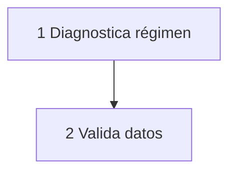
*FASE 1 · Entender: arriba. Leé de arriba hacia abajo.*
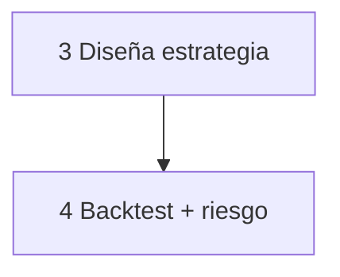
*FASE 2 · Probar.*
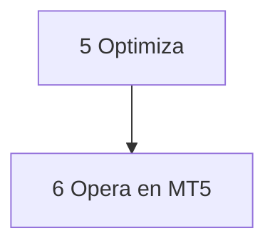
*FASE 3 · Operar.*

*Cómo leerlo: Empiezas en FASE 1 arriba, bajas hasta FASE 3. No es un ciclo.*

| Fase | Qué logras | Habilidad |
|------|------------|-----------|
| **FASE 1 · Entender** | Diagnosticar régimen y validar datos | Leer mercado sin autoengaño |
| **FASE 2 · Probar** | Convertir hipótesis en backtest con riesgo | Diseñar y validar estrategias |
| **FASE 3 · Operar** | Optimizar, ejecutar en MT5 y monitorear | Operar con control |

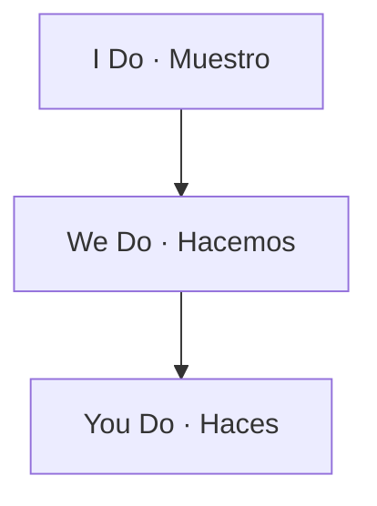
*Leé de izquierda a derecha: yo muestro, hacemos juntos, hacés solo. Los ejemplos de cada nivel están en la tabla de abajo.*

---

## PARTE 1: MARKET DIAGNOSTICS — LEER EL MERCADO ANTES DE OPERARLO

> **🔍 Pretest (Nivel: recordar — tapa lo de abajo y respondé antes de leer)**
>
> ¿Qué mirás primero: la estrategia o el régimen del mercado? ¿Por qué?
>
> *Respuesta esperada: el régimen. La misma regla gana en tendencia y pierde en rango.*
>
> *Si acertaste: camino rápido → salteá al contra-ejemplo de 1.2.*


### 1.1 Principio Central

Una estrategia no vive aislada. Vive dentro de un régimen de mercado. Una tendencia alcista premia sistemas momentum. Un rango lateral premia mean reversion. Un mercado de alta volatilidad castiga apalancamiento excesivo. Un mercado ilíquido castiga slippage.

El primer error del quant principiante es saltar directo a la idea. El primer hábito del quant profesional es diagnosticar.

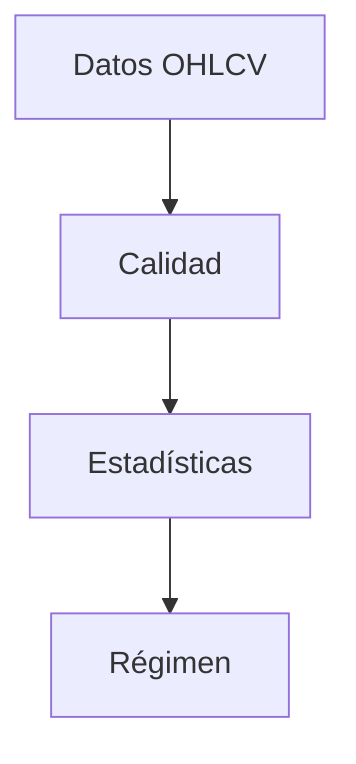
*Primero: del dato crudo al régimen. De izquierda a derecha.*
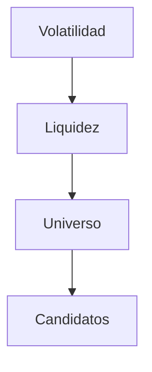
*Después: del riesgo a los candidatos.*

### 1.2 Qué significa diagnosticar un mercado

| Diagnóstico | Qué mide | Por qué importa |
|-------------|----------|-----------------|
| **Tendencia** | Dirección y persistencia del precio | Decide si usar momentum o reversión |
| **Volatilidad** | Amplitud de movimientos | Define sizing, stops y frecuencia |
| **Liquidez** | Spread, volumen y profundidad | Estima slippage y capacidad |
| **Regulación de régimen** | Cambios entre tendencia, rango y caos | Evita operar la misma regla en contextos distintos |

*Continúa la tabla (2/2) — partida en bloques de ≤4 para no saturar.*

| Diagnóstico | Qué mide | Por qué importa |
|-------------|----------|-----------------|
| **Costos de transacción** | Spread, comisión y slippage | Determina si la ventaja estadística es real |
| **Correlaciones** | Dependencia entre activos | Reduce riesgo concentrado |
| **Sesgos temporales** | Horarios, sesiones y eventos | Evita falsos edge por calendario |

### 1.3 Lógica sin código de Market Diagnostics

> **🔧 Sin código — Diagnóstico en 5 pasos (Nivel 1: victoria rápida)**
>
> 1. Limpia: quita velas con precio vacío o cero.
> 2. Mide retorno: compara cierre de hoy vs ayer en %.
> 3. Mide volatilidad: ¿los movimientos son grandes o calmados? (últimas 20 velas).
> 4. Mide tendencia: ¿media corta por encima de media larga? → sesgo alcista.
> 5. Clasifica régimen: tendencia suave / rango / tendencia volátil / rango volátil.
>
> *Ejemplo: EURUSD H1, media 20 > media 100 + volatilidad normal → `smooth_trend` → prioriza momentum, no reversión.*
>
> > **📌 Idea clave** — Primero diagnostica el clima, después eliges la ropa (estrategia).

---

> **🧠 Recall (Nivel: aplicar — sin mirar arriba)**
>
> Tu activo está en rango volátil con spread alto. ¿Qué familia elegís y qué hacés con el tamaño?
>
> *Respuesta esperada: ninguna agresiva — o mean-reversion con tamaño mínimo, o pausar. El spread alto mata el edge.*
> *Respuesta esperada: limpiar antes de seguir — los duplicados inflan la rentabilidad.*


## PARTE 2: DATA ENGINEERING — EL PIPELINE QUE NO MIENTE

> **🔍 Pretest (Nivel: recordar)**
>
> ¿De qué sirve una gran estrategia sobre datos sucios?
>
> *Respuesta esperada: de nada — el backtest miente. Dato roto = curva falsa.*
>
> *Si acertaste: camino rápido → andá directo al checklist 2.3.*


### 2.1 Regla de Oro

Si el dato está roto, el backtest está roto. Una señal brillante sobre datos sucios produce una curva de equity falsa. Antes de hablar de alpha, el pipeline debe responder:

1. ¿Hay velas duplicadas?
2. ¿Hay saltos horarios incorrectos?
3. ¿Hay gaps imposibles?
4. ¿El ajuste de splits o dividendos es consistente?
5. ¿El spread estimado es realista?
6. ¿La frecuencia coincide con la estrategia?

### 2.2 Estructura mínima del proyecto

```text
alpha-quant-workflow/
├── data/
│   ├── raw/
│   ├── processed/
│   └── cache/
├── notebooks/
│   └── diagnostics.ipynb
├── src/
│   ├── data_loader.py
│   ├── diagnostics.py
│   ├── strategy_factory.py
│   ├── backtester.py
│   ├── optimizer.py
│   └── mt5_adapter.py
├── tests/
│   ├── test_data_quality.py
│   └── test_backtester.py
├── configs/
│   ├── symbols.yaml
│   └── risk.yaml
└── requirements.txt
```

### 2.3 Data loader con validaciones

> **🔧 Sin código — Checklist de datos que no mienten (Nivel 1)**
>
> | Chequeo en 30 seg | Pregunta | Si falla → |
> |------------------|----------|------------|
> | Columnas | ¿Tengo fecha, open, high, low, close, volumen? | No avances |
> | Duplicados | ¿Hay dos velas con misma hora? | Limpia |
> | Lógica | ¿High es siempre el mayor? ¿Precios > 0? | Descarta fuente |
> | Orden | ¿Están ordenadas por fecha? | Reordena |
>
> *Recompensa: si pasa los 4, tu backtest ya es más honesto que el 80% de internet.*
>
> > **📌 Idea clave** — Dato roto = backtest mentiroso. 5 minutos aquí ahorran meses allá.

### 2.4 Tabla de validaciones críticas

| Riesgo de dato | Síntoma en backtest | Validación |
|----------------|---------------------|------------|
| Duplicados | Rentabilidad inflada | Índice sin duplicados |
| Velas fuera de orden | Señales desplazadas | Orden cronológico |
| Precios cero | Retornos infinitos | Precios positivos |
| High menor que low | Lógica imposible | High >= low |

*Continúa la tabla (2/2) — partida en bloques de ≤4 para no saturar.*

| Riesgo de dato | Síntoma en backtest | Validación |
|----------------|---------------------|------------|
| Gaps excesivos | Slippage subestimado | Umbral por percentil |
| Ajustes mal aplicados | Señales falsas | Revisión de splits/dividendos |
| Sesión incompleta | Frecuencia incorrecta | Calendario por activo |

> **🧠 Recall (Nivel: analizar)**
>
> ¿Qué parte de tu factory te salva en una ruptura violenta: la señal o el filtro? ¿Por qué?
>
> *Respuesta esperada: el filtro de régimen. La señal entra, el filtro frena.*


## PARTE 3: STRATEGY FACTORY — CONVERTIR HIPÓTESIS EN ESTRATEGIAS

> **🔍 Pretest (Nivel: comprender)**
>
> ¿Qué diferencia hay entre una idea suelta y una factory?
>
> *Respuesta esperada: la factory convierte cualquier hipótesis en señal + filtro + tamaño sin reescribir nada.*
>
> *Si acertaste: camino rápido → salteá a la tabla de familias 3.4.*


### 3.1 Qué es una Strategy Factory

Una Strategy Factory no es una carpeta con scripts sueltos. Es una línea de ensamblaje que transforma una hipótesis en una estrategia parametrizada:

```text
Hipótesis → Features → Señal → Filtro → Sizing → Backtest → Métricas
```

La factory debe permitir probar muchas variaciones sin reescribir el sistema. Por ejemplo, una idea de cruce de medias puede variar en:

- ventana corta
- ventana larga
- tipo de promedio
- filtro de volatilidad
- filtro de volumen
- stop loss
- take profit
- frecuencia de rebalanceo

### 3.2 Arquitectura de una estrategia

| Componente | Función | Ejemplo |
|------------|---------|---------|
| **Universe** | Define qué activos se analizan | EURUSD, GBPUSD, XAUUSD |
| **Features** | Transforma precios en variables | SMA, RSI, ATR, z-score |
| **Signal** | Decide long, short o flat | Cruce, ruptura, reversión |
| **Filter** | Evita regímenes malos | Volatilidad, spread, horario |

*Continúa la tabla (2/2) — partida en bloques de ≤4 para no saturar.*

| Componente | Función | Ejemplo |
|------------|---------|---------|
| **Sizing** | Define tamaño de posición | Riesgo fijo por trade |
| **Execution** | Define cómo se opera | Market, limit, trailing |
| **Risk** | Controla pérdidas y exposición | Max DD, daily loss, kill-switch |

### 3.3 Lógica sin código de Strategy Factory

> **🔧 Sin código — Tu fábrica en 1 frase por pieza (Nivel 2)**
>
> | Pieza | Tú decides | Ejemplo EURUSD H1 |
> |-------|------------|-------------------|
> | Features | ¿Qué mido? | Media 10 vs 50 + RSI + ATR |
> | Señal | ¿Cuándo entro? | Cruce alcista = long |
> | Filtro | ¿Cuándo NO entro? | Si volatilidad > 1.5x → flat |
> | Riesgo | ¿Cuánto pierdo máx? | Stop a 2x ATR, 1% cuenta |
>
> *Progresión: cambia solo 1 pieza por vez. Así sabes qué funcionó.*
>
> > **📌 Idea clave** — Hipótesis → Señal → Filtro → Tamaño. Sin reescribir nada.

### 3.4 Tabla de familias de estrategias

| Familia | Edge esperado | Mejor régimen | Riesgo principal |
|---------|---------------|---------------|------------------|
| **Trend following** | Persistencia direccional | Tendencias suaves | Whipsaws en rangos |
| **Mean reversion** | Exceso de desviación | Rangos estables | Rupturas violentas |
| **Breakout** | Expansión post-consolidación | Volatilidad creciente | Falsas rupturas |

*Continúa la tabla (2/2) — partida en bloques de ≤4 para no saturar.*

| Familia | Edge esperado | Mejor régimen | Riesgo principal |
|---------|---------------|---------------|------------------|
| **Carry** | Diferencial de tasas o rollover | Mercados calmados | Cambios de régimen |
| **Stat arb** | Relación histórica entre activos | Alta correlación | Desacople estructural |
| **Event driven** | Reacción a eventos | Ventanas específicas | Liquidez y slippage |

### 3.5 Prompt para AI Research Agent

```text
Actúa como investigador cuantitativo senior.
Objetivo: generar 10 hipótesis de estrategia para el activo {symbol} en timeframe {timeframe}.
Entradas:
- Régimen detectado: {regime}
- Volatilidad anualizada: {volatility}
- Spread promedio: {spread}
- Liquidez: {liquidity}
- Restricciones: sin martingala, sin sobreajuste, costos incluidos.
Entrega:
1. Nombre de la hipótesis
2. Lógica económica
3. Features necesarias
4. Filtros de régimen
5. Riesgos esperados
6. Métrica de invalidación
```

> **🧠 Recall (Nivel: evaluar)**
>
> Sharpe 2.4 con 18 trades en 5 años. ¿Automatizás? Justificá en 1 línea.
>
> *Respuesta esperada: no — muestra chica, probable suerte o sobreajuste.*


## PARTE 4: BACKTESTING ENGINE — PROBAR SIN AUTOENGAÑO

> **🔍 Pretest (Nivel: comprender)**
>
> ¿Por qué un backtest sin costos es optimista?
>
> *Respuesta esperada: porque cada trade paga comisión + slippage, y eso come el edge.*
>
> *Si acertaste: camino rápido → andá al walk-forward 4.4.*


### 4.1 El backtest perfecto no existe

Un backtest es una simulación condicionada por supuestos. Si los supuestos son ingenuos, la simulación será optimista. Si los supuestos son conservadores, la simulación será más útil.

Los errores más comunes son:

- usar el futuro en las señales
- ignorar comisiones
- ignorar slippage
- optimizar sobre toda la muestra
- no separar entrenamiento y validación
- medir solo rentabilidad
- no evaluar drawdown
- no comparar contra un benchmark
- no probar robustez por parámetros

### 4.2 Métricas mínimas

| Métrica | Fórmula conceptual | Interpretación |
|---------|--------------------|----------------|
| **CAGR** | Crecimiento anual compuesto | Rentabilidad anualizada |
| **Volatilidad** | Desviación de retornos | Variabilidad del resultado |
| **Sharpe** | Exceso de retorno / volatilidad | Retorno ajustado a riesgo |
| **Sortino** | Exceso de retorno / downside deviation | Penaliza solo pérdidas |

*Continúa la tabla (2/3) — partida en bloques de ≤4 para no saturar.*

| Métrica | Fórmula conceptual | Interpretación |
|---------|--------------------|----------------|
| **Max Drawdown** | Peor caída peak-to-trough | Peor dolor histórico |
| **Profit Factor** | Ganancias brutas / pérdidas brutas | Calidad del payoff |
| **Win Rate** | Trades ganadores / total trades | Frecuencia de aciertos |
| **Expectancy** | Promedio ponderado por resultado | Valor esperado por trade |

*Continúa la tabla (3/3) — partida en bloques de ≤4 para no saturar.*

| Métrica | Fórmula conceptual | Interpretación |
|---------|--------------------|----------------|
| **Exposure** | Tiempo en mercado | Capital realmente utilizado |
| **Turnover** | Rotación de posiciones | Costos potenciales |

### 4.3 Backtester vectorizado simple

> **🔧 Sin código — Backtest honesto en 4 pasos (Nivel 2)**
>
> 1. Desplaza la señal 1 vela (prohibido usar el futuro).
> 2. Resta costos SIEMPRE: comisión + slippage por cada cambio de posición.
> 3. Dibuja 2 curvas: estrategia vs comprar-y-mantener.
> 4. Mide: ¿Sharpe? ¿peor caída? ¿cuántos trades?
>
> *Contra-ejemplo motivador: sin costos la curva sube; con costos realistas cae 30%. Ese dolor te hace profesional.*
>
> > **📌 Idea clave** — Un backtest conservador que sobrevive es mejor que uno perfecto que miente.

### 4.4 Walk-forward validation

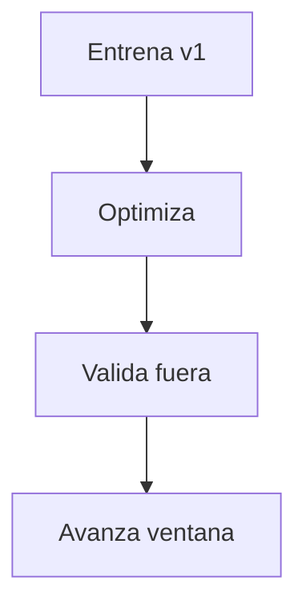
*Ronda 1: se entrena, se valida afuera, se avanza. De arriba hacia abajo.*
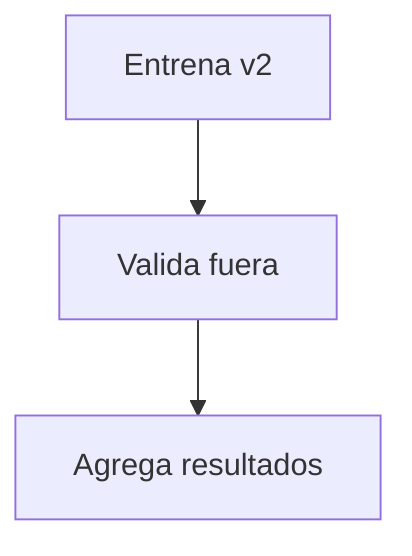
*Ronda 2 en adelante: se repite y se agregan resultados.*

| Bloque | Uso | Regla |
|--------|-----|-------|
| **In-sample** | Optimizar parámetros | Nunca reporta resultado final |
| **Out-of-sample** | Validar robustez | Debe sostener métricas |
| **Burn-in** | Calcular indicadores | No opera durante warm-up |

*Continúa la tabla (2/2) — partida en bloques de ≤4 para no saturar.*

| Bloque | Uso | Regla |
|--------|-----|-------|
| **Paper trading** | Validar ejecución | Compara señales vs fills |
| **Live monitoring** | Control real | Detecta degradación |

### 4.5 Señales de overfitting

| Señal | Qué sugiere | Acción |
|-------|-------------|--------|
| Sharpe altísimo en una muestra corta | Curva demasiado perfecta | Probar más años |
| Muchos parámetros para pocos trades | Modelo frágil | Reducir complejidad |
| Resultados excelentes solo en un activo | Edge específico o ruido | Probar universo |

*Continúa la tabla (2/2) — partida en bloques de ≤4 para no saturar.*

| Señal | Qué sugiere | Acción |
|-------|-------------|--------|
| Caída fuerte fuera de muestra | Sobreajuste | Reentrenar con walk-forward |
| Sensibilidad extrema a un parámetro | Inestabilidad | Usar zonas robustas |
| Win rate alto con payoff pobre | Costos pueden comer edge | Incluir slippage realista |

> **🧠 Recall (Nivel: aplicar)**
>
> Tu estrategia pierde 3 días seguidos y llega al freno diario. ¿Qué hacés?
>
> *Respuesta esperada: parar por hoy (kill-switch). Revisar mañana, no vengarse.*


## PARTE 5: RISK VALIDATION — GESTIÓN DE RIESGO ANTES DE OPTIMIZACIÓN

> **🔍 Pretest (Nivel: aplicar)**
>
> Con 10.000 de cuenta y 1% de riesgo por trade, ¿cuánto podés perder en un trade?
>
> *Respuesta esperada: 100. Si el stop queda a 50 pips, el tamaño es el que arriesga justo 100.*
>
> *Si acertaste: camino rápido → andá al stress test 5.4.*


### 5.1 El riesgo no es una sección final

La optimización sin riesgo produce estrategias peligrosas. Un parámetro puede mejorar Sharpe mientras concentra pérdidas en eventos raros. Por eso, cada estrategia debe pasar una batería de estrés antes de llegar a producción.

### 5.2 Reglas de riesgo por defecto

| Regla | Límite sugerido | Motivo |
|-------|-----------------|--------|
| Riesgo por trade | 0.25% a 1.00% del equity | Evita ruina temprana |
| Drawdown diario | 2% a 4% | Freno operativo |
| Drawdown de estrategia | 10% a 20% | Revisión obligatoria |
| Correlación máxima | 0.70 entre estrategias | Diversificación real |

*Continúa la tabla (2/2) — partida en bloques de ≤4 para no saturar.*

| Regla | Límite sugerido | Motivo |
|-------|-----------------|--------|
| Exposición máxima | Por activo, sector y mercado | Control de concentración |
| Slippage mínimo | Basado en percentil 95 | Conservadurismo |
| Kill-switch | Activación automática | Protección operacional |

### 5.3 Position sizing por volatilidad

> **🔧 Sin código — Tamaño por volatilidad (Nivel 3, 2 min)**
>
> 1. Define riesgo: 1% de 10.000 = 100 por trade.
> 2. Mide distancia al stop: entrada 1.1000 – stop 1.0950 = 50 pips.
> 3. Tamaño = 100 / 50 pips = el que arriesga justo 100 si toca stop.
> 4. Freno extra: si ATR está alto, reduce a la mitad.
>
> *Si el stop no está claro, no hay trade. Sin excepción.*
>
> > **📌 Idea clave** — Tú no controlas el mercado, controlas cuánto pierdes.

### 5.4 Stress test conceptual

| Escenario | Descripción | Qué debe resistir |
|-----------|-------------|-------------------|
| **Vol shock** | Volatilidad 2x o 3x | Stops, sizing, margen |
| **Liquidity shock** | Spread 3x promedio | Slippage y fills |
| **Gap adverse** | Salto contra posición | Stop gap y exposición |
| **Correlation shock** | Activos correlacionan a 1 | Diversificación |

*Continúa la tabla (2/2) — partida en bloques de ≤4 para no saturar.*

| Escenario | Descripción | Qué debe resistir |
|-----------|-------------|-------------------|
| **Latency shock** | Ejecución tardía | Estrategias intradía |
| **Data outage** | Feed interrumpido | Kill-switch |
| **Broker issue** | Rechazo de órdenes | Reconciliación |

---

> **🧠 Recall (Nivel: evaluar)**
>
> El heatmap muestra una isla chica con Sharpe altísimo. ¿La elegís?
>
> *Respuesta esperada: no — isla = sobreajuste. Buscar meseta amplia.*


## PARTE 6: GENETIC OPTIMIZATION

> **🔍 Pretest (Nivel: comprender)**
>
> ¿Para qué sirve un optimizador genético: para la curva perfecta o para zonas robustas?
>
> *Respuesta esperada: zonas robustas (mesetas). La isla perfecta es sobreajuste.*
>
> *Si acertaste: camino rápido → andá a errores comunes 6.4.*


La optimización genética permite explorar espacios grandes de parámetros sin probar cada combinación posible. Se usa para encontrar regiones estables, no para fabricar una curva perfecta.

### 6.1 Flujo de trabajo

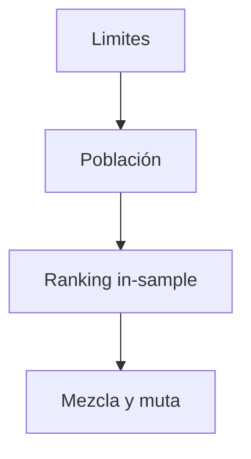
*Bucle de búsqueda: se repite 10–25 rondas. De arriba hacia abajo.*
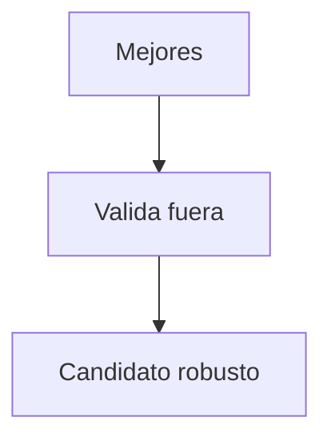
*Al final: solo lo mejor se valida afuera, una vez.*

### 6.2 Fitness function

| Componente | Peso | Motivo |
|------------|------|--------|
| Sharpe in-sample para rankear (prohibido decidir con OOS) | 30% | Rentabilidad ajustada a riesgo en entrenamiento |
| Max drawdown | 25% | Penaliza caídas severas |
| Profit factor | 15% | Calidad del payoff |

*Continúa la tabla (2/2) — partida en bloques de ≤4 para no saturar.*

| Componente | Peso | Motivo |
|------------|------|--------|
| Trade count | 10% | Evita muestras vacías |
| Stability | 10% | Penaliza picos aislados |
| Cost sensitivity | 10% | Mide fragilidad ante costos |

### 6.3 Lógica sin código (evolución paso a paso)

> **🔧 Sin código — Optimización genética sin humo (Nivel 4)**
>
> 1. Define límites sanos: ej. media corta 5–30, larga 30–200.
> 2. Crea 40 combinaciones al azar (población).
> 3. Quédate con las 5 mejores por Sharpe **in-sample** + menor caída. El out-of-sample y el walk-forward se usan SOLO para validar al final, nunca para elegir candidatos (si elegís con OOS, lo contaminás).
> 4. Mezcla y muta un poco (15%) → repite 10–25 rondas.
> 5. Elige MESETAS estables en el heatmap, nunca islas perfectas.
>
> *Dificultad deseable: si un parámetro cambia 10% y todo se rompe, descártalo.*
>
> > **📌 Idea clave** — Buscamos zonas robustas, no la curva perfecta.

### 6.4 Errores comunes

| Error | Consecuencia | Prevención |
|-------|--------------|------------|
| Fitness solo en CAGR | Estrategias extremas | Usar Sharpe y drawdown |
| Población pequeña | Búsqueda pobre | Aumentar población |
| Generaciones excesivas | Sobreajuste | Early stopping |
| Sin out-of-sample | Falsa confianza | Walk-forward |

*Continúa la tabla (2/2) — partida en bloques de ≤4 para no saturar.*

| Error | Consecuencia | Prevención |
|-------|--------------|------------|
| Sin costos | Edge ilusorio | Comisión y slippage |
| Sin límites lógicos | Parámetros absurdos | Bounds estrictos |
| Sin robustez | Picos aislados | Heatmaps y perturbaciones |

### 6.5 Heatmap de parámetros

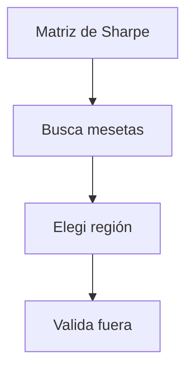
*De arriba hacia abajo. Meseta amplia = robusto; isla perfecta = sobreajuste.*

| Patrón en heatmap | Lectura |
|-------------------|---------|
| Isla pequeña con Sharpe alto | Posible sobreajuste |
| Meseta amplia con Sharpe bueno | Región robusta |
| Resultados buenos solo con ventanas largas | Lentitud y baja frecuencia |

*Continúa la tabla (2/2) — partida en bloques de ≤4 para no saturar.*

| Patrón en heatmap | Lectura |
|-------------------|---------|
| Resultados sensibles a un parámetro | Fragilidad |
| Mejores resultados con costos altos | Edge fuerte |
| Mejores resultados solo antes de 2020 | Régimen específico |

> **🧠 Recall (Nivel: aplicar)**
>
> Equipo sin DevOps, estrategia diaria. ¿Qué modo elegís?
>
> *Respuesta esperada: semi-automático con confirmación humana.*


## PARTE 7: AUTOMATION COMPARISON

> **🔍 Pretest (Nivel: recordar)**
>
> ¿Qué pesa más al elegir automatización: la velocidad o el control de riesgo?
>
> *Respuesta esperada: el riesgo (25%). La velocidad solo importa si tu edge vive de milisegundos.*
>
> *Si acertaste: camino rápido → andá al checklist de producción 7.4.*


La automatización define cómo una estrategia pasa de señal a ejecución. La decisión no es solo técnica: también afecta latencia, costos, control de riesgo, portabilidad y complejidad operacional.

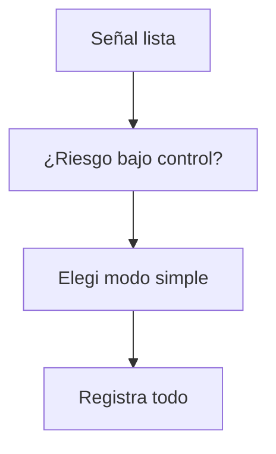
*De arriba hacia abajo. El detalle de cada modo está en la tabla comparativa de abajo, no en el dibujo.*

### 7.1 Comparación de modelos

| Modelo | Ventaja | Desventaja | Mejor uso |
|--------|---------|------------|-----------|
| **Manual asistido** | Control humano total | Lentitud y sesgo emocional | Investigación y paper trading |
| **Semi-automático** | Reduce errores operativos | Requiere confirmación | Estrategias diarias |
| **Automático local** | Baja latencia relativa | Depende del equipo local | Intradía simple |

*Continúa la tabla (2/2) — partida en bloques de ≤4 para no saturar.*

| Modelo | Ventaja | Desventaja | Mejor uso |
|--------|---------|------------|-----------|
| **Automático cloud** | Alta disponibilidad | Complejidad DevOps | Sistemas 24/7 |
| **Broker API** | Ejecución directa | Riesgo de integración | Producción robusta |
| **Híbrido** | Balance control/velocidad | Más piezas que monitorear | Equipos pequeños |

### 7.2 Criterios de decisión

| Criterio | Pregunta clave | Peso sugerido |
|----------|----------------|---------------|
| **Latencia** | ¿La estrategia depende de milisegundos? | 20% |
| **Disponibilidad** | ¿Debe operar 24/7 sin caída? | 20% |
| **Control de riesgo** | ¿Puede cortar exposición automáticamente? | 25% |

*Continúa la tabla (2/2) — partida en bloques de ≤4 para no saturar.*

| Criterio | Pregunta clave | Peso sugerido |
|----------|----------------|---------------|
| **Costo operacional** | ¿El beneficio justifica infraestructura? | 15% |
| **Complejidad** | ¿El equipo puede mantenerlo? | 10% |
| **Portabilidad** | ¿Puede migrar de broker o activo? | 10% |

### 7.3 Matriz de automatización

> **🔧 Sin código — Elige tu automatización en 30 seg (Nivel 3)**
>
> 1. ¿Necesitas milisegundos? Sí → API broker + cloud.
> 2. ¿Debe correr 24/7 solo? Sí → cloud + kill-switch.
> 3. ¿Equipo sin DevOps? → semi-automático con confirmación humana.
> 4. ¿Empezando? → manual asistido + paper trading.
>
> *Regla: empieza por lo más simple que te dé control de riesgo. Escala solo si el edge lo paga.*
>
> > **📌 Idea clave** — Automatiza el control, no solo la entrada.

### 7.4 Checklist de producción

| Check | Requisito |
|-------|-----------|
| Señales reproducibles | Mismo input produce misma señal |
| Logs estructurados | Cada orden tiene request_id |
| Reconciliación | Posiciones locales = broker |
| Kill-switch | Apaga por drawdown, latencia o datos |

*Continúa la tabla (2/2) — partida en bloques de ≤4 para no saturar.*

| Check | Requisito |
|-------|-----------|
| Alertas | Fallos de datos, órdenes rechazadas, exposición |
| Backups | Configuración y estado recuperables |
| Paper trading | Validación antes de capital real |
| Runbook | Procedimiento ante incidentes |

---

> **🧠 Recall (Nivel: recordar)**
>
> Orden rechazada por filling inválido. Primer paso del runbook?
>
> *Respuesta esperada: leer retcode y comment antes de tocar nada.*


## PARTE 8: MT5 INTEGRATION — EJECUCIÓN CON METATRADER 5

> **🔍 Pretest (Nivel: recordar)**
>
> Antes de operar real: ¿órdenes reales o demo + señal reproducible 2 veces?
>
> *Respuesta esperada: demo + reproducibilidad. Sin eso no hay producción.*
>
> *Si acertaste: camino rápido → andá a riesgos de MT5 8.6.*


MetaTrader 5 funciona como terminal de ejecución, fuente de datos y capa de órdenes. La integración típica conecta tu generador de señales con el terminal para consultar precios, enviar órdenes y leer posiciones (el detalle técnico va en un anexo operativo, no como código en la guía).

### 8.1 Arquitectura de integración

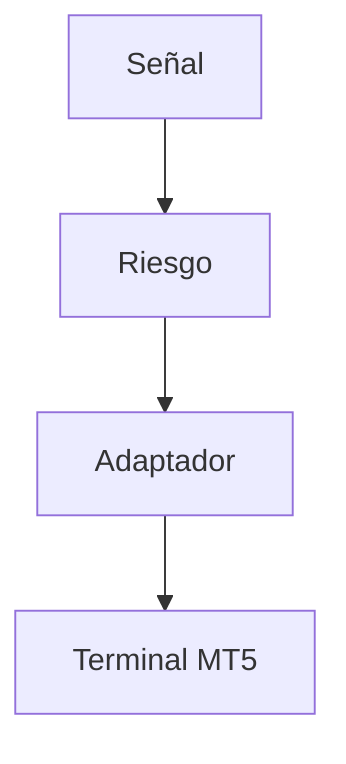
*Ida: de tu señal al broker. De arriba hacia abajo.*
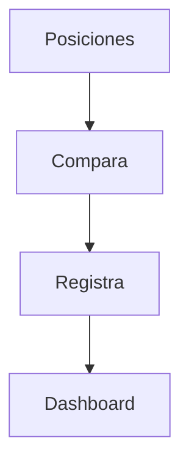
*Vuelta: lo real vs lo esperado se compara y se registra.*

### 8.2 Requisitos prácticos

| Requisito | Motivo |
|-----------|--------|
| Terminal MT5 instalado | La herramienta externa se conecta al terminal |
| Cuenta habilitada para trading automático | Permite órdenes programáticas |
| Símbolos visibles en Market Watch | Evita errores de símbolo no encontrado |
| Permisos de trading API | Necesarios para enviar órdenes |

*Continúa la tabla (2/2) — partida en bloques de ≤4 para no saturar.*

| Requisito | Motivo |
|-----------|--------|
| VPS estable | Reduce caídas y latencia |
| Logs y reconciliación | Detecta discrepancias |
| Kill-switch externo | Apaga la estrategia si el terminal falla |

### 8.3 Adapter básico

> **🔧 Sin código — Conexión MT5 sin programar (Nivel 3)**
>
> | Paso | Dónde clicas | ✅ Listo cuando |
> |------|--------------|----------------|
> | 1 Instalar | Terminal MT5 + cuenta demo | Ves precios en vivo |
> | 2 Activar | Permitir trading algorítmico | Botón verde |
> | 3 Verificar | Símbolo visible en Market Watch | EURUSD aparece |
> | 4 Probar | Leer 500 velas + generar 1 señal | Señal reproducible 2 veces |
>
> *Prohibido enviar órdenes reales hasta pasar paper trading 2–4 semanas.*
>
> > **📌 Idea clave** — MT5 es tu ejecutor, no tu cerebro. El cerebro es tu fábrica validada.

### 8.4 Reconciliación de posiciones

| Fuente | Qué compara | Frecuencia |
|--------|-------------|------------|
| Estrategia local | Señal objetivo | Cada tick o vela |
| MT5 positions | Posición real | Cada ciclo |
| Historial de órdenes | Fills ejecutados | Cada ciclo |

*Continúa la tabla (2/2) — partida en bloques de ≤4 para no saturar.*

| Fuente | Qué compara | Frecuencia |
|--------|-------------|------------|
| Equity | Capital disponible | Cada minuto |
| Logs | Discrepancias | En tiempo real |

### 8.5 Loop operacional seguro

> **🔧 Sin código — Loop operativo seguro (Nivel 4)**
>
> 1. Cada 60 seg: lee velas → genera señal → pasa por filtro de riesgo.
> 2. Si señal = 0 → cierra o no abras.
> 3. Si señal ≠ 0 → calcula tamaño + stop/take → envía con límite de desviación.
> 4. Registra todo con hora. Si algo falla → log + espera, nunca reintentes a ciegas.
> 5. Kill-switch: si caída diaria > 3% o sin datos > 5 min → apaga.
>
> > **📌 Idea clave** — Un loop aburrido y predecible te mantiene vivo.

### 8.6 Riesgos específicos de MT5

| Riesgo | Síntoma | Mitigación |
|--------|---------|------------|
| Terminal desconectado | copy_rates devuelve None | Healthcheck y reconexión |
| Símbolo no visible | order_send falla | Agregar a Market Watch |
| Filling rechazado | Retcode no DONE | Ajustar filling mode |
| Slippage alto | Precio ejecutado distinto | Deviation y límites |

*Continúa la tabla (2/2) — partida en bloques de ≤4 para no saturar.*

| Riesgo | Síntoma | Mitigación |
|--------|---------|------------|
| VPS caída | Sin señales ni órdenes | Monitoreo externo |
| Cuenta en hedge | Múltiples posiciones | Política de neteo o tickets |
| Broker cambia contrato | Volumen inválido | Leer volume_min y volume_step |

---

> **🧠 Recall (Nivel: crear)**
>
> Diseñá en 1 línea tu alerta de degradación: métrica + umbral + acción.
>
> *Respuesta esperada (ejemplo): Sharpe rolling -50% → reduzco tamaño a la mitad.*


## PARTE 9: FUTURE ROADMAP — DE PROTOTIPO A PRODUCCIÓN

> **🔍 Pretest (Nivel: comprender)**
>
> ¿Qué hacés cuando el Sharpe rolling cae 50%?
>
> *Respuesta esperada: reducir tamaño y revisar, no escalar. Es señal de degradación.*
>
> *Si acertaste: camino rápido → andá a señales de degradación 9.2.*


La ruta hacia producción no es lineal. Primero se valida la idea, luego se industrializa el pipeline, después se automatiza la ejecución y finalmente se monitorea la degradación.

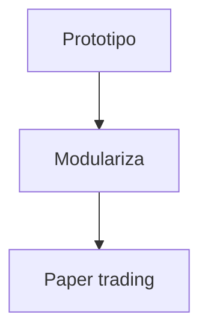
*Fase laboratorio: nada de capital real. De arriba hacia abajo.*
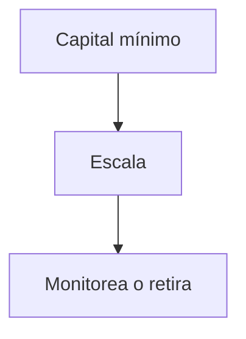
*Fase real: se escala solo si el monitoreo aprueba.*

### 9.1 Roadmap por etapas

| Etapa | Objetivo | Duración típica | Entregable |
|-------|----------|-----------------|------------|
| **Exploración** | Encontrar hipótesis | 1-2 semanas | Research brief |
| **Prototipo** | Validar señal básica | 1 semana | Notebook reproducible |
| **Industrialización** | Convertir en código modular | 1-2 semanas | Package interno |
| **Backtest robusto** | Medir métricas reales | 1-2 semanas | Reporte walk-forward |

*Continúa la tabla (2/2) — partida en bloques de ≤4 para no saturar.*

| Etapa | Objetivo | Duración típica | Entregable |
|-------|----------|-----------------|------------|
| **Paper trading** | Verificar ejecución simulada | 2-4 semanas | Logs y fills simulados |
| **Live small** | Operar capital mínimo | 4-8 semanas | Monitoreo real |
| **Scale up** | Aumentar tamaño gradualmente | Variable | Control de riesgo |
| **Retire** | Cerrar estrategia degradada | Cualquier momento | Post-mortem |

### 9.2 Señales de degradación

| Señal | Interpretación | Acción |
|-------|----------------|--------|
| Sharpe rolling cae 50% | Edge disminuyendo | Reducir tamaño |
| Drawdown supera umbral | Riesgo excesivo | Stop temporal |
| Slippage aumenta | Liquidez deteriorada | Revisar horarios |
| Latencia aumenta | Problema técnico | Migrar infra |

*Continúa la tabla (2/2) — partida en bloques de ≤4 para no saturar.*

| Señal | Interpretación | Acción |
|-------|----------------|--------|
| Señales sin fills | Ejecución fallida | Revisar broker |
| Correlación sube | Diversificación rota | Rebalancear |
| Regimen cambia | Estrategia fuera de contexto | Pausar o ajustar |

### 9.3 Evolución del sistema

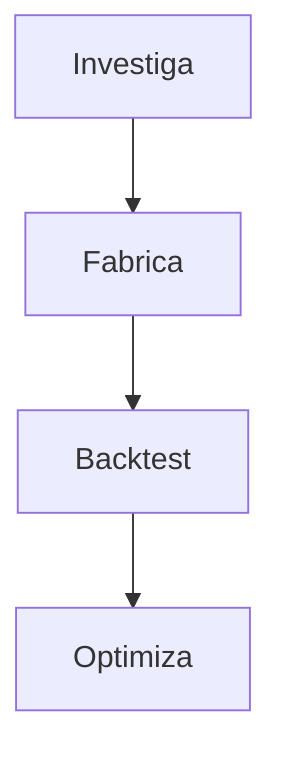
*De arriba hacia abajo. Si riesgo rechaza, se vuelve a investigar (nueva ronda, no ciclo).*
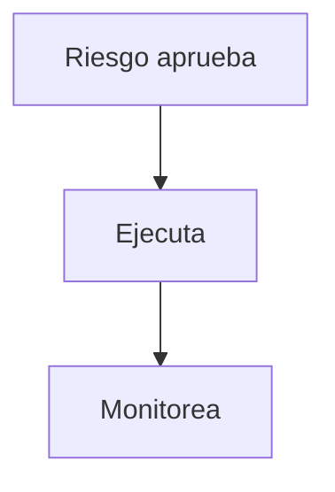
*Solo lo aprobado llega a ejecución.*

### 9.4 Roles de AI agents

| Agente | Responsabilidad | Output |
|--------|-----------------|--------|
| **Research Agent** | Generar hipótesis y revisar literatura | Brief de estrategia |
| **Data Agent** | Validar datos y detectar anomalías | Reporte de calidad |
| **Code Agent** | Implementar features y tests | Pull request limpio |

*Continúa la tabla (2/2) — partida en bloques de ≤4 para no saturar.*

| Agente | Responsabilidad | Output |
|--------|-----------------|--------|
| **Backtest Agent** | Correr backtests y métricas | Reporte comparativo |
| **Risk Agent** | Revisar drawdown y exposición | Semáforo de riesgo |
| **Ops Agent** | Monitorear ejecución y logs | Alertas y runbook |

### 9.5 Prompt para Risk Agent

```text
Actúa como responsable de riesgo cuantitativo.
Evalúa esta estrategia:
- Símbolo: {symbol}
- Timeframe: {timeframe}
- CAGR: {cagr}
- Sharpe: {sharpe}
- Max drawdown: {max_dd}
- Profit factor: {profit_factor}
- Trade count: {trade_count}
- Regímenes probados: {regimes}
Entrega:
1. Riesgos principales
2. Condiciones de pausa
3. Límites de tamaño
4. Pruebas faltantes
5. Decisión: aprobar, aprobar con reducción, rechazar
```

> **🧠 Recall (Nivel: crear)**
>
> Diseñá en 1 línea tu alerta de degradación: métrica + umbral + acción.
>
> *Respuesta esperada (ejemplo): Sharpe rolling -50% → reduzco tamaño a la mitad.*

> **📌 Idea clave** — Lo que no se monitorea se degrada en silencio; toda estrategia necesita fecha de revisión.


---

## PARTE 10: I DO / WE DO / YOU DO — EJERCICIOS PROGRESIVOS

### 10.1 I Do — Diagnóstico de mercado guiado

**Objetivo:** diagnosticar un activo antes de proponer estrategia.

| Paso | Acción | Resultado esperado |
|------|--------|--------------------|
| 1 | Cargar OHLCV | DataFrame limpio |
| 2 | Calcular retornos | Serie log-return |
| 3 | Calcular volatilidad | Volatilidad anualizada |

*Continúa la tabla (2/2) — partida en bloques de ≤4 para no saturar.*

| Paso | Acción | Resultado esperado |
|------|--------|--------------------|
| 4 | Calcular tendencia | SMA corta vs SMA larga |
| 5 | Clasificar régimen | smooth_trend, range o volatile |
| 6 | Recomendar familia | Trend, mean reversion o breakout |

> **✅ Auto-chequeo (30 seg, recall activo — tapa lo de arriba y responde)**
>
> ¿Qué régimen tienes y qué familia toca? Si no lo dices en 1 frase, repasa el diagnóstico antes de seguir.
>
> *Respuesta esperada: "trend_score alto + vol normal = smooth_trend → momentum; score ~0 + vol moderada = rango → mean-reversion; vol extrema = reducir o pausar."*

**Interpretación guiada:**

- Si `trend_score` es positivo y estable, prioriza momentum.
- Si `trend_score` está cerca de cero y la volatilidad es moderada, prioriza mean reversion.
- Si la volatilidad está muy alta, reduce tamaño o evita operar.
- Si el spread estimado supera el edge esperado, descarta la estrategia.

### 10.2 We Do — Diseñar una estrategia en equipo

**Escenario:** tienes EURUSD en timeframe H1. El diagnóstico muestra rango lateral con volatilidad moderada.

**Tarea colaborativa:** diseña una estrategia de reversión a la media.

| Decisión | Opción recomendada | Justificación |
|----------|--------------------|---------------|
| Feature principal | z-score de precio | Mide desviación de la media |
| Filtro | ATR bajo o medio | Evita rupturas violentas |
| Entrada long | z-score menor que -2 | Precio estirado a la baja |

*Continúa la tabla (2/2) — partida en bloques de ≤4 para no saturar.*

| Decisión | Opción recomendada | Justificación |
|----------|--------------------|---------------|
| Salida | z-score vuelve a 0 | Reversión completada |
| Stop | ATR múltiplo | Riesgo basado en volatilidad |
| Validación | Walk-forward | Evita sobreajuste |

> **🔧 Sin código — Reversión a la media en equipo (We Do, Nivel 2)**
>
> | Decisión | Regla simple | Por qué |
> |----------|--------------|---------|
> | Entrada long | Precio 2 desviaciones bajo su media 100 | Estirado |
> | Salida | Precio vuelve a la media | Reversión completa |
> | Filtro | Solo si ATR normal | Evita cuchillos cayendo |
> | Stop | 2x ATR | Respira sin arruinarte |
>
> *Pregunta de elaboración: ¿cuándo falla esto? → En ruptura violenta. Por eso el filtro es obligatorio.*

### 10.3 You Do — Construir tu propia Strategy Factory

**Tarea:** crea una factory para tres familias de estrategias:

1. Trend following
2. Mean reversion
3. Breakout

Debes incluir:

- features comunes
- señales específicas
- filtros de régimen
- sizing por ATR
- métricas de salida
- criterios de rechazo

| Criterio | Peso |
|----------|------|
| Modularidad | 25% |
| Validación de datos | 20% |
| Gestión de riesgo | 25% |

*Continúa la tabla (2/2) — partida en bloques de ≤4 para no saturar.*

| Criterio | Peso |
|----------|------|
| Backtest reproducible | 20% |
| Claridad del informe | 10% |

### 10.4 I Do — Backtest con costos conservadores

**Objetivo:** entender cómo los costos destruyen edge falso.

| Escenario | Comisión | Slippage | Resultado esperado |
|-----------|----------|----------|--------------------|
| Ingenuo | 0 | 0 | Curva optimista |
| Realista | 0.0005 | 0.0002 | Curva ajustada |
| Conservador | 0.0010 | 0.0005 | Curva estresada |

> **✅ Práctica deliberada (You Do, 5 min)**
>
> Compara 3 escenarios con la misma señal: ingenuo (sin costos) / realista / estresado (costos 2x).
> Criterio de auto-corrección: si el edge desaparece en realista, no es edge. Descarta y celebra — acabas de ahorrar dinero real.

### 10.5 We Do — Interpretar métricas

**Caso:** una estrategia tiene Sharpe 2.4, pero solo 18 trades en 5 años.

| Pregunta | Respuesta esperada |
|----------|--------------------|
| ¿Es suficiente muestra? | No |
| ¿Qué riesgo existe? | Sobreajuste o suerte |
| ¿Qué hacer? | Probar más activos y más tiempo |

*Continúa la tabla (2/2) — partida en bloques de ≤4 para no saturar.*

| Pregunta | Respuesta esperada |
|----------|--------------------|
| ¿Qué métrica falta? | Estabilidad por año y por régimen |
| ¿Se puede automatizar? | No todavía |

### 10.6 You Do — Optimización genética responsable

**Tarea:** define bounds y fitness para una estrategia de cruce de medias.

| Parámetro | Bound mínimo | Bound máximo |
|-----------|--------------|--------------|
| short_window | 5 | 30 |
| long_window | 30 | 200 |
| atr_window | 10 | 30 |

*Continúa la tabla (2/2) — partida en bloques de ≤4 para no saturar.*

| Parámetro | Bound mínimo | Bound máximo |
|-----------|--------------|--------------|
| stop_atr_multiple | 1.0 | 4.0 |
| take_profit_atr_multiple | 1.5 | 5.0 |

**Regla:** no aceptar un candidato si no supera al benchmark en out-of-sample y no mantiene drawdown menor al umbral.

### 10.7 I Do — Integración MT5 en paper trading

**Objetivo:** conectar tu señal con MT5 en demo sin enviar órdenes reales.

| Paso | Acción | Validación |
|------|--------|------------|
| 1 | Inicializar terminal | initialize true |
| 2 | Login | authorized true |
| 3 | Leer símbolo | symbol_info no None |
| 4 | Copiar velas | DataFrame con filas |

*Continúa la tabla (2/2) — partida en bloques de ≤4 para no saturar.*

| Paso | Acción | Validación |
|------|--------|------------|
| 5 | Generar señal | Señal reproducible |
| 6 | Simular orden | order_send no llamado |
| 7 | Registrar decisión | Log con timestamp |

> **✅ Victoria rápida MT5 en demo (I Do, 5 min)**
>
> 1. Conecta demo → 2. Lee 1 símbolo → 3. Genera 1 señal → 4. Registra decisión SIN enviar orden.
> Listo cuando: repites la misma señal 2 veces con mismos datos. Eso es reproducibilidad, Nivel 1 de producción.

### 10.8 We Do — Revisar runbook de incidente

**Escenario:** MT5 devuelve rechazo de orden por filling mode inválido.

| Paso | Acción |
|------|--------|
| 1 | Leer retcode y comment |
| 2 | Verificar modo de ejecución permitido |
| 3 | Ajustar type_filling |

*Continúa la tabla (2/2) — partida en bloques de ≤4 para no saturar.*

| Paso | Acción |
|------|--------|
| 4 | Reprocesar orden |
| 5 | Registrar incidente |
| 6 | Actualizar tests |

### 10.9 You Do — Diseño de monitoreo

**Tarea:** diseña un dashboard mínimo para producción.

| Widget | Métrica | Alerta |
|--------|---------|--------|
| Equity | Capital actual | Caída diaria > umbral |
| Positions | Exposición por símbolo | Exposición > límite |
| Signals | Señales generadas | Señal sin orden |
| Orders | Fills rechazados | Rechazo > 0 |

*Continúa la tabla (2/2) — partida en bloques de ≤4 para no saturar.*

| Widget | Métrica | Alerta |
|--------|---------|--------|
| Latency | Tiempo de ciclo | Ciclo > threshold |
| Data | Última vela recibida | Sin datos > threshold |
| Risk | Drawdown rolling | Drawdown > umbral |

### 10.10 Cierre práctico

| Nivel | Debes poder hacer |
|-------|-------------------|
| **I Do** | Seguir un ejemplo completo de diagnóstico, backtest y ejecución simulada |
| **We Do** | Ajustar parámetros, interpretar métricas y decidir si avanzar |
| **You Do** | Construir una factory propia con validación, optimización y monitoreo |

---

## CHECKLIST FINAL DE LA FÁBRICA DE ESTRATEGIAS

| Bloque | Check |
|--------|-------|
| Datos | Fuente documentada, validaciones y calendario correcto |
| Diagnóstico | Régimen, volatilidad, liquidez y costos medidos |
| Estrategia | Hipótesis clara, features reproducibles y filtros explícitos |
| Backtest | Costos incluidos, sin look-ahead y con walk-forward |

*Continúa la tabla (2/3) — partida en bloques de ≤4 para no saturar.*

| Bloque | Check |
|--------|-------|
| Riesgo | Sizing, drawdown, exposición y kill-switch definidos |
| Optimización | Bounds lógicos, fitness conservador y validación externa |
| Automatización | Arquitectura elegida según latencia, disponibilidad y equipo |
| MT5 | Conexión, reconciliación, logs y control de rechazos |

*Continúa la tabla (3/3) — partida en bloques de ≤4 para no saturar.*

| Bloque | Check |
|--------|-------|
| Producción | Paper trading, capital reducido, monitoreo y runbook |
| Retiro | Criterios claros para pausar, ajustar o cerrar estrategia |

---

## Preguntas de Verificación 📝

Responde cada pregunta basándote en los conceptos de esta master class. Escribe tus respuestas o compártelas para profundizar tu aprendizaje.

### Preguntas sobre Market Diagnostics

1. **Aplica**: Si tu activo muestra un régimen `volatile_range` con volatilidad 40% anualizada, ¿qué tipo de estrategia recomendarías y por qué?

2. **Analiza**: ¿Cómo afecta el slippage a un backtest cuando la frecuencia de trading es intradía? Propones un modelo de estimación?

### Preguntas sobre Strategy Factory

3. **Diseña**: Crea una estrategia de breakouts para un activo con alta liquidez. Define las features, filtros y niveles de entrada/salida.

4. **Reflexiona**: ¿Qué riesgos tienes más en cuenta cuando diseñas una estrategia: el overfitting o el underfitting? Por qué?

### Preguntas sobre Backtesting

5. **Calcula**: Una estrategia genera 100 trades con win rate 45%, ganancia media 150 y pérdida media 100. Calculá el profit factor. Si el win rate baja a 40% (mismo payoff), ¿cuál es el nuevo profit factor?

> *Respuesta esperada: PF = (0.45×150)/(0.55×100) = 67.5/55 ≈ 1.23. Con 40%: (0.40×150)/(0.60×100) = 60/60 = 1.0. Moraleja: sin el ratio ganancia/pérdida no se puede responder; win rate solo no alcanza.*

6. **Evalúa**: ¿Por qué es crucial separar datos de entrenamiento y validación en un backtest? Qué sucede si no lo haces?

### Preguntas Integradoras

7. **Conecta**: Explica cómo el Risk Validation se relaciona con la Genetic Optimization. ¿Qué pasaría si optimizas sin considerar riesgo primero?

8. **Propón un sistema**: Diseña un sistema de monitoreo para detectar degradación de estrategia en producción. ¿Qué alertas configurarías?

9. **Síntesis**: Toma una estrategia que hayas diseñado anteriormente y aplica el framework completo: desde diagnostics hasta monitoreo. Identifica los puntos críticos.

10. **Reflexión final**: De los 10 componentes del workflow, ¿cuál consideras el más crítico para evitar pérdidas en producción? Justifica tu respuesta.

## CALENDARIO DE ESPACIADO (repaso real, no relectura)

| Cuándo | Qué evocás (sin mirar) | De dónde |
|--------|------------------------|----------|
| Día 1 | Régimen → familia + 4 chequeos de datos | PARTES 1–2 |
| Día 3 | Señal + filtro + tamaño de 1 estrategia | PARTE 3 |
| Día 7 | Costos + walk-forward + sizing 1% | PARTES 4–5 |

| Semana 2 | Meseta vs isla + modo de ejecución | PARTES 6–7 |
*Regla: si fallás un recall, volvés a la PARTE ese día. Releer sin evocación no cuenta como repaso.*

---

## GLOSARIO — CONCEPTOS PRINCIPALES

| Término | Definición en 1 línea |
|---------|-----------------------|
| **Alpha** | Ventaja estadística esperada después de costos |
| **OHLCV** | Velas open/high/low/close + volumen, materia prima del análisis |
| **Régimen** | Estado del mercado: tendencia, rango, volatilidad o caos |
| **Sharpe** | Retorno ajustado a riesgo: exceso / volatilidad |
| **CAGR** | Crecimiento anual compuesto de la estrategia |
| **Backtest** | Simulación histórica de una estrategia con costos |
| **Look-ahead bias** | Uso accidental de información futura que infla resultados |
| **Overfitting** | Ajuste al ruido histórico en lugar del edge real |
| **Walk-forward** | Validación que avanza ventanas de entrenamiento y prueba |
| **Strategy Factory** | Línea que convierte hipótesis en señal + filtro + sizing |
| **ATR** | Rango verdadero promedio, mide volatilidad para stops |
| **Position sizing** | Tamaño de posición según riesgo por trade y volatilidad |
| **Profit Factor** | Ganancias brutas / pérdidas brutas, calidad del payoff |
| **Drawdown** | Caída desde el máximo anterior del equity |
| **Slippage** | Diferencia entre precio esperado y ejecutado |
| **MT5 Adapter** | Puente señal ↔ terminal MetaTrader 5 para órdenes |
| **Paper trading** | Operativa simulada antes de capital real |
| **Kill-switch** | Corte automático por drawdown, datos o fallo operativo |

---


---

## ANEXO B: CÓMO USAR CLAUDE COMO MAPA PARA CREAR GUÍAS Y BLOGS

### Estructura Visual del Framework

Estilo limpio que simula anotación "handwritten" sobre fondo claro, con tipografías sans-serif redondeadas y amigables.

**Código de Colores Estratégico:**

| Color | Uso |
|-------|-----|
| **Negro** | Texto base, títulos secundarios, cuerpo de prompts |
| **Naranja/Rojo** | Captar atención — palabra clave principal, números de lista, asteriscos, conceptos críticos |
| **Verde** (subrayados) | Resaltar métricas clave (20%, 80%, 10 dos horas, 15 minutos, 5 minutos) |

### Los 6 Consejos de Aprendizaje Acelerado

Cada punto sigue la misma lógica: **título en mayúsculas** (acción clara) + **prompt** con variable `[tema]`.

#### 1. Aprende cualquier cosa en 20 horas
**Concepto:** Regla de Pareto (80/20) combinada con las 20 horas de práctica inteligente de Josh Kaufman.

> "Necesito aprender [tema] rápido. Crea un plan de 20 horas enfocado en el 20% que genera el 80% de los resultados. Divide en sesiones de 10 dos horas con los mejores recursos y una mini revisión de 15 minutos al final de cada una."

#### 2. Crea una miniguía de una página
**Concepto:** Síntesis extrema y formato escaneable para repasos rápidos de 5 minutos.

> "Resume los conceptos clave de [tema] en una sola página. Usa viñetas, diagramas y ejemplos para que pueda revisarlo en 5 minutos."

#### 3. Hazme un quiz antes de tomar un descanso
**Concepto:** Evocación activa (active recall) con retroalimentación inmediata antes de consolidar el aprendizaje.

> "Ya estudié [tema]. Hazme 10 preguntas progresivamente más difíciles para probar mi comprensión. Después de cada respuesta, corrígeme y explica lo que erré."

#### 4. Construye una escalera de aprendizaje
**Concepto:** Gamificación y progresión por niveles con hitos claros (ruta de aprendizaje estructurada).

> "Divide [tema] en 5 niveles de dificultad. Muéstrame cómo avanzar del Nivel 1 (principiante) al Nivel 5 (avanzado) con un hito claro en cada paso."

#### 5. Encuentra los mejores recursos para aprender
**Concepto:** Curación de contenido y filtrado de paja para ir directo a lo valioso.

> "Lista los 5 mejores recursos (libros, videos, cursos o personas) para aprender [tema] rápido, y explica por qué cada uno vale mi tiempo."

#### 6. Usa la técnica de Feynman
**Concepto:** Explicar conceptos complejos en términos tan simples que un niño los entienda, detectando baches de conocimiento.

> "Explica [tema] para mí en los términos más simples posibles. Luego, hazme preguntas para detectar vacíos, vuelve a enseñarme lo que fallé y repite hasta que pueda explicarlo claramente como si fuera mío."

### Fórmula para tus propias guías

Esta estructura es replicable para cualquier tema o nicho:

1. **Fórmula del título:** "Cómo usar [Herramienta/Filosofía] para [Resultado deseado] más rápido"
2. **Formato de entrega:** Carruseles para redes o PDFs de una página con sistema de variables `[variable]`
3. **Estructura ganadora:** Título en acción + Plantilla directa (copiar y pegar)

La combinación de **título en acción** + **plantilla directa** es lo que mejor convierte y se comparte en internet.

