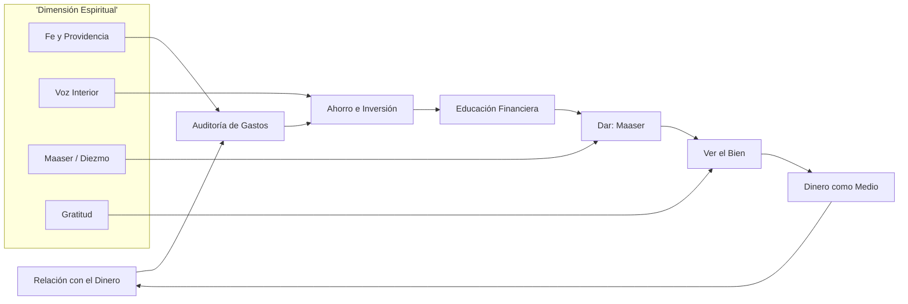
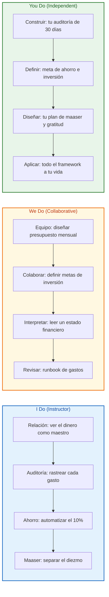

# MASTERCLASS: Riqueza y Espiritualidad — El Dinero como Maestro

## INTRODUCCIÓN: POR QUÉ ESTE MASTERCLASS ES DIFERENTE

La mayoría de los cursos de finanzas te enseñan a "hacer más dinero". Este masterclass propone algo distinto: **aprender a relacionarte con el dinero**.

El Rabino Jacob Krueger sostiene que el dinero no es solo una herramienta transaccional: es un maestro espiritual. Cada subida y bajada económica es una oportunidad para fortalecer la fe en uno mismo y en la providencia. Cuando dejas de ver al dinero como un enemigo o un dios, y comienzas a verlo como un socio y un espejo, tu vida financiera cambia desde la raíz.

> 🎯 **Objetivo de Aprendizaje** — Al final de esta guía, podrás auditar tus gastos, establecer metas de ahorro e inversión a largo plazo, educarte con fuentes sólidas, practicar la generosidad (maaser) y cultivar una actitud de gratitud que atrae abundancia.

> ⚠️ **Advertencia educativa** — Este contenido es formativo y basado en enseñanzas espirituales. Ninguna idea aquí es asesoramiento financiero ni recomendación de inversión. Consulta con profesionales antes de tomar decisiones de dinero.

---

## MAPA DEL WORKFLOW



| Fase | Pregunta que responde | Output principal |
|------|-----------------------|------------------|
| **Relación con el dinero** | ¿Qué actitud tengo hacia el dinero? | Fe, propósito y claridad |
| **Auditoría de gastos** | ¿En qué gasto realmente? | Mapa de fugas y hábitos |
| **Ahorro e inversión** | ¿Cómo hago crecer el dinero? | Metas, interés compuesto |
| **Educación financiera** | ¿De quién aprendo? | Criterio propio y humildad |
| **Dar: Maaser** | ¿Comparto lo que recibo? | Abundancia y propósito |
| **Ver el bien** | ¿Qué actitud elijo? | Gratitud y apertura |
| **Dinero como medio** | ¿Para qué sirve el dinero? | Misión y servicio |



---

## PARTE 1: RELACIÓN CON EL DINERO — EL MAESTRO INTERIOR

### 1.1 Principio Central

💡 **El dinero como enseñanza.** La interacción con las finanzas es una fuente de aprendizaje espiritual. Los altibajos económicos no son castigos: son oportunidades para fortalecer la fe en uno mismo y en la providencia divina.

> 🔑 **Analogía — El gimnasio del alma:** El dinero es como una pesa. No está para admirarla en el estante, sino para levantarla. Cada factura, cada tentación de compra y cada ingreso es un repetición que entrena tu músculo de disciplina y confianza.

### 1.2 La voz interior

🗣️ **Decide desde tu centro, no desde la presión.** Es crucial tomar decisiones basadas en tus necesidades y valores personales, no en modas consumistas ni en lo que "todos compran".

| Señal | Voz interior (sabia) | Voz del entorno (ruido) |
|-------|----------------------|--------------------------|
| Compra | "esto me sirve y lo puedo sostener" | "lo tienen todos, me quedo atrás" |
| Inversión | "lo entiendo y es a largo plazo" | "es la cripto de moda, no te pierdas" |
| Regalo | "quiero bendecir a este otro" | "si no gasto, parezco tacaño" |

💡 **Tip:** Antes de cualquier compra mayor, haz la "prueba de las 24 horas": espera un día. Si la urgencia desaparece, era ruido, no necesidad.

### 1.3 La "sangre" y el dinero

🩸 El Rabino Krueger enseña que el dinero, al igual que la sangre, es parte del **nefesh** (el alma viviente) de la persona. No es algo externo: es energía de vida que debe gestionarse con cuidado y conciencia.

> 🔑 **Analogía — El cuerpo financiero:** Si descuidas la sangre, el cuerpo se enferma. Si descuidas el dinero (lo gastas sin atención, lo idolatras o lo regalas sin límite), tu vida se desordena. El dinero bien cuidado circula y nutre; mal cuidado, se estanca o envenena.

---

## PARTE 2: AUDITORÍA DE GASTOS — EL "PIPELINE" QUE NO MIENTE

### 2.1 Regla de Oro

🧾 Si no sabes dónde va tu dinero, no puedes cambiar tu relación con él. Antes de invertir un solo peso, rastrea. El pipeline financiero debe responder:

1. ¿De dónde viene realmente mi dinero?
2. ¿Cuánto se escapa en suscripciones olvidadas?
3. ¿Cuánto gasto por impulso o por ansiedad?
4. ¿Qué compras por imagen y no por uso?
5. ¿Mis gastos reflejan mis valores?
6. ¿Hay fugas que repetirían siempre igual?

### 2.2 Tabla de auditoría de 30 días

| Categoría | Pregunta clave | Acción si es excesivo |
|-----------|----------------|------------------------|
| Suscripciones | ¿Uso esto esta semana? | Cancelar lo no usado |
| Comida fuera | ¿Cuántas veces por semana? | Cocinar 2-3 veces más |
| Impulso | ¿Compré por emoción? | Regla de 24h + lista |
| Imagen | ¿Lo necesito o quiero presumir? | Diferir 1 mes |
| Deuda de consumo | ¿Pago solo intereses? | Plan de exterminio |
| Automático | ¿Se va solo sin notar? | Revisar y pausar |

💡 **Tip:** Usa la regla de los 3 sobres virtuales: **Necesidad · Valor · Impulso**. Si un gasto no entra en "Necesidad" ni en "Valor", probablemente es impulso.

> 🔑 **Analogía — El mapa de fugas:** Auditar gastos es como revisar el medidor de agua de una casa con una cañería rota. No sirve ganar más si el suelo está mojado todo el tiempo. Tapar la fuga primero.

---

## PARTE 3: AHORRO E INVERSIÓN — LA FÁBRICA DEL COMPUESTO

### 3.1 Metas claras y automáticas

💰 Establece metas concretas: por ejemplo, ahorrar el **10% del sueldo** de forma automática apenas entra el ingreso. Lo que no ves, no lo gastas.

### 3.2 Interés compuesto: el milagro silencioso

📈 Busca inversiones a largo plazo que sean sólidas y comprensibles. El interés compuesto recompensa el tiempo, no la intuición del día.

| Año | Aporta/mes | Tasa anual | Valor aproximado |
|-----|-----------|------------|------------------|
| 5 | $100 | 8% | ~$7.300 |
| 10 | $100 | 8% | ~$18.400 |
| 20 | $100 | 8% | ~$58.900 |
| 30 | $100 | 8% | ~$150.000 |

*(Cifras ilustrativas, sin ajustar inflación ni impuestos. Solo para entender el efecto del tiempo.)*

> 🔑 **Analogía — La bola de nieve:** El interés compuesto es una bola que rueda cuesta abajo. Al principio es pequeña y apenas se nota. Pero cada vuelta suma más nieve, y pronto rueda sola. Tu trabajo es empezar la bola, no empujarla toda la vida.

💡 **Tip:** Automatiza el ahorro el día del pago. Si depende de "lo que sobre", casi siempre sobra cero.

### 3.3 Lo que NO hacer

⛔ No inviertas en lo que no entiendes. ⛔ No persigas modas. ⛔ No uses dinero que necesitas mañana para apostar a largo plazo.

---

## PARTE 4: EDUCACIÓN FINANCIERA — APRENDER DE LOS MAESTROS

### 4.1 Aprende de figuras reconocidas

📚 Aprender sobre inversiones a través de libros y podcasts de figuras reconocidas (Peter Lynch, Warren Buffett, Ray Dalio) en lugar de confiar ciegamente en intermediarios o influencers.

| Maestro | Lección clave | Frase que recuerda |
|---------|--------------|--------------------|
| Warren Buffett | Compra lo que entiendes, a largo plazo | "El mercado es una máquina de transferencia de riqueza de los impacientes a los pacientes" |
| Peter Lynch | Investiga lo que usas | "Conoce tu empresa mejor que el analista" |
| Ray Dalio | Diversifica y controla riesgo | "Si no puedes diversificar, no puedes sobrevivir" |

💡 **Tip:** Cuando alguien te venda una inversión, pregunta: "¿Esta persona gana si yo gano, o solo si yo entro?" El conflicto de interés es el primer filtro.

> 🔑 **Analogía — El aprendiz de violinista:** No aprendes violín escuchando a cualquiera en la calle. Estudias con maestros que llevan décadas tocando. Lo mismo con el dinero: aprende de quien tiene un método, no de quien tiene un micrófono.

---

## PARTE 5: LA DIMENSIÓN ESPIRITUAL — DAR Y EL MAASER

### 5.1 El diezmo como llave de abundancia

🤝 El **maaser** (diezmo, el 10%) y compartir los recursos con los demás es una llave para la abundancia. Considerar a Hashem (Dios) como socio en tus empresas y proyectos cambia la perspectiva: ya no eres dueño absoluto, eres administrador.

| Acción | Efecto espiritual | Efecto práctico |
|--------|-------------------|-----------------|
| Separar maaser | Confianza y propósito | Presupuesto consciente |
| Dar con alegría | Abre el corazón | Menos apego al tener |
| Ver a Dios como socio | Responsabilidad sana | Mejores decisiones |

> 🔑 **Analogía — La canilla y el balde:** Imagina la abundancia como una canilla. Si el balde (tu vida) está cerrado y solo acumula, se llena y se derrama sin sentido. Si das (abres una salida), la canilla sigue fluyendo. Dar no vacía el balde; mantiene el flujo.

💡 **Tip:** Separa el maaser apenas entra el ingreso, antes de gastar. Así el dar es parte del diseño, no lo que "sobra".

---

## PARTE 6: VER EL BIEN — LA ACTITUD DE GRATITUD

### 6.1 La gratitud como imán

🌟 Adoptar una actitud de gratitud y ver el potencial positivo en las personas y situaciones es una herramienta poderosa para atraer bendición y riqueza. Ver el bien no es ingenuidad: es entrenamiento del foco.

| Hábito | Cómo practicarlo | Beneficio |
|--------|------------------|-----------|
| Diario de gratitud | 3 cosas buenas al día | Mente abierta |
| Buscar lo bueno en otros | Un elogio sincero diario | Relaciones fuertes |
| Agradecer el dinero que entra | Decir "gracias" al cobrar | Relación sana |

> 🔑 **Analogía — Los anteojos de luz:** Dos personas ven el mismo día lluvioso. Una se queja de mojarse; la otra agradece el agua para su huerta. La lluvia es la misma; cambian los anteojos. Ver el bien es cambiar de anteojos.

💡 **Tip:** Cuando sientas escasez, nombra en voz alta 5 cosas que ya tienes. La escasez vive en la mente, no en la cuenta bancaria.

---

## PARTE 7: DINERO COMO MEDIO, NO COMO FIN

### 7.1 El peligro de la idolatría moderna

⚖️ El dinero debe servir como un medio para mejorar el mundo y ayudar a los demás. Convertirlo en un fin en sí mismo se describe como una forma de idolatría: la cosa pasa a mandar sobre la persona.

| Señal de "medio" | Señal de "fin" (alerta) |
|------------------|--------------------------|
| Lo uso para ayudar | Lo busco para sentir valor |
| Lo administro con propósito | Mi identidad depende de tenerlo |
| Lo comparto | Lo escondo o idolatro |
| Me libera tiempo | Me esclaviza por miedo a perderlo |

> 🔑 **Analogía — El martillo:** El dinero es un martillo. Útil para construir una casa; inútil y peligroso si lo adoras en el altar. La herramienta no es sagrada: lo que construyes con ella sí.

💡 **Tip:** Pregúntate cada mes: "¿El dinero me está llevando a mi misión o mi misión gira alrededor del dinero?"

---

## PARTE 8: I DO / WE DO / YOU DO — EJERCICIOS PROGRESIVOS

### 8.1 I Do — Auditoría guiada de 30 días

**Objetivo:** rastrear cada peso antes de juzgarlo.

| Paso | Acción | Resultado esperado |
|------|--------|--------------------|
| 1 | Anotar ingreso total | Base clara |
| 2 | Listar suscripciones | Fugas visibles |
| 3 | Clasificar gastos | Necesidad/Valor/Impulso |
| 4 | Marcar lo no usado | Candidate a cancelar |
| 5 | Calcular % ahorrado | Línea base |
| 6 | Recomendar meta | 10% automático |

**Interpretación guiada:**
- Si gastas >40% en impulso, prioriza la regla de 24h.
- Si no ahorras nada, automatiza el 10% primero.
- Si tienes deuda de consumo, el "interés compuesto" trabaja contra ti: paga primero.

### 8.2 We Do — Diseñar un presupuesto en equipo

**Escenario:** ingreso mensual de $2.000. Diagnóstico: gasto por impulso alto y cero ahorro.

| Decisión | Opción recomendada | Justificación |
|----------|--------------------|---------------|
| Ahorro | $200 automático (10%) | Paga primero a tu futuro |
| Maaser | $200 (10%) al recibir | Abundancia y propósito |
| Gasto fijo | Máx. 50% del ingreso | Espacio para vivir |
| Impulso | Regla de 24h + lista | Frena fugas |
| Inversión | Lo sobrante a largo plazo | Interés compuesto |
| Validación | Revisión mensual | Evita deriva |

### 8.3 You Do — Tu plan personal de riqueza espiritual

**Tarea:** diseña tu propio sistema con estos bloques:

1. Relación con el dinero (fe y propósito)
2. Auditoría de 30 días
3. Ahorro automático del 10%
4. Educación financiera (1 libro + 1 podcast)
5. Maaser del 10% con alegría
6. Diario de gratitud diario
7. Revisión mensual de "medio vs fin"

| Criterio | Peso |
|----------|------|
| Claridad de propósito | 25% |
| Automatización del ahorro | 25% |
| Práctica de gratitud/dar | 25% |
| Educación continua | 15% |
| Revisión mensual | 10% |

### 8.4 Cierre práctico

| Nivel | Debes poder hacer |
|-------|-------------------|
| **I Do** | Seguir un ejemplo completo de auditoría, ahorro y maaser |
| **We Do** | Ajustar montos, interpretar tu estado y decidir avanzar |
| **You Do** | Construir tu sistema con propósito, dar y gratitud |

---

## CHECKLIST FINAL DE RIQUEZA ESPIRITUAL

| Bloque | Check |
|--------|-------|
| Relación | Veo el dinero como maestro, no como dios ni enemigo |
| Voz interior | Decido por valores, no por presión social |
| Auditoría | Rastreé 30 días y encontré fugas |
| Ahorro | Automatizo al menos el 10% al cobrar |
| Inversión | Entiendo lo que compro y es a largo plazo |
| Educación | Aprendo de fuentes sólidas, no de influencers |
| Maaser | Separo el 10% con alegría como administrador |
| Gratitud | Practico ver el bien cada día |
| Propósito | El dinero me sirve a una misión, no al revés |
| Revisión | Me evalúo mensualmente |

---

## Preguntas de Verificación 📝

Responde cada pregunta basándote en los conceptos de esta master class.

### Preguntas sobre relación con el dinero

1. **Aplica:** Si tu cuenta bancaria baja de repente, ¿cómo lo interpretarías como "maestro" en lugar de como castigo?

2. **Analiza:** Da un ejemplo de una decisión de compra tuya reciente impulsada por la "voz del entorno" y cómo la habrías cambiado con la "voz interior".

### Preguntas sobre ahorro e inversión

3. **Calcula:** Si ahorras $150/mes al 8% anual durante 25 años, ¿por qué el resultado final es mucho mayor que sumar $150×12×25? (Concepto, no número exacto.)

4. **Evalúa:** ¿Por qué invertir en lo que no entiendes es más parecido a la idolatría del dinero que a su uso como medio?

### Preguntas sobre la dimensión espiritual

5. **Reflexiona:** ¿Cómo cambia tu actitud hacia el trabajo si consideras a Dios como "socio" de tus proyectos?

6. **Diseña:** Arma tu propio plan de maaser: ¿a quién o qué destinarías el 10% y con qué actitud?

### Preguntas integradoras

7. **Conecta:** Explica cómo la gratitud (ver el bien) y el maaser (dar) se refuerzan mutuamente para atraer abundancia.

8. **Síntesis:** Toma tu vida financiera actual y aplícale el framework completo: relación → auditoría → ahorro → educación → maaser → gratitud → propósito. Señala tus 3 puntos críticos.

9. **Propón:** Diseña un "ritual mensual" de 15 minutos que incluya revisión de gastos, gratitud y propósito. ¿Qué 3 preguntas harías?

10. **Reflexión final:** De los 7 bloques del workflow, ¿cuál consideras el más difícil de sostener y por qué?

---

## GLOSARIO RÁPIDO

| Término | Definición |
|---------|------------|
| **Nefesh** | Alma viviente; en esta enseñanza, lo que da al dinero un carácter vital |
| **Maaser** | Diezmo: separar y dar el 10% de los ingresos |
| **Hashem** | Nombre para Dios; visto aquí como "socio" en los proyectos |
| **Interés compuesto** | Crecimiento donde los intereses generan nuevos intereses |
| **Voz interior** | Criterio propio basado en valores frente a la presión social |
| **Abundancia** | Estado de flujo y suficiencia, no solo acumulación |
| **Medio vs Fin** | El dinero como herramienta (medio) y no como objetivo de adoración (fin) |
| **Idolatría moderna** | Dar al dinero un lugar que solo corresponde a lo sagrado |

---

## ANEXO: FORMATO IDEAL PARA GUÍAS EDUCATIVAS

### Recomendaciones de ancho para lectura larga

El ancho óptimo para artículos educativos es **60–75 caracteres por línea** (incluyendo espacios). Equivale aproximadamente a `max-width: 65ch` en CSS, o 550–750 px de ancho de contenido.

```css
.article-content {
  max-width: 65ch;
}
```

Esto facilita: mantener la atención, reducir la fatiga visual, mejorar la comprensión y seguir conceptos complejos.

### Lo que hace agradable una guía al cerebro

- 🎯 **Un objetivo claro** al inicio (¿qué sabré hacer al final?).
- 🗺️ **Un mapa visual** (flujo) para no perderse.
- 🧩 **Pasos pequeños** (I Do → We Do → You Do) que construyen confianza.
- 💡 **Tips concretos** que se pueden aplicar hoy.
- 🔑 **Analogías** que conectan lo nuevo con lo conocido.
- 🧾 **Checklists** para verificar el progreso.
- ❓ **Preguntas** que obligan a pensar, no solo leer.
- 📖 **Glosario** para fijar el vocabulario nuevo.

> 💡 **Tip final:** No estudies esta guía de una sentada. Lee una parte, aplícala 7 días, y luego avanza. La riqueza espiritual se entrena, no se lee.
