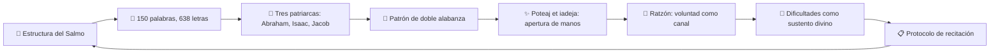
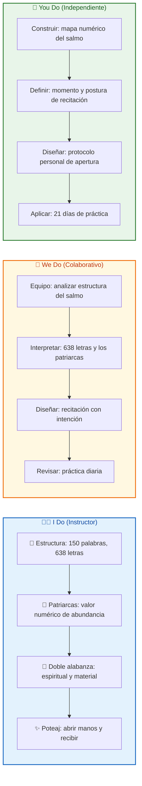
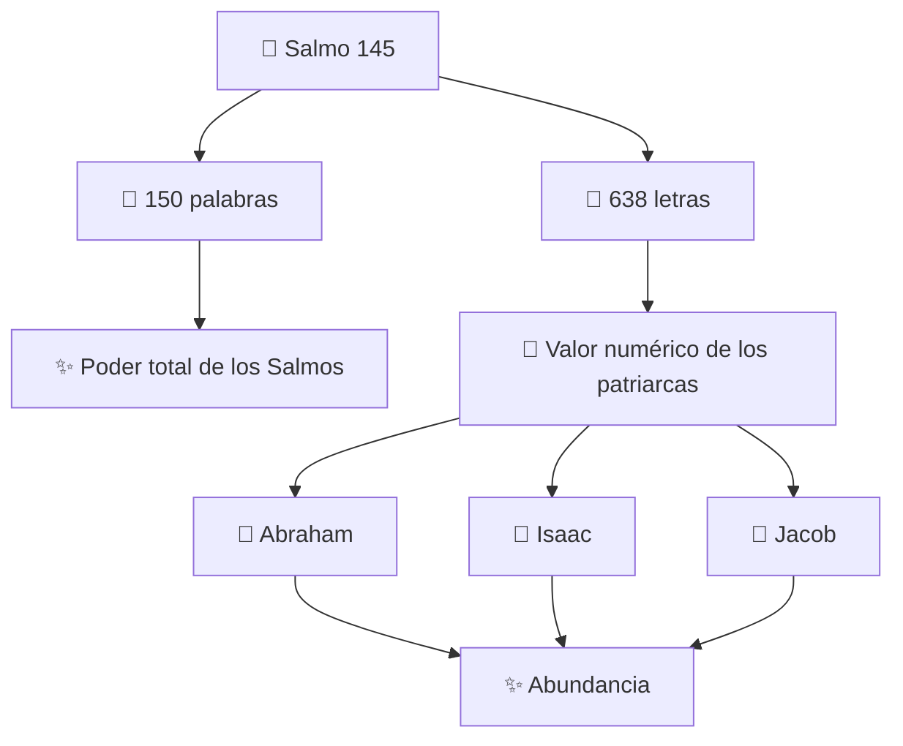
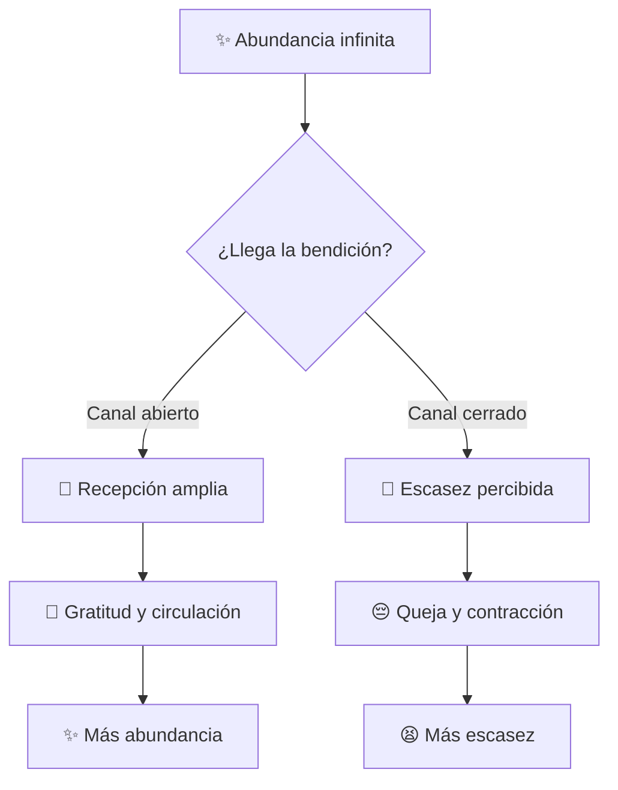
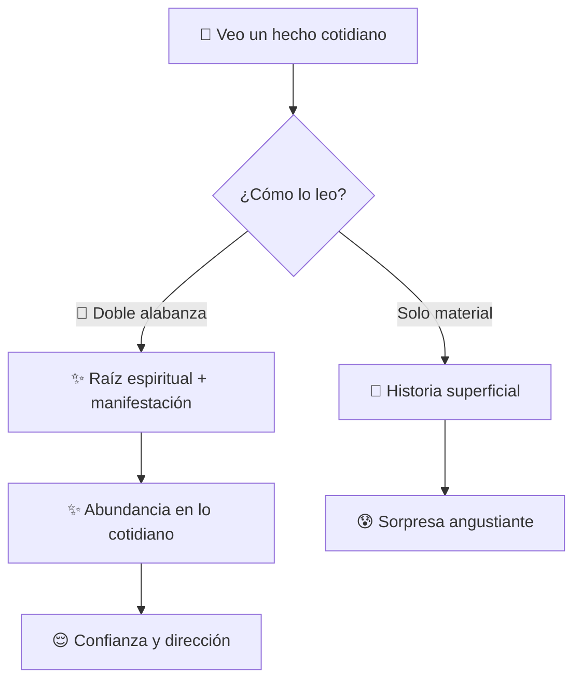
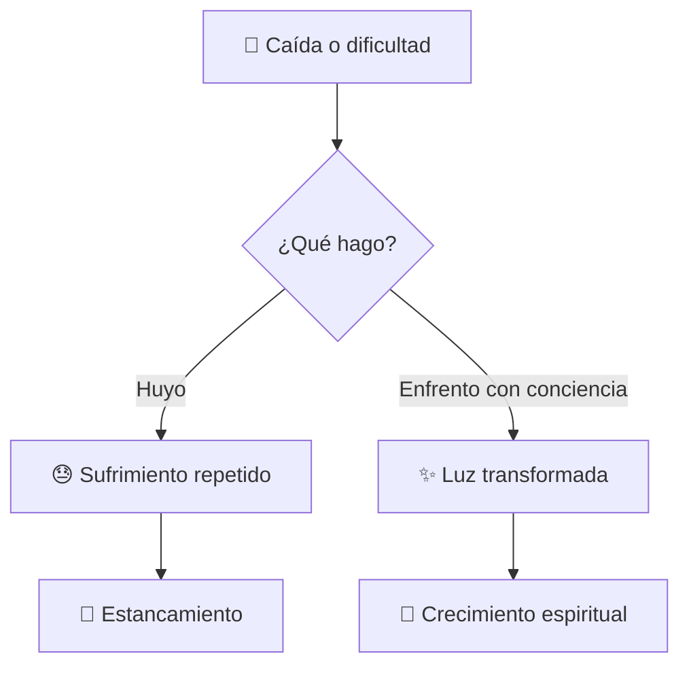
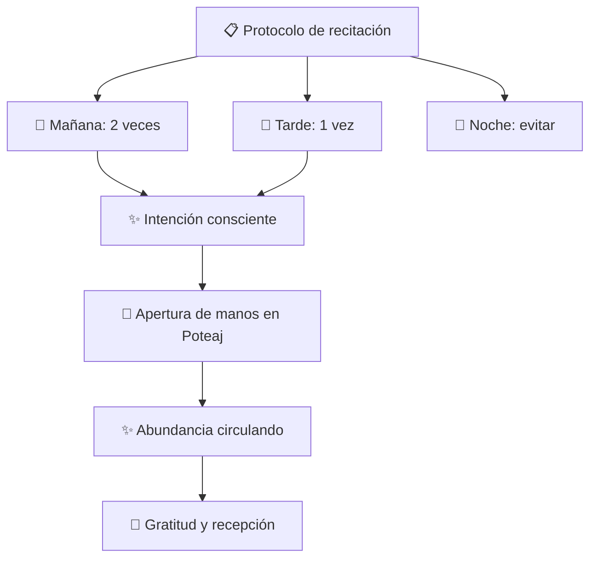

## 🎯 ¿Qué vas a aprender

En este contenido desarrollarás una comprensión práctica del Salmo 145 como herramienta de conexión espiritual:

- 🔢 La estructura numérica y alfabética del Salmo 145 y su relación con los tres patriarcas
- 🙏 Cómo recitar el salmo con intención consciente para abrir el canal de la abundancia
- ✨ El significado profundo de Poteaj et iadeja y su relación con la capacidad de recibir
- 🔄 El patrón de doble alabanza como forma de leer la raíz espiritual detrás de lo cotidiano
- 📋 Protocolo práctico de recitación diaria, momento ideal y postura corporal

---

# MASTERCLASS: El Poder del Salmo 145 🔥 — Atraer Abundancia con el Rabino Daniel R. Chapán

## 🎬 INTRODUCCIÓN: POR QUÉ ESTA MASTERCLASS ES DIFERENTE

La mayoría de los approached a la abundancia empiezan por técnicas, mentalidad o acción. Esta masterclass empieza por un texto antiguo con una estructura oculta que la Kabbalah revela como un mapa espiritual para transformar la relación con el dinero, la inseguridad y la recepción.

En esta charla, el Rabino Daniel R. Chapán explica que el Salmo 145 no debe recitarse de manera mecánica. Cada palabra, cada letra y cada verso están diseñados para conectar con energías espirituales que sustentan el mundo material. El salmo funciona cuando la recitación se convierte en un acto consciente de apertura.

El Salmo 145 tiene **150 palabras**, el mismo número que los Salmos completos, y **638 letras**, que corresponden al valor numérico de los nombres de los tres patriarcas: Abraham, Isaac y Jacob, símbolos de abundancia en la tradición judía.

El versículo **Poteaj et iadeja** —"Abres tu mano y satisfaces el deseo de todo ser vivo"— es el eje de la enseñanza: Dios siempre está dando. Nuestra limitación no está en Él, sino en nuestra capacidad de recibir y en nuestra voluntad, que actúa como el canal por donde fluye esa abundancia.

> **🎯 Objetivo de Aprendizaje** — Al final de esta guía, podrás recitar el Salmo 145 con intención consciente, reconocer su estructura numérica y alfabética, aplicar el protocolo de doble alabanza y crear una práctica sostenible de apertura a la abundancia.

> **⚠️ Advertencia educativa** — Este contenido es formativo y espiritual. No sustituye asesoría religiosa, psicológica ni financiera profesional. Úsalo como marco de reflexión y práctica personal.

---

## 🗺️ MAPA DEL WORKFLOW DEL SALMO 145



| 🚀 Fase | ❓ Pregunta que responde | 🎁 Output principal |
|---------|--------------------------|---------------------|
| **Estructura** | ¿Qué cifras y diseño oculto tiene el Salmo 145? | 🧩 Mapa numérico y alfabético |
| **Tres patriarcas** | ¿Por qué 638 letras representan abundancia? | ✨ Valor numérico y legado |
| **Doble alabanza** | ¿Cómo se relaciona lo espiritual con lo material? | 🔄 Patrón de lectura cotidiana |
| **Poteaj et iadeja** | ¿Qué significa abrir la mano para recibir? | 🙌 Protocolo corporal y espiritual |
| **Ratzón** | ¿Cómo funciona la voluntad como canal? | 💪 Ampliación de la vasija |
| **Dificultades** | ¿Por qué las caídas son parte del diseño? | 🌱 Reencuadre espiritual |
| **Recitación** | ¿Cómo recitar el salmo con intención? | 📋 Rutina diaria |



---

## 📖 PARTE 1: LA SÍNTESIS DE PODER DEL SALMO 145 (1:42 - 4:46)

### 🎯 1.1 Principio Central

El Salmo 145 no es un texto aleatorio. Es, según la enseñanza del Rabino Daniel R. Chapán, una **síntesis de poder**: contiene en sí mismo la estructura completa de los 150 Salmos, además de un diseño numérico que lo conecta con los tres patriarcas, quienes fueron símbolos de abundancia en la tradición judía.

Eso significa que cuando recitas este salmo, estás activando una estructura espiritual diseñada para sostener el mundo material.



### 🔢 1.2 El número 150: la totalidad del poder

| Elemento | Significado | 💡 Implicancia práctica |
|----------|-------------|-------------------------|
| 150 palabras | Corresponde al número total de Salmos en la tradición judía | El Salmo 145 concentra el poder de todos los Salmos en uno solo |
| Simbología | No es un salmo más. Es un **salmo portal** | Cuando lo recitas, activas la totalidad del poder salmista |

> **💡 Tip**: Leer el Salmo 145 completo una vez con esta conciencia cambia la experiencia: no estás leyendo un texto, estás activando un mapa espiritual.

### 🔢 1.3 El número 638 y los tres patriarcas

| Nombre hebreo | Valor numérico (Gematría) |
|---------------|---------------------------|
| Abraham | 1 + 10 + 2 + 4 + 1 + 10 + 200 = 248 |
| Isaac | 10 + 70 + 10 + 8 = 98 |
| Jacob | 10 + 6 + 2 + 100 = 118 |
| **Total** | **248 + 98 + 118 = 464** |

El rabino explica que los tres patriarcas fueron símbolos de abundancia: Abraham asociado a la misericordia, Isaac al juicio y Jacob a la misericordia en equilibrio. Sus nombres combinados representan el sustento divino que fluye hacia el mundo.

> **💡 Tip**: Escribí 638 en un lugar visible. Cada vez que lo veas, recordá que tu práctica no es repetición vacía: es conexión con un legado numérico de abundancia.

### 📖 1.4 Estructura del Alefbet

Una característica única del Salmo 145 es que sigue el orden del alfabeto hebreo: cada verso comienza con una letra secuencial del Alefbet. Esto no es casualidad. Cada letra es una puerta espiritual. El salmo recorre las puertas en orden para construir un camino de bendición.

| Característica | Detalle | 🎯 Lectura espiritual |
|----------------|---------|-----------------------|
| Orden alfabético | Alef, Bet, Guimel, Dalet, etc. | Cada letra es una puerta que se abre en secuencia |
| Verso clave | Uno de los versos está diseñado para invocar el sustento divino ante cualquier caída | Las dificultades no son accidentes |
| Enseñanza | Las dificultades son sostenidas por Dios para transformarse en crecimiento | Lo que cae, si se sostiene conscientemente, se transforma |

### 💡 1.5 Consejo clave: recitar con intención, no con memoria

> **💡 Tip**: El Salmo 145 no debe mecanizarse. Cada verso debe pronunciarse con la conciencia de que estás activando una estructura espiritual. Si tu mente se distrae, volvé al verso anterior y continuá con intención renovada.

### ⚠️ 1.6 Errores comunes

| ❌ Error | 😰 Síntoma | ✅ Solución |
|----------|-----------|------------|
| Recitar de memoria sin el texto | Olvido de versos, rapidez mecánica | Usar el recurso descargable con hebreo y fonética |
| Recitar rápido por cantidad | Sin conexión, sin intención | Reducir velocidad, detenerse en Poteaj |
| No investigar la estructura | El salmo queda en texto genérico | Leer sobre 150 palabras y 638 letras antes de empezar |
| Ignorar el Alefbet | Se pierde la arquitectura espiritual | Subrayar cada letra inicial como puerta |

### 🏋️ 1.7 I Do — Explorar la estructura numérica

**🎯 Objetivo:** comprender la arquitectura espiritual del Salmo 145.

| Paso | 🔨 Acción | 🎁 Resultado |
|------|-----------|--------------|
| 1️⃣ | Leer el salmo completo una vez | 📖 Contacto inicial |
| 2️⃣ | Contar 150 palabras o subrayar versos | 🧠 Conciencia de la estructura |
| 3️⃣ | Investigar el valor numérico de Abraham, Isaac y Jacob | 🔢 Entender el 638 |
| 4️⃣ | Identificar el verso que habla del sustento en la caída | 📌 Verso pivote |
| 5️⃣ | Escribir una frase sobre qué significa para vos | ✍️ Aplicación personal |

### 🤝 1.8 We Do — Conectar estructura con cotidianidad

**🎭 Escenario:** alguien quiere explicar el Salmo 145 a un amigo escéptico.

| ❓ Pregunta | 💡 Respuesta esperada |
|-------------|------------------------|
| ¿Qué es 150 palabras? | El salmo resume el poder de todos los Salmos |
| ¿Qué es 638 letras? | El legado numérico de Abraham, Isaac y Jacob |
| ¿Por qué importa? | No es un texto aleatorio; es un diseño espiritual |
| ¿Qué hace la estructura? | Conecta letras, números y propósito de abundancia |
| ¿Por qué recitarlo con intención? | La repetición consciente abre el canal |

### 📝 1.9 You Do — Tu mapa del salmo

Completa:

```text
📋 Lo que más me impacta del Salmo 145 es:
__________________________________________________

🔢 La cifra que más me resuena es:
__________________________________________________

📖 El verso que quiero memorizar es:
__________________________________________________

Por qué:
__________________________________________________
```

---

## 🙌 PARTE 2: EL CANAL DE LA ABUNDANCIA — POTEAJ ET IADEJA (9:50 - 12:00)

### 🎯 2.1 Principio Central

**Poteaj et iadeja** —"Abres tu mano y satisfaces el deseo de todo ser vivo"— es el versículo pivote del Salmo 145 y el eje de la enseñanza sobre la abundancia.

El rabino explica que Dios siempre está dando. La limitación no está en Él, sino en nuestra capacidad de recibir y en nuestra voluntad, que actúa como el canal —o tubo— por donde fluye la abundancia.

Si el tubo está tapado, el agua no llega. Si la mano está cerrada, la bendición no entra.



### 💡 2.2 Consejo clave: la metáfora del tubo

> **💡 Tip**: Tu voluntad es como un tubo. Si el tubo es angosto, solo pasa poca agua. Si el tubo es amplio, pasa mucha agua. La disciplina espiritual amplía el tubo. La apertura emocional lo destapa. La gratitud lo mantiene limpio.

### 🙌 2.3 La mano abierta como símbolo

| Estado de la mano | Significado espiritual | Efecto práctico |
|-------------------|------------------------|-----------------|
| Cerrada ✊ | Miedo, cerrazón, falta de merecimiento | 🚫 Bloqueo de recepción |
| Semiabierta 🤲 | Duda, merecimiento condicional | ⚠️ Recepción limitada |
| Abierta 🙌 | Confianza, gratitud, disposición | ✅ Canal pleno |
| Abierta y que da 🎁 | Abundancia circulando | 🔄 Flujo sostenido |

### 💪 2.4 Ratzón: la voluntad como canal

La enseñanza explica que la voluntad —ratzón— no es solo deseo. Es la capacidad de sostener la intención y de ampliar el tubo por donde fluye la luz infinita.

| Sin ratzón | Con ratzón |
|------------|------------|
| Deseo sin dirección | Voluntad sostenida 🎯 |
| Recepción momentánea | Canal ampliado 💪 |
| Abundancia que entra y sale | Abundancia que se queda y se comparte 🔄 |
| Pascividad | Acción consciente ⚡ |
| Dependencia del exterior | Centro interior estable 🧘 |

### ✨ 2.5 Protocolo de apertura de manos

```python
class PoteajProtocolo:
    def __init__(self):
        self.verse = "Poteaj et iadeja"
        self.postura = "manos abiertas"
        self.intencion = "recepción consciente"

    def ejecutar(self):
        return {
            "verso": self.verse,
            "postura": self.postura,
            "intencion": self.intencion,
            "resultado": "✨ Apertura del canal de abundancia",
        }

    def validar(self):
        return self.postura == "manos abiertas" and self.intencion
```

### ⚠️ 2.6 Errores comunes en la apertura a la abundancia

| ❌ Error | 😰 Síntoma | ✅ Solución |
|----------|-----------|------------|
| Recitar sin intención | Mecanicismo, vacío | Detenerse en Poteaj con las manos abiertas 🙌 |
| Cerrar la mano después | Dudar de la recepción | Mantener la apertura durante el versículo |
| Mezclar abundancia con ego | Buscar solo lo material | Incluir gratitud y servicio 🙏 |
| No sostener la práctica | Abandonar al tercer día | Ritmo simple y sostenible 📅 |

> **💡 Tip**: Al llegar a Poteaj et iadeja, hacé una pausa de 3 segundos. Abrí las manos. Respirá. Dejá que el verso entre en tu cuerpo, no solo en tu mente.

### 🏋️ 2.7 I Do — Practicar el protocolo Poteaj

**🎯 Objetivo:** experimentar la apertura corporal como parte de la práctica.

| Paso | 🔨 Acción | 🎁 Resultado |
|------|-----------|--------------|
| 1️⃣ | Sentarse en silencio 2 minutos 🧘 | Centramiento |
| 2️⃣ | Leer el verso en hebreo, fonética o español 📖 | Contacto |
| 3️⃣ | Abrir las manos simbólicamente 🙌 | Postura |
| 4️⃣ | Respirar 3 veces manteniendo la apertura 🫁 | Profundización |
| 5️⃣ | Escribir qué aparece ✍️ | Materializar |

### 🤝 2.8 We Do — Diseñar un ritual de abundancia

**🎭 Escenario:** alguien quiere incorporar el salmo a su mañana.

| 🎯 Elemento | ✅ Decisión |
|-------------|-------------|
| ⏰ Momento | Al despertarse, antes de revisar el celular |
| ⏱️ Duración | 5 minutos |
| 🧘 Postura | Sentado, manos abiertas sobre las piernas |
| 📖 Verso foco | Poteaj et iadeja |
| 📝 Acción posterior | Anotar una palabra de gratitud |

### 📝 2.9 You Do — Tu práctica de Poteaj

Completa:

```text
📋 Mi momento de recitación será:
__________________________________________________

🧘 Mi postura será:
__________________________________________________

🙌 Cuando llegue a Poteaj et iadeja, voy a:
__________________________________________________

🙏 La gratitud que voy a registrar después es:
__________________________________________________

📅 Durante cuántos días lo haré:
__________________________________________________
```

---

## 🔄 PARTE 3: DOBLE ALABANZA Y LECTURA ESPIRITUAL (13:17 - 15:00)

### 🎯 3.1 Principio Central

Cada verso del Salmo 145 presenta dos alabanzas: una enfocada en lo espiritual —la exaltación de Dios— y otra en su revelación dentro del mundo material —la bendición de Su nombre en la vida cotidiana.

Este patrón enseña que nunca hay que leer los hechos materiales sin mirar su raíz espiritual. Un problema, una pérdida o una dificultad no son solo hechos materiales. Detrás de ellos hay una estructura espiritual que pide ser leída.



### 📖 3.2 Ejemplo de la vida real

> **📖 Ejemplo**: Perdés tu trabajo.
> - 📰 Lectura superficial: "Me falta dinero. El mundo es injusto."
> - 🔄 Lectura de doble alabanza: "Esta dificultad me pide reorganizar mi relación con el sustento divino y ampliar mi voluntad para recibir nuevas oportunidades."

### 🔄 3.3 Patrón de doble alabanza

| Nivel de lectura | Ejemplo | Resultado |
|------------------|---------|-----------|
| Solo material 📰 | "Perdí mi trabajo" | 😰 Crisis, angustia, pregunta sin respuesta |
| Material + espiritual 🔄 | "Perdí mi trabajo y esto me pide rediseñar mi relación con el sustento" | 🤔 Dolor con dirección |
| Doble alabanza ✨ | "Dios me da esta experiencia para ampliar mi capacidad de recibir" | 😌 Confianza y acción |

### 🛠️ 3.4 Aplicación cotidiana del patrón

```python
class DobleAlabanza:
    def __init__(self, hecho):
        self.hecho = hecho
        self.lectura_material = ""
        self.lectura_espiritual = ""
        self.proposito = ""

    def interpretar(self):
        return {
            "hecho": self.hecho,
            "material": self.lectura_material,
            "espiritual": self.lectura_espiritual,
            "proposito": self.proposito,
        }
```

### 💡 3.5 Ejemplos prácticos de doble lectura

| Hecho material 📰 | Lectura superficial | Lectura de doble alabanza ✨ |
|-------------------|---------------------|------------------------------|
| Dificultad económica | "Me falta dinero" | "Se me pide reorganizar mi relación con el dar y recibir" |
| Enfermedad | "Estoy enfermo" | "Mi cuerpo me pide cambiar hábitos y prioridades" |
| Conflicto | "Tengo problemas con X" | "La relación me pide mayor honestidad y límites" |
| Oportunidad | "Me ofrecen algo nuevo" | "La abundancia llega cuando amplío mi voluntad" |

### ⚠️ 3.6 Errores comunes

| ❌ Error | 😰 Síntoma | ✅ Solución |
|----------|-----------|------------|
| Quedarse solo en la superficie | No encontrás sentido | Buscar la raíz espiritual |
| Espiritualizar sin acción | Todo queda en la mente | Convertir la lectura en acción concreta |
| Juzgar la dificultad | "Esto es un castigo" | Recordar: es sustento para crecimiento |
| Olvidar la gratitud | Solo ves lo negativo | Agregar una alabanza consciente |

> **💡 Tip**: Cuando te pase algo difícil, escribí primero la lectura superficial, luego la espiritual, luego la acción. Ese triple movimiento cambia la relación con la experiencia.

### 🏋️ 3.7 I Do — Leer un hecho con doble alabanza

**🎯 Objetivo:** transformar una experiencia reciente en material espiritual.

| Paso | 🔨 Acción | 🎁 Resultado |
|------|-----------|--------------|
| 1️⃣ | Elegir un hecho reciente que te afectó | 📌 Material de trabajo |
| 2️⃣ | Escribir la lectura material (lo obvio) | 📰 Superficie |
| 3️⃣ | Escribir la lectura espiritual (qué pide) | ✨ Profundidad |
| 4️⃣ | Escribir una acción de apertura | 🚀 Propósito |
| 5️⃣ | Agregar una alabanza consciente 🙏 | Cierre |

### 🤝 3.8 We Do — De dificultad a crecimiento

**🎭 Escenario:** alguien atraviesa una crisis económica.

| ❓ Pregunta | 💡 Respuesta esperada |
|-------------|------------------------|
| Hecho material 📰 | "No tengo suficiente dinero" |
| Lectura superficial 😰 | "El mundo es injusto" |
| Lectura espiritual ✨ | "Se me pide confiar en el sustento divino" |
| Acción 🚀 | Pedir ayuda, reorganizar gastos, estudiar nuevas fuentes |
| Alabanza 🙏 | "Gracias por la oportunidad de ampliar mi confianza" |

### 📝 3.9 You Do — Tu mapa de doble alabanza

```text
📋 Un hecho difícil de esta semana:
__________________________________________________

📰 Lectura material:
__________________________________________________

✨ Lectura espiritual:
__________________________________________________

🚀 Acción de apertura:
__________________________________________________

🙏 Alabanza consciente:
__________________________________________________
```

---

## 🌱 PARTE 4: LAS DIFICULTADES COMO SUSTENTO DIVINO (6:04 - 9:50)

### 🎯 4.1 Principio Central

Uno de los versículos dentro del Salmo 145 está diseñado para invocar el sustento divino ante cualquier caída. La enseñanza es clara: las dificultades no son accidentes, ni castigos, ni señales de que algo anda mal. Son sostenidas por Dios para transformarse en crecimiento.

Esto no significa que haya que buscar el sufrimiento. Significa que cuando el sufrimiento aparece, no estás solo: hay una estructura espiritual sosteniéndolo para que, si lo enfrentas con conciencia, se transforme en luz.



### 💡 4.2 Consejo clave: no huir, transitar

> **💡 Tip**: La diferencia entre sufrir y crecer no es la dificultad. Es la conciencia con la que la transitás. Lo que llamás "mala suerte" puede ser, si lo mirás con atención, el momento exacto que tu alma necesitaba para expandirse.

### 🔄 4.3 Reencuadre de la dificultad

| Lectura común 📰 | Lectura espiritual del Salmo 145 ✨ |
|------------------|-----------------------------------|
| "Algo salió mal" 😰 | "Algo pide ser transformado" 🌱 |
| "Soy víctima de la situación" 😔 | "Soy responsable de la lectura que hago" 🧠 |
| "No tengo fuerzas" 🪫 | "La dificultad pide nuevas herramientas" 🛠️ |
| "El universo está en mi contra" 🌚 | "Dios sostiene esta experiencia para mi crecimiento" ✨ |
| "Esto no tiene sentido" 🤔 | "El sentido se revela con tiempo y conciencia" ⏳ |

### 🛠️ 4.4 Protocolo frente a la dificultad

```python
class SustentoDivino:
    def __init__(self, dificultad):
        self.dificultad = dificultad
        self.lectura_material = ""
        self.proposito_oculto = ""
        self.accion = ""

    def reencuadrar(self):
        return {
            "dificultad": self.dificultad,
            "material": self.lectura_material,
            "proposito": self.proposito_oculto,
            "accion": self.accion,
            "estado": "✨ transformada",
        }
```

### 💡 4.5 Ejemplo práctico

> **📖 Ejemplo**: Tu empresa atraviesa una crisis.
> - 📰 Lectura superficial: "Se viene todo abajo. Perdí dinero."
> - ✨ Lectura espiritual: "Esta crisis me pide revisar mi relación con el sustento y ampliar mi capacidad de confiar."
> - 🚀 Acción: pedir ayuda, reestructurar, buscar nuevos caminos.

### ⚠️ 4.6 Errores comunes

| ❌ Error | 😰 Síntoma | ✅ Solución |
|----------|-----------|------------|
| Huir de la dificultad | Repetición del patrón | Enfrentar con conciencia |
| Espiritualizar sin acción | Todo queda en la mente | Convertir la lectura en acción |
| Ver la dificultad como castigo | Víctima de la situación | Reencuadrar como sustento |
| Aferrarse al dolor | Quedarse en la queja | Pasar a la acción transformadora |

### 🏋️ 4.7 I Do — Reencuadrar una dificultad actual

**🎯 Objetivo:** cambiar la relación con una experiencia dolorosa.

| Paso | 🔨 Acción | 🎁 Resultado |
|------|-----------|--------------|
| 1️⃣ | Escribir la dificultad sin filtro | 📌 Material |
| 2️⃣ | Identificar la emoción dominante | 😔 Punto de entrada |
| 3️⃣ | Reemplazar la emoción por una pregunta | 🤔 Apertura |
| 4️⃣ | Escribir una acción de crecimiento | 🌱 Propósito |
| 5️⃣ | Cerrar con gratitud por el aprendizaje 🙏 | ✨ Cierre |

### 🤝 4.8 We Do — Sostener la dificultad en comunidad

**🎭 Escenario:** dos personas comparten dificultades económicas.

| 👤 Persona | 📰 Dificultad | ✨ Reencuadre | 🚀 Acción |
|------------|--------------|--------------|-----------|
| A | "Perdí mi trabajo" | "Me pide confiar en nuevas oportunidades" | Actualizar CV, pedir ayuda |
| B | "No llego a fin de mes" | "Me pide reorganizar mi relación con el dinero" | Presupuesto, propósito |

### 📝 4.9 You Do — Tu dificultad transformada

```text
🌱 La dificultad que quiero transformar es:
__________________________________________________

✨ La verdad espiritual que la sostiene es:
__________________________________________________

🚀 La acción de crecimiento que voy a tomar es:
__________________________________________________

🙏 La oración o afirmación que voy a usar es:
__________________________________________________
```

---

## 📋 PARTE 5: PROTOCOLO DE RECITACIÓN — PRÁCTICA DIARIA (18:31 - 19:29)

### 🎯 5.1 Principio Central

El Rabino Daniel R. Chapán recomienda recitar el Salmo 145 **tres veces al día**: dos veces en la mañana y una en la tarde, evitando la noche porque es un momento de recepción de sueños y energías sutiles que no deben mezclarse con la bendición del sustento material activo.

La clave no es la cantidad: es la intención. Recitar 100 veces sin intención no genera el mismo efecto que recitarlo una vez con el corazón abierto.



### 💡 5.2 Consejo clave: la regla de las tres veces

> **💡 Tip**: No intentes hacerlo perfecto. Mejor recitarlo 3 veces con intención que 100 veces de memoria. La calidad de la presencia vale más que la cantidad de repeticiones.

### 📋 5.3 Frecuencia recomendada

| ⏰ Momento | 🔢 Cantidad | 💡 Motivo |
|------------|------------|-----------|
| 🌅 Mañana | 2 veces | Comenzar el día con apertura |
| 🌇 Tarde | 1 vez | Reorientar la energía del día |
| 🌙 Noche | 0 | Evitar mezclar energías de sustento material con sueños |

> **⚠️ Advertencia**: La noche está reservada para la recepción de sueños y energías sutiles. No mezcles la bendición del sustento material con ese espacio.

### 🙌 5.4 La postura de Poteaj

| Momento del salmo | Acción corporal | Intención |
|-------------------|-----------------|-----------|
| Versos iniciales | Manos en el pecho o sobre las piernas | Centramiento |
| Al llegar a Poteaj et iadeja | Abrir las manos simbólicamente 🙌 | Apertura del canal |
| Versos finales | Manos abiertas o en posición de recibo | Recepción activa |
| Cierre | Manos juntas en gratitud 🙏 | Agradecimiento |

> **💡 Tip**: Hacé que la postura sea un gesto, no una obligación.Si tu cuerpo no lo permite, la intención de abrir la mano ya es suficiente. La conciencia es más importante que la forma exacta.

### 📥 5.5 Recurso descargable

El autor ofrece un archivo con:
- 📖 Texto en hebreo
- 🔊 Fonética
- 🇪🇸 Traducción al español

Esto facilita la práctica incluso para quienes no leen hebreo.

> **💡 Tip**: Imprimí el recurso o dejalo en tu celular. La fricción de buscar el texto reduce la probabilidad de practicar. Eliminá esa fricción.

### ⚠️ 5.6 Errores comunes en la recitación

| ❌ Error | 😰 Síntoma | ✅ Solución |
|----------|-----------|------------|
| Recitar de memoria sin el texto 📖 | Olvido de versos, rapidez mecánica | Usar el recurso descargable |
| Recitar rápido ⚡ | Sin intención, sin conexión | Reducir velocidad, detenerse en Poteaj |
| Recitar con dudas 🤔 | Mente dispersa | Establecer un momento fijo y postura |
| No abrir las manos 🙌 | Misma postura todo el salmo | Detenerse específicamente en Poteaj |

### 🏋️ 5.7 I Do — Diseñar tu rutina de recitación

**🎯 Objetivo:** crear una práctica sostenible.

| Paso | 🔨 Acción | 🎁 Resultado |
|------|-----------|--------------|
| 1️⃣ | Elegir horario de mañana 1 🌅 | Constancia |
| 2️⃣ | Elegir horario de mañana 2 | Profundización |
| 3️⃣ | Elegir horario de tarde 🌇 | Cierre del día |
| 4️⃣ | Definir postura para Poteaj 🙌 | Protocolo corporal |
| 5️⃣ | Definir momento de gratitud posterior 🙏 | Cierre |

### 🤝 5.8 We Do — Revisar una semana de práctica

**🎭 Escenario:** alguien intentó recitar 3 veces al día y lo abandonó al segundo día.

| 📅 Día | 🤔 Qué pasó | ✅ Ajuste |
|--------|------------|----------|
| 1 | Lo hizo al despertar | ✅ Funcionó |
| 2 | Se olvidó por reunión | Usar alarma o nota |
| 3 | Lo hizo pero rápido | Reducir cantidad, aumentar intención |
| 4 | [repetir] | Mantener horario fijo |
| 5 | [continuar] | Evaluar si 3 veces es viable |

### 📝 5.9 You Do — Tu protocolo personal de 21 días

```text
📋 Mi práctica de Salmo 145 será:

🌅 Mañana 1 ( ): __________________________________________________
🌅 Mañana 2 ( ): __________________________________________________
🌇 Tarde ( ): __________________________________________________

🙌 Mi postura en Poteaj et iadeja será:
__________________________________________________

🙏 Mi gratitud posterior será:
__________________________________________________

📅 Durante 21 días, a partir del:
__________________________________________________
```

> **💡 Tip**: Escribí tu protocolo en una tarjeta y dejalo en el lugar donde recitás. Lo que se ve, se hace. Lo que no se ve, se olvida.

---

## 🏆 COMPARATIVA FINAL

| 🧩 Concepto | 📝 Definición práctica | 🎁 Resultado esperado |
|-------------|------------------------|-----------------------|
| **150 palabras** | Totalidad del poder de los Salmos | 📖 Salmo portal |
| **638 letras** | Valor numérico de Abraham, Isaac y Jacob | ✨ Abundancia patriarcal |
| **Alefbet** | Estructura alfabética de cada verso | 📚 Camino espiritual ordenado |
| **Poteaj et iadeja** | Abrir las manos para recibir 🙌 | ✨ Canal de abundancia abierto |
| **Ratzón** | Voluntad como tubo de recepción 💪 | 🔄 Ampliación de la vasija |
| **Doble alabanza** | Leer lo espiritual en lo material 🔄 | 😌 Confianza en la cotidianidad |
| **Protocolo diario** | Recitación 3 veces al día 📋 | 🧘 Rutina espiritual sostenible |

---

## 🏁 REFLEXIÓN FINAL

> ✨ El Salmo 145 no es un texto pasivo. Es un instrumento espiritual que funciona cuando la intención transforma la repetición en canal de abundancia.

El Rabino Daniel R. Chapán no enseña a recitar por recitar. Enseña a abrir la mano 🙌, a ampliar la voluntad 💪 y a leer la raíz espiritual detrás de cada experiencia cotidiana. El número 150 recuerda el poder total. El número 638 recuerda el legado de los patriarcas. El Alefbet recuerda que cada letra es una puerta. Y Poteaj et iadeja recuerda que Dios siempre da: la pregunta es si tu mano está abierta para recibir.

La práctica no reemplaza la acción. La precede. No evita las dificultades. Las transforma. No garantiza abundancia sin esfuerzo. Garantiza una relación distinta con la abundancia: ya no como algo que hay que perseguir, sino como algo que hay que permitir entrar.

Tu capacidad de recibir es el verdadero límite. No Dios. No el mercado. No la economía. Tu disposición a abrir las manos, a sostener la intención y a ver la mano divina detrás de cada experiencia. Eso es lo que el Salmo 145 viene a recordarte cada vez que te detenés en Poteaj et iadeja.

---

## ✅ CHECKLIST FINAL

| 🧩 Bloque | ✅ Check |
|-----------|----------|
| 📖 Estructura | Entendí 150 palabras y 638 letras |
| 👤 Patriarcas | Reconozco el valor numérico de Abraham, Isaac y Jacob |
| 📚 Alefbet | Identifiqué el orden alfabético y su símbolo |
| 🙌 Poteaj | Puedo recitar el verso con las manos abiertas |
| 💪 Ratzón | Entiendo la voluntad como canal de abundancia |
| 🔄 Doble alabanza | Puedo leer un hecho cotidiano con raíz espiritual |
| 🌱 Dificultades | Reencuadré una dificultad como sustento divino |
| 📋 Protocolo | Diseñé mi rutina de 3 recitaciones diarias |
| 📥 Recurso | Tengo acceso al texto con fonética y español |

---

## 📝 PREGUNTAS DE VERIFICACIÓN

### 🎯 Aplica

1. **Aplica**: ¿Por qué 150 palabras y 638 letras convierten al Salmo 145 en una síntesis de poder? ¿Cómo cambia tu recitación cuando lo leés con esa conciencia?

### 🔍 Analiza

2. **Analiza**: ¿Qué significa que Poteaj et iadeja sea el versículo pivote de la abundancia? ¿Qué pasa con tu postura corporal cuando lo recitás?

### 🎨 Diseña

3. **Diseña**: Escribí tu protocolo de recitación: horario, postura, verso foco y gratitud posterior. ¿Podés ejecutarlo mañana sin esfuerzo?

### 💭 Reflexiona

4. **Reflexiona**: El rabino dice que nuestra limitación está en la capacidad de recibir. ¿En qué área de tu vida sentís esa limitación hoy?

### 🧩 Integra

5. **Integra**: Conectá los conceptos: 150 palabras + 638 letras + Poteaj + doble alabanza. ¿Cómo se apoyan entre sí para construir una práctica de abundancia?

---

## 📖 GLOSARIO RÁPIDO

| 📚 Término | 📝 Definición |
|------------|---------------|
| **📖 Salmo 145** | Salmo de David usado como herramienta de apertura a la abundancia |
| **🙌 Poteaj et iadeja** | Hebreo: "Abres tu mano y satisfaces el deseo de todo ser vivo" |
| **💪 Ratzón** | Hebreo: voluntad o deseo; canal por donde fluye la abundancia |
| **📚 Alefbet** | Alfabeto hebreo; cada letra es una puerta espiritual |
| **🔢 Gematría** | Sistema de valor numérico de letras hebreas |
| **🔄 Doble alabanza** | Patrón del salmo: exaltación espiritual y bendición material |
| **✨ Abundancia patriarcal** | Legado numérico de Abraham, Isaac y Jacob en el salmo |
| **💪 Canal** | Metáfora de la voluntad como tubo de recepción de luz infinita |
| **🙌 Manos abiertas** | Postura corporal que representa apertura a la recepción |
| **🌱 Sustento divino** | Estructura espiritual que sostiene las dificultades para transformarlas |

---

