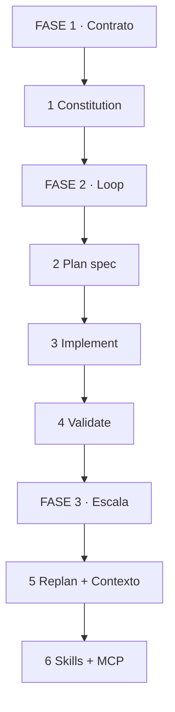
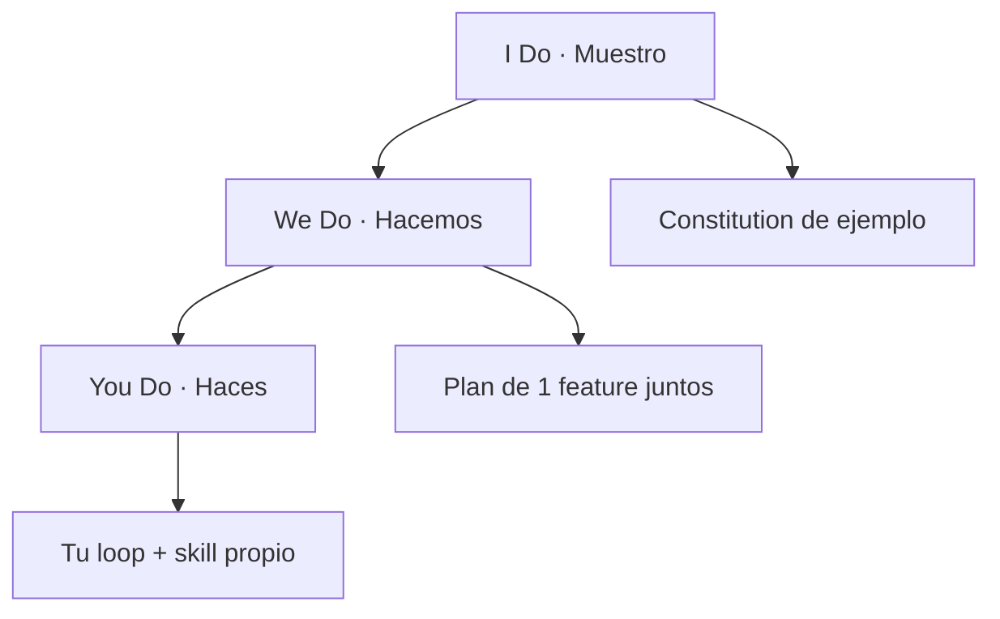
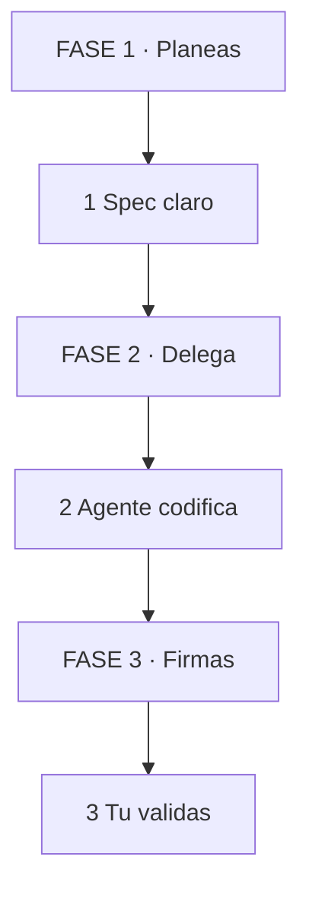

# MASTERCLASS: Spec-Driven Development — Adiós al Vibe Coding

## INTRODUCCIÓN: POR QUÉ EL PROMPT VAGO ROMPE PROYECTOS SERIOS

Vibe coding es pedir "hazme una app de tareas linda" y rezar.

SDD es otra cosa: defines un contrato técnico entre tú (arquitecto) y el agente (constructor). El agente escribe, tú verificas.

> **Objetivo** — Al final sabrás escribir una Constitution, correr el loop Plan → Implement → Validate y mantener contexto limpio entre features.

> **Advertencia** — Sin Constitution, cada feature te aleja del objetivo. Sin Validate humano, el agente inventa atajos.

*Curso base: Paul Everitt, JetBrains. Vibe vs SDD (0:00-5:40).*

---

## MAPA DEL WORKFLOW



*Cómo leerlo: Empiezas arriba con contrato, bajas al loop, cierras escalando. No es ciclo infinito, es espiral.*

| Fase | Qué logras | Habilidad |
|------|------------|-----------|
| **FASE 1 · Contrato** | Misión + stack + roadmap alineados | Escribir Constitution |
| **FASE 2 · Loop** | 1 feature espec → código → review | Ser senior architect |
| **FASE 3 · Escala** | Repetir sin decay + portar workflow | Replanear y automatizar |



---

## PARTE 1: CONSTITUTION — EL CEREBRO DEL PROYECTO (9:53-10:55)

**Analogía: constitución de un país vs promesas de campaña.**

El prompt es promesa. La Constitution es ley: misión, stack, roadmap. Todo feature nuevo debe obedecerla.

| Paso | Tú ves | Qué pasa dentro | Ejemplo |
|------|--------|-----------------|---------|
| **1. Misión** | 5 líneas | Define qué NO es el proyecto | "App tareas para equipos, no red social" |
| **2. Stack** | Tabla fija | Fija versiones y límites | "Python 3.12, Postgres, sin ORM mágico" |
| **3. Roadmap** | Lista viva | Ordena features por valor | "Auth → CRUD → Skills" |

Template copiar-pegar:

```markdown
# Constitution
## Mision
## Tech stack (versiones fijas)
## Roadmap (orden + done/criterio)
## Reglas (ej: ramas chicas, tests antes de merge)
```

> **📌 Idea clave** — Sin Constitution, el agente optimiza el prompt. Con ella, optimiza tu proyecto.

**Recall:** ¿Qué 3 bloques hacen que una Constitution sirva? (Misión + stack + roadmap vivo).

---

## PARTE 2: EL LOOP — PLAN → IMPLEMENT → VALIDATE (11:00-11:50)

**Analogía: arquitecto dibuja plano, obrero construye, inspector firma.**

Tú eres senior architect (11:34-12:00). Das contexto y firmas. El agente pica código.

| Paso | Tú ves | Agente hace | Ejemplo |
|------|--------|-------------|---------|
| **1. Plan** | Spec markdown detallado | Propone, tú corriges | `spec-auth.md` con endpoints + tests |
| **2. Implement** | Rama chica + código | Escribe solo lo del spec | 1 feature, 1 rama |
| **3. Validate** | Review + tests tuyos | No mergea solo | Corres tests, lees diff |



*Cómo leerlo: Tú arriba y abajo. El agente nunca firma solo.*

> **📌 Idea clave** — Plan malo = código malo. 20 min más de spec ahorran 2h de fix.

**Recall:** ¿Quién puede dar merge? (Solo tú tras Validate).

---

## PARTE 3: CONTEXTO LIMPIO — ANTI-DECAY (6:23-6:40, 36:16-36:40)

**Analogía: pizarrón chico y borrador a mano.**

Contexto largo = agente distraído. Ramas chicas + limpiar contexto entre tareas lo mantiene filoso.

| Regla | Tú haces | Por qué |
|-------|----------|---------|
| **Rama por feature** | 1 spec = 1 rama | Diff revisable en 15 min |
| **Limpia contexto** | Nueva tarea, chat nuevo | Evita context decay |
| **Spec corto** | <2 páginas | Lo largo se ignora |

> **📌 Idea clave** — Contexto es RAM cara. Bórralo sin culpa entre features.

---

## PARTE 4: REPLAN — DOCS VIVAS (11:08-11:17, 32:00-33:00)

Entre ciclos, actualizas Constitution + roadmap con lo aprendido.

| Cuándo | Qué actualizas | Ejemplo |
|--------|----------------|---------|
| Fin de feature | Roadmap: done + próximo | "Auth done, CRUD next" |
| Cambio requisito | Constitution: regla nueva | "Agrega: paginación obligatoria" |
| Deuda detectada | Nota técnica | "Migrar X antes de Y" |

> **📌 Idea clave** — Docs viejas = historia falsa. Replan de 10 min vale más que reunión de 1h.

---

## PARTE 5: SKILLS — EMPAQUETA LO REPETIBLE (33:36-35:00, 50:06-51:17)

**Analogía: de receta suelta a molde.**

Si validas o generas changelogs igual siempre, hazlo skill portable.

| Skill útil | Input | Output |
|------------|-------|--------|
| `validate` | Rama + spec | Reporte tests + diff check |
| `changelog` | Commits | CHANGELOG.md listo |
| `reverse-spec` | Código legacy | Constitution + roadmap (46:00-48:00) |

Legacy: pide al agente "reverse engineer" para generar Constitution desde código existente. SDD también sirve brownfield.

> **📌 Idea clave** — Lo que haces 3 veces igual, es un skill.

---

## PARTE 6: ESTÁNDARES — NO TE CASES CON LA HERRAMIENTA (57:07-59:20)

MCP (contexto) + ACP (cliente-agente) te dejan cambiar de agente o IDE sin perder workflow.

| Si usas | Puedes cambiar | Sin romper |
|---------|----------------|------------|
| MCP | Fuente de contexto | Specs y skills intactos |
| ACP | IDE / agente | Mismo loop Plan-Validate |

> **📌 Idea clave** — Tu activo es el workflow, no el botón del IDE.

---

## CHECKLIST FINAL

| Bloque | Check |
|--------|-------|
| Constitution | Misión + stack fijo + roadmap vivo |
| Loop | Spec → rama chica → Validate humano |
| Contexto | Chat nuevo por feature |
| Replan | Roadmap actualizado cada ciclo |
| Skills | 1 skill `validate` o `changelog` |
| Legacy | Si es brownfield, reverse-spec primero |
| Portabilidad | MCP/ACP antes que plugin propietario |

---

## Preguntas de Verificación 📝

1. **Contrasta**: Vibe coding vs SDD. ¿Qué cambia en tu rol? (0:00-5:40)
2. **Diseña**: Escribe Constitution de 1 página para tu proyecto real.
3. **Aplica**: Crea `spec-` de 1 feature con criterios de done testeables.
4. **Evalúa**: Tu agente deriva tras 3 features. ¿Qué 2 acciones anti-decay aplicas?
5. **Síntesis**: Tienes legacy sin docs. Describe reverse-spec en 4 pasos (46:00-48:00).
6. **Reflexión**: ¿Qué skill crearías primero y por qué te ahorra 2h/semana?

## GLOSARIO — CONCEPTOS PRINCIPALES

| Término | Definición en 1 línea |
|---------|-----------------------|
| **SDD** | Desarrollo guiado por specs como contrato con el agente |
| **Vibe coding** | Prompts vagos sin spec ni validación |
| **Constitution** | Misión + stack + roadmap, cerebro del proyecto |
| **Spec** | Markdown detallado de 1 feature antes de codificar |
| **Loop P-I-V** | Plan → Implement → Validate, ciclo repetible |
| **Human-in-the-loop** | Tú como arquitecto que verifica y firma |
| **Context decay** | Agente pierde foco por contexto largo y viejo |
| **Replan** | Actualizar docs entre ciclos para mantener verdad |
| **Skill** | Workflow repetible empaquetado y portable |
| **Brownfield** | Proyecto legacy que se documenta con reverse-spec |
| **MCP** | Estándar para dar contexto portable al agente |
| **ACP** | Estándar para cambiar IDE/agente sin romper flujo |

*Curso: Paul Everitt, JetBrains. Timestamps en cada parte.*
