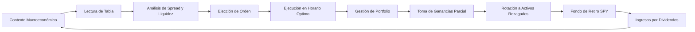

# MASTERCLASS: Trading en el Merval — Guía Práctica de Bolsa Argentina para Principiantes 📈🇦🇷

> 💡 **En esta master class aprenderás**: Cómo leer la tabla del panel líder, qué es el spread y por qué importa, cómo ejecutar órdenes límite como un pro, cómo armar un fondo de retiro con SPY, generar ingresos por dividendos y gestionar tu portfolio sin que las emociones te jueguen una mala pasada. Todo con ejemplos reales del mercado argentino.

> ⚠️ **Aviso educativo** — Esta guía es formativa. No constituye asesoramiento financiero personalizado. Invertir en acciones conlleva riesgos. Operá solo con dinero que estés dispuesto a perder.

---

## MAPA DEL WORKFLOW DE TRADING



---

## PARTE 1: EL CONTEXTO — INFLACIÓN VS MERCADO ACCIONARIO 📊💥

### 1.1 Por qué las acciones le ganan a la inflación en Argentina 🇦🇷

En el escenario actual, la inflación mensual se ubica entre el 1,9% y el 2,5%. Sin embargo, varias empresas del Panel Líder de la Bolsa Argentina (Merval) vienen logrando rendimientos que superan ese nivel con holgura.

```text
📊 DATOS DE FONDO:

  Inflación mensual: 1,9% — 2,5%
  Tasa plazo fijo: ~2,0% — 2,5% mensual
  Meta del Merval: Superar ambos números

  ¿Cómo lo logran las empresas?
  → Vaca Muerta (exportaciones en dólares)
  → Recomposición tarifaria (energía y utilities)
  → Flujos de caja en moneda dura
```

### 1.2 Acciones Líderes que Superan la Inflación

| 🏆 Acción | 🏢 Sector | 💡 Por Qué Gana a la Inflación |
| :--- | :--- | :--- |
| **PAMP** | Energía | Desarrollo de Vaca Muerta y exportaciones |
| **TGSU2** | Gas/Utilities | Recomposición tarifaria y volumen récord |
| **CEPU** | Energía | Generación térmica y renovable consolidada |
| **YPFD** | Petróleo | Shale oil en Vaca Muerta y crecimiento exportador |

### 1.3 La Fórmula del Mercado Local 🔢

```text
✅ COMPRESIÓN DE TASAS FIJAS:
   → Plazo fijo ~2,0% — 2,5% mensual
   → Renta variable con buenos flujos capta más capital

✅ CRECIMIENTO EN VOLUMEN DE NEGOCIOS:
   → Empresas exportadoras facturan en dólares
   → Utilities ajustan por cuadros tarifarios
   → No quedan desfasadas frente a la inflación
```

---

## PARTE 2: LA TABLA DE COTIZACIONES — APRENDE A LEERLA COMO UN PRO 📺🔍

Cuando entrás a Cocos Capital (o cualquier broker) y buscás una acción del panel líder, aparece una tabla con datos en tiempo real. Cada columna tiene un significado específico.

### 2.1 Significado de cada columna

| 📋 Columna | 📖 Significado | 💡 Ejemplo |
| :--- | :--- | :--- |
| **Especie** | Nombre de la empresa + ticker (abreviatura) | YPFD, PAMP, GGAL |
| **Último Precio** | Precio exacto de la última operación ejecutada | $5.645,00 |
| **Var %** | Variación % del día respecto al cierre anterior | +2,35% |
| **CC** | Cantidad de acciones que el comprador quiere adquirir al precio PC | 500 acciones |
| **PC** | Precio de Compra / Bid — oferta más alta para comprar | $3.067,50 |
| **PV** | Precio de Venta / Ask — oferta más baja para vender | $3.085,00 |
| **CV** | Cantidad de acciones que el vendedor ofrece al precio PV | 800 acciones |
| **Cierre** | Precio con el que finalizó la jornada anterior | $3.050,00 |
| **Min / Max** | Precio mínimo y máximo negociado hoy | $3.040 / $3.110 |
| **Total Oper** | Monto total operado en pesos en el día | $150.000.000 |
| **Oper** | Cantidad total de transacciones realizadas | 12.500 operaciones |

### 2.2 Ejemplo práctico — Mirando SUPV en tu pantalla

```text
📊 DATOS REALES DE SUPV:

  Especie:     SUPV (Supervielle)
  Último:      $3.076,50
  Var %:       +0,85%
  PC:          $3.067,50 (9.400 acciones en la punta compradora)
  PV:          $3.085,00 (9.440 acciones en la punta vendedora)
  Cierre:      $3.050,00
  Min/Max:     $3.055 / $3.092
  Total Oper:  +$290.000.000
  Oper:        +8.500 operaciones
```

---

## PARTE 3: LAS 3 COLUMNAS QUE MANDAN 🎯👑

No hay una sola columna mágica, pero tres dominan la toma de decisiones de trading.

### 3.1 PC y PV — Las más importantes para operar

| Columna | Para qué sirve | Cuándo la mirás |
| :--- | :--- | :--- |
| **PC (Bid)** | Si querés vender YA, mirás este precio | Venta inmediata |
| **PV (Ask)** | Si querés comprar YA, mirás este precio | Compra inmediata |

> [!TIP]
> 💡 **El Spread**: La diferencia entre PC y PV es el spread. Cuanto más chico, más eficiente y líquido es el activo. En acciones del Merval, un spread menor al 1% se considera muy bueno.

### 3.2 Total Oper / Oper — La más importante para medir liquidez

El volumen te dice cuánto interés real hay en la acción.

| 🧪 Caso | 📊 Volumen | 🎯 Interpretación |
| :--- | :--- | :--- |
| **YPFD** | $19.500 millones / 235.000 operaciones | Muy líquido → entrás y salís en segundos |
| **IRSA** | $110 millones / 45 operaciones | Poco líquido → podés quedar atrapado |

> [!IMPORTANT]
> 🛒 **Analogía**: Alto volumen = supermercado. Llegás, agarrás el producto y salís. Bajo volumen = feria de antigüedades. Si no le gusta tu precio al vendedor, te quedás con el producto yendo de boca en boca.

### 3.3 Var % — La más importante para el contexto

Te da el pulso inmediato del sentimiento del mercado.

```text
📊 LECTURA RÁPIDA:

  Var % positiva fuerte → Optimismo
  Var % negativa fuerte → Cautela o toma de ganancias
  Var % neutra → Mercado en consolidación
```

---

## PARTE 4: EL SPREAD — EL COSTO OCULTO QUE POCOS MIRAN 💰🔍

### 4.1 ¿Qué es el spread?

Es la brecha entre el precio más alto al que alguien quiere comprar (PC) y el más bajo al que alguien quiere vender (PV).

```text
📐 FÓRMULA:

  Spread = PV - PC
  Spread % = (PV - PC) / PV × 100
```

### 4.2 La analogía de la casa 🏠

> Imaginate que querés comprar un departamento. El dueño pide $100.000 USD (PV), pero la oferta más alta que recibió es de $80.000 USD (PC). Hay $20.000 de diferencia. Si decís "lo compro a lo que sea con tal de tenerlo ya", terminás pagando $100.000 cuando quizás podrías haber pagado $85.000 con una oferta inteligente.

### 4.3 Ejemplo real — Banco Macro (BMA)

```text
📊 DATOS DE BMA EN TU PANTALLA:

  PC: $14.150,00
  PV: $15.560,00
  Spread: $1.410 (~10%)

❌ EL ERROR:
  Comprás a mercado → pagás $15.560
  Vendés inmediatamente → te pagan $14.150
  Resultado: perdiste el 10% al instante

✅ LA SOLUCIÓN:
  Orden límite de compra en $14.500
  Esperás que el vendedor ceda
  Comprás más barato y sin sobreprecio
```

### 4.4 Tabla de spreads saludables

| 📊 Activo | 💰 Spread | 📈 Calificación | 🎯 Acción |
| :--- | :---: | :---: | :--- |
| **YPFD** | ~0,3% | 🟢 Excelente | Comprá tranquilo |
| **CEPU** | ~0,25% | 🟢 Excelente | Comprá tranquilo |
| **METR** | ~0,22% | 🟢 Excelente | Comprá tranquilo |
| **SUPV** | ~0,57% | 🟡 Bueno | Usar orden límite recomendada |
| **GGAL** | ~0,4% | 🟢 Excelente | Comprá tranquilo |

> [!WARNING]
> ⚠️ Si el spread es mayor al 1%, evitá comprar a "Precio de Mercado". Usá órdenes límite para no pagar sobreprecio.

---

## PARTE 5: ÓRDENES LÍMITE VS MERCADO — EL TRUCO DEL PV 🎯🛡️

### 5.1 La diferencia clave

| 🛠️ Tipo de Orden | 📖 Qué hace | ✅ Ventaja | ❌ Desventaja |
| :--- | :--- | :--- | :--- |
| **Mercado** | Compra/vende al precio disponible ahora | Ejecución inmediata | Podés pagar sobreprecio |
| **Límite** | Compra/vende solo a tu precio exacto | Control total del precio | Puede no ejecutarse |

### 5.2 El truco de la Orden Límite al PV 💡

Si querés comprar YA y asegurarte el precio exacto:

1. Seleccioná tipo de orden: **Límite**
2. En el casillero de precio, escribí el valor de la columna **PV** (Punta Vendedora)
3. Confirmá la orden

```text
📊 EJEMPLO CON SPY:

  PC: $19.700,00
  PV: $19.720,00

  Ponés orden límite en $19.720,00
  Le estás diciendo al broker:
  "Quiero comprar poniendo un límite máximo de $19.720,00"

  Como hay vendedores en $19.720,00, tu orden calza
  inmediatamente y se ejecuta al instante.
  PERO con la seguridad total de que jamás
  pagarás más de ese valor.
```

### 5.3 Paso a paso en Cocos Capital 📱

```text
📍 DÓNDE ESTÁ LA OPCIÓN:

  Panel lateral derecho → debajo de "Cedears aproximados"
  → Sección "Precio" con dos botones ovalados:
     • Mercado (azul, activo por defecto)
     • Límite (transparente, al lado)

🛠️ CÓMO ACTIVARLA:

  1. Hacé clic en "Límite" → se pinta de azul
  2. Se despliega un casillero para escribir el precio
  3. Escribí el precio de la PV (ej: 19720)
  4. Ingresá el monto o usá los botones 25%, 50%, 100%
  5. Clic en "Revisar Compra" y confirmar
```

---

## PARTE 6: LIQUIDEZ Y VOLUMEN — POR QUÉ IMPORTA TANTO 🛒🏪

### 6.1 La analogía del Supermercado vs la Feria

| 🏪 Tipo de Mercado | 📊 Volumen | 🛒 Analogía | 💡 Resultado |
| :--- | :--- | :--- | :--- |
| **Alto volumen** | Millones/día | Supermercado central | Entrás, comprás y salís en 2 minutos |
| **Bajo volumen** | Pocas operaciones | Feria de antigüedades | Para vender, o rebajás precio o te quedás con el producto |

### 6.2 Ejemplo real — YPFD vs IRSA

```text
📊 YPFD — LÍQUIDEZ EXCELENTE:
  Volumen: +$19.500 millones
  Operaciones: 235.000
  → Podés comprar/vender $5.000.000 en segundos
  → El precio no se mueve por tu operación

📊 IRSA — LIQUIDEZ BAJA:
  Volumen: $110 millones
  Operaciones: 45
  → Si querés mover mucho dinero, tardás horas
  → Podés forzar el precio si la orden es grande
```

> [!TIP]
> 💡 **Consejo práctico**: Priorizá siempre tickers de mayor volumen diario para asegurarte de que podés armar y desarmar tus posiciones cuando quieras, sin quedar atrapado.

---

## PARTE 7: HORARIO IDEAL — CUÁNDO COMPRAR Y VENDER ⏰🕐

El horario en el que operás influye directamente en la liquidez y los spreads.

### 7.1 La Ventana Ideal

```text
⏰ MEJOR FRANJA: 12:30 — 16:30 hs

  Apertura de Wall Street (10:30 hs NY):
  → A partir de las 12:00 hs, el mercado estadounidense
    ya absorbió las noticias del inicio de jornada
  → Opera a pleno rendimiento

  Mayor liquidez:
  → Más volumen → spreads más chicos
  → Comprás más barato, vendés a mejor precio

  Estabilidad del Dólar CCL:
  → El tipo de cambio implícito se estabiliza
  → Evitás pagar un dólar "caro" por volatilidad
```

### 7.2 Horarios a Evitar 🚫

| ⏰ Horario | 🚨 Problema |
| :--- | :--- |
| **11:00 — 12:00 hs** | Apertura local, spreads abiertos, poca liquidez |
| **16:30 — 17:00 hs** | Cierre de mercado, algoritmos cierran posiciones, volatilidad impredecible |

```text
✅ RESUMEN DE EJECUCIÓN:

  Horario ideal: 13:00 — 15:30 hs
  Compra: Orden límite al PV
  Venta: Orden límite al PC
```

---

## PARTE 8: GESTIÓN DE PORTFOLIO — NO PONGAS TODOS LOS HUEVOS EN LA MISMA CANASTA 🥚🧺

### 8.1 El riesgo de la concentración

Uno de los errores más comunes es concentrar demasiado capital en una sola acción.

```text
📊 EJEMPLO REAL — TU CARTERA:

  PAMP (Pampa Energía): 50,51% de la cartera total
  → Aunque es una empresa excepcional...
  → Si el sector energético tiene una baja temporal...
  → Tu patrimonio sufre un golpe directo del 50%

  Diversificación actual:
  → Bancos: SUPV, BBAR
  → Energía: PAMP, METR, CEPU, TGSU2, YPFD
  → Utilities: CEPU, METR
  → CEDEARs: SPY, GOOGL
  → Bonos: AL30, GD38, GD35
```

### 8.2 Toma de ganancias parcial — La estrategia correcta 📈

No se trata de vender todo cuando una acción subió, sino de tomar ganancias parciales para rebalancear.

| 🎯 Acción | 📊 Ganancia | 💡 Acción Sugerida |
| :--- | :--- | :--- |
| **PAMP** | +17,13% | Vender 20-30% y redistribuir |
| **BBAR** | +115,14% | Posición chica, dejarla correr |
| **TGSU2** | +104,43% | Posición chica, dejarla correr |
| **METR/CEPU** | Neutrales | Esperar, recién ingresadas |

> [!IMPORTANT]
> 🎯 **Regla de oro**: Nunca vendas el 100% si la tendencia sigue siendo alcista. Vendi entre el 20% y el 30% de la posición y redistribuí hacia activos más diversificados.

### 8.3 Ejemplo de toma de ganancias en tu cartera

```text
📊 TU MOVIMIENTO DE HOY:

  Vendiste 20 acciones de PAMP a $5.560,00
  → Aseguraste $111.200 en efectivo
  → Bajaste el riesgo de concentración

  Reinvertiste en:
  → SUPV: 9 acciones (~$27.712)
  → METR: 9 acciones (~$19.755)
  → CEPU: 8 acciones (~$19.128)

  Resultado:
  → Capital protegido en tres sectores distintos
  → Portfolio más balanceado y resiliente
```

---

## PARTE 9: ACCIONES BARATAS CON SPREAD BAJO Y POTENCIAL 🔍💎

### 9.1 Criterios de selección

Para encontrar acciones "como SUPV" — baratas, con spread bajo y potencial de suba:

```text
✅ CHECKLIST DE BÚSQUEDA:

  □ Spread < 1% (operación eficiente)
  □ Volumen alto (liquidez asegurada)
  □ Precio rezagado respecto a pares del sector
  □ Fundamentos sólidos (baja deuda, crecimiento)
  □ Catalizador cercano (tarifas, regulación, exports)
```

### 9.2 Tres candidatos actuales

#### 🏦 BBVA Argentina (BBAR) — Sector Bancario

```text
📊 Datos actuales:
  PC: $10.060,00 | PV: $10.100,00
  Spread: ~$40,00 (0,39%)
  Volumen: +$290 millones

💡 Por qué es como SUPV:
  → Otro banco del panel líder
  → Cotiza a múltiplo atractivo sobre valor de libro
  → Rezagado respecto a GGAL y BMA
  → Si el crédito privado acelera, es el de mayor beta
```

#### 🔥 Metrogas (METR) — Utilities / Distribuidora de Gas

```text
📊 Datos actuales:
  PC: $2.190,00 | PV: $2.195,00
  Spread: ¡Solo $5,00! (~0,22%)
  Volumen: +$87 millones

💡 Por qué es como SUPV:
  → Sector energético con precios atrasados
  → Spread ultra ajustado (de los mejores del panel)
  → Catalizador: actualización de cuadros tarifarios
```

#### ⚡ Central Puerto (CEPU) — Generación de Energía

```text
📊 Datos actuales:
  PC: $2.382,00 | PV: $2.393,00
  Spread: ~$11,00 (0,46%)
  Volumen: +$126 millones
  Var %: -1,11% (corrección del día)

💡 Por qué es como SUPV:
  → Empresa ultra sólida con corrección puntual
  → Mejor punto de entrada con descuento
  → Múltiplos EV/EBITDA: 5,5x — 6,0x
  → Deuda neta/EBITDA: ~0,5x (muy sana)
```

### 9.3 Tabla comparativa rápida

| 🏷️ Acción | 🏢 Sector | 📊 Spread | 📈 Perfil |
| :--- | :--- | :---: | :--- |
| **BBAR** | Bancos | 0,39% | Rezagada, tesis de crédito y consumo |
| **METR** | Gas/Servicios | 0,22% | Tesis de recomposición tarifaria |
| **CEPU** | Energía | 0,46% | Oferta por corrección del día |

```text
💡 TIP DE EJECUCIÓN:
  Con spreads < 0,5%, podés poner orden límite
  al precio del PV para ejecutar en el acto sin sobreprecio.
```

---

## PARTE 10: ESTRATEGIA DE ROTACIÓN — GIRAR LA RUEDA 🔄🎡

### 10.1 El concepto

La rotación de activos consiste en vender lo que ya subió y comprar activos rezagados con potencial.

```text
🔄 CICLO DE LA RUEDA:

  1. Identificás un activo con ganancia acumulada (+15% a +25%)
  2. Vendés 20-30% de esa posición
  3. Reinvertís en activos baratos con spread bajo
  4. Repetís el ciclo
```

### 10.2 Tu ejemplo real

```text
📊 TU ROTACIÓN DE HOY:

  VENTA (Ganador):
  → PAMP: 20 acciones a $5.560,00
  → Asegurado: $111.200 ARS
  → Motivo: Concentración alta del 50% en cartera

  COMPRAS (Rezagados):
  → SUPV: 9 acciones (~$27.712)
  → METR: 9 acciones (~$19.755)
  → CEPU: 8 acciones (~$19.128)

  RESULTADO:
  → Capital redistribuido en 3 sectores distintos
  → Riesgo diluido
  → Potencial de suba diversificado
```

### 10.3 Reglas para que la rueda gire bien 🎯

| 📋 Paso | 📖 Regla |
| :--- | :--- |
| **1. Definí objetivos** | Take Profit entre 15% y 25% de ganancia |
| **2. Vendé parcial** | Solo 20-30%, nunca el 100% |
| **3. Tené el radar** | Antes de vender, ya sabés a dónde va el dinero |
| **4. Cuidá los costos** | La ganancia debe justificar la comisión de rotación |
| **5. Diversificá** | Reinvertí en sectores distintos |

---

## PARTE 11: FONDO DE RETIRO CON S&P 500 (SPY) — EL ARMA SECRETA 🛡️📈

### 11.1 Por qué el S&P 500 es el "rey" para el retiro 👑

```text
🏆 RAZONES:

  → Rendimiento histórico: 8% — 10% anual en dólares
  → Diversificación automática: 500 empresas en 1 compra
  → Autolimpieza cíclica: las empresas malas salen, entran las buenas
  → Protección en dólares: aísla de la devaluación del peso
```

### 11.2 Cómo invertir desde Argentina 🇦🇷

No necesitás cuenta en el exterior. Lo hacés desde tu broker con el CEDEAR del ETF:

| 🏷️ Ticker | 🏢 Activo | 💡 Acceso |
| :--- | :--- | :--- |
| **SPY** | S&P 500 ETF | Compra directa en pesos desde broker argentino |

### 11.3 La estrategia clave: DCA + Interés Compuesto 📅

```text
📐 DCA (DOLLAR-COST AVERAGING):

  → Aportes periódicos fijos (ej: cada mes)
  → Sin importar si el mercado sube o baja
  → Promediás un excelente precio de entrada

💰 INTERÉS COMPUESTO (BOLA DE NIEVE):

  Mes 1:  Comprás 10 nominales de SPY
  Mes 2:  Comprás 10 nominales de SPY
  Mes 3:  Los dividendos te alcanzan para 1 nominal extra
  ...
  Año 10: Los dividendos te alcanzan para 5 nominales extra
  → La bola de nieve se hace gigante sola
```

### 11.4 Tu plan paso a paso para hoy 🗓️

```text
✅ PASO 1: Definí el monto
  → Ejemplo: 10% de tu sueldo mensual

✅ PASO 2: Transferí a tu broker
  → Cocos Capital / IOL / Balanz

✅ PASO 3: Comprá SPY
  → Tipo de orden: Límite
  → Precio: al PV (Punta Vendedora)
  → Ejecutá y listo

✅ PASO 4: Guardalo bajo llave
  → No es para mirar todos los días
  → Horizonte: 10, 20 o más años
```

> [!TIP]
> 💡 **Consejo de Warren Buffett**: "El mejor momento para invertir fue hace 20 años. El segundo mejor momento es hoy." Cualquier día es un excelente día para empezar tu fondo de retiro.

---

## PARTE 12: INGRESOS POR DIVIDENDOS — CREÁ TU PROPIO SUELDO 💵📅

### 12.1 Qué es la estrategia de dividendos 🎯

En lugar de buscar ganancia solo por diferencia de precio, invertís en empresas que distribuyen parte de sus ganancias a accionistas de forma periódica.

```text
📊 TIPOS DE DIVIDENDOS:

  📅 Mensual:    Realty Income (O) — REIT inmobiliario
  📅 Trimestral: KO (Coca-Cola), JNJ (Johnson & Johnson)
  📅 Semestral:  Bancos argentinos (BBAR, BMA)
```

### 12.2 Cómo armar un calendario de cobro continuo 📆

Para recibir ingresos todos los meses, armá una cartera diversificada con fechas rotativas:

| 📅 Mes | 🏢 Empresas Sugeridas |
| :--- | :--- |
| **Enero / Abril / Julio / Octubre** | KO (Coca-Cola), JPM (JPMorgan) |
| **Febrero / Mayo / Agosto / Noviembre** | PG (Procter & Gamble), AAPL (Apple) |
| **Marzo / Junio / Septiembre / Diciembre** | JNJ (Johnson & Johnson), XOM (ExxonMobil) |
| **Todos los meses** | O (Realty Income) |

### 12.3 Acciones argentinas con buen historial de dividendos 🇦🇷

| 🏷️ Acción | 🏢 Sector | 💡 Por Qué Paga Bien |
| :--- | :--- | :--- |
| **TGNO4** | Gas/Utilities | Ingresos regulados y crecientes |
| **BBAR** | Bancos | Rentabilidad recuperada |
| **BMA** | Bancos | Dividendos importantes con autorización regulatoria |
| **TXAR** | Siderurgia | Liquidez acumulada en balances |

### 12.4 Reglas de oro de los dividendos 👑

```text
📅 ATENCIÓN A LA FECHA EX-DIVIDEND:
  → Comprá 1-2 días hábiles ANTES de la fecha de corte
  → Si comprás el mismo día de la distribución, no cobrás

🔄 REINVERTIR (EFECTO BOLA DE NIEVE):
  → Los dividendos los usás para comprar más acciones
  → Cuantas más acciones, más dividendos cobrás
  → El interés compuesto hace el trabajo solo

📊 DIVIDEND YIELD:
  → Buscá rendimientos sostenibles de 3% — 6% anual en USD
  → Ojo con yields muy altos: pueden ser "trampas de valor"
```

---

## PARTE 13: CHECKLIST PRE-COMPRA — 4 PREGUNTAS CLAVE ✅📋

Antes de hacer clic en "Comprar", asegurate de responder estas 4 preguntas:

| # | ❓ Pregunta | 📖 Qué debés evaluar |
| :---: | :--- | :--- |
| **1** | ¿Qué hace la empresa? | Entendé su negocio y cómo gana dinero |
| **2** | ¿Tiene balances sanos? | Deuda bajo control, ganancias crecientes |
| **3** | ¿Está cara o barata? | Margen de suba, valuation vs pares |
| **4** | ¿Hay liquidez? | Volumen alto y spread bajo en la pantalla |

```text
✅ EJEMPLO DE EVALUACIÓN RÁPIDA:

  Acción: CEPU (Central Puerto)
  1. Negocio: Generación de energía (térmica, renovable) ✓
  2. Balances: Deuda neta/EBITDA ~0,5x, Flujo de caja positivo ✓
  3. Precio: Múltiplo EV/EBITDA 5,5x — 6,0x vs pares ✓
  4. Pantalla: Spread 0,46%, volumen $126M ✓
  
  → VEREDICTO: Se puede comprar con confianza
```

---

## PARTE 14: ERRORES COMUNES Y PSICOLOGÍA DEL TRADER 🚫🧠

### 14.1 Los 10 errores que todos cometen (y vos no vas a cometer)

| ❌ Error | 📖 Por Qué Pasa | ✅ Cómo Evitarlo |
| :--- | :--- | :--- |
| **Poner toda la plata de una vez** | Ansiedad por ganar rápido | DCA: invertí monto fijo cada mes |
| **Seguir gurús de redes** | Falta de confianza propia | Backtesteá vos, no copies señales |
| **Operar con emociones** | Miedo y avaricia | Tené un plan escrito, seguilo |
| **No tener estrategia de salida** | Esperar el "momento perfecto" | Definí take profit y stop loss antes |
| **No diversificar** | "Esta acción es la mejor" | No más del 20-25% en un solo activo |
| **Mirar el precio todo el día** | Ansiedad | Revisá 1-2 veces por semana |
| **Usar dinero que no tenés** | Desesperación | Solo invertí lo que podés perder |
| **Creer en señales garantizadas** | Greed | Si fuera tan fácil, todos serían millonarios |
| **No aprender de errores** | Orgullo | Llevá un diario de trading |
| **Quererse hacer rico rápido** | Mentalidad de casino | Pensá en años, no en días |

### 14.2 Psicología: El 20% técnica, 80% mente 🧠

```text
😱 MIEDO: "¡Baja! ¡Vendo todo!"
  → Vendés en el peor momento

🤑 AVARICIA: "¡Sigue subiendo! ¡Comprá más!"
  → Comprás en el pico

😡 VENGANZA: "¡Perdí! ¡Voy a recuperar!"
  → Perdés más

😰 FOMO: "¡Todos ganan menos yo!"
  → Comprás sin pensar, sin análisis

🧠 CALMA: "El mercado sube y baja. Tengo un plan."
  → Tomás decisiones racionales
  → El profesional espera el setup perfecto
```

> [!WARNING]
> ⚠️ **El 90% de traders principiantes pierde dinero.** No porque el mercado sea imposible, sino porque dejan que las emociones comandén. Si controlás tu mente, ya estás por encima de la mayoría.

---

## GLOSARIO RÁPIDO 📖🔤

| 📙 Término | 📖 Definición |
| :--- | :--- |
| **📈 Acción** | Pedacito de una empresa que podés comprar |
| **📊 Merval** | Índice de acciones argentinas del panel líder |
| **💱 CEDEAR** | Certificado argentino que replica acciones extranjeras |
| **🛒 Spread** | Diferencia entre precio de compra y venta |
| **📉 Volatilidad** | Qué tanto sube y baja el precio |
| **💰 Dividendo** | Parte de las ganancias que la empresa reparte |
| **📊 DCA** | Comprar cantidad fija cada período, sin importar precio |
| **🎯 Take Profit** | Precio objetivo para tomar ganancias |
| **🛑 Stop Loss** | Precio límite para cortar pérdidas |
| **📈 Bull Market** | Mercado alcista (todo sube) |
| **📉 Bear Market** | Mercado bajista (todo baja) |
| **💵 Ganancia no realizada** | Ganancia en papel, no en tu bolsillo |
| **💵 Ganancia realizada** | Ganancia cuando vendés y entra plata a tu cuenta |
| **🏦 Broker** | Plataforma intermediaria para comprar/vender activos |
| **📊 Liquidez** | Qué tan fácil es entrar y salir de una posición |

---

## RECURSOS RECOMENDADOS 📚🌟

### 📚 Libros para profundizar

| 📖 Libro | 👤 Autor | 💡 Qué aprendés |
| :--- | :--- | :--- |
| **Padre Rico, Padre Pobre** | Robert Kiyosaki | Mentalidad financiera básica |
| **El Inversor Inteligente** | Benjamin Graham | Value investing y seguridad |
| **Un Paso por Delante de Wall Street** | Peter Lynch | Cómo elegir acciones |
| **Trading in the Zone** | Mark Douglas | Psicología del trading |
| **Los Secretos de la Mente Millonaria** | T. Harv Eker | Psicología del dinero |

### 🌐 Recursos Online

| 🌐 Recurso | 📋 Para qué |
| :--- | :--- |
| **Cocos Capital** | Broker principal para CEDEARs y acciones argentinas |
| **TradingView** | Gráficos y análisis técnico |
| **Bolsa de Buenos Aires (BYMA)** | Datos oficiales del Merval |
| **Investopedia** | Diccionario financiero completo |
| **r/merval (Reddit)** | Comunidad argentina de inversiones |

### 📱 Apps recomendadas

| 📱 App | 📋 Para qué | 💰 Costo |
| :--- | :--- | :---: |
| **Cocos Capital** | CEDEARs sin comisión | Gratis |
| **IOL / Balanz** | Acciones y CEDEARs | Gratis |
| **TradingView** | Gráficos profesionales | Gratis/Freemium |
| **Bel o / Lemon** | Crypto para principiantes | Gratis |
| **Google Sheets** | Registrar operaciones y portfolio | Gratis |

---

## TABLA RESUMEN — LOS 15 CONCEPTOS CLAVE 📋✨

| # | 🧠 Concepto | 💡 Acción Inmediata |
| :---: | :--- | :--- |
| **1** | El spread es el costo oculto | Nunca compres a mercado con spread alto |
| **2** | Orden límite al PV = compra segura | Usala siempre que el spread sea < 1% |
| **3** | Volumen alto = liquidez | Priorizá YPFD, GGAL, CEPU, BBAR |
| **4** | Horario 12:30-16:30 hs = mejor liquidez | Concentrá operaciones en esa franja |
| **5** | No concentres más del 25% en una acción | Rotá ganancias, diversificá riesgo |
| **6** | Toma de ganancias parcial (20-30%) | Vendé cuando supere 15-25% de ganancia |
| **7** | SPY = fondo de retiro núcleo | DCA mensual, horizonte largo plazo |
| **8** | Dividendos = ingresos pasivos | Reinvirtilos para interés compuesto |
| **9** | Check de 4 preguntas antes de comprar | Negocio, balances, precio, liquidez |
| **10** | Psicología > Técnica | Controlá emociones, seguí tu plan |
| **11** | DCA reduce riesgo de timing | No intentes adivinar el mercado |
| **12** | No uses dinero prestado | Solo invertí lo que podés perder |
| **13** | Llevá un registro de operaciones | Sin registro, no hay mejora posible |
| **14** | Si no podés explicar el negocio en 1 oración, no lo compres | Entendé qué estás comprando |
| **15** | Paciencia = superpoder | Pensá en años, no en días |

---

## PREGUNTAS DE VERIFICACIÓN 📝

Responde cada pregunta basándote en los conceptos de esta master class:

1. **Aplica**: Si una acción tiene un spread del 8%, ¿qué tipo de orden usarías y por qué?
2. **Analiza**: Tu cartera tiene 55% en PAMP. ¿Qué harías y por qué?
3. **Diseña**: Armá un calendario de dividendos para recibir ingresos todos los meses.
4. **Calcula**: Comprás SPY a PV $19.720. El spread es $20. ¿Qué porcentaje representa?
5. **Reflexiona**: ¿Por qué es importante el horario 12:30-16:30 para ejecutar órdenes?
6. **Conecta**: ¿Cómo se relacionan la toma de ganancias parciales y la estrategia de rotación?
7. **Propón**: Diseñá un plan DCA de 12 meses para tu fondo de retiro.
8. **Evalúa**: Tenés $100.000. ¿En qué activos los distribuirías para diversificar?
9. **Síntesis**: Explica por qué las acciones argentinas le ganan a la inflación en el contexto actual.
10. **Reflexión final**: ¿Cuál de los 14 capítulos considerás más crítico para no perder dinero? Justificá.

---

## ÚLTIMO CONSEJO 🏆

> La diferencia entre un inversor y un apostador no es la inteligencia. Es el **registro**. Si llevás un diario de operaciones, conocés tus errores, los corregís y seguís un plan escrito, ya estás por encima del 90% de quienes operan por impulso.
>
> **Tu yo del futuro te lo va a agradecer.** 📈🚀

---

*Última actualización: Julio 2026 — Contenido adaptado para inversores argentinos principiantes.*
