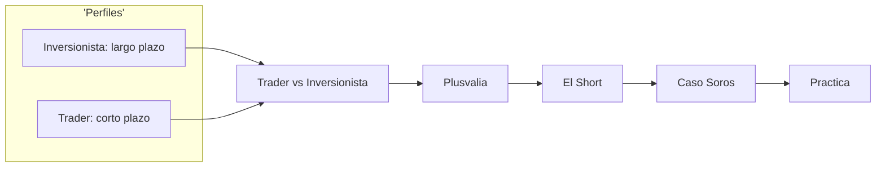
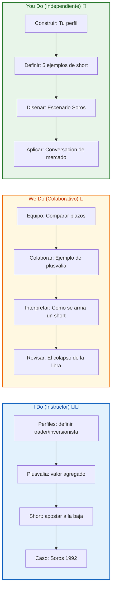
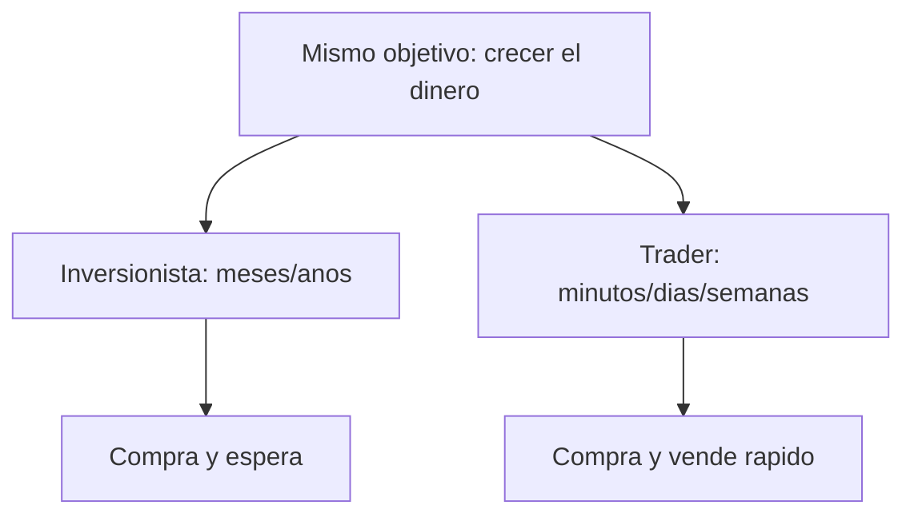
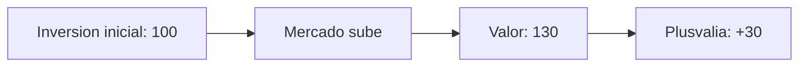
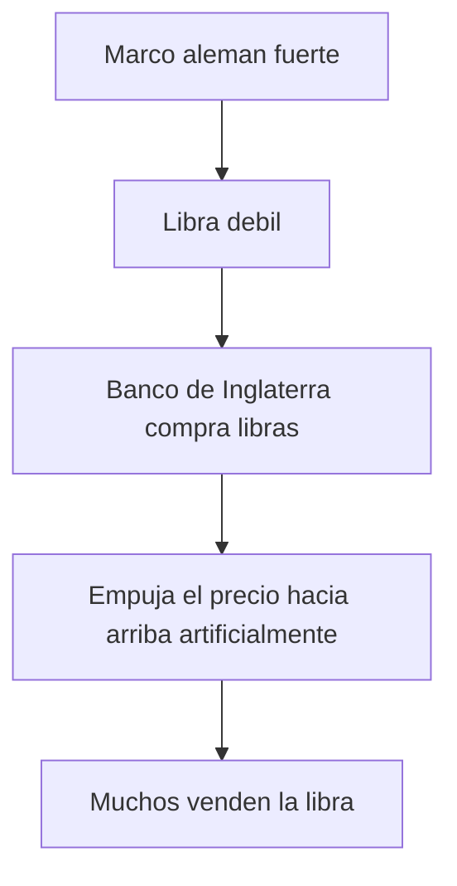
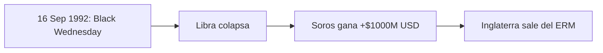

# MASTERCLASS: Trader vs Inversionista y el Short — El Hombre que Rompió el Banco de Inglaterra 💹🏦

## INTRODUCCIÓN: POR QUÉ ESTE MASTERCLASS ES DIFERENTE 🚀

El mundo del dinero 💰 usa palabras que suenan igual pero son distintas 🤔. **Trader** e **inversionista** persiguen lo mismo —hacer crecer el dinero— 📈 pero lo logran de formas opuestas. Y luego está el concepto que asusta a medio mundo 🌪️: el **short** (apostar a que algo baje).

Este masterclass propone otro camino: en vez de repetir frases de noticiero 📺, vas a entender el **motor del mercado** 🧠. Qué busca cada perfil, qué es la plusvalía, cómo funciona un short y por qué George Soros pudo ganar más de **$1.000 millones USD** apostando en contra de la libra esterlina.

La meta no es volverte millonario mañana. La meta es **entender las reglas del juego antes de sentarte a la mesa** 💡.

> **Objetivo de Aprendizaje** 🎯 — Al final de esta guía, podrás diferenciar trader de inversionista, explicar la plusvalía, definir un short con ejemplos y narrar el caso Soros vs Banco de Inglaterra.

> **Advertencia educativa** ⚠️ — Este contenido es formativo. No es consejo financiero. Operar y hacer short conlleva riesgo de pérdida total. Estudia antes de invertir.

---

## MAPA DEL WORKFLOW 🗺️



| Fase | Pregunta que responde | Output principal |
|------|-----------------------|------------------|
| **Perfiles** | ¿Trader o inversionista? | Diferencia de enfoque |
| **Plusvalía** | ¿De dónde viene la ganancia? | Valor agregado a la inversión |
| **Short** | ¿Cómo gano si baja? | Apostar en contra |
| **Soros** | ¿Caso real de short? | Libra esterlina 1992 |
| **Práctica** | ¿Lo domino? | Ejercicios y decisiones |



---

## PARTE 1: TRADER VS INVERSIONISTA — EL MISMO OBJETIVO, DISTINTO CAMINO 🛤️

### 1.1 Principio Central 💡

El **trader** busca lo mismo que el **inversionista**: hacer crecer su dinero 💰. Pero eso NO significa que exista un "trader puro" separado del inversionista. Ambos buscan lo mismo; cambia el **tiempo** y la **estrategia**.



### 1.2 La gran diferencia ⚖️📊

| Aspecto | 🏦 Inversionista | ⚡ Trader |
|---------|------------------|-----------|
| **Horizonte** | Largo plazo (años) | Corto plazo (minutos a semanas) |
| **Estrategia** | Comprar y mantener | Comprar y vender rápido |
| **Análisis** | Fundamentos de la empresa | Precio, tendencia, momentum |
| **Emoción** | Baja (paciencia) | Alta (velocidad) |
| **Ejemplo** | Acciones para el retiro | Forex intradía |

> **Tip del profe** 🧠 — El inversionista planta un árbol 🌳 y espera. El trader pesca 🎣 y lanza la caña muchas veces al día. Ambos quieren pescar algo, pero el trader lo hace en movimiento.

### 1.3 ¿Existe el "trader puro"? 🤔

> **Concepto clave** ✅ — El trader busca lo mismo que el inversionista, **pero eso quiere decir que no hay trader puro**. Todo trader, al operar, está invirtiendo en algo. La diferencia está en el **tiempo de permanencia**, no en el objetivo.

---

## PARTE 2: LA PLUSVALÍA — EL VALOR QUE CRECE 📈

### 2.1 Qué es la plusvalía 🌟

Los **inversionistas** buscan agregar una **plusvalía**: un valor agregado a su inversión inicial 🪴. Si compras algo a 100 y lo vendes a 130, esa ganancia de 30 es tu plusvalía.



| Término | Significado |
|---------|-------------|
| **Inversión inicial** | Lo que pusiste al inicio |
| **Plusvalía** | Lo que ganó ese valor con el tiempo |
| **Realizada** | Ya vendiste y cobraste la ganancia |
| **No realizada** | El valor subió pero aún no vendes |

> **Tip** 💡 — La plusvalía es "papel" hasta que vendes. Hasta entonces es una ganancia **potencial**, no real.

### 2.2 Ejemplo paso a paso 🔧💵

Compras 10 acciones a $10 cada una = $100 💵.

- El precio sube a $13 → tu posición vale $130.
- **Plusvalía** = $130 − $100 = **+$30** 🎉.

```text
Inversion: 100
Valor actual: 130
Plusvalia: +30  (ganancia de valor agregado)
```

---

## PARTE 3: EL SHORT — APOSTAR A QUE BAJE 📉🔥

### 3.1 Qué es un short 🧩

Un trader puede apostar que el mercado **va a subir** 📈 o que **va a bajar** 📉 (que algo va a perder valor). A esto último se le conoce como un **short** (posición corta o "en corto").


> **Definición simple** ✅ — El **shorting** es apostar **en contra de** algo: apostar a que una moneda o activo va a perder mucho de su valor y así generar una ganancia con esa caída.

### 3.2 ¿Cómo funciona técnicamente? 🔧📊

En el short "clásico" (acciones) el mecanismo es:

1. 🤝 Pides prestado el activo (ej. 1 acción) a un broker.
2. 💱 Vendes lo que pedaste prestado a precio actual.
3. ⏳ Esperas a que el precio baje.
4. 🛒 Compras de vuelta más barato para devolverlo.
5. 💰 La diferencia (precio alto − precio bajo) es tu ganancia.

| Paso | Acción | Resultado si baja |
|------|--------|-------------------|
| Vendo prestado a $100 | Ingreso $100 | — |
| Compro a $70 para devolver | Pago $70 | **Gano $30** ✅ |
| Compro a $120 para devolver | Pago $120 | **Pierdo $20** ❌ |

> **Trampa mortal** 💀 — En una compra normal tu pérdida máxima es lo que pusiste (el precio no baja de 0). En un **short**, si el precio SUBE, la pérdida es **ilimitada** 📈💥. Por eso el short es más peligroso.

### 3.3 Ejemplo de short en monedas 💱

Crees que la moneda X perderá valor frente al dólar:

- Haces short de X a 1.00.
- X cae a 0.80.
- Ganancia = 1.00 − 0.80 = **0.20 por unidad** 💵.

```text
Short de X a 1.00 -> cae a 0.80 -> GANancia 0.20
```

---

## PARTE 4: GEORGE SOROS — EL HOMBRE QUE ROMPIÓ EL BANCO DE INGLATERRA 🏦💣

### 4.1 El escenario 🌍💣

A principios de los 90, en Europa pasaba algo extraño:

- 💪 El **marco alemán** estaba tomando mucha fuerza.
- 📉 La **libra esterlina** estaba disminuyendo su valor.
- 🏦 El **Banco de Inglaterra** trataba de **forzar** a que la moneda mantuviera su valor (comprándola y empujándola hacia arriba).



> **Tip** 💡 — Inglaterra estaba en el **Mecanismo de Tipos de Cambio Europeo (ERM)**, que obligaba a mantener la libra dentro de un rango. Eso la hacía vulnerable.

### 4.2 El plan de Soros 🧠

Mientras el Banco de Inglaterra empujaba la libra hacia arriba, **George Soros** planeó lo que se conoce como un **short** masivo en contra de la moneda inglesa 🎯.

- Soros **hizo short** de la libra esterlina.
- Su nivel de apuesta fue tan grande que el resto del mercado colapsó.
- El Banco de Inglaterra se vio **forzado a dejar de empujar hacia arriba** la moneda.

> **Concepto clave** ✅ — Un short grande puede crear una **profecía autocumplida**: al vender masivamente, otros venden, el precio cae y el que shorté gana.

### 4.3 El Miércoles Negro 🖤

El resultado fue que el **16 de septiembre de 1992** (el **Miércoles Negro** o *Black Wednesday*), la caída del precio en este mercado forex hizo que todos los que apostaron en contra de la libra esterlina **ganaran mucho dinero** 💰.



| Dato | Valor |
|------|-------|
| 📅 Fecha | 16 de septiembre de 1992 |
| 🏷️ Nombre | Miércoles Negro (Black Wednesday) |
| 💵 Ganancia de Soros | Poco más de **$1.000 millones USD** |
| 🏦 Resultado | El Banco de Inglaterra dejó de defender la libra |

> **Dato curioso** 🔥 — Soros no "rompió" el banco con violencia: usó el mercado. Al apostar en contra con tal tamaño, forzó al banco a rendirse. Por eso el apodo: *"el hombre que rompió el Banco de Inglaterra"*.

### 4.4 ¿Por qué funcionó? 🤔🎯

| Factor | Explicación |
|--------|-------------|
| 💪 Marco fuerte | Alemania dominaba la economía europea |
| 📉 Libra débil | Reino Unido tenía problemas internos |
| 🏦 Banco forzando | Defender un precio artificial cuesta dinero |
| 🎯 Short enorme | Soros apostó tanto que hundió la estrategia |
| 🏳️ Rendición | Inglaterra salió del ERM y dejó caer la libra |

---

## PARTE 5: TRAMPA COMÚN — NO CAIGAS 💀🚫

### 5.1 Errores que te delatan como principiante 🚫⚠️

| Error ❌ | Correcto ✅ |
|---------|-------------|
| "Trader e inversionista son opuestos" | Persiguen lo mismo, cambia el plazo |
| Creer que short = siempre seguro | El short tiene pérdida ilimitada |
| Confundir plusvalía realizada/no real | Solo cuentan al vender |
| Pensar que Soros usó magia | Usó tamaño + debilidad del banco |
| Creer que el Banco siempre gana | El mercado puede vencer al banco |

---

## PARTE 6: I DO / WE DO / YOU DO — EJERCICIOS PROGRESIVOS 🏋️

### 6.1 I Do — Diferenciar perfiles 👨‍🏫

**Objetivo:** explicar trader vs inversionista.

| Paso | Acción | Resultado |
|------|--------|-----------|
| 1 | Mismo objetivo | crecer dinero |
| 2 | Diferencia de plazo | largo vs corto |
| 3 | Estrategia | mantener vs mover |
| 4 | Conclusión | no hay trader puro |

**Interpretación guiada:**
- Si dudas, recuerda: 🌳 árbol = inversionista, 🎣 caña = trader.
- Ambos pescan lo mismo.

### 6.2 We Do — Ejemplo de plusvalía 🤝

**Escenario:** compraste 5 acciones a $20.

| Decisión | Valor | Plusvalía |
|----------|-------|-----------|
| Compra | $100 | 0 |
| Sube a $25 | $125 | +$25 |
| Vendes | cobras $125 | **realizada** ✅ |

### 6.3 You Do — Tus 5 ejemplos de short 💪

**Tarea:** escribe 5 situaciones donde harías un short.

| # | Activo | Por qué crees que baja |
|---|--------|------------------------|
| 1 | ____ | ____ |
| 2 | ____ | ____ |

Criterios:

| Criterio | Peso |
|----------|------|
| Lógica del short | 50% |
| Riesgo considerado | 30% |
| Claridad | 20% |

### 6.4 I Do — El mecanismo del short 🔧

```text
Vendo prestado a 100 -> cae a 70 -> compro y devuelvo -> GAN0 30
Sube a 120 -> compro y devuelvo -> PIERDO 20
```

### 6.5 We Do — El caso Soros 👀

**Caso:** ¿por qué el Banco de Inglaterra perdió?

| Pregunta | Respuesta |
|----------|-----------|
| ¿Qué hacía el banco? | Comprar libras para subirla |
| ¿Qué hizo Soros? | Short masivo en contra |
| ¿Resultado? | Colapso y rendición |
| ¿Ganancia? | +$1.000M USD |

### 6.6 You Do — Escenario Soros 💡

**Reto:** describe un escenario donde harías short de una moneda:

```text
Ejemplo:
- Moneda débil + banco forzando precio -> short
- Tamaño grande + mercado sigue -> ganancia
```

### 6.7 I Do — Plusvalía realizada 💵

| Estado | ¿Es ganancia real? |
|--------|--------------------|
| Subió, no vendí | No (papel) |
| Subió y vendí | Sí |

### 6.8 We Do — Revisar errores 🔍

| Error | Corrección |
|-------|------------|
| Short seguro | Pérdida ilimitada |
| Trader puro existe | No, invierte igual |
| Plusvalía sin vender | No realizada |

### 6.9 You Do — Conversación de mercado 💬

**Tarea:** explica en voz alta, como profe, qué es un short y el caso Soros en 1 minuto.

### 6.10 Cierre práctico 🏁

| Nivel | Debes poder hacer |
|-------|-------------------|
| **I Do** | Explicar perfiles y plusvalía |
| **We Do** | Ejemplo de short y caso Soros |
| **You Do** | Diseñar tus propios shorts y relato |

---

## CHECKLIST FINAL DE TRADING Y SHORT ✅

| Bloque | Check |
|--------|-------|
| Perfiles | Trader vs inversionista claros |
| Plusvalía | Sabes realizada vs no realizada |
| Short | Definición y riesgo ilimitado |
| Mecanismo | Vender prestado y recomprar |
| Soros | Caso libra 1992 dominado |
| Trampas | Errores de principiante evitados |
| Práctica | 5 shorts y relato listos |

---

## Preguntas de Verificación 📝

Responde cada pregunta basándote en la masterclass.

### Preguntas sobre perfiles

1. **Aplica**: Explica con tus palabras por qué "no hay trader puro" aunque trader e inversionista persiguen lo mismo.

2. **Analiza**: Da un ejemplo de estrategia de inversionista y una de trader para el mismo activo.

### Preguntas sobre plusvalía y short

3. **Diseña**: Compras 4 acciones a $50; suben a $65. ¿Cuál es la plusvalía? ¿Es realizada si no vendes?

4. **Reflexiona**: ¿Por qué el short tiene pérdida ilimitada mientras la compra tiene pérdida limitada?

### Preguntas sobre Soros

5. **Calcula**: Si Soros shorté la libra a 1.00 y cayó a 0.80, ¿cuánto ganó por unidad?

6. **Evalúa**: ¿Por qué el Banco de Inglaterra no pudo sostener el precio de la libra en 1992?

### Preguntas Integradoras

7. **Conecta**: Relaciona el short de Soros con la "profecía autocumplida" del mercado.

8. **Propón**: Diseña un escenario hipotético donde harías un short hoy y explica el riesgo.

9. **Síntesis**: Narra el Miércoles Negro (16 sep 1992) en 5 pasos como si fueras el profe.

10. **Reflexión final**: ¿Te identificas más con el trader o el inversionista? ¿Por qué?

## GLOSARIO RÁPIDO 📖

| Término | Definición |
|---------|------------|
| **Trader** | Opera en corto plazo buscando ganar con movimientos de precio |
| **Inversionista** | Compra y mantiene a largo plazo buscando plusvalía |
| **Plusvalía** | Valor agregado a la inversión inicial |
| **Short** | Posición que gana cuando el precio baja (apostar en contra) |
| **Long** | Posición que gana cuando el precio sube |
| **Forex** | Mercado de divisas (monedas) |
| **Libra esterlina** | Moneda del Reino Unido (GBP) |
| **Marco alemán** | Moneda de Alemania antes del euro (DEM) |
| **ERM** | Mecanismo de Tipos de Cambio Europeo |
| **Black Wednesday** | 16 de septiembre de 1992, colapso de la libra |
| **George Soros** | Inversionista que ganó +$1.000M con un short contra la libra |
| **Pérdida ilimitada** | Riesgo del short si el precio sube sin tope |

---

## ANEXO: FORMATO IDEAL PARA APRENDER TRADING 🧠

### Recomendaciones de práctica

El cerebro aprende finanzas por **historias y números concretos**, no por definiciones sueltas.

```text
Rutina de 5 minutos:
1. Lee una noticia de mercado y dime: ¿trader o inversionista?
2. Imagina un short: ¿qué pasa si sube? ¿si baja?
3. Cuenta la historia de Soros en voz alta.
4. Pregunta: ¿esto es plusvalía realizada o de papel?
```

### Lo que hace agradable una guía al cerebro 🧠

- **Emojis y diagramas** 🎨 activan la memoria visual.
- **Ejemplos concretos** 🔧 anclan el patrón.
- **Trampas señaladas** 💀 preparan el error antes de cometerlo.
- **Ejercicios progresivos** 🏋️ construyen confianza.

> **Frase del profe** 🌟 — *"Trader e inversionista nacen del mismo deseo: que el dinero crezca. El short solo es aprender a ganar cuando los demás ven caer."*
