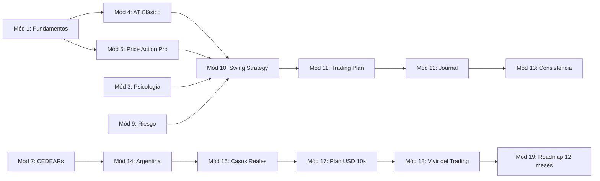
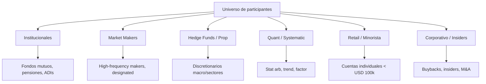
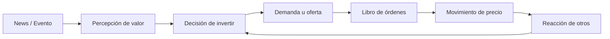
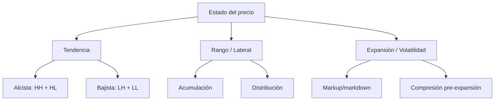

# MASTERCLASS: Trading Profesional desde Argentina

## INTRODUCCIÓN GENERAL — POR QUÉ ESTA MASTERCLASS EXISTE

El 90% de los traders minoristas pierde dinero. No es mala suerte, no es un complot de los brokers, no es que el mercado sea "imposible". Es un problema de **estructura**: la mayoría opera sin un sistema, sin gestión de riesgo, sin comprensión real de quién está del otro lado de la operación y sin la psicología de un profesional.

Esta masterclass fue diseñada como el manual que ojalá yo hubiera tenido cuando empecé a operar desde Buenos Aires hace más de dos décadas, mirando un monitor de 15 pulgadas y preguntándome por qué AAPL subía cuando "todos los indicadores decían que estaba sobrecomprado".

El objetivo es claro: convertir a una persona con trabajo, tiempo limitado y capital modesto (digamos USD 10.000) en un trader profesional **consistente**, no en un apostador ocasional.

> **Objetivo de Aprendizaje** — Al finalizar esta masterclass tendrás un sistema completo: entenderás quién mueve los precios, sabrás leer Price Action e institucional, dispondrás de una estrategia de Swing Trading con reglas explícitas, un plan de riesgo, un journal, una rutina y un roadmap de 12 meses. Sabrás operar CEDEARs y ADRs desde Cocos Capital con comisiones y dolarización claras.

> **Advertencia educativa** — Este contenido es formativo, no recomendación financiera. Ninguna estrategia garantiza ganancias. Todo lo expuesto debe someterse a backtesting, paper trading y gestión de riesgo antes de aplicarse con capital real. El trading con apalancamiento puede provocar pérdidas superiores al capital depositado. Distinguiremos en el texto entre **conceptos ampliamente aceptados**, **prácticas habituales** y **enfoques que dependen del estilo del trader**.

### Cómo leer esta masterclass

| Símbolo | Significado |
|---------|-------------|
| **Concepto aceptado** | Saber consolidado, ampliamente documentado en literatura académica y profesional |
| **Práctica habitual** | Uso común entre traders, sin ser universal ni garantizado |
| **Enfoque de estilo** | Depende del trader, del mercado y del timeframe |
| ⚠️ | Advertencia de riesgo o trampa común |
| 📌 | Idea clave o resumen de cierre |
| 🧮 | Cálculo numérico resuelto paso a paso |
| 🎯 | Regla operativa concreta |

La guía se estructura en **20 módulos** diseñados para leerse en orden la primera vez y consultarse en cualquier orden después. Cada módulo incluye:

- teoría profunda,
- diagramas y tablas comparativas,
- ejemplos numéricos resueltos,
- casos reales con tickers (AAPL, MSFT, NVDA, TSLA, YPF, GGAL, MELI, etc.),
- un bloque **I Do / We Do / You Do** (ejemplo guiado, ejercicio colaborativo y trabajo individual),
- un checklist,
- un resumen final,
- y preguntas de verificación tipo examen.



### Marco epistemológico: qué sabemos y qué creemos saber

Merece la pena aclarar una tensión importante antes de entrar en materia. El trading discurre entre dos extremos epistémicos:

- **La teoría cuantitativa** (eficiencia débil, random walk, hipótesis de mercados eficientes de Fama) sostiene que el precio es, en buena medida, un proceso estocástico y que el edge técnico sistemático es débil o inexistente después de costos.
- **La práctica profesional** ( desks prop, hedge funds sistemáticos, traders discretionarios con historial auditado) opera con un mix de edges estadísticos, microestructura, factor investing y gestión de riesgo.

Esta guía no toma partido dogmático. Adopta una postura **pragmática y honesta**:

1. Sobre horizontes cortos (intradía) el edge minorista es estadísticamente frágil y suele evaporarse con costos.
2. Sobre horizontes de swing y position (días a semanas), la persistencia de tendencias, la baja eficiencia de ciertos activos, los flujos institucionales y los errores de valuación ofrecen edges reales pero modestos (tipicamente Sharpe entre 0.5 y 1.5, no 3.0+).
3. La gestión del riesgo y la consistencia son **más importantes** que el edge本身. Un edge mediocre con sizing excelente produce capital creciente. Un edge brillante con sizing pésimo produce ruina segura.
4. Cualquier edge, por bueno que sea, **degrada** con el tiempo y requiere monitoreo.

Con esto claro, entramos al Módulo 1.

---

# MÓDULO 1 — FUNDAMENTOS DEL MERCADO

> **Objetivo del módulo** — Comprender cómo funciona realmente una bolsa de valores, quiénes son los actores, cómo se forma el precio, qué significa "liquidez", por qué el precio sube y baja realmente, y cómo nacen, crecen y mueren las tendencias. Sin esto, todo análisis técnico posterior es-literatura sin anatomía.

## 1.1 Qué es una bolsa (y qué no es)

Una Bolsa de Valores es, técnica y operativamente, un **mercado secundario** donde quienes ya tienen títulos (acciones, bonos, ETFs) los intercambian entre sí. Lo que la Bolsa **no** es: un casino, una casa de apuestas, ni un lugar donde el dinero "aparece". Cuando comprás una acción a otro inversor, tu dinero no va a la empresa emisora (salvo primarias, IPOs, follow-ons); va al vendedor. La empresa ya recibió su capital hace tiempo, en su oferta pública inicial.

¿Por qué importa esta distinción? Porque aclara algo esencial: **tu ganancia siempre sale del bolsillo de otro participante** que está dispuesto a tomar el lado opuesto. Si ganás, alguien del otro lado pierde (o al menos no gana tanto como podría). Si perdés, alguien del otro lado gana. El mercado es un juego de **transferencia de capital** con suma cercana a cero antes de costos, y **negativa** después de costos (comisiones, spreads, slippage, impuestos).

🧮 **Ejemplo 1.1 — Suma negativa después de costos**

Imaginemos 100 traders que operan AAPL durante un año, todos con la misma información, sin edge. Antes de costos el resultado agregado es cero: lo que unos ganan otros lo pierden. Después de costos:

| Concepto | Por trader/año |
|----------|----------------|
| Comisión broker | USD 300 |
| Spread bid-ask | USD 400 |
| Slippage estimado | USD 200 |
| Impuesto a ganancias (cuando aplica) | USD 380 |
| **Total costos** | **USD 1.280** |

Si cada trader parte con USD 50.000, el costo anual equivale a **2,56% del capital**. Para "no perder", el sistema debe rendir más que eso **antes de costos**. El trader promedio, por definición estadística, **no puede** rendir más que el promedio del mercado. Es decir, el trader promedio pierde ≥2,56%/año simplemente por existir, incluso antes de hablar de "habilidad".

📌 **Idea clave** — El mercado es un juego de suma negativa después de costos. Sobrevivir requiere **edge** (aunque sea pequeño) **y** gestión de riesgo, o ambos se pierden lentamente.

### La bolsa como infraestructura

Una Bolsa moderna cumple funciones técnicas precisas:

| Función | Qué resuelve | Ejemplo concreto |
|---------|--------------|-------------------|
| **Matching de órdenes** | Emparejar compradores con vendedores a precio justo |纳斯达克 INET engine empata 100.000 órdenes/seg |
| **Descubrimiento de precio** | Producir un precio visible y consensus | BloombergReuters publica ticks en tiempo real |
| **Liquidación y custodia** | Garantizar que el comprador reciba el título y el vendedor el dinero | DTCC settle T+1 acciones US desde mayo 2024 |
| **Regulación y transparencia** | Evitar fraudes, insider trading y manipulación | SEC multa a quien opere con info privilegiada |
| **Estándares contractual** | Unificar formato de órdenes y registrar títulos | Lotes de 100 acciones, ticks de USD 0.01 |

Para el trader minorista esto significa que **el feed de precios que ves** es el resultado de una infraestructura enorme que procesa órdenes, las empata, las settlea y las audita. Cuando un minorista compra, no está "viendo" precio: está **reaccionando** a una sucesión de ticks generados por millones de órdenes que procesaron antes que la suya.

## 1.2 Los participantes: quién opera realmente

Un mercado líquido es un ecosistema con especies muy distintas. Confundirlas es el origen de buena parte de las pérdidas del minorista.



| Tipo | Horizonte | Tamaño típico | Edge |
|------|-----------|----------------|------|
| **Fondos mutuos/pensiones** | Meses-años | miles de millones | Flujo, scale, research |
| **Market makers designados** | Milisegundos-minutos | Inventarios rotativos | Spread + rebates |
| **HFT no designados** | Microsegundos-segundos | Volumen enorme | Latencia, microestructura |
| **Hedge funds equity LS** | Semanas-meses | 100M-10B | Factor, event, short |
| **Stat arb / quant** | Horas-semanas | variable | Mean reversion, cointegración |
| **Discretionarios macro** | Meses | 100M-5B | Regímenes, flows |
| **Retail** | Minutos-años | < 100k | ??? (muy variable) |

El retail no es "el débil por definición", pero **sí es el que**:

- paga las comisiones más altas (no tiene tier negotiating power),
- recibe el último precio (después de institucionales y MMs),
- opera con menor información,
- suele usar timeframe corto (donde el edge es menor),
- no tiene compliance ni modelos de riesgo,
- y emocionalmente es el más expuesto porque juega con **su** dinero.

🎯 **Regla operativa** — Donde el retail compite directamente con HFT (intradía en acciones líquidas US), el edge minorista es **cercano a cero** en términos de microestructura. Las oportunidades reales del minorista están en horizontes **más largos** (swing, position) donde la latencia y el tamaño no cuentan: cuenta el análisis y la paciencia.

### 1.2.1 Institucionales: cómo mueven el mercado

Un fondo mutuo de USD 200.000 millones en acciones no es libre para "comprar hoy 5 millones de NVDA a market". Destrozaría el precio. En su lugar:

1. **Algos de ejecución (VWAP, TWAP, POV, IS)** dividen la orden parental en miles de órdenes hijas a lo largo del día/semana.
2. **Dark pools y ATS** canalizan parte del flujo fuera del lit book para evitar footprint.
3. **Traders de bloque** (block desks) negocian grandes paquetes bilateralmente.

El resultado: cuando un institucional **está comprando**, no es visible en la cinta de manera obvia, sino como una **sucesión de ticks alcistas** récord que apenas mueve el precio intra-día, pero que **acumula presión** durante días o semanas. Por eso un fondo no "entra" en una vela: **entra en una secuencia**.

Para el swing trader esto es **la mina de oro**: el institucional deja huellas en el gráfico daily y semanal que no puede ocultar. Esos son los pies de la tendencia. La detección de esa huella institucional es la base del **Price Action institucional** (Módulo 5).

🧮 **Ejemplo 1.2 — Cómo lo verías en el gráfico**

Un fondo quiere comprar 3 millones de acciones de MSFT (≈ USD 1.000 M al precio de 2025). El ADV (Average Daily Volume) de MSFT es de 18 millones de acciones. Una orden a market de 3M représentaría 17% del ADV y un slippage estimado (Almgren-Chriss) de 0.4-0.8%, es decir, USD 4-8M perdidos en slippage. El fondo usa VWAP sobre 8 sesiones (≈ 8 × 18M = 144M de volumen), comprando apenas 2% del volumen por sesión. La huella visible: ~8 days donde MSFT cierra con body verde y tiny tails, low retail interest, sin noticias, y el precio **avanza 1-2% acumulado** en esos días. Eso es footprint institucional.

## 1.3 Market Makers: el que respira

El Market Maker (MM) es el participante que **cotiza precios de compra y venta simultáneamente** y gana con el spread. No es un " especulador direccional" en sentido clásico: su PnL no depende de que el precio suba o baje, sino de que **compre barato y venda caro muchas veces al día**.

Existen varios tipos:

| Tipo | Cómo se financia | Riesgo principal |
|------|-------------------|-------------------|
| **MM designado (DMM NYSE)** | Obligación contractual de cotizar | Adverse selection |
| **MM HFT** | Rebates + spread + latency arb | Queue position, exchange fee changes |
| **MM en opções** | Vega, gamma hedging | Vol shock |
| **MM en bonos** | Carry, inventory | Credit event |
| **MM retail forex/CFD** (brokers CFD) | B-book, hedging selectivo | Risk on own book |

⚠️ **Trampa del minorista argentino** — Muchos brokers que ofrecen "trading de acciones" en realidad ofrecen **CFDs** (Contracts for Difference). Cuando operás un CFD no comprás la acción subyacente: el broker toma el lado opuesto y **paga si ganás, cobra si perdés**. Esto es B-book puro. El "precio" que ves fue construido por el broker y puede diferir del precio real del exchange. Cocos Capital, en cambio, opera **acciones reales** y CEDEARs reales (custodia en Caja de Valores), no CFDs. Verificá siempre si tu broker te da **custodia** o te da **CFD**.

### 1.3.1 Qué hace el MM con tu orden

Cuando un minorista manda una market order de 200 acciones de AAPL:

1. La orden llega al routing del broker (Smart Order Router si es US).
2. El SOR compara libros en 16 exchanges US y ATSs.
3. La orden se ejecuta contra el MM que ofrecía el mejor ask.
4. El MM queda **short** 200 acciones (su inventory).
5. El MM hedgeará esa posición vía EVEA, opciones o esperando el siguiente comprador que venda al bid.

El spread que el minorista cruzó paga, en parte, el servicio de instantaneidad. Si el minorista hubiera usado una **limit order** al bid, hubiera cobrado el spread, no pagado. Costo vs recompensa:

| Tipo de orden | Quién paga el spread | Resultado típico |
|---------------|-----------------------|-------------------|
| Market buy | Vos lo pagás | Fill instantáneo |
| Limit buy al bid | Lo cobrás | Fill probabilístico, riesgo de no-fill |
| Limit buy al mid | Split | Mejor precio, fill dependerá de la cola |

🎯 **Regla operativa** — Operar con **límites pasivos** en zonas de liquidez (Módulo 5) te convierte temporalmente en un mini market maker: cobrás el spread en lugar de pagarlo. En swing trading en acciones US desde Argentina, esto es complejo por horarios, pero en CEDEARs locales es viable.

## 1.4 Liquidez: el concepto más importante del módulo

La liquidez no es "tener dinero disponible". Es la **capacidad de operar tamaño sin mover el precio**. Es el atributo que explica por qué podés comprar y mil fracciones AAPL sin tocar el precio, pero no podés hacer lo mismo con una acción pequeña en BYMA.

La liquidez tiene **cuatro dimensiones**:

| Dimensión | Definición | Cómo medirla |
|-----------|------------|---------------|
| **Anchura (width)** | Spread bid-ask | `ask - bid` |
| **Profundidad** | Tamaño en top of book | Volumen disponible a cada nivel |
| **Resiliencia** | Velocidad de recuperación tras order flow | Tiempo hasta restablecer spread |
| **Inmediatez** | Tiempo para ejecutar N a mercado | Segundos hasta fill |

Una acción puede tener un spread tight (buena anchura) pero poca profundidad: si comprás 5.000 acciones de golpe, el precio se mueve 1%. Esa acción **no es líquida** para tu tamaño aunque tenga apariencia líquida.

🧮 **Ejemplo 1.4 — Medición de liquidez en AAPL vs una small-cap**

| Métrica | AAPL (≥ USD 3T cap) | Small-cap XYZ (USD 300M cap) |
|---------|----------------------|-------------------------------|
| Spread típico | USD 0.01 (1 bp) | USD 0.05–0.20 (50–200 bp) |
| Bid size top | 5.000–15.000 acciones | 100–500 acciones |
| ADV | 50–70M acciones | 200k–1M acciones |
| Slippage 0,1% ADV | < 5 bp | 30–80 bp |
| Slippage 1% ADV | 10–20 bp | 100–300 bp |
| Coste operar USD 100k market | ≈ USD 5–10 | ≈ USD 100–400 |

En AAPL podés meter USD 100.000 a mercado sin que duela. En una small-cap el mismo ticket te costaría el 0,4% solo en slippage, equivalente a **4 meses de rentabilidad esperada** del SPX. Operar small-caps con órdenes a mercado es **impuesto** silencioso.

📌 **Idea clave** — La liquidez no es binaria; es **función de tu tamaño**. Lo que es líquido para un retail con USD 5.000 puede ser ilíquido para un desk con USD 50M.

### 1.4.1 Liquidez en CEDEARs

Los CEDEARs (Módulo 7 en detalle) son certificados emitidos en Argentina respaldados por acciones del extranjero. Su liquidez depende de:

1. **Liquidez del subyacente en US** (AAPL es líquido → su CEDEAR también).
2. **Interés local** (Apple y Nvidia son top demand; otros CEDEARs tienen casi cero volume en BYMA).
3. **APC y ratio del CEDEAR** (ratios bajos facilitan arbitraje, mejora liquidez).
4. **Dolarización del mercado local** (CCL alto estable mejora arbitraje CEDAR-ADR).

⚠️ Un CEDEAR puede parecer "líquido en el gráfico de TradingView Argentina" pero el volumen real en BYMA es **mayormente del market maker**. Operar con límites y evitar market orders agresivas en CEDEARs de bajo volumen es **obligatorio** para no pagar spreads perversos.

## 1.5 La microestructura del precio: bid, ask y el libro

El precio que ves en la pantalla es **una ilusión simple** de un sistema más complejo. El "precio" de AAPL no es un número; es una **estructura vertical de órdenes**:

```text
Bid (compradores)            Ask (vendedores)
5.000 × 195,40   ←  best bid  best ask →  195,41 × 3.000
3.000 × 195,39                            195,42 × 8.000
2.500 × 195,38                            195,43 × 5.000
1.000 × 195,37                            195,44 × 12.000
...
```

El **mid price** es `(195,40 + 195,41) / 2 = 195,405`. El **spread** es `0,01`. El **last trade** es la última vela que se ejecutó, no necesariamente el "precio actual".

Cuando unmajorista manda una market order de **6.000 acciones**, atraviesa el primer nivel (3.000 a 195,41) y deglute el segundo (3.000 a 195,42). El precio **avanza** de 195,40 a 195,42 en el ask. **El precio se mueve porque el flujo de órdenes vacía niveles.**

⚠️ **Trampa conceptual** — Muchos cursos técnicos dibujan "soportes" y "resistencias" como si fueran precios donde "el precio rebota". En realidad son **niveles donde órdenes pasivas esperan**. Soporte = lista deórdenes de compra parked. Residencia = órdenes de venta parked. Cuando el flujo de órdenes activo (market sells) llega y consume todo el bid parked, el nivel se **rompe hacia abajo**: el soporte no "falló porque el precio rompe el soporte por lo magia de la psicología", falla porque **se acabaron las órdenes parked de compra**.

### 1.5.1 Imperfecta analogía del supermercado

Imaginá un supermercado donde:

- los **compradores** ponen **notes** con "compro X latas a $Y" en una pizarra,
- alguien con "vendo X latas a $Y+1" las vende,
- el cajero (matching engine) las empata cuando coinciden.

Ese es el juego. La diferencia con el supermercado real es que en la bolsa las "notas" se cancelan a cada microsegundo y los participantes grandes publican y cancelan órdenesDecoy para **probar la intención ajena**. Esto es **layering/spoofing** (ilegal, pero ocurre) y **order book dynamics**.

📌 **Idea clave** — El "precio" es la **foto congelada** de un estado dinámico del libro de órdenes. Soportes y resistencias son acumulaciones de órdenes parked, no psicología mística.

## 1.6 Oferta y demanda financiera

En cualquier mercado el precio responde a oferta y demanda. En bolsa, eso se traduce en:

- **Demanda** = flujo neto de market buys + reposiciones de órdenes parked a bids más altos.
- **Oferta** = flujo neto de market sells + reposiciones a asks más bajos.

Cuando demanda > oferta, el precio **sube**. Cuando oferta > demanda, el precio **baja**. No hay más juego. Todo lo demás (news, fundamentals, GDP, EPS) opera **a través** del order flow: solo mueve el precio si convierte en una descompensación entre bids y asks.



Esto explica por qué **a veces AAPL sube con un earnings peor que esperado**: porque los que ya estaban short cubren (compran), creando demanda, aunque el fundamental sea negativo. La dirección del precio corto plazo depende del **order flow**, no del "fundamental". El fundamental predice la **tendencia de largo plazo**, el order flow predice el **movimiento de corto plazo**.

🧮 **Ejemplo 1.6 — Earnings beat pero baja**

NVDA reporta earnings el 22 de agosto de 2023. EPS supera estimaciones en 13%, ingresos también. El titulo abre -2% al día siguiente. ¿Por qué? Porque ya estaba precificado en una expectativa enorme: el stock había subido +200% YTD. La "sorpresa" alcista ya estaba comprada. Cuando los institucionales venden para tomar ganancias (oferta > demanda), el precio cae aunque el fundamental sea excellent. La lección: el flujo > el fundamental en el corto plazo.

## 1.7 Por qué el precio sube y baja: las tres causas reales

Para esta masterclass distinguimos tres **causas estructurales** del movimiento del precio:

### Causa 1 — Order flow imbalance

La causa más directa. Si durante 30 minutos los market buys superan a los market sells en proporción 3:1, el precio sube. Punto. Sin noticias, sin fundamental, sin "razón". La razón es **el libro se vacía del lado ask más rápido de lo que se repone**.

Esto es lo que miden herramientas como **Volume Delta**, **Footprint charts** y los CVD (Cumulative Volume Delta). El retail rara vez los usa; los desks intradía y HFT viven de esto.

| Herramienta | Qué mide | Útil para |
|--------------|----------|------------|
| **Volume Delta (por vela)** | Buy volume – sell volume | Detectar absorción |
| **CVD acumulado** | Cum de delta | Divergencias con precio |
| **Footprint chart** | Volume por nivel dentro de la vela | Stops hunts, traps |
| **Order book imbalance** | Bid size vs ask size | Spoofing, intent expuesta |
| **Tape reading** | Time & sales | Confirmar flow agressivo |

⚠️ Para el **swing trader** (nosotros), estas herramientas son accesorias, no centrales. Lo que importa en swing es la **huella institucional en el gráfico daily/weekly**, no el tape del minuto 10.

### Causa 2 — Cambios de expectativa

Las noticias no mueven el precio por sí solas: lo mueven **cuando cambian la expectativa**. Esto es la base de la **eficiencia semi-fuerte**: el mercado anticipa lo que sabe. Si todos esperaban un EPS de USD 2 y sale USD 2,50, el título reacciona +5%. Si esperaban USD 3 y sale USD 2,50, cae -5% aunque sea "mejor que el año anterior".

| Escenario | Esperado | Realizado | Reacción típica |
|-----------|----------|-----------|------------------|
| Guide-up | EPS 1.80 + guide 2.00 | EPS 1.85 + guide 2.30 | +5% a +10% |
| Beat but guide-down | EPS 1.85 + guide 1.90 | EPS 1.90 + guide 1.85 | -3% a -8% |
| In-line | EPS 1.80 + guide 2.00 | EPS 1.81 + guide 2.01 | < ±1% |
| Miss but guide-up | EPS 1.75 + guide 2.00 | EPS 1.70 + guide 2.20 | +0% a +5% (raro) |
| Miss + guide-down | EPS 1.80 + guide 2.00 | EPS 1.70 + guide 1.70 | -8% a -15% |

🎯 **Regla operativa** — Nunca operesearnings **sin entender previamente** cuál era la expectativa (consensus estimate). Mirá always "expected move" del straddle de opciones, que te dice cuánto el mercado ya descuenta. Si el straddle cuesta USD 8 y la acción está a USD 200, el mercado espera un move de ±4%. Operar con la idea de "voy a apostar si supera o no" es **apuesta**, no trading. Lo profesional: **esperar a que se asiente el polvo**, y operar la **consecuencia técnica** 2-3 días después (Módulo sobre earnings).

### Causa 3 — Cambios en el costo del capital y en factores macro

En horizontes más largos (semanas-meses), el precio responde a:

- **Tasas de interés**: suben tasas → multiples P/E bajan → todo multiple-compressed.
- **Inflación**: alta → multiple comprimido → value > growth.
- **Riesgo País / dolarización**: en Argentina, riesgo de devaluación empuja al CCL y afecta CEDEARs.
- **Flujos sectoriales**: rotación entre growth, value, defensivos, cíclicos.
- **Earnings y guías**: la guía futura mueve más que el quarter actual.

🧮 **Ejemplo 1.7 — Tasas y crecimiento**

A inicios de 2022, SP500 P/E forward era 21x y la T-10 real era -1%. Para fines de 2022, T-10 real subió a +1.5% (suba de 250 bp). El "fair P/E" moved from 21x a 14x aprox (regla inversa de tasas reales). El multiple de SP se compresó 33% aunque los EPS crecieron. El SP cayo ~20% net. Gran parte de ese movimiento no fue "fundamental"; fue **recalibración del costo de capital**. Operar como swing trader requiere leer este viento de cola o de cabeza.

## 1.8 Por qué el precio sube y baja: traducción al gráfico

Lo anterior explica **por qué el precio se mueve** en realidad. Pero el trader profesional trabaja con la **traducción al gráfico**. Los movimientos del precio se visualizan como **tendencias**, **rangos** y **expansiones**:



| Estado | Estructura | Significado | Estrategia base |
|--------|-------------|-------------|------------------|
| **Tendencia alcista** | HH + HL | Demanda sostenida | Buy pullbacks |
| **Tendencia bajista** | LH + LL | Oferta sostenida | Sell rallies / avoid longs |
| **Acumulación** | Rango + compression | Institucional comprando | Buy break retest |
| **Distribución** | Rango + churning | Institucional vendiendo | Sell break retest / avoid |
| **Markdown** | Caída fuerte | Outflow acelerado | Wait o short |
| **Markup** | Subida fuerte | Inflow acelerado | Trend-follow entries |
| **Compresión** | ATR en descenso | Coiled spring | Wait for expansion |

Estas definiciones son **ampliamente aceptadas** (Dow Theory + Wyckoff), pero la **interpretación en tiempo real** es un **enfoque de estilo** y requiere práctica en el módulo 5 (Price Action profesional).

## 1.9 Cómo se crean las tendencias

Una tendencia nace cuando el order flow se vuelve **persistente y unidireccional** durante suficiente tiempo para que eso sea visible en el gráfico. Dow lo formalizó así:

1. **Impulso** en dirección de la tendencia mayor a las correcciones (slope).
2. **HH + HL** (tendencia alcista) o **LH + LL** (tendencia bajista).
3. **Volumen acompañando** en los impulsos, no en las correcciones.
4. **Confirmación inter-temporal**: tendencia en daily + weekly alineados.

Por qué la persistencia ocurre:

| Mecanismo | Cómo alimenta la tendencia |
|-----------|----------------------------|
| **Fondo długo comprando VWAP** | Sostiene bid, absorbe correcciones |
| **Short sellers apilados** | Cubren cuando el precio sube → fuel |
| **FOMO retail** | Compra tarde, da combustible final |
| **Stop hunting** | Stops disparan orders → cascade |
| **Momentum factor** | Quants compran強 stocks |
| **Earnings upgrade cycle** | Analysts suben estimates → flow |

Esta **cadena de combustible** es lo que convierte una simple subida del 3% en una tendencia del 40% en 6 meses. El swing trader que opera **Pullback en tendencia alcista con earnings en upcoming** es el que captura la fase más alimentada.

### 1.9.1 Anatomía de una tendencia típica

```text
                       ┌─── B (Distribución final / LH)
                    ┌──┘
                 ┌──┘
              ┌──┘ ← A (Markup сильный, vol ×3)
              │
              │ ← Pullback (vol bajo, HL)
              │
              │ ← Reanudación (HH, vol alto)
              │
              │ ← Pullback último
              │
              └── B (top, distribution pattern)
```

| Fase | Estructura | Vol | Participante dominante | Acción recomendada |
|------|------------|-----|------------------------|---------------------|
| Baja / acumulación | Rango + rounds de test | Bajo | Smart money comprando | Wait o small-long |
| Markup inicial | Ruptura + retest | Sube | Institucional + early | Buy break/retest |
| Pullback | Estructura corrective | Bajo | Profit-taking | Buy en zona clave |
| Markup medio | HH + gap-up | Alto | Momentum quants | Hold/Pyramid |
| euforia / climb | Aceleración | Altísimo | Retail FOMO | Trailing stop tight |
| Distribution | Range + churning | Medio | Smart money vendiendo | Reduce / exit |
| Markdown | Ruptura baja | Sube en down | Stops + quants short | Out / short |

El swing trader profesional **NO opera en distribution/euphoria**: opera en acumulación y en los primeros pullbacks del markup. La diferencia entre ganar y perder a 12 meses suele ser en qué fase de esta cadena entrás y salís.

## 1.10 La trampa del "qué mueve el precio": los tres motores que se confunden

Llegados aquí, conviene refinar. Decir "lo que mueve el precio es oferta y demanda" es cierto pero **insuficiente** para operar. En realidad hay **tres motores** interactuando:

| Motor | Escala temporal | Cómo se ve | Quién manda |
|-------|------------------|-----------|-------------|
| **Order flow** | Minutos a horas | Velas individuales, deltas | HFT, MMs, day traders |
| **Posicionamiento / flow institucional** | Días a semanas | Tendencias, gaps, rupturas | Hedge funds, prop, quant |
| **Macro / fundamentals / costo capital** | Semanas a años | Regímenes, valuation, countries | Macro funds, pensions, ADIs |

El swing trader que usa gráfico daily/4H está mayormente expuesto al **motor 2** (posicionamiento institucional), con viento de cola o de cabeza del motor 3, y descuidando el motor 1.

🎯 **Regla operativa** — No mezcles motores en tu análisis. Si estés en swing, no reaccionar a cada delta de minutos. Si estás en swing, **la news de hoy es ruido salvo que cambie el flujo institucional**, lo cual tarda días en verse.

## 1.11 Regímenes de mercado

Un mercado no es siempre el mismo mercado. Existen **regímenes** y la estrategia que funciona en uno falla en otro. Para swing:

| Régimen | Volatilidad | Tendencia | Mejor familia | SP500 ejemplo |
|---------|--------------|-----------|----------------|----------------|
| **Bull trend** | Media-baja | Alcista | Buy pullbacks | 2017, 2023-24 |
| **Bear trend** | Media-alta | Bajista | Trend-follow short / defensive | 2008, 2022 |
| **Range chop** | Media | Lateral | Mean reversion / sell extremes | 2015, 2018 mid |
| **Crisis / vol shock** | Muy alta | Caída rápida | Cash / volatility strategies | Mar 2020, volmageddon 2018 |
| **Recovery** | Media-baja | Subida fuerte | Breakout / momentum | Apr-Dec 2020 |
| **Stagflation** | Media | Lateral bajista | Value / commodities | 2022 partial |

⚠️ **Trampa** — Aplicar la misma estrategia en todos los regímenes produce whipsaws. Una media móvil cruces funciona en tendencias y castiga en chop. La primera pregunta no es "qué acción comprar" sino "qué régimen estamos en".

Módulo 4 trata estos indicadores, pero conviene plantear una definición **simple, replicable y honesta** de régimen aquí:

🧮 **Ejemplo 1.8 — Régimen simple con 3 reglas**

Define:
- Trend score `(SMA50 - SMA200) / SMA200` en SP500 daily.
- VIX vs media 50.
- ATR % vs media 100 en SP500.

| Trend score | VIX vs media | ATR% | Régimen declarado |
|-------------|--------------|------|---------------------|
| > +5% | < media | < media | **Bull trend smooth** |
| > +5% | > media | < media | Bull trend strong |
| > +5% | > media | > media | **Volatile bull** |
| ±5% | < media | < media | Range chop low vol |
| ±5% | > media | > media | **Range chop volatile** |
| < -5% | < media | < media | Bear trend |
| < -5% | > media | > media | **Bear trend volatile** |
| cualquier | VIX > 30 | > 1.5x media | Crisis |

Esta clasificación es **una de muchas** posibles (enfoque de estilo). La utilidad no está en ser perfecta sino en ser **consistente y replicable**: te permite evitar aplicar "buy pullback" en régimen "crisis".

## 1.12 El rol del retail en todo esto

Aquí está la verdad incómoda: el retail, en conjunto, es **contrarian indicator** cuando opera en pico. Datos de CFTC COT (Commitment of Traders) en futuros muestran que el small spec suele estar máximo largo en máximos y máximo corto en mínimos. No es porque sean idiotas: es porque el sistema de incentivos emocional humano está diseñado así.

| Sesgo | Cuándo aparece | Cómo corregir |
|------|----------------|----------------|
| **Recency bias** | Comprar lo que acaba de subir mucho | Esperar pullback estructurado |
| **Loss aversion** | Cortar ganadores rápido, dejar perdedores correr | Stop y trailing por ATR predefinidos |
| **Anchoring** | "Volver a mi costo" como objetivo | Salir por plan, no por costo |
| **Confirmation** | Buscar info que valida la tesis | Asignar "killer hypothesis" |
| **FOMO** | Comprar extensiones | Wait para zona buena |
| **Revenge** | Operar grande tras perder | Daily loss limit |
| **Overconfidence** | Subir tamaño tras racha ganadora | Sizing por fórmula, no emocional |

Estos sesgos se tratan en el Módulo 3 (Psicología). Aquí solo apuntamos: **el mercado premia la disciplina, no la inteligencia**.

## 1.13 I Do / We Do / You Do — Ejercicios progresivos

### 1.13.1 I Do — Diagnóstico de SP500 en una semana real

**Objetivo:** diagnosticar el régimen del mercado US usando datos públicos antes de operar cualquier swing.

| Paso | Acción | Resultado esperado |
|------|--------|---------------------|
| 1 | Abrir gráfico semanal SPY o SPX | Ver tendencia mayor |
| 2 | Calcular SMA50 y SMA200 en daily | Ver slope |
| 3 | Trend score `(SMA50 - SMA200) / SMA200` | Número percentual |
| 4 | Consultar VIX actual vs media 50 | Mayor o menor que media |
| 5 | Calcular ATR% vs media 100 | Estado de volatilidad |
| 6 | Aplicar tabla de régimen (sección 1.11) | Régimen declarado |
| 7 | Recomendar acción | Familia de estrategia apropiada |

**Caso concreto — segunda semana de septiembre 2024:**

- SPX ≈ 5.450, SMA50 ≈ 5.400, SMA200 ≈ 5.150.
- Trend score = `(5.450 - 5.150) / 5.150 = +0,058` (≈ +5,8%).
- VIX ≈ 16 vs media 14 → VIX ligeramente arriba.
- ATR% SPX ≈ 1,2 vs media 100 ≈ 1,1 → similar.
- Resultado: **Volatile bull trend**, preferencia **buy pullback con caution en extensiones**.

📌 **Idea clave** — Antes de buscar acciones, primero declara el régimen en el índice de referencia. La mayoría de los retail pierde porque opera como si siempre fuese alcista.

### 1.13.2 We Do — Diagnóstico colaborativo BYMA / CEDEARs

**Tarea:** aplicar el mismo framework al mercado argentino local (BYMA S&P Merval).

| Decisión | Opción | Justificación |
|----------|--------|----------------|
| Índice ref | S&P Merval ARS | Referencia local líquida |
| Versión | Merval USD (CCL) | Para limpiar devaluación |
| Trend score | SMA50 vs SMA200 weekly | Persistencia |
| Volatility | VIX no existe → usar ATR% del Merval | Proxy |
| Filtro opcional | Riesgo país (EMBI AR) | Macro AR |
| Recomendación | Buy CEDEARs si Merval sube USD steady + CCL estable | Dolarización indirecta |

**Discusión guiada:** ¿Por qué conviene ver Merval en USD? Porque el Merval en ARS sube por devaluación casi siempre. En USD filtra eso. Si el Merval USD está choppy, los CEDEARs ofrecen exposición al mundo en USD sin tocar el Merval directamente. Esa es una decisión que toma un trader Argentino profesional antes de elegir universe.

### 1.13.3 You Do — Diagnóstico individual de un ticker real

**Tarea:** aplicá el framework a un ticker de tu elección (por ejemplo GGAL, AAPL, MELI) durante una semana real. Entregá:

1. Régimen del índice de referencia.
2. Trend score del ticker.
3. Volatilidad (ATR%).
4. Liquidez (ADV, spread observado en broker).
5. Mapa de huella institucional pendiente (¿está en fase acumulación, markup, distribution o markdown?).
6. Decisión: ¿operar ahora?, ¿esperar?, ¿qué sesión setup esperar?

| Criterio | Peso |
|----------|------|
| Rigor técnicos datos | 25% |
| Lectura de fase | 25% |
| Disciplina de régimen | 20% |
| Reconocimiento de liquidez | 15% |
| Honestidad ("no sé") | 15% |

## 1.14 Checklist de fin de módulo

| Bloque | Check |
|--------|-------|
| Modelo mental | Entiendo que el mercado es suma negativa post-costos |
| Regímenes | Sé clasificar el régimen del SP500 antes de operar |
| Liquidez | Verifico ADV y spread antes de meter un tamaño |
| Broker | Confirmé si mi broker es custodia o CFD |
| Order flow | Comprendo que el precio se mueve por order flow, no por psicología mística |
| Institucional | Identifico huella institucional básica en gráfico daily |
| Motores | Diferencio order flow (corto) vs posicionamiento (medio) vs macro (largo) |
| Tendencia | Sé distinguir HH+HL de LH+LL y su implicación |
| Retail | Conozco mis sesgos top 3 |
| Aplicación | Diagnóstico régimen del índice antes de toda búsqueda individual |

## 1.15 Resumen del módulo

El Módulo 1 estableció las bases estructurales del trading profesional que se usarán en los 19 módulos restantes:

1. **El mercado es suma negativa después de costos**: sobrevivir exige edge y gestión de risk.
2. **Existen varias especies de participantes** (institucionales, MMs, HFT, hedge, quant, retail) con distintos horizontes y poder. El minorista compite eficazmente en horizontes **más largos**, no en latencia.
3. **Market makers** proveen liquidez y ganan el spread. El retail que opera market orders paga spread; el que usa límites pasivos lo cobra.
4. **Liquidez** tiene cuatro dimensiones (anchura, profundidad, resiliencia, inmediatez) y es función de tu tamaño, no un dato absoluto.
5. **El precio se mueve** por order flow imbalance (corto), posicionamiento institucional (medio), y macro/costo de capital (largo). Distinguirlos evita reaccionar a ruido.
6. **Tendencias** nacen de order flow persistente y se visualizan como Dow HH+HL / LH+LL.
7. **Regímenes** clasifican el estado del mercado; aplicar la misma estrategia en todos los regímenes produce whipsaws.
8. **Sesgos humanos** son la causa estructural de las pérdidas del retail; la disciplina supera a la inteligencia.

> **📌 Idea clave del módulo** — Antes de analizar una acción, analizá el mercado. Antes de analizar el mercado, clasificá el régimen. Antes de clasificar el régimen, recordá que estás operando contra participantes más grandes y mejor informados que vos. Tu ventaja no es size ni latencia: es **paciencia, gestión de riesgo y horizonte correcto**.

## Preguntas de Verificación 📝

1. **Define** — ¿Por qué se dice que el mercado es "suma negativa" después de costos? ¿Cuáles son esos costos en el caso de un trader Argentino operando CEDEARs?

2. **Aplica** — Si el SP500 tiene trend score +7%, VIX 30 (media 16) y ATR% en 2.0 (media 1.0), ¿qué régimen declarás y qué familia de estrategia priorizás?

3. **Analiza** — ¿Por qué un fondo mutuo compra 3 millones de acciones de MSFT en VWAP a lo largo de 8 sesiones en lugar de una market order grande? ¿Qué huella deja eso en el gráfico daily?

4. **Compará** — Market order vs limit order pasiva al bid. ¿Quién paga el spread en cada caso y bajo qué condición la limit order deja de ser preferible?

5. **Cita real** — NVDA reporta earnings y supera estimaciones en 13%, pero el título cae -2.5% al día siguiente. Explicá dos razones técnicas posibles y qué habría que mirar para distinguirlas.

6. **Diseñá** — Proponé 3 indicadores simples (disponibles en cualquier plataforma gratuita) que te permitan clasificar el régimen del S&P Merval en USD antes de operar CEDEARs.

7. **Reflexioná** — ¿Cuál de tus seis sesgos cognitivos principales creés que más te perjudica cuando operás swing? ¿Qué mecanismo concreto del Módulo 1 (checklist, régimen, sizing) pondrías para neutralizarlo?

8. **Síntesis** — En una frase de no más de 25 palabras: ¿qué diferencia a un trader profesional de un apostador informado?

## Glosario rápido del Módulo 1

| Término | Definición |
|---------|------------|
| **ADV** | Average Daily Volume, volumen medio diario |
| **Ask** | Precio al que se vende, lado vendedor del libro |
| **Bid** | Precio al que se compra, lado comprador |
| **CEDEAR** | Certificado de Depósito Argentino respaldado por acción extranjera |
| **CVD** | Cumulative Volume Delta, acumulado de buy-volumen menos sell-volumen |
| **CCL** | Contado Con Liquidación, dólar financiero argentino |
| **Dow Theory** | Marco clásico de tendencias (HH/HL/LH/LL) |
| **FOMO** | Fear Of Missing Out (miedo a quedarse fuera) |
| **Footprint chart** | Display de volumen por nivel dentro de la vela |
| **HFT** | High Frequency Trading |
| **HH/HL** | Higher high / higher low (estructura alcista) |
| **LH/LL** | Lower high / lower low (estructura bajista) |
| **Lit book** | Order book central de un exchange tradicional |
| **MM** | Market maker, formador de mercado |
| **Mid price** | Punto medio entre bid y ask |
| **Order flow** | Flujo de órdenes activas que mueve el libro |
| **Regímen** | Estado del mercado (tendencia, rango, crisis, etc.) |
| **Régimen** | (sin tilde correcta, uso práctico) |
| **Slippage** | Diferencia entre precio esperado y ejecutado |
| **Smart money** | Institucionales, fondos, profesionales con información |
| **SOR** | Smart Order Router, ruteo inteligente entre exchanges |
| **Spread** | Diferencia ask - bid |
| **Trend score** | Medida simple de pendiente `(SMA50 - SMA200)/SMA200` |
| **VWAP** | Volume Weighted Average Price |
| **Wyckoff** | Marco clásico de acumulación/distribución |

---

> **Continúa en Módulo 2 — Tipos de Trading**, donde comparamos scalping, day trading, swing trading, position, value, momentum, growth y dividendos, y determinamos cuál conviene a cada perfil, especialmente a quien tiene un trabajo de 9 a 18 y opera desde Argentina.