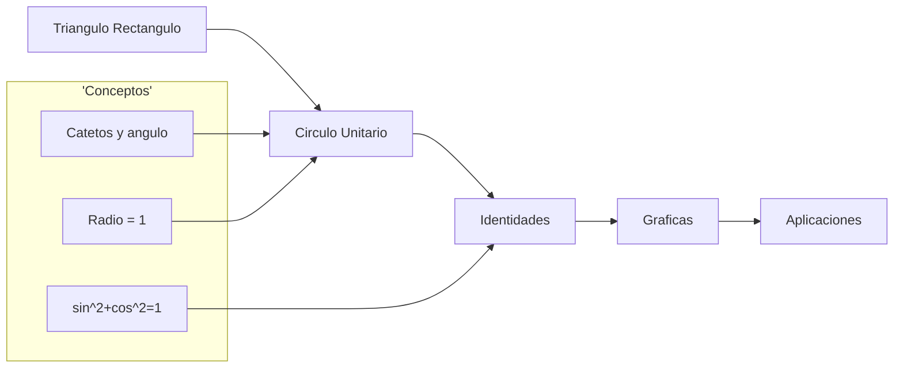
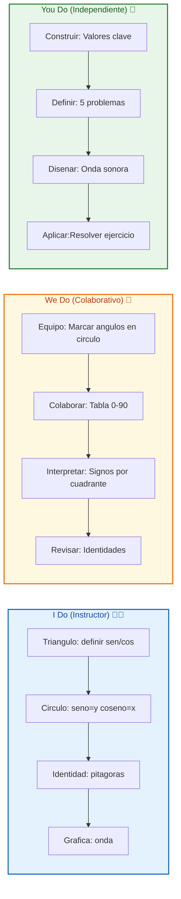
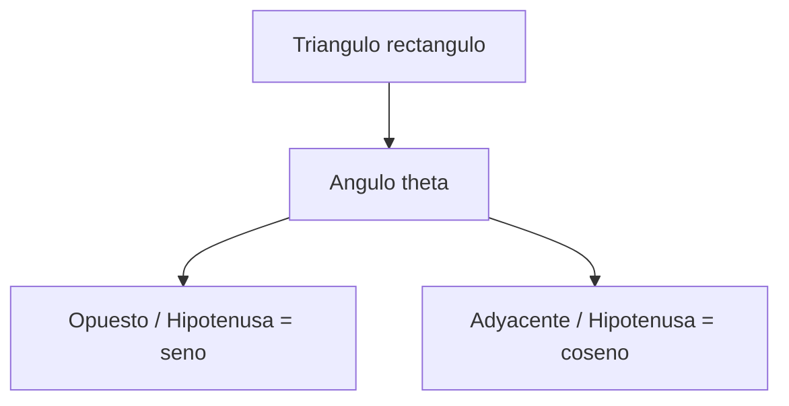
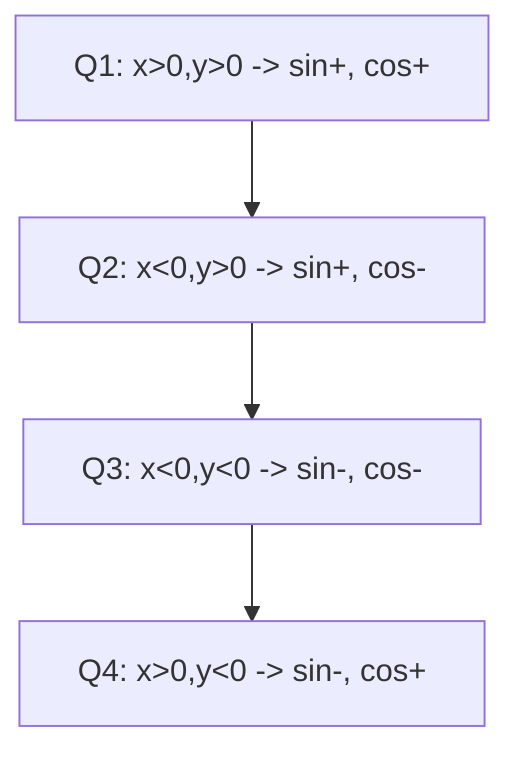
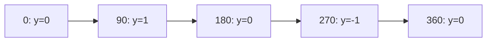
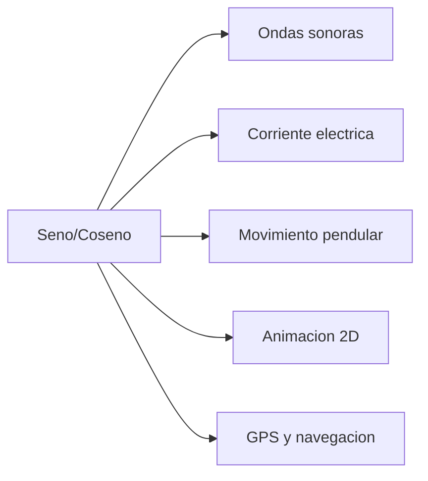

# MASTERCLASS: Trigonometría — Seno y Coseno desde Cero 📐🌊

## INTRODUCCIÓN: POR QUÉ ESTE MASTERCLASS ES DIFERENTE 🚀

La trigonometría asusta porque la enseñan como una lista de fórmulas sueltas 😱. Pero seno y coseno no son "botones de la calculadora": son la **geometría del movimiento**. Están en las olas del mar, en el sonido, en las órbitas planetarias y hasta en tu pantalla de celular.

Este masterclass propone otro camino: en vez de memorizar `sin(30)=0.5`, vas a entender el **motor visual** detrás de seno y coseno 🧠. El círculo unitario lo explica todo: si lo dominas, las identidades, las gráficas y los ángulos raros vienen solos.

La meta no es saberse la tabla de memoria. La meta es **construir seno y coseno desde el círculo** y nunca más dudar.

> **Objetivo de Aprendizaje** 🎯 — Al final de esta guía, podrás explicar seno y coseno desde el triángulo rectángulo y el círculo unitario, usar identidades básicas, leer sus gráficas y aplicarlas a problemas reales.

> **Advertencia educativa** ⚠️ — Este contenido es formativo de matemáticas. Usamos radianes y grados; ambos aparecen en la práctica.

---

## MAPA DEL WORKFLOW 🗺️



| Fase | Pregunta que responde | Output principal |
|------|-----------------------|------------------|
| **Triángulo** | ¿Qué es seno/coseno? | razones en triángulo rectángulo |
| **Círculo** | ¿De dónde salen todos los ángulos? | seno = y, coseno = x |
| **Identidades** | ¿Cómo se relacionan? | sin²+cos²=1 y más |
| **Gráficas** | ¿Cómo se ven? | ondas senoidal y coseno |
| **Aplicaciones** | ¿Para qué sirven? | mundo real |



---

## PARTE 1: EL TRIÁNGULO RECTÁNGULO — LA BASE 🔺

### 1.1 Principio Central 💡

En un triángulo rectángulo, el **seno** y el **coseno** son razones entre lados respecto a un ángulo θ (theta). No dependen del tamaño del triángulo, solo de la forma.



### 1.2 Las definiciones que todo lo explican 📐

| Razón | Definición | Fórmula |
|-------|-----------|---------|
| **Seno (sin)** | cateto opuesto ÷ hipotenusa | `sin θ = opuesto / hipotenusa` |
| **Coseno (cos)** | cateto adyacente ÷ hipotenusa | `cos θ = adyacente / hipotenusa` |

> **Tip del profe** 🧠 — SOH-CAH-TOA es el mnemotécnico rey:
> - **SOH**: Sine = Opposite / Hypotenuse (seno = opuesto/hipotenusa)
> - **CAH**: Cosine = Adjacent / Hypotenuse (coseno = adyacente/hipotenusa)
> - **TOA**: Tangent = Opposite / Adjacent (para la tangente)

> **Tip** 💡 — El cateto **adyacente** es el que forma el ángulo θ (y NO es la hipotenusa). El **opuesto** es el que está "enfrente" de θ.

### 1.3 Ejemplo paso a paso 🔧

Triángulo rectángulo con hipotenusa = 10, cateto opuesto a θ = 5, adyacente = 8.66 (triángulo de 30°):

1. `sin θ = 5 / 10 = 0.5` → θ = 30°
2. `cos θ = 8.66 / 10 ≈ 0.866` → cos 30° ≈ 0.866

```text
sin(30°) = 0.5
cos(30°) = √3/2 ≈ 0.866
```

---

## PARTE 2: EL CÍRCULO UNITARIO — LA PELÍCULA 🎬

### 2.1 Por qué el círculo lo resuelve todo 🌟

El **círculo unitario** es una circunferencia de radio **1** centrada en el origen (0,0). Para cualquier ángulo θ, el punto sobre el círculo tiene coordenadas:

- **x = cos θ**
- **y = sin θ**

```mermaid
flowchart LR
    A[Radio = 1] --> B[Punto (x,y)]
    B --> C[x = coseno]
    B --> D[y = seno]
```

> **La frase del profe** 🌟 — **"Seno es altura (y), Coseno es anchura (x)."** Repítelo hasta soñarlo.

### 2.2 Ángulos especiales en el círculo 🎯

| Ángulo | grados | radianes | sin (y) | cos (x) |
|--------|--------|----------|---------|---------|
| 0° | 0 | 0 | 0 | 1 |
| 30° | π/6 | 0.524 | 1/2 | √3/2 |
| 45° | π/4 | 0.785 | √2/2 | √2/2 |
| 60° | π/3 | 1.047 | √3/2 | 1/2 |
| 90° | π/2 | 1.571 | 1 | 0 |

> **Tip** 💡 — Nota el patrón bonito: en 30°/60° los valores de sin y cos son **1/2 y √3/2** intercambiados. En 45° ambos son **√2/2**.

### 2.3 Signos por cuadrante 🧭

El círculo se divide en 4 cuadrantes. Los signos de sin y cos cambian:



| Cuadrante | sin (y) | cos (x) |
|-----------|---------|---------|
| I (0–90°) | + | + |
| II (90–180°) | + | – |
| III (180–270°) | – | – |
| IV (270–360°) | – | + |

> **Mnemotécnico** ✅ — **"Todos Sus Amigos Cotorrean"**:
> - Q1: **T**odos positivos
> - Q2: solo **S**eno positivo
> - Q3: solo **T**angente (y sin/cos negativos)
> - Q4: solo **C**oseno positivo

### 2.4 Ángulos fuera de 0–90° 🔄

Gracias al círculo, seno y coseno funcionan para cualquier ángulo, incluso negativo o mayor de 360°.

| Ángulo | Relación | sin | cos |
|--------|----------|-----|-----|
| 150° | 180°−30° | sin 30° = 1/2 | −cos 30° = −√3/2 |
| 225° | 180°+45° | −sin 45° = −√2/2 | −cos 45° = −√2/2 |
| 330° | 360°−30° | −sin 30° = −1/2 | cos 30° = √3/2 |

> **Tip** 💡 — En Q2: `sin(180°−θ)=sin θ`, `cos(180°−θ)=−cos θ`. Esas simetrías te ahorran memorizar media tabla.

---

## PARTE 3: IDENTIDADES — EL PEGAMENTO 🔗

### 3.1 La identidad fundamental 🏛️

Del teorema de Pitágoras en el círculo unitario (x² + y² = 1):

```text
sin²θ + cos²θ = 1
```

Esta es la identidad más importante de la trigonometría. Si conoces uno, conoces el otro (salvo signo).

> **Tip** 🧠 — `sin²θ` significa `(sin θ)²`, NO `sin(θ²)`. El cuadrado va sobre el valor, no sobre el ángulo.

### 3.2 Identidades derivadas 🧩

| Identidad | Fórmula | Uso |
|-----------|---------|-----|
| Pitagórica | `sin²θ + cos²θ = 1` | base de todo |
| De seno | `sin θ = √(1 − cos²θ)` | si conoces cos |
| De coseno | `cos θ = √(1 − sin²θ)` | si conoces sin |
| Tangente | `tan θ = sin θ / cos θ` | razón de ambos |

### 3.3 Ángulo complementario 🤝

```text
sin(90° − θ) = cos θ
cos(90° − θ) = sin θ
```

> **Tip** 💡 — Seno y coseno son "primos": son la misma onda desfasada 90°. Por eso `sin(90°−θ)=cos θ`.

---

## PARTE 4: LAS GRÁFICAS — LAS ONDAS 🌊

### 4.1 Seno: la onda clásica 📈

La gráfica de `y = sin θ` es una onda que:

- Arranca en **0** (en θ=0)
- Sube al máximo **1** (en 90°)
- Baja a **0** (en 180°)
- Toca el mínimo **−1** (en 270°)
- Vuelve a **0** (en 360°)



### 4.2 Coseno: la misma onda, adelantada ⏩

La gráfica de `y = cos θ`:

- Arranca en **1** (en θ=0)
- Baja a **0** (en 90°)
- Toca **−1** (en 180°)
- Vuelve a **0** (en 270°)
- Termina en **1** (en 360°)

> **Tip** 💡 — El coseno es el seno **corrido 90° a la izquierda**: `cos θ = sin(θ + 90°)`. Por eso sus gráficas se ven igual pero desfasadas.

### 4.3 Parámetros de la onda 🎚️

| Parámetro | Qué controla | Ejemplo |
|-----------|--------------|---------|
| **Amplitud** (A) | altura máxima | `y = A·sin θ` |
| **Periodo** | largo de un ciclo | `y = sin(Bθ)`, periodo = 360°/B |
| **Fase** (C) | corrimiento horizontal | `y = sin(θ − C)` |
| **Desplazamiento** (D) | sube/baja la onda | `y = sin θ + D` |

> **Fórmula general** ✅ — `y = A·sin(B(θ − C)) + D`

---

## PARTE 5: APLICACIONES REALES — NO ES SOLO TEORÍA 🌍

### 5.1 ¿Dónde aparecen seno y coseno?



| Aplicación | Cómo se usa |
|------------|-------------|
| 🌊 Mareas y olas | modelan con seno |
| 🔊 Sonido | tono = frecuencia de la onda |
| 📱 Pantallas | rotaciones y animaciones |
| 🛰️ Navegación | descomposición de vectores |
| 🏗️ Ingeniería | fuerzas y vibraciones |

### 5.2 Ejemplo: descomposición de un vector 🧭

Una fuerza de 100 N forma 30° con el suelo. Sus componentes:

```text
Fx = 100 · cos(30°) = 100 · 0.866 = 86.6 N
Fy = 100 · sin(30°) = 100 · 0.5   = 50.0 N
```

> **Tip** 💡 — Coseno da la componente **horizontal (x)**, seno la **vertical (y)**. Mismo patrón que el círculo.

---

## PARTE 6: TRAMPAS CLÁSICAS — NO CAIGAS 💀🚫

### 6.1 Los errores que te delatan

| Error ❌ | Correcto ✅ |
|---------|-------------|
| `sin²θ = sin(θ²)` | `sin²θ = (sin θ)²` |
| confundir opuesto/adyacente | opp=enfrente de θ |
| creer que cos 120° es positivo | Q2 → cos negativo |
| usar grados donde van radianes | revisa la calculadora |
| pensar que seno solo va 0–90 | el círculo cubre 360°+ |

> **Trampa mortal** 💀 — La calculadora en **grados (DEG)** vs **radianes (RAD)**. Si `sin(90)` te da 0.89, estás en radianes. Ponla en DEG para ángulos en grados.

---

## PARTE 7: I DO / WE DO / YOU DO — EJERCICIOS PROGRESIVOS 🏋️

### 7.1 I Do — Definir sen/cos en el triángulo 👨‍🏫

**Objetivo:** escribir las razones sin pensar.

| Paso | Acción | Resultado |
|------|--------|-----------|
| 1 | Identifica θ | ángulo dado |
| 2 | Marca opuesto | enfrente de θ |
| 3 | Marca adyacente | junto a θ |
| 4 | `sin = opp/hip` | razón |
| 5 | `cos = adj/hip` | razón |

**Interpretación guiada:**
- Si dudas, dibuja el triángulo y marca lados.
- SOH-CAH-TOA nunca falla.

### 7.2 We Do — Tabla de ángulos especiales 🤝

**Escenario:** completar la tabla 0–90.

| Ángulo | sin | cos |
|--------|-----|-----|
| 0° | 0 | 1 |
| 30° | 1/2 | √3/2 |
| 45° | √2/2 | √2/2 |
| 60° | √3/2 | 1/2 |
| 90° | 1 | 0 |

### 7.3 You Do — Valores clave y signos 💪

**Tarea:** calcula sin y cos para 150°, 225°, 330° usando simetrías.

| Ángulo | sin | cos |
|--------|-----|-----|
| 150° | ____ | ____ |
| 225° | ____ | ____ |
| 330° | ____ | ____ |

Criterios:

| Criterio | Peso |
|----------|------|
| Valor correcto | 50% |
| Signo correcto | 30% |
| Uso de simetría | 20% |

### 7.4 I Do — La identidad fundamental 🔗

```text
Si cos θ = 0.6, entonces:
sin²θ = 1 − 0.36 = 0.64
sin θ = 0.8  (en Q1)
```

### 7.5 We Do — Signos por cuadrante 👀

**Caso:** θ = 200°.

| Pregunta | Respuesta |
|----------|-----------|
| ¿Cuadrante? | III |
| ¿sin? | negativo |
| ¿cos? | negativo |
| ¿por qué? | x<0, y<0 |

### 7.6 You Do — Onda sonora 🌊

**Reto:** describe `y = 2·sin(3θ)`.

```text
Amplitud = 2 (más alta)
Periodo = 360°/3 = 120° (más frecuente)
```

### 7.7 I Do — Vector fuerza 🧭

```text
F = 50 N a 60°:
Fx = 50·cos60 = 25 N
Fy = 50·sin60 = 43.3 N
```

### 7.8 We Do — Revisar errores 🔍

| Error | Corrección |
|-------|------------|
| sin²=sin(θ²) | (sin θ)² |
| cos120 positivo | Q2 → negativo |
| DEG vs RAD | revisar calculadora |

### 7.9 You Do — Resuelve un problema 💡

**Tarea:** un edificio proyecta una sombra. Desde 40 m de distancia, el ángulo a la cima es 35°. ¿Altura?

```text
altura = 40 · tan(35°)  (o usar sen/cos con hipotenusa)
```

### 7.10 Cierre práctico 🏁

| Nivel | Debes poder hacer |
|-------|-------------------|
| **I Do** | Definir sen/cos en triángulo y círculo |
| **We Do** | Tabla de ángulos y signos por cuadrante |
| **You Do** | Usar identidades y resolver problema real |

---

## CHECKLIST FINAL DE SENO Y COSENO ✅

| Bloque | Check |
|--------|-------|
| Triángulo | SOH-CAH-TOA dominado |
| Círculo | seno=y, coseno=x claro |
| Ángulos | 0/30/45/60/90 memorables |
| Signos | cuadrantes correctos |
| Identidad | sin²+cos²=1 lista |
| Gráfica | onda y desfase entendidos |
| Aplicación | vector/fuerza resuelto |
| Práctica | ejercicios y errores corregidos |

---

## Preguntas de Verificación 📝

Responde cada pregunta basándote en la masterclass.

### Preguntas sobre el triángulo

1. **Aplica**: En un triángulo rectángulo, opuesto=3, hipotenusa=5. Calcula sen θ y cos θ.

2. **Analiza**: Explica con tus palabras qué significa SOH-CAH-TOA y por qué el adyacente no es la hipotenusa.

### Preguntas sobre el círculo

3. **Diseña**: Usando el círculo unitario, da sin y cos de 150° y justifica el signo.

4. **Reflexiona**: ¿Por qué seno es la coordenada y y coseno la x? ¿Qué aporta el radio=1?

### Preguntas sobre identidades

5. **Calcula**: Si cos θ = 0.8, halla sin θ usando la identidad fundamental (asume Q1).

6. **Evalúa**: ¿Por qué `sin²θ` NO es lo mismo que `sin(θ²)`? Da un ejemplo numérico.

### Preguntas Integradoras

7. **Conecta**: Relaciona la gráfica del coseno con la del seno (el desfase de 90°) usando el círculo.

8. **Propón**: Describe la onda `y = 3·sin(2θ)` indicando amplitud y periodo.

9. **Síntesis**: Resuelve la componente de una fuerza de 80 N a 45° (Fx y Fy).

10. **Reflexión final**: De todo lo aprendido, ¿qué concepto te da más seguridad (círculo, identidad o gráfica) y por qué?

## GLOSARIO RÁPIDO 📖

| Término | Definición |
|---------|------------|
| **Seno (sin)** | cateto opuesto ÷ hipotenusa; coordenada y del círculo |
| **Coseno (cos)** | cateto adyacente ÷ hipotenusa; coordenada x del círculo |
| **Círculo unitario** | circunferencia de radio 1 centrada en el origen |
| **Radián** | unidad de ángulo; 180° = π radianes |
| **Hipotenusa** | lado mayor del triángulo rectángulo |
| **Cateto opuesto** | lado enfrente del ángulo θ |
| **Cateto adyacente** | lado junto a θ (no la hipotenusa) |
| **Identidad** | ecuación siempre cierta (ej. sin²+cos²=1) |
| **Periodo** | largo de un ciclo completo de la onda |
| **Amplitud** | altura máxima de la onda |
| **Fase** | corrimiento horizontal de la onda |
| **SOH-CAH-TOA** | mnemotécnico de las razones trigonométricas |

---

## ANEXO: FORMATO IDEAL PARA APRENDER TRIGO 🧠

### Recomendaciones de práctica

El cerebro aprende trigonometría por **visualización**, no por fórmulas aisladas.

```text
Rutina de 5 minutos:
1. Dibuja un círculo unitario.
2. Marca los 5 ángulos clave (0,30,45,60,90).
3. Escribe (cos, sen) en cada uno.
4. Di en voz alta: "seno es y, coseno es x".
```

### Lo que hace agradable una guía al cerebro 🧠

- **Emojis y diagramas** 🎨 activan la memoria visual.
- **Ejemplos concretos** 🔧 anclan el patrón.
- **Trampas señaladas** 💀 preparan el error antes de cometerlo.
- **Ejercicios progresivos** 🏋️ construyen confianza.

> **Frase del profe** 🌟 — *"Seno y coseno no se memorizan: se ven. Dibuja el círculo y la onda aparece sola."*
