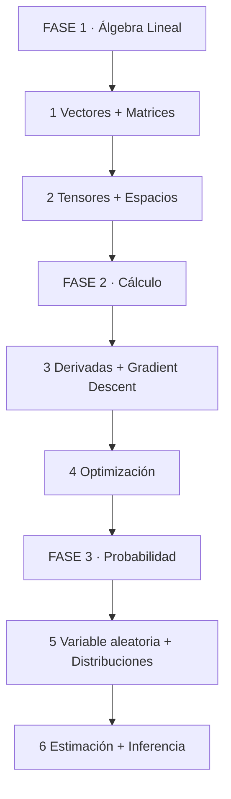
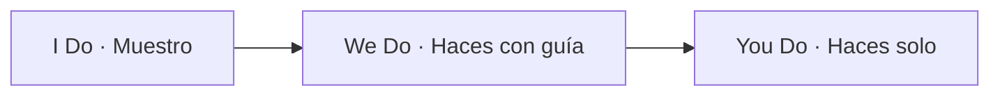
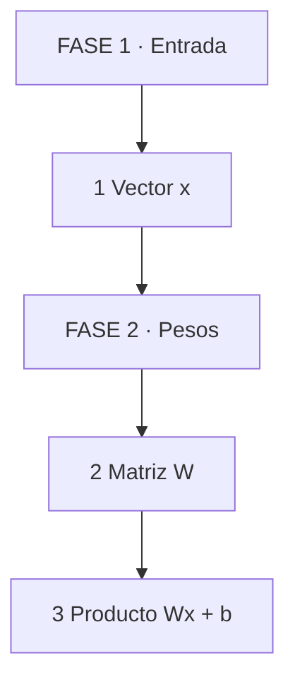
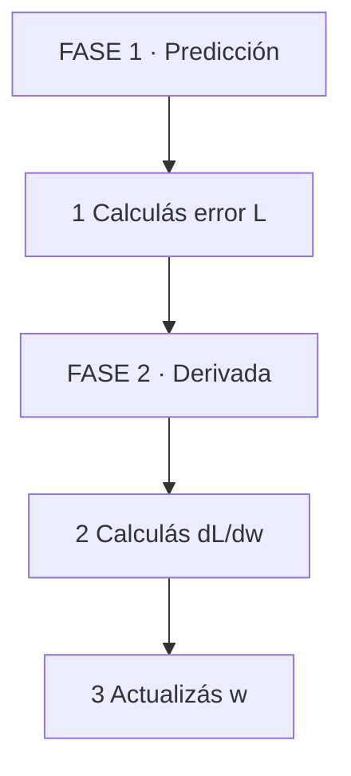
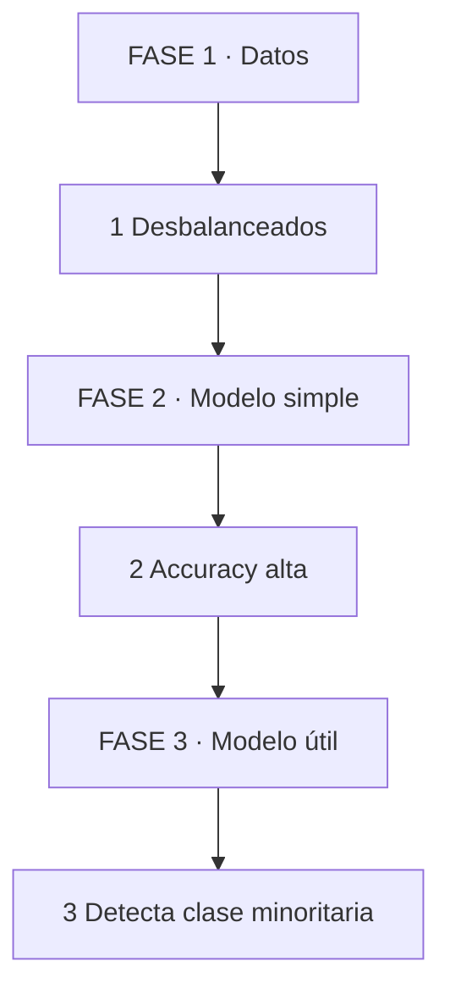

# 🧮 Matemáticas para Inteligencia Artificial: Álgebra Lineal, Cálculo y Probabilidad

## 🗺️ MAPA DE LA GUÍA

*Se lee de arriba hacia abajo. Empezás por álgebra, pasás por cálculo, terminás en probabilidad.*

| 🧩 Fase | ❓ Pregunta que responde | 📤 Resultado principal |
|---------|------------------------|------------------------|
| **FASE 1 · Álgebra** | ¿Cómo represento y transformo datos multidimensionales? | Tensores operables |
| **FASE 2 · Cálculo** | ¿Cómo ajusto parámetros minimizando error? | Gradient Descent |
| **FASE 3 · Probabilidad** | ¿Cómo razono bajo incertidumbre? | Inferencia estadística |

*Se lee de izquierda a derecha. Muestro el razonamiento, lo haces acompañado, lo hacés solo.*

> **🎯 Objetivo** — Al final entenderás por qué las redes neuronales usan matrices, cómo el gradient descent encuentra el mínimo, y cómo la probabilidad interpreta incertidumbre.
> **⚠️ Advertencia** — Sin estos pilares, IA es mecánica: copias código sin entender por qué funciona ni por qué falla.

---

## 🧩 PARTE 1: ÁLGEBRA LINEAL — EL LENGUAJE DE LOS TENSORES

### 1.1 ❓ PRETEST

¿Por qué una imagen se representa como una matriz y no como un array simple?

> Respuesta esperada: Una imagen tiene ancho, alto y canales de color. Esos tres ejes forman un tensor 3D. Una matriz solo tiene filas y columnas, un tensor tiene más dimensiones. Eso permite operar sobre toda la imagen a la vez.
> Si acertás: camino rápido → andá al punto 7.

### 1.2 🎯 POR QUÉ + LOGRO

Importa porque **todo modelo de IA transforma datos con álgebra lineal**. Cada capa de una red neuronal es una multiplicación de matrices seguida de una función no lineal. Sin entender vectores y matrices, no podés debuggear un modelo ni diseñar su arquitectura. Vas a lograr **leer una ecuación de red neuronal y saber qué operación ejecuta**.

### 1.3 ⚡ VICTORIA RÁPIDA (<5 min)

Escribí en papel: una imagen de 28x28 píxeles en escala de grises es un vector de 784 elementos. Esa imagen, pasada por una capa de 10 neuronas, se convierte en un vector de 10 scores. Esa es la transformación algebraica básica.

### 1.4 💡 CONCEPTO

Analogía: El álgebra lineal es como **leer un plano de construcción** — las matrices son las paredes, los vectores son las habitaciones, las operaciones son las conexiones. Si no sabés leer el plano, no podés construir la casa.

Definición: Un vector es una lista de números con dirección y magnitud. Una matriz es una tabla rectangular de números. Un tensor es la generalización a más dimensiones. Las operaciones clave son: suma, producto escalar, producto matricial, transpuesta, inversa y norma. El producto matricial es la operación central de las redes neuronales.

### 1.5 👀 EJEMPLO RESUELTO

| Paso | Tú ves | Qué pasa dentro | Ejemplo |
|------|--------|-----------------|---------|
| 1 Vector | `[x1, x2, x3]` | Lista con magnitud | Entrada de modelo |
| 2 Matriz | `3x3` | Tabla de pesos | Capa densa |
| 3 Producto | `Wx + b` | Transformación lineal | Score por clase |

*Se lee de izquierda a derecha. Entrada vectorial, multiplicada por pesos, produce scores.*

### 1.6 ⚠️ CONTRA-EJEMPLO / Error Típico

Error: Confundir producto punto con producto matricial. El producto punto suma vectores elemento a elemento. El producto matricial combina filas con columnas para producir una nueva matriz. En una red neuronal, cada capa es producto matricial.

Corrección: Visualizá la operación como "cada neurona recibe una fila de pesos multiplicada por el vector de entrada". Eso es producto matricial, no punto.

### 1.7 🧪 PRÁCTICA

Una imagen de 32x32 píxeles RGB entra a una capa densa de 128 neuronas. ¿Cuántos parámetros tiene esa capa (incluyendo bias)?

> Respuesta esperada / criterio: Input = 32 * 32 * 3 = 3072. Pesos = 3072 * 128 = 393,216. Bias = 128. Total = 393,344 parámetros. No incluir el bias es un error común.

### 1.8 🔁 RECALL — Nivel Bloom: Aplicar

¿Por qué el producto matricial es la operación más importante en una red neuronal? Respondé en 1 línea.

### 1.9 📌 IDEA CLAVE

Álgebra lineal convierte datos en representaciones procesables. Sin ella, IA es solo estadística con ruido.

### 1.10 ✅ AUTO-CHEQUEO + SIGUIENTE

- [ ] Entiendo la diferencia entre vector, matriz y tensor
- [ ] Sé calcular el producto matricial de dos matrices pequeñas
- [ ] Sé contar parámetros de una capa densa

Siguiente: Cálculo multivariable y optimización.

---

## 🧩 PARTE 2: CÁLCULO MULTIVARIABLE — LA BRÚJULA DEL APRENDIZAJE

### 2.1 ❓ PRETEST

¿Qué es una derivada parcial y por qué es fundamental para entrenar redes neuronales?

> Respuesta esperada: Es la tasa de cambio de una función respecto a una variable, manteniendo las demás constantes. En IA, mide cómo cambia el error cuando ajustas un solo peso, sin tocar los demás. Eso es lo que usa Gradient Descent.
> Si acertás: camino rápido → andá al punto 7.

### 2.2 🎯 POR QUÉ + LOGRO

Importa porque **todo entrenamiento de modelo es un problema de optimización**. La red neuronal calcula un error y necesita saber en qué dirección ajustar cada peso para reducirlo. Ese sentido se obtiene con derivadas parciales, encadenadas con la regla de la cadena. Vas a lograr **entender por qué una red neuronal aprende y cuándo se traba**.

### 2.3 ⚡ VICTORIA RÁPIDA (<5 min)

Imaginá una colina. Estás ciego y querés llegar al punto más bajo. Sentís la pendiente bajo tus pies: esa sensación es la derivada. Si la pendiente es empinada, das un paso grande. Si es suave, das uno chico. Esa es la intuición de Gradient Descent.

### 2.4 💡 CONCEPTO

Analogía: El cálculo es como **un GPS para el aprendizaje** — la derivada te dice la pendiente del error, y el algoritmo decide cuánto avanzar en esa dirección.

Definición: Derivada parcial = cambio del error al modificar un peso. Gradiente = vector de todas las derivadas parciales. Regla de la cadena = forma de calcular derivadas de funciones compuestas. Gradient Descent = iteración: calcular gradiente, actualizar pesos, repetir. Learning rate = tamaño del paso. Si es muy grande, oscilás. Si es muy chico, tardás eternamente.

### 2.5 👀 EJEMPLO RESUELTO

| Paso | Tú ves | Qué pasa dentro | Ejemplo |
|------|--------|-----------------|---------|
| 1 Error | `L = (predicción - real)^2` | Función de pérdida | MSE |
| 2 Derivada | `dL/dw` | Pendiente respecto a w | Cuánto cambia L al mover w |
| 3 Actualización | `w = w - lr * dL/dw` | Ajuste de peso | Gradient Descent |

*Se lee de izquierda a derecha. Predecís, medís error, calculás pendiente, ajustás peso.*

### 2.6 ⚠️ CONTRA-EJEMPLO / Error Típico

Error: Usar un learning rate de 1.0 en Gradient Descent. El paso es tan grande que el error empieza a oscilar y nunca converge.

Corrección: Empezá con 0.01 o 0.001. Si el error baja, está bien. Si oscila, bajalo a la mitad. Si baja muy lento, subilo un poco.

### 2.7 🧪 PRÁCTICA

Tenés una función `L(w) = (w - 3)^2`. Calculá la derivada en w=5. Si usás learning rate 0.1, ¿cuánto vale w después de 1 paso de Gradient Descent?

> Respuesta esperada / criterio: Derivada = 2(w-3) = 4 en w=5. Actualización: w = 5 - 0.1 * 4 = 4.6. Debe mostrar el cálculo paso a paso, no solo el resultado.

### 2.8 🔁 RECALL — Nivel Bloom: Aplicar

¿Por qué la regla de la cadena es indispensable en redes neuronales profundas? Respondé en 1 línea.

### 2.9 📌 IDEA CLAVE

Gradient Descent es la forma en que una máquina aprende: midiendo pendientes y ajustando pesos paso a paso.

### 2.10 ✅ AUTO-CHEQUEO + SIGUIENTE

- [ ] Sé explicar qué es una derivada parcial en 1 línea
- [ ] Entiendo por qué learning rate muy grande hace diverger el entrenamiento
- [ ] Puedo calcular 1 paso de Gradient Descent a mano

Siguiente: Probabilidad y estadística.

---

## 🧩 PARTE 3: PROBABILIDAD Y ESTADÍSTICA — LA CIENCIA DE LA INCERTIDUMBRE

### 3.1 ❓ PRETEST

¿Por qué la probabilidad es indispensable en IA si el modelo parece determinista?

> Respuesta esperada: Porque los datos tienen ruido, las predicciones son inciertas y el modelo necesita cuantificar esa incertidumbre para tomar decisiones. La probabilidad permite modelar distribuciones, calcular likelihoods y hacer inferencia bayesiana.
> Si acertás: camino rápido → andá al punto 7.

### 3.2 🎯 POR QUÉ + LOGRO

Importa porque **todo modelo estadístico es una declaración de incertidumbre**. Un clasificador que dice "esta imagen es un gato con 95% de confianza" está haciendo probabilidad. Sin estadística, no podés evaluar si tu modelo generaliza ni comparar dos modelos. Vas a lograr **interpretar métricas, validar resultados y diseñar experimentos**.

### 3.3 ⚡ VICTORIA RÁPIDA (<5 min)

Escribí esta afirmación: "Un modelo con 99% de accuracy puede ser peor que uno con 95% si las clases están desbalanceadas". Esa es la primera señal de que necesitás estadística para no mentirte con números.

### 3.4 💡 CONCEPTO

Analogía: La probabilidad es como **pronosticar clima** — no podés asegurar si llueve, pero podés calcular la chance. Eso es lo que hace un modelo de IA: da probabilidades, no certezas.

Definición: Variable aleatoria = resultado de un proceso aleatorio. Distribución = regla que asigna probabilidades a valores. Esperanza = valor promedio. Varianza = dispersión. Likelihood = qué tan plausible son los datos dada una hipótesis. Inferencia bayesiana = actualizar creencias con datos. Test de hipótesis = decidir si un efecto es real o casualidad.

### 3.5 👀 EJEMPLO RESUELTO

| Paso | Tú ves | Qué pasa dentro | Ejemplo |
|------|--------|-----------------|---------|
| 1 Dataset | 1000 imágenes, 50 gatos | Clase desbalanceada | Accuracy engañosa |
| 2 Modelo A | Predice siempre perro | 950 aciertos | 95% accuracy |
| 3 Modelo B | Predice con criterio | 920 aciertos | 92% accuracy, pero detecta gatos |

*Se lee de izquierda a derecha. Datos desbalanceados, modelo simple engaña, modelo útil requiere criterio estadístico.*

### 3.6 ⚠️ CONTRA-EJEMPLO / Error Típico

Error: Confiar en accuracy como única métrica en clasificación desbalanceada. Un modelo que predice siempre la clase mayoritaria puede tener 90% de accuracy y ser inútil.

Corrección: Usá precision, recall y F1-score. Entendé la matriz de confusión. Si la clase minoritaria es la importante, priorizá recall sobre accuracy.

### 3.7 🧪 PRÁCTICA

Tenés un test de detección de spam: 1000 emails, 100 spam. Modelo A detecta 90 spam de 100 (recall 90%) pero marca 50 no-spam como spam (precision 64%). Modelo B detecta 70 spam (recall 70%) pero marca 20 no-spam como spam (precision 78%). ¿Cuál es mejor? ¿Por qué?

> Respuesta esperada / criterio: Depende del costo de falsos positivos vs falsos negativos. Si marcar no-spam como spam es grave, Modelo B. Si perder spam es grave, Modelo A. Debe mencionar F1-score y el trade-off.

### 3.8 🔁 RECALL — Nivel Bloom: Evaluar

¿Por qué un modelo puede tener alta accuracy y bajo F1-score al mismo tiempo? Explicá en 1 línea.

### 3.9 📌 IDEA CLAVE

Probabilidad convierte certezas ficticias en decisiones informadas. Sin ella, tus métricas mienten.

### 3.10 ✅ AUTO-CHEQUEO + SIGUIENTE

- [ ] Entiendo qué es una variable aleatoria y una distribución
- [ ] Sé explicar por qué accuracy no basta en datos desbalanceados
- [ ] Puedo calcular precision y recall a partir de una matriz de confusión

---

## 🧩 PARTE 4: EJERCICIOS INTEGRADOS Y VERIFICACIÓN

### 4.1 🧪 EJERCICIO 1: Álgebra + Cálculo

Una capa densa recibe un vector de entrada de 784 elementos (imagen aplanada) y tiene 256 neuronas. Calculá cuántas operaciones de multiplicación y suma hay en la forward pass (sin bias).

> Respuesta: 784 * 256 = 200,704 multiplicaciones. 256 sumas (una por neurona). Total: 200,704 multiplicaciones + 256 sumas.

### 4.2 🧪 EJERCICIO 2: Cálculo + Optimización

La función de pérdida es `L(w) = w^2 + 2w + 1`. Calculá el mínimo analítico (derivada igual a cero) y verificá con 2 pasos de Gradient Descent desde w=5 con learning rate 0.1.

> Respuesta: Derivada = 2w + 2 = 0 → w = -1. Paso 1: w = 5 - 0.1 * 12 = 3.8. Paso 2: w = 3.8 - 0.1 * 9.6 = 2.84. Se acerca a -1.

### 4.3 🧪 EJERCICIO 3: Probabilidad + Álgebra

Un modelo de clasificación devuelve logits `[2.0, 1.0, 0.1]`. Aplicá softmax manualmente para obtener probabilidades. Verificá que suman 1.

> Respuesta: exp(2)=7.39, exp(1)=2.72, exp(0.1)=1.11. Suma = 11.22. Probabilidades: 0.658, 0.242, 0.099. Suma ≈ 1.0.

### 4.4 🧪 EJERCICIO 4: Integración completa

Una red neuronal tiene: entrada 784 → capa oculta 256 (ReLU) → salida 10 (softmax). Describí en 3 líneas qué operaciones matemáticas ocurren en cada etapa, sin escribir código.

> Respuesta: Entrada se multiplica por matriz 784x256, se suma bias, se aplica ReLU (max(0,x)). Esa salida se multiplica por matriz 256x10, se suma bias, se aplica softmax para obtener probabilidades por clase.

---

## 📝 PREGUNTAS DE VERIFICACIÓN

1. **Aplica**: ¿Cuántos parámetros tiene una capa convolucional de 3x3 kernel, 3 canales de entrada, 64 filtros? Mostrá el cálculo.
2. **Analiza**: ¿Por qué un learning rate muy pequeño hace que el entrenamiento parezca "estancado"? Mencioná 2 causas.
3. **Diseña**: Diseñá una métrica para evaluar un modelo de detección de fraude con clases 99% no fraude / 1% fraude. ¿Por qué accuracy no sirve?
4. **Reflexiona**: ¿Por qué la regla de la cadena es indispensable en backpropagation? Explicá con un ejemplo de 2 capas.
5. **Evalúa**: Un modelo tiene precision 0.85 y recall 0.60. ¿Es mejor o peor que uno con precision 0.75 y recall 0.80? Justificá con F1-score.
6. **Conecta**: ¿Cómo se relacionan el producto matricial de álgebra lineal y el gradient descent de cálculo en el entrenamiento de una red?
7. **Propón**: Explicá por qué normalizar datos (media 0, desvío 1) ayuda al entrenamiento, usando conceptos de cálculo y probabilidad.
8. **Síntesis**: Explicá en 3 líneas cómo los 3 pilares (álgebra, cálculo, probabilidad) se integran en un clasificador de imágenes.

---

## 📚 GLOSARIO

| Término | Definición en 1 línea |
|---------|-----------------------|
| **Vector** | Lista ordenada de números con magnitud y dirección |
| **Matriz** | Tabla rectangular de números organizada en filas y columnas |
| **Tensor** | Generalización de vectores y matrices a más dimensiones |
| **Producto matricial** | Operación que combina filas y columnas para producir una nueva matriz |
| **Derivada parcial** | Tasa de cambio de una función respecto a una variable |
| **Gradiente** | Vector de todas las derivadas parciales |
| **Gradient Descent** | Algoritmo que ajusta parámetros en dirección opuesta al gradiente |
| **Learning rate** | Tamaño del paso en Gradient Descent |
| **Función de pérdida** | Medida de error entre predicción y realidad |
| **Variable aleatoria** | Resultado numérico de un proceso aleatorio |
| **Distribución** | Función que asigna probabilidades a valores posibles |
| **Softmax** | Función que convierte logits en probabilidades que suman 1 |
| **Precision** | Proporción de positivos predichos que son correctos |
| **Recall** | Proporción de positivos reales detectados |
| **F1-score** | Media armónica entre precision y recall |
| **Bayesiano** | Enfoque que trata parámetros como variables aleatorias |
| **Likelihood** | Probabilidad de los datos dada una hipótesis |
| **Normalización** | Escalar datos a media 0 y desvío 1 para acelerar entrenamiento |
