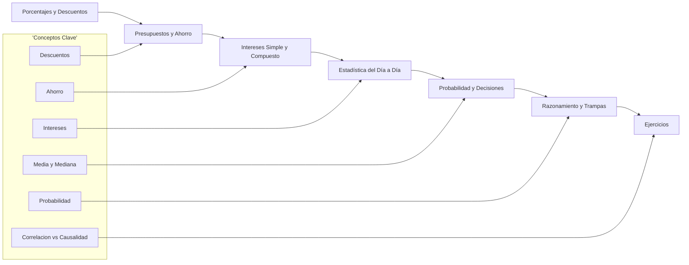
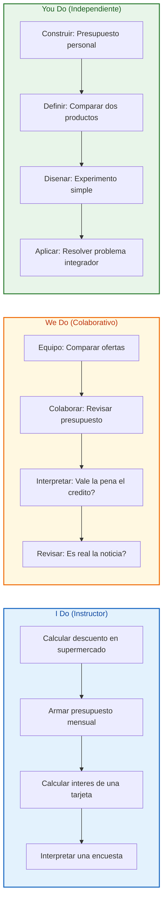
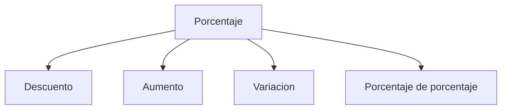
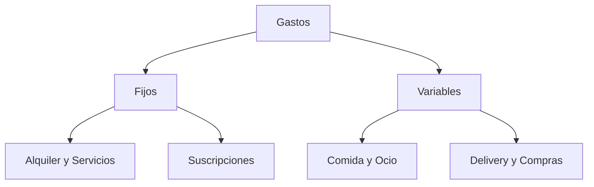
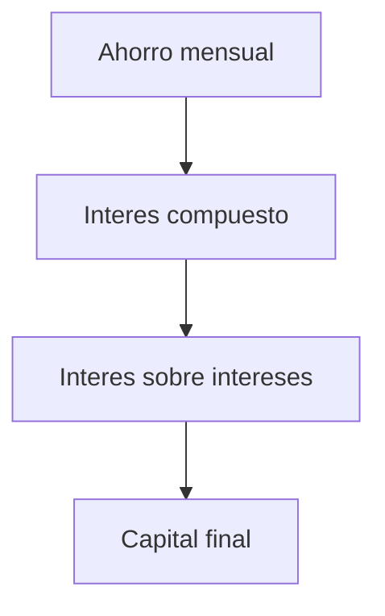
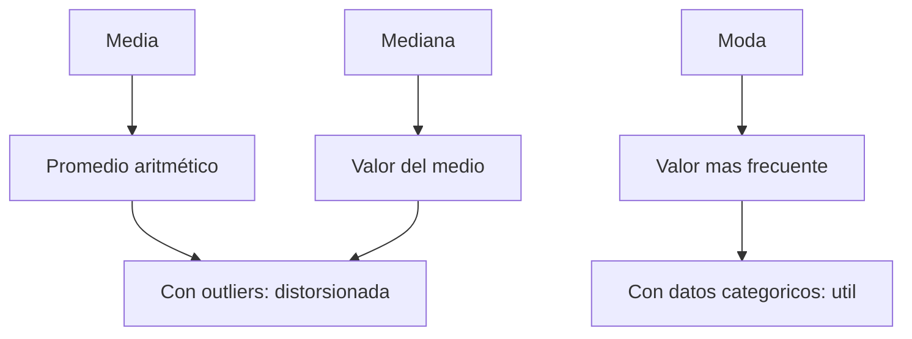
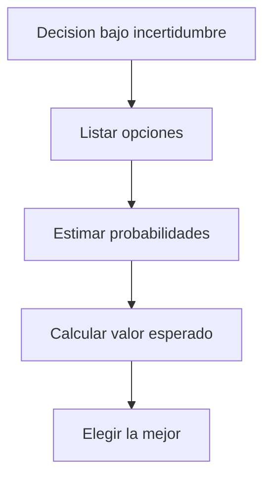
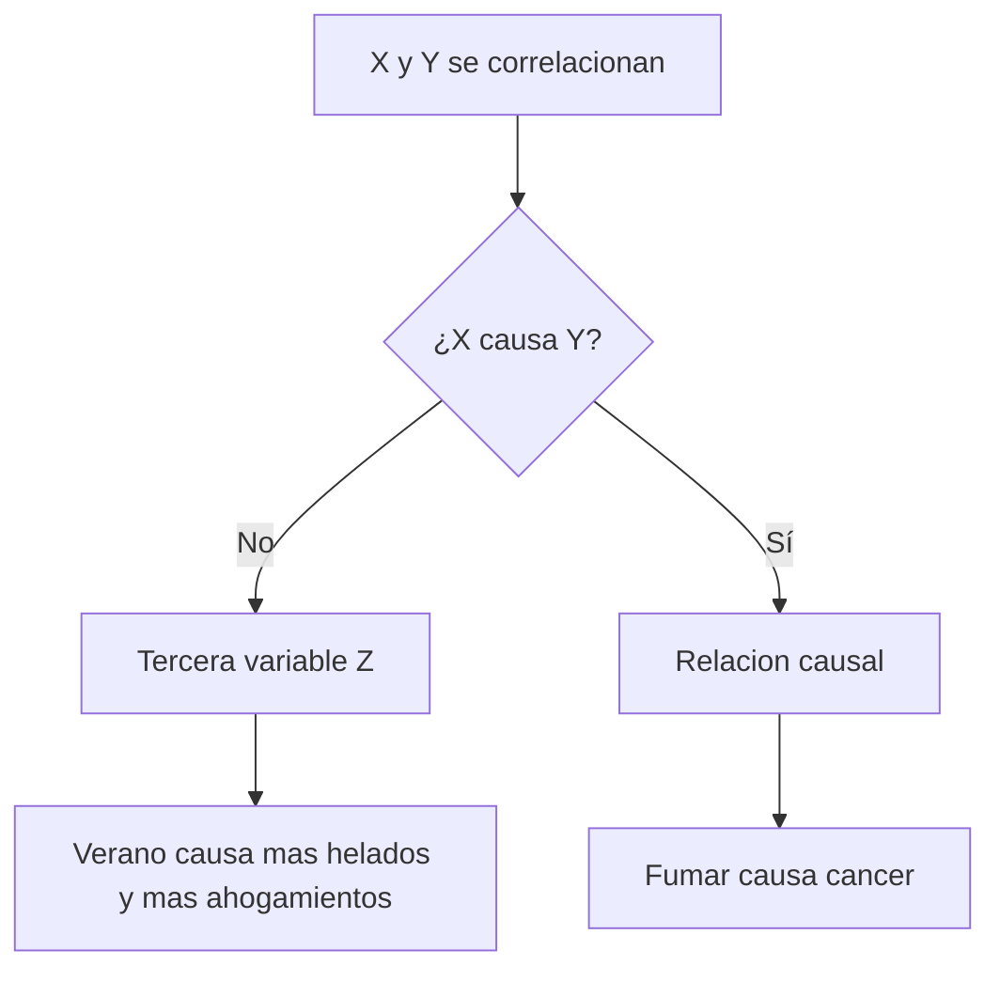

# MASTERCLASS: Matemáticas para la Vida Cotidiana — Las Habilidades que Sí Usás Cada Día

## INTRODUCCIÓN: POR QUÉ ESTE MASTERCLASS ES DIFERENTE

La matemática escolar suele sentirse como un castigo: fórmulas sin sentido, ejercicios sin contexto y números que no sirven para nada. Pero la **matemática de la vida real** es otra cosa. Es la herramienta que te permite:

- Saber si un descuento del "50%" es real o una trampa
- Comparar cuál tarjeta de crédito te cobra menos
- Entender por qué tu ahorro crece lento o rápido
- No caer en la trampa de "correlación es causalidad" cuando leés una noticia
- Tomar mejores decisiones con incertidumbre (¿lloverá mañana? ¿Tomar el autobús o caminar?)

Este masterclass no te va a enseñar a resolver ecuaciones de grado 5. Te va a enseñar a **pensar con números** para el día a día. El nivel es promedio de América Latina: chilena, uruguaya, brasileña o colombiana. Los ejemplos son de supermercados, sueldos, tarjetas, transportes y finanzas personales — cosas que vivís cada semana.

> **Objetivo de Aprendizaje** — Al final de esta guía, podrás calcular porcentajes y descuentos sin calculadora, manejar presupuestos personales, entender intereses simple y compuesto, interpretar estadísticas básicas del día a día, aplicar probabilidad simple y distinguir correlación de causalidad en ejemplos reales.

> **Advertencia educativa** — Este contenido es formativo. Las finanzas personales y las decisiones económicas requieren contexto, paciencia y, a veces, asesoramiento profesional. Ningún cálculo aquí presentado debe interpretarse como recomendación financiera.

---

## MAPA DEL MASTERCLASS



| Fase | Pregunta que responde | Output principal |
|------|-----------------------|------------------|
| **Porcentajes** | ¿Cuánto ahorro y cuánto pago? | Descuentos, aumentos y variación |
| **Presupuestos** | ¿A dónde va cada peso? | Ingresos, gastos y ahorro |
| **Intereses** | ¿Crece o se come mi dinero? | Interés simple, compuesto y APR |
| **Estadística** | ¿Qué dicen los números del mundo? | Media, mediana, dispersión |
| **Probabilidad** | ¿Qué tan probable es? | Eventos y decisiones bajo incertidumbre |
| **Razonamiento** | ¿Es real o es una trampa? | Correlación vs causalidad |
| **Ejercicios** | ¿Lo domino? | I Do / We Do / You Do |



---

## PARTE 1: PORCENTAJES Y DESCUENTOS — DINERO EN TUS MANOS

### 1.1 Por qué los porcentajes importan

Casi todas las transacciones del día a día llevan un porcentaje escondido: un descuento, un impuesto, una comisión, un aumento. Saber calcularlos rápidamente te evita:

- Pagar de más por algo que dice "50% de descuento" pero no lo es
- Confundir "aumento del 20%" con "el precio subió a 20%"
- No darte cuenta de cuánto te cobra realmente la tarjeta

### 1.2 Las tres operaciones básicas

| Operación | Fórmula mental | Ejemplo |
|-----------|----------------|---------|
| **Descuento** | Precio · (1 - p/100) | $100 - 25% = $75 |
| **Aumento** | Precio · (1 + p/100) | $100 + 20% = $120 |
| **Variación** | (nuevo - viejo) / viejo · 100 | De $50 a $60 = 20% |



> **Tip** — Un "50% de descuento" sobre un precio que ya estaba subido es un descuento real de mucho menos. Si algo cuesta $100 y lo venden a $50, el descuento es del 50%. Pero si subieron el precio a $200 y luego dicen "50% de descuento", venden a $100: el precio real no bajó.

### 1.3 Trampas comunes en los supermercados

| Trampa ❌ | Qué pasa | Cómo evitarla ✅ |
|----------|----------|----------------|
| "Precios reducidos" sin indicar % | No sabes el descuento real | Calcular tu mismo |
| "50% de descuento" sobre precio inflado | El ahorro real es menor | Comparar con otro local |
| "Por cada uno, llévate dos" | Parece 50% pero puede ser 33% | Revisar el precio unitario |
| "Descuento por tarjeta X" | Solo si usas esa tarjeta | Sumar costos ocultos |

### 1.4 I Do — Resolver un problema de descuento

**Problema:** una camiseta cuesta $80. Tiene un descuento del 25%. ¿Cuánto pagás?

| Paso | Acción | Resultado |
|------|--------|-----------|
| 1 | Identificar descuento | 25% de $80 |
| 2 | Calcular | 0.25 · 80 = $20 |
| 3 | Restar | 80 - 20 = $60 |
| 4 | O usar fórmula directa | 80 · (1 - 0.25) = $60 |

**Interpretación:** pagás $60. El "ahorro" de $20 es el 25% del precio original.

### 1.5 We Do — Comparar dos ofertas

**Problema:** un televisor cuesta $400 en un local y $320 en otro. ¿Cuánto por ciento ahorraste comprando en el segundo?

| Paso | Acción | Resultado |
|------|--------|-----------|
| 1 | Diferencia | 400 - 320 = $80 |
| 2 | Dividir por precio original | 80 / 400 = 0.20 |
| 3 | Convertir a porcentaje | 0.20 · 100 = 20% |

**Conclusión:** ahorraste un 20%.

---

## PARTE 2: PRESUPUESTOS Y AHORRO — A DÓNDE VA CADA PESO

### 2.1 El presupuesto básico

Un presupuesto no es una prisión. Es un mapa. Te dice: si gastás X en algo, no podés gastar X en otra cosa. El primer paso es anotar todos tus ingresos y gastos.

| Concepto | Definición | Ejemplo |
|----------|------------|---------|
| **Ingreso neto** | Lo que realmente llega a tu cuenta | Sueldo menos impuestos |
| **Gasto fijo** | Lo mismo cada mes | Alquiler, servicios, cuotas |
| **Gasto variable** | Cambia según gastás | Supermercado, salidas, delivery |
| **Ahorro** | Lo que no gastás | Se pone aside antes de gastar |

### 2.2 La regla 50/30/20 (adaptada)

| Porcentaje | Destino | Ejemplo con $500.000 mensuales |
|------------|---------|-------------------------------|
| **50%** | Necesidades | $250.000 (alquiler, servicios, comida) |
| **20%** | Ahorro e inversiones | $100.000 (fondo de emergencia) |
| **30%** | Gastos variables | $150.000 (ocio, ropa, delivery) |

> **Tip** — La regla 50/30/20 es una guía. Si tu alquiler supera el 50%, ajusta: reduce gastos variables o busca ingresos extra. El punto clave es **ahorrar primero**.

### 2.3 Gasto fijo vs. variable: ¿dónde está el control?

| Gasto fijo ❌ / ✅ | Gasto variable ❌ / ✅ |
|-------------------|----------------------|
| Suscripción que no usás | Delivery todos los días |
| Seguro que no necesitás | Cine cada fin de semana |
| Cuota de gimnasio sin ir | Compras por impulso |



### 2.4 I Do — Armar un presupuesto personal

**Objetivo:** distribuir un ingreso de $400.000 en una mesa.

| Categoría | % | Importe |
|-----------|---|---------|
| Necesidades (alquiler, servicios, comida) | 50% | $200.000 |
| Ahorro e inversión | 20% | $80.000 |
| Gastos variables (ocio, ropa) | 30% | $120.000 |

**Clave:** el 20% de ahorro se va al fondo de emergencia antes de gastar en otra cosa.

### 2.5 We Do — Encontrar el gasto oculto

**Escenario:** tu presupuesto dice $120.000 en gastos variables, pero terminás gastando $180.000.

| Paso | Acción | Resultado |
|------|--------|-----------|
| 1 | Comparar planeado vs real | +$60.000 extra |
| 2 | Detallar movimientos | $25.000 delivery, $20.000 cafés, $15.000 suscripciones |
| 3 | Identificar patrón | Delivery y cafés fuera de control |
| 4 | Proponer fix | Límite de $50.000 mensuales |

**Conclusión:** el gasto "pequeño" sumado es grande. Un café diario de $500 = $15.000 al mes.

---

## PARTE 3: INTERESES SIMPLE Y COMPUESTO — EL PODER DE TU DINERO

### 3.1 Interés simple vs. compuesto

El **interés simple** es lineal: cada mes ganas lo mismo. El **interés compuesto** es exponencial: los intereses generan intereses. La diferencia es el secreto del "rico poco a poco" vs. "pobre rápido".

| Tipo | Fórmula | Ejemplo: $10.000 al 10% anual |
|------|---------|-------------------------------|
| **Simple** | Principal · tasa · tiempo | Año 1: $1.000, Año 3: $3.000 |
| **Compuesto** | Principal · (1 + tasa)^tiempo | Año 1: $1.000, Año 3: $3.310 |

### 3.2 Ejemplo con un fondo de emergencia

Si ahorrás $50.000 mensuales durante 1 año sin intereses, tenés $600.000. Pero si el 2% mensual se compone:



| Mes | Ahorro | Interés 2% | Total |
|-----|--------|-------------|-------|
| 1 | $50.000 | $1.000 | $51.000 |
| 2 | $50.000 | $1.120 | $102.120 |
| 3 | $50.000 | $1.244 | $153.364 |
| ... | ... | ... | crece acelerado |
| 12 | $50.000 | $2.231 | $622.304 |

**Resultado:** con interés compuesto ganás $22.304 extra sin hacer nada.

> **Tip** — El interés compuesto necesita tiempo. Si dejás tus $600.000 5 años más al 2% mensual, llegás a más de $1 millón. La paciencia es la herramienta matemática más poderosa.

### 3.3 Tarjetas de crédito: el interés más caro

Las tarjetas suelen cobrar **interés compuesto mensual** del 3-5%. Si te atrasás un mes con $100.000:

| Mes | Deuda | Interés 4% | Total |
|-----|-------|------------|-------|
| 1 | $100.000 | $4.000 | $104.000 |
| 2 | $104.000 | $4.160 | $108.160 |
| 3 | $108.160 | $4.326 | $112.486 |

> **Tip** — Pagar solo el mínimo (2-3% de la deuda) puede extendir una deuda años. Siempre pagá el saldo completo o lo más posible.

### 3.4 APR vs. Tasa nominal

La **tasa nominal** es lo que te dicen. El **APR** (Tasa Anual Equivalente) incluye comisiones y compounding. Es la tasa real que pagás.

| Producto | Tasa nominal | APR real | Diferencia |
|----------|-------------|----------|------------|
| Préstamo bancario | 12% mensual | 18% anual | +6% por comisiones |
| Tarjeta de crédito | 40% anual | 48% APR | +8% por compounding |
| Depósito a plazo | 5% anual | 5.1% APR | +0.1% por compounding |

### 3.5 I Do — Calcular el interés compuesto de un ahorro

**Problema:** depositás $100.000 en un fondo que paga 0.5% mensual de interés compuesto. ¿Cuánto tenés después de 2 años?

| Paso | Acción | Resultado |
|------|--------|-----------|
| 1 | Identificar datos | Principal = $100.000, tasa = 0.5%, tiempo = 24 meses |
| 2 | Aplicar fórmula | 100.000 · (1 + 0.005)^24 |
| 3 | Calcular | 100.000 · 1.127 = $112.712 |
| 4 | Interpretación | Ganancia de $12.712 en 2 años |

### 3.6 We Do — Comparar dos opciones de ahorro

**Problema:** opción A paga 6% anual simple, opción B paga 5.5% anual compuesto. ¿Cuál es mejor para $200.000 en 3 años?

| Opción | Cálculo | Resultado |
|--------|---------|-----------|
| **Simple** | 200.000 · (1 + 0.06 · 3) | $236.000 |
| **Compuesto** | 200.000 · (1 + 0.055)^3 | $234.955 |

**Conclusión:** la opción simple (6%) rinde $1.045 más que la compuesta (5.5%) en 3 años. Pero si el plazo fuera de 10 años, la compuesta ganaría.

---

## PARTE 4: ESTADÍSTICA DEL DÍA A DÍA — NO TE MANIPULON CON NÚMEROS

### 4.1 Media vs. mediana: la trampa del "promedio"

La **media** es lo que sumás todo y dividís. La **mediana** es el valor del medio. La diferencia importa mucho cuando hay valores extremos.

| Edad de un equipo | 22, 24, 25, 26, 28, 30, 32, 35, 38, 52 |
|-------------------|----------------------------------------|
| **Media** | (22+24+25+26+28+30+32+35+38+52)/10 = 31.2 |
| **Mediana** | Promedio de 28 y 30 = 29 |

> **Tip** — La mediana ($29) representa mejor la edad típica que la media ($31.2) porque el 52 añosizado estira el promedio hacia arriba.



### 4.2 Trampas con porcentajes de cambio

| Trampa ❌ | Ejemplo | Correcto ✅ |
|----------|---------|------------|
| "Se redujo un 50%" | Precio bajó de $200 a $100 | ¡Correcto! |
| "Se redujo un 100%" | Precio bajó de $200 a $0 | ¡Imposible! Nunca es 100% si sigue teniendo valor |
| "Subió 150%" | Precio subió de $100 a $250 | ¡Correcto! |
| "Subió 150%" | Precio subió de $100 a $150 | ❌ ¡Falso! Eso es un 50% |

**Fórmula de variación:** `(nuevo - viejo) / viejo × 100`

### 4.3 Interpretar encuestas y estadísticas

Cuando ves una noticia que dice "el 73% de los usuarios mejoró su rendimiento", buscá:

| Pregunta | Qué buscar |
|----------|------------|
| ¿De dónde salen los datos? | Muestra representativa o solo usuarios activos |
| ¿Cuál era el criterio de "mejoró"? | ¿Definición clara o ambigua? |
| ¿Hubo grupo de control? | ¿Compararon con un grupo que no usó el producto? |
| ¿Cuántos participaron? | 10 personas ≠ 1.000 personas |

> **Tip** — Un porcentaje sin contexto (muestra, margen de error, grupo de control) es como un mapa sin escala.

### 4.4 I Do — Calcular media y mediana

**Problema:** las notas de un examen son: 4, 5, 5, 6, 7, 7, 7, 8, 9, 10.

| Medida | Cálculo | Resultado |
|--------|---------|-----------|
| **Media** | 62 / 10 | 6.2 |
| **Mediana** | Promedio de 7 y 7 | 7 |
| **Moda** | El más frecuente | 7 |

**Interpretación:** la media (6.2) es menor que la mediana (7) porque el 4 estira hacia abajo. La nota más común es 7.

### 4.5 We Do — Detectar manipulación estadística

**Afirmación:** "Las ventas de nuestra app subieron 300% este mes".

| Paso | Pregunta | Análisis |
|------|----------|----------|
| 1 | ¿De dónde partió el 100%? | De 10 a 40 usuarios: el salto es pequeño en números reales |
| 2 | ¿Es sostenible? | ¿Subirá otro 300%? Probablemente no |
| 3 | ¿Qué dice el competidor? | Si el competidor bajó 50%, la comparativa cambia |

**Conclusión:** un 300% suena impactante, pero de 10 a 40 usuarios no es relevante a menos que la base crezca.

---

## PARTE 5: PROBABILIDAD Y DECISIONES — CUANDO NO TENÉS TODA LA INFO

### 5.1 Probabilidad simple: la regla de Laplace

Para eventos con resultados igualmente probables:

```text
P(evento) = casos favorables / casos posibles
```

| Experimento | Favorables | Posibles | Probabilidad |
|-------------|------------|----------|--------------|
| Lanzar dado, salga 6 | 1 | 6 | 1/6 ≈ 16.7% |
| Sacar cara en una moneda | 1 | 2 | 1/2 = 50% |
| Tomar una carta roja | 26 | 52 | 1/2 = 50% |

### 5.2 Decisiones con incertidumbre

La vida es una secuencia de decisiones bajo incertidumbre. La matemática te ayuda a elegir racionalmente.



### 5.3 Valor esperado: el prode 2026

Vos entrás al quini con un ticket de $100. El premio es $50.000.000. La probabilidad de ganar es 1 entre 15.000.000.

| Concepto | Cálculo | Resultado |
|----------|---------|-----------|
| **Valor esperado** | (1/15M × $50M) + (14.999.999M/15M × $0) | $3.33 |
| **Costo del ticket** | $100 | -$100 |
| **Valor neto** | $3.33 - $100 | **-$96.67** |

> **Tip** — El valor esperado es negativo. Jugar al quini es pagar $96.67 de emoción por una esperanza matemática. No significa que no puedas jugar, pero hay que entender el costo real.

### 5.4 I Do — Evaluar un seguro

**Problema:** un seguro de celular cuesta $5.000 al mes. El celular cuesta $300.000. La probabilidad de romperlo en un año es 10%.

| Concepto | Cálculo | Resultado |
|----------|---------|-----------|
| **Costo esperado de romper** | 10% × $300.000 | $30.000 |
| **Costo del seguro anual** | $5.000 × 12 | $60.000 |
| **Conclusión** | El seguro cuesta el doble del daño esperado | No conviene si sos conservador |

### 5.5 We Do — Elegir transporte

**Problema:** debés decidir entre colectivo ($500) o taxi ($2.000) hoy. El clima es incierto.

| Opción | Prob. de lluvia | Costo si llueve | Costo si no llueve | Esperado |
|--------|-----------------|-----------------|--------------------|----------|
| **Colectivo + paraguas** | 30% | $500 (se moja) | $500 | $500 |
| **Colectivo sin paraguas** | 30% | $1.500 (taxi después) | $500 | $800 |
| **Taxi directo** | 30% | $2.000 | $2.000 | $2.000 |

**Conclusión:** el colectivo con paraguas ($500) es la mejor opción esperada. La mejor decisión es planificar para ambos escenarios.

---

## PARTE 6: RAZONAMIENTO Y TRAMPAS — NO TE ENGAÑEN

### 6.1 Correlación ≠ causalidad

La frase más importante que aprendés hoy: **dos variables que se mueven juntas no significan que una causa la otra**.

| Correlación | ¿Causalidad? | Explicación |
|-------------|--------------|-------------|
| Más helados → más ahogamientos | ❌ No | Ambas suben en verano |
| Más estudios → más ingresos | ⚠️ Parcial | Educación, redes, oportunidades |
| Fumar → cáncer de pulmón | ✅ Sí | Mecanismo biológico comprobado |
| Usar celular → menos sueño | ⚠️ Probable | Luz azul y ansiedad |



> **Frase del profe** — *"Correlación no implica causalidad. El número de películas de Nic Cage se correlaciona con las muertes en piscina. ¿Causa Cage las muertes? No. Ambas dependen del tiempo."*

### 6.2 La falacia del "agrupamiento"

| Falacia ❌ | Ejemplo real | Realidad ✅ |
|-----------|-------------|------------|
| "En mi colegio pasó" | Un caso de éxito en 30 años | Probabilidad individual baja |
| "Todos los de mi barrio" | Generalizar 100 personas | Muestra no representativa |
| "Los de mi edad" | Edad ≠ experiencia | Muchos factores intervienen |

### 6.3 Preguntas para no ser engañado

Cuando leés una noticia o estadística, hacé estas preguntas:

| Pregunta | Qué busca |
|----------|------------|
| ¿Qué muestra el gráfico? | Título, ejes y escala |
| ¿De dónde vienen los datos? | Fuente confiable o sesgada |
| ¿Es correlación o causalidad? | ¿Proponen una relación directa? |
| ¿Cuál es el tamaño de la muestra? | 5 personas ≠ 5000 personas |
| ¿Qué no dice? | ¿Oculta información importante? |

### 6.4 Trampas visuales en gráficos

| Trampa ❌ | Por qué engaña | Correcto ✅ |
|-----------|----------------|------------|
| Eje Y que no empieza en 0 | Exagera diferencias | Fijarse en la escala |
| Barras de anchos distintos | Engaña comparación | Verificar proporción |
| Pictogramas que crecen en área | Multiplica la impresión | Comparar valores numéricos |
| Títulos tendenciosos | Influye interpretación | Leer datos, no el título |

### 6.5 I Do — Analizar una afirmación engañosa

**Afirmación:** "Las ventas de nuestra app subieron 150%. ¡Invertí ahora!"

| Paso | Análisis | Conclusión |
|------|----------|------------|
| 1 | ¿De dónde partió el 100%? | De 200 a 500 usuarios |
| 2 | ¿Hay contexto? | No menciona competencia ni tendencia |
| 3 | ¿Es causalidad? | Solo muestra un aumento, no causa |
| 4 | ¿Cuál es la base real? | 200 usuarios es muy poca base |

**Conclusión:** el 150% de 200 es solo 300 usuarios. Sin más contexto, es una señal débil.

---

## PARTE 7: I DO / WE DO / YOU DO — EJERCICIOS PROGRESIVOS

### 7.1 I Do — Calcular un descuento y IVA combinados 👨‍🏫

**Problema:** una notebook cuesta $800.000. Tiene 20% de descuento y el IVA es 21%. ¿Cuánto pagás al final?

| Paso | Acción | Resultado |
|------|--------|-----------|
| 1 | Aplicar descuento | 800.000 · 0.80 = $640.000 |
| 2 | Aplicar IVA | 640.000 · 1.21 = $774.400 |
| 3 | Interpretar | El descuento de $160.000 es parcialmente comido por el IVA |

> **Tip** — El descuento es sobre el precio sin IVA. El ahorro real es el 20% del precio base, no del total con IVA.

### 7.2 We Do — Armar un presupuesto 🤝

**Problema:** tu ingreso mensual es de $450.000. Tus gastos fijos son:

| Concepto | Importe |
|----------|---------|
| Arriendo | $180.000 |
| Servicios | $30.000 |
| Teléfono + internet | $20.000 |
| Cuota gym | $25.000 |
| Suscripción streaming | $15.000 |
| Envíos | $15.000 |

| Paso | Cálculo | Resultado |
|------|---------|-----------|
| 1 | Total fijo | $290.000 |
| 2 | Disponible | 450.000 - 290.000 = $160.000 |
| 3 | Ahorro 20% | 20% de 450.000 = $90.000 |
| 4 | Restante para variables | $70.000 |

**Conclusión:** después del ahorro, te quedan $70.000 para comida, transporte y ocio. Ajustá los gastos variables para no superar este monto.

### 7.3 You Do — Calcular interés compuesto 💪

**Problema:** depositás $200.000 en un fondo que paga 1% mensual de interés compuesto. ¿Cuánto tenés después de 1 año (12 meses)? ¿Y después de 2 años?

| Paso | Acción | Resultado |
|------|--------|-----------|
| 1 | Identificar fórmula | Principal · (1 + tasa)^meses |
| 2 | Calcular 1 año | 200.000 · (1.01)^12 = ? |
| 3 | Calcular 2 años | 200.000 · (1.01)^24 = ? |
| 4 | Comparar con simple | ¿Cuánto ganás extra por compounding? |

### 7.4 I Do — Interpretar una estadística 👨‍🏫

**Enunciado:** "El 85% de los encuestados prefirió el producto B".

| Paso | Pregunta | Análisis |
|------|----------|----------|
| 1 | ¿Quiénes son los encuestados? | ¿Clientes reales o usuarios voluntarios? |
| 2 | ¿Cuántos participaron? | Si fueron solo 20, no es significativo |
| 3 | ¿Cómo se hizo la encuesta? | ¿Aleatoria o autocitada? |
| 4 | ¿Qué respondieron el resto? | El 15% restante también importa |

**Conclusión:** un 85% sin contexto de muestra puede ser engañoso. Siempre buscá el tamaño y método de la muestra.

### 7.5 We Do — Decidir si un seguro conviene 🤝

**Problema:** un seguro de notebook cuesta $15.000 al mes ($180.000 al año). El notebook cuesta $500.000. La probabilidad anual de daño es 5%.

| Cálculo | Resultado |
|---------|-----------|
| Costo esperado del daño | 5% × $500.000 = $25.000 |
| Costo del seguro anual | $180.000 |
| Diferencia | El seguro cuesta 7× más del daño esperado |

**Pregunta para el equipo:** si no sos buen cuidador de dispositivos, ¿vale la tranquilidad del seguro? El costo matemático no conviene, pero el valor emocional sí puede justificarlo.

### 7.6 You Do — Diseñar un experimento simple 💪

**Tarea:** decidís que caminar 30 minutos al día mejora tu humor. Diseñá un experimento para probarlo.

| Paso | Acción |
|------|--------|
| 1 | Define tu variable: ¿cómo medís el humor? |
| 2 | Define tu variable independiente: ¿caminatas o no caminatas? |
| 3 | Diseña el grupo de control: ¿qué harás los días "sin caminar"? |
| 4 | Establece el período: ¿cuántos días probás? |
| 5 | Registra resultados: ¿sube el humor realmente? |

Criteria:
| Concepto | Peso |
|----------|------|
| Variables bien definidas | 25% |
| Grupo de control claro | 25% |
| Período suficiente | 25% |
| Interpretación honesta | 25% |

---

## CHECKLIST FINAL DE MATEMÁTICAS PRÁCTICAS ✅

| Bloque | Check |
|--------|-------|
| **Porcentajes** | Calculas descuentos, aumentos y variación sin errores |
| **Presupuestos** | Diferenciás fijos de variables y ahorrás primero |
| **Intereses** | Sabés cómo afecta el compounding y la APR |
| **Estadística** | Distinguís media de mediana y detectás manipulación |
| **Probabilidad** | Calculás valor esperado y usás probabilidad en decisiones |
| **Razonamiento** | Identificás correlación vs. causalidad y trampa visual |
| **Ejercicios** | I Do / We Do / You Do completados |

---

## PREGUNTAS DE VERIFICACIÓN 📝

### Preguntas sobre porcentajes y descuentos

1. **Aplica:** Una TV cuesta $500.000. Tiene 30% de descuento. ¿Cuánto pagás? ¿Cuál sería el precio si además se aplicara 21% de IVA?

2. **Analiza:** Si algo sube 50% y luego baja 50%, ¿volvés al precio original? Explicá con un ejemplo.

### Preguntas sobre presupuestos

3. **Diseña:** Tenés un ingreso de $600.000. Distribuilo usando la regla 50/30/20. ¿Qué harías si tus gastos fijos superan el 50%?

4. **Reflexiona:** ¿Por qué es mejor ahorrar "primero" en lugar de "lo que sobre" al final del mes?

### Preguntas sobre intereses

5. **Calcula:** Depositás $100.000 a una tasa del 1.5% mensual compuesta. ¿Cuánto tenés al cabo de un año? ¿Y al cabo de 5 años?

6. **Evalúa:** ¿Por qué una tarjeta de crédito con 3% de interés mensual es peor que un préstamo con 18% anual simple?

### Preguntas sobre estadística y razonamiento

7. **Conecta:** Explicá por qué la mediana es mejor que la media para interpretar el ingreso de una familia en un barrio con pocos ingresos muy altos.

8. **Propón:** Diseñá una tabla para comparar dos opciones de suscripción mensual, considerando costos ocultos y tu uso real.

9. **Síntesis:** Analizá esta afirmación: "La gente que va al gimnasio vive más. Por eso, ir al gimnasio te hará vivir más". ¿Es válida? ¿Qué información necesitás?

10. **Reflexión final:** De todos los conceptos vistos (porcentajes, presupuestos, intereses, estadística, probabilidad, razonamiento), ¿cuál creés que es el más poderoso para evitar errores económicos en la vida cotidiana y por qué?

---

## GLOSARIO RÁPIDO 📖

| Término | Definición |
|---------|------------|
| **Porcentaje** | Parte de cada 100 unidades |
| **Interés simple** | Ganancia lineal sobre el principal |
| **Interés compuesto** | Interés sobre interés (exponencial) |
| **Media (promedio)** | Suma de valores dividida por cantidad |
| **Mediana** | Valor intermedio cuando están ordenados |
| **Moda** | Valor que aparece con más frecuencia |
| **Valor esperado** | Promedio ponderado por probabilidades |
| **APR** | Tasa anual equivalente (tasa real anual) |
| **Correlación** | Relación entre dos variables |
| **Causalidad** | Relación de causa a efecto |
| **Outlier** | Valor extremo muy alejado del centro |
| **Sesgo** | Tendencia systemática a equilibrarse |

---

## ANEXO A: FORMATO IDEAL PARA APRENDER ESTADÍSTICA 🧠

### Recomendaciones de ancho para lectura larga

El ancho óptimo para artículos educativos es **60–75 caracteres por línea** (incluyendo espacios). Esto equivale aproximadamente a:

- `max-width: 65ch` en CSS
- 550–750 px de ancho de contenido

```css
.article-content {
  max-width: 65ch;
}
```

Muchos estudios de legibilidad consideran que entre **50 y 75 caracteres por línea** es la zona óptima para lectura prolongada.

### Lo que hace agradable una guía al cerebro 🧠

- **Ejemplos cotidianos** anclan el número en la realidad.
- **Errores señalados** previenen trampas costosas.
- **Analogías visuales** hacen abstracto concreto.
- **Ejercicios progresivos** construyen confianza.
- **Preguntas de verificación** autoevaluación inmediata.

> **Frase del profe** — *"La matemática no es fórmulas: es sentido común con números. Si el resultado no tiene sentido, probablemente el error no está en el cálculo, sino en la interpretación."*