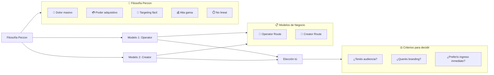
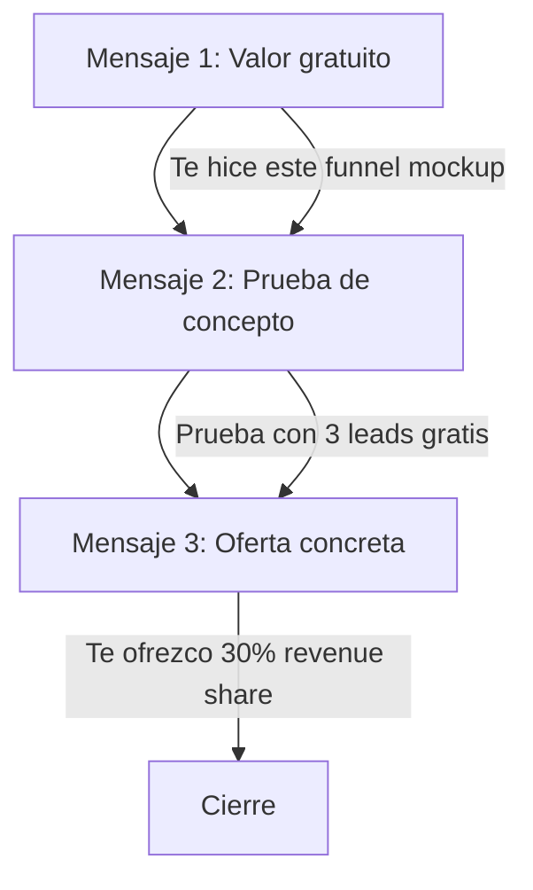
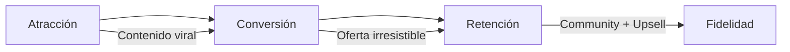
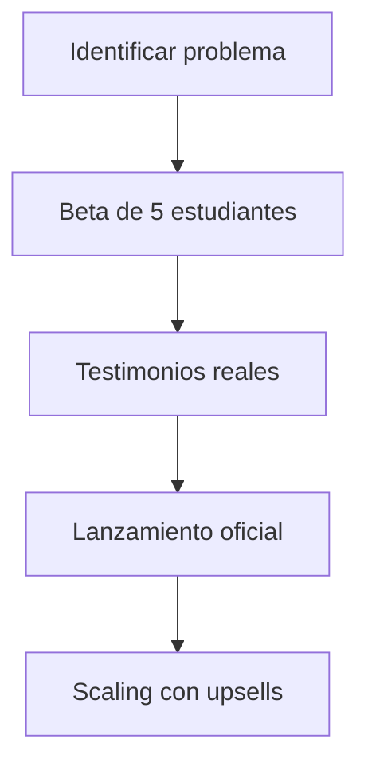
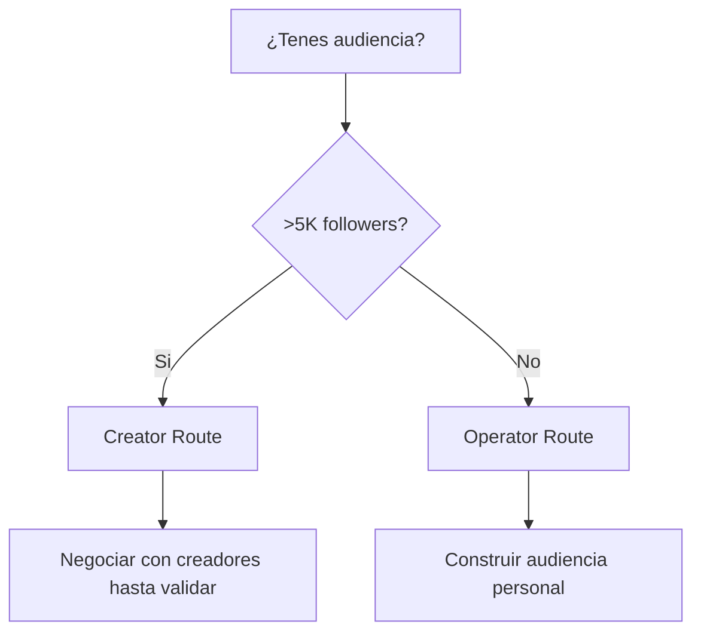

# MASTERCLASS: Los 2 Mejores Modelos de Negocio para 2027 según Max Perzon 💼🚀💰📈

## INTRODUCCIÓN: POR QUÉ ESTE MASTERCLASS ES DIFERENTE 🎯🔍

> **🎯 Objetivo de Aprendizaje** — Descubrirás los dos modelos de negocio online que Max Perzon considera ideales para 2027. Sin invención ni código complejo. Sin necesidad de producto físico. Solo creatividad, ejecución y una menteática ganadora.

> **⚠️ Advertencia educativa** — Este contenido sintetiza la metodología de Max Perzon. Los resultados dependen de ejecución, no de promesas.

---

## MAPA DEL MASTERCLASS 🗺️🧭



| Concepto Perzon | Pregunta clave | Output |
|-----------------|----------------|--------|
| **💢 Dolor masivo** | ¿Problema vital o estético? | Validación temprana |
| **💳 Poder adquisitivo** | ¿Puede pagar +$500? | Ticket alto |
| **🎯 Targeting fácil** | ¿Dónde está tu audiencia? | Ads rentables |
| **💰 Alta gama** | ¿Precio no lineal? | Ingresos sin límite |
| **⏱️ No lineal** | ¿Escala sin tu tiempo? | Sistemas automáticos |

---

## PARTE 1: LA FILOSOFÍA DE MAX PERZON — LOS 5 PILARES DEL ÉXITO 🏗️💎

### 1.1 El arte del targeting perfecto 🎯🎯

> **🎯 La Verdad de Perzon** — Un negocio online choca contra 3 paredes: (1) el cliente no siente dolor, (2) el cliente no puede pagar, (3) no podés alcanzarlo. Si evitás las 3, casi seguro ganás.

| Pilar | Qué buscar | Ejemplo |
|-------|-----------|---------|
| **💢 Dolor masivo** | Problema que duele, no molesta | "No puedo dormir por ansiedad" |
| **💳 Poder adquisitivo** | Puede pagar >$500 sin pensarlo | Emprendedor con clientes |
| **🎯 Targeting fácil** | Puedes encontrarlo en 1 click | Grupos de Facebook, Reddit |
| **💰 Alta gama** | Precio >$1K con margen >70% | Cursos de coaching |
| **⏱️ No lineal** | No depende de tus horas | Métodos, sistemas, community |

> **💡 Tip de Perzon #1** — El "dolor estético" (cambio de aspecto) es peligroso. El "dolor vital" (dinero, salud, relaciones) paga mejor. Un curso de "perder 10kg" vence a uno de "lucir mejor".

### 1.2 La mentalidad del operador vs el creador 🔄🎭

| Aspecto | Operator 🤝 | Creator 🚀 |
|---------|-------------|------------|
| **Branding** | No necesita su marca | Construye su marca |
| **Escalabilidad** | 20% recurring de múltiples | 100% de su audiencia |
| **Riesgo** | Menor, divide con creador | Mayor, asume toda |
| **Ingreso** | $5K-15K/mes recurrente | $10K-$50K+ según audiencia |
| **Tiempo inicial** | Enfocado en ejecución | Enfocado en construcción |
| **Habilidad clave** | Ventas, sistemas | Storytelling, conexión |

> **🧠 Hack de Perzon** — Si no sabés cuál elegir, preguntate: "¿Querés que te recuerden o que te contraten?" Si elegís ser contratado operador, el creador se lleva el crédito. Si elegís ser el creador, vos generás la audiencia y el valor.

---

## PARTE 2: EL MODELO OPERATOR ROUTE — TU PASAPORTE AL INGRESO 🎯💼

### 2.1 El concepto: socios con creadores 📚🤝

> **🎯 Concepto Perzon** — Encuentras creadores educativos con **10,000+ seguidores** que ya tienen audiencia pero **no tienen sistema de monetización**. Vos ofrecés construir su curso, comunidad y funnel de ventas. A cambio, cobrás una parte de las ganancias.

| Elemento | Detalle Perzon |
|----------|----------------|
| **Target de creadores** | 10K+ seguidores en Instagram/TikTok |
| **Nicho ideal** | Educación, coaching, self-help |
| **Tu aporte** | Cursos, comunidad (School), funnel |
| **Modelo de pago** | 20-50% revenue share o setup fees |
| **Resultados típicos** | $3K-15K/mes por creador |

### 2.2 La estrategia de outbound 3.0 📲🎯

> **⚡ Hack de Perzon #2** — No mandés DMs genéricas. Seguí este script de 3 mensajes:



| Mensaje | Qué ofrecés | Hook de ejemplo |
|---------|-------------|-----------------|
| 1️⃣ **Valor** | Audit gratuito o mockup | "Te hice un funnel de ventas gratis" |
| 2️⃣ **Prueba** | Demo con 3 leads | "Dale a 3 personas y vean resultados" |
| 3️⃣ **Oferta** | Revenue share | "Te ofrezco 30% recurrente" |

### 2.3 El arte de la negociación del revenue share 💰📊

> **🧠 Tip de Perzon #3** — No negociés porcentaje sin valor demostrado. La fórmula:

```
Revenue Share % = (Valor que aportás / Resultado esperado) × 100
```

| Escenario | Tu valor | Revenue share típico |
|-----------|----------|---------------------|
| ✅ Ya validaste el funnel (3 leads pagos) | Alto | 30-50% |
| 🎯 Solo hacés setup básico | Medio | 20-30% |
| ❓ Sin prueba | Bajo | 10-15% (o solo setup fee) |

> **⚡ Hack de Perzon #4** — En lugar de negociar porcentaje, ofrecé un **setup fee + performance bonus**: "$5K setup + $1K por cada $10K que factures". Escalan juntos.

### 2.4 El funnel de 3 fases 🏗️🎯



| Fase | Herramientas Perzon | Tiempo estimado |
|------|---------------------|-----------------|
| **1️⃣ Atracción** | Viral content, lead magnet | 1-2 semanas |
| **2️⃣ Conversión** | Landing page, checkout | 2-3 días |
| **3️⃣ Retención** | Community en School | Ongoing |

> **🎯 El checklist del operador:**
> ✅ Ya validaste con 3 leads de prueba?  
> ✅ El funnel convierte al menos 5%?  
> ✅ La comunidad tiene engagement diario?  
> ✅ El Creador firma revenue share formal?  

---

## PARTE 3: EL MODELO CREATOR/COURSE ROUTE — TU MARCAL DE MILLONES 🚀📈

### 3.1 El arte de validar antes de construir ✅🧪

> **🎯 La Verdad de Perzon** — Nadie quiere un curso teórico. Todos quieren **resultados reales demostrables**. Empezá con beta, no con marketing.

| Paso | Acción | Herramienta |
|------|--------|-------------|
| 1️⃣ | Identificá el problema específico | Encuesta a 50 followers |
| 2️⃣ | Creá el beta mínimo | Google Docs + Zoom |
| 3️⃣ | Pre-venDé con testimonio | Twitter + grupos |
| 4️⃣ | Recopilá testimonios | Notion + forms |
| 5️⃣ | Escalá con social proof | Landing + ads |



### 3.2 El pricing escalonado que nadie te enseñó 📈💰

> **💡 Tip de Perzon #5** — No subas el precio linealmente. Subí en **etapas con valor agregado**:

| Etapa | Precio | Qué incluyes | Testimonio mínimo |
|-------|--------|--------------|-------------------|
| 🧪 **Beta** | $500 | Clase + feedback | 5 estudiantes |
| 🚀 **V1** | $1,500 | Clase + community | 20 testimonios |
| 📈 **V2** | $3,000 | Clase + 1:1 + community | 50 testimonios |
| 🌟 **V3** | $5,000+ | Clase + VIP + mentoría | 100 testimonios |

### 3.3 El "stack de crecimiento" de Perzon 🏗️🎯

> **🧠 Hack de Perzon #6** — No dependas de un solo canal. Usá este stack:

| Canal | Objetivo | KPI Perzon |
|-------|----------|------------|
| 📱 **Twitter/X** | Thought leadership | 1M impressions/mes |
| 📺 **TikTok** | Viral content | 10K views/video |
| 🎙️ **Podcast** | Authority | 50K downloads/episode |
| 📧 **Email** | Direct sales | 30% open rate |
| 👥 **Community** | Retention | 5 posts/día engagement |

> **⚡ Hack de Perzon #7** — "El contenido que genera más ventas no es el más popular. Es el que resuelve **un dolor específico de 1 persona**."

---

## PARTE 4: DECISÓN ESTRATÉGICA — CUÁL MODELO ELEGIR EN 2027 🎯🤔

### 4.1 El cuestionario de 5 preguntas que define tu camino ❓📋

| # | Pregunta | Score (0-2) |
|---|----------|-------------|
| 1 | ¿Ya tenés 5,000+ seguidores en alguna red? | 0/1/2 |
| 2 | ¿Sentís que podés vender sin avergonzaros? | 0/1/2 |
| 3 | ¿Tenés $2,000 para invertir en ads/testing? | 0/1/2 |
| 4 | ¿Disfrutás más construyendo o operando? | 0/1/2 |
| 5 | ¿Querés ser el "rostro" del negocio? | 0/1/2 |

| Score | Modelo recomendado | Razón |
|-------|-------------------|-------|
| **0-4** | Operator Route 🤝 | Necesitás audiencia y branding |
| **5-7** | Operator Route + Creator híbrido | Podés explorar ambos |
| **8-10** | Creator Route 🚀 | Ya tenés base para escalar |



### 4.2 El híbrido ganador: operador primero, creador después 🔄🚀

> **🎯 La Verdad de Perzon** — La mejor estrategia es: **empecer como operator, aprender las tripas, y luego lanzar tu propio producto** con ese conocimiento.

| Fase | Rol | Objetivo |
|------|-----|----------|
| 1️⃣ **Mes 1-3** | Operator 🤝 | Aprender funnel, validar con 1 creador |
| 2️⃣ **Mes 4-6** | Operator x2 🤝🤝 | Escalar a 2 creadores, $10K+/mes |
| 3️⃣ **Mes 7-9** | Creator 🚀 | Lanzar tu curso usando aprendizaje |
| 4️⃣ **Mes 10+** | Creator + Operator 🚀🤝 | Escalar tu marca + siguen operando |

> **💰 Proyección Perzon (2 años):**
> - Operator: $5K/mes × 3 creadores = $15K/mes
> - Creator: $20K/mes × 5 creadores propios = $100K/mes
> - **Total posible 2027: $1.2M+/año**

---

## PARTE 5: EJERCICIOS PROGRESIVOS — APLICA LO APRENDIDO 📈📚

### 5.1 I Do — Perzon analiza 3 casos 👨‍🏫🔍

> **🎯 Observá estos errores y por qué fallan:**

1. ❌ "Quiero vender cursos de IA sin tener audiencia" → ✅ Operator Route primero
2. ❌ "Voy a cobrar $100 por un curso de 5 lecciones" → ✅ Pricing escalonado desde beta
3. ❌ "Voy a promocionar en todos los canales" → ✅ Stack de 2-3 canales profundos

### 5.2 We Do — Identificá tu perfil 📊🎯

| Pregunta | Tu respuesta | Score |
|----------|--------------|-------|
| ¿Cuántos seguidores tenés? | | |
| ¿Qué dolor específico resolvés? | | |
| ¿Tenés $2K para testing? | | |
| ¿Qué creador admirás seguir? | | |
| ¿Qué habilidad ventas tenés hoy? | | |

### 5.3 You Do — Diseñá tu plan de 90 días 💪🚀

| Mes | Modelo elegido | Acción clave | Resultado esperado |
|-----|----------------|--------------|-------------------|
| 1 | | | |
| 2 | | | |
| 3 | | | |

| Criterio de evaluación | Peso |
|------------------------|------|
| ✅ Problema específico identificado | 20% |
| ✅ Modelo correcto para tu perfil | 20% |
| ✅ KPIs reales y medibles | 20% |
| ✅ Plan de 90 días accionable | 20% |
| ✅ Buffer de $ o audiencia inicial | 20% |

---

## CHECKLIST FINAL: MODELO DE NEGOCIO 2027 ✅📋🎯

| Paso | Operator | Creator | Estado |
|------|----------|---------|--------|
| ✅ Evaluaste tu audiencia | ☐ | ☐ | ☐ |
| ✅ Elegiste tu dolor específico | ☐ | ☐ | ☐ |
| ✅ Calculaste poder adquisitivo | ☐ | ☐ | ☐ |
| ✅ Diseñaste funnel básico | ☐ | ☐ | ☐ |
| ✅ Plan de 90 días definido | ☐ | ☐ | ☐ |
| ✅ Stack de canales seleccionado | ☐ | ☐ | ☐ |
| ✅ Pricing escalonado planificado | ☐ | ☐ | ☐ |

---

## PREGUNTAS DE VERIFICACIÓN 📝❓✨

1. **🎯 Filosofía:** ¿Cuál de los 5 pilares de Perzon es el más fuerte en tu idea? ¿Cuál es el más débil?
2. **🤝 Operator:** ¿Qué creador seguirías para proponer tu servicio de operator? ¿Cuál sería tu mensaje de valor inicial?
3. **🚀 Creator:** Si ya tenés audiencia, ¿qué dolor específico resuelve tu contenido? ¿Cómo lo validarías con una beta de 5 personas?
4. **💰 Pricing:** ¿Qué precio inicial pondrías para tu beta? ¿Cómo escalarías a V1, V2, V3?
5. **🔄 Híbrido:** ¿Empecés como operator para aprender y luego creator, o directamente como creator?
6. **📊 Métricas:** ¿Qué 3 KPIs medirías durante tu primer mes?
7. **🧠 Mentalidad:** ¿Qué miedo te impide empezar hoy? ¿Cómo lo reencuadrarías?

---

## GLOSARIO RÁPIDO 📚📖

| Término | Definición | Ejemplo Perzon |
|---------|------------|----------------|
| **Operator Route** | Servicio para creadores existentes | Construís funnel por 30% revenue share |
| **Creator Route** | Producto propio para tu audiencia | Tu curso de coaching vendido directo |
| **Revenue share** | Porcentaje de ganancias compartido | 30% de las ventas del creador |
| **Setup fee** | Pago por configuración inicial | $5K por montar el funnel |
| **High-ticket** | Producto de alto valor | $3,000+ en lugar de $50 |
| **Beta** | Versión mínima previa a escala | 5 estudiantes que dan feedback |
| **Stack de crecimiento** | Conjunto de canales de marketing | Twitter + podcast + community |
| **Social proof** | Testimonios y pruebas sociales | 50 testimonios reales |
| **Funnel** | Proceso de atracción a venta | Lead magnet → landing → checkout |

---

## ANEXO: FORMATO IDEAL PARA GUÍAS DE BUSINESS MODELS 🧠📄

### Recomendaciones de legibilidad para emprendedores 💼📏

```css
.article-content {
  font-size: 18px;
  line-height: 1.75;
  max-width: 65ch;
}
```

### Lo que hace agradable una guía de negocio al cerebro 🧠✨

- 🎯 **Casos de validación temprana** conectan con la realidad del lector.
- 📊 **Tablas comparativas** facilitan la decisión entre modelos.
- ⚡ **Scripts concretos** permiten aplicar de inmediato (mensajes de outbound).
- 🔄 **Ejercicios progresivos** construyen confianza escalonada.
- 📋 **Checklist y glosario** permiten repaso rápido.
- 💰 **Tablas de pricing escalonado** inspiran concreción.

> **🗣️ La frase del profe Max Perzon** 🌟 — *"El mejor negocio no es el que tiene la idea más brillante. Es el que ejecuta con coherencia, aprende de cada fracaso y escalate con sistemas."*

---
