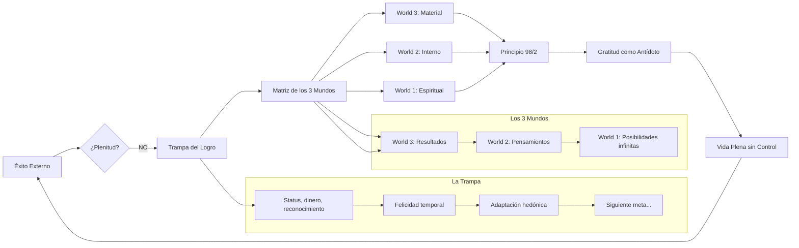
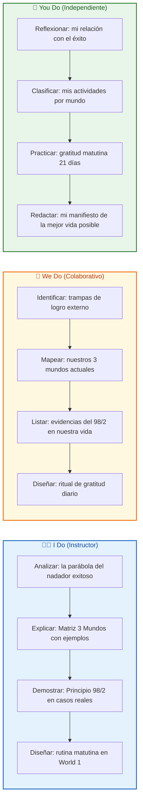
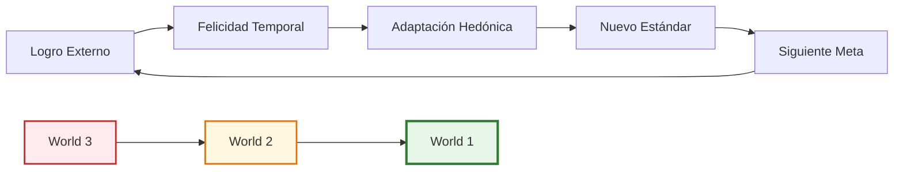
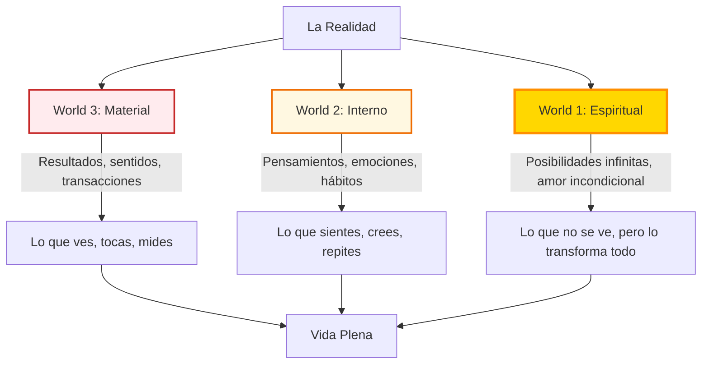
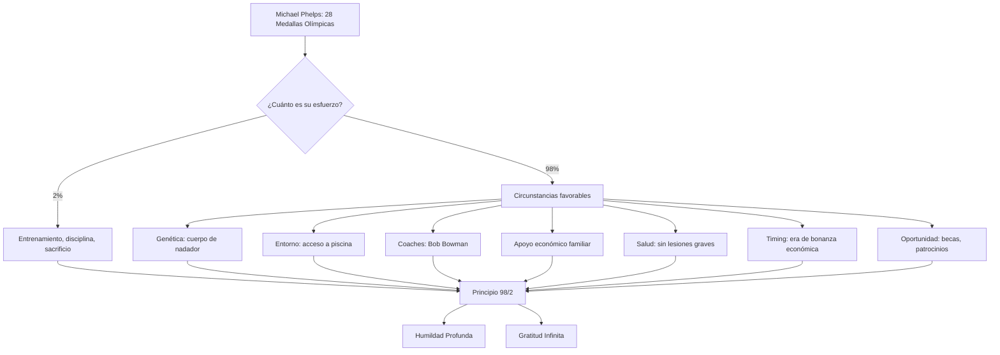
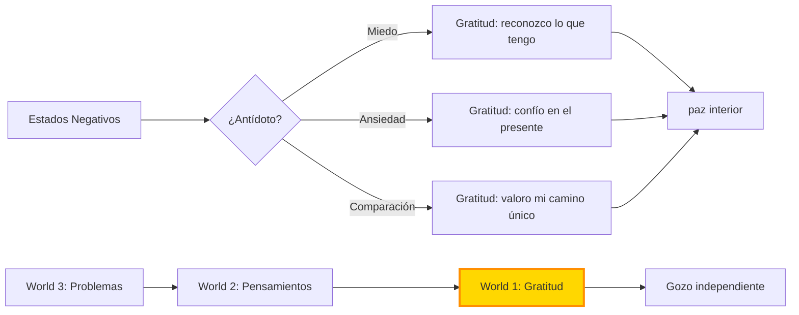
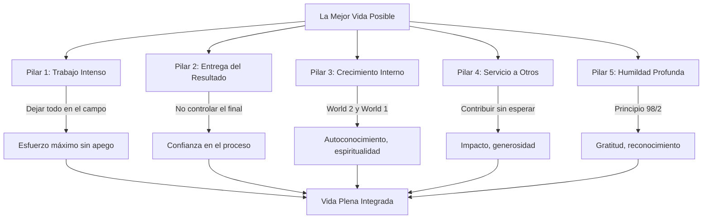
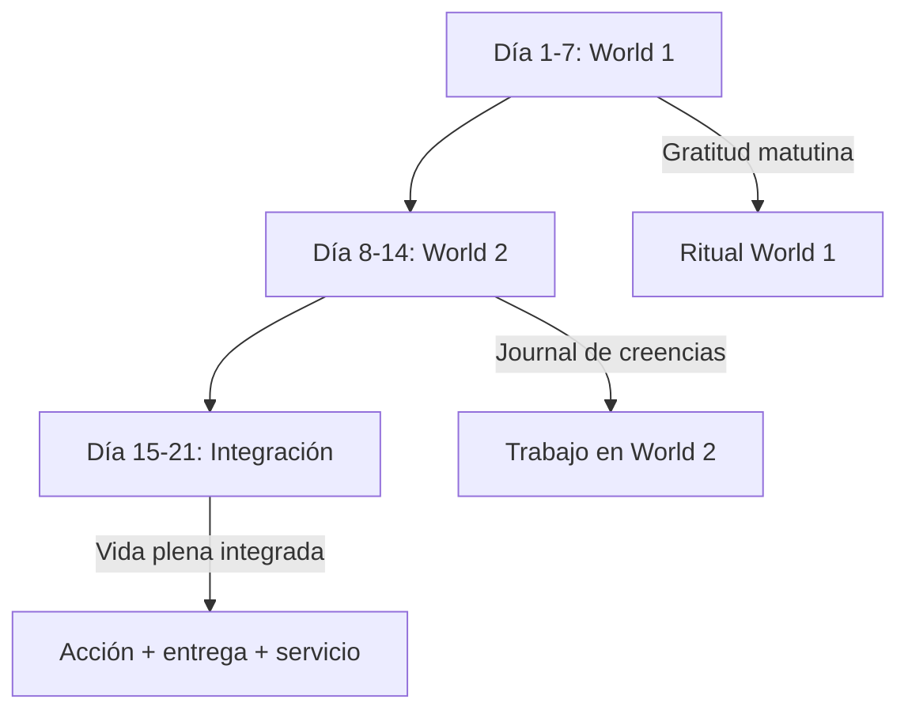
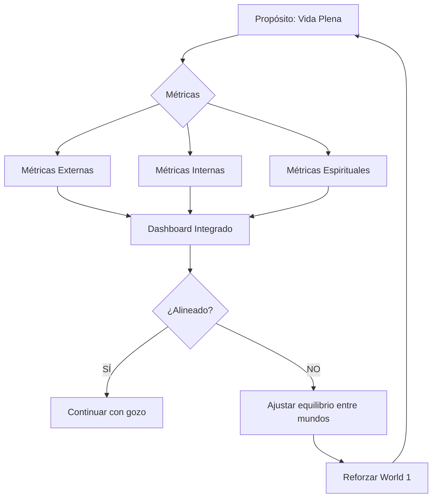
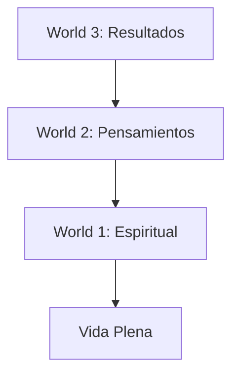

# MASTERCLASS: La Mejor Vida Posible — De los Logros Externos a la Plenitud Interior 🌟✨

## INTRODUCCIÓN: POR QUÉ EL ÉXITO NO ALCANZA PARA SER FELIZ 🏆😔

Imagina que lo has conseguido todo. La carrera profesional despega, las cuentas bancarias crecen, los reconocimientos llegan, el estatus social se solidifica. Y sin embargo, una noche, al mirar el techo antes de dormir, sientes un vacío que ningún logro externo ha podido llenar. 🌑❓

Esta experiencia no es un fallo personal. Es una **paradoja humana**. Jim Murphy, en su libro *The Best Possible Life*, explica por qué ocurre: hemos construido una civilización que premia el logro externo, pero que no nos enseña a cultivar el mundo interior. El resultado: personas exitosas por fuera, vacías por dentro. 🏦🕳️

En esta masterclass, exploramos los conceptos clave del libro para ayudarte a construir una vida que no solo se vea exitosa, sino que se **sienta plena**.

> **🎯 Objetivo de Aprendizaje** — Comprender la trampa de los logros externos, aplicar la Matriz de los 3 Mundos, adoptar el Principio 98/2 para cultivar humildad y gratitud, y diseñar una rutina matutina que empiece por el mundo interior.

> **⚠️ Advertencia filosófica** — Este contenido es formativo y reflexivo. No reemplaza el acompañamiento terapéutico o espiritual. Las ideas aquí presentadas son una invitación a la reflexión, no verdades absolutas.

---

## MAPA DEL FLUJO DE PLENITUD 🗺️



| Concepto | Pregunta que responde | Output principal |
|----------|------------------------|------------------|
| **Trampa del Logro Externo** 🪤 | ¿Por qué el éxito no garantiza felicidad? | Adaptación hedónica, ciclo de metas |
| **Matriz de los 3 Mundos** 🌍 | ¿En qué nivel de la realidad estoy operando? | World 1, 2 y 3 diferenciados |
| **Principio 98/2** ⚖️ | ¿Cuánto de mi éxito es realmente mío? | Humildad y gratitud profunda |
| **Gratitud como Antídoto** 🙏 | ¿Cómo contrarrestar miedo y comparación? | Estado de gozo independiente |
| **Vida Plena sin Control** 🎯 | ¿Cómo vivir lo mejor posible? | Entrega + acción + servicio |



---

## PARTE 1: LA TRAMPA DEL LOGRO EXTERNO — CUANDO EL ÉXITO NO ALCANZA 🪤

### 1.1 Principio Central

**Del 2:33 al 4:08 y del 22:38 del video**, Jim Murphy describe la paradoja del éxito moderno: hemos aprendido a **conquistar metas externas**, pero no hemos aprendido a **cultivar la paz interna**. El resultado es un ciclo de felicidad temporal seguido de adaptación y búsqueda del siguiente logro. ♻️😞



### 1.2 El Ciclo de la Felicidad Temporal

| Etapa 📈 | Experiencia | Duración Típica | Resultado |
|----------|-------------|-----------------|-----------|
| **1. Deseo** 🎯 | "Quiero X" (cargo, pareja, casa) | Variable | Motivación |
| **2. Persecución** 🏃 | Esfuerzo intenso para conseguir X | Meses-Años | Estrés + progreso |
| **3. Conquista** 🏆 | Logro de X | Momentáneo | Felicidad temporal |
| **4. Adaptación** 😐 | "Ahora esto es normal" | Semanas-Meses | Regresión al punto de referencia |
| **5. Nuevo deseo** 🔄 | "Quiero Y" (siguiente nivel) | Inmediato | Reinicio del ciclo |

> **📌 Idea clave** — La adaptación hedónica es un mecanismo de supervivencia psicológica. Si cada logro nos mantuviera eufóricos permanentemente, no podríamos funcionar. Pero cuando se convierte en el **único** motor de la vida, genera un vacío existencial.

### 1.3 La Paradoja del Éxito Vacío

| Logro Alcanzado 🏆 | Sensación Inicial | Sensión a los 6 Meses |
|--------------------|--------------------|------------------------|
| **Promoción laboral** 💼 | "¡Por fin lo logré!" | "Ahora tengo más responsabilidad" |
| **Casa propia** 🏠 | "Es mi hogar" | "Hay que mantenerla, pagar, arreglar" |
| **Pareja estable** 💑 | "Encontré el amor" | "Hay conflictos, rutina, trabajo" |
| **Millón en el banco** 💰 | "Soy libre" | "¿Y ahora qué? ¿Compro un yate?" |
| **Reconocimiento público** 🌟 | "Me siento valioso" | "La fama es efímera, hay que mantenerla" |

### 1.4 La Evaluación del Éxito: ¿Qué Medimos?

| Dimensión 📊 | Lo que solemos medir ❌ | Lo que realmente importa ✅ |
|--------------|--------------------------|----------------------------|
| **Carrera** 💼 | Título, salario, jerarquía | Sentido, contribución, crecimiento |
| **Relaciones** 💑 | Cantidad, estatus, duración | Profundidad, confianza, apoyo mutuo |
| **Dinero** 💰 | Patrimonio neto, ingresos | Libertad, seguridad, capacidad de dar |
| **Salud** 🏃 | Peso, rendimiento, apariencia | Vitalidad, energía, ausencia de dolor |
| **Tiempo** ⏰ | Productividad, horas trabajadas | Presencia, disfrute, conexión |
| **Propósito** 🎯 | Logros, metas, métricas | Sentido, servicio, trascendencia |

---

## PARTE 2: LA MATRIZ DE LOS 3 MUNDOS — MAPA DE LA REALIDAD 🌍

### 2.1 Principio Central

**Del 29:49 al 34:00 del video**, Murphy introduce uno de los conceptos más poderosos del libro: **la Matriz de los 3 Mundos**. No estamos en un solo nivel de realidad: operamos simultáneamente en tres planos, y la mayoría de las personas viven atrapadas en el World 3 (material), olvidando los mundos 2 y 1. 🧠✨



### 2.2 Los 3 Mundos Explicados

| Mundo 🌍 | Nombre | Características | Ejemplos | ¿Dónde vivimos la mayoría del tiempo? |
|----------|--------|-----------------|----------|--------------------------------------|
| **World 3** 🏦 | **Mundo Material** | Resultados, transacciones, percepción sensorial | Dinero, casa, coche, trabajo, redes sociales | ⚠️ Demasiado tiempo |
| **World 2** 🧠 | **Mundo Interno** | Pensamientos, emociones, hábitos, creencias | Creencias sobre uno mismo, miedos, patrones | ⚠️ Tiempo insuficiente |
| **World 1** ✨ | **Mundo Espiritual** | Posibilidades infinitas, amor incondicional, gratitud | Oración, meditación, conexión con lo sagrado | ❌ Casi nunca |

> **📌 Idea clave** — La calidad de tu World 3 (resultados externos) está determinada por la calidad de tu World 2 (pensamientos y emociones), que está determinada por la calidad de tu World 1 (conexión espiritual). Si solo trabajas en World 3, estás tratando los síntomas, no la causa.

### 2.3 World 3: El Mundo de los Resultados (Material) 📦

| Aspecto | Característica | Trampa |
|---------|----------------|--------|
| **Enfoque** 🎯 | Lograr, producir, acumular | Solo importa el resultado, no el proceso |
| **Medición** 📊 | Métricas externas: dinero, seguidores, títulos | Te defines por lo que tienes, no por lo que eres |
| **Tiempo** ⏰ | Siempre orientado al futuro | No disfrutas el presente |
| **Relaciones** 🤝 | Transaccionales: "¿qué me das?" | Falta de conexión genuina |
| **Felicidad** 😊 | Dependiente de circunstancias | Inestable, volátil |

### 2.4 World 2: El Mundo Interno (Pensamientos y Emociones) 🧠

| Aspecto | Característica | Oportunidad |
|---------|----------------|-------------|
| **Enfoque** 🎯 | Cómo pienso, cómo me siento, qué creo | Puedo cambiar mi realidad interior |
| **Medición** 📊 | Autoevaluación, journaling, reflexión | Crecimiento personal tangible |
| **Tiempo** ⏰ | Presente consciente | Paz interior disponible ahora |
| **Relaciones** 🤝 | Empatía, escucha, vulnerabilidad | Conexiones profundas |
| **Felicidad** 😊 | Independiente de circunstancias | Estable, resiliente |

### 2.5 World 1: El Mundo Espiritual (Posibilidades Infinitas) ✨

| Aspecto | Característica | Regalo |
|---------|----------------|--------|
| **Enfoque** 🎯 | Gratitud, amor incondicional, servicio | Conexión con algo mayor |
| **Medición** 📊 | Gozo, paz, sentido | No se mide, se experimenta |
| **Tiempo** ⏰ | Eterno, atemporal | Libertad del reloj mental |
| **Relaciones** 🤝 | Unidad, compasión, perdón | Amor sin condiciones |
| **Felicidad** 😊 | Independiente de TODO | Plenitud absoluta |

### 2.6 Ejercicio: Mapa de tus 3 Mundos

| Mundo | ¿Dónde paso mi tiempo? | ¿Qué actividades me conectan? | ¿Qué me falta? |
|-------|------------------------|------------------------------|----------------|
| **World 3** 🏦 | ___% del día | Trabajo, redes, consumo | __ |
| **World 2** 🧠 | ___% del día | Journal, meditación, terapia | __ |
| **World 1** ✨ | ___% del día | Oración, gratitud, naturaleza | __ |

---

## PARTE 3: EL PRINCIPIO 98/2 — LA HUMILDAD COMO CLAVE DEL ÉXITO ⚖️

### 3.1 Principio Central

**Del 41:09 al 48:58 del video**, Murphy utiliza el ejemplo del nadador Michael Phelps para ilustrar un principio revolucionario: **solo el 2% de nuestro éxito se debe a nuestro propio esfuerzo. El 98% restante viene de circunstancias favorables, bendiciones y coincidencias.** 🏊‍♂️✨

> **📌 Idea clave** — Este Principio 98/2 no es una forma de desvalorizar tu esfuerzo. Es una forma de **cultivar humildad profunda** y **gratitud infinita**. Reconocer que gran parte de lo que tienes no lo creaste tú, sino que lo recibiste, transforma tu relación con el éxito.



### 3.2 Desglose del Principio 98/2

| Porcentaje | Aporte | Ejemplo en Michael Phelps | Aplicación a tu vida |
|------------|--------|---------------------------|----------------------|
| **2%** 💪 | Tu esfuerzo, disciplina, decisiones | Entrenamiento 6 horas/día desde niño | Tu trabajo, estudio, perseverancia |
| **98%** 🌟 | Circunstancias que no creaste | Cuerpo de nadador, coach, familia, economía | Familia, salud, educación, oportunidades, momento histórico |

### 3.3 Las 7 Fuentes del 98%

| Fuente del 98% 🌟 | Explicación | Ejemplo Personal |
|--------------------|-------------|------------------|
| **1. Genética y salud** 🧬 | Cuerpo, mente, capacidades innatas | Inteligencia, salud física, resistencia emocional |
| **2. Familia y crianza** 👨‍👩‍👧 | Entorno familiar, valores transmitidos | Padres que apoyaron, educación inicial |
| **3. Oportunidad histórica** 📅 | El momento histórico en que naciste | Acceso a internet, democracia, tecnología |
| **4. Redes y conexiones** 🤝 | Personas que te abrieron puertas | Mentor, amigo, profesor que confió en ti |
| **5. Recursos económicos** 💰 | Capacidad de pagar por educación, salud | Estudios pagados, acceso a tecnología |
| **6. Cultura y valores** 🌍 | Normas sociales que te favorecieron | Cultura del esfuerzo, meritocracia (aunque imperfecta) |
| **7. Suerte y coincidencia** 🍀 | Eventos azarosos que cambiaron tu vida | Encuentro casual que abrió una puerta |

### 3.4 Tabla de Reflexión: Tu Propio 98/2

| Área de tu vida | ¿Qué es tu 2% (tu esfuerzo)? | ¿Qué es tu 98% (circunstancias)? |
|-----------------|------------------------------|----------------------------------|
| **Carrera profesional** 💼 | | |
| **Relaciones importantes** 💑 | | |
| **Salud física** 🏃 | | |
| **Educación** 📚 | | |
| **Situación económica** 💰 | | |
| **Red de apoyo** 🤝 | | |
| **Metas alcanzadas** 🎯 | | |

> **💡 Insight profundo** — Cuando realmente entiendes que el 98% de tu éxito no es tuyo, dejas de sentirte **orgulloso** y empiezas a sentirte **agradecido**. Y la gratitud, según Murphy, es el antídoto contra el miedo, la ansiedad y la comparación.

---

## PARTE 4: LA GRATITUD COMO ANTÍDOTO — CAMBIAR EL FOCO INTERNO 🙏

### 4.1 Principio Central

**Del 49:41 al 54:00 del video**, Murphy explica que la gratitud no es una emoción pasajera: es una **práctica transformadora** que actúa como antídoto contra el miedo, la ansiedad y la comparación social. La gratitud cambia tu foco de "lo que me falta" a "lo que tengo". 🌟➡️🙏



### 4.2 La Gratitud como Herramienta de Transformación

| Estado Emocional 😰 | Pensamiento Típico | Antídoto de Gratitud | Resultado |
|---------------------|--------------------|----------------------|-----------|
| **Miedo** 😨 | "¿Qué pasará si pierdo todo?" | "Agradezco lo que tengo AHORA" | Confianza en el presente |
| **Ansiedad** 😰 | "No soy suficiente, debo hacer más" | "Agradezco mi esfuerzo y mis logros" | Reducción de presión |
| **Comparación** ⚖️ | "Otros tienen más que yo" | "Agradezco mi camino único" | Enfoque interno |
| **Falta de control** 🌀 | "No puedo controlar el resultado" | "Agradezco el proceso, no solo el resultado" | Entrega |
| **Vacío existencial** 🕳️ | "No tiene sentido lo que hago" | "Agradezco el regalo de estar vivo" | Sentido |

### 4.3 La Trampa de Empezar el Día en World 3 📱

**Uno de los puntos más poderosos del video (49:41 - 54:00)** es la crítica a la rutina moderna: muchas personas empiezan el día revisando el teléfono (World 3: noticias, redes, correos), lo que inmediatamente las sumerge en **estrés, comparación y urgencia**. Murphy propone empezar el día en **World 1** (gratitud, oración, conexión) para cultivar un estado de gozo **independiente de las circunstancias**. ☀️📵

| Rutina Típica Moderna 📱 | Estado Inicial | Efecto en el Día |
|--------------------------|----------------|------------------|
| **Despertar → Teléfono** 📱 | Noticias, redes, urgencias | Estrés, comparación, reactividad |
| **Despertar → Gratitud** 🙏 | Paz, gozo, propósito | Calma, foco interno, resiliencia |
| **Despertar → Meditación** 🧘 | Presencia, claridad | Decisiones conscientes |
| **Despertar → Ejercicio** 🏃 | Vitalidad, energía | Motivación sostenida |

### 4.4 Tu Ritual Matutino en World 1

```text
RITUAL MATUTINO: EMPEZAR EN WORLD 1
═══════════════════════════════════════

DURACIÓN: 10-20 minutos (antes del teléfono)
CUÁNDO: Al despertar, antes de cualquier estímulo externo

PASO 1: Respiración Consciente (2 min) 🫁
├── 4 segundos inhalar
├── 7 segundos retener
├── 8 segundos exhalar
└── Repetir 5 veces

PASO 2: Gratitud Profunda (5 min) 🙏
├── 3 cosas por las que estoy agradecido HOY
├── 1 persona que amo y por qué
└── 1 desafío que acepto como oportunidad

PASO 3: Conexión con el Propósito (3 min) 🎯
├── ¿Qué tipo de persona quiero ser hoy?
├── ¿Qué aporte quiero hacer hoy?
└── ¿Qué me hace sentir vivo?

PASO 4: Intención del Día (2 min) ✨
├── Mi palabra del día: _______________
└── Mi acción de servicio: _____________

PASO 5: Activar World 3 (solo después) 📱
└── Ahora sí: teléfono, trabajo, tareas
```

---

## PARTE 5: ARQUITECTURA DE LA MEJOR VIDA POSIBLE — SISTEMA COMPLETO 🏗️

### 5.1 Los 5 Pilares de la Vida Plena

Jim Murphy propone que la mejor vida posible no se construye solo con logros externos, sino con un equilibrio entre **acción y entrega**, **esfuerzo y aceptación**, **trabajo y servicio**. 🏛️



### 5.2 Tabla de Pilares y Aplicación

| Pilar 🏛️ | Principio | Acción Concreta | Resultado |
|-----------|-----------|------------------|-----------|
| **1. Trabajo Intenso** 💪 | "Deja todo en el campo" | Dar el máximo en lo que haces | Satisfacción del esfuerzo |
| **2. Entrega** 🎁 | "No controlas el final" | Aceptar el resultado sin aferrarte | Paz interior |
| **3. Crecimiento Interno** 🌱 | "World 2 y World 1" | Journal, meditación, terapia | Autoconocimiento |
| **4. Servicio** 🤝 | "Contribuir sin esperar" | Voluntariado, mentoría, dar | Sentido |
| **5. Humildad** 🙏 | "Principio 98/2" | Gratitud diaria, reconocimiento | Conexión con lo sagrado |

### 5.3 La Ecuación de la Vida Plena

```text
VIDA PLENA = (TRABAJO INTENSO + CRECIMIENTO INTERNO + SERVICIO) / CONTROL DEL RESULTADO

O en palabras de Murphy:
"Da todo lo que tienes, suelta todo lo que esperas, agradece todo lo que recibes."
```

---

## PARTE 6: SISTEMA DE PRÁCTICA DIARIA — TU CAMINO HACIA LA MEJOR VIDA POSIBLE 🗓️

### 6.1 Rutina de 21 Días de Transformación



### 6.2 Plan Diario de Práctica

| Momento del Día 🌅 | Práctica | Duración | Mundo | Propósito |
|--------------------|----------|----------|-------|-----------|
| **Al despertar** ☀️ | Ritual World 1 (gratitud) | 10 min | World 1 | Empezar en paz, no en estrés |
| **Mañana** 🌤️ | Journal de intenciones | 5 min | World 2 | Claridad mental |
| **Durante el día** 🌇 | Micro-gratitudes | 1 min cada una | World 1 | Mantener el foco interno |
| **Tarde** 🌆 | Pausa consciente | 5 min | World 2 | Regular emociones |
| **Noche** 🌙 | Cierre con gratitud | 10 min | World 1 | Dormir en paz, no en ansiedad |

### 6.3 Tabla de Progreso

| Dimensión 📊 | Día 1 | Día 7 | Día 14 | Día 21 | Día 90 |
|--------------|-------|--------|---------|---------|---------|
| Tiempo en World 1 al despertar | 0 min | ? | ? | 10 min | ? |
| Gratitudes profundas/día | ? | ? | ? | > 5 | ? |
| Nivel de ansiedad (1-10) | ? | ? | ? | ? | ? |
| Sensación de control (1-10) | ? | ? | ? | ? | ? |
| Actos de servicio/semana | ? | ? | ? | ? | ? |
| Satisfacción con la vida (1-10) | ? | ? | ? | ? | ? |

---

## PARTE 7: CASOS DE ESTUDIO — DEL ÉXITO VACÍO A LA VIDA PLENA 🌟

### 7.1 Jim Murphy: El Autor que lo Tenía Todo y se Sentía Vacío 🧑‍💼

| Etapa | Situación | Lección |
|-------|-----------|---------|
| **Éxito profesional** 🏆 | Dinero, reconocimiento, estatus | El éxito externo no llena el vacío interno |
| **Crisis existencial** 😰 | Pregunta: "¿Y ahora qué?" | El logro no es el destino |
| **Descubrimiento** ✨ | Lectura, espiritualidad, gratitud | La plenitud viene de World 1 |
| **Transformación** 🌱 | Nueva vida con propósito | Trabajo + entrega + servicio |
| **Enseñanza** 📚 | Escribir el libro | Compartir el camino con otros |

### 7.2 Michael Phelps: El Nadador que Entendió el 98/2 🏊‍♂️

| Aspecto | 2% (Esfuerzo) | 98% (Circunstancias) |
|---------|---------------|----------------------|
| **Genética** 🧬 | | Cuerpo de nadador, resistencia pulmonar |
| **Entrenamiento** 🏊 | 6 horas/día desde niño | |
| **Coach** 👨‍🏫 | | Bob Bowman, visión estratégica |
| **Familia** 👨‍👩‍👧 | | Apoyo económico, logística, emocional |
| **Salud** 🏥 | | Sin lesiones graves durante décadas |
| **Timing** 📅 | | Era de bonanza económica, patrocinios |
| **Suerte** 🍀 | | Oportunidades que no podía crear |

> **📌 Idea clave** — Phelps mismo dice que su éxito no es solo suyo. Entrenó como un poseso (2%), pero recibió dones y oportunidades que no creó (98%). Esta humildad es lo que lo mantiene conectado y agradecido, no solo exitoso.

### 7.3 La Empresaria que Dejó la Jefatura por la Plenitud 👩‍💼

| Etapa | Situación | Aplicación del Método |
|-------|-----------|----------------------|
| **Directora ejecutiva** 💼 | Sueldazo, poder, reconocimiento | World 3 dominante |
| **Agotamiento** 😰 | Insomnio, ansiedad, vacío | Señal de desbalance |
| **Renuncia** 🚪 | Dejó el cargo sin plan B | Acto de fe |
| **Año sabático** 🌱 | Viaje, lectura, reflexión | Trabajo en World 2 |
| **Nuevo proyecto** ✨ | Negocio con propósito | World 1 integrado |
| **Vida actual** 🌟 | Menos dinero, más plenitud | Equilibrio entre mundos |

---

## PARTE 8: MATRIZ DE CREENCIAS — DEL MATERIALISMO A LA PLENITUD ⚖️

### 8.1 Creencias sobre el Éxito y la Felicidad

| Creenza Limitante ❌ | ¿Dónde la aprendí? | Costo en mi vida | Creenza Potenciadora ✅ |
|----------------------|--------------------|------------------|------------------------|
| "El éxito = felicidad" 🏆 | | | "El éxito es un resultado, la felicidad es un estado interno" |
| "Debo tener más para ser feliz" 📈 | | | "La felicidad está en cómo vivo, no en lo que tengo" |
| "La comparación me motiva" ⚖️ | | | "La comparación me roba la paz" |
| "Si no controlo, todo sale mal" 🎮 | | | "Soltar el control es la verdadera libertad" |
| "Debo merecer el amor y el éxito" 🏅 | | | "El amor y el éxito son dones que recibo, no premios que gano" |
| "El trabajo duro es lo único que importa" 💪 | | | "El trabajo duro es necesario, pero no suficiente" |

### 8.2 Creencias sobre la Gratitud

| Creenza Limitante ❌ | Reformulación con Principio 98/2 | Resultado Esperado |
|----------------------|-----------------------------------|-------------------|
| "La gratitud es para tiempos buenos" 🙏 | "La gratitud es especialmente poderosa en tiempos difíciles" | Resiliencia |
| "Yo construí todo lo que tengo" 🏗️ | "Recibí el 98% de lo que tengo" | Humildad |
| "Agradecer es debilidad" 💪 | "Agradecer es fortaleza interior" | Fuerza genuina |
| "No tengo nada por lo que estar agradecido" 😔 | "Cada día es un regalo que no mereces, pero recibes" | Gozo |

---

## PARTE 9: DASHBOARD DE VIDA PLENA 📊

### 9.1 Métricas Integradas

Un dashboard de vida plena no mide solo productividad o ingresos. Mide **calidad de experiencia interna**, **propósito** y **gratitud**. 📈✨



### 9.2 Tabla de Métricas

| Dominio 📊 | Métrica | Frecuencia | Meta | Alerta ⚠️ |
|------------|---------|------------|------|-----------|
| **Tiempo en World 1** ✨ | Minutos de gratitud/oración/meditación | Diaria | > 10 min | < 5 min |
| **Tiempo en World 2** 🧠 | Minutos de journal/reflexión | Diaria | > 10 min | < 5 min |
| **Tiempo en World 3** 📱 | Horas de trabajo/redes/consumo | Diaria | Balanceado | > 12 horas |
| **Gratitud** 🙏 | Profundidad de gratitud (1-10) | Diaria | > 8/10 | < 5/10 por 3 días |
| **Ansiedad** 😰 | Nivel de ansiedad (1-10, invertido) | Diaria | < 4/10 | > 7/10 |
| **Comparación social** ⚖️ | Veces que me comparé con otros | Diaria | < 2 veces | > 10 veces |
| **Servicio** 🤝 | Actos de servicio/semana | Semanal | > 3 | 0 |
| **Propósito** 🎯 | Alineación con propósito (1-10) | Semanal | > 7/10 | < 5/10 |

### 9.3 Sistema de Alertas y Acciones Correctivas

| Alerta 🚨 | Condición | Acción del Sistema |
|-----------|-----------|-------------------|
| World 3 dominante 📱 | > 12 horas/día en resultados | Añadir ritual matutino World 1 |
| Gratitud baja 🙏 | < 5/10 por 3 días | 21 días de gratitude challenge |
| Ansiedad alta 😰 | > 7/10 por 3 días | Revisar creencias, aumentar World 2 |
| Comparación constante ⚖️ | > 10 comparaciones/día | Eliminar redes sociales 1 semana |
| Falta de servicio 🤝 | 0 actos/semana | Programar voluntariado o mentoría |
| Vacío existencial 🕳️ | Propósito < 5/10 | Revisar manifiesto de vida plena |

---

## PARTE 10: APLICACIÓN POR CONTEXTO 🏢

### 10.1 Emprendedores y Líderes 🚀

| Principio | Implementación Práctica |
|-----------|-------------------------|
| **Empezar el día en World 1** ☀️ | Ritual matutino antes de revisar emails |
| **Principio 98/2 en el equipo** ⚖️ | Reconocer las circunstancias que permiten el éxito |
| **Gratitud como cultura** 🙏 | Reuniones semanales de agradecimiento |
| **Servicio como estrategia** 🤝 | Negocio con impacto social integrado |
| **Entregar resultados** 🎁 | No aferrarse a métricas, enfocarse en valor |

### 10.2 Profesionales y Empleados 💼

| Principio | Implementación Práctica |
|-----------|-------------------------|
| **Matriz de 3 Mundos en la oficina** 🏢 | Identificar si estás en World 3 reactivo o World 2 proactivo |
| **Rutina matutina World 1** 🌅 | 10 minutos antes de llegar al trabajo |
| **Principio 98/2 en la carrera** ⚖️ | Reconocer mentores, oportunidades, suerte |
| **Servicio en el trabajo** 🤝 | Ayudar a colegas sin esperar retorno |
| **Gratitud por el empleo** 🙏 | Lista de 3 cosas buenas del trabajo cada semana |

### 10.3 Personas en Búsqueda de Propósito 🎯

| Principio | Implementación Práctica |
|-----------|-------------------------|
| **Evaluar en qué mundo vives** 🌍 | Mapa de tiempo: ¿World 3 dominante? |
| **Reducir World 3** 📉 | Limitar consumo, redes, productividad sin sentido |
| **Aumentar World 2** 📈 | Journal diario, terapia, autoconocimiento |
| **Explorar World 1** ✨ | Espiritualidad, gratitud, servicio |
| **Diseñar vida plena** 🏗️ | Manifiesto personal de la mejor vida posible |

---

## PARTE 11: GLOSARIO DE CONCEPTOS CLAVE 📚

| Término 📖 | Definición |
|------------|------------|
| **The Best Possible Life** 🌟 | Concepto de Jim Murphy sobre una vida plena basada en World 1 y 2, no solo en logros de World 3 |
| **World 3 (Mundo Material)** 🏦 | Nivel de realidad de resultados, transacciones y percepción sensorial |
| **World 2 (Mundo Interno)** 🧠 | Nivel de pensamientos, emociones, hábitos y creencias |
| **World 1 (Mundo Espiritual)** ✨ | Nivel de posibilidades infinitas, amor incondicional y gratitud |
| **Principio 98/2** ⚖️ | Solo el 2% del éxito es esfuerzo propio; el 98% son circunstancias favorables |
| **Adaptación hedónica** 🔄 | Tendencia psicológica a volver a un punto base de felicidad después de logros |
| **Gratitud profunda** 🙏 | Práctica de reconocimiento que transforma la experiencia de vida |
| **Trampa del logro externo** 🪤 | Ciclo de metas temporales que no generan plenidad duradera |
| **Entrega** 🎁 | Aceptación del resultado sin control, enfocándose en el proceso |
| **Servicio** 🤝 | Contribución a otros sin esperar retorno, fuente de sentido |

---

## PARTE 12: CHECKLIST FINAL DE IMPLEMENTACIÓN ✅

### 12.1 Comprensión de Conceptos

| Check ✅ | Estado |
|----------|--------|
| Entiendo la trampa del logro externo y la adaptación hedónica | ☐ |
| Puedo explicar la Matriz de los 3 Mundos con ejemplos de mi vida | ☐ |
| Acepto el Principio 98/2 como herramienta de humildad | ☐ |
| Veo la gratitud como antídoto contra miedo, ansiedad y comparación | ☐ |
| Entiendo la diferencia entre trabajar intenso y controlar el resultado | ☐ |

### 12.2 Práctica Implementada

| Check ✅ | Estado |
|----------|--------|
| Tengo un ritual matutino en World 1 (sin teléfono) | ☐ |
| He practicado gratitud profunda durante 7 días consecutivos | ☐ |
| He mapeado mis 3 Mundos (tiempo por mundo) | ☐ |
| He aplicado el Principio 98/2 a un logro reciente | ☐ |
| He reducido mi tiempo en World 3 (redes, productividad) | ☐ |

### 12.3 Transformación Interna

| Check ✅ | Estado |
|----------|--------|
| Me siento menos identificado con mis logros externos | ☐ |
| He experimentado paz interior independiente de circunstancias | ☐ |
| He realizado actos de servicio sin esperar reconocimiento | ☐ |
| He dejado de compararme con otros en redes sociales | ☐ |
| Tengo claridad sobre mi manifiesto de la mejor vida posible | ☐ |

---

## PREGUNTAS DE VERIFICACIÓN 📝

Responde cada pregunta basándote en los conceptos de esta masterclass. Escribe tus respuestas o compártelas para profundizar tu aprendizaje.

### Preguntas sobre la Trampa del Logro Externo

1. **Aplica**: Identifica un logro reciente que te generó felicidad temporal. ¿Cuánto duró esa sensación? ¿Qué buscaste después?

2. **Analiza**: ¿Por qué la adaptación hedónica es un mecanismo de supervivencia? ¿Cuándo se convierte en un problema?

3. **Reflexiona**: ¿Qué métricas usas para medir el éxito en tu vida? ¿Estás midiendo lo que realmente importa?

### Preguntas sobre la Matriz de los 3 Mundos

4. **Aplica**: Clasifica tu día de ayer en World 1, 2 y 3. ¿En qué mundo pasaste más tiempo? ¿Te sorprende el resultado?

5. **Diseña**: Crea un día ideal balanceado entre los 3 mundos. ¿Qué actividades incluirías en cada uno?

6. **Reflexiona**: ¿En qué momentos de tu vida has experimentado World 1 (paz infinita, gratitud profunda)? ¿Qué condiciones lo permitieron?

### Preguntas sobre el Principio 98/2

7. **Aplica**: Toma un logro importante de tu vida. Aplica el Principio 98/2: lista 10 circunstancias que no creaste pero que contribuyeron a ese logro.

8. **Reflexiona**: ¿Cómo cambia tu relación con el éxito cuando aceptas que el 98% no es tuyo? ¿Te genera humildad o frustración?

9. **Propón**: ¿Qué cambiarías en tu vida si aceptaras que gran parte de lo que tienes es un regalo, no un derecho?

### Preguntas sobre la Gratitud y la Vida Plena

10. **Sintetiza**: Explica por qué la gratitud es el antídoto contra el miedo, la ansiedad y la comparación.

11. **Diseña**: Crea tu ritual matutino de World 1. ¿Qué incluirías? ¿Cómo lo diferenciarías de una rutina de productividad?

12. **Reflexión final**: ¿Qué significa para ti "la mejor vida posible"? ¿Es más sobre logros o sobre paz interior? ¿Por qué?

---

## GLOSARIO RÁPIDO 📚

| Término | Definición |
|---------|------------|
| **The Best Possible Life** 🌟 | Concepto de Jim Murphy sobre una vida plena basada en el equilibrio entre acción y entrega |
| **World 3 (Mundo Material)** 🏦 | Nivel de realidad de resultados, transacciones y percepción sensorial |
| **World 2 (Mundo Interno)** 🧠 | Nivel de pensamientos, emociones, hábitos y creencias |
| **World 1 (Mundo Espiritual)** ✨ | Nivel de posibilidades infinitas, amor incondicional y gratitud |
| **Principio 98/2** ⚖️ | Solo el 2% del éxito es esfuerzo propio; el 98% son circunstancias favorables |
| **Adaptación hedónica** 🔄 | Tendencia psicológica a volver a un punto base de felicidad después de logros |
| **Gratitud profunda** 🙏 | Práctica de reconocimiento que transforma la experiencia de vida |
| **Trampa del logro externo** 🪤 | Ciclo de metas temporales que no generan plenitud duradera |
| **Entrega** 🎁 | Aceptación del resultado sin control, enfocándose en el proceso |
| **Servicio** 🤝 | Contribución a otros sin esperar retorno, fuente de sentido |

---

## ANEXO: FORMATO IDEAL PARA CONTENIDO DE BIENESTAR Y PROPÓSITO 📖

### Recomendaciones de legibilidad para guías de bienestar

El ancho óptimo para artículos de bienestar, propósito y desarrollo personal es **60–75 caracteres por línea** (incluyendo espacios). Equivale aproximadamente a:

- `max-width: 65ch` en CSS.
- 550–750 px de ancho de contenido.

```css.article-content {
  max-width: 65ch;
  font-size: 18px;
  line-height: 1.75;
}
```

Esto facilita:

- Procesar conceptos filosóficos y emocionales
- Reducir la fatiga en contenido reflexivo
- Seguir historias y casos prácticos
- Integrar teoría con aplicación personal

---

### Lo que hace efectiva una guía de bienestar

#### 1. Lenguaje accesible, no académico

Evita jerga filosófica innecesaria. Si usas conceptos profundos, explícalos con analogías.

**Mejor:**

> La adaptación hedónica es como subir a una montaña rusa: cada nueva cima se convierte en tu nuevo "normal", y el vacío regresa.

**Peor:**

> La hedonic adaptation postula una regresión al punto base de bienestar subjetivo tras eventos positivos.

#### 2. Espacio para la reflexión personal

Después de cada concepto, incluye una pregunta o ejercicio.

> **📝 Reflexiona:** ¿En qué momento de tu vida experimentaste World 1? ¿Qué condiciones lo permitieron?

#### 3. Normalizar la experiencia

Validar que lo que el lector siente es común y humano.

> **💡 Normalización:** El 70% de las personas exitosas experimentan vacío existencial en algún momento. No estás solo.

#### 4. Cierres accionables

Cada sección debe terminar con algo que el lector pueda hacer HOY.

> **✅ Acción:** Diseña tu ritual matutino de World 1. No mañana. Hoy.

#### 5. Visualizaciones que expliquen sistemas

Los diagramas Mermaid son ideales para mostrar niveles de realidad.



---

## REFERENCIAS Y RECURSOS ADICIONALES 📚

### Libro Principal 📖

| Título | Autor | Por qué leerlo |
|--------|-------|----------------|
| **"The Best Possible Life"** | Jim Murphy | Transforma el éxito material en plenitud interior |

### Videos y Conferencias 🎥

| Recurso | Descripción |
|---------|-------------|
| **Jim Murphy — The Best Possible Life** 🎬 | Video original que inspiró esta masterclass |
| **Mis Propias Finanzas — Club de Lectura** 📚 | Discusión profunda del libro |
| **Gratitud y Plenitud** 🎓 | Serie sobre prácticas de gratitud científica |

### Libros Recomendados 📖

| Título | Autor | Por qué leerlo |
|--------|-------|----------------|
| **"Man's Search for Meaning"** | Viktor Frankl | El poder del propósito en circunstancias extremas |
| **"The Power of Now"** | Eckhart Tolle | Vivir en el presente como fuente de paz |
| **"The Gifts of Imperfection"** | Brené Brown | La vulnerabilidad como camino a la plenitud |
| **"Atomic Habits"** | James Clear | Pequeños cambios que generan grandes resultados |
| **"The Alchemist"** | Paulo Coelho | La búsqueda del sueño personal y la leyenda personal |

### Citas Inspiradoras 💎

> "El éxito no es la clave de la felicidad. La felicidad es la clave del éxito. Si amas lo que haces, tendrás éxito."
> — Albert Schweitzer

> "No medimos la vida por sus logros, sino por su profundidad."
> — Jim Murphy

> "El 2% es tu esfuerzo. El 98% es un regalo. Agradece ambos, pero no te aferres a ninguno."
> — Principio 98/2

> "La mejor vida posible no es la que tienes más, sino la que agradeces más."
> — Jim Murphy

---

## CIERRE: TU TURNO DE VIVIR LA MEJOR VIDA POSIBLE 📝

Has recorrido los conceptos clave de Jim Murphy: la trampa del logro externo, la Matriz de los 3 Mundos, el Principio 98/2 y el poder transformador de la gratitud. Ahora comprendes algo que muy pocos aprenden en el sistema educativo tradicional:

**El éxito material no garantiza plenitud interior. Pero la plenitud interior sí potencia el éxito material.** ✨

La mejor vida posible no se construye conquistando más: se construye **agradeciendo más**, **viviendo más en World 1** y **soltando la necesidad de controlar el resultado**.

Ahora te toca actuar:

1. **HOY mismo:** diseña tu ritual matutino en World 1.
2. **Esta semana:** aplica el Principio 98/2 a un logro reciente.
3. **Este mes:** mapea tus 3 Mundos y rebalancea tu tiempo.
4. **Este año:** construye una vida que no solo se vea exitosa, sino que se sienta plena.

> **🎓 Cierre final** — Como dijo Jim Murphy, la mejor vida posible es aquella en la que trabajas intensamente, dejas todo en el campo, sueltas el control del resultado y te enfocas en crecer internamente y servir a otros. No es una vida de logros. Es una vida de **gozo, gratitud y propósito**. 🌟

**Tu próximo paso:** Elige HOY empezar tu día en World 1. No con el teléfono. No con el trabajo. Con gratitud. Con conexión. Con propósito. Los resultados externos llegarán como consecuencia, no como objetivo. ✨

---

## APPENDIX: PROMPTS PARA REFLEXIÓN GUIADA 🧠

### Prompt Diario (5 minutos)

> "¿En qué mundo pasé más tiempo hoy? ¿Qué agradezco profundamente hoy? ¿Qué solté?"

### Prompt Semanal (15 minutos)

> "¿Cómo ha sido mi relación con el éxito esta semana? ¿He caído en la trampa del logro externo? ¿Qué ajuste necesito?"

### Prompt Mensual (30 minutos)

> "Revisando mi Matriz de 3 Mundos: ¿Estoy balanceado? ¿Qué evidencia tengo de crecimiento interno? ¿Cómo ha cambiado mi gratitud?"

### Prompt Trimestral (1 hora)

> "Revisando los últimos 3 meses: ¿Vivo la mejor vida posible? ¿Qué logros externos tengo? ¿Qué plenitud interna experimento? ¿Qué ajuste necesito para el próximo trimestre?"

---

**Fin de la Masterclass** 🎓✨

*Creada siguiendo los lineamientos de skill.md | Inspirada en "The Best Possible Life" de Jim Murphy | Enfoque filosófico-práctico*
