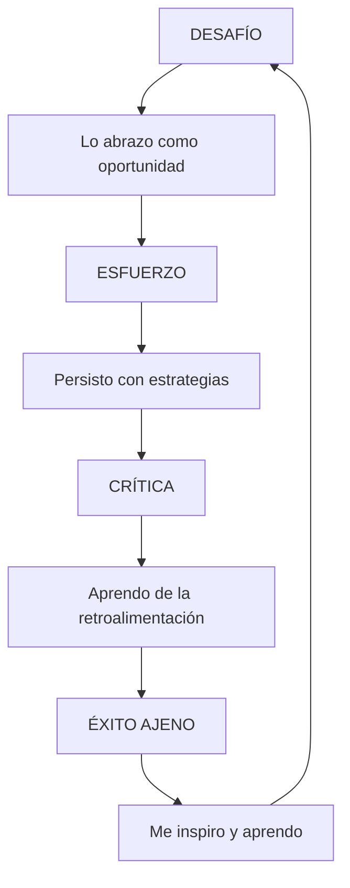
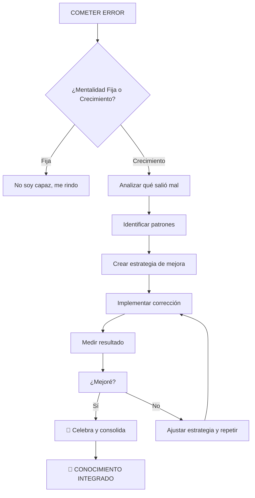
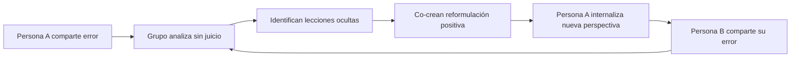
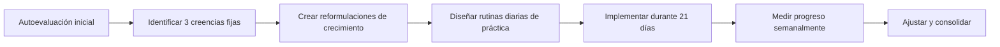

# MASTERCLASS: Mentalidad de Crecimiento - Cómo Transformar tu Mente para el Éxito 🧠🌱

## INTRODUCCIÓN: POR QUÉ ESTA MASTERCLASS ES DIFERENTE 🎯

La mayoría de las personas creen que su inteligencia, talento y habilidades son fijos — algo con lo que naces o no. Esta creencia, conocida como **mentalidad fija**, limita tu potencial, genera miedo al fracaso y te hace evitar desafíos.

Esta masterclass propone un cambio de paradigma: **tu cerebro es como un músculo que se fortalece con el entrenamiento adecuado**. La **mentalidad de crecimiento** te permite ver obstáculos como oportunidades, esfuerzo como camino hacia la maestría y retroalimentación como combustible para mejorar.

> **🎯 Objetivo de Aprendizaje** — Al final de esta guía, podrás identificar si operas desde una mentalidad fija o de crecimiento, reprogramar creencias limitantes, aplicar estrategias concretas de aprendizaje y construir un sistema personal de crecimiento continuo.

> **⚠️ Advertencia educativa** — Este contenido es formativo. Cambiar patrones mentales profundos requiere tiempo, paciencia y práctica constante. No se trata de transformaciones mágicas, sino de pequeñas decisiones diarias.

---

## MAPA DEL WORKFLOW 🔄

```mermaid
flowchart LR
    A[Creencia Actual] --> B{¿Mentalidad Fija o Crecimiento?}
    B -->|Fija| C[Identificar Limitaciones]
    C --> D[Reprogramar Creencias]
    D --> E[Accionar con Estrategia]
    E --> F[Aprender del Resultado]
    F --> G[Mentalidad de Crecimiento]
    G --> A

    subgraph PILARES["Pilares de la Masterclass"]
        P1[🧠 Dos mentalidades]
        P2[💪 El poder del "aún"]
        P3[🔄 Abrazar el fracaso]
        P4[🎯 Elogiar el proceso]
    end

    style A fill:#FFE0B2
    style B fill:#E1BEE7
    style C fill:#FFCDD2
    style D fill:#C8E6C9
    style E fill:#B3E5FC
    style F fill:#F8BBD0
    style G fill:#C8E6C9
```

---

## PARTE 1: LOS DOS TIPOS DE MENTALIDAD - ¿CUÁL TIENES TÚ? 🧠

### 1.1 La Teoría de Carol Dweck 📚

Carol Dweck, psicóloga de Stanford, dedicó décadas a estudiar por qué algunas personas rinden más que otras frente a los mismos desafíos. Su descubrimiento fue revolucionario: **no es la inteligencia lo que marca la diferencia, sino la creencia sobre la propia inteligencia**.

> **⚡ Insight clave de Dweck**: Las personas con mentalidad fija evitan el fracaso a toda costa. Las personas con mentalidad de crecimiento lo ven como información valiosa.

### 1.2 Tabla Comparativa: Mentalidad Fija vs Mentalidad de Crecimiento

| Dimensión | Mentalidad Fija 🚫 | Mentalidad de Crecimiento ✅ |
|------------|---------------------|-------------------------------|
| **Creencia central** | "La inteligencia es estática" | "La inteligencia se desarrolla" |
| **Ante el desafío** | Lo evita para no fallar | Lo abraza como oportunidad |
| **Ante el fracaso** | Es una sentencia sobre su capacidad | Es información para mejorar |
| **Esfuerzo** | "Si tengo que esforzarme, no soy bueno" | "El esfuerzo es el camino hacia la maestría" |
| **Críticas** | Las ignora o se ofende | Las usa como retroalimentación |
| **Éxito ajeno** | Se siente amenazado | Se inspira y aprende |
| **Objetivos** | Demostrar que es inteligente/talentoso | Desarrollar nuevas habilidades |
| **Frente al error** | "No soy para esto" | "Todavía no lo domino" |

### 1.3 Test de Autodiagnóstico 🔍

Responde honestamente las siguientes afirmaciones:

| Afirmación | Tipo de mentalidad |
|------------|---------------------|
| Tu talento es algo con lo que naces, no se puede cambiar mucho | Mentalidad fija |
| Prefieres tareas que dominas antes que nuevas que te desafíen | Mentalidad fija |
| Cuando te critican, te defiendes o te frustras mucho | Mentalidad fija |
| El fracaso te dice que no eres bueno en esa área | Mentalidad fija |
| Te comparas con otros y te sientes inferior si no estás a su nivel | Mentalidad fija |
| Te rindes fácilmente cuando algo se pone difícil | Mentalidad fija |
| Evitas pedir ayuda para no parecer incompetente | Mentalidad fija |
| Cuando otros tienen éxito, te alegras y te preguntas qué puedes aprender | Mentalidad de crecimiento |
| El esfuerzo te hace mejor, incluso si no tienes talento natural | Mentalidad de crecimiento |
| Los errores son parte natural del aprendizaje | Mentalidad de crecimiento |
| Te emocionan los desafíos que te sacan de tu zona de confort | Mentalidad de crecimiento |
| La retroalimentación es un regalo, incluso si duele | Mentalidad de crecimiento |
| Prefieres aprender algo nuevo antes que demostrar que ya lo sabes | Mentalidad de crecimiento |
| Persistes ante obstáculos y buscas formas alternativas | Mentalidad de crecimiento |

**Interpretación**:
- Si respondiste "sí" a la mayoría de las afirmaciones de mentalidad fija, es hora de empezar a reprogramar tus creencias.
- Si respondiste "sí" a la mayoría de las afirmaciones de mentalidad de crecimiento, ya tienes una base sólida para seguir desarrollándote.

### 1.4 El Poder de la Palabra "Todavía" ✨

| Frase Mentalidad Fija | Frase Mentalidad de Crecimiento | Impacto |
|-----------------------|----------------------------------|---------|
| "No soy bueno para las matemáticas" | "No soy bueno para las matemáticas **todavía**" | Transforma imposibilidad en proceso |
| "No entiendo este concepto" | "No entiendo este concepto **todavía**" | Abre la puerta al aprendizaje |
| "No puedo hacerlo" | "No puedo hacerlo **todavía**" | Crea espacio para la práctica |
| "Esto es demasiado difícil" | "Esto es difícil, pero voy a aprender de ello" | Cambia la narrativa de amenaza a desafío |

---

## PARTE 2: LA NEUROCIENCIA DETRÁS DE LA MENTALIDAD DE CRECIMIENTO 🧬

### 2.1 Neuroplasticidad: Tu Cerebro es Moldeable 🔄

El concepto científico que respalda la mentalidad de crecimiento es la **neuroplasticidad** — la capacidad del cerebro para cambiar y adaptarse a lo largo de la vida.

Así como un músculo se fortalece con el entrenamiento, tu cerebro desarrolla nuevas conexiones neuronales cuando te expones a desafíos, practicas deliberadamente y aprendes de tus errores.

| Etapa | Qué ocurre en tu cerebro | Tiempo aproximado |
|-------|---------------------------|-------------------|
| Primer contacto con un conocimiento | Se forman conexiones iniciales | Minutos u horas |
| Práctica repetida con retroalimentación | Las rutas neuronales se refuerzan (mielinización) | Días o semanas |
| Uso fluido y automático | La habilidad se integra como parte de tu identidad | Meses o años |

### 2.2 Los 3 Niveles de Crecimiento Cerebral 📈

| Nivel | Característica | Tiempo de Formación | Estrategia Clave |
|--------|----------------|---------------------|------------------|
| **Conexiones iniciales** | Primer contacto con el conocimiento | Minutos/horas | Exposición repetida y consciente |
| **Mielinización** | Refuerzo de rutas neuronales | Días/semanas | Práctica deliberada con retroalimentación |
| **Automatización experta** | Habilidad fluida y natural | Meses/años | Desafíos variados y enseñanza a otros |

### 2.3 Tabla de Mitos sobre la Inteligencia

| Mito | Realidad Científica | Implicación |
|-------|---------------------|-------------|
| "Naces inteligente o no" | El cerebro cambia con cada experiencia de aprendizaje | Puedes volverte más inteligente con práctica |
| "El talento es innato" | El talento es práctica + pasión + oportunidades | El "talento natural" es mito |
| "Los genios no se esfuerzan" | Mozart, Einstein trabajaron 10+ años antes de su obra maestra | La excelencia requiere tiempo y esfuerzo deliberado |
| "A cierta edad no puedes aprender" | El cerebro mantiene plasticidad toda la vida | Nunca es tarde para desarrollar nuevas habilidades |
| "Los errores son fracasos" | El error es el mecanismo de aprendizaje del cerebro | Cada error es un dato valioso para ajustar estrategias |

---

## PARTE 3: ESTRATEGIAS CONCRETAS PARA DESARROLLAR MENTALIDAD DE CRECIMIENTO 🛠️

### 3.1 Las 4 Claves del Aprendizaje Según Dweck 🔑



### 3.2 Protocolo de Reprogramación Mental 🔄

Para transformar una creencia fija en mentalidad de crecimiento, sigue este proceso:

1. Identifica la creencia limitante en una situación concreta.
2. Busca el origen de esa creencia (experiencias pasadas, comentarios externos, comparaciones).
3. Reformúlala con lenguaje de crecimiento, usando palabras como "todavía", "estoy aprendiendo" o "puedo cambiar".
4. Reúne evidencia que contradiga la creencia fija.
5. Diseña una acción pequeña y medible para ponerla a prueba.
6. Practica la nueva afirmación hasta que se vuelva automática.

| Paso | Acción | Resultado |
|------|--------|-----------|
| 1 | Escribir la creencia fija exacta | Claridad |
| 2 | Identificar desencadenante y origen | Conciencia |
| 3 | Reformular con lenguaje de crecimiento | Nueva narrativa |
| 4 | Buscar evidencias contrarias | Desactivación de la creencia |
| 5 | Crear acción pequeña y medible | Experiencia real |
| 6 | Repetir hasta automatizar | Cambio duradero |

### 3.3 Tabla de Estrategias por Situación

| Situación Desafortunosa | Mentalidad Fija Típica | Mentalidad de Crecimiento 🎯 | Acción Concreta |
|--------------------------|------------------------|-------------------------------|-----------------|
| **Recibes crítica constructiva** | "No valgo lo que hago" | "Tengo información valiosa para mejorar" | Agradece, anota puntos específicos, crea plan de mejora |
| **Cometes un error público** | "Soy un fracaso, todos me juzgan" | "Fui valiente al intentarlo. ¿Qué aprendí?" | Analiza el error, comparte la lección, sigue adelante |
| **Alguien más tiene éxito** | "Yo nunca podré hacer eso" | "Su éxito es inspiración. ¿Qué puedo aprender de su camino?" | Estudia su proceso, identifica estrategias replicables |
| **Enfrentas un problema nuevo** | "No estoy preparado para esto" | "Esta es mi oportunidad de aprender algo nuevo" | Desglosa el problema, busca recursos, pide ayuda |
| **Tu progreso es lento** | "No tengo lo que se necesita" | "El dominio requiere tiempo. Cada paso cuenta" | Mide progreso a largo plazo, celebra micro-victorias |
| **Te comparas con otros** | "Soy inferior a ellos" | "Cada uno tiene su journey. Me enfoco en mi progreso" | Compara solo con tu versión del mes pasado |

### 3.4 El Proceso de la Resiliencia 💪

```text
FRACASO → INTERPRETACIÓN → EMOCIÓN → ACCIÓN → RESULTADO

Mentalidad Fija:     "Fracaso" → "No soy capaz" → "Desesperanza" → "Me rindo" → "Estancamiento"
Mentalidad Crecimiento: "Datos" → "Tengo información" → "Curiosidad" → "Estrategia mejorada" → "Progreso"
```

---

## PARTE 4: EL ROL DEL ESFUERZO Y LA PRÁCTICA DELIBERADA 🎯

### 4.1 El Talento es un Mito: La Ciencia de la Práctica Deliberada 📊

Anders Ericsson, pionero en el estudio de la excelencia, demostró que **10,000 horas de práctica deliberada** (no solo práctica) separan a los expertos de los novatos.

| Tipo de Práctica | Característica | Resultado |
|-------------------|----------------|-----------|
| **Práctica Ingenua** | Repetir lo mismo una y otra vez sin mejorar | Estancamiento |
| **Práctica Deliberada** | Enfocarse en puntos débiles con retroalimentación constante | Mejora exponencial |
| **Práctica Reflexiva** | Analizar qué funcionó, qué no y por qué | Aprendizaje profundo |
| **Práctica Enseñando** | Explicar conceptos a otros | Dominio real y consolidación |

### 4.2 Sistema de Práctica Deliberada

Anders Ericsson, pionero en el estudio de la excelencia, demostró que **10,000 horas de práctica deliberada** separan a los expertos de los novatos.

Una práctica es deliberada cuando:

| Característica | Descripción |
|----------------|-------------|
| Enfoque específico | Trabajas en un componente concreto de la habilidad, no en la habilidad completa |
| Retroalimentación constante | Sabes inmediatamente si lo hiciste bien o mal |
| Dificultad óptima | Estás en tu zona de crecimiento, ni muy fácil ni imposible |
| Repetición con corrección | Repites el mismo componente hasta mejorarlo, no repites errores |
| Objetivo medible | Sabes exactamente qué estás intentando mejorar y cómo medirlo |

**Ejemplo práctico**: si estás aprendiendo a programar, no digas "voy a practicar programación". En su lugar, diseña una sesión deliberada: "voy a resolver 5 ejercicios de condicionales complejas, pedir feedback a un programador senior, y repetir los que falle hasta hacerlos sin errores".

### 4.3 Tabla de Zonas de Práctica

| Zona | Nivel de Dificultad | Sensación | Resultado en Mentalidad |
|-------|---------------------|-----------|------------------------|
| **Zona de pánico** | > 0.95 | Ansiedad, bloqueo | Refuerza mentalidad fija ("no puedo") |
| **Zona de confort** | < 0.5 | Aburrimiento, automatismo | Estancamiento, falsa sensación de dominio |
| **Zona de flow** | 0.7 - 0.9 | Concentración profunda, desafiante pero alcanzable | Crecimiento óptimo, refuerza mentalidad de crecimiento |
| **Zona de aprendizaje** | 0.5 - 0.7 | Esfuerzo consciente, algunos errores | Progreso constante, desarrollo de nuevas habilidades |

---

## PARTE 5: EL ROL DEL ERROR Y LA RETROALIMENTACIÓN 🔄

### 5.1 Por Qué el Fracaso es Tu Mejor Maestro 🎓

> **💡 Insight de Carol Dweck**: En un estudio con estudiantes, aquellos con mentalidad de crecimiento no solo persistían más, sino que **mejoraban significativamente sus calificaciones** después de recibir retroalimentación negativa.

### 5.2 El Proceso de Aprendizaje desde el Error



### 5.3 Tabla de Tipos de Retroalimentación y Cómo Aprovecharlos

| Tipo de Retroalimentación | Reacción Mentalidad Fija | Reacción Mentalidad de Crecimiento | Estrategia de Aprovechamiento |
|---------------------------|---------------------------|------------------------------------|-------------------------------|
| **Crítica directa** | "Me están atacando, no valgo" | "Tengo puntos específicos para mejorar" | Anota los puntos, pide ejemplos concretos, crea plan |
| **Error en proyecto** | "Soy un desastre, no debería intentarlo" | "Este error me enseña qué funciona y qué no" | Documenta el error, extrae lecciones, ajusta el proceso |
| **Comparación social** | "Soy inferior a esa persona" | "Su camino es diferente. ¿Qué puedo aprender?" | Analiza su proceso, no solo el resultado |
| **Fracaso público** | "Nadie me respetará después de esto" | "Fui valiente al intentarlo. Comparto la experiencia" | Comunica lo aprendido, normaliza el error como parte del proceso |
| **Feedback 360°** | "No soy bueno en nada" | "Tengo áreas de mejora específicas" | Prioriza 2-3 áreas, trabaja en ellas sistemáticamente |

### 5.4 Ejercicio: Análisis Post-Error 📝

Aplica este marco estructurado después de un error o fracaso:

1. **Contextualiza sin juicio**: describe qué pasó, qué esperabas que pasara y qué factores influyeron. Separa lo que dependía de ti de lo que no.
2. **Extrae lecciones específicas**: pregúntate qué habilidad faltaba, qué información faltaba, qué harías diferente, qué recurso necesitarías y si hay patrones en errores similares.
3. **Crea un plan de mejora concreto**: define la habilidad a desarrollar, el recurso a adquirir, el plan de práctica, las fechas de revisión y quién puede ayudarte.
4. **Reformula el error como oportunidad**: escribe una nueva versión del evento que destaque lo aprendido y el siguiente paso.

| Paso | Pregunta clave | Resultado |
|------|----------------|-----------|
| Contextualizar | ¿Qué pasó y qué esperaba? | Objetividad |
| Extraer lecciones | ¿Qué patrones veo? | Aprendizaje específico |
| Plan de mejora | ¿Cómo practico esto? | Acción medible |
| Reformular | ¿Cómo lo cuento de otra forma? | Narrativa de crecimiento |

---

## PARTE 6: I DO / WE DO / YOU DO - EJERCICIOS PROGRESIVOS 🎓

### 6.1 I Do — Modelando la mentalidad de crecimiento 🧭

**Objetivo**: Experimentar el proceso de transformación de una creencia fija en mentalidad de crecimiento

| Paso | Acción | Tiempo |
|------|--------|--------|
| 1 | Identifica una creencia fija que tengas actualmente | 3 min 🧐 |
| 2 | Escribe evidencia que la contradiga | 5 min ✍️ |
| 3 | Reformúlala con la palabra "todavía" | 2 min 🔄 |
| 4 | Diseña una acción pequeña para ponerla a prueba | 3 min 🎯 |
| 5 | Comprométete a realizarla esta semana | 2 min ✅ |

### 6.2 We Do — Práctica colaborativa de mentalidad de crecimiento 🧑‍🤝‍🧑

**Ejercicio grupal**: Compartan un error reciente y reformúlense entre todos



**Reglas del ejercicio**:
1. Sin juicios: "no hay errores, solo datos"
2. Sin consejos no solicitados: solo preguntas poderosas
3. Toda crítica se transforma en pregunta de crecimiento
4. Cada participante debe salir con una lección concreta

### 6.3 You Do — Sistema personal de mentalidad de crecimiento 🚀

**Tarea**: Diseña tu sistema personal para cultivar mentalidad de crecimiento



**Checklist de implementación**:

- [ ] Completo el test de mentalidad y documente mi punto de partida
- [ ] Identifico 3 creencias fijas que me limitan actualmente
- [ ] Reformulo cada una con lenguaje de crecimiento ("todavía", "puedo aprender")
- [ ] Diseño mi rutina matutina con afirmaciones de crecimiento
- [ ] Creo un sistema de registro de errores y lecciones (diario o app)
- [ ] Selecciono 1 desafío para abrazar esta semana (zona de crecimiento)
- [ ] Identifico a 1 persona que admira por su mentalidad de crecimiento
- [ ] Programo revisión semanal de progreso (15 minutos los domingos)
- [ ] Celebro 3 micro-victorias de aprendizaje esta semana

---

## PARTE 7: EL LENGUAJE DE LA MENTALIDAD DE CRECIMIENTO 🗣️

### 7.1 Cómo las Palabras Moldean tu Realidad 💬

El lenguaje que usas contigo mismo no es solo comunicación — es un **programa neuronal** que refuerza creencias. Cambiar tu vocabulario interno es uno de los ejercicios más poderosos para transformar tu mentalidad.

| Categoría | Frase Mentalidad Fija | Frase Mentalidad de Crecimiento |
|-----------|-----------------------|---------------------------------|
| **Capacidad** | "No soy bueno para X" | "Todavía estoy desarrollando habilidad en X" |
| **Esfuerzo** | "Si tengo que esforzarme, no soy bueno" | "El esfuerzo estratégico me hace mejorar" |
| **Error** | "Fracasé" | "Aprendí qué no funciona" |
| **Comparación** | "Ellos son más talentosos" | "Ellos han practicado más tiempo" |
| **Desafío** | "Esto es demasiado difícil para mí" | "Esto me desafía a crecer" |
| **Crítica** | "Me están criticando" | "Tengo retroalimentación valiosa" |
| **Éxito ajeno** | "Yo nunca podré" | "Su camino me inspira. ¿Qué puedo aprender?" |
| **Estancamiento** | "No avanzo" | "Estoy construyendo bases sólidas" |

### 7.2 Diario de Mentalidad de Crecimiento 📔

Usa este formato para cultivar una mentalidad de crecimiento mediante la reflexión diaria:

**Por la mañana**:
- ¿Qué desafío abrazaré hoy como oportunidad?
- ¿Qué quiero aprender específicamente hoy?
- ¿Cómo aplicaré esfuerzo estratégico?
- Si me equivoco, recordaré: es información, no una sentencia

**Por la noche**:
- ¿Qué error cometí y qué aprendí?
- ¿En qué momento usé mentalidad de crecimiento hoy?
- ¿Qué esfuerzo valioso hice hoy?
- ¿En qué área quiero crecer mañana?
- ¿Qué persona o recurso me ayudó a aprender hoy?

**Durante la semana**:
- ¿Qué creencias fijas surgieron?
- ¿Qué reformulaciones funcionaron bien?
- ¿Qué patrones de mentalidad fija repetí?
- ¿Qué victoria de mentalidad de crecimiento celebro?
- ¿Cuál será mi área de enfoque la próxima semana?

| Momento | Pregunta | Propósito |
|---------|----------|-----------|
| Mañana | ¿Qué desafío abrazo hoy? | Definir intención |
| Día | ¿Qué error aprendí? | Registrar aprendizaje |
| Noche | ¿Qué esfuerzo valioso hice? | Cerrar con evidencia |
| Semana | ¿Qué creencias fijas surgieron? | Auditoría de patrones |

---

## PREGUNTAS DE VERIFICACIÓN 📝

1. **Aplica**: Identifica 3 creencias fijas que tengas actualmente y reformúlalas en mentalidad de crecimiento usando la palabra "todavía".

2. **Analiza**: ¿En qué situaciones específicas te enfrentas a creencias limitantes? ¿Qué desencadenantes las activan?

3. **Diseña**: Crea tu rutina personal de journaling matutino y nocturno para cultivar mentalidad de crecimiento.

4. **Reflexiona**: ¿Qué error reciente te enseñó algo valioso? ¿Cómo lo reformularías desde la mentalidad de crecimiento?

5. **Crea**: Diseña un plan de práctica deliberada para una habilidad que quieras desarrollar en los próximos 3 meses.

---

## GLOSARIO RÁPIDO 📚

| Término | Definición | Emoji |
|---------|------------|-------|
| **Mentalidad fija** | Creencia de que inteligencia y talento son estáticos | 🚫 |
| **Mentalidad de crecimiento** | Creencia de que habilidades se desarrollan con esfuerzo | 🌱 |
| **Neuroplasticidad** | Capacidad del cerebro para cambiar y adaptarse | 🧠 |
| **Práctica deliberada** | Entrenamiento enfocado con retroalimentación constante | 🎯 |
| **Zona de flow** | Estado de desafío óptimo para aprendizaje | ⚡ |
| **Reframe** | Reformulación positiva de una creencia limitante | 🔄 |
| **Resiliencia** | Capacidad de recuperarse de fracasos y seguir adelante | 💪 |
| **Todavía** | Palabra clave para transformar mentalidad fija | ✨ |

---

## RECURSOS ADICIONALES 📦

### Libros Esenciales 📚
- "Mindset: La actitud del éxito" - Carol Dweck
- "Peak: Secrets from the New Science of Expertise" - Anders Ericsson
- "Atomic Habits" - James Clear
- "Grit" - Angela Duckworth
- "El cerebro que cambia" - Norman Doidge
- "La psicología del aprendizaje" - Robert Bjork

### Cursos y Plataformas 🎓
- **Coursera**: "Learning How to Learn" (Barbara Oakley)
- **edX**: "The Science of Learning" (Harvard)
- **MasterClass**: "Thinking" (Joyce Carol Oates)
- **Udemy**: Cursos de crecimiento personal y mentalidad

### Apps y Herramientas 📱
- **Journaling**: Day One, Reflectly, Notion
- **Hábitos**: Habitica, Streaks, Loop Habit Tracker
- **Aprendizaje**: Anki (repetición espaciada), Notion (sistema de conocimiento)
- **Mindfulness**: Headspace, Calm, Waking Up

### Podcasts 🎙️
- "The Tim Ferriss Show" - Entrevistas con expertos en rendimiento
- "The School of Greatness" - Lewis Howes
- "The Mindset Mentor" - Rob Dial
- "Huberman Lab" - Neurociencia aplicada

### Comunidades 👥
- **Reddit**: r/growthmindset, r/selfimprovement
- **Discord**: Servidores de desarrollo personal
- **Meetup**: Grupos locales de aprendizaje

---

## NOTAS FINALES 🎓

La mentalidad de crecimiento no es un estado que alcanzas, sino una **práctica continua**. Como cualquier habilidad, se fortalece con el uso deliberado y la reflexión constante.

Recuerda:
1. **Tu cerebro es plástico** — puedes cambiar y mejorar en cualquier momento
2. **Los errores son información** — cada fallo te acerca al éxito si aprendes de él
3. **El esfuerzo estratégico** supera al talento natural a largo plazo
4. **La comparación** solo contigo mismo del mes pasado es justa
5. **El lenguaje que usas** moldea la realidad que experimentas

> **🌟 Mensaje final**: La mentalidad de crecimiento es el superpoder más accesible que existe. No requiere recursos económicos, solo la decisión de ver cada desafío como una oportunidad y cada error como un maestro.

---

**Creado con propósito educativo. El crecimiento verdadero comienza cuando decides que tu potencial no está limitado por tu punto de partida, sino por tu disposición a aprender.**

🧠🌱✨
