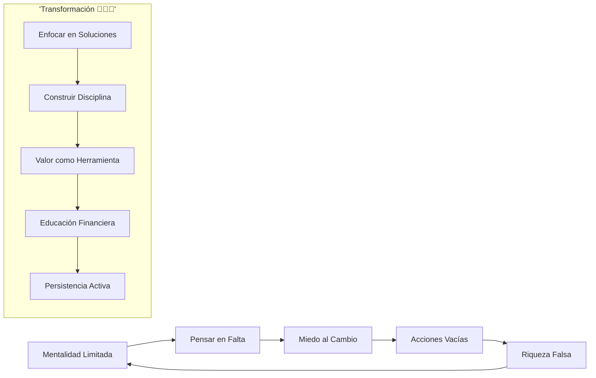
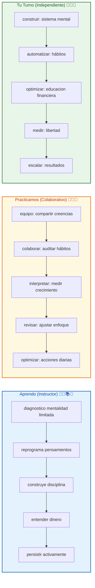

# 🚀 MASTERCLASS: Mentalidad de Riqueza — De la Mentalidad al Resultado 🔥🧠💰🎯

## 🎯 INTRODUCCIÓN: POR QUÉ ESTE MASTERCLASS ES DIFERENTE 💡⚡🌟🚀

La cultura cree que la riqueza comienza con el dinero. Pero la verdadera transformación ocurre **primero en la mente**. Tu situación actual es el reflejo de tus decisiones internas, no de tu cuenta bancaria.

Este masterclass te guiará a: **reprogramar tu mente para el crecimiento**, **construir disciplina real**, y **convertir el dinero en tu herramienta, no en tu meta**.

> **🎯 Objetivo de Aprendizaje** — Al final de esta guía, reprogramarás tu mentalidad para el éxito, establecerás hábitos disciplinados, entenderás el dinero como herramienta y construirás libertad financiera con persistencia.

> **⚠️ Advertencia** — Este contenido es formativo. El cambio real requiere acción constante. No hay atajos, solo decisiones diarias alineadas con tus metas.

---

## 🗺️ MAPA DEL WORKFLOW DE LA MENTALIDAD DE RIQUEZA 🗺️🚀🧠💰⚡



| Fase 🌍 | Pregunta clave ❓ | Output principal 🎯 |
|--------|------------------|------------------|
| **Mentalidad Limitada** 🧠 | ¿Qué piensas en repetida? | Identificación de patrones |
| **Foco en Falta** ❌ | ¿Qué mensajes internos repites? | Reconocimiento de limitaciones |
| **Miedo al Cambio** 😨 | ¿Qué te paraliza? | Identificación de miedos |
| **Acciones Vacías** 🔄 | ¿Qué consumes sin resultados? | Mapeo de actividades |
| **Riqueza Falsa** 💰 | ¿Qué persigues sin valor? | Reorientación de prioridades |

---



---

## 🧠🌟 PARTE 1: LA MENTALIDAD COMO MOTOR DE TRANSFORMACIÓN 🧠✨🎯💡🔥

### 1.1 🧠⚡ El cerebro programado para la escasez

El fracaso no es casualidad. Es el resultado de entrenar la mente en:
- **Miedo constante** 😨⚠️❌
- **Enfocarse en lo negativo** 🚫🌑🧠
- **Creer en limitaciones** 🚫🎯🔒
- **Ignorar soluciones** ❓🔄🔇

Pero el cambio real ocurre cuando **reprogramas tu atención**:

| Mentalidad de Falta 🚫 | Mentalidad de Crecimiento ✅ |
|----------------------|---------------------------|
| "No tengo suerte" | "Creo oportunidades" 🍀✨ |
| "Es muy difícil" | "Es posible aprender" 📚🧠 |
| "No puedo hacerlo" | "¿Cómo puedo hacerlo?" ❓🚀 |
| "Otros tienen ventaja" | "Tengo mis propias fortalezas" 💪🎯 |
| "Fracaso seguro" | "Aprendo de cada intento" 📈🌱 |

### 1.2 📊📈 Tabla: reprogramación mental diaria

| Momento 🕖 | Hábito de Falta 🚫 | Hábito de Crecimiento ✅ |
|----------|-------------------|--------------------------|
| Al despertar ☀️ | Revisar preocupaciones | Visualizar metas 🎯 |
| Al percibir estrés 😤 | Enfocar en problema | Buscar solución 🔍 |
| Antes de dormir 🌙 | Repasar fracasos | Agradecer aprendizajes 🙏 |
| Al comparar 👀 | Envidia disfrazada | Inspiración productiva ✨ |
| Al fracasar 💥 | Culpa interna | Lección identificada 📚 |

### 1.3 🛠️🔧 Script: enfocar atención en soluciones

```
🧠 Diario de reprogramación 🧠📅🌟:
1. ¿Qué pensamiento negativo repito hoy? 🚫🧠❓
2. ¿Qué evidencia lo desmiente? 🔍✅🎯
3. ¿Qué pensamiento de crecimiento reemplaza? 🌱🧠✨
4. ¿Qué acción pequeña demuestra mi nueva creencia? ⚡👣🚀
5. ¿Qué agradecimiento tengo hoy? 🙏💚🎯
```

---

## 💪🔥 PARTE 2: DISCIPLINA Y HÁBITOS — LA DIFERENCIA REAL 💪✨⏰🎯🔧

### 2.1 💪⏰ La motivación no es suficiente

"La motivación es temporal. La disciplina es constante." — Brian Tracy adaptado

La motivación te impulsa 1 día. La disciplina te construye una vida:

| Motivación Solitaria 🚫 | Disciplina Consistente ✅ |
|-----------------------|--------------------------|
| Alta energía momentánea | Energía sostenida ⚡ |
| Se apaga con fricciones | Persiste pase lo que pase 💪 |
| Depende del estado de ánimo | Independiente del ánimo 🧠 |
| Busca emociones altas | Busca resultados reales 🎯 |
| Se rompe fácilmente | Se fortalece con uso 🔧 |

### 2.2 📊📋 Tabla: hábitos que definen tu futuro

| Uso del Tiempo ⏱️ | Hábito Productivo ✅ | Hábito Vacío 🚫 |
|-------------------|--------------------|-------------------|
| 1 hora matutina ☀️ | Aprender algo nuevo 📚🧠 | Redes sociales 📱🌀 |
| 30 minutos de comida 🍽️ | Planificar el día 🎯📅 | Ver videos sin fin 📺🔄 |
| 1 hora de tarde 🌤️ | Ejecutar prioridad 💪🎯 | Procrastinar 😴🚫 |
| 1 hora de noche 🌙 | Reflexionar el día 🧠📝 | Consumir sin propósito 📺🌀 |
| Tiempo libre 🎮 | Invertir en desarrollo 🌱🚀 | Distraer sin crecer 🎮🚫 |

### 2.3 🛠️🔨 Framework: construir disciplina real

```
💪 Sistema de disciplina ⚡🧱🚀:
1. Elige 1 micro-hábito para hoy 🐢👣
2. Hazlo sin importar cómo te sientas 💪⚡
3. Registra que lo completaste ✅📝
4. Pregunta: "¿Qué aprendí haciendo?" 📚🧠
5. Amplía 10% mañana 🚀📈
```

---

## 💰🔨 PARTE 3: EL DINERO ES HERRAMIENTA, NO META 💰✨🛠️🎯🚀

### 3.1 💰🛠️ Transformarte en alguien valioso

No persigas el dinero. **Conviértete en alguien que lo atrae naturalmente**:

| Persiguiendo el Dinero 🚫 | Siendo Valioso ✅ |
|--------------------------|------------------|
| Correr tras ingresos | Resolver problemas 💡 |
| Esperar oportunidades | Crear oportunidades 🌟 |
| Vender tu tiempo | Entregar resultados 🎯 |
| Pedir empleo | Ofrecer valor 💼 |
| Comprar estatus | Generar estatus 🏆 |

### 3.2 📊📈 Tabla: valor que atrae dinero

| Habilidad de Valor 💪 | Acción Concreta ✅ | Dinero Atraido 💰 |
|---------------------|-------------------|-------------------|
| Resolver problemas 🔧 | Solución útil entregada 💡 | +20% |
| Ahorrar consistente 💰 | Presupuesto diario hecho 📊 | +15% |
| Invertir inteligente 📈 | Educación primero 🧠 | +30% |
| Networking real 👥 | Ayudar sin esperar 🤝 | +25% |
| Crear contenido 📝 | Compartir conocimiento 🧠 | +10% |

### 3.3 🛠️🎯 Script: convertirte en una máquina de valor

```
💎 Sistema de valor 💼💡🚀:
1. ¿Qué problema resuelvo hoy? 🔧🎯
2. ¿Cómo entrego solución real? 💡🚀
3. ¿Qué agravecimiento recibo? 💰✨
4. ¿Qué aprendí en el proceso? 📚🧠
5. ¿Qué amplío mañana? 📈🔥
```

---

## 📚💰 PARTE 4: EDUCACIÓN FINANCIERA PARA LA LIBERTAD 📚✨🎓💵🌟

### 4.1 📚🎓 Ganar, conservar y multiplicar

La verdadera libertad financiera requiere los 3 pilares:

| Pilar 📊 | Acción Concreta ✅ | Herramienta 💰 |
|---------|-------------------|---------------|
| **Ganar** 💼 | Resolver problemas de valor 💡 | Habilidades + tiempo ⏰ |
| **Conservar** 💰 | Presupuesto sin fallas 📊 | Control de gastos 🛡️ |
| **Multiplicar** 📈 | Invertir con educación 🧠 | Interés compuesto ⚡ |

### 4.2 📊📋 Tabla: educación financiera básica

| Concepto 💡 | Acción Inmediata ✅ | Herramienta 🛠️ |
|----------|-------------------|---------------|
| Presupuesto 💰 | Registrar cada gasto 📊 | App: Fintual, Monarch |
| Ahorro mínimo 💵 | 10% de todo ingreso 📥 | Automatización bank 🏦 |
| Inversión segura 📈 | Educarte antes de arriesgar 📚 | Libros: "Rich Dad" 🧠 |
| Deuda inteligente 💳 | Solo para activos 💼 | Análisis ROI 📊 |
| Libertad real 🕊️ | No depender de un solo ingreso 🌟 | Plataformas múltiples 🔗 |

### 4.3 🛠️🔧 Framework: primeros 30 días financieros

```
💰 Plan financiero 30 días 📊💰🚀:
1. Día 1-10: Auditar todos los gastos 📊🧠
2. Día 11-20: Automatizar ahorro 10% 💵🤖
3. Día 21-30: Invertir primer $100 📈🚀
4. Semana 5: Evaluar avances 📊🎯
5. Mes 2: Duplicar sistema 💪📈
```

---

## 🔥🎯 PARTE 5: RESPONSABILIDAD Y PERSISTENCIA — EL CAMBIO ACTIVO 🔥✨💪🔄🚀

### 5.1 🔥🔄 El poder de "¿Cómo puedo?"

"No preguntes '¿por qué no puedo?', pregúntale al universo '¿cómo puedo?'." — Brian Tracy

| Pregunta de Víctima 🚫 | Pregunta de Creador ✅ |
|-----------------------|-------------------------|
| ¿Por qué nadie me ayuda? 😢 | ¿Cómo puedo ayudar primero? 🤝 |
| ¿Por qué no tengo suerte? 🍀🚫 | ¿Cómo creo mi suerte? 🌟🔧 |
| ¿Por qué es difícil? 💪🚫 | ¿Cómo lo hago posible? 🧠🚀 |
| ¿Por qué no funciona? ❌🌀 | ¿Cómo lo ajusto hoy? 🔧🎯 |
| ¿Por qué fracasé? 💥🚫 | ¿Qué aprendí hoy? 📚🌱 |

### 5.2 📊📈 Tabla: persistencia efectiva

| Momento ⚠️ | Resistencia al Cambio 🚫 | Persistencia Activada ✅ |
|-----------|------------------------|------------------------|
| Inicio difícil | Rendirse al día 2 | Continuar 30 días 💪 |
| Fracaso inicial | Culparse al mundo | Aprender de errores 📚 |
| Duda interna | Detenerse a pensar | Actuar mientras piensas ⚡ |
| Comparaciones | Envidiar a otros | Inspirarte y actuar 🚀 |
| Estancamiento | Cambiar de estrategia | Ajustar y seguir 🎯 |

### 5.3 🛠️⚡ Script: construir responsabilidad diaria

```
🎯 Diario de responsabilidad 🧠💪🔥:
1. ¿Qué decisión tome hoy? ⚖️🎯
2. ¿Qué acción ejecuté luego? 💪🚀
3. ¿Qué resultado tuve? 📊🎯
4. ¿Qué asumo del resultado? 🙌🧠
5. ¿Qué repito mañana? 🔁🌱
```

---

## 🎓🏫 PARTE 6: I DO / WE DO / YOU DO — EJERCICIOS PRÁCTICOS 🎓✨🏫👥🎯

### 6.1 🏫📝 I Do — Diagnosticar mentalidad limitada

| Paso 🚶 | Acción ⚡ | Resultado esperado ✅ |
|------|--------|--------------------|
| 1️⃣ 🧠 | Listar 5 creencias limitantes | Clarity mental 💡 |
| 2️⃣ 🎯 | Reemplazar con creencias reales | Mentalidad renovada 🌟 |
| 3️⃣ 💪 | Ejecutar 1 micro-hábito hoy | Disciplina iniciada 🔧 |
| 4️⃣ 💰 | Auditar 1 gasto innecesario | Ahorro activado 💵 |

### 6.2 👥🤝 We Do — Auditoría de hábitos grupal

**Tarea colaborativa en grupo:**

```
👥 Auditoría grupal 👥📊🤝:
1. Comparto mi creencia más limitante 🧠🚫
2. El grupo sugiere alternativa real 🌟💡
3. Definimos hábito grupal esta semana 💪🎯
4. Medimos avance en 7 días 📈📊
5. Celebran los logros 🌟🎉
```

### 6.3 🎯🚀 You Do — Sistema de transformación personal

**Tarea personal:**

| Sistema 🛠️ | Acción ⚡ | Alerta 🔔 |
|------------|---------|----------|
| 🧠 Mentalidad | 5 minutos de visualización diaria | Sin claridad en 3 días |
| 💪 Disciplina | 1 micro-hábito sin fallar 21 días | Sin constancia en 7 días |
| 💰 Finanzas | Presupuesto actualizado esta semana | Sin control en 14 días |
| 📚 Educación | 1 libro financiero terminado | Sin lectura en 30 días |
| 🔥 Persistencia | Reintentar 1 meta fracasada | Sin acción en 30 días |

---

## ✅🏆 PARTE 7: CHECKLIST FINAL 🏁✨✔️🎯💪🌟

| Bloque 🧩 | Check ✅ |
|--------|-------|
| **Mentalidad reprogramada** | 🧠 Enfocada en crecimiento |
| **Disciplina construida** | 💪 Hábitos consistentes |
| **Dinero como herramienta** | 💰 No persigues, atraes |
| **Educación financiera** | 📚 Ganar, conservar, multiplicar |
| **Persistencia activa** | 🔥 Responsabilidad total |
| **Sistema personal establecido** | 🎯 Rutina transformadora |

---

## 📝🔍 PARTE 8: PREGUNTAS DE VERIFICACIÓN 📝✨❓💭🎯

Responde cada pregunta basándote en los conceptos. Escribe o comparte para profundizar. 📝

### Preguntas sobre Mentalidad

1. **🧠 Aplica**: ¿Qué pensamiento limitante repites sin dar cuenta? ¿Qué creencia de crecimiento lo reemplazaría?

2. **🔄 Analiza**: ¿Has caído en la víctima de tus circunstancias? ¿Qué pregunta "¿cómo puedo?" cambiaría tu día?

### Preguntas sobre Disciplina

3. **💪 Diseña**: ¿Qué micro-hábito puedes ejecutar mañana sin excusa? ¿Qué recompensa simbólica te darás al cumplirlo?

4. **⏰ Evalúa**: ¿Qué 20% de tus hábitos genera el 80% de resultados? ¿Cómo los fortaleces mañana?

### Preguntas sobre Dinero

5. **💰 Reflexiona**: ¿Qué problema resuelves que alguien pagaría? ¿Cómo monetizarías esa solución esta semana?

6. **📈 Calcula**: Si ahorras $10 diarios, ¿qué tendrías en 5 años con interés compuesto?

### Preguntas Integradoras

7. **🔗 Conecta**: ¿Cómo se relaciona tu mentalidad con tus hábitos financieros actuales?

8. **💡 Propón un sistema**: Diseña un sistema de 15 minutos diarios que combine mentalidad, disciplina y educación financiera.

---

## 📚📖 PARTE 9: GLOSARIO RÁPIDO 📚✨📖🧠💡

| Término 📝 | Definición 📋 | Icono |
|---------|------------|-------|
| **Mentalidad de Abundancia** 🧠🌟 | Creer en posibilidades infinitas | 🧠🌟✨ |
| **Disciplina Real** 💪🔧 | Acción consistente sin motivación | 💪🔧🚀 |
| **Valor Primero** 💡🎯 | Resolver antes de recibir | 💡🎯💰 |
| **Libertad Financiera** 💵🕊️ | No depender de un solo ingreso | 💵🕊️🌟 |
| **Persistencia Activa** 🔥💪 | Asumir y reintentar | 🔥💪🔄 |
| **Educación Financiera** 📚💰 | Ganar, conservar, multiplicar | 📚💰📈 |
| **Reprogramación Mental** 🧠🔄 | Cambiar pensamientos limitantes | 🧠🔄🌱 |
| **Responsabilidad Total** 🎯🙌 | Asumir cada resultado | 🎯🙌🔥 |

---

## 📐📏 ANEXO: FORMATO IDEAL PARA MASTERCLASS EDUCATIVAS 📐✨📏🎨

### 📏🎨 Estructura visual recomendada

El ancho óptimo 📏 para masterclasses educativas es **60–75 caracteres por línea** 📐.

```css
.article-content {
  🎨 font-size: 18px;
  📏 line-height: 1.75;
  📐 max-width: 65ch;
}
```

### 🎯🔥 CIERRE PRÁCTICO

| Nivel 📊 | Debes poder hacer ✨ |
|-------|------------------|
| **🏫 I Do** | ✅ Diagnosticar y reprogramar mentalidad |
| **👥 We Do** | 🤝 Auditar hábitos colectivos |
| **🎯 You Do** | 🚀 Construir sistema de transformación |

---

## 🎁🚀 RECURSOS ADICIONALES 🎁✨📚🎥💻

- 📖 [📚 Brian Tracy - Éxito](https://www.briantracy.com)
- 🎥 [🎬 Video original: "Mentalidad de Riqueza"]
- 💻 [💻 Apps: Notion, YNAB, Audible]
- 🛠️ [🛠️ Libros: "Think and Grow Rich", "Atomic Habits", "Rich Dad Poor Dad"]

---

**🎉 Felicitaciones! Has completado la masterclass de la mentalidad de riqueza. 🧠 Ahora tienes el sistema para transformar pensamientos, construir disciplina y lograr libertad financiera con persistencia.**

> **💡 Próximo paso:** La próxima vez que sientas "no puedo", di en voz alta: "¿Cómo puedo?" Luego escribe 3 posibles respuestas. La mentalidad cambia con la acción, no con la motivación. 🔥🧠🚀