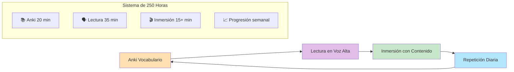
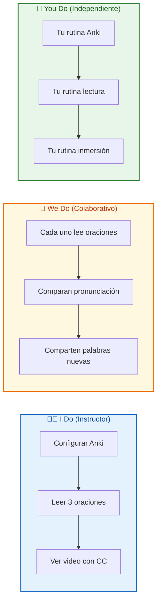
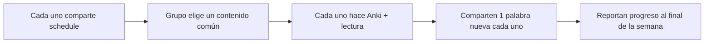
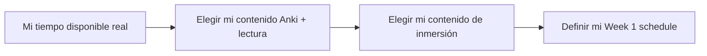

# MASTERCLASS: Método Alberto Salas - 250 Horas para Dominar Inglés 🇬🇧⏱️

## INTRODUCCIÓN: POR QUÉ ESTA MASTERCLASS ES DIFERENTE 🎯

La mayoría de los métodos prometen fluency en 3 meses o con "trucos milagrosos". Alberto Salas propone algo radicalmente distinto: **250 horas de estudio deliberado**, sin atajos, pero con un sistema tan simple que cualquiera puede sostenerlo.

El objetivo no es aprender inglés "rápido". El objetivo es **construir el hábito de exposición diaria** que tu cerebro necesita para reconocer patrones, conectar sonidos con significados y, eventualmente, pensar en inglés sin traducir.

> **🎯 Objetivo de Aprendizaje** — Al final de esta guía, podrás aplicar los 3 pasos diarios del método, configurar Anki con el límite de 20 minutos, diseñar tu schedule progresiva y mantener la motivación durante las 250 horas.

> **⚠️ Advertencia educativa** — Este contenido es formativo. 250 horas son un promedio, no una garantía. Tu progreso depende de la consistencia, no de la intensidad ocasional.

---

## 🗺️ MAPA DE LA MASTERCLASS 🧭

| 🧩 Fase | ❓ Pregunta que responde | 📤 Resultado principal |
|---------|------------------------|------------------------|
| **📚 Anki** | ¿Cómo aprendo vocabulario sin olvidarlo? | Palabras en memoria a largo plazo |
| **🗣️ Lectura** | ¿Cómo conecto texto con sonido? | Reconocimiento auditivo de palabras |
| **🎬 Inmersión** | ¿Cómo hago que el inglés sea natural? | Comprensión de contenido real |
| **📈 Progresión** | ¿Cómo evito el estancamiento? | Aumento gradual de exposición |

---

## 🧩 PARTE 1: LOS 250 HORAS - POR QUÉ HORAS, NO MESES 🧩

### 1.1 ❓ PRETEST

¿Cuántas horas de estudio creés que necesitás para alcanzar un nivel funcional de inglés?

> Respuesta esperada: Entre 300 y 500 horas.
> Si acertás: camino rápido → andá al punto 7.

### 1.2 🎯 POR QUÉ + LOGRO

Importa porque **el tiempo calendario es mentira**: 1 hora diaria real equivale a 30 horas mensuales, no a "estudié un mes". Vas a lograr **tener una métrica honesta** de tu progreso, sin autoengaños.

### 1.3 ⚡ VICTORIA RÁPIDA (<5 min)

Calculá: 20 min Anki + 35 min lectura + 15 min inmersión = 70 minutos por día. 70 minutos × 6 días = 7 horas semanales. 250 horas ÷ 7 horas = ~36 semanas. ¿Cuánto es eso en meses? → Aproximadamente 9 meses con 6 días por semana.

### 1.4 💡 CONCEPTO

Analogía: Aprender inglés es como **caminar 250 kilómetros** — no importa si tardás 9 meses o 12, lo que importa es que cada día caminés un poco. Saltarte días es como pararse a descansar 2 horas en el medio del camino.

Definición: El método mide el aprendizaje en **horas de exposición deliberada**, no en meses o años. 250 horas es el promedio que la investigación señala para alcanzar un nivel B1 funcional (conversaciones cotidianas, consumo de contenido).

### 1.5 👀 EJEMPLO RESUELTO

| Perfil | Minutos/día | Días/semana | Horas/semana | Tiempo hasta 250h |
|--------|-------------|-------------|--------------|-------------------|
| **Consistente** | 70 | 6 | 7 | ~9 meses |
| **Moderado** | 50 | 5 | 4.2 | ~12 meses |
| **Intenso** | 100 | 6 | 10 | ~6 meses |

### 1.6 ⚠️ CONTRA-EJEMPLO / ERROR TÍPICO

Error: Estudian 4 horas un domingo y luego no tocan inglés hasta el próximo domingo.

Corrección: El cerebro aprende por repetición espaciada, no por maratones. 70 minutos diarios generan 10 veces más retención que 7 horas semanales concentradas.

### 1.7 🧪 PRÁCTICA

Calculá tu schedule ideal: ¿cuántos minutos podés dedicar cada día sin frustración? Escribilo en un papel.

> Respuesta esperada / criterio: Debe ser un número sostenible, no ambicioso. Si escribís 120 min pero solo podés cumplir 60, empezás con frustración. Mejor 50 minutos reales que 120 prometidos.

### 1.8 🔁 RECALL — Nivel Bloom: Aplicar

¿Por qué medir en horas y no en meses cambia tu forma de planificar el aprendizaje?

### 1.9 📌 IDEA CLAVE

250 horas no son una amenaza, son un destino: cada minuto que estudiás hoy te acerca 1 minuto más.

### 1.10 ✅ AUTO-CHEQUEO + SIGUIENTE

- [ ] Calculé mi tiempo disponible real por día
- [ ] Entiendo por qué las horas son mejor métrica que los meses
- [ ] Tengo mi número de minutos diarios definido

Siguiente: El primer paso del método — Anki, tu sistema de vocabulario.

---

## 📚 PARTE 2: ANKI - VOCABULARIO CON LÍMITE DE TIEMPO 📚

### 2.1 ❓ PRETEST

¿Qué técnica de estudio usa Anki para evitar que olvides las palabras?

> Respuesta esperada: Repetición espaciada.
> Si acertás: camino rápido → andá al punto 7.

### 2.2 🎯 POR QUÉ + LOGRO

Importa porque **el vocabulario es el cuello de botella del listening y la lectura**. Sin palabras reconocibles, todo suena a ruido. Vas a lograr **tener un sistema que no te abandone** y que ajuste la carga a tu tiempo disponible.

### 2.3 ⚡ VICTORIA RÁPIDA (<5 min)

Descargá Anki en tu teléfono, creá una cuenta y generá tu primer mazo con 5 palabras en inglés + 1 imagen cada una. Eso tarda menos de 5 minutos.

### 2.4 💡 CONCEPTO

Analogía: Anki es como **un entrenador personal que te pregunta justo antes de olvidar** — ni muy temprano (aburrido), ni muy tarde (ya olvidaste).

Definición: Anki es una aplicación de flashcards que usa el algoritmo de repetición espaciada. Vos marcás cada palabra como "fácil", "bien" o "difícil", y el programa decide cuándo volver a mostrártela para maximizar la retención.

### 2.5 👀 EJEMPLO RESUELTO

| Regla | Valor | Por qué |
|------|-------|---------|
| Tiempo máximo | 20 minutos/día | Evita fatiga; la consistencia > cantidad |
| Tarjetas nuevas | Hasta 15/día | Ajustar hasta que la sesión entre en 20 min |
| Revisión | Lo que el algoritmo pida | Anki calcula el timing óptimo |
| Contenido | Palabras en contexto, no aisladas | "I drink coffee" mejor que "coffee = bebida" |

### 2.6 ⚠️ CONTRA-EJEMPLO / ERROR TÍPICO

Error: Agregar 50 tarjetas nuevas por día porque "quiero aprender rápido".

Corrección: Si tu sesión pasa de 20 minutos, estás creando una carga emocional. Mejor 10 tarjetas nuevas sostenibles que 50 que te hagan abandonar en 3 días.

### 2.7 🧪 PRÁCTICA

Creá un mazo de Anki con 10 palabras de un texto que estés leyendo. Configurá el límite de "tarjetas nuevas" hasta que la sesión dure menos de 20 minutos.

> Respuesta esperada / criterio: Si la sesión completa (nuevas + repasos) entra en 20 minutos, la configuración es correcta. Si pasa, bajá las tarjetas nuevas a 8 o 10.

### 2.8 🔁 RECALL — Nivel Bloom: Comprender

¿Por qué Alberto Salas limita Anki a 20 minutos en vez de pedir "50 tarjetas por día"?

### 2.9 📌 IDEA CLAVE

Anki no es un dictado: es un sistema que protege tu tiempo para que puedas sostenerlo durante meses sin quemarte.

### 2.10 ✅ AUTO-CHEQUEO + SIGUIENTE

- [ ] Descargué Anki y creé mi primer mazo
- [ ] Configuré el límite de tarjetas nuevas para sesión ≤20 min
- [ ] Entiendo la diferencia entre "tarjetas nuevas" y "repaso"

Siguiente: Lectura en voz alta para conectar texto con sonido.

---

## 🗣️ PARTE 3: LECTURA EN VOZ ALTA - DEL TEXTO AL OÍDO 🗣️

### 3.1 ❓ PRETEST

¿Qué habilidad entrena principalmente leer en voz alta textos en inglés?

> Respuesta esperada: Reconocimiento auditivo de palabras.
> Si acertás: camino rápido → andá al punto 7.

### 3.2 🎯 POR QUÉ + LOGRO

Importa porque **tu oído necesita familiarizarse con los sonidos del inglés** antes de entender conversaciones reales. Vas a lograr **escuchar una palabra y reconocerla** porque ya la viste escrita y la pronunciaste vos.

### 3.3 ⚡ VICTORIA RÁPIDA (<5 min)

Abrí cualquier texto en inglés, leé 3 oraciones en voz alta, grabate y compará tu pronunciación con un audio nativo. No hace falta que sea perfecto.

### 3.4 💡 CONCEPTO

Analogía: Leer en voz alta es como **pintar un mapa de sonidos** — cada palabra que pronunciás le marca a tu cerebro: "este sonido se escribe así, y se pronuncia así".

Definición: Leer textos en inglés en voz alta no busca perfección de pronunciación, sino **familiarizar al oído con los patrones sonoros** del idioma. El objetivo es que cuando escuches la palabra en un podcast, tu cerebro la reconozca porque ya la asociaste a un sonido.

### 3.5 👀 EJEMPLO RESUELTO

| Paso | Acción | Tiempo |
|------|--------|--------|
| 1 | Elegí un texto de nivel A1-A2 | 2 min |
| 2 | Leé 3-5 oraciones en voz alta | 5 min |
| 3 | Escuchá el audio nativo (si existe) | 5 min |
| 4 | Repetí las mismas oraciones, imitando el ritmo | 10 min |
| 5 | Anotá 2 palabras nuevas en Anki | 3 min |

### 3.6 ⚠️ CONTRA-EJEMPLO / ERROR TÍPICO

Error: Preocuparse por la pronunciación "perfecta" desde el día 1.

Corrección: El objetivo no es sonar como un nativo, sino que tu oído reconozca los sonidos. La pronunciación se pulirá con la inmersión, no con la lectura aislada.

### 3.7 🧪 PRÁCTICA

Leé 5 oraciones de un texto A1 en voz alta, luego escuchá el audio nativo. Anotá 1 palabra que pronunciaste diferente a como la escuchaste.

> Respuesta esperada / criterio: La palabra debe ser nueva o tener un sonido que tu oído no esperaba. Ejemplo: "through" se pronuncia /θruː/, no /θroʊ/.

### 3.8 🔁 RECALL — Nivel Bloom: Aplicar

¿Por qué Alberto Salas dice que la lectura en voz alta mejora la comprensión auditiva más que la pronunciación?

### 3.9 📌 IDEA CLAVE

Leer en voz alta entrena tu oído para reconocer palabras: cada sonido que producís es un sonido que luego podés identificar.

### 3.10 ✅ AUTO-CHEQUEO + SIGUIENTE

- [ ] Leí 5 oraciones en voz alta y las grabé
- [ ] Comparé mi pronunciación con audio nativo
- [ ] Anoté 1 palabra con diferencia sonora

Siguiente: Inmersión con contenido real en inglés.

---

## 🎬 PARTE 4: INMERSIÓN - CONTENIDO REAL EN INGLÉS 🎬

### 4.1 ❓ PRETEST

¿Qué nivel de comprensión es el ideal para contenido de inmersión, según el método?

> Respuesta esperada: 60-70%.
> Si acertás: camino rápido → andá al punto 7.

### 4.2 🎯 POR QUÉ + LOGRO

Importa porque **el inglés necesita dejar de ser "estudio" y pasar a ser "entretenimiento"**. Vas a lograr **consumir contenido real** (series, videos, podcasts) sin traducir todo mentalmente.

### 4.3 ⚡ VICTORIA RÁPIDA (<5 min)

Abrí Netflix o YouTube, buscá un video en inglés con subtítulos EN encendidas, mirá 5 minutos. Si entendés la historia sin ayuda constante, es tu contenido.

### 4.4 💡 CONCEPTO

Analogía: La inmersión es como **zambullirse en una pileta** — el agua está fría los primeros 30 segundos, pero luego se vuelve natural. Si solo metés un pie (contenido muy fácil), no te acostumbrás al frío.

Definición: Consumir contenido en inglés con audio y subtítulos en inglés, elegido de forma que entendás entre el 60% y 70% del significado por contexto visual o auditivo. El 30-40% restante lo completás con inferencia, no con traducción mental.

### 4.5 👀 EJEMPLO RESUELTO

| Herramienta | Uso | Ejemplo |
|-------------|-----|---------|
| **Netflix/Apple TV** | Series con CC en inglés | Stranger Things, The Office |
| **LingQ** | Lectura con palabras clickeables | Artículos cortos importados |
| **YouTube** | Videos con transcripción | TED-Ed, Vox, canales de interés |
| **Podcasts** | Audio sin video, con transcripción | The Daily, TED Talks Daily |

### 4.6 ⚠️ CONTRA-EJEMPLO / ERROR TÍPICO

Error: Poner contenido en inglés como ruido de fondo mientras trabajás.

Corrección: Inmersión efectiva requiere atención activa. Si estás respondiendo mails, no estás aprendiendo inglés. 15 minutos con CC y atención valen más que 2 horas de fondo.

### 4.7 🧪 PRÁCTICA

Buscá 1 contenido de inmersión que cumpla: audio EN + subtítulos EN + entendés el 60-70% por contexto. Escribí su nombre y por qué lo elegiste.

> Respuesta esperada / criterio: Debe ser un tema que te interese (no es una obligación sufrir contenido aburrido). Si no entendés nada, el contenido es muy difícil. Si lo entendés todo, es muy fácil.

### 4.8 🔁 RECALL — Nivel Bloom: Analizar

¿Por qué Alberto Salas enfatiza "escuchar activamente el audio" en vez de "leer los subtítulos"?

### 4.9 📌 IDEA CLAVE

La inmersión funciona cuando tu cerebro completa los huecos: si todo está traducido en subtítulos, el cerebro no hace el trabajo de inferencia.

### 4.10 ✅ AUTO-CHEQUEO + SIGUIENTE

- [ ] Encontré 1 contenido de inmersión en mi nivel
- [ ] Entiendo la regla del 60-70% de comprensión
- [ ] Sé por qué los subtítulos en inglés son obligatorios

Siguiente: Cómo armar tu schedule progresivo sin quemarte.

---

## 📈 PARTE 5: LA PROGRAMACIÓN - RITMO SOSTENIBLE 📈

### 5.1 ❓ PRETEST

¿Cuál es el split inicial de tiempo recomendado por Alberto Salas?

> Respuesta esperada: 10 minutos Anki, 15 minutos lectura, 15 minutos inmersión.
> Si acertás: camino rápido → andá al punto 7.

### 5.2 🎯 POR QUÉ + LOGRO

Importa porque **el método no sirve si lo abandonás en 2 semanas**. Vas a lograr **diseñar una rutina que se ajuste a tu vida real**, no a una fantasía de productividad.

### 5.3 ⚡ VICTORIA RÁPIDA (<5 min)

Bloqueá en tu calendario 40 minutos para mañana: 10 min Anki + 15 min lectura + 15 min inmersión. Ese es tu primer día.

### 5.4 💡 CONCEPTO

Analogía: La programación progresiva es como **levantar pesas** — empezá con 5 kg, no con 50. Si el peso es manejable, volvés. Si es imposible, no volvés.

Definición: Empezar con una carga baja (10+15+15) y aumentar 5 minutos por paso cada semana, hasta llegar a los 70 minutos diarios (20+35+15). La clave es que cada aumento sea apenas incómodo, no doloroso.

### 5.5 👀 EJEMPLO RESUELTO

| Semana | Anki | Lectura | Inmersión | Total |
|--------|------|---------|-----------|-------|
| 1 | 10 min | 15 min | 15 min | 40 min |
| 2 | 15 min | 20 min | 20 min | 55 min |
| 3 | 20 min | 25 min | 25 min | 70 min |
| 4+ | 20 min | 35 min | 15+ min | 70+ min |

### 5.6 ⚠️ CONTRA-EJEMPLO / ERROR TÍPICO

Error: Empezar con 40+40+40 minutos el primer día porque "quiero terminar rápido".

Corrección: La consistencia se construye con victorias tempranas. Si el día 1 ya es una tortura, el día 3 abandonás. Mejor 40 minutos fáciles que 120 imposibles.

### 5.7 🧪 PRÁCTICA

Diseñá tu Week 1 schedule: anotá los 3 bloques de tiempo que vas a cumplir mañana.

> Respuesta esperada / criterio: Cada bloque debe tener un contenido concreto (no "estudiar inglés"). Ejemplo: 10 min Anki mazo " Daily News", 15 min lectura de LingQ, 15 min serie con CC.

### 5.8 🔁 RECALL — Nivel Bloom: Crear

¿Por qué es mejor aumentar 5 minutos por semana que agregar 20 minutos de un día para otro?

### 5.9 📌 IDEA CLAVE

Un schedule sostenible no es el más ambicioso, es el que tu vida real puede cumplir sin negociación emocional.

### 5.10 ✅ AUTO-CHEQUEO + SIGUIENTE

- [ ] Bloqueé 40 minutos en mi calendario para mañana
- [ ] Elegí contenido concreto para cada bloque
- [ ] Entiendo la regla de aumento progresivo

Siguiente: Cómo combinar los 3 pasos en una rutina diaria.

---

## 🎓 PARTE 6: I DO / WE DO / YOU DO - TU SISTEMA COMPLETO 🎓

### 6.1 🧭 I Do — Rutina modelo de Alberto Salas

**🎯 Objetivo**: Ejecutar los 3 pasos en el orden correcto, con límites claros.

| 📌 Paso | 📝 Acción | ⏱️ Tiempo |
|---------|-----------|-----------|
| 1 | Abrir Anki, hacer todas las repasos del día | 10-20 min |
| 2 | Leer en voz alta 3-5 oraciones de un texto A1-A2 | 15-35 min |
| 3 | Poner contenido en inglés con CC EN, atención activa | 15+ min |

**📋 Ejemplo guiado**:
- Día 1: 10 min Anki (5 nuevas, 15 repasos) → 15 min lectura (texto de LingQ) → 15 min Netflix con CC
- Día 7: 15 min Anki (8 nuevas, 25 repasos) → 20 min lectura → 20 min inmersión
- Día 30: 20 min Anki (12 nuevas, 40 repasos) → 30 min lectura → 25 min inmersión

### 6.2 🤝 We Do — Sistema de accountability grupal

**👥 Ejercicio grupal**: Cada persona comparte su Week 1 schedule y se compromete a cumplir 6 días esta semana.

**📜 Reglas del ejercicio**:
1. Sin excusas: si no cumpliste, decí por qué y cómo lo ajustás
2. Cada uno elige su propio contenido (no hay one-size-fits-all)
3. Compartan 1 palabra nueva aprendida por día en el grupo
4. Domingo: reporte de minutos reales vs planeados

### 6.3 🚀 You Do — Tu sistema personal de 250 horas

**📋 Tarea**: Diseñá tu protocolo personal basado en el método.

**✅ Checklist de implementación**:

- [ ] 📚 Descargué Anki y creé mi primer mazo
- [ ] 📝 Elegí mi fuente de textos A1-A2 (LingQ, graded readers)
- [ ] 🎬 Elegí mi contenido de inmersión (serie, YouTube, podcast)
- [ ] ⏱️ Bloqueé 40 minutos diarios en mi calendaria para Week 1
- [ ] 📈 Definí mi regla de aumento semanal (+5 min por paso)
- [ ] 🧪 Compromiso de 21 días sin saltar más de 1 día
- [ ] 🤝 Avisé a 1 persona de mi schedule para accountability

---

## 🧩 PREGUNTAS DE VERIFICACIÓN 📝✅

1. **📊 Aplica**: Calculá tu tiempo hasta 250 horas: minutos diarios × días por semana = horas por semana. 250 ÷ horas semanales = semanas necesarias.

2. **🔍 Analiza**: ¿Por qué el límite de 20 minutos en Anki es más importante que la cantidad de tarjetas nuevas?

3. **🛠️ Diseña**: Elegí 1 serie en Netflix, 1 texto A1-A2 y 1 mazo de Anki. Armá tu Week 1 schedule completo.

4. **💭 Reflexiona**: ¿Qué pasa si elegís contenido de inmersión que entendés al 95%? ¿Y si lo elegís al 40%?

5. **📅 Crea**: Diseñá tu rutina semanal considerando: días buenos (70 min), días regulares (40 min), días malos (20 min mínimo).

---

## 📖 GLOSARIO RÁPIDO 📚

| Término | Definición |
|---------|------------|
| **Anki** | App de flashcards con repetición espaciada |
| **Repetición espaciada** | Ver tarjetas en intervalos crecientes para maximizar retención |
| **Inmersión** | Consumir contenido real en inglés con audio y subtítulos EN |
| **CC (Closed Caption)** | Subtítulos en el mismo idioma del audio |

*Continúa la tabla (1/2) — partida en bloques de ≤4 para no saturar.*

| Término | Definición |
|---------|------------|
| **Comprensión 60-70%** | Nivel óptimo: entendés la mayoría pero tenés palabras nuevas |
| **Vocabulario en contexto** | Palabra aprendida dentro de una frase real, no aislada |
| **Lectura en voz alta** | Leer textos en inglés para conectar texto y sonido |
| **Programación progresiva** | Aumentar minutos gradualmente para sostener el hábito |

---

## 🎓 NOTAS FINALES 🎓✨

El método de Alberto Salas no es sexy, pero funciona: **250 horas de exposición deliberada, divididas en 3 pasos diarios, con límites de tiempo que protegen tu motivación**.

Recuerda:
1. **📚 Anki primero** — el vocabulario es la base de todo
2. **🗣️ Lectura en voz alta** — conecta lo que ves con lo que escuchás
3. **🎬 Inmersión constante** — el inglés deja de ser idioma y pasa a ser entretenimiento
4. **📈 Progresión gradual** — empezá con 40 minutos, no con 120
5. **⏱️ Horas, no meses** — medí tu progreso en tiempo real, no en calendario

> **🌟 Mensaje final**: El inglés no se aprende en cursos intensivos de 2 semanas. Se aprende en 250 horas de encuentro diario con el idioma. Cada minuto que hoy dedicás a Anki, a leer en voz alta o a ver una serie con CC, es un minuto que tu cerebro ya no olvida.

---

**Creado con propósito educativo. El aprendizaje de idiomas requiere paciencia, consistencia y exposición deliberada. Este método es un mapa, no un atajo.**

🇬🇧⏱️✨
