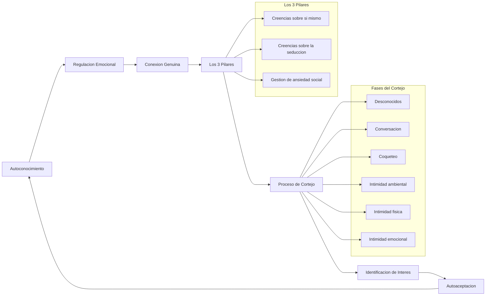
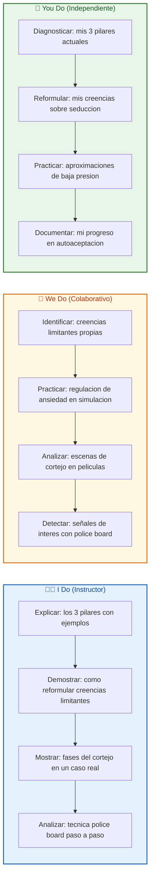
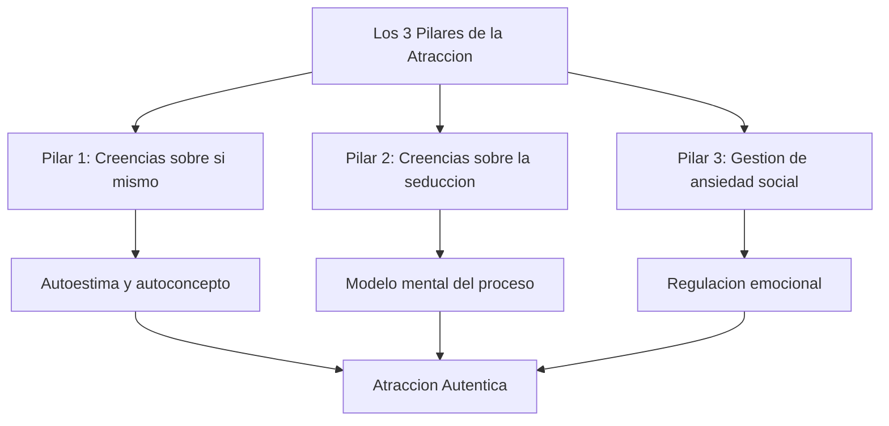
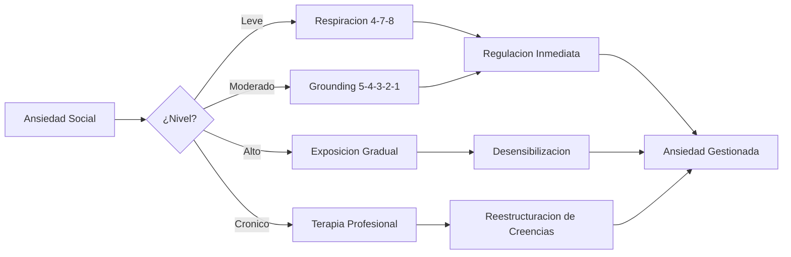
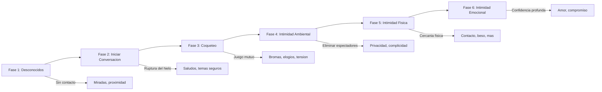
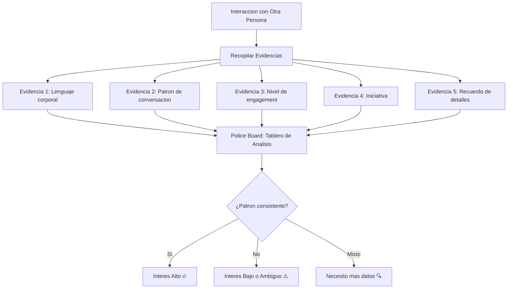
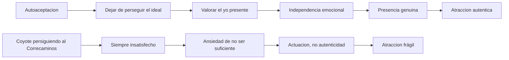
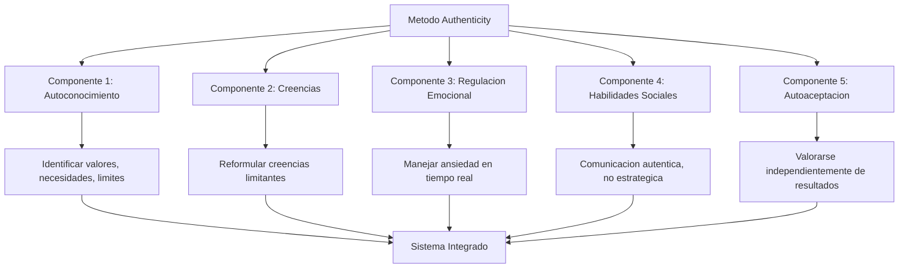
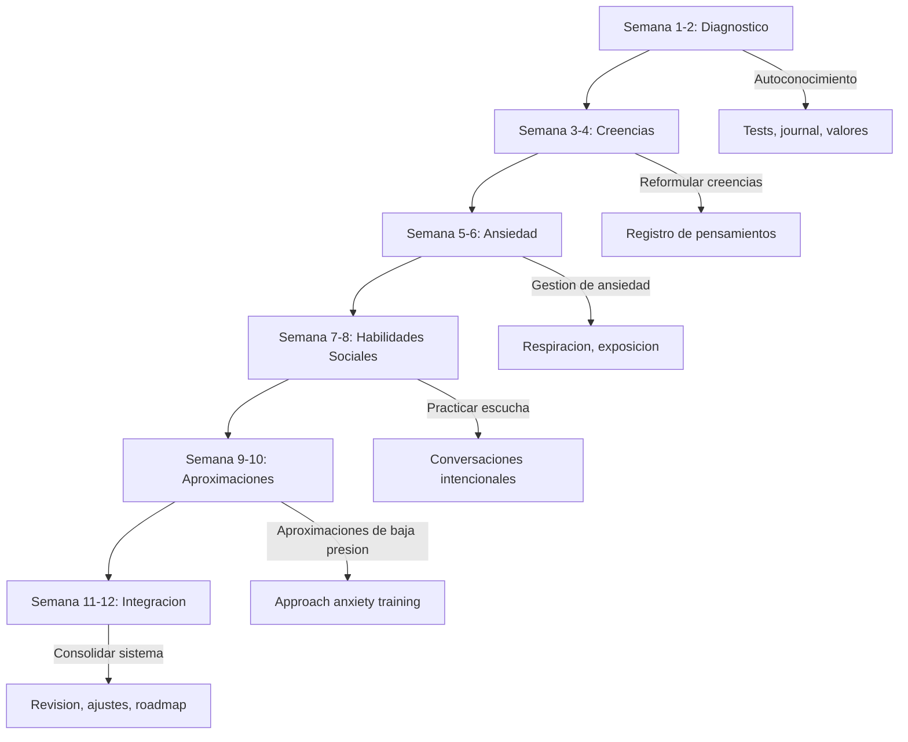
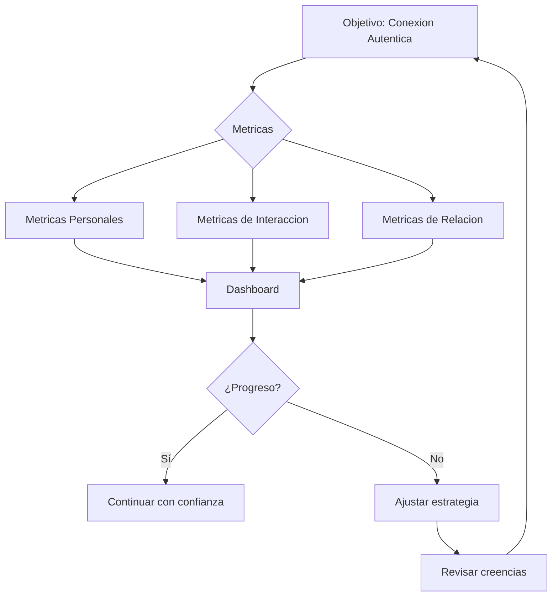

# MASTERCLASS: Método Authenticity — La Ciencia de la Atracción Auténtica sin Manipulación 🧠❤️

## INTRODUCCIÓN: POR QUÉ LA MANIPULACIÓN NO FUNCIONA Y LA AUTENTICIDAD SÍ 🎭

El mundo de la seduccion y las relaciones esta lleno de consejos contradictorios. Unos te dicen que debes ser "interesante", otros que debes generar "escasez", otros que debes usar "trucos psicologicos". Todos comparten un error comun: **tratan a las personas como objetivos a conquistar, no como seres humanos con quienes conectar**. 🎯❌

El psicologo Hugo Hernandez propone un camino diferente: el **Metodo Authenticity**, un enfoque cientifico basado en el autoconocimiento, la regulacion emocional y la conexion genuina. No se trata de aprender frases ni trucos. Se trata de **convertirse en una persona atractiva por quien es**, no por lo que hace. 🌟

> **🎯 Objetivo de Aprendizaje** — Al final de esta guia, comprenderas los tres pilares de la atraccion autentica, las fases del cortejo natural, la tecnica del "police board" para identificar interes y el camino hacia la autoaceptacion en las relaciones.

> **⚠️ Advertencia psicologica** — Este contenido es formativo y educativo. No reemplaza la terapia o asesoria profesional. Las tecnicas aqui descritas se basan en principios de psicologia clinica y deben aplicarse con respeto y etica.

---

## MAPA DEL FLUJO DE ATRACCION AUTENTICA 🗺️



| Fase | Pregunta que responde | Output principal |
|------|------------------------|------------------|
| **Los 3 Pilares** 🏛️ | ¿Que construye la atraccion verdadera? | Autoestima, creencias y gestion de ansiedad |
| **Reformulacion de Atraccion** 🔄 | ¿Que es realmente la atraccion? | Compatibilidad, no conquista |
| **Fases del Cortejo** 📋 | ¿Como avanza una relacion naturalmente? | De desconocidos a intimidad emocional |
| **Tecnica Police Board** 🕵️ | ¿Como se identifica el interes real? | Analisis integral de comportamientos |
| **Autoaceptacion** 🪞 | ¿Como entrar en relaciones sin idealizaciones? | Aceptar el yo presente |



---

## PARTE 1: LOS TRES PILARES DE LA ATRACCION AUTENTICA 🏛️

### 1.1 Principio Central

La atraccion no es magia ni trucos. Es la consecuencia de tres pilares psicologicos solidos. Si cualquiera de los tres es debil, la experiencia de seduccion se vuelve ansiosa, forzada o improductiva. 🧱



### 1.2 Pilar 1: Creencias sobre Uno Mismo — El Fundamento de la Autoestima 🪞

**Del 6:30 al 9:00 del video**, Hugo Hernandez explica que la base de toda atraccion es **como te ves a ti mismo**. No se trata de ser perfecto. Se trata de creer que eres digno de conexion y aceptacion. 🪞✨

| Creenza Limitante ❌ | Creenza Potenciadora ✅ | Efecto en la Atraccion |
|----------------------|------------------------|------------------------|
| "No soy suficiente" 😔 | "Tengo valor independientemente de la aprobacion ajena" | Seguridad que atrae |
| "Debo ganarme el derecho a existir" 🏆 | "Mi existencia es suficiente por si misma" | Presencia relajada |
| "Si me muestro como soy, no les gustare" 🎭 | "La gente conecta con la autenticidad, no con una mascara" | Conexion genuina |
| "La aprobacion define mi valor" ⚖️ | "Yo defino mi valor, no otros" | Estabilidad emocional |
| "Debo ser interesante para ser querido" 🌟 | "Soy interesante por como me intereso por los demas" | Curiosidad reciproca |

> **📌 Idea clave** — La autoestima no es narcisismo. Es la conviccion tranquila de que, **incluso si esta persona dice que no, tu valor permanece intacto**. Esa seguridad es infinitamente mas atractiva que cualquier tecnica.

### 1.3 Pilar 2: Creencias sobre el Proceso de Seduccion — El Modelo Mental 🧠

**Del 9:00 al 11:30 del video**, Hernandez explica que tus creencias sobre como funciona la atraccion determinan tu comportamiento. Si crees que es un juego de manipulacion, actuara con estrategia forzada. Si crees que es un proceso de conexion natural, actuara con fluidez. 🔄

| Modelo Mental 🔄 | Descripcion | Resultado Tipico |
|------------------|-------------|------------------|
| **Modelo de Conquista** ⚔️ | "Debo ganarme el afecto de la otra persona" | Ansiedad, estrategia, desgaste |
| **Modelo de Intercambio** ⚖️ | "Yo doy X, tu me das Y" | Transaccional, frio, calculador |
| **Modelo de Conexion** 🤝 | "Vamos a ver si hay compatibilidad" | Relajado, genuino, atractivo |
| **Modelo de Aprendizaje** 📚 | "Cada interaccion me ensena algo" | Crecimiento, baja presion, resiliencia |

> **💡 Insight clave** — La atraccion no es algo que haces a alguien. Es algo que ocurre **entre** dos personas cuando hay compatibilidad mutua. Tu trabajo no es "conquistar": es **mostrar quien eres** y detectar si hay reciprocidad.

### 1.4 Pilar 3: Gestion de Ansiedad Social — La Regulacion Emocional 🧘‍♂️

**Del 11:30 al 13:19 del video**, el psicologo aborda el tercer pilar: la capacidad de manejar la ansiedad en situaciones sociales. La ansiedad social no es un defecto: es una señal de que tu sistema de creencias necesita recalibracion. 🧠⚡

| Nivel de Ansiedad 😰 | Sintoma | Estrategia de Regulacion |
|----------------------|---------|--------------------------|
| **Leve** 😟 | Nerviosismo antes de aproximarse | Respiraccion diafragmatica (4-7-8) |
| **Moderado** 😰 | Taquicardia, pensamientos acelerados | Grounding 5-4-3-2-1 + reformulacion de creencias |
| **Alto** 😨 | Evitacion, paralisis | Exposicion gradual + autoaceptacion |
| **Cronico** 😱 | Aislamiento, deterioro funcional | Terapia profesional + trabajo en autoestima |



---

## PARTE 2: REPENSANDO LA ATRACCION — DE LA CONQUISTA A LA COMPATIBILIDAD 🔄

### 2.1 Principio Central

**Del 13:19 al 17:56 del video**, Hugo Hernandez propone un cambio de paradigma radical: la atraccion no es algo que haces a alguien. Es un **proceso natural** que ocurre cuando dos personas son compatibles. Tu trabajo no es convencer: es **ser visible** y **detectar reciprocidad**. 🌟

> **📌 Idea clave** — La atraccion es como un baile. No puedes bailar solo. Tu trabajo es mostrar tus pasos, y si la otra persona quiere bailar, el baile ocurre naturalmente. Si no, respetar y seguir adelante.

### 2.2 La Evaluacion Social: Como las Personas Se Atraen Mutuamente

| Factor de Evaluacion 👀 | Descripcion | Ejemplo Concreto |
|-------------------------|-------------|------------------|
| **Capacidad de facilitar metas** 🎯 | ¿Esta persona me ayuda a alcanzar lo que quiero? | Un companero de estudios que te ayuda a aprender |
| **Predisposicion a ayudar** 🤝 | ¿Esta persona esta dispuesta a apoyarme? | Alguien que escucha tus problemas sin juzgar |
| **Compatibilidad de valores** ⚖️ | ¿Compartimos vision del mundo? | Mismos intereses, mismos valores, mismos objetivos |
| **Atraccion fisica** 💫 | ¿Hay quimica? | Contacto visual, sonrisas, lenguaje corporal |
| **Seguridad emocional** 🛡️ | ¿Me siento bien con esta persona? | No hay manipulación, no hay juicios |

### 2.3 La Trampa de la Conquista

| Mentalidad de Conquista ⚔️ | Consecuencia | Mentalidad de Conexion 🤝 |
|----------------------------|--------------|---------------------------|
| "Debo hacer que le guste" 😰 | Ansiedad, actuacion | "Vamos a ver si hay conexion" 😊 |
| "Si digo lo correcto, funcionara" 🎯 | Estrategia forzada | "Si soy yo mismo, atraere a quienes encajen" ✨ |
| "Si no lo consigo, fracase" ❌ | Autoestima dependiente | "Cada interaccion es informacion, no juicio" 📊 |
| "Debo impresionar" 🌟 | Presion, agotamiento | "Compartir quien soy" 💬 |
| "El rechazo es personal" 😢 | Dolor evitable | "El rechazo es incompatibilidad, no sentencia" 🔄 |

### 2.4 Tabla de Senales de Atraccion (Indicadores Objetivos)

| Senal 👀 | Interpretacion | Nivel de Certeza |
|----------|---------------|-----------------|
| **Contacto visual sostenido** 👁️ | Interes cognitivo y emocional | Media-Alta |
| **Sonrisa genuina (Duchenne)** 😊 | Placer autentico en tu presencia | Alta |
| **Iniciativa de conversacion** 💬 | Busca interaccion contigo | Media-Alta |
| **Preguntas personales** 🤔 | Quiere conocerte genuinamente | Alta |
| **Contacto fisico "casual"** ✋ | Comodidad fisica contigo | Media |
| **Recuerda detalles tuyos** 🧠 | Inversion emocional | Alta |
| **Se acerca fisicamente** 📍 | Atraccion fisica | Media |
| **Risa espontanea** 😄 | Disfruta tu compania | Alta |
| **Iniciativa de planes** 📅 | Quiere verte mas | Alta |
| **Se muestra vulnerable** 🥺 | Confianza en ti | Alta |

---

## PARTE 3: LAS FASES DEL CORTEJO HUMANO — MAPA DE PROCESO 📋

### 3.1 Principio Central

**Del 17:56 al 22:00 del video**, Hugo Hernandez describe las fases naturales del cortejo humano. No es un proceso lineal: puedes avanzar, retroceder o saltar fases segun la dinamica de cada pareja. Pero entender las fases te da un mapa para navegar sin ansiedad. 🗺️



### 3.2 Las 6 Fases del Cortejo

| Fase 📍 | Nombre | Descripcion | Duracion Tipica | Senal de Avance |
|---------|--------|-------------|-----------------|-----------------|
| **1** 👋 | **Desconocidos** | Sin interaccion directa, solo observacion mutua | Variable | Primer contacto visual o proximidad |
| **2** 💬 | **Iniciar Conversacion** | Saludo, romper el hielo, temas ligeros | Minutos-Horas | La conversacion fluye naturalmente |
| **3** 😉 | **Coqueteo** | Juego, elogios, tension sexual ligera | Horas-Dias | Respuesta al coqueteo, reciprocidad |
| **4** 🚪 | **Intimidad Ambiental** | Eliminar espectadores, crear privacidad | Minutos-Horas | Se siente comodidad para privacidad |
| **5** 💋 | **Intimidad Fisica** | Contacto fisico creciente | Variable | Consentimiento claro y mutuo |
| **6** ❤️ | **Intimidad Emocional** | Confidencias, vulnerabilidad mutua | Semanas-Meses | Se comparten miedos, suenos, dolores |

### 3.3 Como Navegar las Fases sin Ansiedad

| Fase Desafiante 😰 | Ansiedad Tipica | Estrategia de Navegacion |
|--------------------|-----------------|--------------------------|
| **Fase 1 → 2: Aproximacion** 🚶 | "¿Que le digo? ¿Y si me rechaza?" | Enfoque en curiosidad, no en resultado |
| **Fase 2 → 3: Coqueteo** 😉 | "¿Estoy siendo demasiado?" | Observar reciprocidad, no asumir |
| **Fase 3 → 4: Intimidad ambiental** 🚪 | "¿Y si se siente incomoda?" | Proponer, no imponer. Leer señales. |
| **Fase 4 → 5: Contacto fisico** ✋ | "¿Tengo permiso?" | Consentimiento explicito o implicito claro |
| **Fase 5 → 6: Vulnerabilidad** 😰 | "¿Que si se asusta?" | Gradualidad, no exposicion forzada |

### 3.4 Errores Comunes en las Fases

| Error 🚨 | Descripcion | Consecuencia | Solucion |
|----------|-------------|--------------|----------|
| **Saltar fases** ⏭️ | Ir directo a coqueteo sin conversacion previa | Incomodidad, rechazo | Respetar el ritmo natural |
| **Quedarse estancado** 🛑 | No avanzar por miedo al rechazo | Zona de amigos, frustracion | Exposicion gradual |
| **Forzar intimidad** 💥 | Presionar para avanzar mas rapido | Violacion de limites, trauma | Leer señales, respetar tiempos |
| **Interpretar mal señales** ❓ | Ver interes donde no lo hay | Momentos awkward, rechazo | Tecnica police board |
| **Autosabotaje** 🧨 | Sabotear la interaccion por miedo | Perder oportunidades | Trabajo en autoaceptacion |

---

## PARTE 4: LA TECNICA POLICE BOARD — IDENTIFICAR INTERES REAL 🕵️

### 4.1 Principio Central

**Del 51:52 al 59:45 del video**, Hugo Hernandez introduce la tecnica del **"police board"**: no juzgues el interes de una persona por un solo comportamiento, sino por la **totalidad de sus comportamientos** a lo largo del tiempo. Es como un tablero de investigacion policial: necesitas multiples evidencias para concluir. 🕵️‍♂️📋



### 4.2 Las 5 Evidencias del Police Board

| Evidencia 🔍 | Que Medir | Indicador de Interes Alto 🔥 | Indicador de Interes Bajo ❄️ |
|--------------|-----------|------------------------------|------------------------------|
| **1. Lenguaje corporal** 🧍 | Postura, orientacion, espejeo | Cuerpo orientado hacia ti, espejeo, contacto visual | Cuerpo cerrado, alejado, sin contacto visual |
| **2. Patron de conversacion** 💬 | Quien pregunta, quien comparte | Preguntas sobre ti, comparte detalles personales | Solo habla de si misma, no pregunta |
| **3. Nivel de engagement** ⚡ | Profundidad de la interaccion | Responde con profundidad, no con monosilabos | Respuestas cortas, sin expansion |
| **4. Iniciativa** 🚀 | Quien inicia contacto | Te escribe, te propone planes, te busca | Solo responde, nunca inicia |
| **5. Recuerdo de detalles** 🧠 | ¿Recuerda lo que le cuentas? | Recuerda nombres, fechas, detalles tuyos | Olvida lo que le dijiste |

### 4.3 Tabla de Evaluacion de Interes

| Puntuacion por Evidencia | 0 puntos | 1 punto | 2 puntos |
|--------------------------|----------|---------|----------|
| **Lenguaje corporal** 🧍 | Cerrado, alejado | Parcialmente abierto | Abierto, orientado, espejeo |
| **Conversacion** 💬 | Monosilabos, sin preguntas | Preguntas superficiales | Preguntas profundas, compartir personal |
| **Engagement** ⚡ | Responde y se retira | Se queda pero sin profundidad | Se involucra, expande temas |
| **Iniciativa** 🚀 | Nunca inicia | Inicia ocasionalmente | Inicia consistentemente |
| **Recuerdo** 🧠 | Olvida detalles basicos | Recuerda algunos detalles | Recuerda detalles especificos |

**Interpretacion de puntuacion:**

| Puntuacion Total 📊 | Nivel de Interes | Accion Recomendada |
|---------------------|------------------|--------------------|
| **0-3 puntos** ❄️ | Interes bajo o nulo | No invertir mas energia, seguir adelante |
| **4-6 puntos** ⚠️ | Interes ambiguo | Explorar mas, ver si se desarrolla |
| **7-8 puntos** 🔥 | Interes alto | Avanzar con confianza |
| **9-10 puntos** 💥 | Interes muy alto | Reciprocidad clara, momento de profundizar |

### 4.4 Errores Comunes al Evaluar Interes

| Error 🚨 | Descripcion | Solucion |
|----------|-------------|----------|
| **Evidencia unica** 1️⃣ | "Me sonrio una vez, le gusto" | Esperar patron consistente |
| **Proyeccion** 🪞 | Ver lo que quiero ver, no lo que hay | Ser honesto con la evidencia |
| **Interpretacion de amabilidad** 😊 | Confundir simpatia con atraccion | Buscar señales especificas de atraccion |
| **Ignorar señales negativas** ❌ | "No es que no le guste, esta ocupada" | Aceptar la realidad sin excusas |
| **Cambiar criterios** 📏 | "Bueno, esta vez si hay señales" | Ser consistente con el metodo |

---

## PARTE 5: LA IMPORTANCIA DE LA AUTOACEPTACION — DEJAR DE PERSEGUIR AL COYOTE 🪞

### 5.1 Principio Central

**Del 1:13:35 al 1:17:40 del video**, Hugo Hernandez introduce una de las ideas mas profundas del metodo: la necesidad de **aceptar y valorar quien eres hoy**, no perseguir una version idealizada de ti mismo. Usa la metafora del Coyote persiguiendo al Correcaminos: siempre estas persiguiendo una version futura de ti, sin disfrutar quien eres ahora. 🐺🐦

> **📌 Idea clave** — La atraccion autentica nace de la autoaceptacion. Cuando te aceptas a ti mismo, dejas de necesitar que otros te validen. Y esa independencia emocional es infinitamente mas atractiva que cualquier tecnica de seduccion.



### 5.2 La Dinamica del Coyote y el Correcaminos

| Personaje 🎭 | Simbolo | Comportamiento | Resultado |
|--------------|---------|---------------|-----------|
| **Coyote (tu yo ideal)** 🐺 | La version de ti que crees que deberias ser | Siempre persiguiendo, nunca alcanzando | Insatisfaccion cronica |
| **Correcaminos (tu yo futuro)** 🐦 | La version perfecta que nunca llega | Se aleja siempre que crees que lo alcanzas | Sensacion de fracaso |
| **Tu yo presente** 🪞 | Quien eres HOY, con tus virtudes y defectos | Punto de partida valido | Autoaceptacion y crecimiento real |

> **💡 Insight profundo** — No puedes mejorar desde el rechazo. Solo puedes mejorar desde la aceptacion. Cuando te aceptas como eres, creces desde la seguridad, no desde la ansiedad. Y esa seguridad es lo que atrae relaciones saludables.

### 5.3 El Proceso de Autoaceptacion

| Etapa 🗺️ | Descripcion | Practica |
|-----------|-------------|----------|
| **1. Conciencia** 🔍 | Reconocer que estoy persiguiendo un ideal | Observar mis pensamientos de "deberia ser" |
| **2. Aceptacion** 🤗 | Aceptar mi realidad actual sin juicio | Lista de virtudes y defectos sin filtro |
| **3. Valoracion** ⭐ | Reconocer mi valor independientemente de logros | Escribir 10 cualidades que no dependen de resultados |
| **4. Integracion** 🔗 | Unir el yo ideal con el yo real | Establecer metas desde la autoaceptacion |
| **5. Crecimiento** 🌱 | Mejorar desde la seguridad, no desde la ansiedad | Cambios sostenibles, no transformaciones forzadas |

### 5.4 Ejercicio: Dejar de Perseguir al Correcaminos

| Paso 📝 | Accion | Herramienta | Resultado Esperado |
|---------|--------|-------------|--------------------|
| 1 | Escribe tu "yo ideal" (como te gustaria ser) | Papel o digital | Lista de aspiraciones |
| 2 | Escribe tu "yo presente" (como eres hoy) | Papel o digital | Lista de realidad |
| 3 | Identifica la brecha entre ambos | Comparacion | Distancia entre ideal y real |
| 4 | Por cada punto de la brecha, escribe: ¿Que puedo aceptar hoy? | Reflexion | Lista de aceptaciones |
| 5 | Elige 1 cosa para mejorar desde la aceptacion, no desde el rechazo | Accion | Paso de crecimiento saludable |

---

## PARTE 6: ARQUITECTURA DEL METODO AUTHENTICITY — SISTEMA COMPLETO 🏗️

### 6.1 Los 5 Componentes del Sistema



### 6.2 Tabla de Componentes y Aplicacion

| Componente 🧩 | Funcion | Herramientas Clave | Resultado |
|---------------|---------|-------------------|-----------|
| **1. Autoconocimiento** 🔍 | Saber quien soy, que quiero, que necesito | Terapia, journaling, tests de personalidad | Claridad de valores |
| **2. Creencias** 🧠 | Reformular pensamientos limitantes | Reestructuracion cognitiva, afirmaciones realistas | Modelo mental sano |
| **3. Regulacion Emocional** 🧘 | Manejar ansiedad en tiempo real | Respiracion, grounding, exposicion gradual | Presencia calmada |
| **4. Habilidades Sociales** 💬 | Comunicar con autenticidad | Escucha activa, asertividad, empatia | Conexion genuina |
| **5. Autoaceptacion** 🪞 | Valorarse sin condiciones | Aceptacion radical, autocompasion | Independencia emocional |

### 6.3 El Ciclo de Retroalimentacion Positiva

```mermaid
flowchart LR
    A[Autoaceptacion] --> B[Menos ansiedad]
    B --> C[Presencia genuina]
    C --> D[Conexiones mas profundas]
    D --> E[Validacion interna (no externa)]
    E --> F[Autoestima mas solida]
    F --> A
    
    style A fill:#E8F5E9,stroke:#2E7D32,stroke-width:3px
```

> **📌 Idea clave** — El Metodo Authenticity es un ciclo virtuoso. No empieza por "aprender frases" ni "mejorar tu imagen". Empieza por **aceptarte**. Y desde ahi, todo fluye naturalmente.

---

## PARTE 7: SISTEMA DE PRACTICA DIARIA — TU ENTRENAMIENTO EN ATRACCION AUTENTICA 🗓️

### 7.1 Rutina de 90 Dias



### 7.2 Plan Semanal de Entrenamiento

| Dia 🌅 | Actividad | Duracion | Enfoque |
|--------|-----------|----------|---------|
| **Lunes** 🧠 | Journal de creencias | 15 min | Identificar pensamientos limitantes |
| **Martes** 🧘 | Practica de respiracion | 10 min | Regulacion de ansiedad |
| **Miercoles** 💬 | Conversacion intencional | Variable | Escucha activa, genuinidad |
| **Jueves** 🚶 | Aproximacion de baja presion | 10-30 min | Hablar con desconocidos sin expectativa |
| **Viernes** 📝 | Revision semanal | 20 min | Evaluar progreso, ajustar creencias |
| **Sabado** 🌟 | Actividad social | 1-2 horas | Practicar en contexto real |
| **Domingo** 🪞 | Autoaceptacion | 15 min | Lista de virtudes, autocompasion |

### 7.3 Tabla de Progreso

| Dimension 📊 | Semana 0 | Semana 4 | Semana 8 | Semana 12 | Semana 24 |
|--------------|----------|-----------|-----------|-----------|-----------|
| Autoestima (1-10) | ? | ? | ? | ? | ? |
| Ansiedad social (1-10, invertido) | ? | ? | ? | ? | ? |
| Aproximaciones realizadas | 0 | ? | ? | ? | ? |
| Conexiones significativas | 0 | ? | ? | ? | ? |
| Autoaceptacion (1-10) | ? | ? | ? | ? | ? |
| Creencias limitantes identificadas | 0 | ? | ? | ? | ? |

---

## PARTE 8: CASOS DE ESTUDIO — DEL TEORICO A LO REAL 🌟

### 8.1 El Estudiante que Dejo de Perseguir 👨‍🎓

| Situacion Inicial 😰 | Intervencion del Metodo | Resultado ✅ |
|----------------------|--------------------------|--------------|
| Ansiedad severa para aproximarse 😨 | Trabajo en regulacion emocional + creencias | 5 aproximaciones exitosas en 1 mes |
| Creenza: "Debo ser interesante para que me quieran" | Reformulacion: "Soy interesante por como me intereso por otros" | Conexiones mas profundas |
| Evitacion social cronica | Exposicion gradual + autoaceptacion | Participacion en grupos sociales |

### 8.2 La Profesional que Aprendio a Coquetear sin Culpa 👩‍💼

| Situacion Inicial 😰 | Intervencion del Metodo | Resultado ✅ |
|----------------------|--------------------------|--------------|
| Culpa por coquetear (creencia moral) | Reformulacion: el coqueteo es comunicacion humana sana | Disfrute del juego social |
| Miedo al rechazo profesional | Separar vida personal de profesional | Relaciones autenticas en ambos ambitos |
| Dificultad para detectar interes | Tecnica police board | Lectura mas precisa de señales |

### 8.3 El Jubilado que Encontro Pareja a los 65 👴

| Situacion Inicial 😰 | Intervencion del Metodo | Resultado ✅ |
|----------------------|--------------------------|--------------|
| Creenza: "Ya es tarde para el amor" | Reformulacion: "El amor no tiene edad" | Apertura a nuevas relaciones |
| Ansiedad por citas online | Exposicion gradual + autenticidad en perfil | Citas con alta compatibilidad |
| Miedo a la vulnerabilidad | Trabajo en autoaceptacion | Relacion estable y satisfactoria |

---

## PARTE 9: MATRIZ DE CREENCIAS LIMITANTES vs. POTENCIADORAS ⚖️

### 9.1 Creencias sobre Si Mismo

| Creenza Limitante ❌ | ¿Donde la aprendi? | Costo en mi vida | Creenza Potenciadora ✅ |
|----------------------|--------------------|------------------|------------------------|
| "No soy atractivo" 🪞 | | | "Mi valor no depende de mi apariencia fisica" |
| "Debo ser interesante para ser querido" 🌟 | | | "Las personas se conectan con mi autenticidad" |
| "Si digo lo que pienso, no les gustare" 💬 | | | "La honestidad atrae a las personas correctas" |
| "No merezco amor" ❤️ | | | "Merezco relaciones saludables y respetuosas" |
| "Soy invisible para los demas" 👻 | | | "Mi presencia tiene valor cuando soy yo mismo" |

### 9.2 Creencias sobre la Seduccion y las Relaciones

| Creenza Limitante ❌ | ¿Donde la aprendi? | Costo en mi vida | Creenza Potenciadora ✅ |
|----------------------|--------------------|------------------|------------------------|
| "La seduccion es manipulacion" 🎭 | | | "La seduccion es conexion mutua" |
| "Debo convencer a alguien de que me quiera" ⚔️ | | | "El interes debe ser mutuo y espontaneo" |
| "Si no lo hago bien, fracase" ❌ | | | "Cada interaccion es aprendizaje, no juicio" |
| "El rechazo es personal" 😢 | | | "El rechazo es incompatibilidad, no sentencia" |
| "Debo seguir reglas para tener exito" 📋 | | | "Las reglas son guias, no dogmas" |

### 9.3 Creencias sobre Ansiedad Social

| Creenza Limitante ❌ | Reformulacion con Metodo Authenticity |
|----------------------|---------------------------------------|
| "La ansiedad es un defecto" 😰 | "La ansiedad es informacion: me dice que necesito trabajar en mis creencias" |
| "No puedo controlar mi ansiedad" 🌀 | "Puedo regular mi ansiedad con tecnicas concretas" |
| "Evitar es la solucion" 🏃 | "La exposicion gradual es el camino" |
| "Si me acerco, pasara algo malo" 😨 | "Si me acerco con autenticidad, pasara algo genuino" |

---

## PARTE 10: DASHBOARD DE PROGRESO EN ATRACCION AUTENTICA 📊

### 10.1 Metricas Integradas

Un dashboard de atraccion autentica no mide "cantidad de citas" o "numero de parejas". Mide **calidad de conexion**, **salud emocional** y **progreso en autoaceptacion**. 📈



### 10.2 Tabla de Metricas

| Dominio 📊 | Metrica | Frecuencia | Meta | Alerta ⚠️ |
|------------|---------|------------|------|-----------|
| **Autoestima** 🪞 | Nivel de autoestima (1-10) | Diaria | > 7/10 | < 5/10 por 3 dias |
| **Ansiedad social** 😰 | Nivel de ansiedad en aproximaciones (1-10) | Por interaccion | < 4/10 | > 7/10 |
| **Aproximaciones** 🚶 | Numero de aproximaciones de baja presion | Semanal | > 3 | 0 |
| **Creencias limitantes** 🧠 | Pensamientos limitantes identificados | Semanal | Reduciendo | Estancado |
| **Conexiones significativas** 🤝 | Interacciones profundas (no superficiales) | Semanal | > 2 | 0 |
| **Autoaceptacion** 🪞 | Nivel de aceptacion del yo presente (1-10) | Diaria | > 7/10 | < 5/10 por 3 dias |
| **Diversion social** 😊 | Nivel de disfrute en interacciones (1-10) | Por interaccion | > 6/10 | < 4/10 |
| **Respeto de limites** 🛡️ | Veces que respeté mis propios limites | Semanal | 100% | < 80% |

### 10.3 Sistema de Alertas y Acciones Correctivas

| Alerta 🚨 | Condicion | Accion del Metodo Authenticity |
|-----------|-----------|-------------------------------|
| Autoestima baja 🪞 | < 5/10 por 3 dias | Refuerzo de autoaceptacion, journal de virtudes |
| Ansiedad alta 😰 | > 7/10 en aproximaciones | Tecnicas de regulacion, exposicion mas gradual |
| Cero aproximaciones 🚶 | 0 aproximaciones en 1 semana | Reducir presion, empezar por aproximaciones de 30 segundos |
| Creencias estancadas 🧠 | No identifico nuevas creencias limitantes | Nuevos ejercicios de autoconocimiento |
| Interacciones superficiales 💬 | Solo conversaciones triviales | Profundizar preguntas, practicar vulnerabilidad |
| Falta de diversion 😊 | Disfrute < 4/10 en interacciones | Revisar expectativas, volver a la curiosidad |

---

## PARTE 11: APLICACION POR CONTEXTO 🏢

### 11.1 Solteros que Buscan Pareja 💑

| Principio | Implementacion Practica |
|-----------|-------------------------|
| **Autoconocimiento primero** 🔍 | Saber que busco antes de salir a buscar |
| **Aproximaciones de baja presion** 🚶 | Hablar con 3 personas/semana sin expectativa de citas |
| **Police board para evaluar interes** 🕵️ | No suponer, medir patrones |
| **Autoaceptacion como base** 🪞 | No buscar validation externa |
| **Regulacion de ansiedad** 🧘 | Tecnicas antes, durante y despues de citas |

### 11.2 Personas en Relacion 💑

| Principio | Implementacion Practica |
|-----------|-------------------------|
| **Comunicacion autentica** 💬 | Expresar necesidades sin culpa ni manipulacion |
| **Manejo de ansiedad de abandono** 😰 | Trabajo en autoestima individual |
| **Creencias compartidas** 🧠 | Alinear expectativas sin perder individualidad |
| **Intimidad emocional gradual** ❤️ | Profundizar sin forzar |
| **Autoaceptacion dentro de la relacion** 🪞 | No depender de la pareja para validarme |

### 11.3 Personas con Ansiedad Social Cronica 🧠

| Principio | Implementacion Practica |
|-----------|-------------------------|
| **Exposicion gradual** 🚶 | Empezar por aproximaciones de 10 segundos |
| **Regulacion emocional** 🧘 | Tecnicas antes de salir de casa |
| **Reformulacion de creencias** 🔄 | "La gente no me juzga tanto como creo" |
| **Autoaceptacion radical** 🪞 | Aceptar mi ansiedad sin culpa |
| **Objetivos realistas** 📊 | No "tener una cita", sino "hablar con 1 persona" |

---

## PARTE 12: GLOSARIO DE CONCEPTOS CLAVE 📚

| Termino 📖 | Definicion |
|------------|------------|
| **Metodo Authenticity** 🧠 | Enfoque psicologico de Hugo Hernandez para la atraccion autentica basado en autoconocimiento, regulacion emocional y conexion genuina |
| **Autoestima** 🪞 | Creencias sobre el propio valor, base de la atraccion saludable |
| **Regulacion emocional** 🧘 | Capacidad de manejar la ansiedad y otras emociones en tiempo real |
| **Ansiedad social** 😰 | Malestar emocional en situaciones de interaccion social |
| **Police board** 🕵️ | Tecnica de evaluacion de interes basada en multiples evidencias, no en una sola señal |
| **Coyote y Correcaminos** 🐺🐦 | Metafora de la persecucion de un ideal inalcanzable versus la autoaceptacion del yo presente |
| **Intimidad ambiental** 🚪 | Fase del cortejo donde se eliminan espectadores para crear privacidad |
| **Autoaceptacion** 🤗 | Valoracion de uno mismo sin condiciones, base de relaciones saludables |
| **Creencias limitantes** ❌ | Pensamientos que restringen la capacidad de conectar |
| **Creencias potenciadoras** ✅ | Pensamientos que expanden la capacidad de conectar |

---

## PARTE 13: CHECKLIST FINAL DE IMPLEMENTACION ✅

### 13.1 Autoconocimiento

| Check ✅ | Estado |
|----------|--------|
| He identificado mis 3 creencias limitantes principales sobre la atraccion | ☐ |
| He listado mis valores y lo que busco en una relacion | ☐ |
| Tengo claridad sobre mis limites y necesidades | ☐ |
| He hecho un inventario honesto de mis virtudes y areas de crecimiento | ☐ |

### 13.2 Reformulacion de Creencias

| Check ✅ | Estado |
|----------|--------|
| He reformulado al menos 3 creencias limitantes | ☐ |
| Entiendo la diferencia entre modelo de conquista y modelo de conexion | ☐ |
| He eliminado la palabra "deberia" de mi vocabulario relacional | ☐ |

### 13.3 Gestion de Ansiedad

| Check ✅ | Estado |
|----------|--------|
| Domino la tecnica de respiracion 4-7-8 | ☐ |
| He practicado grounding 5-4-3-2-1 en situaciones de ansiedad | ☐ |
| He realizado al menos 5 aproximaciones de baja presion | ☐ |
| Mi nivel de ansiedad en aproximaciones es < 4/10 | ☐ |

### 13.4 Tecnica Police Board

| Check ✅ | Estado |
|----------|--------|
| Conozco las 5 evidencias del police board | ☐ |
| He aplicado la tecnica en al menos 3 interacciones | ☐ |
| Soy capaz de distinguir entre amabilidad y atraccion genuina | ☐ |
| No tomo decisiones basadas en una sola señal | ☐ |

### 13.5 Autoaceptacion

| Check ✅ | Estado |
|----------|--------|
| He dejado de compararme con un ideal inalcanzable | ☐ |
| Me valoro independientemente de la aprobacion ajena | ☐ |
| He escrito una lista de 10 cualidades que no dependen de resultados | ☐ |
| Disfruto mi compania sin necesidad de una pareja | ☐ |

---

## PREGUNTAS DE VERIFICACION 📝

Responde cada pregunta basándote en los conceptos de esta masterclass. Escribe tus respuestas o compártelas para profundizar tu aprendizaje.

### Preguntas sobre los 3 Pilares

1. **Aplica**: Según tu autoevaluacion, ¿en cual de los 3 pilares (creencias sobre ti, creencias sobre la seduccion, gestion de ansiedad) tienes mas trabajo? ¿Por que?

2. **Analiza**: ¿Por que la autoestima es el pilar mas importante? ¿Que sucede cuando los otros dos pilares son fuertes pero la autoestima es debil?

3. **Reflexiona**: ¿Has experimentado alguna vez una situacion donde la ansiedad social bloqueo una conexion que podria haber sido buena? Describe la situacion.

### Preguntas sobre Atraccion y Cortejo

4. **Sintetiza**: Explica con tus palabras por que la atraccion no es manipulacion, sino compatibilidad mutua.

5. **Aplica**: ¿Que harias diferente en una aproximacion si aplicaras el modelo de conexion en lugar del modelo de conquista?

6. **Analiza**: Las 6 fases del cortejo — ¿en cual fase te sientes mas comodo? ¿En cual te bloqueas mas?

### Preguntas sobre Tecnica Police Board

7. **Practica**: Aplica la tecnica police board a una interaccion reciente. Puntua las 5 evidencias y determina el nivel de interes.

8. **Reflexiona**: ¿Has interpretado alguna vez una señal unica como interes alto, cuando en realidad era amabilidad? Que aprendiste?

9. **Propón**: ¿Que evidencias adicionales agregarias a la tecnica police board para hacerla mas precisa?

### Preguntas sobre Autoaceptacion

10. **Profundiza**: ¿En que areas de tu vida persigues un "Correcaminos" ideal en lugar de aceptar tu yo presente?

11. **Aplica**: ¿Que pasaria si entraras a tu proxima interaccion social sin intentar impresionar, solo siendo tu?

12. **Reflexión final**: ¿Que tan dispuesto estas a aceptar que la atraccion autentica empieza por ti, no por la otra persona?

---

## GLOSARIO RAPIDO 📚

| Termino | Definicion |
|---------|------------|
| **Metodo Authenticity** 🧠 | Enfoque psicologico de Hugo Hernandez basado en autoconocimiento, creencias saludables, regulacion emocional, habilidades sociales y autoaceptacion |
| **Autoestima** 🪞 | Creencias sobre el propio valor; base de la atraccion saludable |
| **Ansiedad social** 😰 | Malestar emocional en situaciones de interaccion social; regulable con tecnicas |
| **Police board** 🕵️ | Tecnica de evaluacion de interes basada en multiples evidencias, no en una sola señal |
| **Intimidad ambiental** 🚪 | Fase del cortejo donde se eliminan espectadores para crear privacidad |
| **Intimidad emocional** ❤️ | Fase final del cortejo basada en vulnerabilidad mutua y confianza |
| **Coyote y Correcaminos** 🐺🐦 | Metafora de la persecucion de un ideal versus la autoaceptacion del presente |
| **Autoaceptacion** 🤗 | Valoracion de uno mismo sin condiciones; base de relaciones saludables |
| **Creencias limitantes** ❌ | Pensamientos que restringen la capacidad de conectar |
| **Creencias potenciadoras** ✅ | Pensamientos que expanden la capacidad de conectar |

---

## ANEXO: FORMATO IDEAL PARA CONTENIDO DE PSICOLOGIA Y RELACIONES 📖

### Recomendaciones de legibilidad para guias de psicologia

El ancho optimo para articulos de psicologia y relaciones es **60–75 caracteres por linea** (incluyendo espacios). Equivale aproximadamente a:

- `max-width: 65ch` en CSS.
- 550–750 px de ancho de contenido.

```css
.article-content {
  max-width: 65ch;
  font-size: 18px;
  line-height: 1.75;
}
```

Esto facilita:

- Procesar conceptos emocionales complejos
- Reducir la fatiga en contenido reflexivo
- Seguir ejemplos y casos practicos
- Integrar teoria con aplicacion personal

---

### Lo que hace efectiva una guia de psicologia

#### 1. Lenguaje accesible, no clinico

Evita jerga innecesaria. Si usas terminos tecnicos, explicalos.

**Mejor:**

> La autoestima es como tu basamento emocional: si es solido, puedes construir cualquier cosa encima.

**Peor:**

> La autoestima es un constructo psiquico multidimensional que modula la autoeficacia percibida.

#### 2. Ejemplos de la vida real

Las personas aprenden mejor con historias que con conceptos abstractos.

**Mejor:**

> Imagina que te gusta alguien en el trabajo. En lugar de pensar "debo hacer que le guste", piensa "vamos a ver si hay conexion genuina".

**Peor:**

> La teoria de la atraccion postula que la compatibilidad es un determinante principal del exito relacional.

#### 3. Espacio para la reflexion

Despues de cada concepto, incluye una pregunta o ejercicio.

> **📝 Reflexiona:** ¿En cual de los 3 pilares crees que tienes mas trabajo? Escribe tu respuesta aqui.

#### 4. Normalizar la experiencia

Validar que lo que el lector siente es comun y humano.

> **💡 Normalizacion:** El 70% de las personas experimentan ansiedad social en algun momento de su vida. No estas solo.

#### 5. Cierres accionables

Cada seccion debe terminar con algo que el lector pueda hacer HOY.

> **✅ Accion:** Identifica una creencia limitante sobre la seduccion y reformulala usando el modelo de conexion.

---

## REFERENCIAS Y RECURSOS ADICIONALES 📚

### Videos y Conferencias 🎥

| Recurso | Descripcion |
|---------|-------------|
| **Metodo Authenticity — Hugo Hernandez** 🎬 | Video original que inspiro esta masterclass |
| **Psicologia de la Atraccion** 🎓 | Serie sobre bases psicologicas de las relaciones |
| **Ansiedad Social: Guia Completa** 📹 | Estrategias de regulacion emocional |

### Libros Recomendados 📖

| Titulo | Autor | Por que leerlo |
|--------|-------|----------------|
| **"The Authenticity Paradox"** | Herminia Ibarra | Por que ser autentico no es lo que crees |
| **"Attached"** | Amir Levine y Rachel Heller | Psicologia del apego en relaciones adultas |
| **"The Six Pillars of Self-Esteem"** | Nathaniel Branden | Base psicologica de la autoestima |
| **"The Art of Seduction"** | Robert Greene | Perspectiva historica (con cautela: no todo aplica) |
| **"Quiet"** | Susan Cain | El poder de la introversion en un mundo extrovertido |

### Citas Inspiradoras 💎

> "La atraccion autentica no se fabrica. Se revela cuando dos personas estan lo suficientemente comodas siendo ellas mismas."
> — Hugo Hernandez (Metodo Authenticity)

> "No puedes amar a otra persona hasta que te ames a ti mismo. Pero amarte a ti mismo no significa ser perfecto: significa aceptarte como eres."
> — Principio de autoaceptacion

> "El Coyote nunca alcanza al Correcaminos porque el Correcaminos no existe. La unica persona que puedes alcanzar es a ti mismo, aqui y ahora."
> — Metafora del Metodo Authenticity

> "La atraccion no es algo que haces a alguien. Es algo que ocurre entre dos personas cuando hay compatibilidad mutua."
> — Hugo Hernandez

---

## CIERRE: TU TURNO DE CONVERTIRTE EN UNA PERSONA ATRACTIVA DE VERDAD 📝

Has recorrido los pilares de la atraccion autentica, las fases del cortejo natural, la tecnica police board para identificar interes y el camino hacia la autoaceptacion. Ahora comprendes algo que la mayoria de los consejos de seduccion no te dicen:

**La atraccion no es un truco. Es una consecuencia de quien eres.** ✨

El Metodo Authenticity no te pide aprender frases, trucos ni tecnicas de manipulacion. Te pide:

1. **Conocerte** — Saber quien eres, que quieres, que necesitas.
2. **Reformular tus creencias** — Cambiar "debo conquistar" por "vamos a conectar".
3. **Gestionar tu ansiedad** — Usar tecnicas de regulacion emocional para estar presente.
4. **Aceptarte** — Valorar tu yo presente sin perseguir ideales inalcanzables.
5. **Conectar genuinamente** — Dejar que la atraccion ocurra naturalmente.

> **🎓 Cierre final** — La atraccion mas poderosa no es la que se construye con trucos. Es la que se revela cuando dos personas son lo suficientemente valientes para ser autenticas. Como dijo Hugo Hernandez: no se trata de convencer a nadie. Se trata de ser visible, ser genuino y dejar que la compatibilidad haga el resto. 🧠❤️

**Tu proximo paso:** Elige una creencia limitante sobre la seduccion y reformulala HOY. No con una frase vacia, sino con una conviccion que realmente creas. Por ejemplo: de "debo ser interesante para que me quieran" a "soy interesante por como me intereso por los demas". Escribe tu reformulacion y usala como tu nueva verdad. ✨

---

## APPENDIX: PROMPTS PARA REFLEXION GUIADA 🧠

### Prompt Diario (5 minutos)

> "¿Que creencia sobre la seduccion active hoy? ¿Como la reformulo desde la autenticidad?"

### Prompt Semanal (15 minutos)

> "¿Cuantas conexiones genuinas tuve esta semana? ¿Que aprendi de cada interaccion?"

### Prompt Mensual (30 minutos)

> "¿Como ha evolucionado mi autoestima este mes? ¿Que evidencia tengo de crecimiento en atraccion autentica?"

### Prompt Trimestral (1 hora)

> "Revisando los ultimos 3 meses: ¿deje de perseguir al Correcaminos? ¿Estoy mas comodo siendo yo mismo? ¿Que relaciones genuinas construi?"

---

**Fin de la Masterclass** 🎓✨

*Creada siguiendo los lineamientos de skill.md | Inspirada en el video de Hugo Hernandez y su Metodo Authenticity | Enfoque psicologico-practico*
