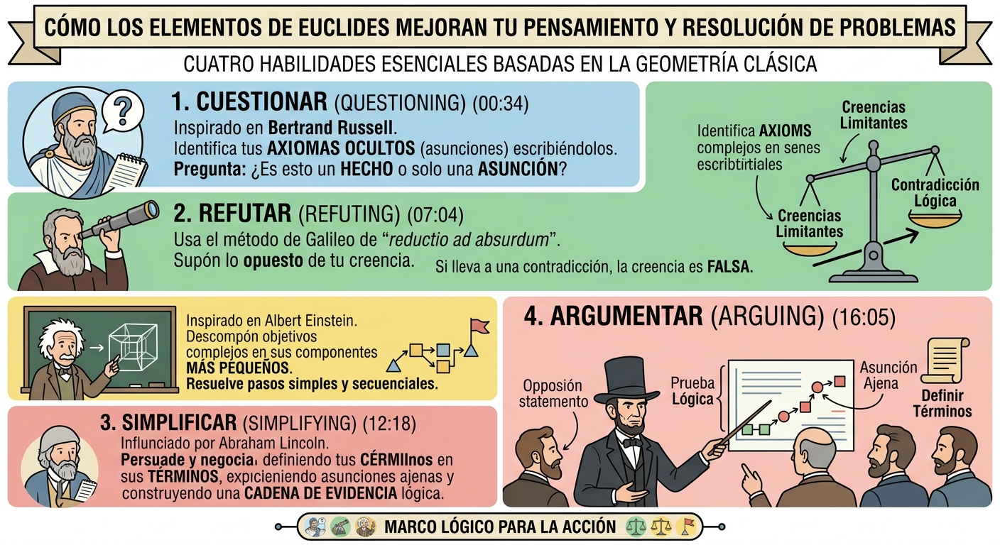
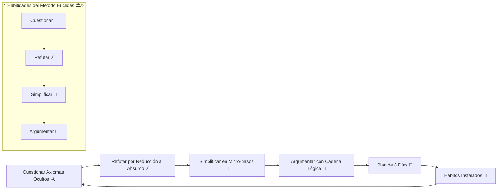
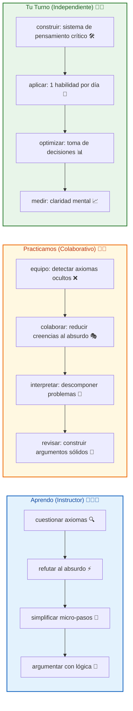

# 📐🔥 MASTERCLASS: El Método de Euclides para el Pensamiento Crítico — 4 Habilidades Milenarias Aplicadas a la Resolución de Problemas ✨🚀



## 🎯 INTRODUCCIÓN: POR QUÉ ESTE MASTERCLASS ES DIFERENTE 💡🌟

Hace más de 2.000 años, Euclides construyó toda la geometría a partir de un puñado de axiomas verificados y una cadena de razonamiento impecable. Ese mismo método — cuestionar, refutar, simplificar y argumentar — sigue siendo una de las herramientas más poderosas para resolver problemas y pensar con claridad hoy en día. 🧮✨

Este masterclass propone un camino distinto: **entender el pensamiento crítico como un sistema de axiomas personales, reducción lógica, descomposición secuencial y argumentación sólida** que se puede aprender, practicar y aplicar en cualquier problema complejo. No se trata de ser "más inteligente" — se trata de ser más riguroso.

> **🎯 Objetivo de Aprendizaje** — Al final de esta guía, podrás: (1) explicar las 4 habilidades del método euclidiano, (2) aplicarlas en problemas reales de emprendimiento y vida, (3) diseñar un plan de 8 días para instalar estos hábitos, y (4) medir tu progreso en claridad mental y toma de decisiones.

> **⚠️ Advertencia formativa** — Este contenido es educativo. El pensamiento crítico requiere práctica constante y honestidad intelectual. Ningún método reemplaza la reflexión consciente y la disposición a cambiar de opinión. 🧘‍♂️📐

---

## 🗺️ MAPA DEL WORKFLOW DEL PENSAMIENTO CRÍTICO 🗺️🚀



| Fase 🎯 | Pregunta que responde ❓ | Output principal 🎯 |
|---------|------------------------|---------------------|
| **Cuestionar** 🔍 | ¿Qué creencias no verificadas dirigen mi vida? | Axiomas ocultos explicitados 📋 |
| **Refutar** ⚡ | ¿Dónde se derrumba mi suposición? | Creencia limitante desmentida 🧪 |
| **Simplificar** 🧩 | ¿Cuál es el primer paso trivial? | Camino de acción secuencial 🚶 |
| **Argumentar** 📜 | ¿Cómo convenzo sin imponer? | Cadena lógica irresistible 📜 |
| **Plan 8 días** 📅 | ¿Cómo practico cada día? | Repetición sistemática 🔄 |
| **Hábitos** 🔄 | ¿Cómo mantengo la claridad? | Pensamiento crítico automático 🧠 |




---

## 🔹 Habilidad 1: Cuestionar — Encontrar los Axiomas Ocultos (00:34) 🔍✨

Toda la geometría de Euclides parte de axiomas: verdades que se aceptan como punto de partida, sin necesidad de demostración. El problema es que **la mayoría de las personas viven guiadas por axiomas propios que nunca cuestionaron** — creencias que tratan como hechos, sin haberlas verificado nunca. 🧠❓

Inspirado en el filósofo **Bertrand Russell**, el primer paso del método es **sacar a la luz esas suposiciones ocultas** que dirigen tus decisiones sin que lo notes. 🔦

> 🧩 **Ejemplo del instructor:** Frente a la frase *"No lanzo este producto"*, la mayoría se queda en la superficie. El método pide ir más profundo: *"No lo lanzo **porque asumo** que nadie lo va a comprar"*. Esa palabra — *asumo* — es la clave: convierte una verdad aparente en una hipótesis que puede examinarse. 🔑✨

### Cómo aplicarlo 🔧

1. ✍️ Escribe la decisión o el bloqueo que tienes ("No hago X").
2. ❓ Completa la frase: "No hago X **porque asumo que** ___".
3. 🧪 Pregúntate: *¿Esto es un hecho verificado, o es una suposición sin comprobar?*

> 🧩 **Por qué funciona:** Mientras la suposición permanece implícita, se siente como un hecho inamovible. En el momento en que la **escribes explícitamente**, tu cerebro puede evaluarla de forma racional, en lugar de obedecerla automáticamente. 🧠⚡

### ✅ Ejercicio práctico 1 🎯✨

Piensa en un objetivo que llevas tiempo posponiendo. Completa:
- 📝 "No hago ___ porque asumo que ___."
- 🔍 ¿Tienes evidencia real de que esa suposición es cierta, o es solo una interpretación no verificada?

| Tipo de axioma oculto 🎯 | Ejemplo 💬 | Pregunta desbloqueante 🔓 |
|--------------------------|-----------|---------------------------|
| **Capacidad** 🧠 | "No soy bueno para las ventas" 😔 | ¿Qué evidencia tengo de que NO puedo aprender? 📊 |
| **Mercado** 📈 | "El mercado está saturado" 📉 | ¿He validado esto con datos reales o es una impresión? 📋 |
| **Tiempo** ⏰ | "No tengo tiempo" 🕐 | Si tuviera que hacerlo en 10 minutos, ¿empezaría hoy? ⏱️ |
| **Dinero** 💰 | "No tengo suficiente capital" 💸 | ¿Qué versión mínima puedo lanzar sin dinero? 🐢 |

> 💡 **Punto clave:** No puedes cuestionar una creencia que no sabes que tienes. Escribirla es el primer acto de libertad frente a ella. ✨🚪

---

## 🔹 Habilidad 2: Refutar — Reducción al Absurdo (07:04) ⚡✨

### El método de Galileo 🔭

Galileo popularizó la técnica de la **reductio ad absurdum** (reducción al absurdo): para probar que una afirmación es falsa, **asumes que es verdadera** y sigues su lógica hasta sus últimas consecuencias. Si el resultado es una contradicción imposible, la afirmación original queda refutada. 🧪❌

> 🧩 **Ejemplo histórico:** Galileo utilizó este razonamiento para desmontar la creencia aristotélica de que los objetos más pesados caen más rápido que los livianos: si atas un objeto pesado a uno liviano, según esa lógica el conjunto debería caer más lento (el liviano "frena" al pesado) y más rápido (porque juntos pesan más) al mismo tiempo — una contradicción que revela que la premisa original era falsa. 🍎⚖️

### Cómo aplicarlo a tus creencias limitantes 🚫🧠

1. 🎯 Toma la suposición que identificaste en el paso anterior (ej. "nadie va a comprar esto").
2. 🎭 **Asume que es absolutamente cierta** y sigue su lógica hasta el final.
3. 🔍 Busca la contradicción: ¿esta suposición, llevada al extremo, se sostiene o se derrumba sola?

> 🧩 **Ejemplo aplicado:** *"Nadie va a comprar esto"* → si fuera 100% cierto, ningún producto similar existiría en el mercado. Pero existen productos similares que sí se venden → la suposición absoluta no se sostiene → queda refutada, o al menos, debe matizarse. 📉✅

### ✅ Ejercicio práctico 2 🎯✨

Toma tu suposición del ejercicio anterior y llévala al extremo:
- 📊 Si esta creencia fuera 100% verdadera siempre, ¿qué otras cosas deberían ser ciertas también?
- 🌍 ¿Existe algún caso, dato o ejemplo real que contradiga esa consecuencia?

| Creencia limitante 🚫 | Reducción al absurdo 🤪 | Resultado lógico 🧪 |
|------------------------|------------------------|---------------------|
| "No soy emprendedor" 😔 | Si fuera cierto, ningún emprendedor nace siéndolo | Los emprendedores se hacen, no nacen 🛠️ |
| "El mercado no quiere esto" 📉 | Si fuera cierto, ningún producto nuevo tendría éxito | Todos los productos nuevos tuvieron primera versión imperfecta 🐢 |
| "No tengo las habilidades" 🧠 | Si fuera cierto, nadie podría aprender nada nuevo | Todo experto fue principiante en algún momento 🌱 |
| "Es demasiado tarde" ⏰ | Si fuera cierto, ninguna empresa antigua podría innovar | Empresas con décadas reinventan productos constantemente 🔄 |

> 💡 **Punto clave:** No necesitas refutar la creencia con optimismo — necesitas refutarla con lógica. La reducción al absurdo no depende de "pensar positivo", depende de encontrar la grieta en el razonamiento. 🔬✨

---

## 🔹 Habilidad 3: Simplificar — El Método de Einstein (12:18) 🧩✨

### La idea central 💡

Einstein no resolvió la relatividad de un solo golpe: descompuso preguntas gigantescas en componentes minúsculos y resolubles, uno a la vez. El método de Euclides funciona igual: cada teorema complejo se construye sobre una cadena de pasos simples y verificados, nunca sobre un salto directo a la conclusión. 🧮➡️🧱

> 🧩 **Cita de referencia:** A Einstein se le atribuye la idea de que si tuviera una hora para resolver un problema, dedicaría la mayor parte del tiempo a definir correctamente el problema — porque una vez bien definido y descompuesto, la solución se vuelve mucho más accesible. ⏱️🎯

### Cómo aplicarlo 🔧

1. 🎯 Toma el objetivo que te resulta abrumador.
2. ❓ Pregúntate: *¿Cuál es el paso más pequeño posible que puedo dar hacia esto, algo casi trivial?*
3. 📋 Ordena esos micro-pasos en secuencia lógica — cada uno debe depender del anterior, igual que un teorema depende de un axioma previo.

> 🧩 **Ejemplo aplicado:** Objetivo abrumador: "Lanzar mi negocio". Descomposición: definir el producto mínimo → validar con 5 personas reales → crear una página simple → conseguir la primera venta. Cada paso es pequeño, verificable y construye sobre el anterior. 🧱✅

### ✅ Ejercicio práctico 3 🎯✨

Elige tu objetivo más grande pendiente. Descompónlo en al menos 5 pasos, donde el primero sea algo que puedas hacer en menos de 10 minutos.

| Objetivo abrumador 🎯 | Paso 1 🐢 | Paso 2 🧩 | Paso 3 🏗️ | Paso 4 🚀 | Paso 5 🏁 |
|-----------------------|-----------|-----------|-----------|-----------|-----------|
| Escribir libro 📚 | Escribir 1 oración 📝 | Escribir 1 párrafo 📄 | Escribir 1 página 📖 | Hacer 1 capítulo 📑 | Revisar y editar ✍️ |
| Lanzar startup 🚀 | Validar problema con 3 personas 💬 | Dibujar solución en papel ✏️ | Crear landing page 🌐 | Conseguir primer early adopter 🤝 | Iterar y escalar 📈 |
| Aprender idioma 🌍 | Aprender 5 palabras hoy 📝 | Escuchar 1 podcast corto 🎧 | Escribir 1 frase nueva ✍️ | Hablar 1 minuto con nativo 🗣️ | Sostener conversación de 10 min 💬 |
| Mejorar salud 💪 | Caminar 5 minutos 🚶 | Preparar 1 comida saludable 🥗 | Dormir 30 min más temprano 😴 | Hacer 10 flexiones 🧎 | Correr 1 km sin parar 🏃 |

> 💡 **Punto clave:** Los objetivos no se vuelven pequeños — tu comprensión de ellos se vuelve más precisa. La simplificación no es "hacer menos", es ver con claridad la estructura real del problema. 🔍✨

---

## 🔹 Habilidad 4: Argumentar — La Cadena Lógica de Abraham Lincoln (16:05) 📜✨

### El origen del método ⚖️

Antes de ser presidente, **Abraham Lincoln** ejerció como abogado, y se dice que estudió cuidadosamente los métodos de Euclides para fortalecer su capacidad de argumentación legal. La idea: una discusión no se gana con presión ni con volumen, se gana con una **cadena de razonamiento tan sólida que la otra persona llega sola a la conclusión**. 🎯✅

### Los 3 componentes del argumento euclidiano 🧩📐

1. **Define tus términos con precisión** — Euclides comienza cada libro definiendo exactamente qué significa cada concepto (punto, línea, ángulo). Sin definiciones claras, cualquier discusión se convierte en un malentendido disfrazado de desacuerdo. 📖

2. **Expón las suposiciones del otro** — Así como identificaste tus propios axiomas ocultos en la Habilidad 1, en una negociación identifica los axiomas no dichos de la otra persona. Muchas veces el desacuerdo no está en la lógica, sino en una suposición de base nunca verbalizada. 🤔

3. **Construye una cadena de evidencia, paso a paso** — En lugar de saltar directamente a la conclusión que quieres, guía a la otra persona con una secuencia de pasos lógicos donde cada uno se apoya en el anterior — igual que un teorema geométrico. 🏗️

> 🧩 **Por qué funciona:** Cuando alguien llega a una conclusión siguiendo su propio razonamiento paso a paso, la siente como propia — no como algo impuesto. Esto reduce drásticamente la resistencia natural a ser persuadido. 🧠✅

### ✅ Ejercicio práctico 4 🎯✨

Piensa en un desacuerdo o negociación pendiente. Escribe:
1. 📝 Define con precisión el término central en disputa (¿ambas partes entienden lo mismo por esa palabra?).
2. 🔍 ¿Qué suposición no verbalizada podría estar sosteniendo la postura de la otra persona?
3. 🏗️ Construye 3 pasos lógicos, ordenados, que lleven naturalmente hacia tu conclusión.

| Componente 📐 | Pregunta clave ❓ | Ejemplo aplicado 💡 |
|---------------|------------------|---------------------|
| Definir términos 📝 | ¿Qué significa exactamente "éxito" para ambos? | Éxito = ingresos + impacto, no solo dinero 💰 |
| Supuestos ajenos 🔍 | ¿Qué da por sentado el otro sin decir? | "Si subo precio, pierdo clientes" — ¿siempre? 🤔 |
| Cadena lógica 🏗️ | Paso 1 → Paso 2 → Conclusión | Si A entonces B, si B entonces C, por tanto C ✅ |

> 💡 **Punto clave:** Argumentar bien no es imponer una opinión más fuerte — es construir un camino lógico tan claro que la otra persona lo recorra por sí misma. 🛤️✨

---

## 📅 PARTE 5: PLAN DE APLICACIÓN DE 8 DÍAS (UNO POR HABILIDAD) 📆🔥

| Día 📅 | Habilidad ⚡ | Acción concreta ⚡ |
|--------|-------------|-------------------|
| 1 | 🔍 Cuestionar | Identifica y escribe 1 axioma oculto detrás de una decisión pospuesta 📝 |
| 2 | 🔍 Cuestionar | Repite el ejercicio con una creencia sobre ti mismo ("no soy bueno en...") 🪞 |
| 3 | ⚡ Refutar | Aplica la reducción al absurdo a la creencia del Día 1 🧪 |
| 4 | ⚡ Refutar | Busca un contraejemplo real que contradiga esa creencia 🌍 |
| 5 | 🧩 Simplificar | Descompón tu objetivo más grande en 5 micro-pasos 🧩 |
| 6 | 🧩 Simplificar | Ejecuta el primer micro-paso, sin importar cuán pequeño sea 🐢 |
| 7 | 📜 Argumentar | Define con precisión los términos de un desacuerdo pendiente 📝 |
| 8 | 📜 Argumentar | Construye y presenta tu cadena de 3 pasos lógicos a la otra persona 🗣️ |

> 🧩 **Nota del instructor:** El poder del método de Euclides no está en cada habilidad por separado, sino en la secuencia: cuestionar sin refutar te deja estancado en la duda; refutar sin simplificar te deja sin plan de acción; simplificar sin argumentar te deja sin capacidad de convencer a otros de acompañarte. 🔄✨

---

## 🎓✨ PARTE 6: I DO / WE DO / YOU DO — EJERCICIOS PRÁCTICOS 🎓🌟

### 6.1 🏫 I Do — Cuestionar axiomas en vivo 🔍🎯

**Objetivo:** experimentar el poder de escribir suposiciones ocultas. 🔄

| Paso 🚶 | Acción ⚡ | Resultado esperado ✅ |
|---------|---------|----------------------|
| 1️⃣ 🎯 | Selecciona una decisión de negocio bloqueada | "No contrato ese proveedor" 💼 |
| 2️⃣ ❓ | Completa: "No hago X porque asumo que ___" | "No lo contrato porque asumo que es caro" 💰 |
| 3️⃣ 🔍 | Verifica la suposición: ¿es hecho o creencia? | Buscar 3 presupuestos reales 📋 |
| 4️⃣ 📊 | Compara realidad vs suposición | Si es falsa → nueva decisión ✅ |

### 6.2 👥 We Do — Refutar creencias en equipo 👥🤝

**Escenario:** el equipo tiene una creencia limitante ("no podemos competir con ese jugador"). Cada integrante aplica reducción al absurdo.

```
🎭 Role-play refutación:

1. Integrante A: expone la creencia limitante del equipo.
2. Integrante B: aplica reducción al absurdo y busca contradicción.
3. Integrante C: busca un contraejemplo real en el mercado.
4. Todos: escriben la versión matizada de la creencia original.
5. Facilitador: valida si la nueva creencia es más útil y accionable. ✅
```

### 6.3 🎯 You Do — Sistema de pensamiento crítico personal 🛠️🚀

**Tarea:** diseña tu sistema euclidiano con 4 componentes:

| Componente 🧩 | Acción ⚡ | Alerta de fallo 🔔 |
|---------------|---------|-------------------|
| 🔍 Cuestionar | Diario de axiomas: 1 suposición escrita al día | Sin entrada 3 días 📅 |
| ⚡ Refutar | 1 creencia limitante refutada por semana | Sin refutación 7 días 📅 |
| 🧩 Simplificar | 1 objetivo descompuesto en 5 pasos | Sin descomposición 10 días 📅 |
| 📜 Argumentar | 1 cadena lógica construida por semana | Sin argumento 7 días 📅 |

---

## ✅✨ PARTE 7: CHECKLIST FINAL DEL SISTEMA 🏁📋

| Bloque 🧩 | Check ✅ | Evidencia 📸 |
|------------|---------|--------------|
| **🔍 Cuestionar** | Escribió 1 axioma oculto hoy | Journal de suposiciones |
| **⚡ Refutar** | Refutó 1 creencia con lógica | Cadena de razonamiento |
| **🧩 Simplificar** | Descompuso 1 objetivo en micro-pasos | Lista secuenciada |
| **📜 Argumentar** | Construyó 1 cadena lógica esta semana | Argumento por escrito |
| **📅 Plan 8 días** | Completió 5 días de práctica | Bitácora firmada |
| **📊 Claridad mental** | Toma de decisiones más rápida y segura | Registro de decisiones |

---

## 📝✨ PARTE 8: PREGUNTAS DE VERIFICACIÓN 📝🌟

Responde cada pregunta basándote en los conceptos de esta masterclass. Escribe tus respuestas o compártelas para profundizar tu aprendizaje. 📝💡

### Preguntas sobre las 4 Habilidades 🎯🔍

1. **🔍 Aplica**: ¿Qué axioma oculto está guiando una decisión que has pospuesto? Escríbelo explícitamente y pregúntate: ¿es un hecho o una suposición? ⚡

2. **⚡ Analiza**: Toma una creencia limitante tuya y aplícale reducción al absurdo. ¿La creencia se sostiene o se derrumba? 📊

### Preguntas sobre Simplificación y Argumentación 🧩📜

3. **🧩 Diseña**: Toma tu objetivo más grande y descompónlo en 5 micro-pasos. ¿Cuál es el primero que puedes hacer en menos de 10 minutos? ⏱️

4. **📜 Evalúa**: ¿Cuándo fue la última vez que tuviste un desacuerdo? ¿Lo ganaste con lógica o con presión? ¿Qué habría cambiado si hubieras usado una cadena euclidiana? 🤔

### Preguntas Integradoras 🔗🌟

5. **🔗 Conecta**: ¿Por qué el orden de las 4 habilidades importa? ¿Qué pasa si intentas argumentar antes de cuestionar y refutar? 🧠

6. **💡 Propón un sistema**: Diseña un protocolo de 5 minutos para usar antes de cualquier decisión importante. Incluye: (1) axioma oculto, (2) reducción al absurdo, (3) micro-paso siguiente. 📋

7. **🧪 Evalúa**: Si tuvieras que explicarle el método de Euclides a un emprendedor que dice "yo confío en mi intuición", ¿qué 3 argumentos usarías basados en resultados medibles? 📊

8. **🏆 Síntesis final**: De las 4 habilidades, ¿cuál consideras tu mayor debilidad? ¿Qué cambio pequeño podrías hacer mañana para fortalecerla? 📈

---

## 📚✨ GLOSARIO RÁPIDO 📖🔬

| Término 📝 | Definición 📋 | Aplicación emprendedora 💼 |
|-----------|---------------|----------------------------|
| **Axioma** 📐 | Verdad aceptada sin demostración | Creencias base sobre tu mercado o capacidad |
| **Reductio ad absurdum** ⚡ | Llevar una idea al extremo para refutarla | Desmentir creencias limitantes con lógica |
| **Micro-paso** 🐢 | Acción trivial que inicia una cadena | Producto mínimo viable, primer cliente |
| **Cadena lógica** 📜 | Secuencia de pasos que lleva a una conclusión | Pitch, negociación, argumentación legal |
| **Supuesto oculto** 🎭 | Creencia no verbalizada que dirige decisiones | "No puedo", "no hay mercado", "es tarde" |
| **Simplificación** 🧩 | Descomponer lo complejo en partes pequeñas | Roadmap, OKRs, sprint planning |
| **Definición precisa** 📝 | Acuerdo explícito sobre el significado de términos | Contratos, alcance de proyecto, KPIs |
| **Pensamiento crítico** 🧠 | Evaluar creencias antes de actuar due diligence | Validación de ideas, pivotes estratégicos |

---

## 📐✨ ANEXO: FORMATO IDEAL PARA MASTERCLASS EDUCATIVAS 📐📏

### 📏 Estructura visual recomendada para lectura larga 📏✨

El ancho óptimo para artículos educativos es **60–75 caracteres por línea** (incluyendo espacios). Equivale aproximadamente a: 📐

```css
.article-content {
  font-size: 18px;
  line-height: 1.75;
  max-width: 65ch;
}
```

Esto facilita: ✅
- Mantener la atención 👀
- Reducir la fatiga visual 😌
- Mejorar la comprensión de conceptos complejos 🧠
- Facilitar el seguimiento de protocolos paso a paso 📋

---

### 🎯 CIERRE PRÁCTICO — NIVELES DE DOMINIO 🎯✅

| Nivel 📊 | Debes poder hacer ✨ | Evidencia 📸 |
|---------|---------------------|-------------|
| **🏫 I Do** | ✅ Aplicar las 4 habilidades en un problema real | Registro de práctica guiada |
| **👥 We Do** | 🤝 Refutar creencias en equipo con lógica | Sesión colaborativa completada |
| **🎯 You Do** | 🚀 Implementar plan de 8 días y medir claridad | Sistema documentado y seguimiento 8 días |

---

## 🎁✨ RECURSOS ADICIONALES 🎁📚

- 📖 **📚 Euclides** — "Los Elementos" 📐
- 🎥 **🎬 Video:** El método de Euclides aplicado al pensamiento crítico ⏱️
- 🧠 **💡 Bertrand Russell** — Filosofía del cuestionamiento 🔍
- 🛠️ **📱 Apps recomendadas:** Notion para journaling, Miro para descomposición visual ✅
- 📖 **📚 Libros clave:** "El Arte de Pensar" (Rolf Dobelli), "Lógica para principiantes" (Peter Kreeft), "Pensar, Rápido y Lento" (Daniel Kahneman) 📚
- 🧠 **⚕️ Lógica formal:** Principios de argumentación y falacias 🧠
- 📝 **📓 Bullet Journal** — Método de Ryder Carroll para registro diario 📒

---

**🎉 Felicitaciones! Has completado la masterclass del método de Euclides para el pensamiento crítico. 📐 Ahora comprendes que pensar con claridad no es un don — es una habilidad milenaria que se ejercita cuestionando axiomas, refutando con lógica, simplificando en pasos y argumentando con cadenas sólidas. ✨ Tu próximo paso: elige 1 bloqueo real, aplícale las 4 habilidades en secuencia y observa cómo la claridad reemplaza a la confusión. La repetición convierte el método en naturaleza. 🚀🧠 Tu nueva identidad: "Soy alguien que piensa con rigor, actúa con evidencia y argumenta con lógica". 📜✨**
