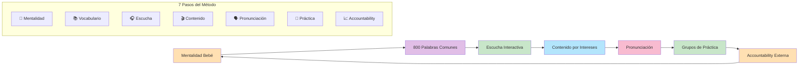
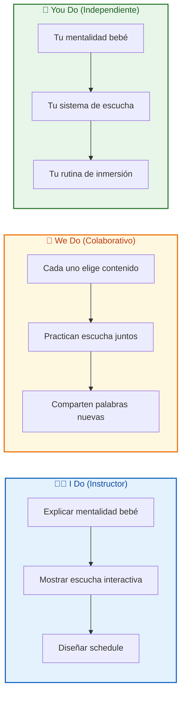
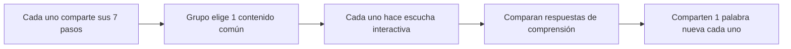
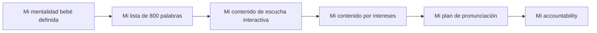

# MASTERCLASS: Método Kale Anders - 7 Pasos para la Fluidez en Inglés 🇬🇧🚀

## INTRODUCCIÓN: POR QUÉ ESTA MASTERCLASS ES DIFERENTE 🎯

La mayoría de las personas aprenden inglés en aulas, memorizando reglas gramaticales y listas de palabras aisladas. Kale Anders propone un cambio radical: **aprender como un bebé**, sumergiéndote en el idioma naturalmente, sin traducción mental constante.

El objetivo no es "saber gramática", sino **pensar en inglés** sin pasar por el filtro del español. Su método combina mentalidad, vocabulario de alta frecuencia, escucha activa, contenido relevante y práctica social.

> **🎯 Objetivo de Aprendizaje** — Al final de esta guía, podrás aplicar los 7 pasos del método, configurar tu sistema de escucha interactiva, diseñar tu plan de pronunciación y construir accountability externa para mantener la consistencia.

> **⚠️ Advertencia educativa** — Este contenido es formativo. La fluidez requiere exposición diaria y paciencia. 6 meses es un promedio, no una garantía. Tu progreso depende de la consistencia, no de la intensidad ocasional.

---

## 🗺️ MAPA DE LA MASTERCLASS 🧭

| 🧩 Fase | ❓ Pregunta que responde | 📤 Resultado principal |
|---------|------------------------|------------------------|
| **🧠 Mentalidad** | ¿Cómo evito la frustración al principio? | Confianza en el proceso |
| **📚 Vocabulario** | ¿Qué palabras aprendo primero? | 800 palabras de alta frecuencia |
| **🎧 Escucha** | ¿Cómo entreno mi oído activamente? | Comprensión sin traducción |
| **🎬 Contenido** | ¿Cómo mantengo la motivación? | Aprendizaje relevante y entretenido |
| **🗣️ Pronunciación** | ¿Cómo mejoro mi acento? | Dominio de sonidosdifíciles |
| **👥 Práctica** | ¿Cómo supero el miedo a hablar? | Fluidez conversacional |
| **📈 Accountability** | ¿Cómo sostengo el hábito? | Consistencia a largo plazo |

---

## 🧩 PARTE 1: MENTALIDAD DE BEBÉ - ABRAZA LA CONFUSIÓN 🧩

### 1.1 ❓ PRETEST

¿Qué hace un bebé cuando escucha un idioma nuevo por primera vez?

> Respuesta esperada: No traduce, solo escucha y absorbe patrones.
> Si acertás: camino rápido → andá al punto 7.

### 1.2 🎯 POR QUÉ + LOGRO

Importa porque **la frustración es el mayor enemigo del aprendizaje**. Un adulto que intenta entender todo desde el día 1 se quema en 2 semanas. Vas a lograr **relajarte con la confusión** y verla como señal de que estás aprendiendo.

### 1.3 ⚡ VICTORIA RÁPIDA (<5 min)

Escribí en un papel: "Hoy no entiendo todo, y está bien". Ese es tu primer ejercicio de mentalidad de bebé.

### 1.4 💡 CONCEPTO

Analogía: La mentalidad de bebé es como **aprender a caminar** — te caés muchas veces, pero nunca pensás "no soy apto para caminar". Simplemente te levantás y lo intentás de nuevo.

Definición: Adoptar una actitud de curiosidad sin juicio. Un bebé no se frustra por no entender palabras; escucha, imita y poco a poco conecta sonidos con significados. Como adulto, tu ventaja es que podés buscar patrones conscientemente, pero tu desventaja es que querés entender todo inmediatamente.

### 1.5 👀 EJEMPLO RESUELTO

| Situación | Mentalidad adulta típica | Mentalidad de bebé |
|-----------|--------------------------|---------------------|
| Escuchás una palabra nueva | "No entiendo, me frustro" | "Suena raro, lo voy a escuchar de nuevo" |
| No entendés una frase completa | "Este método no funciona" | "Adiviné el contexto, sigo escuchando" |
| Cometés un error al hablar | "Parezco tonto" | "Así se dice, lo pruebo la próxima" |

### 1.6 ⚠️ CONTRA-EJEMPLO / ERROR TÍPICO

Error: Mirar subtítulos en español constantemente para "entender todo".

Corrección: Los subtítulos en español son una muleta. Cada vez que leés en español, tu cerebro se salta el trabajo de inferir significado en inglés. Usalos solo para verificar comprensión total, no como apoyo constante.

### 1.7 🧪 PRÁCTICA

Elegí un video en inglés de 3 minutos. Miralo sin subtítulos. Anotá cuántas palabras/frases entendiste sin ayuda.

> Respuesta esperada / criterio: No importa el porcentaje. Lo importante es que te expusiste a confusión sin traducción. Si entendiste 0%, el video es muy difícil. Si entendiste 95%, es muy fácil. Buscá el punto intermedio.

### 1.8 🔁 RECALL — Nivel Bloom: Comprender

¿Por qué Kale Anders dice que la confusión es parte del aprendizaje?

### 1.9 📌 IDEA CLAVE

La confusión no significa que algo va mal: significa que tu cerebro está trabajando para conectar patrones nuevos.

### 1.10 ✅ AUTO-CHEQUEO + SIGUIENTE

- [ ] Escribí mi frase de mentalidad de bebé
- [ ] Probé ver un video sin subtítulos
- [ ] Acepté que no entender todo está bien

Siguiente: Las 800 palabras que cubren el 85% del inglés cotidiano.

---

## 📚 PARTE 2: LAS 800 PALABRAS MÁS COMUNES - TU BASE DE VOCABULARIO 📚

### 2.1 ❓ PRETEST

¿Qué porcentaje del inglés cotidiano cubren las 800 palabras más frecuentes?

> Respuesta esperada: Aproximadamente 85%.
> Si acertás: camino rápido → andá al punto 7.

### 2.2 🎯 POR QUÉ + LOGRO

Importa porque **el vocabulario es el cuello de botella del listening y la lectura**. Si dominás las 800 palabras más comunes en contexto, podés entender la mayoría de conversaciones y textos cotidianos. Vas a lograr **leer y escuchar sin pausas constantes** para buscar palabras.

### 2.3 ⚡ VICTORIA RÁPIDA (<5 min)

Abrí cualquier texto en inglés y subrayá las palabras que reconocés sin ayuda. Contá cuántas hay. Probablemente más de las que pensás.

### 2.4 💡 CONCEPTO

Analogía: Las 800 palabras comunes son como **los ladrillos de una casa** — con pocos tipos de ladrillos podés construir infinitas formas. Si aprendés palabras raras primero, tenés muchos tipos de ladrillos pero no podés armar nada.

Definición: Las 800 palabras más frecuentes en inglés representan aproximadamente el 85% de todo el texto y conversación cotidiana. Aprenderlas en contexto (dentro de oraciones completas) permite reconocerlas automáticamente sin traducción.

### 2.5 👀 EJEMPLO RESUELTO

| Paso | Acción | Tiempo |
|------|--------|--------|
| 1 | Elegí una lista de 800 palabras frecuentes | 5 min |
| 2 | Busqué cada palabra en un corpus de frases reales | 10 min |
| 3 | Creé tarjetas con frase completa + imagen | 15 min |
| 4 | Repasá 10 palabras/día con repetición espaciada | 10 min/día |

### 2.6 ⚠️ CONTRA-EJEMPLO / ERROR TÍPICO

Error: Aprender palabras aisladas: "house = casa", "dog = perro".

Corrección: Las palabras aisladas no enseñan uso ni pronunciación. Aprendé "I live in a house" en vez de "house". La frase te da contexto, sonido y gramática al mismo tiempo.

### 2.7 🧪 PRÁCTICA

Elegí 10 palabras de la lista de 800 más comunes. Escribí una frase con cada una, como si se la explicaras a un niño.

> Respuesta esperada / criterio: Las frases deben ser completas y usar la palabra en contexto real, no aislada. Ejemplo: "I drink water every morning" en vez de "water = agua".

### 2.8 🔁 RECALL — Nivel Bloom: Aplicar

¿Por qué Kale Anders enfatiza aprender palabras en contexto en vez de aisladas?

### 2.9 📌 IDEA CLAVE

Las 800 palabras en contexto son tu acceso directo al 85% del inglés: dominarlas es tener la llave de la mayoría de conversaciones.

### 2.10 ✅ AUTO-CHEQUEO + SIGUIENTE

- [ ] Descargué una lista de 800 palabras frecuentes
- [ ] Entiendo por qué el contexto es obligatorio
- [ ] Creé mi primer set de palabras en frases

Siguiente: Cómo entrenar tu oído con escucha interactiva.

---

## 🎧 PARTE 3: ESCUCHA INTERACTIVA - TU OÍDO ENTRENA EN SERIO 🎧

### 3.1 ❓ PRETEST

¿Qué diferencia hay entre escuchar pasivamente y escuchar interactivamente?

> Respuesta esperada: La escucha interactiva requiere responder preguntas mientras escuchás.
> Si acertás: camino rápido → andá al punto 7.

### 3.2 🎯 POR QUÉ + LOGRO

Importa porque **el oído necesita entrenamiento activo**, no solo exposición. Ver series con subtítulos en español no entrena el listening. Vas a lograr **entender sin traducir**, respondiendo preguntas en tiempo real.

### 3.3 ⚡ VICTORIA RÁPIDA (<5 min)

Abrí un podcast corto en inglés. Escuchá 1 minuto sin pausar. Luego, respondé de memoria: ¿de qué hablaba? Eso es escucha interactiva básica.

### 3.4 💡 CONCEPTO

Analogía: La escucha interactiva es como **jugar a las adivinanzas** — no solo escuchás, sino que tu cerebro busca activamente la respuesta. Ese esfuerzo es el que graba el aprendizaje.

Definición: Escuchar contenido en inglés y responder preguntas de comprensión inmediatamente después, sin mirar la transcripción. Esto obliga a tu cerebro a procesar el sonido, retener información y extraer significado sin traducción mental.

### 3.5 👀 EJEMPLO RESUELTO

| Paso | Acción | Tiempo |
|------|--------|--------|
| 1 | Elegí un audio de 2-3 minutos (podcast, historia) | 2 min |
| 2 | Escuchá sin pausas, sin subtítulos | 3 min |
| 3 | Respondé 3 preguntas de comprensión | 5 min |
| 4 | Verificá escuchando nuevamente las partes clave | 5 min |
| 5 | Repetí hasta responder correctamente | 10 min |

### 3.6 ⚠️ CONTRA-EJEMPLO / ERROR TÍpico

Error: Escuchar podcasts en inglés mientras trabajás o cocinás como "ruido de fondo".

Corrección: Si tu atención está en otra tarea, no estás entrenando el oído. 10 minutos de escucha interactiva valen más que 2 horas de fondo pasivo.

### 3.7 🧪 PRÁCTICA

Elegí un audio corto (podcast, TED-Ed, historia). Escuchalo una vez sin pausas. Luego respondé: ¿quién habla? ¿qué pasó? ¿cuál fue el final?

> Respuesta esperada / criterio: Las respuestas deben venir de tu memoria auditiva, no de la transcripción. Si no recordás nada, el audio es muy difícil o muy largo. Empezá con 1-2 minutos.

### 3.8 🔁 RECALL — Nivel Bloom: Aplicar

¿Por qué Kale Anders propone escucha interactiva en vez de solo "escuchar mucho"?

### 3.9 📌 IDEA CLAVE

La escucha interactiva convierte tu oído en un músculo: cada pregunta que respondés sin mirar es una repetición que se graba.

### 3.10 ✅ AUTO-CHEQUEO + SIGUIENTE

- [ ] Probé escucha interactiva con un audio corto
- [ ] Respondí preguntas sin ver la transcripción
- [ ] Entiendo la diferencia entre escucha pasiva e interactiva

Siguiente: Cómo elegir contenido que mantenga tu motivación alta.

---

## 🎬 PARTE 4: CONTENIDO POR INTERESES - APRENDÉ LO QUE TE GUSTA 🎬

### 4.1 ❓ PRETEST

¿Qué tipo de contenido en inglés elegirías si tu hobby es la cocina?

> Respuesta esperada: Videos de chefs, recetas, podcasts de gastronomía.
> Si acertás: camino rápido → andá al punto 7.

### 4.2 🎯 POR QUÉ + LOGRO

Importa porque **la motivación desaparece cuando el contenido es aburrido**. Si te gusta el fitness, aprendé inglés con videos de entrenamiento, no con noticias aburridas. Vas a lograr **disfrutar el proceso** y no ver el inglés como una obligación.

### 4.3 ⚡ VICTORIA RÁPIDA (<5 min)

Abrí YouTube y buscá 1 video en inglés sobre tu hobby o trabajo. Sin subtítulos primero, luego con CC EN. Si entendés la mitad, es tu contenido.

### 4.4 💡 CONCEPTO

Analogía: Aprender inglés con contenido aburrido es como **comer verduras sin condimento** — puede ser nutritivo, pero no vas a volver por más. Si lo acompañás con lo que te gusta, se vuelve adictivo.

Definición: Seleccionar material de inmersión (videos, podcasts, artículos) relacionado con tus intereses profesionales o personales. Esto aumenta el tiempo de exposición porque el contenido es entretenido, no una obligación.

### 4.5 👀 EJEMPLO RESUELTO

| Interés | Contenido sugerido | Plataforma |
|---------|---------------------|------------|
| **Negocios** | Podcasts de emprendimiento, entrevistas a CEOs | YouTube, Spotify |
| **Fitness** | Videos de entrenamiento, canales de nutrición | YouTube, Instagram |
| **Tecnología** | Tutoriales, reviews de productos, conferencias | YouTube, TED Talks |
| **Viajes** | Vlogs, guías de ciudades, documentales | YouTube, Netflix |
| **Cocina** | Recetas en inglés, chefs internacionales | YouTube, TikTok |

### 4.6 ⚠️ CONTRA-EJEMPLO / ERROR TÍpico

Error: Forzarte a ver noticias en inglés porque "son formales y educativas", aunque las odies.

Corrección: El contenido debe ser interesante primero, educativo segundo. Si lo elegís por obligación, abandonás en 1 semana. Si lo elegís por placer, lo sostenés meses.

### 4.7 🧪 PRÁCTICA

Hacé una lista de 5 temas que te apasionen. Buscá 1 canal o podcast en inglés por tema. Elegí el que más te llame la atención y mirá 5 minutos.

> Respuesta esperada / criterio: El contenido debe generarte curiosidad, no solo ser "útil para aprender". Si después de 5 minutos querés seguir mirando, es el correcto.

### 4.8 🔁 RECALL — Nivel Bloom: Analizar

¿Por qué Kale Anders dice que el contenido por intereses es más efectivo que el contenido "educativo"?

### 4.9 📌 IDEA CLAVE

El cerebro aprende lo que le importa: si el contenido te interesa, el inglés deja de ser idioma y pasa a ser el vehículo de algo que querés consumir.

### 4.10 ✅ AUTO-CHEQUEO + SIGUIENTE

- [ ] Hice mi lista de 5 temas de interés
- [ ] Busqué contenido en inglés por cada tema
- [ ] Elegí mi contenido principal de inmersión

Siguiente: Cómo dominar los sonidos del inglés que no existen en español.

---

## 🗣️ PARTE 5: PRONUNCIACIÓN - LOS 20 SONIDOS DIFICILES 🗣️

### 5.1 ❓ PRETEST

¿Cuántos sonidos del inglés no existen en español?

> Respuesta esperada: Aproximadamente 20.
> Si acertás: camino rápido → andá al punto 7.

### 5.2 🎯 POR QUÉ + LOGRO

Importa porque **tu oído reconoce sonidos que podés producir**. Si nunca practicaste el sonido /θ/ (th), tu cerebro lo confunde con /t/ o /s/. Vas a lograr **escuchar y producir sonidos que antes eran "ruido"**.

### 5.3 ⚡ VICTORIA RÁPIDA (<5 min)

Buscá en YouTube "English pronunciation th sound". Mirá el video y intentá pronunciar "think", "three", "theather" frente a un espejo.

### 5.4 💡 CONCEPTO

Analogía: Los sonidos del inglés son como **colores nuevos** — si nunca viste el color turquesa, no podés distinguirlo del verde. Pero una vez que lo ves, ya no lo confundís más. Lo mismo pasa con los sonidos /θ/, /ð/, /ʃ/, etc.

Definición: El inglés tiene aproximadamente 20 sonidos que no existen en español (ej: /θ/ de "think", /ð/ de "this", /ʃ/ de "she"). Dominarlos de a uno mejora tanto tu listening como tu speaking.

### 5.5 👀 EJEMPLO RESUELTO

| Sonido | Ejemplo | Palabra española similar | Truco |
|--------|---------|--------------------------|-------|
| /θ/ | think, three | Como la "c" en "cena" | Poné la lengua entre los dientes |
| /ð/ | this, that | Más suave que /θ/ | Lengua entre dientes, vibración suave |
| /ʃ/ | she, ship | "sh" de "show" | Labios redondeados como silbando |
| /w/ | water, what | Como la "u" en "huevo" | Labios muy redondeados |
| /r/ | red, right | Más fuerte que la "r" española | Lengua atrás, no en el diente |

### 5.6 ⚠️ CONTRA-EJEMPLO / ERROR TÍpico

Error: Intentar perfeccionar todos los sonidos en 1 semana.

Corrección: Kale Anders recomienda **1 sonido por semana**. El cerebro necesita tiempo para automatizar. Mejor dominar /θ/ perfectamente que intentar 20 sonidos y no dominar ninguno.

### 5.7 🧪 PRÁCTICA

Elegí 1 sonido de la lista. Buscá 10 palabras en YouTube que usen ese sonido. Repetilas en voz alta 5 veces cada una, grabate y compará.

> Respuesta esperada / criterio: No importa si tu pronunciación no es perfecta. Lo importante es que identifiques el sonido y lo intentés producir. Ejemplo de sonido inicial: /θ/ (think, three, theater).

### 5.8 🔁 RECALL — Nivel Bloom: Aplicar

¿Por qué Kale Anders recomienda 1 sonido por semana en vez de todos juntos?

### 5.9 📌 IDEA CLAVE

Un sonido dominado a la semana son 20 semanas de práctica: 20 sonidos que tu oído ya no confunde.

### 5.10 ✅ AUTO-CHEQUEO + SIGUIENTE

- [ ] Identifiqué 1 sonido difícil para mí
- [ ] Practiqué 10 palabras con ese sonido
- [ ] Entiendo el truco de articulación

Siguiente: Cómo superar el miedo a hablar con grupos de práctica.

---

## 👥 PARTE 6: GRUPOS DE PRÁCTICA - HABLAR SIN MIEDO 👥

### 6.1 ❓ PRETEST

¿Qué es el "período silencioso" en el aprendizaje de idiomas?

> Respuesta esperada: La fase inicial donde el estudiante escucha mucho pero no habla por miedo o falta de vocabulario.
> Si acertás: camino rápido → andá al punto 7.

### 6.2 🎯 POR QUÉ + LOGRO

Importa porque **hablar es el paso que conecta todo lo que aprendiste**. Podés tener vocabulario y listening, pero si no hablás, nunca alcanzás fluidez. Vas a lograr **perder el miedo al error** en un ambiente seguro.

### 6.3 ⚡ VICTORIA RÁPIDA (<5 min)

Unite a 1 grupo de Discord o Telegram de personas que aprenden inglés. Presentate en inglés en 1 oración. Eso tarda 2 minutos.

### 6.4 💡 CONCEPTO

Analogía: Los grupos de práctica son como **un gimnasio para el speaking** — no vas a aprender a nadar leyendo libros de natación, tenés que meterte en el agua. Lo mismo pasa con hablar inglés: tenés que practicar en grupo para perder la vergüenza.

Definición: Unirse a espacios (presenciales o virtuales) donde personas practican inglés entre sí, sin juzgar errores. El objetivo es generar el hábito de hablar antes de sentir "listo", porque la fluidez viene de la práctica, no de la perfección.

### 6.5 👀 EJEMPLO RESUELTO

| Plataforma | Tipo de práctica | Nivel recomendado |
|-----------|------------------|-------------------|
| **Discord** | Chat de voz temático | A1-C2 |
| **Tandem / HelloTalk** | Intercambio con nativos | A2+ |
| **Meetup** | Grupos presenciales | B1+ |
| **iTalki / Cambly** | Tutores profesionales | Todos |
| **Conversation Clubs** | Práctica guiada con tema | A2-B2 |

### 6.6 ⚠️ CONTRA-EJEMPLO / ERROR Típico

Error: Esperar a "estar listo" para hablar, es decir, hasta tener vocabulario y gramática perfectos.

Corrección: Nunca vas a estar "listo". El speaking se aprende hablando, no esperando. Unite a un grupo aunque solo puedas decir "Hi, I'm learning English".

### 6.7 🧪 PRÁCTICA

Unite a 1 comunidad de práctica de inglés (Discord, Telegram, Meetup). Presentate en inglés en 1 oración: tu nombre, tu nivel y tu hobby.

> Respuesta esperada / criterio: La presentación debe ser corta y sin presión. Ejemplo: "Hi, I'm Ana. I'm A2 level. I love watching Netflix in English." No hace falta más.

### 6.8 🔁 RECALL — Nivel Bloom: Aplicar

¿Por qué Kale Anders dice que el "período silencioso" es un error?

### 6.9 📌 IDEA CLAVE

Hablar no es el premio final del aprendizaje: es parte del proceso. Cada error hablado es un dato que tu cerebro usa para ajustar.

### 6.10 ✅ AUTO-CHEQUEO + SIGUIENTE

- [ ] Me uní a 1 comunidad de práctica
- [ ] Me presenté en inglés
- [ ] Entiendo por qué el "período silencioso" es un mito

Siguiente: Cómo mantener la consistencia con accountability externa.

---

## 📈 PARTE 7: ACCOUNTABILITY EXTERNA - MANTENÉ EL HÁBITO 📈

### 7.1 ❓ PRETEST

¿Qué estrategia ayuda más a sostener un hábito a largo plazo?

> Respuesta esperada: Responsabilidad externa (cuenta pública, mentor, grupo).
> Si acertás: camino rápido → andá al punto 7.

### 7.2 🎯 POR QUÉ + LOGRO

Importa porque **la motivación interna se agota**. Los primeros 30 días los podés sostener con entusiasmo, pero los meses 3 y 6 necesitan estructura externa. Vas a lograr **diseñar un sistema que no dependa solo de tu voluntad**.

### 7.3 ⚡ VICTORIA RÁPIDA (<5 min)

Escribí en Twitter o Instagram: "Voy a aprender inglés en 6 meses con el método Kale Anders. Hoy empiezo con 40 minutos de escucha interactiva". Eso es accountability pública.

### 7.4 💡 CONCEPTO

Analogía: La accountability externa es como **tener un entrenador personal** — cuando no tenés ganas de ir al gimnasio, el entrenador te llama. La vergüenza de faltar es más fuerte que la pereza.

Definición: Mecanismo por el cual tu progreso es visible para otras personas (público, mentor, grupo). Esto genera presión social positiva: no querés fallar porque alguien te está mirando.

### 7.5 👀 EJEMPLO RESUELTO

| Tipo | Acción | Frecuencia |
|------|--------|------------|
| **Público** | Publicar avance en redes sociales | Semanal |
| **Mentor** | Contratar tutor o coach de inglés | Semanal/quincenal |
| **Grupo** | Reportar minutos en grupo de WhatsApp | Diaria |
| **App** | Usar Streaks o Habitica para rachas | Diaria |
| **Amigo** | Comprometerte con 1 persona cercana | Semanal |

### 7.6 ⚠️ CONTRA-EJEMPLO / ERROR Típico

Error: Contar tu objetivo solo a personas que no van a hacer un seguimiento real.

Corrección: Buscá alguien que te pregunte "¿cómo va el inglés?" realmente, no que diga "qué bueno" y se olvide. La accountability funciona cuando hay seguimiento, no solo declaración.

### 7.7 🧪 PRÁCTICA

Elegí 1 forma de accountability: público, mentor, grupo, app o amigo. Escribí tu compromiso en 1 oración y compartilo hoy.

> Respuesta esperada / criterio: Debe ser específico y medible. Ejemplo: "Voy a practicar 40 minutos diarios de escucha interactiva durante 90 días. Los domingos reporto mi progreso en el grupo de Discord."

### 7.8 🔁 RECALL — Nivel Bloom: Crear

¿Por qué Kale Anders dice que la accountability externa es el paso más importante para la consistencia?

### 7.9 📌 IDEA CLAVE

La consistencia no depende de tu fuerza de voluntad: depende de tener un sistema que te empuje cuando la motivación se apaga.

### 7.10 ✅ AUTO-CHEQUEO + SIGUIENTE

- [ ] Elegí mi forma de accountability
- [ ] Escribí mi compromiso público o privado
- [ ] Entiendo por qué la accountability > motivación

Siguiente: Cómo combinar los 7 pasos en un sistema completo.

---

## 🎓 PARTE 8: I DO / WE DO / YOU DO - TU SISTEMA COMPLETO 🎓

### 8.1 🧭 I Do — Rutina modelo de Kale Anders

**🎯 Objetivo**: Combinar los 7 pasos en una rutina diaria sostenible.

| 📌 Paso | 📝 Acción | ⏱️ Tiempo |
|---------|-----------|-----------|
| 1 | Mentalidad bebé: aceptar confusión | 5 min |
| 2 | Anki: 10 palabras nuevas en contexto | 20 min |
| 3 | Escucha interactiva: audio + preguntas | 20 min |
| 4 | Inmersión: contenido por interés con CC EN | 30 min |
| 5 | Pronunciación: 1 sonido nuevo por semana | 10 min |
| 6 | Práctica: grupo de speaking 1 vez/semana | 30 min |
| 7 | Accountability: reportar progreso | 5 min |

**📋 Ejemplo guiado**:
- Lunes: Anki (nuevas) → Escucha interactiva → Serie con CC EN
- Martes: Anki (repaso) → Escucha interactiva → Podcast sobre negocios
- Miércoles: Anki (nuevas) → Escucha interactiva → Video de fitness
- Jueves: Anki (repaso) → Escucha interactiva → Práctica grupal
- Viernes: Anki (nuevas) → Escucha interactiva → Serie con CC EN
- Sábado: Anki (repaso) → Escucha interactiva → Podcast sobre viajes
- Domingo: Descanso o repaso semanal

### 8.2 🤝 We Do — Sistema de accountability grupal

**👥 Ejercicio grupal**: Cada persona comparte su plan de 7 pasos y eligen un contenido común para practicar juntos.

**📜 Reglas del ejercicio**:
1. Sin juicios por errores de pronunciación
2. Cada uno elige su propio contenido de inmersión
3. Compartan 1 palabra nueva aprendida por día
4. Domingo: reporte de minutos reales vs planeados

### 8.3 🚀 You Do — Tu sistema personal de fluidez

**📋 Tarea**: Diseñá tu protocolo basado en los 7 pasos.

**✅ Checklist de implementación**:

- [ ] 🧠 Escribí mi frase de mentalidad bebé
- [ ] 📚 Descargué la lista de 800 palabras y creé mi set
- [ ] 🎧 Elegí mi fuente de escucha interactiva (podcast, historias)
- [ ] 🎬 Elegí mi contenido de inmersión por interés
- [ ] 🗣️ Elegí mi primer sonido de pronunciación para dominar
- [ ] 👥 Me uní a 1 grupo de práctica
- [ ] 📈 Establecí mi accountability externa
- [ ] ⏱️ Bloqueé 40-60 minutos diarios en mi calendario
- [ ] 📅 Definí mi día de revisión semanal

---

## 🧩 PREGUNTAS DE VERIFICACIÓN 📝✅

1. **📊 Aplica**: Calculá tu schedule ideal: 20 min Anki + 20 min escucha + 30 min inmersión + 10 min pronunciación. ¿Cuánto es por semana?

2. **🔍 Analiza**: ¿Por qué Kale Anders dice que aprender las 800 palabras en contexto es más efectivo que aprender 2000 palabras aisladas?

3. **🛠️ Diseña**: Elegí 1 contenido de inmersión, 1 grupo de práctica y 1 forma de accountability. Armá tu Week 1 schedule.

4. **💭 Reflexiona**: ¿Qué pasa si elegís contenido que entendés al 95%? ¿Y si lo elegís al 40%?

5. **📅 Crea**: Diseñá tu rutina semanal considerando: días buenos (60 min), días regulares (40 min), días malos (20 min mínimo).

---

## 📖 GLOSARIO RÁPIDO 📚

| Término | Definición |
|---------|------------|
| **Mentalidad de bebé** | Aceptar la confusión como parte del aprendizaje |
| **Escucha interactiva** | Escuchar y responder preguntas sin subtítulos |
| **800 palabras comunes** | Vocabulario que cubre el 85% del inglés cotidiano |
| **Período silencioso** | Fase donde el estudiante escucha pero no habla |
| **Accountability** | Responsabilidad externa que sostiene el hábito |
| **Inmersión** | Consumir contenido real en inglés con CC EN |
| **Sonidosdifíciles** | Sonidos del inglés que no existen en español |

---

## 🎓 NOTAS FINALES 🎓✨

El método de Kale Anders no es rápido, pero es natural: **mentalidad de bebé, contenido por intereses, escucha activa y accountability externa**. La fluidez no viene del talento, viene de la exposición diaria durante 6 meses.

Recuerda:
1. **🧠 Mentalidad bebé primero** — la confusión es tu amiga
2. **📚 800 palabras en contexto** — la base de todo
3. **🎧 Escucha interactiva** — tu oído entrena respondiendo, no solo escuchando
4. **🎬 Contenido por intereses** — si te gusta, lo sostenés
5. **🗣️ 1 sonido por semana** — paciencia y repetición
6. **👥 Grupos de práctica** — hablá aunque te equivoques
7. **📈 Accountability externa** — cuando la motivación se apaga, la estructura sigue

> **🌟 Mensaje final**: La fluidez en inglés no es un don, es un sistema. 7 pasos, 250 horas aproximadas, 6 meses de consistencia. Empezá hoy con 40 minutos: 20 de escucha interactiva, 15 de inmersión por tu interés, 5 de mentalidad bebé.

---

**Creado con propósito educativo. El aprendizaje de idiomas requiere paciencia, consistencia y exposición deliberada. Este método es un mapa, no un atajo.**

🇬🇧🚀✨
