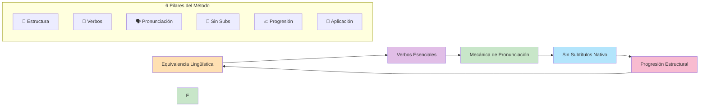
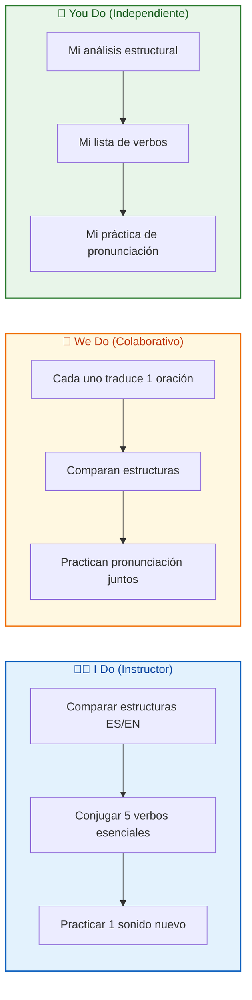
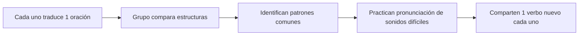
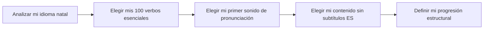

# MASTERCLASS: Método Pablo Vázquez - Cómo Aprender Cualquier Idioma desde la Estructura 🌍

## INTRODUCCIÓN: POR QUÉ ESTA MASTERCLASS ES DIFERENTE 🎯

La mayoría de los métodos de idiomas empiezan por vocabulario suelto, reglas gramaticales abstractas y listas de palabras aisladas. Pablo Vázquez, ingeniero y políglota con más de 10 idiomas, propone un enfoque radicalmente distinto: **entender la estructura profunda del lenguaje** para transferir patrones de tu idioma natal al nuevo.

El objetivo no es "memorizar un idioma", sino **descifrar su lógica interna** como si fuera un código que ya conocés.

> **🎯 Objetivo de Aprendizaje** — Al final de esta guía, podrás aplicar la equivalencia lingüística, dominar los 100-200 verbos esenciales, entrenar la mecánica de pronunciación, diseñar una progresión estructural y aplicar el método en contextos prácticos como entrevistas laborales.

> **⚠️ Advertencia educativa** — Este contenido es formativo. Aprender un idioma requiere exposición constante y práctica activa. Este método acorta el camino cambiando la forma en que pensás el lenguaje.

---

## 🗺️ MAPA DE LA MASTERCLASS 🧭

| 🧩 Fase | ❓ Pregunta que responde | 📤 Resultado principal |
|---------|------------------------|------------------------|
| **🧠 Equivalencia** | ¿Cómo transfiero lo que sé de español al nuevo idioma? | Patrones estructurales identificados |
| **💬 Verbos** | ¿Qué palabras aprendo primero? | 100-200 verbos esenciales conjugados |
| **🗣️ Pronunciación** | ¿Cómo sueno como nativo? | Mecánica física de sonidos nuevos |
| **🚫 Subtítulos** | ¿Por qué los subtítulos en español me frenan? | Cerebro procesando solo el idioma meta |
| **📈 Progresión** | ¿Cómo avanzo sin abrumarme? | De lo simple a lo complejo en pasos pequeños |
| **💼 Aplicación** | ¿Cómo uso esto en entrevistas? | Respuestas estructuradas, no memorizadas |

---

## 🧠 PARTE 1: EQUIVALENCIA LINGÜÍSTICA - TODOS LOS IDIOMAS SON LO MISMO 🧠

### 1.1 ❓ PRETEST

¿Qué tienen en común las oraciones "Yo como una manzana", "I eat an apple" y "Ich esse einen Apfel"?

> Respuesta esperada: Tienen la misma estructura lógica: Sujeto + Verbo + Objeto.
> Si acertás: camino rápido → andá al punto 7.

### 1.2 🎯 POR QUÉ + LOGRO

Importa porque **tu cerebro ya domina la lógica del lenguaje**: la tiene en español. El truco no es aprender desde cero, sino **mapear lo que ya sabés** al nuevo idioma. Vas a lograr **traducir mentalmente estructuras, no palabras sueltas**.

### 1.3 ⚡ VICTORIA RÁPIDA (<5 min)

Escribí en español: "Yo tengo 25 años y vivo en Buenos Aires". Ahora traducilo palabra por palabra a inglés: "I have 25 years and I live in Buenos Aires". Esa es equivalencia estructural.

### 1.4 💡 CONCEPTO

Analogía: Los idiomas son como **distintos modelos de coche** — todos tienen motor, volante, frenos y acelerador. Lo que cambia es la forma del tablero, pero la lógica de conducción es la misma.

Definición: La equivalencia lingüística es el principio de que todos los idiomas comparten estructuras profundas similares (sujeto, verbo, objeto, tiempo, modo). En vez de aprender reglas aisladas, comparás tu lengua natal con la nueva para encontrar equivalentes directos.

### 1.5 👀 EJEMPLO RESUELTO

| Estructura en español | Equivalente en inglés | Patrón identificado |
|-----------------------|----------------------|---------------------|
| "Yo como" | "I eat" | Sujeto + Verbo presente |
| "Yo comía" | "I ate" | Sujeto + Verbo pasado |
| "Voy a comer" | "I am going to eat" | Estructura de futuro próximo |
| "Tengo que estudiar" | "I have to study" | Obligación |
| "Me gusta leer" | "I like to read" | Gustos + infinitivo |

### 1.6 ⚠️ CONTRA-EJEMPLO / ERROR TÍpico

Error: Intentar traducir frases hechas literalmente: "I have 25 years" en vez de "I am 25 years old".

Corrección: Las equivalencias son estructurales, no literales. "Tener años" en español se convierte en "ser + años" en inglés. Eso es una diferencia estructural que tenés que memorizar como excepción al patrón.

### 1.7 🧪 PRÁCTICA

Escribí 5 oraciones simples en español sobre tu rutina diaria. Ahora traducilas usando equivalencias estructurales, no palabra por palabra.

> Respuesta esperada / criterio: Las oraciones deben seguir la lógica del inglés, no ser traducciones literales. Ejemplo correcto: "I wake up at 7" (no "I wake up myself at 7").

### 1.8 🔁 RECALL — Nivel Bloom: Analizar

¿Por qué Pablo Vázquez dice que entender tu idioma natal es el primer paso para aprender otro?

### 1.9 📌 IDEA CLAVE

Tu idioma natal es el mapa: si entendés sus estructuras, podés trazar el camino hacia cualquier otro idioma.

### 1.10 ✅ AUTO-CHEQUEO + SIGUIENTE

- [ ] Analicé 5 estructuras del español
- [ ] Encontré sus equivalentes en inglés
- [ ] Entiendo la diferencia entre equivalencia estructural y traducción literal

Siguiente: Los 100-200 verbos que son el 80% de lo que hablás.

---

## 💬 PARTE 2: LOS 100-200 VERBOS ESENCIALES - EL MOTOR DEL LENGUAJE 💬

### 2.1 ❓ PRETEST

¿Cuántas palabras necesitás para expresar la mayoría de ideas cotidianas?

> Respuesta esperada: Aproximadamente 100-200 verbos.
> Si acertás: camino rápido → andá al punto 7.

### 2.2 🎯 POR QUÉ + LOGRO

Importa porque **los verbos son el motor de las oraciones**. Sin verbos, solo tenés nombres de cosas pero no podés describir acciones. Vas a lograr **construir la mayoría de frases cotidianas** dominando un conjunto pequeño de verbos高频.

### 2.3 ⚡ VICTORIA RÁPIDA (<5 min)

Escribí los 10 verbos más comunes en español: ser, estar, tener, hacer, ir, venir, decir, poder, querer, poner. Esos son tu primer grupo.

### 2.4 💡 CONCEPTO

Analogía: Los verbos son como **los comandos de un software** — sin ellos, no podés ejecutar acciones. Con 100-200 comandos podés construir cualquier programa.

Definición: Los 100-200 verbos más frecuentes en cualquier idioma permiten construir la mayoría de oraciones cotidianas. La clave no es memorizarlos aislados, sino entender su conjugación y patrones de modificación (ar/er/ir, tiempos verbales básicos).

### 2.5 👀 EJEMPLO RESUELTO

| Verbo español | Estructura | Equivalente inglés | Patrón |
|---------------|-----------|-------------------|--------|
| Hablar | Habl-ar | Speak | Verbo base |
| Comer | Com-er | Eat | Verbo base |
| Vivir | Viv-ir | Live | Verbo base |
| Yo hablo | 1ª pers + ar → o | I speak | Presente regular |
| Tú hablas | 2ª pers + ar → as | You speak | Presente regular |
| Él come | 3ª pers + er → e | He eats | Presente regular |

### 2.6 ⚠️ CONTRA-EJEMPLO / ERROR TÍpico

Error: Aprender verbos aislados: "correr = to run", "comer = to eat".

Corrección: Los verbos no son palabras sueltas, son **sistemas de flexión**. Tenés que aprender el patrón de conjugación, no solo la traducción. "Correr" es "to run", pero "yo corro" es "I run", "él corre" es "he runs".

### 2.7 🧪 PRÁCTICA

Elegí 5 verbos de la lista de 100 esenciales. Escribí su conjugación en presente para yo/tú/él/ella.

> Respuesta esperada / criterio: Debes identificar el patrón de conjugación (ar/er/ir) y aplicarlo correctamente. Ejemplo: hablar → I speak, you speak, he speaks.

### 2.8 🔁 RECALL — Nivel Bloom: Aplicar

¿Por qué Pablo Vázquez dice que los verbos son más importantes que los sustantivos?

### 2.9 📌 IDEA CLAVE

Los verbos son los comandos del idioma: con 200 verbos conjugados podés construir cualquier oración que necesites.

### 2.10 ✅ AUTO-CHEQUEO + SIGUIENTE

- [ ] Descargué lista de 100-200 verbos esenciales
- [ ] Practiqué conjugación de 5 verbos
- [ ] Entiendo los patrones ar/er/ir en presente

Siguiente: Cómo entrenar la mecánica física de la pronunciación.

---

## 🗣️ PARTE 3: MECÁNICA DE PRONUNCIACIÓN - LOS SONIDOS FÍSICOS 🗣️

### 3.1 ❓ PRETEST

¿Qué parte del cuerpo es clave para pronunciar sonidos que no existen en español?

> Respuesta esperada: La lengua, los labios y la posición de la mandíbula.
> Si acertás: camino rápido → andá al punto 7.

### 3.2 🎯 POR QUÉ + LOGRO

Importa porque **tu cerebro confunde sonidos que nunca produjiste**. Si nunca practicaste la posición de la lengua para /θ/, tu cerebro lo mezcla con /t/. Vas a lograr **escuchar y producir sonidos que antes eran "ruido"**.

### 3.3 ⚡ VICTORIA RÁPIDA (<5 min)

Buscá en YouTube "English pronunciation th sound". Mirá el video y intentá pronunciar "think", "three", "theater" frente a un espejo. Poné la lengua entre los dientes.

### 3.4 💡 CONCEPTO

Analogía: La pronunciación es como **aprender a tocar un instrumento** — no basta con saber la teoría, tenés que practicar la posición física de los dedos. Lo mismo pasa con la lengua, los labios y el aire.

Definición: La mecánica de pronunciación se refiere a la posición física exacta de la lengua, los labios, la mandíbula y el flujo de aire para producir sonidos específicos. Cada sonido del inglés tiene una "receta" física que podés aprender y automatizar.

### 3.5 👀 EJEMPLO RESUELTO

| Sonido | Ejemplo inglés | Posición física | Truco |
|--------|---------------|-----------------|-------|
| /θ/ | think, three | Lengua entre dientes, aire expulsado | Como soplar la sopa caliente |
| /ð/ | this, that | Lengua entre dientes, sin aire fuerte | Más suave que /θ/, como "d" suave |
| /ʃ/ | she, ship | Labios redondeados como silbando | Decí "shhh" como para callar a alguien |
| /w/ | water, what | Labios muy redondeados | Como pronunciar "u" en "huevo" |
| /r/ | red, right | Lengua atrás, no en el diente | Sonido gutural suave |

### 3.6 ⚠️ CONTRA-EJEMPLO / ERROR Típico

Error: Intentar pronunciar "think" con la lengua atrás como en español.

Corrección: El sonido /θ/ requiere **lengua entre los dientes**. Si lo hacés con la lengua atrás, tu cerebro confunde el sonido con /t/ y no lo reconoce en listening.

### 3.7 🧪 PRÁCTICA

Elegí 1 sonido de la lista. Buscá 10 palabras que usen ese sonido. Repetilas en voz alta 5 veces cada una, grabate y compará con un nativo.

> Respuesta esperada / criterio: No importa si no es perfecto. Lo importante es que identifiques la posición física y la practiques. Ejemplo inicial: /θ/ (think, three, theater).

### 3.8 🔁 RECALL — Nivel Bloom: Aplicar

¿Por qué Pablo Vázquez enfatiza la mecánica física en vez de solo "escuchar y repetir"?

### 3.9 📌 IDEA CLAVE

Tu oído reconoce lo que tu boca puede producir: si dominás la mecánica, el listening se desbloquea solo.

### 3.10 ✅ AUTO-CHEQUEO + SIGUIENTE

- [ ] Identifiqué 1 sonido nuevo para practicar
- [ ] Busqué su posición física exacta
- [ ] Practiqué 10 palabras con ese sonido

Siguiente: Por qué los subtítulos en español son el mayor obstáculo.

---

## 🚫 PARTE 4: SIN SUBTÍTULOS EN ESPAÑOL - EL CEREBRO NO PROCESA DOS IDIOMAS 🚫

### 4.1 ❓ PRETEST

¿Qué pasa en tu cerebro cuando mirás una serie en inglés con subtítulos en español?

> Respuesta esperada: Tu cerebro lee el español y no procesa el audio en inglés.
> Si acertás: camino rápido → andá al punto 7.

### 4.2 🎯 POR QUÉ + LOGRO

Importa porque **los subtítulos en español crean una muleta que nunca abandonás**. Tu cerebro elige el camino más fácil: leer en español en vez de procesar el inglés. Vas a lograr **forzar la conexión entre sonido y significado** sin la red del español.

### 4.3 ⚡ VICTORIA RÁPIDA (<5 min)

Abrí un video en inglés de 3 minutos. Poné los subtítulos en inglés, no en español. Si te tienta cambiar a español, recordá: la confusión es parte del proceso.

### 4.4 💡 CONCEPTO

Analogía: Los subtítulos en español son como **aprender a caminar con muletas** — te ayudan a moverte, pero nunca te permiten fortalecer las piernas. Si nunca las soltás, nunca caminás solo.

Definición: El cerebro no procesa dos idiomas al mismo tiempo de forma efectiva. Cuando hay subtítulos en español, tu atención se va al texto nativo y el audio en inglés se convierte en ruido de fondo. Sin subtítulos nativos, tu cerebro está obligado a inferir significado del sonido.

### 4.5 👀 EJEMPLO RESUELTO

| Estrategia | Resultado a corto plazo | Resultado a largo plazo |
|------------|------------------------|-------------------------|
| Subtítulos en español | Entendés todo, pero no entrenás listening | Dependencia eterna de la traducción |
| Subtítulos en inglés | Confusión inicial, pero conexión sonido-significado | Listening real sin traducción |
| Sin subtítulos | Dificultad máxima, pero cerebro infiere | Comprensión auditiva natural |

### 4.6 ⚠️ CONTRA-EJEMPLO / ERROR Típico

Error: "Yo veo con subtítulos en español para aprender vocabulario".

Corrección: El vocabulario se aprende conectando sonido y significado, no texto y significado. Si leés "perro" mientras escuchás "dog", tu cerebro conecta "perro" con el contexto visual, no con el sonido /dɒg/.

### 4.7 🧪 PRÁCTICA

Elegí un video corto en inglés. Miralo 3 veces: primera con subtítulos EN, segunda sin subtítulos, tercera sin subtítulos. Anotá cuántas frases entendiste cada vez.

> Respuesta esperada / criterio: Debe haber progreso entre la primera y la tercera vez. Si en la tercera vez entendés más que en la primera, el método funciona.

### 4.8 🔁 RECALL — Nivel Bloom: Analizar

¿Por qué Pablo Vázquez dice que los subtítulos en español son el "no-go" máximo?

### 4.9 📌 IDEA CLAVE

Los subtítulos en español te hacen sentir que estás aprendiendo, pero solo estás leyendo en tu idioma nativo. El listening no se entrena sin exponer el oído al sonido.

### 4.10 ✅ AUTO-CHEQUEO + SIGUIENTE

- [ ] Probé ver contenido sin subtítulos en español
- [ ] Entiendo por qué los subtítulos EN son mejores que los ES
- [ ] Comprométome a no usar subtítulos en español

Siguiente: Cómo progresar de lo simple a lo complejo sin abrumarte.

---

## 📈 PARTE 5: PROGRESIÓN ESTRUCTURAL - DE LO SIMPLE A LO COMPLEJO 📈

### 5.1 ❓ PRETEST

¿Qué es mejor: aprender oraciones complejas desde el día 1 o empezar por estructuras simples?

> Respuesta esperada: Empezar por estructuras simples y agregar complejidad gradual.
> Si acertás: camino rápido → andá al punto 7.

### 5.2 🎯 POR QUÉ + LOGRO

Importa porque **la complejidad genera abandono**. Si intentás entender condicionales complejos en la semana 1, tu cerebro se satura y abandonás. Vas a lograr **avanzar con victorias rápidas** que generen confianza.

### 5.3 ⚡ VICTORIA RÁPIDA (<5 min)

Escribí en español: "Yo como una manzana". Traducí: "I eat an apple". Ahora agregá 1 elemento: "Yo como una manzana roja" → "I eat a red apple". Esa es progresión estructural.

### 5.4 💡 CONCEPTO

Analogía: Aprender idiomas es como **construir una casa** — primero los cimientos (sujeto + verbo), luego las paredes (adjetivos, objetos), después el techo (conectores, condicionales). Si intentás poner el techo sin paredes, se cae.

Definición: La progresión estructural consiste en dominar un nivel de complejidad antes de pasar al siguiente. Empezá por oraciones simples (sujeto + verbo + objeto), luego agregá adjetivos, luego adverbios, luego conectores, luego condicionales.

### 5.5 👀 EJEMPLO RESUELTO

| Nivel | Estructura | Ejemplo inglés | Complejidad |
|-------|-----------|---------------|-------------|
| 1 | Sujeto + Verbo | I eat | Muy simple |
| 2 | Sujeto + Verbo + Objeto | I eat an apple | Simple |
| 3 | + Adjetivo | I eat a red apple | Media |
| 4 | + Adverbio | I always eat a red apple | Media |
| 5 | + Conector | I eat an apple because I'm hungry | Compleja |
| 6 | + Condicional | If I'm hungry, I eat an apple | Avanzada |

### 5.6 ⚠️ CONTRA-EJEMPLO / ERROR Típico

Error: Intentar aprender condicionales y voz pasiva en la semana 1.

Corrección: Si no dominás el presente simple, el condicional es un castillo de arena. Cada nivel necesita 50-100 horas de práctica antes de pasar al siguiente.

### 5.7 🧪 PRÁCTICA

Elegí 1 estructura del nivel 1 o 2. Escribí 5 oraciones usando esa estructura con tu vocabulario actual.

> Respuesta esperada / criterio: Las oraciones deben ser correctas en estructura, no importa si el vocabulario es simple. Ejemplo nivel 1: "I run", "She sleeps", "We eat".

### 5.8 🔁 RECALL — Nivel Bloom: Crear

¿Por qué Pablo Vázquez dice que la progresión estructural es más importante que el volumen de vocabulario?

### 5.9 📌 IDEA CLAVE

Una estructura simple te permite construir infinitas oraciones; una oración compleja memorizada solo te sirve para esa situación.

### 5.10 ✅ AUTO-CHEQUEO + SIGUIENTE

- [ ] Identifiqué mi nivel actual de estructuras
- [ ] Practiqué 5 oraciones nivel 1-2
- [ ] Entiendo la regla de progresión: dominar antes de avanzar

Siguiente: Cómo aplicar todo esto en entrevistas laborales.

---

## 💼 PARTE 6: APLICACIÓN PRÁCTICA - ENTREVISTAS LABORALES 💼

### 6.1 ❓ PRETEST

¿Qué es mejor para una entrevista en inglés: memorizar respuestas o entender la estructura de las preguntas?

> Respuesta esperada: Entender la estructura para construir respuestas flexibles.
> Si acertás: camino rápido → andá al punto 7.

### 6.2 🎯 POR QUÉ + LOGRO

Importa porque **las entrevistas son conversaciones, no exámenes de memoria**. Si memorizás respuestas exactas, un pequeño cambio de pregunta te descoloca. Vas a lograr **responder cualquier pregunta con la misma estructura lógica**.

### 6.3 ⚡ VICTORIA RÁPIDA (<5 min)

Escribí la pregunta "Tell me about yourself". Ahora escribí 3 puntos clave que la respuesta debe cubrir: quién sos, qué hiciste, qué querés. Esa es la estructura, no el script.

### 6.4 💡 CONCEPTO

Analogía: Una entrevista es como **un juego de LEGO** — tenés piezas básicas (verbos, estructuras) y tenés que armar la respuesta según la pregunta. Si memorizás una construcción exacta, no podés adaptarla a otra forma.

Definición: Para entrevistas en inglés, Pablo Vázquez recomienda identificar las estructuras de respuesta (quién soy, qué logré, qué aprendí) y practicarlas con verbos esenciales. Así podés responder cualquier pregunta sin memorizar scripts completos.

### 6.5 👀 EJEMPLO RESUELTO

| Pregunta típica | Estructura de respuesta | Verbos esenciales usados |
|-----------------|------------------------|--------------------------|
| Tell me about yourself | I am [nombre], I work at [empresa], I have [años] experiencia | ser, trabajar, tener |
| Why do you want this job? | I want this job because I can [habilidad], I like [industria] | querer, poder, gustar |
| What are your strengths? | I am good at [skill], I can [logro] | ser bueno en, poder |
| Describe a challenge | I faced [problema], I solved [solución], I learned [lección] | enfrentar, resolver, aprender |

### 6.6 ⚠️ CONTRA-EJEMPLO / Error Típico

Error: Memorizar un texto completo de 2 minutos sobre tu experiencia.

Corrección: Si la pregunta cambia de "háblame de vos" a "¿por qué dejás tu trabajo actual?", el script memorizado no sirve. Mejor tener la estructura flexible y llenarla con tus datos reales.

### 6.7 🧪 PRÁCTICA

Elegí 3 preguntas típicas de entrevista. Para cada una, escribí la estructura de respuesta (no el texto completo) usando verbos esenciales.

> Respuesta esperada / criterio: Las estructuras deben ser genéricas, aplicables a cualquier pregunta similar. Ejemplo: "Tell me about yourself" → "I am [nombre], I work as [rol], I have [años] in [industria]".

### 6.8 🔁 RECALL — Nivel Bloom: Crear

¿Por qué entender la estructura de las preguntas es más útil que memorizar respuestas?

### 6.9 📌 IDEA CLAVE

Una estructura flexible te sirve para 100 preguntas; un script memorizado te sirve solo para 1.

### 6.10 ✅ AUTO-CHEQUEO + SIGUIENTE

- [ ] Identifiqué 3 preguntas típicas de entrevista
- [ ] Escribí su estructura de respuesta
- [ ] Practiqué responderlas en voz alta

Siguiente: Cómo combinar todos los pilares en tu sistema personal.

---

## 🎓 PARTE 7: I DO / WE DO / YOU DO - TU SISTEMA COMPLETO 🎓

### 7.1 🧭 I Do — Método aplicado paso a paso

**🎯 Objetivo**: Combinar los 6 pilares en una rutina diaria.

| 📌 Paso | 📝 Acción | ⏱️ Tiempo |
|---------|-----------|-----------|
| 1 | Analizar estructura de 5 oraciones en español | 10 min |
| 2 | Traducir a inglés usando equivalencias | 10 min |
| 3 | Practicar 10 verbos esenciales conjugados | 15 min |
| 4 | Practicar 1 sonido de pronunciación | 10 min |
| 5 | Ver contenido en inglés con CC EN (sin subtítulos ES) | 20 min |
| 6 | Practicar respuesta estructurada para entrevista | 10 min |

**📋 Ejemplo guiado**:
- Día 1: Analizar "Yo tengo 25 años" → "I am 25 years old" → Practicar "to be" → Sonido /θ/ → Serie con CC EN
- Día 7: Analizar oraciones más complejas → Verbos irregulares → Sonido /ð/ → Podcast sin subtítulos
- Día 30: Progresión a condicionales → Verbos modales → Combinar sonidos → Entrevista simulada

### 7.2 🤝 We Do — Análisis estructural grupal

**👥 Ejercicio grupal**: Cada persona traduce 1 oración compleja al inglés y el grupo compara estructuras.

**📜 Reglas del ejercicio**:
1. Sin traducción literal: buscar equivalencia estructural
2. Cada uno identifica el patrón gramatical usado
3. Comparen: ¿todos usaron la misma estructura?
4. Practiquen 1 sonido difícil que aparezca en las oraciones

### 7.3 🚀 You Do — Tu sistema personal de idiomas

**📋 Tarea**: Diseñá tu protocolo basado en los 6 pilares.

**✅ Checklist de implementación**:

- [ ] 🧠 Analicé 10 estructuras del español y encontré sus equivalentes en inglés
- [ ] 💬 Descargué lista de 100 verbos esenciales y practiqué 5
- [ ] 🗣️ Elegí mi primer sonido de pronunciación para dominar
- [ ] 🚫 Eliminé subtítulos en español de mi contenido de inmersión
- [ ] 📈 Definí mi nivel actual y el siguiente nivel a alcanzar
- [ ] 💼 Preparé 3 respuestas estructuradas para entrevistas
- [ ] ⏱️ Bloqueé 40-60 minutos diarios en mi calendario
- [ ] 🤝 Compartí mi sistema con 1 persona para accountability

---

## 🧩 PREGUNTAS DE VERIFICACIÓN 📝✅

1. **📊 Aplica**: Tomá 5 oraciones de tu rutina diaria y traducilas usando equivalencia estructural, no literal.

2. **🔍 Analiza**: ¿Por qué los 100-200 verbos son más poderosos que 500 sustantivos aislados?

3. **🛠️ Diseña**: Elegí 1 sonido difícil, 10 palabras con ese sonido y 5 verbos esenciales. Armá tu práctica de 30 minutos.

4. **💭 Reflexiona**: ¿Por qué los subtítulos en español te hacen sentir que estás aprendiendo, pero solo estás leyendo?

5. **📅 Crea**: Diseñá tu Week 1 schedule con 3 pilares: estructuras, verbos, pronunciación.

---

## 📖 GLOSARIO RÁPIDO 📚

| Término | Definición |
|---------|------------|
| **Equivalencia lingüística** | Mapear estructuras de tu idioma natal al nuevo idioma |
| **Verbos esenciales** | 100-200 verbos que cubren la mayoría de comunicaciones |
| **Mecánica de pronunciación** | Posición física de lengua, labios y aire para producir sonidos |
| **Progresión estructural** | Avanzar de estructuras simples a complejas gradualmente |
| **Periodo silencioso** | Fase donde escuchás mucho pero no hablás por miedo |
| **Accountability** | Responsabilidad externa que sostiene el hábito |

---

## 🎓 NOTAS FINALES 🎓✨

El método de Pablo Vázquez no es para quienes quieren atajos: es para quienes quieren **entender el idioma desde su esqueleto**. La clave no es memorizar más palabras, sino entender mejor las estructuras que ya conocés.

Recuerda:
1. **🧠 Equivalencia primero** — tu idioma natal es el mapa
2. **💬 100-200 verbos** — el motor de cualquier idioma
3. **🗣️ Mecánica física** — sonidos que tu boca debe aprender a producir
4. **🚫 Sin subtítulos ES** — el cerebro no procesa dos idiomas a la vez
5. **📈 Progresión estructural** — de lo simple a lo complejo, sin saltos
6. **💼 Estructuras flexibles** — para entrevistas y conversaciones reales

> **🌟 Mensaje final**: Aprender un idioma no es memorizar un diccionario, es descifrar un sistema. Pablo Vázquez demuestra que con estructura, verbos, pronunciación y exposición sin muletas, cualquier idioma es accesible. Empezá hoy: elegí 5 estructuras, 10 verbos y 1 sonido.

---

**Creado con propósito educativo. El aprendizaje de idiomas requiere paciencia, consistencia y comprensión estructural. Este método es un mapa, no un atajo.**

🌍✨
