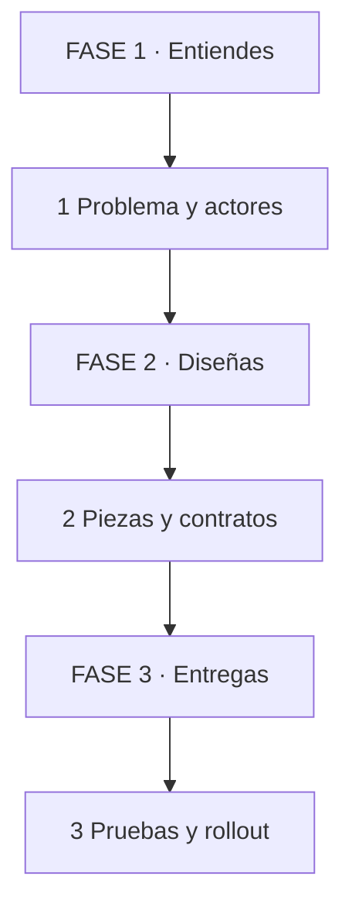
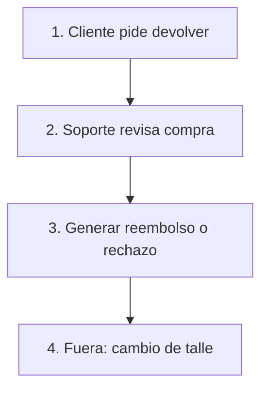
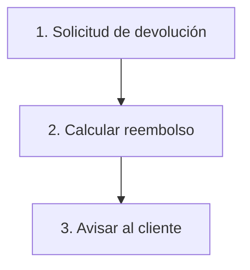
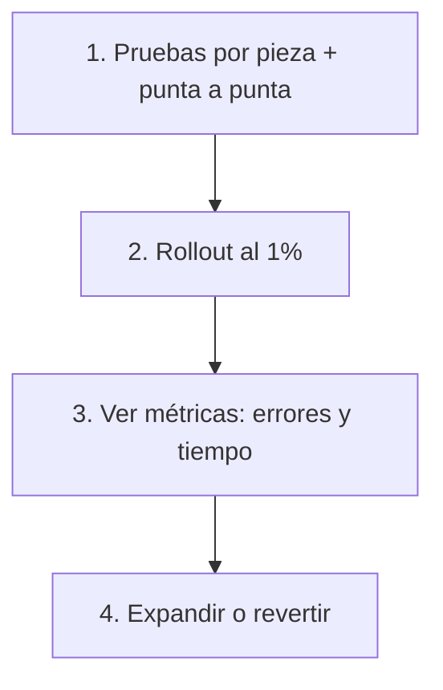

# 🗺️ Modelar Sistemas y Crear Features como un Profesional

Tres FASES usables: entiendes el problema, diseñas la solución y entregas sin romper nada.

## 🗺️ Mapa de 3 FASES

FASE 1 → Entiendes (PARTE 1) → FASE 2 → Diseñas (PARTE 2) → FASE 3 → Entregas (PARTE 3).

👀 Cómo leerlo: 3 fases de izquierda a derecha, de fácil a difícil.

*Se lee de arriba hacia abajo. 3 fases con su paso clave.*

### 📚 Pre-training: 7 términos antes de empezar

| Término | Analogía + Significado |
|---------|------------------------|
| Modelo | Mapa del arquitecto: simplifica el problema real |
| Actor | Quien abre la puerta: persona o sistema que usa el sistema |
| Dominio | Reglas del juego: el negocio con sus límites |
| Contrato | Enchufe estándar: acuerdo exacto de entradas y salidas |

*Continúa la tabla (2/2) — partida en bloques de ≤4 para no saturar.*

| Término | Analogía + Significado |
|---------|------------------------|
| Trade-off | Balanza: lo que ganas y lo que pagas al elegir |
| Rollout | Pileta por la escalera: salida gradual y vigilada |
| Feature | Capacidad nueva: algo que usa gente real |

👀 Cómo leer las tablas: izquierda el término, derecha su analogía corta.

## 🔍 PARTE 1: Entiende Antes de Dibujar (Nivel 1/5)

1. ❓ PRETEST — Te piden agregar devoluciones a una tienda. ¿Qué preguntas antes de abrir el editor? (Activa previas | Media)
   > Respuesta esperada: quién la pide, qué casos cubre y qué reglas del negocio la limitan.
   > Si acertás: camino rápido → andá al punto 7.

2. 🎯 POR QUÉ + LOGRO — Codificar sin modelo construye lo que nadie pidió. Importa porque el tiempo vale más que el código. Vas a lograr listar actores, casos y reglas de 1 feature en 1 página. (Motivación | Media)

3. ⚡ VICTORIA RÁPIDA (<5 min) — Escribe 3 frases: quién la usa, qué logra y qué no debe pasar jamás. Ya modelaste el corazón sin tecnología. (Motivación | Heurística)

4. 💡 CONCEPTO — Analogía: modelar es el plano del arquitecto, nadie levanta paredes sin saber dónde va la puerta. Definición: recortar el problema en actores con metas, casos de uso con pasos y reglas del dominio que nunca se rompen. (Pre-training + señalización | Media)

| Pieza del modelo | Pregunta que responde |
|------------------|-----------------------|
| Actores | ¿Quién gana qué con esto? |
| Casos de uso | ¿Qué pasos hace de punta a punta? |
| Reglas | ¿Qué está prohibido siempre? |
| Fuera de alcance | ¿Qué NO incluye esta vez? |

👀 Cómo leer la tabla: izquierda la pieza, derecha su pregunta.

5. 👀 EJEMPLO RESUELTO — Caso: devoluciones en tienda. I Do: actores cliente y soporte; caso devolver en 3 pasos; regla nunca sin compra pagada; fuera cambios de talle. We Do: ¿qué caso falta? → reembolso parcial por daño. You Do: punto 7.

*Se lee de izquierda a derecha. 3 pasos de contenido + 1 límite.*

Por qué funciona: lo escrito se discute, lo imaginado se supone. Cuándo falla: si modelas 2 semanas sin validar con usuarios reales. (Worked example | Alta)

6. ⚠️ CONTRA-EJEMPLO / ERROR TÍPICO — Empezar por la base de datos y descubrir al final 2 actores olvidados. → Corrección: primero personas y reglas, las tablas después. (Autoexplicación | Media-Alta)

7. 🧪 PRÁCTICA — Modela otra feature distinta: 2 actores, 2 casos, 1 regla y 1 fuera de alcance.
   > Respuesta esperada: modelo en 6 líneas coherentes y sin tecnología. (Práctica + feedback | Media)

8. 🔁 RECALL — Sin mirar: ¿qué son actor, caso, regla y fuera de alcance? (Nivel Bloom: recordar) (Recuperación | Alta)

9. 📌 IDEA CLAVE — Primero personas y reglas, la tecnología siempre después.

10. ✅ AUTO-CHEQUEO + SIGUIENTE — [ ] Listé actores [ ] Escribí casos [ ] Fijé límites. Siguiente: diseñar la solución con contratos. (Metacognición | Media)

## 🧩 PARTE 2: Diseña la Solución (Nivel 3/5)

1. ❓ PRETEST — Tu feature toca pagos y notificaciones. ¿Cómo la partes para no mezclar todo? (Activa previas | Media)
   > Respuesta esperada: en piezas con 1 contrato claro cada una y datos propios.
   > Si acertás: camino rápido → andá al punto 7.

2. 🎯 POR QUÉ + LOGRO — El diseño decide el costo de cada cambio futuro. Importa porque las piezas pequeñas se cambian rápido. Vas a lograr partir 1 feature en 3 piezas con contratos y 1 decisión con trade-off. (Motivación | Media)

3. ⚡ VICTORIA RÁPIDA (<5 min) — Dibuja 3 cajas de tu feature con 1 flecha de dato entre cada una. Ya separaste responsabilidades. (Motivación | Heurística)

4. 💡 CONCEPTO — Analogía: el contrato es el enchufe estándar, cualquier aparato compatible entra. Definición: cada pieza declara entradas, salidas y errores; los datos viven donde se usan; cada decisión anota qué gana y qué paga. (Pre-training + señalización | Media)

| Decisión de diseño | Regla en 1 línea |
|--------------------|------------------|
| Partir en piezas | 1 responsabilidad por pieza, ni más |
| Contrato primero | Entradas, salidas y errores por escrito |
| Datos cerca | Cada dato vive con quien lo cambia |
| Trade-off visible | Toda elección anota costo y beneficio |

👀 Cómo leer la tabla: izquierda la decisión, derecha su regla.

5. 👀 EJEMPLO RESUELTO — Caso: devoluciones de la PARTE 1. I Do: piezas solicitud, reembolso y aviso; contrato de reembolso recibe pedido y devuelve monto o error; decisión cola para avisar, gana desacople y paga espera. We Do: ¿dónde vive el motivo? → con solicitud, que lo crea. You Do: punto 7.

*Se lee de izquierda a derecha. 3 piezas de la feature.*

Por qué funciona: lo partido se prueba y se cambia por partes. Cuándo falla: si partes en 12 micro-piezas para una feature de 3 días. (Worked example | Alta)

6. ⚠️ CONTRA-EJEMPLO / ERROR TÍPICO — Todo en 1 función gigante que toca pagos, mails y base a la vez. → Corrección: si toca 3 cosas distintas, son 3 piezas con contratos. (Autoexplicación | Media-Alta)

7. 🧪 PRÁCTICA — Diseña tu feature de la PARTE 1: 3 piezas, 1 contrato escrito y 1 trade-off.
   > Respuesta esperada: piezas con responsabilidad + contrato con entradas y errores + trade-off. (Práctica + feedback | Media)

8. 🔁 RECALL — Sin mirar: ¿qué lleva un contrato y dónde vive cada dato? (Nivel Bloom: comprender) (Recuperación | Alta)

9. 📌 IDEA CLAVE — Piezas chicas con contratos escritos envejecen bien.

10. ✅ AUTO-CHEQUEO + SIGUIENTE — [ ] Partí en 3 piezas [ ] Escribí 1 contrato [ ] Anoté 1 trade-off. Siguiente: entregar como profesional. (Metacognición | Media)

## 🚀 PARTE 3: Entrega como Profesional (Nivel 5/5)

1. ❓ PRETEST — Tu feature está lista un viernes. ¿La activas al 100 por ciento ya? (Activa previas | Media)
   > Respuesta esperada: no, sale gradual a pocos usuarios con métricas y vuelta atrás lista.
   > Si acertás: camino rápido → andá al punto 7.

2. 🎯 POR QUÉ + LOGRO — El profesional se mide por entregas que no despiertan a nadie. Importa porque un error a tiempo es estadística, no es una crisis. Vas a lograr tu plan de pruebas, rollout gradual y nota de entrega. (Motivación | Media)

3. ⚡ VICTORIA RÁPIDA (<5 min) — Escribe cómo vuelves atrás tu feature en 1 paso. Ya tienes red de seguridad. (Motivación | Heurística)

4. 💡 CONCEPTO — Analogía: el rollout es probar la pileta por la escalera, no de clavado. Definición: pruebas por pieza y punta a punta, salida a 1 por ciento con métricas y expansión solo en verde. Analogía de la nota: el manual del interruptor para quien viene después. (Pre-training + señalización | Media)

| Paso profesional | Qué incluye |
|------------------|-------------|
| Pruebas | 1 por pieza más 1 punta a punta |
| Rollout | 1 por ciento, métricas y expansión |
| Vuelta atrás | 1 paso probado antes de salir |
| Nota | Qué cambió y cómo apagarlo |

👀 Cómo leer la tabla: izquierda el paso, derecha su contenido.

5. 👀 EJEMPLO RESUELTO — Caso: reembolsos de la PARTE 2. I Do: pruebo contrato con monto cero y doble, salgo al 1 por ciento mirando errores, expando al ver cero fallos. We Do: ¿qué métrica manda? → tasa de error y tiempo de reembolso. You Do: punto 7.

*Se lee de izquierda a derecha. 3 pasos del rollout.*

Por qué funciona: el error chico se ve antes de ser tragedia. Cuándo falla: si nadie mira las métricas durante el rollout. (Worked example | Alta)

6. ⚠️ CONTRA-EJEMPLO / ERROR TÍPICO — Deploy viernes de noche al 100 por ciento sin vuelta atrás ni métricas. → Corrección: gradual en horario útil con dueño mirando números. (Autoexplicación | Media-Alta)

7. 🧪 PRÁCTICA MIXTA — Mezcla las 3 PARTES: tu feature con 1 caso, 1 contrato, 1 trade-off y plan de rollout en 3 líneas.
   > Respuesta esperada: caso + contrato + trade-off + rollout coherentes. (Práctica + feedback | Media)

8. 🔁 RECALL — Sin mirar: explicá modelo, contrato, trade-off y rollout con 1 línea cada uno. (Nivel Bloom: aplicar) (Recuperación | Alta)

9. 📌 IDEA CLAVE — Modela, parte, prueba y sale gradual o no sale.

10. ✅ AUTO-CHEQUEO + SIGUIENTE — [ ] Probé por pieza [ ] Planeé rollout [ ] Escribí la nota. Siguiente: aplica el ciclo a tu próxima feature real. (Metacognición | Media)
