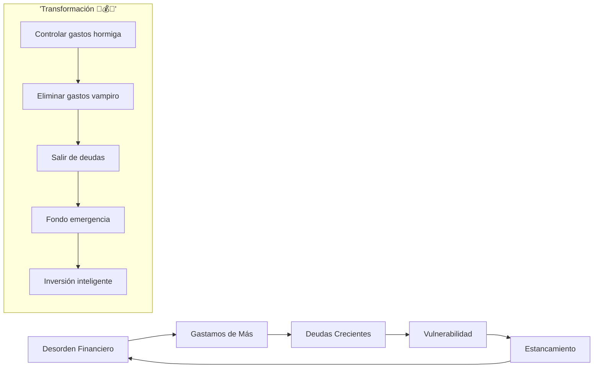
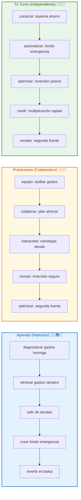

# 🚀 MASTERCLASS: Multiplicar Capital en Argentina — El Método Maxi Leguizamo 🔥💰📈🇦🇷🎯

## 🎯 INTRODUCCIÓN: POR QUÉ ESTE MASTERCLASS ES DIFERENTE 💡⚡🌟🚀💥

La mayoría de las personas en Argentina tienen acceso a información financiera, pero **carecen de aplicación real**. El éxito no está en saber más, está en **hacer lo básico con disciplina**.

Este masterclass te entrega el sistema probado por Maxi Leguizamo para: **ordenar tus finanzas**, **eliminar deudas**, **invertir desde lo pequeño** y **multiplicar tu capital** en el contexto argentino.

> **🎯 Objetivo de Aprendizaje** — Al final de esta guía, tendrás tu orden financiero, fondo de emergencia activo, primera inversión realizada y roadmap hacia tu segunda fuente de ingresos.

> **⚠️ Advertencia** — Este contenido es formativo. La multiplicación de capital requiere acción inmediata. El dinero perdido no se recupera, pero el aprendizaje sí aplica.

---

## 🗺️ MAPA DEL WORKFLOW DEL CAPITAL MULTIPLICADOR 🗺️🚀💰🧠⚡



| Fase 🌍 | Pregunta clave ❓ | Output principal 🎯 |
|--------|------------------|------------------|
| **Desorden Financiero** 💸 | ¿Controlas cada peso? | Identificación de fugas |
| **Gastamos de Más** 📉 | ¿Sabes dónde va tu dinero? | Conciencia gastos |
| **Deudas Crecientes** 📈 | ¿Cuánto pagas de intereses? | Deuda identificada |
| **Vulnerabilidad** 😰 | ¿Qué pasa si no cobras? | Meta vulnerabilidad |
| **Fondo Emergencia** 🛡️ | ¿Tienes 3-6 meses? | Ahorro activado |
| **Inversión Inteligente** 📈 | ¿Tus pesos trabajan? | Multiplicador en marcha |

---



---

## 💸🛡️ PARTE 1: ORDEN FINANCIERO Y AHORRO — LOS GASTOS QUE TE ROBAN 💸✨🐜🧛‍♂️💰

### 1.1 💸🐜 Gastos hormiga: los pequeños ladrones

Los gastos hormiga parecen insignificantes, pero son el **cáncer silencioso** de tu economía:

- Cafeterías diarias ☕ (250-500 pesos/día)
- Delivery innecesario 🍕 (500-1000 pesos/semana)
- Suscripciones olvidadas 🧛‍♂️ (Netflix, Spotify, streaming)
- Transporte innecesario 🚗 (Cuando puedes caminar)
- Compras compulsivas 🛍️ (Sin lista de verdad)

### 1.2 📊📋 Tabla: identificación de fugas financieras

| Categoría 💸 | Ejemplo 🏪 | Gasto Mensual Estimado 💰 | Acción 🔧 |
|-------------|------------|--------------------------|-----------|
| Café/Cafetería ☕ | 2 cafés/día | $15,000 | Reducir a 1 o hacer en casa |
| Delivery 🍕 | 3 veces/semana | $20,000 | Planificar menús semanales |
| Suscripciones 🧛‍♂️ | Netflix + Spotify + otros | $8,000 | Cancelar 2 suscripciones |
| Transporte 🚗 | Viajes innecesarios | $12,000 | Usar transporte público |
| Compras compulsivas 🛍️ | Sin lista ni control | $25,000 | Lista + tiempo de reflexión |

### 1.3 🛠️🔧 Framework: auditoría de 24 horas

```
💸 Protocolo anti-hormiga 🐜🚫💰:
1. Registrar CADA peso gastado hoy 📱💸
2. Identificar 3 gastos hormiga innecesarios 🐜🚫
3. Cancelar 1 suscripción olvidada hoy 🧛‍♂️✂️
4. Planificar gasto del mañana antes de dormir 📅💰
5. Calcular lo ahorrado en 30 días 📊🌟
```

---

## 🔥💰 PARTE 2: PASOS ESENCIALES ANTES DE INVERTIR 🔥✨🛡️📈🚀

### 2.1 🔥🛡️ Los 3 cimientos que nadie ve

Antes de invertir, necesitas:

1. **Salir de deudas** ❌💳
2. **Fondo de emergencia** 🛡️💵
3. **Orden financiero** 📊💰

Sin estos, la inversión se convierte en **apuesta con dinero ajeno**.

### 2.2 📊📈 Tabla: estructura de seguridad financiera

| Fase 🛡️ | Meta 💰 | Tiempo Estimado ⏱️ | Señal de Éxito ✅ |
|----------|---------|-------------------|------------------|
| Deudas ❌ | $0 en deudas | 3-6 meses | Sin cuotas mensuales |
| Emergencia 🛡️ | 3-6 meses de gastos | 6-12 meses | $100,000+ ahorrados |
| Inversión 📈 | 10% de ingresos | 1-2 meses | Dinero trabajando |

### 2.3 🛠️⚡ Protocolo: salida de deudas

```
🔥 Plan anti-deudas 💣💪💰:
1. Listar TODAS las deudas con interés 📊💳
2. Identificar la más cara (interés alto) 💸❌
3. Destinar 10% extra a esa deuda 🔥💪
4. Recalcular tiempo de salida 📅📉
5. Celebrar cada peso pagado 🎉💰
```

---

## 📈💹 PARTE 3: INVERSIONES EN LA BOLSA — MÁS Allá DEL CASINO 📈✨📊🎯🚀

### 3.1 📈🎯 La bolsa NO es un casino

La bolsa es un **espacio de análisis de empresas**, no de azar. Cuando entiendes cómo funcionan las empresas detrás de las acciones, dejas de jugar y empiezas a invertir.

### 3.2 📊📋 Tabla: puesta en marcha argentina

| Paso ✅ | Acción 🇦🇷 | Tiempo ⏱️ | Herramienta 🛠️ |
|--------|-----------|-----------|---------------|
| 1️⃣ | Abrir cuenta en broker 🇦🇷 | 24-48 horas | Bull Market, InvertirOnline |
| 2️⃣ | Verificar compra mínima 💰 | Al momento | Desde $100 ARS |
| 3️⃣ | Primer depósito 💵 | Hoy mismo | Transferencia bancaria |
| 4️⃣ | Comprar primer ETF 📈 | 1 semana | S&P 500, NASDAQ |
| 5️⃣ | Analizar sectores 🏦 | Mensual | Sector energía, tech |

### 3.3 🛠️🔧 Framework: inversión pasiva inteligente

```
📈 Sistema de inversión pasiva 🤖📊🚀:
1. Invierte en índices, no individuos 📊📈
2. Compra y olvida 6 meses 📅🧠
3. Reinvierte dividendos automático 🔁💰
4. Analiza sectores cada trimestre 🏦🔍
5. Multiplica sin tomar Decisiones diarias 🤖🚀
```

---

## 🇦🇷🏦 PARTE 4: ANÁLISIS DE SECTORES ECONÓMICOS EN ARGENTINA 🇦🇷✨📊🔍🎯

### 4.1 🇦🇷🔍 Entender la economía local

Argentina presenta oportunidades únicas:
- **Sector financiero** 🏦 (bancos, fintechs)
- **Energía y commodities** ⚡🛢️
- **Retail y consumo** 🛍️
- **Telecomunicaciones** 📱
- **Bonos soberanos** 🇦🇷💵

### 4.2 📊📈 Tabla: sectores argentinos para invertir

| Sector 🏦 | Tendencia 📈 | Riesgo 🇦🇷 | Oportunidad |
|----------|-------------|-----------|-------------|
| Energía ⚡ | Alta volatilidad | Medio | Bonos + acciones |
| Financiero 🏦 | Crecimiento fintech | Alto | GGAL, BFR |
| Commodities 🛢️ | Sensible dólar | Alto | YPF, TGS |
| Bonos soberanos 🇦🇷 | Protección inflación | Muy alto | AL30, BY05 |
| Retail 🛍️ | Consumo local | Medio | VLA, KOP |

### 4.3 🛠️🔍 Sistema: análisis sectorial

```
🔍 Checklist sectorial 📊🎯🤔:
1. ¿Qué hace la empresa realmente? 🏢🔍
2. ¿Cómo afecta la economía local? 🇦🇷⚡
3. ¿Qué dividendos genera? 💰📈
4. ¿Cuál es el riesgo real? ⚠️🛡️
5. ¿Cómo encaja mi portafolio? 📊🧠
```

---

## 🎯🚀 PARTE 5: TESTIMONIOS Y CASOS DE ÉXITO 🎯✨🏆🇦🇷💪

### 5.1 🎯🏆 Casos reales de transformación

| Caso 📚 | Meta 🎯 | Tiempo ⏱️ | Estrategia 💡 |
|--------|--------|-----------|---------------|
| Comprar auto 🚗 | $2,000,000 ahorrado | 18 meses | Ahorro + inversiones |
| Construir casa 🏠 | $5,000,000 reunidos | 36 meses | Fondo + APV |
| Quitar deuda 💳❌ | $800,000 pagados | 12 meses | 10% extra mensual |
| Segunda fuente 💰 | Ingresos pasivos | 12-24 meses | Bolsa + bonos |

### 5.2 📊📈 Tabla: fórmula del éxito argentino

| Elemento ✅ | Acción 💪 | Resultado 🎯 |
|------------|----------|--------------|
| Orden financiero | Control mensual | $300,000+ ahorrados/mes |
| Fondo emergencia | Ahorro constante | $100,000+ en 6 meses |
| Inversión mínima | $100 semanales | $40,000+/año |
| Reinversión | Dividendos + intereses | Compuesto acelerado |
| Segunda fuente | Activos que trabajan | Libertad parcial |

### 5.3 🛠️🚀 Protocolo: tu primer caso de éxito

```
🏆 Plan personalizado 🏅🎯🚀:
1. Define tu meta tangible (auto, casa, viaje) 🎯💰
2. Calcula cuánto necesitas en 12 meses 📊🎯
3. Determina cuánto ahorrar semanalmente 💵🔢
4. Abre tu cuenta de inversión esta semana 🏦🚀
5. Comprométete públicamente a tu meta 📢💪
```

---

## 🎓🏫 PARTE 6: I DO / WE DO / YOU DO — EJERCICIOS PRÁCTICOS 🎓✨🏫👥🎯🚀

### 6.1 🏫📝 I Do — Diagnosticar tus fugas

| Paso 🚶 | Acción ⚡ | Resultado esperado ✅ |
|------|--------|--------------------|
| 1️⃣ 💸 | Auditar gastos hormiga de hoy | Clarity de fugas 🐜🚫 |
| 2️⃣ 📊 | Identificar 1 suscripción olvidada | Ahorro inmediato 🧛‍♂️✂️ |
| 3️⃣ 🔥 | Listar deudas con tasas | Prioridad clara 💳⚡ |
| 4️⃣ 🎯 | Definir meta de ahorro | Objetivo concreto 💰🎯 |

### 6.2 👥🤝 We Do — Plan de ahorro grupal

**Tarea colaborativa en grupo:**

```
👥 Estrategia grupal 💰🤝🚀:
1. Comparto mi mayor gasto hormiga 💸🐜
2. Identifican alternativas reales 💡🤝
3. Diseñamos plan de ahorro juntos 💰📅
4. Compartimos avances semanalmente 📊📈
5. Celebran metas alcanzadas 🎉🏆
```

### 6.3 🎯🚀 You Do — Sistema anti-pobreza

**Tarea personal:**

| Sistema 🛠️ | Acción ⚡ | Alerta 🔔 |
|------------|---------|----------|
| 💸 Orden | Auditar gastos hormiga | Sin control en 7 días |
| 🔥 Deudas | Pagar 10% extra | Sin avance en 30 días |
| 🛡️ Emergencia | Ahorrar $50,000 este mes | Sin ahorro en 14 días |
| 📈 Inversión | Primera compra esta semana | Sin inversión en 21 días |
| 🎯 Segunda fuente | Plan 12 meses hoy | Sin plan en 7 días |

---

## ✅🏆 PARTE 7: CHECKLIST FINAL — TU RUTA ARGENTINA ✅💰🇦🇷🛡️📈🚀

| Bloque 🧩 | Check ✅ |
|--------|-------|
| **Gastos hormiga identificados** | 🐜 Control inmediato del gasto |
| **Suscripciones vampiro eliminadas** | 🧛‍♂️ Ahorro automático |
| **Deudas en proceso de salida** | 🔥 Pago acelerado activo |
| **Fondo emergencia iniciado** | 🛡️ $50,000+ ahorrado |
| **Primera inversión realizada** | 📈 Dinero trabajando |
| **Meta personal definida** | 🎯 Objetivo tangible |
| **Segunda fuente planificada** | 🚀 Ingresos futuros |

---

## 📝❓ PARTE 8: PREGUNTAS DE VERIFICACIÓN 📝✨🤔💭🎯

Responde cada pregunta basándote en los conceptos. Escribe o comparte para profundizar. 📝

### Preguntas sobre Orden Financiero

1. **🐜 Aplica**: ¿Qué gasto hormiga de menos de $500 haces HOY sin pensar? ¿Qué sucedería si lo eliminas 30 días?

2. **📊 Analiza**: ¿Cuántas suscripciones olvidadas tienes que drenan tu dinero sin que te des cuenta?

### Preguntas sobre Inversiones

3. **📈 Diseña**: Si pudieras invertir SOLO $100 esta semana, ¿qué harías y por qué?

4. **💰 Evalúa**: ¿Qué sector argentino crees que tendrá mejor rendimiento en los próximos 12 meses?

### Preguntas sobre Segunda Fuente

5. **🔥 Reflexiona**: ¿Qué activo podrías construir que genere ingresos sin que estés presente?

6. **🚀 Calcula**: Si ahorras $200 semanales y los inviertes al 10% anual, ¿cuánto tendrás en 5 años?

### Preguntas Integradoras

7. **🔗 Conecta**: ¿Cómo se relaciona tu frustración financiera con tus gastos hormiga?

8. **💡 Propón un sistema**: Diseña tu sistema personalizado de 90 días para ahorrar e invertir.

---

## 📚📖 PARTE 9: GLOSARIO RÁPIDO 📚✨📖🧠💡🚀

| Término 📝 | Definición 📋 | Icono |
|---------|------------|-------|
| **Gastos hormiga** 🐜 | Pequeños gastos que suman | 🐜💸😩 |
| **Gastos vampiro** 🧛‍♂️ | Suscripciones que te drenan | 🧛‍♂️🚫💰 |
| **Fondo de emergencia** 🛡️ | Dinero para imprevistos | 🛡️💵🕊️ |
| **Inversión pasiva** 📈 | Dinero que trabaja solo | 📈🤖🌟 |
| **Deuda inteligente** 💳 | Solo para activos | 💳🎯💰 |
| **Multiplicación capital** 🚀 | Interés compuesto real | 🚀📈✨ |
| **Segunda fuente** 💰 | Ingresos sin igual | 💰🕊️🚀 |

---

## 📐📏 ANEXO: FORMATO IDEAL PARA MASTERCLASS EDUCATIVAS 📐✨📏🎨

### 📏🎨 Estructura visual recomendada

El ancho óptimo 📏 para masterclasses educativas es **60–75 caracteres por línea** 📐.

```css
.article-content {
  🎨 font-size: 18px;
  📏 line-height: 1.75;
  📐 max-width: 65ch;
}
```

### 🎯🔥 CIERRE PRÁCTICO

| Nivel 📊 | Debes poder hacer ✨ |
|-------|------------------|
| **🏫 I Do** | ✅ Diagnosticar y controlar gastos |
| **👥 We Do** | 🤝 Planificar ahorro colectivo |
| **🎯 You Do** | 🚀 Tener primera inversión en marcha |

---

## 🎁🚀 RECURSOS ADICIONALES 🎁✨📚🎥💻📱

- 📖 [📚 Maxi Leguizamo - Finanzas](https://www.maxileguizamo.com)
- 🎥 [🎬 Video original: "Multiplicar Capital en Argentina"]
- 💻 [💻 Brokers: Bull Market, InvertirOnline, IOL]
- 🛠️ [🛠️ Apps: Fintual, Monarch, Bolsa Argentina]

---

**🎉 Felicitaciones! Has completado la masterclass de multiplicar capital en Argentina. 💰 Ahora tienes el sistema para ordenar tus finanzas, salir de deudas, invertir desde lo pequeño y construir tu segunda fuente de ingresos.**

> **💡 Próximo paso:** Abre tu app bancaria AHORA. Identifica $200 que puedes ahorrar esta semana sin sacrificio. Envíalos a tu fondo de emergencia. La diferencia está en la acción inmediata, no en la perfección. 💪🚀🇦🇷