# 🚀 GUÍA MASTER DE FLOW LOGIC EN N8N
## Domina el Control de Flujo y la Lógica Avanzada en tus Workflows

---

## 📚 **INTRODUCCIÓN: ¿QUÉ ES FLOW LOGIC?**

Imagina que estás dirigiendo el tráfico en una ciudad inteligente. Los datos son como vehículos que necesitan llegar a diferentes destinos. El **Flow Logic** en n8n es tu sistema de control de tráfico: semáforos (condicionales), rotondas (merges), autopistas circulares (loops) y rutas alternativas (error handling).

### **¿Por qué es crucial dominar Flow Logic?**

- 🎯 **Automatizaciones inteligentes**: No más flujos lineales simples
- 🔄 **Procesos adaptativos**: Tu workflow responde a diferentes escenarios
- 🛡️ **Robustez**: Manejo de errores y casos extremos
- ⚡ **Eficiencia**: Procesamiento paralelo y optimizado
- 🧩 **Modularidad**: Workflows reutilizables y mantenibles

### **Los 7 Pilares del Flow Logic**

1. **Splitting** (División condicional)
2. **Merging** (Fusión de datos)
3. **Looping** (Iteración y repetición)
4. **Waiting** (Pausas y temporizadores)
5. **Sub-workflows** (Modularización)
6. **Error Handling** (Manejo de errores)
7. **Execution Order** (Orden de ejecución)

---

## 🔀 **CAPÍTULO 1: SPLITTING - DIVISIÓN CONDICIONAL**

### **Analogía: El Clasificador de Correo**

Imagina una oficina postal donde cada carta debe ir a un destino diferente según su código postal. El **splitting** en n8n funciona igual: examina los datos y los envía por diferentes caminos según las condiciones que definas.

### **1.1 El Nodo IF - Decisiones Binarias**

El nodo **IF** es como un guardia de seguridad con dos puertas: "Permitido" (true) y "No Permitido" (false).

#### **Ejemplo Práctico: Sistema de Aprobación de Gastos**

```javascript
// Scenario: Aprobar automáticamente gastos menores a $500
{
  "empleado": "Juan Pérez",
  "monto": 350,
  "categoria": "viajes",
  "descripcion": "Taxi aeropuerto"
}
```

**Configuración del Nodo IF:**
- **Condición**: `{{ $json.monto }}`
- **Operación**: "Smaller"
- **Valor**: 500

**Resultado:**
- ✅ **True (Aprobación automática)**: Si monto < $500
- ❌ **False (Requiere revisión)**: Si monto >= $500

#### **Condiciones Múltiples con AND/OR**

```javascript
// Ejemplo: Aprobar si es menos de $500 Y es de categoría "oficina"
Condición 1: monto < 500
AND
Condición 2: categoria = "oficina"
```

### **1.2 El Nodo SWITCH - Múltiples Caminos**

El nodo **SWITCH** es como un distribuidor de paquetes en Amazon: puede enviar cada paquete a múltiples destinos según sus características.

#### **Ejemplo Práctico: Router de Tickets de Soporte**

```javascript
// Input: Ticket de soporte
{
  "id": "TK-2024-001",
  "prioridad": "alta",
  "departamento": "ventas",
  "cliente_vip": true,
  "asunto": "Error crítico en sistema"
}
```

**Configuración del SWITCH (Modo Rules):**

```yaml
Output 1 - Urgente:
  - prioridad = "alta" AND cliente_vip = true
  
Output 2 - Ventas:
  - departamento = "ventas" AND prioridad != "alta"
  
Output 3 - Técnico:
  - asunto contains "error" OR asunto contains "bug"
  
Output 4 - Default:
  - Fallback (todos los demás casos)
```

#### **SWITCH con Expresiones**

```javascript
// Modo Expression para routing dinámico
// Calcula el output basado en múltiples factores

{{ 
  $json.cliente_vip && $json.prioridad === 'alta' ? 0 :
  $json.departamento === 'ventas' ? 1 :
  $json.departamento === 'soporte' ? 2 :
  3  // Default
}}
```

### **1.3 Patrones Avanzados de Splitting**

#### **Patrón: Validación en Cascada**

```mermaid
graph LR
    A[Input] --> B[IF: Email Válido?]
    B -->|true| C[IF: Usuario Existe?]
    B -->|false| X[Error: Email Inválido]
    C -->|true| D[IF: Cuenta Activa?]
    C -->|false| Y[Error: Usuario No Existe]
    D -->|true| E[Procesar]
    D -->|false| Z[Error: Cuenta Inactiva]
```



#### **Patrón: Procesamiento Paralelo con Merge**

```javascript
// Dividir para procesar en paralelo, luego reunir
Input → SWITCH → [Ruta A, Ruta B, Ruta C] → MERGE → Output
```

---

## 🔄 **CAPÍTULO 2: MERGING - FUSIÓN DE DATOS**

### **Analogía: La Mesa de Ensamblaje**

El **Merge Node** es como una línea de ensamblaje donde diferentes piezas se juntan para crear un producto final. Puedes combinar datos de múltiples fuentes de diferentes maneras.

### **2.1 Modos de Merge**

#### **APPEND - Apilar Datos**

Como apilar hojas de papel una sobre otra.

```javascript
// Input 1: Clientes de México
[
  { "nombre": "Carlos", "pais": "México" },
  { "nombre": "María", "pais": "México" }
]

// Input 2: Clientes de Argentina
[
  { "nombre": "Juan", "pais": "Argentina" },
  { "nombre": "Ana", "pais": "Argentina" }
]

// Resultado APPEND:
[
  { "nombre": "Carlos", "pais": "México" },
  { "nombre": "María", "pais": "México" },
  { "nombre": "Juan", "pais": "Argentina" },
  { "nombre": "Ana", "pais": "Argentina" }
]
```

#### **COMBINE - Unir por Campos**

Como hacer un JOIN en SQL.

```javascript
// Input 1: Usuarios
[
  { "id": 1, "nombre": "Pedro", "email": "pedro@email.com" },
  { "id": 2, "nombre": "Laura", "email": "laura@email.com" }
]

// Input 2: Pedidos
[
  { "user_id": 1, "producto": "Laptop", "precio": 1000 },
  { "user_id": 2, "producto": "Mouse", "precio": 50 }
]

// Configuración COMBINE:
// Input 1 Field: id
// Input 2 Field: user_id

// Resultado:
[
  {
    "id": 1,
    "nombre": "Pedro",
    "email": "pedro@email.com",
    "producto": "Laptop",
    "precio": 1000
  },
  {
    "id": 2,
    "nombre": "Laura",
    "email": "laura@email.com",
    "producto": "Mouse",
    "precio": 50
  }
]
```

#### **CHOOSE - Seleccionar Branch**

Elige qué rama de datos pasar.

```javascript
// Útil después de un IF cuando solo necesitas una rama
IF Node → [true branch, false branch] → MERGE (Choose Branch 1) → Continue
```

### **2.2 Merge Avanzado con SQL**

```sql
-- Nuevo en v1.49.0: SQL Query Mode
SELECT 
  u.nombre,
  u.email,
  COUNT(o.id) as total_pedidos,
  SUM(o.precio) as gasto_total
FROM input1 u
LEFT JOIN input2 o ON u.id = o.user_id
GROUP BY u.id
```

### **2.3 Casos de Uso Reales**

#### **Caso 1: Enriquecimiento de Datos**

```javascript
// Workflow: Enriquecer leads con información de múltiples APIs

// 1. Google Sheets: Lista de leads
[{ "email": "john@company.com", "nombre": "John" }]

// 2. Clearbit API: Información de empresa
[{ "email": "john@company.com", "empresa": "TechCorp", "empleados": 500 }]

// 3. Hunter API: Verificación de email
[{ "email": "john@company.com", "verificado": true, "score": 95 }]

// MERGE (Combine by email) → Lead enriquecido
[{
  "email": "john@company.com",
  "nombre": "John",
  "empresa": "TechCorp",
  "empleados": 500,
  "verificado": true,
  "score": 95
}]
```

#### **Caso 2: Comparación de Datasets**

```javascript
// Compare Datasets Node: Encontrar diferencias

// Dataset Ayer
[
  { "id": 1, "stock": 100 },
  { "id": 2, "stock": 50 },
  { "id": 3, "stock": 75 }
]

// Dataset Hoy
[
  { "id": 1, "stock": 90 },  // Cambió
  { "id": 2, "stock": 50 },  // Sin cambios
  { "id": 4, "stock": 30 }   // Nuevo
]

// Outputs:
// - Items que cambiaron
// - Items nuevos
// - Items eliminados
// - Items sin cambios
```

---

## 🔁 **CAPÍTULO 3: LOOPING - ITERACIÓN Y REPETICIÓN**

### **Analogía: La Cinta Transportadora**

El **Loop Over Items** es como una cinta transportadora que procesa productos uno por uno o en lotes. Controlas la velocidad y el tamaño de los lotes.

### **3.1 Procesamiento Automático vs Manual**

#### **Procesamiento Automático (Default)**

```javascript
// n8n procesa automáticamente cada item
[
  { "id": 1 },  // Procesado automáticamente
  { "id": 2 },  // Procesado automáticamente
  { "id": 3 }   // Procesado automáticamente
]

// NO necesitas Loop Over Items para:
HTTP Request → Process → Save to DB
// Cada item se procesa individualmente por defecto
```

#### **Cuándo NECESITAS Loop Over Items**

1. **Nodos que solo procesan el primer item**
   - RSS Feed Read
   - Execute Command
   - Algunos nodos de terceros

2. **Control de Rate Limiting**
   ```javascript
   // Procesar 1 item cada 2 segundos para evitar límites de API
   Loop Over Items (Batch: 1) → API Call → Wait (2s) → Loop
   ```

3. **Procesamiento en Lotes**
   ```javascript
   // Enviar emails en lotes de 10
   Loop Over Items (Batch: 10) → Send Batch Email → Loop
   ```

### **3.2 Configuración del Loop Over Items**

```javascript
// Configuración básica
{
  "batchSize": 1,        // Items por iteración
  "options": {
    "reset": false       // Reiniciar después de cada ejecución
  }
}

// Variables de contexto disponibles
$node["Loop Over Items"].context["currentRunIndex"]  // Iteración actual
$node["Loop Over Items"].context["maxRunIndex"]      // Total de iteraciones
$node["Loop Over Items"].context["noItemsLeft"]      // ¿Quedan items?
```

### **3.3 Patrones de Loop**

#### **Patrón 1: Paginación de API**

```javascript
// Obtener TODOS los resultados de una API paginada

// Workflow:
// 1. Set Initial Page (page = 1)
// 2. Loop Over Items (Batch: 1)
// 3. HTTP Request (Get page {{ $json.page }})
// 4. IF: ¿Hay más páginas?
//    - True: Set (page = page + 1) → Back to Loop
//    - False: Exit Loop

// Código en Set Node para incrementar página
{
  "page": {{ $json.page + 1 }},
  "hasMore": {{ $json.results.length > 0 }}
}
```

#### **Patrón 2: Retry con Backoff**

```javascript
// Reintentar operación fallida con espera incremental

// Variables iniciales
{
  "attempts": 0,
  "maxAttempts": 3,
  "waitTime": 1000  // ms
}

// Loop Over Items → Try Operation → IF Success?
// False → Wait ({{ $json.waitTime * Math.pow(2, $json.attempts) }})
//      → Increment attempts → Loop

// Espera: 1s, 2s, 4s, 8s...
```

#### **Patrón 3: Procesamiento de Archivos Grandes**

```javascript
// Procesar CSV de 10,000 líneas en chunks de 100

// 1. Read CSV (10,000 items)
// 2. Loop Over Items (Batch: 100)
// 3. Process Batch (100 items en paralelo)
// 4. Save to Database
// 5. Wait 1s (para no sobrecargar)
// 6. Continue Loop

// Total: 100 iteraciones de 100 items cada una
```

### **3.4 Loop Anidados**

```javascript
// CUIDADO: Los loops anidados pueden ser complejos

// Outer Loop: Por cada cliente
Loop Over Items (Clientes) →
  // Inner Loop: Por cada pedido del cliente
  Loop Over Items (Pedidos) →
    Process Order →
  End Inner Loop →
End Outer Loop

// Mejor alternativa: Usar Code Node
const results = [];
for (const cliente of clientes) {
  for (const pedido of cliente.pedidos) {
    results.push(processPedido(pedido));
  }
}
return results;
```

---

## ⏰ **CAPÍTULO 4: WAITING - CONTROL DE TIEMPO**

### **Analogía: El Semáforo Inteligente**

El nodo **Wait** es como un semáforo que puede detenerte por tiempo, hasta una fecha específica, o hasta recibir una señal (webhook).

### **4.1 Modos de Wait**

#### **Wait: Intervalo Fijo**

```javascript
// Esperar 5 segundos
{
  "amount": 5,
  "unit": "seconds"
}

// Casos de uso:
// - Rate limiting de APIs
// - Dar tiempo a procesos externos
// - Evitar sobrecarga de sistemas
```

#### **Wait: Hasta Fecha/Hora Específica**

```javascript
// Esperar hasta las 9 AM del próximo lunes
{
  "mode": "At specified time",
  "dateTime": "={{ $now.plus({days: 1}).startOf('day').plus({hours: 9}) }}"
}

// Casos de uso:
// - Programar envíos en horario laboral
// - Sincronizar con eventos externos
// - Respetar zonas horarias
```

#### **Wait: Webhook (Resume on Webhook)**

```javascript
// Pausar hasta recibir confirmación externa

// 1. Wait Node genera URL única
const resumeUrl = "https://n8n.io/webhook/abc123/resume";

// 2. Enviar URL a sistema externo
await sendToExternalSystem({
  callbackUrl: resumeUrl,
  orderId: order.id
});

// 3. Workflow pausado hasta que alguien llame al webhook
// POST https://n8n.io/webhook/abc123/resume
// Body: { "status": "completed", "data": {...} }

// 4. Workflow continúa con los datos recibidos
```

### **4.2 Patrones con Wait**

#### **Patrón: Polling Inteligente**

```javascript
// Verificar estado cada 30 segundos, máximo 10 intentos

Loop (max 10) →
  Check Status →
  IF (status === 'completed') →
    Exit Loop →
  ELSE →
    Wait 30s →
    Continue Loop
```

#### **Patrón: Procesamiento en Horario Laboral**

```javascript
// Solo procesar de Lunes a Viernes, 9 AM - 6 PM

IF (Is Working Hours?) →
  Process →
ELSE →
  Wait Until Next Working Hour →
  Process
```

---

## 🏗️ **CAPÍTULO 5: SUB-WORKFLOWS - MODULARIZACIÓN**

### **Analogía: Las Funciones en Programación**

Los **sub-workflows** son como funciones reutilizables. En lugar de copiar y pegar la misma lógica, creas un workflow independiente que puedes llamar desde múltiples lugares.

### **5.1 Arquitectura de Sub-Workflows**


### **5.2 Creando un Sub-Workflow**

#### **Sub-Workflow: Validador de Email**

```javascript
// SUB-WORKFLOW: Email Validator
// Trigger: Execute Workflow Trigger

// Input esperado:
{
  "email": "user@example.com"
}

// Proceso:
// 1. Validate Format (Regex)
// 2. Check MX Records (DNS)
// 3. Verify Deliverability (API)
// 4. Check Blacklists

// Output:
{
  "email": "user@example.com",
  "valid": true,
  "score": 95,
  "mx_records": true,
  "blacklisted": false
}
```

#### **Configuración del Execute Workflow Trigger**

```javascript
// Modo 1: Define using fields
{
  "fields": [
    {
      "name": "email",
      "type": "string",
      "required": true
    }
  ]
}

// Modo 2: Define using JSON example
{
  "email": "example@domain.com"
}

// Modo 3: Accept all data
// (Menos seguro pero más flexible)
```

### **5.3 Llamando Sub-Workflows**

#### **Desde el Main Workflow**

```javascript
// Execute Workflow Node
{
  "source": "Database",
  "workflowId": "workflow_123",
  "mode": "Run once for each item"  // o "Run once with all items"
}

// Pasar datos al sub-workflow
Input Data → Execute Workflow → Receive Results
```

#### **Ejecución Síncrona vs Asíncrona**

```javascript
// SÍNCRONO (espera respuesta)
{
  "waitForSubWorkflow": true  // Default
}
// Main workflow espera hasta que sub-workflow termine

// ASÍNCRONO (fire and forget)
{
  "waitForSubWorkflow": false
}
// Main workflow continúa sin esperar
```

### **5.4 Casos de Uso Avanzados**

#### **Caso 1: Procesamiento Distribuido**

```javascript
// Main Workflow: Coordinar procesamiento de 1000 documentos

// 1. Split en 10 lotes de 100
Split Out (100 items) →

// 2. Ejecutar 10 sub-workflows en paralelo
Execute Workflow (Async) × 10 →

// 3. Cada sub-workflow procesa su lote
Sub: Process Documents →

// 4. Callback cuando termine
Webhook Back to Main →

// 5. Main workflow consolida resultados
Merge Results
```

#### **Caso 2: Biblioteca de Funciones**

```javascript
// Sub-workflows como librería de utilidades

// Sub: Format Currency
formatCurrency(1234.56, "USD") → "$1,234.56"

// Sub: Calculate Tax
calculateTax(100, "CA") → { base: 100, tax: 8.75, total: 108.75 }

// Sub: Send Notification
sendNotification("email", user, message) → { sent: true, id: "msg_123" }

// Main workflow usa estos "servicios"
Order Total → Format Currency → Calculate Tax → Send Notification
```

---

## 🚨 **CAPÍTULO 6: ERROR HANDLING - MANEJO DE ERRORES**

### **Analogía: El Sistema de Emergencias**

El **Error Handling** es como tener un equipo de emergencias listo. Cuando algo falla, tienes protocolos claros: alertas, recuperación y registro de incidentes.

### **6.1 Error Trigger - El Vigilante**

```javascript
// ERROR WORKFLOW: Central Error Handler
// Trigger: Error Trigger

// Datos que recibe automáticamente:
{
  "workflow": {
    "id": "abc123",
    "name": "Process Orders"
  },
  "execution": {
    "id": "exec_456",
    "url": "https://n8n.io/execution/456",
    "retryOf": null,
    "mode": "trigger"
  },
  "error": {
    "message": "Connection timeout",
    "node": "HTTP Request",
    "time": "2024-01-15T10:30:00Z"
  }
}
```

### **6.2 Configurando Error Workflows**

#### **Paso 1: Crear Error Handler Global**

```javascript
// Workflow: [SYSTEM] Global Error Handler

// 1. Error Trigger
// 2. Clasificar Error (Switch)
//    - Critical → Slack + SMS + Email
//    - Warning → Slack + Email
//    - Info → Log Only
// 3. Log to Database
// 4. Auto-retry si es posible
```

#### **Paso 2: Asignar a Workflows**

```yaml
Workflow Settings:
  Error Workflow: "[SYSTEM] Global Error Handler"
  Save Failed Executions: Yes
  Timeout: 5 minutes
```

### **6.3 Stop And Error - Errores Controlados**

```javascript
// Forzar error con mensaje personalizado

// Validación de datos críticos
IF ($json.amount > 10000) {
  Stop And Error: {
    errorMessage: "Transacción supera límite diario",
    errorDetails: {
      amount: $json.amount,
      limit: 10000,
      user: $json.userId
    }
  }
}
```

### **6.4 Patrones de Error Handling**

#### **Patrón 1: Try-Catch con Sub-Workflows**

```javascript
// Main Workflow
Try {
  Execute Workflow (Risky Operation)
} Catch {
  // El error workflow maneja el fallo
  Log Error →
  Send Alert →
  Try Alternative Method
}
```

#### **Patrón 2: Circuit Breaker**

```javascript
// Evitar llamadas a servicios caídos

// Check Circuit Status (Redis/DB)
IF (service.failures > 5 in last 5 min) {
  // Circuit OPEN - No intentar
  Use Cached Data or Default Response
} ELSE {
  Try API Call
  IF (Success) {
    Reset Failure Count
  } ELSE {
    Increment Failure Count
    IF (failures > threshold) {
      Open Circuit
    }
  }
}
```

#### **Patrón 3: Retry con Backoff Exponencial**

```javascript
// Reintentar con espera incremental

const maxRetries = 3;
let retryCount = 0;
let waitTime = 1000; // 1 segundo inicial

while (retryCount < maxRetries) {
  try {
    // Intentar operación
    const result = await riskyOperation();
    break; // Éxito, salir del loop
  } catch (error) {
    retryCount++;
    if (retryCount >= maxRetries) {
      throw new Error(`Failed after ${maxRetries} attempts: ${error.message}`);
    }
    // Esperar con backoff exponencial
    await wait(waitTime);
    waitTime *= 2; // 1s, 2s, 4s
  }
}
```

### **6.5 Mejores Prácticas de Error Handling**

```javascript
// 1. LOGGING ESTRUCTURADO
{
  "timestamp": "2024-01-15T10:30:00Z",
  "level": "ERROR",
  "workflow": "process_orders",
  "node": "payment_gateway",
  "error": "timeout",
  "context": {
    "orderId": "ORD-123",
    "amount": 150.00,
    "retryCount": 2
  }
}

// 2. ALERTAS INTELIGENTES
// No alertar por cada error, usar agregación
if (errorsInLast5Min > 10 || errorRate > 0.05) {
  sendCriticalAlert();
}

// 3. DOCUMENTACIÓN DE ERRORES
const ERROR_CODES = {
  "PAY_001": "Payment gateway timeout",
  "PAY_002": "Insufficient funds",
  "VAL_001": "Invalid email format",
  "VAL_002": "Missing required field"
};

// 4. RECUPERACIÓN AUTOMÁTICA
onError: {
  if (error.code === "PAY_001") {
    // Timeout - reintentar
    return retry();
  } else if (error.code === "PAY_002") {
    // Fondos insuficientes - notificar usuario
    return notifyUser();
  } else {
    // Error desconocido - escalar
    return escalateToAdmin();
  }
}
```

---

## 🔄 **CAPÍTULO 7: EXECUTION ORDER - ORDEN DE EJECUCIÓN**

### **Analogía: La Orquesta Sinfónica**

El **orden de ejecución** es como dirigir una orquesta. Cada sección debe tocar en el momento correcto, y el director (n8n) coordina quién toca cuándo.

### **7.1 Ejecución v0 (Legacy) vs v1**

#### **v0 (Legacy) - Ejecución Depth-First**
```
A → B → C
    ↓
    D → E

Orden: A → B → D → E → C
```

#### **v1 (Actual) - Ejecución por Nodos**
```
A → B → C
    ↓
    D → E

Orden: A → B → C → D → E
```

### **7.2 Reglas de Ejecución**

```javascript
// REGLA 1: Todos los inputs deben estar listos
A →⎤
    ├→ D (D espera a A, B y C)
B →⎥
    ⎦
C →⎦

// REGLA 2: Procesamiento de todos los items antes de continuar
[1,2,3] → Process Node → [a,b,c] → Next Node
// Process Node procesa 1,2,3 completamente antes de pasar a Next

// REGLA 3: Merge nodes pueden "tirar" de branches no ejecutados
IF → True →⎤
           ├→ Merge (puede ejecutar False branch)
     False →⎦
```

### **7.3 Control de Ejecución Paralela**

```javascript
// PARALELO REAL (con sub-workflows asíncronos)
Split Data →
  Execute Workflow 1 (async) →
  Execute Workflow 2 (async) → Wait for All
  Execute Workflow 3 (async) →

// SECUENCIAL (comportamiento default)
Node A → Node B → Node C
// B espera que A termine TODOS sus items
```

---

## 🎯 **CASOS DE USO COMPLETOS**

### **Caso 1: Sistema de Procesamiento de Pedidos**

```javascript
// WORKFLOW: Order Processing System

// 1. TRIGGER: Webhook (nuevo pedido)
{
  "orderId": "ORD-2024-001",
  "customer": { "id": "CUST-123", "email": "cliente@email.com" },
  "items": [...],
  "total": 1500,
  "paymentMethod": "credit_card"
}

// 2. VALIDACIÓN EN CASCADA
IF (Valid Email?) →
  IF (Customer Exists?) →
    IF (Items in Stock?) →
      Continue
    ELSE → Stop And Error: "Out of stock"
  ELSE → Create Customer → Continue
ELSE → Stop And Error: "Invalid email"

// 3. PROCESAMIENTO PARALELO
SWITCH (Payment Method):
  - Credit Card → Process Card → Validate 3DS
  - PayPal → Redirect to PayPal → Wait for Callback
  - Bank Transfer → Generate Invoice → Send Instructions

// 4. MERGE de resultados de pago
Merge (Combine) → Payment Result

// 5. LOOP para cada item del pedido
Loop Over Items (Order Items):
  - Update Inventory
  - Calculate Shipping
  - Generate Label

// 6. SUB-WORKFLOW: Send Notifications
Execute Workflow (Notification Service):
  - Send Order Confirmation Email
  - Send SMS
  - Update CRM

// 7. ERROR HANDLING
On Error:
  - Rollback Inventory
  - Refund Payment
  - Alert Admin
  - Log to Error Database
```

### **Caso 2: ETL con Control de Calidad**

```javascript
// WORKFLOW: Daily ETL Pipeline

// 1. SCHEDULE TRIGGER: Daily at 2 AM
Cron Trigger

// 2. EXTRACT: Múltiples fuentes en paralelo
├→ MySQL: Get Orders
├→ API: Get Inventory
├→ Google Sheets: Get Prices
└→ S3: Get Customer Data

// 3. MERGE: Combinar datasets
Merge (Append All Sources)

// 4. TRANSFORM: Loop con validación
Loop Over Items (Batch: 100):
  - Clean Data (Remove nulls, fix formats)
  - Validate (Check business rules)
  - IF (Valid):
      Enrich (Add calculated fields)
  - ELSE:
      Send to Error Queue

// 5. QUALITY CHECK
Compare Datasets (Yesterday vs Today):
  - IF (Change > 20%):
      Stop And Error: "Anomaly detected"
  - ELSE:
      Continue

// 6. LOAD: Destinos múltiples
├→ PostgreSQL: Main Database
├→ ElasticSearch: Search Index
├→ S3: Backup
└→ Webhook: Notify completion

// 7. ERROR WORKFLOW
Error Trigger:
  - Slack: Alert data team
  - Create JIRA ticket
  - Rollback if needed
  - Schedule retry in 1 hour
```

### **Caso 3: Chatbot con IA y Escalamiento**

```javascript
// WORKFLOW: Intelligent Customer Service Bot

// 1. TRIGGER: Webhook from chat platform
{
  "message": "Mi pedido no ha llegado",
  "userId": "user_123",
  "conversationId": "conv_456"
}

// 2. CONTEXT RETRIEVAL (Sub-workflow)
Execute Workflow (Get Context):
  - Get user history
  - Get recent orders
  - Get previous conversations
  → Return context

// 3. AI CLASSIFICATION
OpenAI GPT:
  - Classify intent
  - Extract entities
  - Determine urgency

// 4. ROUTING (Switch by intent)
SWITCH (Intent):
  Output 1 (Order Status):
    - Query order system
    - Format response
    - Send to user
  
  Output 2 (Technical Issue):
    - Try troubleshooting guide
    - IF (Not resolved):
        Create ticket
        Escalate to human
  
  Output 3 (Billing):
    - IF (Amount > $100):
        Escalate immediately
    - ELSE:
        Process refund automatically
  
  Output 4 (Unknown):
    - Try GPT for response
    - IF (Confidence < 0.7):
        Escalate to human

// 5. RESPONSE HANDLING
IF (Needs Human):
  - Transfer to agent
  - Wait for resolution (Webhook)
  - Log conversation
ELSE:
  - Send automated response
  - Ask for feedback
  - Close ticket if resolved

// 6. LEARNING LOOP (Async sub-workflow)
Execute Workflow (Async):
  - Log interaction
  - Update knowledge base
  - Train model if needed
```

---

## 📊 **MÉTRICAS Y MONITOREO**

### **KPIs para Flow Logic**

```javascript
// 1. EFICIENCIA DE LOOPS
const loopEfficiency = {
  totalItems: 1000,
  batchSize: 100,
  processingTime: 120, // seconds
  itemsPerSecond: 1000 / 120, // 8.33 items/sec
  optimalBatchSize: calculateOptimal()
};

// 2. TASA DE ERRORES
const errorRate = {
  totalExecutions: 1000,
  failedExecutions: 23,
  errorRate: 2.3, // %
  mttr: 15, // minutos (Mean Time To Recovery)
  errorsByNode: {
    "HTTP Request": 15,
    "Database": 5,
    "Transform": 3
  }
};

// 3. PERFORMANCE DE MERGE
const mergePerformance = {
  input1Items: 5000,
  input2Items: 3000,
  mergeTime: 2.3, // seconds
  outputItems: 3000, // after inner join
  matchRate: 60 // %
};

// 4. USO DE SUB-WORKFLOWS
const subWorkflowMetrics = {
  totalCalls: 500,
  averageExecutionTime: 3.2, // seconds
  reuseRate: 85, // % de workflows que usan este sub
  failureRate: 0.5 // %
};
```

---

## 🛠️ **HERRAMIENTAS Y UTILIDADES**

### **Funciones Helper para Flow Logic**

```javascript
// 1. BATCH PROCESSOR
function processBatch(items, batchSize, processor) {
  const results = [];
  for (let i = 0; i < items.length; i += batchSize) {
    const batch = items.slice(i, i + batchSize);
    results.push(...processor(batch));
  }
  return results;
}

// 2. RETRY HANDLER
async function retryWithBackoff(fn, maxRetries = 3) {
  let lastError;
  for (let i = 0; i < maxRetries; i++) {
    try {
      return await fn();
    } catch (error) {
      lastError = error;
      const waitTime = Math.pow(2, i) * 1000;
      await new Promise(resolve => setTimeout(resolve, waitTime));
    }
  }
  throw lastError;
}

// 3. PARALLEL EXECUTOR
async function executeParallel(tasks, maxConcurrency = 5) {
  const results = [];
  const executing = [];
  
  for (const task of tasks) {
    const promise = task().then(result => {
      executing.splice(executing.indexOf(promise), 1);
      return result;
    });
    
    results.push(promise);
    executing.push(promise);
    
    if (executing.length >= maxConcurrency) {
      await Promise.race(executing);
    }
  }
  
  return Promise.all(results);
}

// 4. CIRCUIT BREAKER
class CircuitBreaker {
  constructor(threshold = 5, timeout = 60000) {
    this.failureCount = 0;
    this.threshold = threshold;
    this.timeout = timeout;
    this.state = 'CLOSED';
    this.nextAttempt = Date.now();
  }
  
  async execute(fn) {
    if (this.state === 'OPEN') {
      if (Date.now() < this.nextAttempt) {
        throw new Error('Circuit breaker is OPEN');
      }
      this.state = 'HALF_OPEN';
    }
    
    try {
      const result = await fn();
      this.onSuccess();
      return result;
    } catch (error) {
      this.onFailure();
      throw error;
    }
  }
  
  onSuccess() {
    this.failureCount = 0;
    this.state = 'CLOSED';
  }
  
  onFailure() {
    this.failureCount++;
    if (this.failureCount >= this.threshold) {
      this.state = 'OPEN';
      this.nextAttempt = Date.now() + this.timeout;
    }
  }
}
```

---

## 🎓 **MEJORES PRÁCTICAS Y CONSEJOS**

### **Los 10 Mandamientos del Flow Logic**

1. **Simplicidad ante todo**: Si puedes hacerlo sin loops, hazlo sin loops
2. **Modulariza con sub-workflows**: No repitas lógica, reutiliza
3. **Maneja SIEMPRE los errores**: Nunca asumas que todo funcionará
4. **Documenta la lógica compleja**: Usa sticky notes y comentarios
5. **Prueba cada rama**: Todos los paths del IF/Switch deben probarse
6. **Optimiza los batch sizes**: Encuentra el equilibrio entre velocidad y recursos
7. **Evita loops infinitos**: Siempre ten una condición de salida clara
8. **Usa merge conscientemente**: Entiende qué modo necesitas y por qué
9. **Monitorea y mide**: No puedes mejorar lo que no mides
10. **Versiona tus workflows**: Guarda versiones antes de cambios grandes

### **Troubleshooting Común**

```javascript
// PROBLEMA 1: Merge node no espera todos los inputs
// SOLUCIÓN: Verifica que todos los paths lleguen al merge

// PROBLEMA 2: Loop infinito
// SOLUCIÓN: Agrega contador máximo
if ($node["Loop"].context["currentRunIndex"] > 100) {
  throw new Error("Loop limit exceeded");
}

// PROBLEMA 3: Sub-workflow no recibe datos
// SOLUCIÓN: Verifica el Input Mode del trigger

// PROBLEMA 4: Error workflow no se ejecuta
// SOLUCIÓN: 
// - Verifica que esté asignado en settings
// - El workflow debe estar activo
// - Solo funciona en ejecuciones automáticas

// PROBLEMA 5: Switch no rutea correctamente
// SOLUCIÓN: Verifica tipos de datos
// "3" !== 3 (string vs number)
```

---

## 🚀 **CONCLUSIÓN Y PRÓXIMOS PASOS**

### **Has aprendido a:**

✅ Dividir flujos con IF y Switch para lógica condicional
✅ Combinar datos de múltiples fuentes con Merge
✅ Iterar eficientemente con Loop Over Items
✅ Controlar timing con Wait
✅ Modularizar con Sub-workflows
✅ Manejar errores profesionalmente
✅ Optimizar el orden de ejecución

### **Ruta de Aprendizaje Recomendada:**

1. **Semana 1**: Practica IF/Switch con casos simples
2. **Semana 2**: Domina el Merge en sus diferentes modos
3. **Semana 3**: Implementa loops para procesamiento batch
4. **Semana 4**: Crea tu primer sistema con sub-workflows
5. **Mes 2**: Implementa error handling robusto
6. **Mes 3**: Optimiza y escala workflows complejos

### **Recursos Adicionales:**

- 📖 Documentación oficial: docs.n8n.io
- 🎥 Video tutoriales en YouTube
- 💬 Comunidad: community.n8n.io
- 🧪 Playground: Prueba sin instalar en n8n.io/demo

---

## 💎 **ANEXO: Plantillas Reutilizables**

### **Template 1: API Pagination Handler**

```json
{
  "name": "API Pagination Template",
  "nodes": [
    {
      "type": "n8n-nodes-base.set",
      "name": "Initialize",
      "parameters": {
        "values": {
          "page": 1,
          "hasMore": true,
          "allResults": []
        }
      }
    },
    {
      "type": "n8n-nodes-base.splitInBatches",
      "name": "Loop",
      "parameters": {
        "batchSize": 1
      }
    },
    {
      "type": "n8n-nodes-base.httpRequest",
      "name": "Get Page",
      "parameters": {
        "url": "={{ $json.apiUrl }}?page={{ $json.page }}"
      }
    },
    {
      "type": "n8n-nodes-base.if",
      "name": "Has More?",
      "parameters": {
        "conditions": {
          "boolean": [
            {
              "value1": "={{ $json.results.length > 0 }}",
              "value2": true
            }
          ]
        }
      }
    }
  ]
}
```

### **Template 2: Error Handler Universal**

```json
{
  "name": "Universal Error Handler",
  "nodes": [
    {
      "type": "n8n-nodes-base.errorTrigger",
      "name": "Error Trigger"
    },
    {
      "type": "n8n-nodes-base.switch",
      "name": "Classify Error",
      "parameters": {
        "rules": [
          {
            "output": "Critical",
            "conditions": {
              "string": [
                {
                  "value1": "={{ $json.error.message }}",
                  "operation": "contains",
                  "value2": "database"
                }
              ]
            }
          }
        ]
      }
    },
    {
      "type": "n8n-nodes-base.slack",
      "name": "Alert Team"
    }
  ]
}
```

---

*"El dominio del Flow Logic transforma workflows simples en sistemas inteligentes y autónomos. La práctica hace al maestro."* 🚀