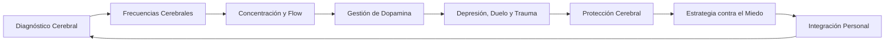
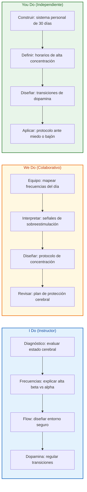
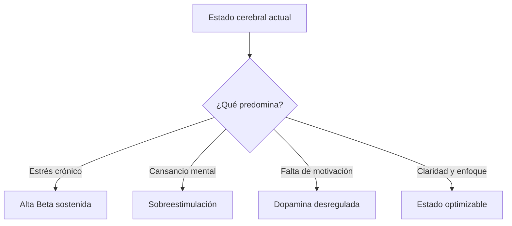

## ¿Qué vas a aprender

En este contenido desarrollarás una comprensión práctica del cerebro y cómo entrenarlo para vivir y trabajar mejor:

- Diagnosticar tu estado cerebral actual y reconocer señales de sobreestimulación o agotamiento
- Entender las frecuencias cerebrales y cómo pasar del estrés a la concentración y el flow
- Diseñar entornos sensoriales que faciliten la concentración profunda
- Regular la dopamina para mantener motivación sostenida sin caer en vacío post-logro
- Procesar depresión, duelo y trauma desde una mirada neurocientífica y humana
- Proteger tu cerebro de sustancias y hábitos que dificultan la neuroplasticidad
- Redireccionar el miedo colocando una ilusión más grande que lo supere
- Construir un sistema personal de optimización cerebral de 30 días


# MASTERCLASS: Neurociencia Aplicada — Optimiza tu Cerebro para la Productividad y el Bienestar con Ana Ibáñez

## INTRODUCCIÓN: POR QUÉ ESTA MASTERCLASS ES DIFERENTE

La mayoría de los consejos de productividad tratan al cerebro como si fuera una máquina que solo necesita más disciplina, más café y menos distracciones. Esta masterclass propone otra cosa: entender al cerebro como un sistema biológico que puede entrenarse, regularse y protegerse.

En este episodio de Creadores Podcast, Daniel entrevista a Ana Ibáñez, neurocientífica y directora de Mind Studio. Su enfoque no es teórico: trabaja con personas que buscan mejorar su bienestar emocional, su rendimiento cognitivo y su calidad de vida usando herramientas basadas en neurociencia.

El cerebro funciona como una radio con distintas frecuencias. Cuando estás en alta beta, estás en modo supervivencia: alerta, estrés, ruido mental. Cuando bajas a beta o alpha, puedes concentrarte, crear y entrar en flow. Aprender a moverte entre estas frecuencias es una habilidad entrenable.

La concentración no es solo fuerza de voluntad. Depende del entorno sensorial: la música, los olores, la luz, el diálogo interno y la sensación de seguridad. Un cerebro amenazado no puede rendir bien.

La dopamina es el motor de la motivación, pero la sobreestimulación la destruye. Cuando saltas de una tarea intensa a otra sin transición, caes en un vacío que confundes con cansancio o falta de propósito.

La depresión y el duelo no son simples estados de ánimo. Son reconfiguraciones neurales que requieren comprensión, tiempo y herramientas adecuadas. El cerebro necesita sentido, propósito y conexión para funcionar bien.

> **Objetivo de Aprendizaje** — Al final de esta guía, podrás diagnosticar tu estado cerebral, gestionar tus frecuencias cerebrales, optimizar tu concentración, regular tu dopamina, procesar estados emocionales difíciles y proteger la regeneración cerebral.

> **Advertencia educativa** — Este contenido es formativo y divulgativo. No sustituye evaluación ni tratamiento médico, psicológico o psiquiátrico profesional. Si experimentas depresión, duelo, trauma o síntomas persistentes, busca ayuda especializada.

---

## MAPA DEL WORKFLOW DE OPTIMIZACIÓN CEREBRAL



| Fase | Pregunta que responde | Output principal |
|------|-----------------------|------------------|
| **Diagnóstico Cerebral** | ¿En qué estado está mi cerebro hoy? | Autoevaluación de estado cerebral |
| **Frecuencias Cerebrales** | ¿En qué frecuencia opero más tiempo? | Mapa de alta beta, beta y alpha |
| **Concentración y Flow** | ¿Cómo entro en estado óptimo de productividad? | Protocolo de entorno sensorial |
| **Gestión de Dopamina** | ¿Cómo mantengo motivación sin sobreestimularme? | Auditoría y ciclos de dopamina |
| **Depresión, Duelo y Trauma** | ¿Cómo proceso estados emocionales profundos? | Protocolo de acompañamiento |
| **Protección Cerebral** | ¿Qué daña mi capacidad cerebral? | Plan de protección de neuroplasticidad |
| **Estrategia contra el Miedo** | ¿Cómo redirijo la energía del miedo? | Ilusión o propósito más grande |
| **Integración Personal** | ¿Cómo vivo esto en los próximos 30 días? | Sistema personalizado de optimización |



---

## PARTE 1: DIAGNÓSTICO CEREBRAL — ¿EN QUÉ ESTADO ESTÁ TU CEREBRO HOY?

### 1.1 Principio Central

El entrenamiento cerebral comienza por entender el estado actual. No puedes optimizar lo que no diagnosticas. Ana Ibáñez trabaja con tres grandes áreas: bienestar emocional, alto rendimiento y casos clínicos. Pero antes de aplicar cualquier técnica, lo primero es preguntarse: ¿cómo está mi cerebro hoy?

Un cerebro sobrecargado no aprende bien. Un cerebro amenazado no crea. Un cerebro agotado no decide. Por eso el diagnóstico no es un lujo: es el primer paso del entrenamiento.



### 1.2 Áreas de trabajo del cerebro

| Área | Indicadores de buen estado | Indicadores de alerta |
|------|---------------------------|----------------------|
| **Bienestar emocional** | Estabilidad, resiliencia, conexión | Ansiedad crónica, irritabilidad, aislamiento |
| **Alto rendimiento** | Concentración, memoria, creatividad | Dispersión, olvidos, bloqueo mental |
| **Regulación del sueño** | Descanso reparador, energía estable | Insomnio, somnolencia diurna, despertares |
| **Motivación** | Entusiasmo sostenido, metas claras | Vacío post-logro, procrastinación |
| **Procesamiento emocional** | Capacidad de sentir y transitar | Numbing, evitación, sobreactivación |
| **Neuroplasticidad** | Aprendizaje, adaptación, recuperación | Rigidez, dificultad para cambiar hábitos |

### 1.3 Autoevaluación de estado cerebral

Responde con honestidad en una escala de 1 a 5, donde 1 es "nunca" y 5 es "siempre".

```text
□ Me cuesta concentrarme incluso en tareas que me interesan.
□ Termino el día mentalmente agotado.
□ Me cuesta desconectar del trabajo o de las pantallas.
□ Siento que mi mente está constantemente acelerada.
□ Pierdo la motivación rápidamente después de lograr algo.
□ Tengo dificultades para dormir o descansar bien.
□ Me siento ansioso o tenso sin una causa clara.
□ Uso alcohol o sustancias para relajarme con frecuencia.
□ Evito sentimientos difíciles distrayéndome.
□ Siento que no tengo un propósito claro en mi día a día.
```

### 1.4 I Do — Evaluar el estado cerebral

**Objetivo:** obtener una primera lectura del estado actual.

| Paso | Acción | Resultado |
|------|--------|-----------|
| 1 | Responder la autoevaluación | Puntuación por área |
| 2 | Sumar los puntos | Estado general |
| 3 | Identificar las áreas más bajas | Prioridad de intervención |
| 4 | Elegir una acción de cuidado inmediata | Primer paso |

### 1.5 We Do — Interpretar un caso

**Caso:** una persona duerme mal, trabaja con múltiples pantallas y termina los días agotada pero sin sentir que avanza.

| Síntoma | Lectura | Intervención inicial |
|---------|---------|----------------------|
| Mente acelerada | Alta beta crónica | Pausas de respiración y reducción de estímulos |
| Agotamiento sin avance | Dispersión de atención | Bloques de concentración profunda |
| Dificultad para dormir | Sobreestimulación nocturna | Rutina de cierre sin pantallas |

### 1.6 You Do — Tu diagnóstico inicial

Completa:

```text
Mi puntuación total en la autoevaluación fue: ______________________________

El área más baja fue: _____________________________________________________

Esto se manifiesta en mi día a día así: ____________________________________

Una acción de cuidado cerebral que puedo hacer hoy es: _____________________
```

---

## PARTE 2: LAS FRECUENCIAS CEREBRALES — LA RADIO INTERIOR

### 2.1 Principio Central

El cerebro funciona como una radio con distintas frecuencias. Cada frecuencia corresponde a un estado diferente: alerta, concentración, relajación, sueño o meditación profunda. No existe una frecuencia "mala". El problema es quedarse atrapado en una sola, especialmente en la de supervivencia.

La alta beta es la frecuencia del estrés, la alerta excesiva y el ruido mental. Es útil para reaccionar ante peligros, pero destructiva cuando se sostiene en el tiempo. La beta y la low beta permiten el pensamiento analítico y la planificación. El alpha aparece en la relajación consciente, la creatividad y la meditación ligera.

### 2.2 High Beta vs. Alpha / Beta / Low Beta

| Frecuencia | Estado | Cuándo es útil | Cuándo es perjudicial |
|------------|--------|----------------|----------------------|
| **High Beta** | Estrés, supervivencia, ruido mental | Emergencias reales | Vivir aquí produce ansiedad y agotamiento |
| **Beta** | Pensamiento activo, resolución de problemas | Trabajo intelectual | Exceso produce tensión mental |
| **Low Beta** | Concentración tranquila, enfoque sostenido | Tareas complejas | - |
| **Alpha** | Relajación consciente, creatividad, flow | Descanso activo, meditación | En exceso puede reducir alerta |
| **Theta** | Imaginación, memorias, estados profundos | Creatividad, sanación | Puede traer material emocional no procesado |
| **Delta** | Sueño profundo, regeneración | Recuperación física y mental | - |

### 2.3 Mapa de frecuencias en el día

```text
MAÑANA
□ Me despierto en alta beta (ansioso, revisando el celular)
□ Me despierto en alpha/beta (relajado pero listo)

TRABAJO
□ Opero mayormente en alta beta (estresado)
□ Opero en low beta (concentrado)
□ Tengo momentos de alpha (creativo, relajado)

NOCHE
□ Termino el día en alta beta (no puedo parar)
□ Paso a alpha sin dificultad
□ Llego a theta/delta para dormir
```

### 2.4 I Do — Identificar tu frecuencia dominante

**Objetivo:** reconocer en qué frecuencia pasas más tiempo.

| Paso | Acción | Resultado |
|------|--------|-----------|
| 1 | Revisar el mapa de frecuencias | Conciencia |
| 2 | Elegir tres momentos del día | Material |
| 3 | Asignar una frecuencia a cada uno | Diagnóstico |
| 4 | Identificar dónde te quedas atrapado | Prioridad |

### 2.5 We Do — Diseñar transiciones de frecuencia

**Caso:** una persona pasa todo el día en alta beta y no puede dormir.

| Momento | Frecuencia actual | Transición |
|---------|-------------------|------------|
| Despertar | Alta beta | 5 minutos de respiración antes del celular |
| Trabajo | Alta beta | Música de 60 BPM, ambiente ordenado |
| Tarde | Alta beta | Paseo sin pantallas |
| Noche | Alta beta | Luz tenue, lectura, rutina de cierre |

### 2.6 You Do — Tu mapa de frecuencias

Completa:

```text
La frecuencia en la que paso más tiempo es: ________________________________

Esto se manifiesta en: ____________________________________________________

Un momento del día en que quiero bajar la frecuencia es: ____________________

La transición que probaré es: _____________________________________________
```

---

## PARTE 3: CONCENTRACIÓN Y FLOW — EL ESTADO ÓPTIMO DE PRODUCTIVIDAD

### 3.1 Principio Central

El flow requiere un entorno seguro y un mínimo de ruido mental. No es solo fuerza de voluntad. El cerebro necesita sentirse a salvo para entrar en estado de concentración profunda. Si hay amenaza real o percibida, el sistema se queda en alta beta y no puede acceder al flow.

Ana Ibáñez destaca que las entradas sensoriales regulan las frecuencias cerebrales. La música, los olores, la luz, la temperatura y el diálogo interno pueden ayudar o impedir la concentración.

### 3.2 Entradas sensoriales que regulan frecuencias

| Entrada sensorial | Efecto en el cerebro | Ejemplo práctico |
|-------------------|----------------------|------------------|
| **Música** | Ritmo de 50-70 BPM favorece alpha y flow | Música clásica, ambient, binaural |
| **Olor** | El sistema olfativo conecta directamente con la amígdala | Lavanda para calma, cítricos para alerta suave |
| **Luz** | Luz azul estimula, luz cálida relaja | Luz tenue para concentración profunda |
| **Diálogo interno** | Palabras amenazantes activan alta beta | Autoinstrucciones de seguridad y capacidad |
| **Postura** | Tensión corporal aumenta alerta | Posición erguida y relajada |
| **Orden del espacio** | Caos visual aumenta carga cognitiva | Espacio limpio y libre de distracciones |

### 3.3 Protocolo de flow de 5 minutos

```text
MINUTO 1: Preparar el entorno
- Apagar notificaciones.
- Colocar solo lo necesario sobre la mesa.
- Ajustar luz y temperatura.

MINUTO 2: Elegir el estímulo sensorial
- Poner música de 60 BPM o sonidos binaurales.
- Opcional: aroma suave.

MINUTO 3: Definir la tarea única
- Escribir en una hoja la tarea específica de este bloque.

MINUTO 4: Respirar y asegurar
- Tres respiraciones profundas.
- Decir en silencio: "Estoy a salvo, puedo concentrarme."

MINUTO 5: Empezar
- Trabajar sin cambiar de tarea durante el bloque.
```

### 3.4 I Do — Preparar un bloque de concentración

**Objetivo:** crear las condiciones mínimas para entrar en flow.

| Paso | Acción | Resultado |
|------|--------|-----------|
| 1 | Elegir una tarea única | Claridad |
| 2 | Preparar el entorno físico | Reducción de distracciones |
| 3 | Elegir música o silencio | Regulación sensorial |
| 4 | Respirar y asegurar | Cambio de frecuencia |
| 5 | Trabajar 25-50 minutos sin interrupciones | Bloque de flow |

### 3.5 We Do — Rediseñar un espacio de trabajo

**Caso:** una persona trabaja en su habitación con el celular al lado y la TV de fondo.

| Elemento | Estado actual | Rediseño |
|----------|---------------|----------|
| Celular | Sobre la mesa | En otra habitación o en modo concentración |
| TV | Encendida | Apagada o en otro ambiente |
| Iluminación | Luz fría general | Luz cálida dirigida |
| Música | Sin control | Playlist de concentración |
| Escritorio | Desordenado | Solo lo necesario |

### 3.6 You Do — Tu protocolo de flow

Completa:

```text
La tarea en la que más necesito concentrarme es: ___________________________

Mi principal distracción actual es: ________________________________________

La música o sonido que me ayuda a concentrarme es: _________________________

El entorno que voy a preparar es: __________________________________________

Mi bloque de concentración será de: ________________________________________ minutos.
```

---

## PARTE 4: GESTIÓN DE DOPAMINA — EL MOTOR DE LA MOTIVACIÓN SOSTENIBLE

### 4.1 Principio Central

La dopamina es el neurotransmisor de la motivación, el deseo y la recompensa. Es el motor que te impulsa a perseguir metas. Pero la sobreestimulación moderna —redes sociales, notificaciones, azúcar, alcohol, compras— desgasta este sistema y genera ciclos de vacío.

Un problema común es terminar una tarea intensa y lanzarse inmediatamente a otra estimulación. Esa transición brusca produce un bajón que se siente como falta de propósito o agotamiento. La clave está en regular las transiciones.

### 4.2 Ciclos de dopamina saludables vs. sobreestimulación

| Ciclos saludables | Sobreestimulación |
|-------------------|-------------------|
| Metas pequeñas con descansos | Metas enormes sin pausa |
| Recompensas que fortalecen el cuerpo | Recompensas que lo dañan |
| Transiciones conscientes entre tareas | Saltos de una estimulación a otra |
| Reconocimiento del logro antes de seguir | Inmediata búsqueda del siguiente hit |
| Trabajo profundo como fuente de satisfacción | Dopamina rápida desde notificaciones |
| Sueño, movimiento y nutrición | Alcohol, azúcar y pantallas |

### 4.3 Auditoría de dopamina personal

```text
□ Reviso el celular antes de levantarme.
□ Consulto redes sociales más de 5 veces al día.
□ Termino una tarea y abro inmediatamente otra pantalla.
□ Como azúcar o ultraprocesados como recompensa.
□ Consumo alcohol para relajarme varias veces por semana.
□ Compro cosas para sentirme mejor.
□ Me cuesta disfrutar actividades sin estímulo externo.
□ Siento vacío después de lograr algo.
□ Necesito cada vez más estimulación para sentirme bien.
□ Mis descansos consisten en más pantallas.
```

### 4.4 I Do — Identificar un ciclo de dopamina dañino

**Objetivo:** reconocer un patrón de sobreestimulación.

| Paso | Acción | Resultado |
|------|--------|-----------|
| 1 | Revisar la auditoría | Conciencia |
| 2 | Elegir el hábito más frecuente | Foco |
| 3 | Anotar cuándo aparece | Disparador |
| 4 | Definir una alternativa más sana | Sustitución |

### 4.5 We Do — Rediseñar una transición

**Caso:** una persona termina una reunión difícil y abre Instagram para "descansar".

| Momento | Acción actual | Efecto | Acción alternativa |
|---------|---------------|--------|--------------------|
| Post-reunión | Abrir Instagram | Sobreestimulación, culpa | 5 minutos de respiración o caminata |
| Logro importante | Comprar algo online | Vacío después | Celebrar con movimiento o compartirlo |
| Noche | Serie + vino | Dopamina rápida, sueño malo | Lectura + té + rutina de cierre |

### 4.6 You Do — Tu gestión de dopamina

Completa:

```text
Mi principal fuente de dopamina rápida es: _________________________________

Aparece cuando: __________________________________________________________

El efecto que me produce después es: _______________________________________

Una alternativa más sostenible que probaré es: _____________________________

Mi ritual de transición entre tareas será: __________________________________
```

---

## PARTE 5: DEPRESIÓN, DUELO Y TRAUMA — NEUROCIENCIA DEL DOLOR EMOCIONAL

### 5.1 Principio Central

La depresión, desde una mirada neurocientífica, puede entenderse como hipoactividad en ciertos circuitos cerebrales, muchas veces ligada a falta de propósito, conexión o sentido. No es solo "tristeza". Es una reorganización profunda del sistema nervioso.

El duelo es una reconfiguración neuronal. Cuando perdemos algo o a alguien, el cerebro debe actualizar mapas internos que aún esperan lo que ya no está. Eso duele, pero es parte del proceso de sanación.

El trauma queda grabado cuando una experiencia abrumadora no pudo ser procesada. El sistema nervioso queda atrapado en respuestas de supervivencia que ya no corresponden al presente.

### 5.2 Herramientas de intervención según el caso

| Situación | Lo que necesita el cerebro | Herramientas |
|-----------|----------------------------|--------------|
| **Depresión leve** | Propósito, movimiento, conexión | Rutina, ejercicio, conversación, luz solar |
| **Depresión moderada** | Apoyo estructurado | Terapia, posible evaluación médica, hábitos reguladores |
| **Depresión severa** | Intervención profesional | Psicoterapia y/o tratamiento psiquiátrico |
| **Duelo normal** | Tiempo, ritual, expresión | Hablar del duelo, honrar la pérdida, no forzar cierre |
| **Duelo complicado** | Apoyo terapéutico | Terapia especializada en duelo |
| **Trauma** | Seguridad, procesamiento, integración | Terapia trauma-informada, técnicas de regulación |

### 5.3 Protocolo de acompañamiento emocional

```text
PARA UNO MISMO
1. Nombrar lo que siento sin juzgarlo.
2. Recordar que el dolor tiene una función neurobiológica.
3. No forzarme a "estar bien" rápido.
4. Mantener rutinas mínimas de cuidado.
5. Pedir ayuda si el dolor persiste o impide funcionar.

PARA ACOMPAÑAR A OTRO
1. Escuchar sin intentar arreglar.
2. Validar lo que siente.
3. No comparar con otras experiencias.
4. Ofrecer presencia, no soluciones.
5. Sugerir ayuda profesional si es necesario.
```

### 5.4 I Do — Reconocer señales de alerta

**Objetivo:** distinguir entre tristeza normal y señales que requieren apoyo.

| Señal | Interpretación | Acción |
|-------|----------------|--------|
| Tristeza puntual | Respuesta adaptativa | Acompañar con presencia |
| Tristeza persistente > 2 semanas | Posible depresión | Consultar profesional |
| Pérdida de interés en todo | Hipoactividad de circuitos de recompensa | Evaluación y apoyo |
| Aislamiento social | Riesgo de agravamiento | Buscar conexión y ayuda |
| Pensamientos de muerte | Emergencia | Buscar ayuda inmediata |

### 5.5 We Do — Acompañar a alguien en duelo

**Caso:** un amigo perdió a un ser querido.

| Qué no decir | Qué sí decir |
|----------------|--------------|
| "Ya pasará" | "Estoy acá con vos" |
| "Tenés que ser fuerte" | "Sentite como te sentís" |
| "A mí también me pasó" | "Quería saber cómo estás" |
| "Es mejor así" | "No tengo palabras, pero te acompaño" |

### 5.6 You Do — Tu protocolo emocional

Completa:

```text
Un estado emocional difícil que estoy transitando es: ______________________

Lo que mi cuerpo y mente necesitan en este momento es: _____________________

Una rutina mínima de cuidado que puedo mantener es: _______________________

La persona o recurso profesional al que puedo acudir es: ____________________

Una frase que me recuerde que el dolor tiene sentido neurobiológico:
__________________________________________________________________________
```

---

## PARTE 6: FACTORES QUE DAÑAN EL CEREBRO — ALCOHOL Y MALOS HÁBITOS

### 6.1 Principio Central

El cerebro tiene capacidad de regeneración, pero ciertos hábitos dificultan la neuroplasticidad. Ana Ibáñez destaca el alcohol como una sustancia que interfiere especialmente con la regeneración cerebral y la calidad del sueño.

El sueño es el momento en que el cerebro limpia residuos, consolida memorias y restaura funciones. El alcohol puede ayudar a conciliar el sueño, pero fragmenta las fases profundas y reduce la calidad de la regeneración.

### 6.2 Impacto de sustancias y hábitos vs. neuroplasticidad

| Hábito o sustancia | Efecto en el cerebro | Impacto en neuroplasticidad |
|--------------------|----------------------|------------------------------|
| **Alcohol frecuente** | Altera neurotransmisores, fragmenta sueño | Reduce regeneración y aprendizaje |
| **Sueño insuficiente** | Acumulación de toxinas, menor consolidación | Dificulta cambios duraderos |
| **Azúcar excesiva** | Inflamación, picos de glucosa | Afecta memoria y atención |
| **Sedentarismo** | Menor irrigación cerebral | Reduce factor neurotrófico |
| **Estrés crónico** | Cortisol elevado, amígdala hiperactiva | Dificulta aprendizaje y memoria |
| **Multitarea constante** | Fragmentación atencional | Disminuye capacidad de concentración profunda |
| **Aislamiento social** | Menor estimulación cognitiva y emocional | Acelera deterioro cognitivo |

### 6.3 Protocolo de protección cerebral

```text
SUEÑO
- Horario de acostarse y levantarse regular.
- Evitar alcohol y pantallas al menos 2 horas antes de dormir.
- Ambiente oscuro, fresco y silencioso.

MOVIMIENTO
- Mínimo 20 minutos de actividad física diaria.
- Preferir actividades que también relajen la mente.

NUTRICIÓN
- Reducir azúcares refinados y ultraprocesados.
- Hidratarse adecuadamente.
- Incluir grasas saludables y antioxidantes.

MENTAL
- Bloques de concentración profunda.
- Pausas conscientes entre tareas.
- Prácticas de respiración o meditación.

SOCIAL
- Mantener contacto regular con personas significativas.
- Pedir ayuda cuando se necesita.
```

### 6.4 I Do — Evaluar un hábito dañino

**Objetivo:** reconocer un hábito que está afectando la neuroplasticidad.

| Paso | Acción | Resultado |
|------|--------|-----------|
| 1 | Revisar la tabla de impacto | Conciencia |
| 2 | Elegir el hábito más frecuente | Foco |
| 3 | Anotar cuándo y por qué aparece | Disparador |
| 4 | Definir un reemplazo pequeño | Acción |

### 6.5 We Do — Rediseñar una noche

**Caso:** una persona bebe vino todas las noches para relajarse y duerme mal.

| Elemento | Hábito actual | Rediseño |
|----------|---------------|----------|
| Cena | Pesada, con alcohol | Ligera, sin alcohol 2 horas antes de dormir |
| Post-cena | Serie en pantalla | Lectura o conversación |
| Bebida | Vino | Té de hierbas o agua con limón |
| Habitación | Luz azul, celular cerca | Luz tenue, celular fuera |
| Resultado | Sueño fragmentado | Sueño más reparador |

### 6.6 You Do — Tu plan de protección cerebral

Completa:

```text
El hábito que más afecta mi cerebro actualmente es: _________________________

Aparece en este momento: __________________________________________________

Un reemplazo más saludable es: ____________________________________________

Mi compromiso de sueño esta semana será: ___________________________________

Mi compromiso de movimiento será: _________________________________________
```

---

## PARTE 7: ESTRATEGIA CONTRA EL MIEDO — COLOCAR UNA ILUSIÓN MÁS GRANDE

### 7.1 Principio Central

Ante cualquier miedo, la estrategia es colocar una ilusión o propósito más grande que lo redireccione. El miedo es una respuesta del sistema nervioso ante una amenaza percibida. No se elimina con razones: se reorganiza con una dirección más poderosa.

Cuando el cerebro tiene una ilusión clara, el miedo deja de ser el protagonista. No desaparece, pero se convierte en una señal que acompaña la acción, no en una orden de paralización.

### 7.2 Miedo vs. ilusión como reguladores cerebrales

| Miedo | Ilusión |
|-------|---------|
| Activa amígdala y alta beta | Activa sistema de recompensa y motivación |
| Enfoca en lo que puede salir mal | Enfoca en lo que puede construirse |
| Genera contracción | Genera expansión |
| Pregunta "¿qué pierdo?" | Pregunta "¿qué puedo crear?" |
| Paraliza o precipita | Orienta y sostiene |
| Se alimenta de amenaza | Se alimenta de propósito |

### 7.3 Protocolo de redirección del miedo

```text
PASO 1: NOMBRAR EL MIEDO
"Tengo miedo de ________________________________________."

PASO 2: UBICARLO EN EL CUERPO
"Lo siento en __________________________________________."

PASO 3: PREGUNTAR QUÉ PROTEGE
"Este miedo intenta protegerme de _________________________."

PASO 4: COLOCAR UNA ILUSIÓN MÁS GRANDE
"Lo que más quiero crear es ______________________________."

PASO 5: DEFINIR EL PRIMER PASO
"El siguiente paso hacia eso es ___________________________."

PASO 6: ACTUAR CON EL MIEDO PRESENTE
"Puedo sentir miedo y seguir avanzando."
```

### 7.4 I Do — Redireccionar un miedo concreto

**Objetivo:** transformar el miedo en dirección.

| Paso | Acción | Resultado |
|------|--------|-----------|
| 1 | Escribir el miedo | Claridad |
| 2 | Ubicarlo en el cuerpo | Conciencia somática |
| 3 | Reconocer qué protege | Compasión |
| 4 | Escribir una ilusión más grande | Dirección |
| 5 | Definir un primer paso | Acción |

### 7.5 We Do — Analizar un caso de miedo

**Caso:** una persona quiere cambiar de carrera pero tiene miedo al fracaso.

| Miedo | Ilusión más grande | Primer paso |
|-------|--------------------|-------------|
| Fracaso y quedar expuesto | Construir una vida alineada con sus valores | Investigar una opción en 7 días |
| Perder estabilidad | Tener trabajo con sentido y sustento | Hacer un plan financiero de transición |
| Qué dirán | Vivir con autenticidad | Compartir la idea con una persona de confianza |

### 7.6 You Do — Tu redirección de miedo

Completa:

```text
El miedo que más me frena ahora es: _______________________________________

Lo siento en mi cuerpo así: ______________________________________________

Este miedo intenta protegerme de: _________________________________________

La ilusión o propósito más grande que elijo es: ____________________________

El primer paso que voy a dar es: __________________________________________

Una frase que me acompañe será: ___________________________________________
```

---

## PARTE 8: INTEGRACIÓN Y CIERRE — TU SISTEMA DE OPTIMIZACIÓN CEREBRAL PERSONALIZADO

### 8.1 Resumen del sistema completo

El cerebro es entrenable, pero el entrenamiento debe ser personal y sostenible. El sistema completo se resume así:

1. Diagnosticar el estado cerebral actual.
2. Reconocer en qué frecuencia pasas más tiempo.
3. Diseñar entornos sensoriales para concentración y flow.
4. Regular la dopamina con transiciones conscientes.
5. Procesar estados emocionales difíciles con comprensión.
6. Proteger el cerebro de sustancias y hábitos dañinos.
7. Redireccionar el miedo con una ilusión más grande.

### 8.2 Hoja de ruta de 30 días

| Semana | Enfoque | Acción principal |
|--------|---------|------------------|
| **Semana 1** | Diagnóstico y frecuencias | Completar autoevaluación y mapear frecuencias del día |
| **Semana 2** | Concentración y dopamina | Instalar bloques de flow y una transición saludable |
| **Semana 3** | Protección cerebral | Mejorar sueño, movimiento y reducir alcohol o azúcar |
| **Semana 4** | Miedo e integración | Aplicar protocolo de redirección de miedo y revisar progreso |

### 8.3 Checklist final de integración

```text
□ Conozco mi frecuencia cerebral dominante.
□ Tengo un protocolo de concentración de al menos 25 minutos.
□ Identifiqué mi principal fuente de dopamina rápida.
□ Definí una transición saludable entre tareas intensas.
□ Tengo una rutina de cuidado emocional.
□ Estoy protegiendo mi sueño de pantallas y alcohol.
□ Aplico el protocolo de redirección de miedo.
□ Reviso mi progreso una vez por semana.
```

---

## CHECKLIST FINAL DE DOMINIO

| Bloque | Check |
|--------|-------|
| Diagnóstico Cerebral | Puedo evaluar mi estado cerebral y reconocer señales de alerta |
| Frecuencias Cerebrales | Entiendo la diferencia entre alta beta, beta, low beta y alpha |
| Concentración y Flow | Puedo diseñar un entorno sensorial para concentrarme |
| Gestión de Dopamina | Identifico ciclos de sobreestimulación y regulo transiciones |
| Depresión, Duelo y Trauma | Reconozco cuándo necesito ayuda y cómo acompañar a otros |
| Protección Cerebral | Reduzco hábitos que dañan la neuroplasticidad |
| Estrategia contra el Miedo | Sé colocar una ilusión más grande que redireccione el miedo |
| Integración Personal | Tengo un sistema de 30 días para optimizar mi cerebro |

---

## Preguntas de Verificación 📝

Responde cada pregunta basándote en los conceptos de esta master class. Escribe tus respuestas o compártelas para profundizar tu aprendizaje.

1. **Aplica**: Si te despiertas todos los días en alta beta, ¿qué tres cambios harías en los primeros 30 minutos del día?

2. **Analiza**: ¿Por qué el alcohol puede ayudar a conciliar el sueño pero dañar la calidad de la regeneración cerebral?

3. **Diseña**: Crea un entorno sensorial óptimo para una sesión de concentración profunda de 45 minutos.

4. **Reflexiona**: ¿Qué relación hay entre falta de propósito y depresión desde una mirada neurocientífica?

5. **Calcula**: Si reduces 30 minutos diarios de redes sociales, ¿cuántas horas recuperas en una semana? ¿En qué podrías usarlas?

6. **Evalúa**: ¿Qué fuente de dopamina rápida tiene más costo emocional en tu vida actual? ¿Qué alternativa sostenible propones?

7. **Conecta**: Explica cómo la gestión del sueño impacta la concentración, la motivación y el procesamiento emocional.

8. **Propón**: Diseña un protocolo de transición entre una tarea intensa y el descanso, evitando la sobreestimulación.

9. **Sintetiza**: Resume en una frase tu sistema personal de optimización cerebral.

10. **Reflexión final**: De los siete bloques del workflow, ¿cuál consideras el más urgente para tu cerebro hoy y por qué?

## GLOSARIO RÁPIDO

| Término | Definición |
|---------|------------|
| **Neuroplasticidad** | Capacidad del cerebro para reorganizarse formando nuevas conexiones neuronales |
| **Alta beta** | Frecuencia cerebral asociada al estrés, la alerta excesiva y el ruido mental |
| **Alpha** | Frecuencia cerebral asociada a la relajación consciente, la creatividad y el flow |
| **Flow** | Estado óptimo de concentración profunda donde el desafío y la habilidad están equilibrados |
| **Dopamina** | Neurotransmisor clave en la motivación, el deseo y la sensación de recompensa |
| **Amígdala** | Estructura cerebral involucrada en la respuesta emocional, especialmente al miedo |
| **Corteza prefrontal** | Región cerebral responsable de la planificación, el juicio y el control ejecutivo |
| **Hipoactividad** | Disminución de la actividad cerebral en ciertas áreas, asociada a estados como la depresión |
| **Trauma** | Experiencia abrumadora que queda grabada en el sistema nervioso sin poder procesarse |
| **Duelo** | Proceso de reconfiguración neuronal y emocional ante una pérdida significativa |
| **Neurotransmisor** | Sustancia química que transmite señales entre neuronas |
| **Mindfulness** | Práctica de atención plena y consciente al momento presente |
| **Sistema nervioso simpático** | Rama del sistema nervioso que activa la respuesta de lucha o huida |
| **Sistema nervioso parasimpático** | Rama del sistema nervioso que promueve la relajación y la recuperación |
| **Neurociencia aplicada** | Uso de los conocimientos del cerebro para mejorar la vida cotidiana y el rendimiento |
