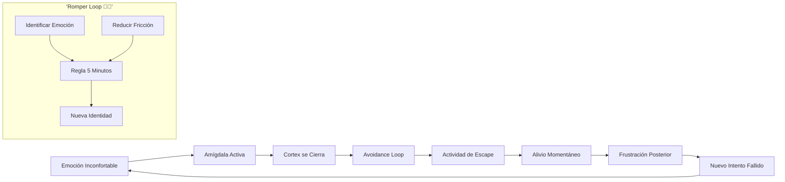
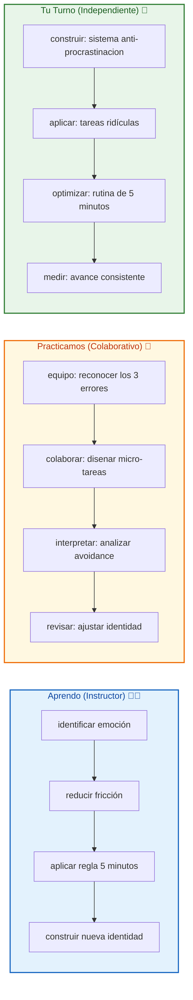

# 🧠 MASTERCLASS: La Neurociencia de la Procrastinación — Cómo Romper el Bucl​e de Evitación 🔥

## 🎯 INTRODUCCIÓN: POR QUÉ ESTE MASTERCLASS ES DIFERENTE 💡

La mayoría cree que la procrastinación es falta de disciplina o mala organización. Pero el cerebro humano no es un robot que necesite mejor gestión del tiempo. Es un sistema de supervivencia que **huye del malestar emocional**.

Este masterclass propone un camino distinto: **entender la procrastinación como respuesta neuronal al malestar**, no como falla de carácter. Cuando comprendes el mecanismo emocional, puedes intervenir con precisión.

> **🎯 Objetivo de Aprendizaje** — Al final de esta guía, identificarás los 3 errores que bloquean tu avance, comprenderás el neuro-circuito del avoidance loop y tendrás un método basado en terapia cognitivo-conductual para empezar cualquier tarea sin resistencia emocional.

> **⚠️ Advertencia formativa** — Este contenido es educativo. Romper hábitos emocionales requiere práctica constante. Ningún concepto reemplaza la aplicación consciente de los ejercicios.

---

## 🗺️ MAPA DEL WORKFLOW DE ROMPER LA PROCRASTINACIÓN 🗺️🚀



| Fase 🎯 | Pregunta que responde ❓ | Output principal 🎯 |
|--------|-----------------------|------------------|
| **Emoción Inconfortable** 🎭 | ¿Qué siento realmente? | Claridad emocional |
| **Amígdala Activa** ⚠️ | ¿Por qué me advierte el cerebro? | Identificación del miedo |
| **Cortex se Cierra** 🧊 | ¿Por qué no actúo? | Reconocimiento del shutdown |
| **Avoidance Loop** 🔁 | ¿Cómo funciona el escape? | Mapa del ciclo |
| **Actividad de Escape** 📱 | ¿A qué me escapo? | Identificación de distracciones |
| **Alivio Momentáneo** 😊 | ¿Qué gano al escapar? | Entendimiento del refuerzo |
| **Frustración Posterior** 😞 | ¿Qué pierdo después? | Motivación para cambio |
| **Nuevo Intento Fallido** 🔄 | ¿Cómo evitar el ciclo? | Sistema de interrupción |

---



---

## 🧠 PARTE 1: POR QUÉ NO PUEDES AVANZAR (0:31 - 4:59) 🧠✨

### 1.1 🧠 La procrastinación es un problema emocional, no de tiempo

"La procrastinación no es falta de talento ni vagancia. Es una respuesta emocional de tu cerebro." — Álvaro Hernández Jarque

Cuando enfrentas una tarea difícil, tu cerebro siente **ansiedad**, **miedo al fracaso**, **incomodidad**. Para aliviar esa emoción, activa el **"camino bajo"** descubierto por Joseph LeDoux: un circuito neuronal rápido que prioriza el escape sobre la lógica.

### 1.2 🔁 El bucle de evitación explicado

```
😱 Tarea difícil → 😰 Emoción negativa → 🏃‍♂️ Búsqueda de alivio → 📱 Actividad de escape → 😊 Alivio momentáneo → 😞 Culpa/frustración → 🔁 Vuelve a empezar
```

Este loop es el mecanismo neuronal de la procrastinación. Cada escape refuerza el hábito de evitar, haciendo más automático el patrón.

### 1.3 📊 Desglose del bucle de evitación

| Etapa 🎯 | Emoción 🧠 | Acción típica 🔄 |
|---------|------------|-----------------|
| Tarea difícil | Ansiedad, miedo | Evita o pospone |
| Búsqueda de alivio | Malestar creciente | Busca distracción |
| Actividad de escape | Dopamina rápida | Redes sociales, videos |
| Alivio momentáneo | Alivio temporal | Sensación de "descanso" |
| Culpa posterior | Frustración | "Debería haber hecho más" |

### 1.4 🛠️ Ejercicio: mapear tu avoidance loop

```
🔁 Mapeo personal:
1. Tarea que evito: ________________
2. Emoción real detrás: ________________
3. Actividad de escape: ________________
4. Refuerzo que recibo: ________________
5. Culpa después: ________________
6. Palabra clave para romper: ________________
```

---

## ⚠️ PARTE 2: LOS 3 ERRORES QUE ARRUINAN TU AVANCE (4:59 - 11:44) ⚠️✨

### 2.1 ❌ Error 1: Creer que necesitas estar "preparado"

"Esperar a la motivación o al momento perfecto es un error: la acción suele preceder a la motivación, no al revés."

**El problema:** El cerebro está buscando excusas para no sentir malestar. Si esperas a sentirte "listo", nunca empezarás.

**Señales de este error:**
| Señal 🎯 | Ejemplo 💬 | Acción ⚡ |
|---------|-----------|---------|
| "Necesito preparación" | "Esperaré al invierno" | Empezar imperfecto |
| "No tengo herramientas" | "Faltan recursos" | Usar lo disponible |
| "No es el momento" | "Después" | Actuar ahora mismo |

### 2.2 ❌ Error 2: El perfeccionismo

"El perfeccionismo se disfraza de estándares altos, pero es miedo a ser juzgado."

**El problema:** El perfeccionismo es un mecanismo de defensa. Si nunca entregas nada, nadie puede juzgarte. Pero el progreso se bloquea al intentar evitar el fracaso.

| Perfeccionismo disfrazado 🚫 | Acción real ✅ |
|------------------------------|---------------|
| "No está listo todavía" | Entregar imperfecto |
| "Debo tener tiempo perfecto" | Usar 10 minutos imperfectos |
| "Nadie puede ver esto" | Compartir borrador |
| "Esperaré a inspiración" | Iniciar sin inspiración |

### 2.3 ❌ Error 3: La procrastinación productiva

"Realizar tareas secundarias para evitar la principal. Esto da una falsa sensación de avance, manteniendo la 'pestaña abierta' del efecto Zeigarnik."

**El problema:** El efecto Zeigarnik (6:49) dice que las tareas incompletas generan tensión mental. Cuando haces tareas secundarias, mantienes viva esa tensión sin resolver la principal.

| Actividad productiva 🚫 | Actividad real ✅ |
|------------------------|-------------------|
| Organizar el email | Trabajar en lo importante |
| Leer sobre el tema | Escribir sobre el tema |
| Preparar el ambiente | Empezar la tarea |
| Optimizar herramientas | Usar herramientas disponibles |

---

## 🔧 PARTE 3: LA SOLUCIÓN — ROMPER EL BUCLE (11:44 - 19:14) 🔧✨

Basado en la terapia cognitivo-conductual de Aaron Beck, el autor propone tres pasos para romper el bucle de evitación.

### 3.1 🔍 Paso 1: Identificar el bucle

"Reconoce qué tarea evitas y, sobre todo, qué emoción te genera. Ponerle nombre ayuda a ganar perspectiva."

**Técnica "Nombrar sin juzgar":**
1. ¿Qué tarea estoy evitando?
2. ¿Qué emoción tengo? (miedo, ansiedad, aburrimiento)
3. Nombra la emoción en voz alta: "Estoy asustado de..."

### 3.2 🐢 Paso 2: Reducir la fricción

"Convierte la tarea en algo 'ridículamente pequeño'. El objetivo no es terminar, es empezar."

**Técnica de tarea ridícula:**
- En vez de "escribir artículo": "escribir 1 oración"
- En vez de "estudiar 2 horas": "leer 1 página"
- En vez de "limpiar casa": "organizar 1 cajón"

### 3.3 ⏱️ Paso 3: La regla de los 5 minutos

"Comprométete a trabajar solo 5 minutos. Esto elimina la presión del resultado y ayuda a construir una nueva identidad basada en la acción constante."

**Cómo aplicar la regla:**
1. Dila en voz alta: "Voy a trabajar 5 minutos en..."
2. Empieza sin juicio de calidad
3. Después de 5 minutos, puedes parar (pero seguramente continuarás)

### 3.4 📊 Tabla de transformación de tareas

| Tarea Grande 🎯 | Tarea Ridícula 🐢 | Tiempo ⏱️ |
|----------------|-------------------|-----------|
| Escribir proyecto completo ✍️ | Escribir 1 oración 📝 | 30 segundos |
| Estudiar para examen 📚 | Leer 1 definición 📖 | 1 minuto |
| Entrenar 1 hora 💪 | Hacer 2 flexiones 🧎 | 30 segundos |
| Limpiar toda la casa 🧹 | Limpiar 1 superficie 🧽 | 1 minuto |
| Llamar cliente difícil ☎️ | Buscar su número 📱 | 1 minuto |

---

## 🎓 PARTE 4: I DO / WE DO / YOU DO — EJERCICIOS PRÁCTICOS 🎓✨

### 4.1 🏫 I Do — Identificar el avoidance loop

| Paso 🚶 | Acción ⚡ | Resultado esperado ✅ |
|------|--------|--------------------|
| 1️⃣ 🎯 | Nombrar emoción actual | "Tengo miedo de..." |
| 2️⃣ 🐢 | Crear micro-tarea | Acción de menos de 2 min |
| 3️⃣ ⏱️ | Aplicar regla 5 minutos | Iniciar sin resistencia |
| 4️⃣ 📊 | Registrar diferencia | Antes vs después del loop |

### 4.2 👥 We Do — Reconocer los 3 errores en equipo

**Tarea colaborativa:** cada integrante comparte:

```
🎭 Diario grupal:
1. ¿Qué error de los 3 cometes más? (preparación/perfeccionismo/procrast. productiva)
2. ¿Qué tarea evitas con cada error?
3. ¿Cuál micro-tarea rompería el patrón?
4. Compañero que verifica ejecución
```

### 4.3 🎯 You Do — Construir sistema anti-procrastinación

**Tarea:** crea tu sistema personal basado en terapia cognitivo-conductual:

| Sistema 🛠️ | Acción ⚡ | Alerta 🔔 |
|------------|---------|----------|
| 🎯 Identificación | Palabra clave para nombrar miedo | Sin palabra en 3 días |
| 🐢 Micro-tarea | Acción ridícula lista para 5 tareas | Sin acción en 1 semana |
| ⏱️ 5 minutos | Compromiso consciente de 5 min | Sin compromiso en 7 días |
| 📊 Registro | Bitácora de bucles rotos | Sin registro en 14 días |

---

## ✅ PARTE 5: CHECKLIST FINAL 🏁✨

| Bloque 🧩 | Check ✅ |
|--------|-------|
| **Emoción identificada** | 🤔 Nombrar emoción sin juicio |
| **Avoidance loop detectado** | 🔁 Interrumpir patrón 3 veces |
| **Error 1 superado** | 🚀 Empezar sin "preparación perfecta" |
| **Error 2 superado** | ✍️ Entregar algo imperfecto |
| **Error 3 superado** | 🎯 Priorizar lo importante sobre lo urgente |
| **Regla 5 minutos aplicada** | ⏱️ 5 micro-sesiones esta semana |
| **Sistema personal** | 📊 Rutina anti-procrastinación |

---

## 📝 PARTE 6: PREGUNTAS DE VERIFICACIÓN 📝✨

Responde cada pregunta basándote en los conceptos de esta master class. Escribe tus respuestas o compártelas para profundizar tu aprendizaje. 📝

### Preguntas sobre el Avoidance Loop

1. **🎯 Aplica**: ¿Qué tarea evitas ahora mismo? ¿Qué emoción real hay detrás? Nombra la emoción en voz alta y escribe una micro-tarea de 2 minutos.

2. **🔍 Analiza**: ¿Has caído en el error de la preparación perfecta esta semana? ¿Qué excusa usaste para no empezar?

### Preguntas sobre los 3 Errores

3. **🎭 Identifica**: ¿Cuál de los 3 errores (preparación, perfeccionismo, procrast. productiva) es tu patrón favorito? Da un ejemplo concreto de este error.

4. **✅ Evalúa**: ¿Has usado la procrastinación productiva recientemente? ¿Qué tarea "útil" fue en realidad una distracción disfrazada?

### Preguntas sobre la Solución

5. **🐢 Diseña**: Toma tu tarea más grande y conviértela en 5 micro-tareas diferentes. ¿Cuál elegirías para empezar ahora?

6. **⏱️ Calcula**: Si aplicas la regla de los 5 minutos a 3 tareas esta semana, ¿cuántas veces crees que continuarás después de esos 5 minutos?

### Preguntas Integradoras

7. **🔗 Conecta**: ¿Cómo está relacionado el perfeccionismo con el miedo al juicio? ¿Por qué el cerebro prefiere evitar a arriesgar?

8. **💡 Propón un sistema**: Diseña un sistema de 10 minutos diarios para detectar y romper el avoidance loop.

---

## 📚 GLOSARIO RÁPIDO 📖✨

| Término 📝 | Definición 📋 |
|---------|------------|
| **Procrastinación** 🕐 | Postergación activa de tareas importantes |
| **Avoidance Loop** 🔁 | Ciclo de escape → alivio → culpa |
| **Camino bajo** ⚡ | Circuito neuronal rápido de Joseph LeDoux |
| **Efecto Zeigarnik** 📋 | Tendencia a recordar tareas incompletas |
| **Perfeccionismo disfrazado** 🎭 | Miedo disfrazado de exigencia |
| **Regla 5 minutos** ⏱️ | Compromiso de 5 min para eliminar presión |
| **Fracción emocional** 😰 | Malestar que activa el escape |
| **Interrupción neuronal** 🧠 | Técnica para romper el loop automático |

---

## 📐 ANEXO: FORMATO IDEAL PARA MASTERCLASS EDUCATIVAS 📐✨

### 📏 Estructura visual recomendada 📏✨

El ancho óptimo 📏 para masterclasses educativas es **60–75 caracteres por línea** 📐.

```css
.article-content {
  font-size: 18px;
  line-height: 1.75;
  max-width: 65ch;
}
```

---

### 🎯 CIERRE PRÁCTICO 🎯✨

| Nivel 📊 | Debes poder hacer ✨ |
|-------|------------------|
| **🏫 I Do** | ✅ Identificar emoción y aplicar regla 5 minutos |
| **👥 We Do** | 🤝 Reconocer los 3 errores en grupo |
| **🎯 You Do** | 🚀 Construir sistema personal anti-procrastinación |

---

## 🎁 RECURSOS ADICIONALES 🎁✨

- 📖 [📚 Álvaro Hernández Jarque - Neurociencia](https://www.alvarohernandezjarque.com)
- 🎥 [🎬 Video original: "La Neurociencia de la Procrastinación"]
- 💻 [💻 Apps: Focus To-Do, Forest, Freedom]
- 🛠️ [🛠️ Libros: "Atomic Habits", "The Now Habit"]

---

**🎉 Felicitaciones! Has completado la masterclass de la neurociencia de la procrastinación. 🧠 Ahora conoces el avoidance loop, los 3 errores que lo alimentan y la solución cognitivo-conductual para empezar sin resistencia emocional. Tu próximo paso: la próxima vez que sientas "no quiero hacer esto", di en voz alta: "Estoy asustado". Luego: "Voy a trabajar 5 minutos". El miedo disminuye con la acción.**