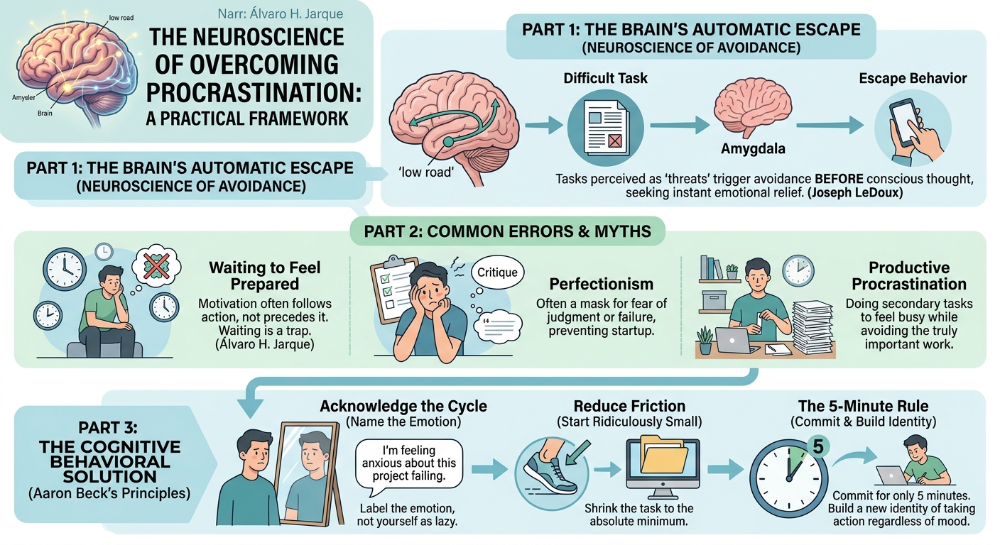
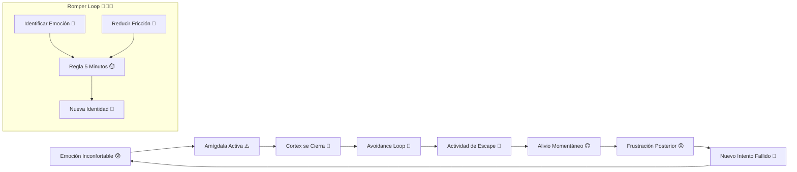
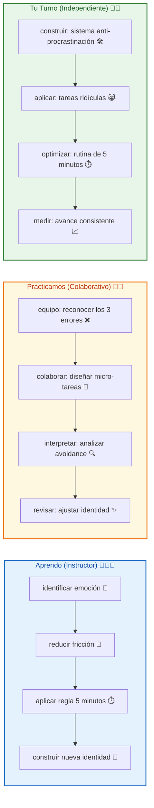
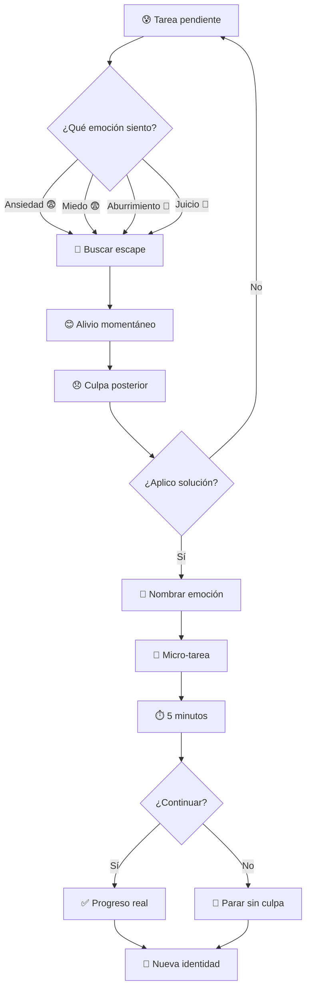

# 🧠🔥 MASTERCLASS: La Neurociencia de la Procrastinación — Rompiendo el Bucle de Evitación ✨🚀

{style="z-index: 1000; position: relative; margin-top: -20px;"}

## 🎯 INTRODUCCIÓN: POR QUÉ ESTE MASTERCLASS ES DIFERENTE 💡🌟

La mayoría de las personas creen que necesitan "mejor planificación" o "más disciplina". Pero cuando tu amígdala detecta una amenaza emocional (fracaso, juicio, esfuerzo), tu cerebro activa el escape ANTES de que tu cortex prefrontal pueda decidir con lógica. ⚡🧠

Este masterclass propone un camino distinto: **entender el bucle neuronal, mapear tus errores cognitivos y aplicar la solución basada en Aaron Beck** para construir acción constante sin resistencia emocional. 🔄✨

> **🎯 Objetivo de Aprendizaje** — Al final de esta guía, podrás: (1) explicar el circuito del "camino bajo" de LeDoux, (2) identificar los 3 errores que perpetúan la procrastinación, (3) aplicar la técnica cognitivo-conductual de nombrar-emociones + micro-tareas + regla 5 minutos, y (4) construir un sistema personal de monitoreo anti-procrastinación.

> **⚠️ Advertencia formativa** — Este contenido es educativo. Romper hábitos emocionales requiere práctica diaria y auto-observación honesta. Ningún concepto reemplaza la aplicación consciente de los ejercicios. 🧘‍♂️📚

---

## 🗺️ MAPA DEL WORKFLOW DE ROMPER LA PROCRASTINACIÓN 🗺️🚀



| Fase 🎯 | Pregunta que responde ❓ | Output principal 🎯 |
|---------|------------------------|---------------------|
| **Emoción Inconfortable** 😰 | ¿Qué siento realmente? | Claridad emocional 💡 |
| **Amígdala Activa** ⚠️ | ¿Por qué me advierte el cerebro? | Identificación del miedo 😨 |
| **Cortex se Cierra** 🧊 | ¿Por qué no actúo? | Reconocimiento del shutdown 🛑 |
| **Avoidance Loop** 🔁 | ¿Cómo funciona el escape? | Mapa del ciclo 🗺️ |
| **Actividad de Escape** 📱 | ¿A qué me escapo? | Identificación de distracciones 📲 |
| **Alivio Momentáneo** 😊 | ¿Qué gano al escapar? | Entendimiento del refuerzo 🍬 |
| **Frustración Posterior** 😞 | ¿Qué pierdo después? | Motivación para cambio 🔥 |
| **Nuevo Intento Fallido** 🔄 | ¿Cómo evitar el ciclo? | Sistema de interrupción 🚧 |



---

## 🧠✨ PARTE 1: POR QUÉ NO PUEDES AVANZAR (0:31 - 4:59) ⏱️🔍

### 1.1 🧠 La procrastinación es un problema EMOCIONAL, no de tiempo ⏰❌

"La procrastinación no es falta de talento ni vagancia. Es una respuesta emocional de tu cerebro." — Álvaro Hernández Jarque 💬

Cuando enfrentas una tarea difícil, tu cerebro siente **ansiedad** 😰, **miedo al fracaso** 😨, **incomodidad** 😣. Para aliviar esa emoción, activa el **"camino bajo"** descubierto por Joseph LeDoux ⚡: un circuito neuronal rápido que prioriza el escape sobre la lógica. 🧠🔁

### 1.2 🔁 El bucle de evitación neuronal explicado 🧠🔄

```
😱 Tarea difícil → 😰 Emoción negativa → 🏃‍♂️ Búsqueda de alivio → 📱 Actividad de escape → 😊 Alivio momentáneo → 😞 Culpa/frustración → 🔁 Vuelve a empezar
```

Este loop es el **mecanismo neuronal de la procrastinación**. 🧠 Cada escape refuerza el hábito de evitar, haciendo más automático el patrón. ⚡

### 1.3 📊 Desglose del bucle de evitación neuronal 📋🔬

| Etapa 🎯 | Emoción 🧠 | Acción típica 🔄 | Neurociencia ⚡ |
|---------|------------|-----------------|----------------|
| Tarea difícil | Ansiedad, miedo 😰😨 | Evita o pospone 🚫 | Amígdala detecta amenaza ⚠️ |
| Búsqueda de alivio | Malestar creciente 📈 | Busca distracción 📱 | Dopamina anticipatoria 🍬 |
| Actividad de escape | Dopamina rápida 🎉 | Redes sociales, videos 📲 | Refuerzo positivo instantáneo ✅ |
| Alivio momentáneo | Alivio temporal 😌 | Sensación de "descanso" 🛋️ | Camino bajo satisfecho ✅ |
| Culpa posterior | Frustración 😞 | "Debería haber hecho más" 😤 | Cortex prefrontal reactivado 🧠 |

### 1.4 🛠️ Ejercicio: mapear TU avoidance loop personal 🎯📝

```
🔁 Mapeo personal del bucle:
1. 🎯 Tarea que evito: ________________
2. 😰 Emoción real detrás: ________________ (miedo, ansiedad, aburrimiento, juicio)
3. 📱 Actividad de escape: ________________ (celular, redes, limpiar, etc.)
4. 🍬 Refuerzo que recibo: ________________ (dopamina, alivio, distracción)
5. 😞 Culpa después: ________________ ("debería haber...")
6. 🛑 Palabra clave para romper: ________________ (ej: "ALTO", "STOP", "AHORA")
```

### 1.5 🧪 Código de visualización del loop neuronal (Python + Matplotlib) 💻📊

```python
import matplotlib.pyplot as plt

fig, ax = plt.subplots(figsize=(14, 8))
ax.set_xlim(0, 10)
ax.set_ylim(0, 10)
ax.axis('off')

# Nodos del loop
nodes = [
    (5, 9, '😱 Tarea difícil\n(Ansiedad)', '#FFCDD2'),
    (1, 7, '😰 Emoción\nnegativa', '#FFCCBC'),
    (5, 5, '🏃‍♂️ Búsqueda\nde alivio', '#FFE0B2'),
    (9, 7, '📱 Actividad\nde escape', '#FFF9C4'),
    (9, 3, '😊 Alivio\nmomentáneo', '#C8E6C9'),
    (5, 1, '😞 Culpa /\nFrustración', '#B3E5FC'),
    (1, 3, '🔄 Vuelve a\nempezar', '#E1BEE7'),
]

for x, y, text, color in nodes:
    ax.add_patch(plt.Rectangle((x-0.8, y-0.6), 1.6, 1.2,
                 facecolor=color, edgecolor='#333', linewidth=2))
    ax.text(x, y, text, ha='center', va='center',
            fontsize=9, fontweight='bold', color='#222')

# Flechas
arrows = [
    (5, 8.4, 1, 7.4), (1, 6.6, 2.8, 5.4), (5, 4.6, 8.2, 6.6),
    (8.2, 7, 8.2, 3.6), (8.2, 2.4, 5.4, 1.4), (5, 0.6, 1.8, 2.4),
    (0.2, 3, 0.2, 6.6), (1.8, 7.4, 4.2, 8.6)
]

for x, y, dx, dy in arrows:
    ax.annotate('', xy=(dx, dy), xytext=(x, y),
                arrowprops=dict(arrowstyle='->', color='#555',
                               lw=1.5, connectionstyle='arc3,rad=0.1'))

# Solución
ax.text(5, 10.5, '🧠 La solución: Romper el loop con CBT ⚡',
        ha='center', fontsize=12, fontweight='bold', color='#1565C0')
ax.text(5, 9.8, 'Identificar → Reducir fricción → 5 minutos → Nueva identidad',
        ha='center', fontsize=10, color='#424242')

plt.tight_layout()
plt.show()
```

---

## ⚠️✨ PARTE 2: LOS 3 ERRORES QUE ARRUINAN TU AVANCE (4:59 - 11:44) ❌🔥

### 2.1 ❌ Error 1: Esperar sentirse "preparado" 🎭⏳

"Motivación sigue a acción, no al revés. Esperar el momento perfecto aumenta la carga mental de la tarea inconclusa." — (7:44 - 8:56) ⏱️

**El problema neuronal:** Tu cerebro busca excusas para evitar el malestar. La "preparación perfecta" es una forma sofisticada de escape. 🧠🚫

| Señal de Error 1 🎯 | Excusa típica 💬 | Neuro-explicación 🧠 |
|---------------------|-----------------|---------------------|
| "Necesito prepararme más" | "Esperaré al invierno" ❄️ | Evita el dolor inicial 🛡️ |
| "No tengo las herramientas" | "Faltan recursos" 🛠️ | Postergación justificada 📋 |
| "No es el momento" | "Después..." ⏳ | Busca momento sin dolor 😌 |
| "Debo investigar más" | "Voy a leer sobre el tema" 📚 | Acción disfrazada de investigación 🔍 |

**🎯 Ejercicio I Do:** Toma una tarea que hayas postergado. Escribe todas las "preparaciones" que usaste como excusa. Luego: empieza imperfectamente AHORA. ⚡

### 2.2 ❌ Error 2: El perfeccionismo como máscara de miedo 🎭😨

"El perfeccionismo es miedo al juicio disfrazado de estándares altos." — (9:03 - 10:22) 🎭

**El problema neuronal:** Si nunca entregas nada, nadie puede juzgarte. El perfeccionismo protege tu autoimagen pero destruye tu progreso. 🛡️❌

| Perfeccionismo disfrazado 🎭 | Acción real para romperlo ✅ |
|-------------------------------|------------------------------|
| "No está listo todavía" ⏳ | Entregar versión imperfecta 📤 |
| "Debo tener tiempo perfecto" ✨ | Usar 10 minutos imperfectos ⏱️ |
| "Nadie puede ver esto" 👁️ | Compartir borrador con alguien 👥 |
| "Esperaré a inspiración" 💡 | Iniciar sin inspiración 🚀 |

**🎯 Ejercicio We Do:** En grupo, comparte un proyecto que hayas abandonado por perfeccionismo. Identifica el miedo específico (juicio, fracaso, exposición). Escribe: "Lo peor que puede pasar es..." y "Lo mejor que puede pasar si entrego YA". 💬

### 2.3 ❌ Error 3: La procrastinación productiva 📱🚫

"Realizar tareas secundarias para evitar la principal. Mantiene la 'pestaña abierta' del efecto Zeigarnik sin resolver nada importante." — (10:25 - 11:44) 📋

**El problema neuronal:** El efecto Zeigarnik 📋 dice que las tareas incompletas generan tensión mental. Las tareas secundarias mantienen esa tensión sin resolver la principal. 😤

| Actividad "productiva" 🚫 | Por qué es escape 💭 | Actividad real ✅ |
|----------------------------|---------------------|------------------|
| Organizar el email 📧 | Tarea urgente disfrazada de importante | Trabajar en la tarea principal 🎯 |
| Leer sobre el tema 📚 | Investigación infinita sin aplicación | Escribir un párrafo ahora mismo ✍️ |
| Preparar el ambiente 🎨 | Setup infinito sin ejecución | Empezar en el caos actual 🌪️ |
| Optimizar herramientas ⚙️ | Mejora perpetua sin entrega | Usar herramientas disponibles 🛠️ |

**🎯 Ejercicio You Do:** Registra HOY todas las actividades que realizaste. Clasifica cada una como: 🔴 Escape, 🟡 Útil pero secundario, 🟢 Principal. Si más del 50% es roja, tienes procrastinación productiva aguda. 🩺

---

## 🔧✨ PARTE 3: LA SOLUCIÓN — ROMPER EL BUCLE CON CBT (11:44 - 19:14) 🔧🧠

Basado en la **Terapia Cognitivo-Conductual de Aaron Beck** 🧠⚕️, Álvaro propone 3 pasos precisos para interrumpir el circuito neuronal del escape. 🚀

### 3.1 🎯 Paso 1: Nombrar la emoción sin juicio 🎭✨

"Reconoce qué tarea evitas y, sobre todo, qué emoción te genera. Ponerle nombre ayuda a ganar perspectiva." — (14:27 - 15:54) 💬

**🏷️ Técnica "Nombrar sin juzgar" (Labeling):**

1. ¿Qué tarea estoy evitando? 📋
2. ¿Qué emoción tengo? (miedo, ansiedad, aburrimiento, juicio) 😰😨😤
3. Nombra la emoción en voz alta: "Estoy sintiendo ANSIEDAD porque temo que..." 🔊,✅

| Emoción 😰 | Nombre específico 🏷️ | Juicio tóxico 🚫 | Nombre neutral ✅ |
|-----------|---------------------|-----------------|------------------|
| Miedo a fallar 😨 | "Tengo miedo de que salga mal" | "Soy un cobarde" 🚫 | "Estoy sintiendo miedo, es normal" ✅ |
| Ansiedad 😰 | "Estoy ansioso por el resultado" | "No puedo con esto" 🚫 | "Mi cerebro está en alerta" ✅ |
| Juicio 😤 | "Me da vergüenza mostrar esto" | "Qué van a pensar" 🚫 | "Me importa la opinión ajena" ✅ |
| Aburrimiento 🥱 | "Esto me aburre" | "No soy disciplinado" 🚫 | "Necesito más reto o break" ✅ |

**🧪 Código: Sistema de journaling emocional** 📓💻

```python
from datetime import datetime
from dataclasses import dataclass
from typing import List

@dataclass
class EmotionEntry:
    timestamp: datetime
    task_avoided: str
    emotion_name: str
    intensity: int  # 1-10
    escape_activity: str
    judgment_thought: str
    neutral_label: str

class ProcrastinationJournal:
    def __init__(self):
        self.entries: List[EmotionEntry] = []

    def log(self, task: str, emotion: str, intensity: int,
            escape: str, judgment: str, neutral: str):
        entry = EmotionEntry(
            timestamp=datetime.now(),
            task_avoided=task,
            emotion_name=emotion,
            intensity=intensity,
            escape_activity=escape,
            judgment_thought=judgment,
            neutral_label=neutral
        )
        self.entries.append(entry)

    def pattern_analysis(self) -> dict:
        if not self.entries:
            return {"error": "No entries yet"}
        emotions = [e.emotion_name for e in self.entries]
        escapes = [e.escape_activity for e in self.entries]
        return {
            "most_common_emotion": max(set(emotions), key=emotions.count),
            "most_common_escape": max(set(escapes), key=escapes.count),
            "total_entries": len(self.entries),
            "avg_intensity": sum(e.intensity for e in self.entries) / len(self.entries)
        }
```

### 3.2 🐢 Paso 2: Reducir la fricción a lo "ridículamente pequeño" 🐢✨

"Convierte la tarea en algo tan pequeño que tu cerebro no active la alarma." — (15:57 - 16:28) 🧠✅

**🐢⚡ Técnica de micro-tareas:**

| Tarea original 🎯 | Tarea ridícula 🐢 | Tiempo estimado ⏱️ | Por qué funciona 🧠 |
|-------------------|-------------------|-------------------|---------------------|
| Escribir proyecto completo ✍️ | Escribir 1 oración 📝 | 30 segundos ⏱️ | Elimina amenaza de fracaso 🛡️ |
| Estudiar para examen 📚 | Leer 1 definición 📖 | 1 minuto ⏱️ | Sin presión de comprensión total 🧘 |
| Entrenar 1 hora 💪 | Hacer 2 flexiones 🧎 | 30 segundos ⏱️ | Baja barrera de entrada 🚪 |
| Limpiar toda la casa 🧹 | Limpiar 1 superficie 🧽 | 1 minuto ⏱️ | Acción sin abrumar 🧹 |
| Llamar cliente difícil ☎️ | Buscar su número 📱 | 1 minuto ⏱️ | Inicio sin compromiso total 📞 |

**🎯 Ejercicio I Do — Transformación de tareas:**

```
🐢 Transforma estas tareas en versiones ridículas:

1. ✍️ "Escribir artículo completo" → ________________ (meta: < 2 min)
2. 📚 "Estudiar 3 capítulos" → ________________ (meta: < 2 min)
3. 📊 "Hacer presentación" → ________________ (meta: < 2 min)
4. ☎️ "Llamar al banco" → ________________ (meta: < 2 min)
5. 🧹 "Limpiar garage" → ________________ (meta: < 2 min)
```

### 3.3 ⏱️ Paso 3: La Regla de los 5 Minutos ⏱️🔥

"Comprométete a trabajar solo 5 minutos. Esto elimina la presión del resultado y ayuda a construir una nueva identidad como alguien que actúa sin importar su estado de ánimo." — (17:40 - 19:14) 🚀

**⏱️🔥 Protocolo completo de la Regla 5 Minutos:**

| Paso 📋 | Acción ⚡ | Detalle 📝 |
|---------|---------|------------|
| 1️⃣ | Decir en voz alta: "Voy a trabajar 5 minutos en..." 🔊, | Esto activa tu cortex prefrontal y desactiva la amígdala 🧠 |
| 2️⃣ | Iniciar SIN juicio de calidad 🚫 | No importa si está mal, solo importa que empieces ✅ |
| 3️⃣ | Configurar timer visual de 5 minutos ⏱️ | Visualiza el tiempo restante para reducir ansiedad 📊 |
| 4️⃣ | Después de 5 minutos: elegir continuar o parar ✅ | La mayoría continúa porque la inercia ya empezó 🔄 |

**🧪 Código: Timer Pomodoro con regla 5 minutos** ⏱️💻

```python
import time
from datetime import datetime, timedelta

class FiveMinuteRule:
    def __init__(self, task_name: str):
        self.task_name = task_name
        self.start_time = None
        self.ended = False
        self.continued = False

    def start(self):
        self.start_time = datetime.now()
        print(f"⏱️ Regla 5 minutos iniciada: {self.task_name}")
        print(f"⏰ Timer: {self.start_time + timedelta(minutes=5)}")
        print("🐢 Solo 5 minutos. Sin presión. Sin juicio.")

    def end(self):
        elapsed = (datetime.now() - self.start_time).total_seconds()
        print(f"✅ 5 minutos completados en {elapsed:.0f}s")
        choice = input("¿Continuar? (s/n): ").strip().lower()
        self.continued = choice == 's'
        self.ended = True
        return self.continued

    def stats(self):
        if self.ended:
            status = "Continuó ✅" if self.continued else "Se detuvo 🛑"
            return f"Tarea: {self.task_name} | Estado: {status}"
        return "Timer aún activo ⏱️"
```

### 3.4 📊 Tabla de transformación completa de tareas 📋✨

| Tarea Grande 🎯 | Tarea Ridícula 🐢 | Tiempo ⏱️ | Neuro-mecanismo 🧠 |
|-----------------|-------------------|-----------|-------------------|
| Escribir proyecto completo ✍️ | Escribir 1 oración 📝 | 30 segundos ⚡ | Elimina amenaza de fracaso 🛡️ |
| Estudiar para examen 📚 | Leer 1 definición 📖 | 1 minuto ⏱️ | Sin presión total 🧘 |
| Entrenar 1 hora 💪 | Hacer 2 flexiones 🧎 | 30 segundos ⚡ | Baja barrera entrada 🚪 |
| Limpiar toda la casa 🧹 | Limpiar 1 superficie 🧽 | 1 minuto ⏱️ | Acción sin abrumar 🌪️ |
| Llamar cliente difícil ☎️ | Buscar su número 📱 | 1 minuto ⏱️ | Inicio sin compromiso 📞 |
| Hacer presupuesto 💰 | Abrir el Excel 📊 | 1 minuto ⏱️ | Solo apertura, sin cálculo 🧮 |
| Grabar video 🎥 | Encender la cámara 📹 | 1 minuto ⏱️ | Solo encender, sin grabar 🎬 |
| Escribir código 💻 | Abrir el editor 🖥️ | 1 minuto ⏱️ | Solo abrir archivo 📂 |

---

## 🎓✨ PARTE 4: I DO / WE DO / YOU DO — EJERCICIOS PRÁCTICOS 🎓🌟

### 4.1 🏫 I Do — Identificar el avoidance loop en vivo 🎯🔥

**🎯 Objetivo:** experimentar el circuito neuronal y aprender a interrumpirlo. 🧠💡

| Paso 🚶 | Acción ⚡ | Resultado esperado ✅ |
|---------|---------|----------------------|
| 1️⃣ 🎯 | Selecciona tarea pendiente | "Escribir ese email importante" 📧 |
| 2️⃣ 😰 | Identifica emoción subyacente | "Miedo a que me respondan mal" 😨 |
| 3️⃣ 📢 | Nombrala en voz alta | "Estoy sintiendo MIEDO..." 🔊, |
| 4️⃣ 🐢 | Convierte en tarea ridícula | "Abrir el email y escribir 'Hola'" 📝 |
| 5️⃣ ⏱️ | Aplica regla 5 minutos | Empezar sin resistencia ⚡ |
| 6️⃣ 📊 | Registra la diferencia | Antes vs después del loop 📈 |

**Interpretación guiada:**

- Si después de 5 minutos continúas: tu cerebro ya cambió de "amenaza" a "acción en progreso". ✅
- Si te detienes: lo hiciste conscientemente, no por escape automático. 🧠
- Si nombrar la emoción la reduce: compruebas el poder del labeling. 🏷️

### 4.2 👥 We Do — Reconocer los 3 errores en equipo colaborativo 👥🤝

**Escenario:** tu equipo tiene un proyecto atrasado. Cada integrante comparte su patrón de procrastinación. 💬

```
🎭 Diario grupal anti-procrastinación:

1. ¿Qué error cometes más? (preparación/perfeccionismo/procrast. productiva)
   - Integrante A: ________________
   - Integrante B: ________________
   - Integrante C: ________________

2. ¿Qué tarea evades con ese error?
   - A: ________________
   - B: ________________
   - C: ________________

3. ¿Qué micro-tarea rompería el patrón HOY?
   - A: ________________ (🐢 < 2 min)
   - B: ________________ (🐢 < 2 min)
   - C: ________________ (🐢 < 2 min)

4. Compañero verificador: ¿Quién te pregunta en 1 hora?
   - Verificador A: ________________
   - Verificador B: ________________
```

### 4.3 🎯 You Do — Construir tu sistema anti-procrastinación personal 🛠️🚀

**🎯🛠️ Tarea:** diseña un sistema basado en CBT con 4 componentes:

| Componente 🧩 | Acción ⚡ | Alerta de fallo 🔔 |
|---------------|---------|-------------------|
| 🎯 Identificación | Palabra clave para nombrar miedo (ej: "ALTO") | Sin palabra clave en 3 días 📅 |
| 🐢 Micro-tarea | Acción ridícula lista para 5 tareas pendientes | Sin acción en 1 semana 📅 |
| ⏱️ 5 minutos | Compromiso consciente con timer | Sin compromiso en 7 días 📅 |
| 📊 Registro | Bitácora de bucles rotos (app o papel) | Sin registro en 14 días 📅 |

**🏆✅ Criterios de éxito:**

| Criterio 📊 | Peso ⚖️ |
|-------------|---------|
| Modularidad 🧩 | 25% |
| Validación de emociones 😰 | 20% |
| Aplicación regla 5 min ⏱️ | 25% |
| Consistencia semanal 📅 | 20% |
| Claridad del sistema 📋 | 10% |

### 4.4 🔧 I Do — Mapear el avoidance loop con diagrama de flujo 🗺️💻

**🎯 Objetivo:** visualizar tu propio loop neuronal. 🧠🗺️



### 4.5 👥 We Do — Role play: interrumpir el loop en grupo 🎭👥

**🎭 Roles:**

| Rol 🎭 | Responsabilidad ⚡ |
|--------|-------------------|
| **Procrastinador** 😰 | Comparte su tarea evitada y emoción |
| **Detective neuronal** 🕵️ | Identifica el error específico (1, 2 o 3) |
| **Coach CBT** 🧠 | Aplica las 3 preguntas de Beck |
| **Verificador** ✅ | Acuerda micro-tarea y follow-up en 1 hora |

**❓ Preguntas del Coach CBT:**

1. ¿Qué evitas sentir si empiezas esta tarea? 🤔
2. ¿Qué evidencia tienes de que tu predicción negativa es cierta? 🔍
3. ¿Qué harías si no tuvieras miedo? 🦸
4. ¿Qué versión ridícula de esta tarea puedes hacer en 2 minutos? 🐢
5. ¿Qué pasa si solo haces 5 minutos? ⏱️

### 4.6 🎯 You Do — Sistema de monitoreo personal con dashboard 📊🖥️

**🎯📊 Tarea:** crea un dashboard mínimo con estos widgets:

| Widget 📊 | Métrica 📈 | Alerta 🔔 | Acción ⚡ |
|-----------|-----------|----------|----------|
| 🎯 Emociones del día | Conteo por tipo | 3+ evitaciones en 1 día | Aplicar regla 5 min a la más evadida |
| 🐢 Micro-tareas | Completadas vs planeadas | < 50% tasa | Reducir fricción más |
| ⏱️ Tiempo en escape | Minutos en distracciones | > 2 horas/día | Identificar triggers |
| 📊 Progreso real | Tareas principales completadas | 0 en 3 días | Revisar sistema completo |
| 🧠 Identidad | "Soy alguien que actúa" score | Bajo por 5+ días | Refuerzo positivo intencional |

**🧪 Código: Dashboard Streamlit para monitoreo** 📊💻

```python
import streamlit as st
import pandas as pd

st.set_page_config(page_title="🧠 Anti-Procrastinación Dashboard",
                   layout="wide")

st.title("🧠✨ Tu Sistema Anti-Procrastinación ✨")
st.markdown("### Rompiendo el bucle de evitación un día a la vez 🔥")

# Sidebar de entrada
with st.sidebar:
    st.header("📝 Registrar momento")
    task = st.text_input("🎯 Tarea evitada:")
    emotion = st.selectbox("😰 Emoción:",
                           ["Ansiedad", "Miedo", "Aburrimiento", "Juicio", "Frustración", "Otro"])
    intensity = st.slider("📊 Intensidad (1-10):", 1, 10, 5)
    escape = st.text_input("📱 Actividad de escape:")
    if st.button("💾 Guardar entrada"):
        st.success("✅ Entrada guardada!")

# Métricas principales
col1, col2, col3, col4 = st.columns(4)
with col1:
    st.metric("🎯 Tareas evitadas hoy", "3", "↓ 2 vs ayer")
with col2:
    st.metric("😰 Emoción principal", "Ansiedad", "🔴 Alta")
with col3:
    st.metric("⏱️ Tiempo en escape", "45 min", "↑ 15 min")
with col4:
    st.metric("✅ Micro-tareas completadas", "5/7", "📈")

# Gráficos
st.subheader("📊 Análisis de patrones")

col1, col2 = st.columns(2)
with col1:
    st.markdown("#### 🎭 Emociones más comunes")
    emotions_data = pd.DataFrame({
        'Emoción': ['Ansiedad', 'Miedo', 'Aburrimiento', 'Juicio'],
        'Frecuencia': [12, 8, 5, 3]
    })
    st.bar_chart(emotions_data.set_index('Emoción'))

with col2:
    st.markdown("#### 📱 Actividades de escape")
    escape_data = pd.DataFrame({
        'Actividad': ['Celular 📱', 'Redes 📲', 'Limpiar 🧹', 'Email 📧'],
        'Minutos': [120, 90, 45, 30]
    })
    st.bar_chart(escape_data.set_index('Actividad'))

# Checklist diario
st.subheader("✅ Checklist diario anti-procrastinación")
checklist = {
    "🎯 Nombré al menos 1 emoción sin juicio": False,
    "🐢 Creé micro-tarea ridícula para tarea principal": False,
    "⏱️ Apliqué regla 5 minutos": False,
    "📊 Registré mi progreso": False,
    "🔄 Interrumpí al menos 1 loop de escape": False,
}

for check, value in checklist.items():
    st.checkbox(check, value=value)
```

---

## ✅✨ PARTE 5: CHECKLIST FINAL DEL SISTEMA 🏁📋

| Bloque 🧩 | Check ✅ | Evidencia 📸 |
|------------|---------|--------------|
| **🎭 Emoción identificada** | Nombrar emoción sin juicio 3 veces hoy | Journal con 3 entradas |
| **🔁 Avoidance loop detectado** | Interrumpir patrón 3 veces esta semana | 3 veces que aplicaste 5 min |
| **🚫 Error 1 superado** | Empezar sin "preparación perfecta" | Acción imperfecta completada |
| **🎭 Error 2 superado** | Entregar algo imperfecto | Borrador compartido o enviado |
| **📱 Error 3 superado** | Priorizar lo importante sobre lo urgente | Tarea principal > secundarias |
| **⏱️ Regla 5 minutos** | 5 micro-sesiones esta semana | Log de 5 inicios exitosos |
| **📊 Sistema personal** | Rutina anti-procrastinación documentada | Documento o app configurada |
| **🧠 Nueva identidad** | "Soy alguien que actúa sin motivación" | Declaración escrita y repetida |

---

## 📝✨ PARTE 6: PREGUNTAS DE VERIFICACIÓN 📝🌟

Responde cada pregunta basándote en los conceptos de esta masterclass. Escribe tus respuestas o compártelas para profundizar tu aprendizaje. 📝💡

### Preguntas sobre el Avoidance Loop 🧠🔁

1. **🎯 Aplica**: ¿Qué tarea evitas AHORA mismo? ¿Qué emoción real hay detrás? Nombrala en voz alta y escribe una micro-tarea de 2 minutos. (Ejecuta AHORA: no pospongas esta pregunta). ⚡

2. **🔍 Analiza**: Dibuja tu avoidance loop personal. ¿En qué etapa te atoras más? ¿Qué disparador específico activa tu escape? (Celular, notificación, hora del día, etc.) 📱

### Preguntas sobre los 3 Errores ❌✨

3. **🎭 Identifica**: ¿Cuál de los 3 errores es tu patrón dominante? Da un ejemplo específico de esta semana donde caíste en ese error. 📋

4. **✅ Evalúa**: ¿Qué porcentaje de tu día fue "procrastinación productiva" ayer? ¿Cómo podrías detectarla más rápido? 📊

### Preguntas sobre la Solución CBT 🔧✨

5. **🐢 Diseña**: Toma tu tarea más grande y conviértela en 5 versiones ridículas diferentes. ¿Cuál elegirías para empezar en los próximos 10 minutos? ⏱️

6. **⏱️ Calcula**: Si aplicas la regla de 5 minutos a 3 tareas esta semana, ¿cuántas veces crees que continuarás después de los 5 minutos? (Estadística: ~80% continúa). ¿Por qué funciona la inercia? 🔄

### Preguntas Integradoras 🔗🌟

7. **🔗 Conecta**: Explica la relación entre: (a) camino bajo de LeDoux, (b) efecto Zeigarnik, (c) regla 5 minutos. ¿Cómo se complementan? 🧠

8. **💡 Propón un sistema**: Diseña un protocolo de 10 minutos para usar cada mañana: (1) identificar emociones del día, (2) elegir 1 micro-tarea principal, (3) aplicar 5 minutos inmediatamente. 📋

9. **🧪 Evalúa**: Si tuvieras que explicarle la procrastinación a tu "yo del pasado" (hace 1 año), ¿qué 3 conceptos usarías? ¿Cómo le demostrarías que no es vagancia? 🎓

10. **🏆 Síntesis final**: De las 3 soluciones (nombrar emoción, reducir fricción, regla 5 min), ¿cuál te cuesta más aplicar? ¿Por qué? ¿Qué cambio pequeño podrías hacer mañana para mejorar esa habilidad? 📈

---

## 📚✨ GLOSARIO RÁPIDO 📖🔬

| Término 📝 | Definición 📋 | Neurociencia 🧠 |
|-----------|---------------|----------------|
| **Procrastinación** 🕐 | Postergación activa de tareas importantes | Escape de malestar emocional 😰 |
| **Avoidance Loop** 🔁 | Ciclo de escape → alivio → culpa | Circuito amígdala-córtex ⚡ |
| **Camino bajo** ⚡ | Circuito rápido de LeDoux | Ruta talamo-amígdala sin filtro cortical 🧠 |
| **Efecto Zeigarnik** 📋 | Recordar tareas incompletas | Tensión mental por cierre abierto 😤 |
| **Labeling** 🏷️ | Nombrar emoción sin juicio | Desactiva amígdala, activa córtex prefrontal 🧠⚡ |
| **Regla 5 minutos** ⏱️ | Compromiso mínimo de 5 min | Elimina amenaza percibida 🛡️ |
| **Micro-tarea** 🐢 | Acción ridículamente pequeña | Baja barrera de entrada neuronal 🚪 |
| **Nueva identidad** 🦸 | "Soy alguien que actúa" | Reescritura de autoconcepto 🔄 |
| **Terapia CBT** 🧠⚕️ | Reestructuración cognitiva | Cambio de pensamientos → Cambio de emociones → Cambio de acciones 🔄 |
| **Inercia de acción** 🔄 | Tendencia a continuar una vez empezado | Estado de flujo reduce resistencia 😊 |

---

## 📐✨ ANEXO: FORMATO IDEAL PARA MASTERCLASS EDUCATIVAS 📐📏

### 📏 Estructura visual recomendada para lectura larga 📏✨

El ancho óptimo para artículos educativos es **60–75 caracteres por línea** (incluyendo espacios). Equivale aproximadamente a: 📐

```css
.article-content {
  font-size: 18px;
  line-height: 1.75;
  max-width: 65ch;
}
```

Esto facilita: ✅
- Mantener la atención 👀
- Reducir la fatiga visual 😌
- Mejorar la comprensión de conceptos complejos 🧠
- Facilitar el seguimiento de protocolos paso a paso 📋

---

### 🎯 CIERRE PRÁCTICO — NIVELES DE DOMINIO 🎯✅

| Nivel 📊 | Debes poder hacer ✨ | Evidencia 📸 |
|---------|---------------------|-------------|
| **🏫 I Do** | ✅ Identificar emoción y aplicar regla 5 minutos | 3 videos o registros de práctica |
| **👥 We Do** | 🤝 Reconocer los 3 errores en grupo | Sesión colaborativa completada |
| **🎯 You Do** | 🚀 Construir sistema personal anti-procrastinación | Sistema documentado y en uso 7 días |

---

## 🎁✨ RECURSOS ADICIONALES 🎁📚

- 📖 **📚 Álvaro Hernández Jarque** — [alvarohernandezjarque.com](https://www.alvarohernandezjarque.com) ✍️
- 🎥 **🎬 Video original:** "La Neurociencia de la Procrastinación" ⏱️
- 🧠 **⚡ Joseph LeDoux** — "El cerebro emocional" (libro) 📚
- 🛠️ **📱 Apps recomendadas:** Forest 🌲, Freedom 🔒, Focus To-Do ✅
- 📖 **📚 Libros clave:** "Atomic Habits" (James Clear), "The Now Habit" (Neil Fiore), "Procrastination" (Burka & Yuen) 📚
- 🧠 **⚕️ Aaron Beck** — Terapia Cognitivo-Conductual (TCC) 📖
- 📝 **📓 Bullet Journal** — Método de Ryder Carroll para registro diario 📒

---

**🎉 Felicitaciones! Has completado la masterclass de neurociencia de la procrastinación. 🧠 Ahora comprendes el circuito neuronal del escape, los 3 errores cognitivos que lo perpetúan, y la solución basada en CBT para empezar sin resistencia emocional. ✨ Tu próximo paso: la próxima vez que sientas "no quiero hacer esto", di en voz alta: "Estoy sintiendo MIEDO". Luego: "Voy a trabajar 5 minutos". El miedo disminuye con la acción. La acción se inicia con un paso ridículamente pequeño. 🐢➡️🚀 Tu nueva identidad: "Soy alguien que actúa sin importar cómo se sienta". 🦸✨**
