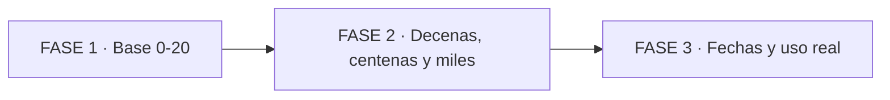

# 🔢 Cómo se forman y se pronuncian los números en inglés

> Aprender números es como armar con bloques: con 12 piezas formás del 0 al millón.

## 🗺️ Mapa de 3 FASES

*Se lee de izquierda a derecha. 3 fases en orden fácil → difícil.*



*Se lee de izquierda a derecha: primero base, luego sistema, luego vida real.*

**Niveles:** FASE 1 es Nivel 1/5, FASE 2 es Nivel 3/5, FASE 3 es Nivel 5/5.

## 📚 Pre-training: 7 palabras antes de empezar

- 🔹 **cardinal:** número para contar, como contar manzanas.
- 🔹 **teen:** terminación de 13 a 19, como la adolescencia en inglés.
- 🔹 **ty:** terminación de decenas 20 a 90, como el plural de diez.
- 🔹 **acento tónico:** la sílaba que suena más fuerte, como gritar una parte.
- 🔹 **hundred:** cien, como una bolsa de 100 monedas.
- 🔹 **thousand:** mil, como diez bolsas de cien.
- 🔹 **bloque:** grupo de 2 cifras para leer años, como partir una barra de chocolate.

---

## 🧩 PARTE 1: Base 0 a 20 (Nivel 1/5)

1. ❓ PRETEST — ¿Cómo decís 13 en inglés y dónde ponés el acento?
    > Respuesta esperada: thirteen, con acento fuerte al final: thir-TEEN.
    > Si acertás: camino rápido → andá al punto 7.

2. 🎯 POR QUÉ + LOGRO — Importa porque sin 0-20 no decís edad ni teléfono. Vas a lograr decir 0-20 sin dudar.

3. ⚡ VICTORIA RÁPIDA (<5 min) — Decí: one, two, three, four, five. Ya dijiste 5 números. 🎉

4. 💡 CONCEPTO — Analogía: la base 0-10 es como el abecedario de los números. Definición: son piezas únicas sin regla; de 13 a 19 se agrega teen.

Lista base para repetir:

- 🔸 0 zero / oh en teléfonos, 1 one, 2 two, 3 three
- 🔸 4 four, 5 five, 6 six, 7 seven, 8 eight
- 🔸 9 nine, 10 ten, 11 eleven, 12 twelve
- 🔸 13 thirteen, 14 fourteen, 15 fifteen, 19 nineteen

5. 👀 EJEMPLO RESUELTO — I Do: armo 15 paso a paso. Caso: fifteen.
    > Pasos: 1 Tomo base five. 2 Cambio a fif. 3 Agrego teen con acento final: fif-TEEN.

    | Paso | Qué hago | Resultado |
    |------|----------|-----------|
    | 1 | Tomo la base | five |
    | 2 | Ajusto el sonido | fif |
    | 3 | Agrego teen fuerte | fif-TEEN |

    ```mermaid
    flowchart TD
        A["base five"] --> B["ajuste fif"] --> C["fif-TEEN"]
    ```

    *Se lee de arriba hacia abajo. 3 pasos para formar un teen.*

6. ⚠️ CONTRA-EJEMPLO / ERROR TÍPICO — Decir TUR-teen con acento al inicio suena a thirty. Corrección: teen siempre grita al final: thir-TEEN. 🗣️

7. 🧪 PRÁCTICA — We Do juntos: yo digo 14 y vos repetís four-TEEN. Ahora You Do solo, en otro contexto: decí 13, 15 y 19 en voz alta.
    > Respuesta esperada / criterio: thir-TEEN, fif-TEEN, nain-TEEN, las tres con golpe final. ✅

8. 🔁 RECALL — Sin mirar: ¿qué terminación tienen 13-19 y dónde va el acento? (Nivel Bloom: recordar)
    > Respuesta: terminan en teen y el acento va al final.

9. 📌 IDEA CLAVE — 📌 Teen grita al final: thir-TEEN cuenta adolescentes.

10. ✅ AUTO-CHEQUEO + SIGUIENTE — [ ] Digo 0-12 de memoria. [ ] Digo 13-19 con acento final. [ ] Distingo oh y zero. Siguiente: decenas tramposas con -ty. ➡️

---

## 🏗️ PARTE 2: Decenas, centenas y miles (Nivel 3/5)

1. ❓ PRETEST — ¿Cómo formás 42 y cómo suena distinto de 14?
    > Respuesta esperada: forty-two, con acento al inicio FOR-ty; fourteen grita al final.
    > Si acertás: camino rápido → andá al punto 7.

2. 🎯 POR QUÉ + LOGRO — Importa porque acá se confunde thirteen con thirty. Vas a lograr armar 21-99, centenas y miles sin memorizar.

3. ⚡ VICTORIA RÁPIDA (<5 min) — Decí twenty, thirty, forty. Ya tenés 20, 30, 40. 🚀

4. 💡 CONCEPTO — Analogía: ty es como el plural de diez. Analogía hundred: hundred es una bolsa de 100 que se cuenta: two hundred. Definición: decena + guion + unidad forma 21-99; centenas y miles son número + hundred / thousand, siempre en singular.

Cómo se nombran centenas y miles:

- 🔹 100 one hundred, 200 two hundred, 500 five hundred
- 🔹 1,000 one thousand, 3,500 three thousand five hundred
- 🔹 1,000,000 one million; 20 twenty, 30 thirty, 40 forty sin u

5. 👀 EJEMPLO RESUELTO — I Do: armo 2,342. Caso: two thousand three hundred forty-two.
    > Pasos: 1 Miles: two thousand. 2 Centenas: three hundred. 3 Decena + unidad: forty-two.

    | Paso | Qué hago | Resultado |
    |------|----------|-----------|
    | 1 | Nombro miles | two thousand |
    | 2 | Nombro centenas | three hundred |
    | 3 | Pego decena-guion | forty-two |

    ```mermaid
    flowchart TD
        A["two thousand"] --> B["three hundred"] --> C["forty-two"]
    ```

    *Se lee de arriba hacia abajo. 3 piezas en orden.*

6. ⚠️ CONTRA-EJEMPLO / ERROR TÍPICO — Escribir fourty con u y decir EIGH-ty para 80. Corrección: forty sin u y eighty sin h extra: EIT-ti. ✍️

7. 🧪 PRÁCTICA — We Do: 67 juntos: sixty + seven. You Do nuevo: 53 y 1,500.
    > Respuesta esperada / criterio: fifty-three; one thousand five hundred. ✅

8. 🔁 RECALL — Sin mirar: ¿por qué thirteen y thirty suenan distinto aunque se parecen? (Nivel Bloom: comprender)
    > Respuesta: teen grita al final, ty susurra al inicio; por eso thir-TEEN vs THIR-ty.

9. 📌 IDEA CLAVE — 📌 Ty susurra al inicio y se combina con guion.

10. ✅ AUTO-CHEQUEO + SIGUIENTE — [ ] Digo 20-90 suaves. [ ] Escribo forty sin u. [ ] Armo un ciento solo. Siguiente: años, precios y teléfonos mezclados. ➡️

---

## 🌍 PARTE 3: Fechas y uso real mezclado (Nivel 5/5)

1. ❓ PRETEST — ¿Cómo leés March 5th, 2026?
    > Respuesta esperada: March fifth, twenty twenty-six.
    > Si acertás: camino rápido → andá al punto 7.

2. 🎯 POR QUÉ + LOGRO — Importa porque fechas, miles y teléfonos vienen mezclados. Vas a lograr leer los tres sin traducir.

3. ⚡ VICTORIA RÁPIDA (<5 min) — Decí: March fifth. Ya dijiste una fecha. 🎧

4. 💡 CONCEPTO — Analogía: el ordinal es medalla, marca puesto. Analogía año: el año se lee de a pares. Definición: día en ordinal; mes antes en EE. UU.; año en dos pares; miles como PARTE 2.

Cómo se nombran las fechas:

- 🔹 Días: 1st first, 2nd second, 3rd third, 5th fifth
- 🔹 Formato: March 5th o 5th of March
- 🔹 Años: 1999 nineteen ninety-nine, 2000 two thousand, 2026 twenty twenty-six

5. 👀 EJEMPLO RESUELTO — I Do: March 5th, 2026.
    > Pasos: 1 Día: March fifth. 2 Año: twenty twenty-six. 3 Repito miles: two thousand.

    | Paso | Qué hago | Resultado |
    |------|----------|-----------|
    | 1 | Día ordinal | March fifth |
    | 2 | Año en bloques | twenty twenty-six |
    | 3 | Miles igual | two thousand |

    ```mermaid
    flowchart LR
        A["March fifth"] --> B["twenty twenty-six"] --> C["two thousand"]
    ```

    *Se lee de izquierda a derecha. 3 movimientos.*

6. ⚠️ CONTRA-EJEMPLO / ERROR TÍPICO — Decir March five falla. Corrección: el día es ordinal: fifth, no five. 📅

7. 🧪 PRÁCTICA — Mixta: a) July 3rd, 2015, b) 305, c) 2,000.
    > Respuesta esperada / criterio: a) July third, twenty fifteen, b) three oh five, c) two thousand. ✅

8. 🔁 RECALL — Sin mirar: ¿cómo leés March 5th, 2026? (Nivel Bloom: aplicar)
    > Respuesta: March fifth, twenty twenty-six.

9. 📌 IDEA CLAVE — 📌 Parte en bloques, cifra por cifra, y ty suave.

10. ✅ AUTO-CHEQUEO + SIGUIENTE — [ ] Leo fechas con ordinal. [ ] Leo años en pares. [ ] Nombro miles solo. Siguiente: grabate con tu fecha. 🎙️

---

## 🏁 Cierre: tu prueba de 30 segundos

🧪 Decí en voz alta: March 5th, 2,000 y forty sin u.

> Respuesta esperada: March fifth, two thousand, forty. Si el día es ordinal y ty susurra, aprobás.

✅ Checklist final: [ ] base 0-20 [ ] teen vs ty [ ] centenas y miles [ ] fechas y años.

*Guía creada con spec de guías educativas: pretest, fading I Do → We Do → You Do, recall espaciado y práctica mixta.*
