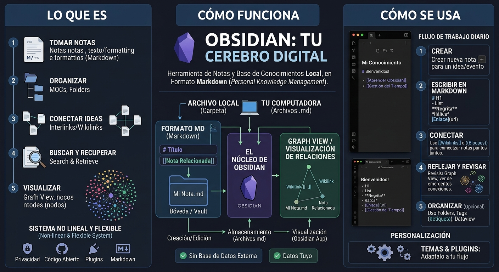
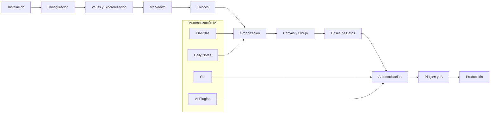
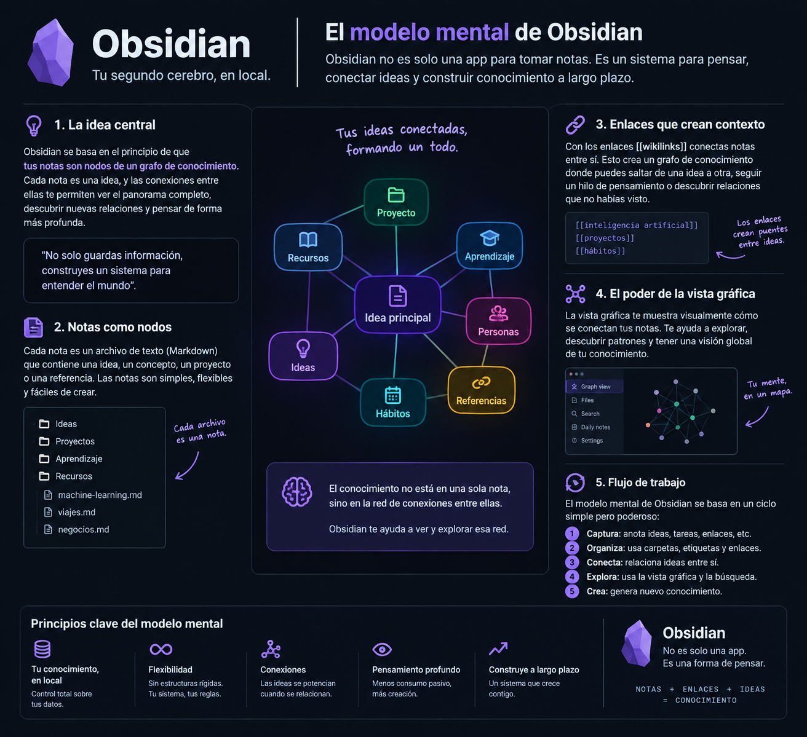
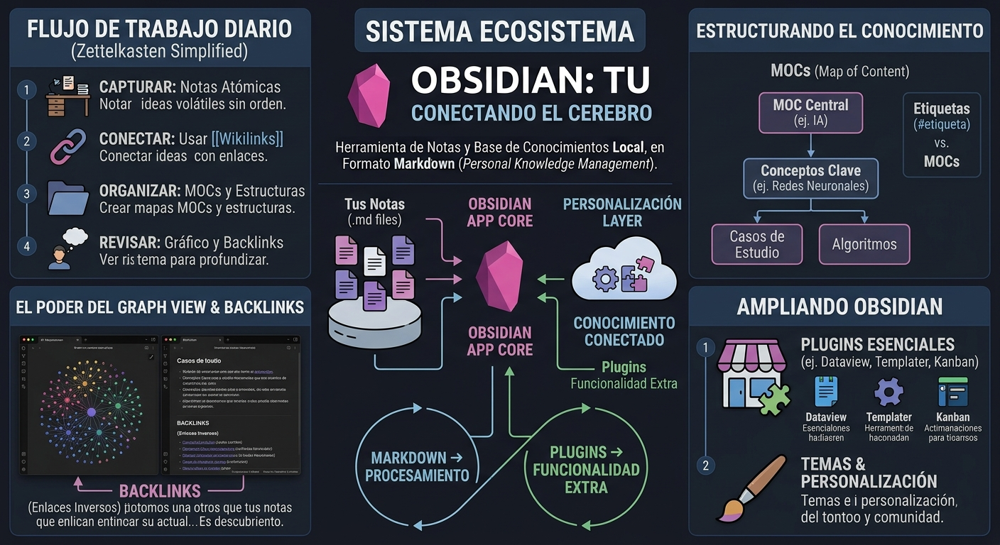
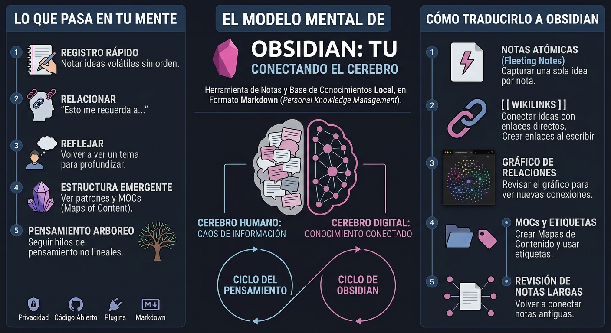

# MASTERCLASS: Obsidian - Tu Segundo Cerebro Digital 🧠

## INTRODUCCIÓN: POR QUÉ ESTA MASTERCLASS ES DIFERENTE 🎯

Obsidian no es solo una herramienta de tomar notas. Es un **sistema de conocimiento personal** basado en archivos Markdown planos que viven en tu disco duro.

> **🎯 Objetivo de Aprendizaje** — Al final de esta guía, podrás instalar y configurar Obsidian, crear y sincronizar vaults, redactar en Markdown, enlazar notas con `[[ ]]`, usar Canvas y Excalidraw, estructurar datos con propiedades y bases de datos, automatizar con plantillas y daily notes, y extender la aplicación con plugins comunitarios e integraciones IA.

> **💡 Advertencia educativa** — Este contenido es formativo. Obsidian es de código abierto (free tier) pero tiene un modelo de suscripción para la sincronización. Evalúa qué tier se ajusta a tu uso antes de pagar.



---

## MAPA DEL WORKFLOW 🔄



| Fase | Pregunta que responde | Output principal |
|------|-----------------------|------------------|
| **Instalación** | ¿Dónde consigo Obsidian y cómo lo instalo? | App ejecutándose localmente |
| **Configuración** | ¿Cómo lo adapto a mi forma de trabajar? | Preferencias ajustadas |
| **Vaults y Sincronización** | ¿Dónde guardo mis notas y cómo las recupero en otro dispositivo? | Vault sincronizado |
| **Markdown** | ¿Cómo formateo mis notas para que sean portables? | Texto portable y legible |
| **Enlaces** | ¿Cómo conecto mis ideas entre sí? | Grafo de conocimiento |
| **Organización** | ¿Cómo estructuro la información sin perdarme? | Etiquetas, propiedades y vistas |
| **Canvas y Dibujo** | ¿Cómo mapeo ideas visualmente? | Mapas infinitos |
| **Bases de Datos** | ¿Cómo transformo notas en datos estructurados? | Consultas y tablas |
| **Automatización** | ¿Cómo evito repetir tareas? | Flujos de trabajo |
| **Plugins y IA** | ¿Cómo extiendo Obsidian más allá? | Funcionalidad extra |
| **Producción** | ¿Cómo mantengo el sistema vivo? | Hábito sostenible |

```mermaid
flowchart LR
    subgraph I_Do["I Do (Instructor)"]
        direction TB
        A1[Instalar Obsidian y configurar español] --> A2[Crear vault y sincronizar con iCloud] --> A3[Escribir nota con Markdown y enlaces] --> A4[Configurar Canvas y properties]
    end

    subgraph We_Do["We Do (Colaborativo)"]
        direction TB
        B1[Equipo: Crear estructura de notas para proyecto] --> B2[Conectar ideas con [[]] y ver Graph View] --> B3[Diseñar dashboard en Canvas] --> B4[Configurar plantilla para daily note]
    end

    subgraph You_Do["You Do (Independiente)"]
        direction TB
        C1[Construir: Tu vault con 3 carpetas temáticas] --> C2[Definir: Sistema de etiquetas y properties] --> C3[Diseñar: Mapa mental en Canvas de un tema] --> C4[Aplicar: Workflow completo en tu área]
    end

    classDef I_DoStyle fill:#E3F2FD,stroke:#1565C0,stroke-width:2px,color:#0D47A1;
    classDef We_DoStyle fill:#FFF8E1,stroke:#EF6C00,stroke-width:2px,color:#BF360C;
    classDef You_DoStyle fill:#E8F5E9,stroke:#2E7D32,stroke-width:2px,color:#1B5E20;

    class I_Do I_DoStyle;
    class We_Do We_DoStyle;
    class You_Do You_DoStyle;
```

---

## PARTE 1: INSTALACIÓN, SETUP Y FILOSOFÍA LOCAL-FIRST 💻

### 1.1 ¿Qué es Obsidian realmente?

Obsidian no es una app de notas más. Es un **sistema de conocimiento personal** basado en archivos Markdown planos que viven en tu disco duro.

| Característica | Obsidian | Notion / Evernote |
|---|---|---|
| **Formato** | Markdown plano | Propietario |
| **Propiedad** | 100% tuya | Plataforma |
| **Sincronización** | iCloud, GDrive, Dropbox | Servicio propio |
| **Offline** | Sí | Limitado |
| **Velocidad** | Instantánea | Depende de la red |
| **Precio** | Gratis (core) | Freemium |
| **Portabilidad** | Alta | Media/Baja |

> **🧠 Idea clave** — Obsidian funciona como un **second brain** externo: tú piensas, Obsidian recuerda y conecta.

### 1.2 Instalación paso a paso

| Paso | Acción | Detalle |
|---|---|---|
| 1 | Descargar | obsidian.md/download |
| 2 | Instalar | Ejecutar instalador |
| 3 | Abrir | Crear o abrir vault |
| 4 | Idioma | Settings → General → Language |
| 5 | Tema | Elegir tema claro/oscuro |

### 1.3 El vault: tu carpeta de conocimiento

Un **vault** es simplemente una carpeta en tu disco donde Obsidian guarda todas tus notas como archivos `.md`.

```text
MiVault/
├── 00 Inbox/
├── 01 Proyectos/
├── 02 Areas/
├── 03 Recursos/
├── 04 Archivo/
└── attachments/
```

> **💡 Regla** — Un vault por contexto grande. Si tienes vida personal y trabajo separados, usa dos vaults.

### 1.4 Sincronización: iCloud, Google Drive, Dropbox

| Método | Ventaja | Desventaja |
|---|---|---|
| **iCloud Drive** | Nativo en Apple | Solo ecosistema Apple |
| **Google Drive** | Multiplataforma | Conflictos si editas offline |
| **Dropbox** | Confiable | Límites en plan gratuito |
| **Obsidian Sync** | Optimizado para vaults | Pago extra |

> **⚠️ Advertencia** — Si usas sincronización externa (iCloud/GDrive), **no abras el vault desde dos dispositivos al mismo tiempo**. Puede generar conflictos.

---

## PARTE 2: LA INTERFAZ Y NAVEGACIÓN 🧭

### 2.1 Tres paneles fundamentales

| Panel | Función | Icono |
|---|---|---|
| **File Explorer** | Explorar archivos y carpetas | 📁 |
| **Editor** | Escribir y editar notas | ✏️ |
| **Graph View** | Visualizar conexiones entre notas | 🕸️ |

### 2.2 File Explorer: tu biblioteca

- 📁 **Vistas en árbol**: carpetas y subcarpetas
- ⭐ **Favoritos**: notas accesos directos
- 🔍 **Búsqueda global**: `Ctrl/Cmd + O`
- 📌 **Starred notes**: acceso rápido desde cualquier lugar

### 2.3 Graph View: el mapa de tu conocimiento

El **Graph View** muestra todas tus notas como nodos conectados por enlaces.

| Elemento | Significado |
|---|---|
| **Nodo** | Una nota |
| **Arista** | Un enlace `[[ ]]` |
| **Nodo aislado** | Nota sin conexiones |
| **Cluster denso** | Tema muy conectado |
| **Nodo central** | Hub de conocimiento |

> **🎯 Insight** — Un graph sano tiene clusters densos (temas profundos) y algunos nodos periféricos (exploración). Si todo está aislado, estás tomando notas pero no conectando.



### 2.4 Configuración esencial (Emowe)

| Setting | Recomendación | Por qué |
|---|---|---|
| **Default edit mode** | Live Preview | Transición suave editar/leer |
| **Legible line length** | Activado | No estirar líneas demasiado |
| **Spellcheck** | Activado | Notas limpias |
| **Auto-pair brackets** | Activado | Markdown fluido |
| **Deleted files** | System trash | Recuperación fácil |
| **Auto-update links** | Activado | No romper enlaces al renombrar |

---

## PARTE 3: MARKDOWN BASICS ✍️

### 3.1 Formato básico

| Elemento | Sintaxis | Ejemplo |
|---|---|---|
| **Encabezado H1** | `# Título` | # Mi nota |
| **Encabezado H2** | `## Sección` | ## Ideas |
| **Negrita** | `**texto**` | **importante** |
| **Cursiva** | `*texto*` | *énfasis* |
| **Lista** | `- item` | - Idea 1 |
| **Lista numerada** | `1. item` | 1. Paso uno |
| **Tarea** | `- [ ]` | - [ ] Pendiente |
| **Checkbox** | `- [x]` | - [x] Hecho |
| **Cita** | `> texto` | > Nota |
| **Código** | `` `code` `` | `print()` |
| **Bloque** | ` ``` ` | Ver código |
| **Divisor** | `---` | Separador |
| **Enlace** | `[texto](url)` | [Google](https://google.com) |

### 3.2 Wikilinks: el superpoder de Obsidian

Los **wikilinks** son enlaces entre notas usando sintaxis `[[ ]]`.

| Sintaxis | Resultado |
|---|---|
| `[[Otra nota]]` | Enlace a "Otra nota" |
| `[[Otra nota\|Texto personalizado]]` | Enlace con texto custom |
| `[[Otra nota#Sección]]` | Enlace a sección específica |
| `[[Otra nota^block-id]]` | Enlace a bloque específico |

> **💡 Tip** — Obsidian crea la nota automáticamente si haces clic en un enlace rojo. Escribe primero, enlaza después.

---

## PARTE 4: ORGANIZACIÓN AVANZADA — ETIQUETAS, PROPERTIES Y BASES DE DATOS 🗂️

### 4.1 Tags (etiquetas)

Las etiquetas son palabras clave que clasifican contenido.

| Tipo | Sintaxis | Uso |
|---|---|---|
| **Simple** | `#tag` | #idea |
| **Con jerarquía** | `#tag/subtag` | #proyecto/web |
| **Inline** | `#tag en texto` | Mejora la #productividad |
| **En frontmatter** | `tags: [a, b]` | Metadata estructurada |

> **🎨 Convención sugerida** — Usa `#contexto` para dónde se aplica y `#tipo` para qué clase de información es.

### 4.2 Properties (propiedades)

Las **propiedades** son metadatos estructurados al inicio de una nota (YAML frontmatter).

```yaml
---
title: "Reunión de equipo"
date: 2026-09-09
tags: [reunion, trabajo]
status: pendiente
prioridad: alta
participantes: [Ana, Bruno, Carla]
---
```

| Propiedad | Tipo | Ejemplo |
|---|---|---|
| **title** | string | "Mi nota" |
| **date** | date | 2026-09-09 |
| **tags** | array | [idea, proyecto] |
| **status** | select | pendiente / hecho |
| **prioridad** | number | 1-5 |
| **participantes** | list | Ana, Bruno |

> **🧠 Pro tip** — Obsidian permite crear **databases** visuales a partir de propiedades. Es como tener un Airtable dentro de tus notas.

### 4.3 Bases de datos con propiedades

Las **bases de datos** en Obsidian usan propiedades para crear vistas tipo tabla, lista o kanban.

| Vista | Para qué |
|---|---|
| **Tabla** | Datos estructurados comparables |
| **Lista** | Items con metadata |
| **Kanban** | Flujo de trabajo (To Do / Doing / Done) |
| **Calendario** | Eventos y deadlines |

Ejemplo de base de datos de libros:

| Título | Autor | Estado | Rating | Tags |
|---|---|---|---|---|
| Atomic Habits | Clear | Leyendo | ⭐⭐⭐⭐ | #habitos |
| Deep Work | Newport | Pendiente | ⭐⭐⭐ | #productividad |

---

## PARTE 5: HERRAMIENTAS DE PRODUCTIVIDAD 🛠️

### 5.1 Transclusion: notas dentro de notas

La **transclusión** permite incrustar contenido de una nota dentro de otra.

| Sintaxis | Resultado |
|---|---|
| `![[Otra nota]]` | Contenido completo de otra nota |
| `![[Otra nota#Sección]]` | Solo una sección específica |
| `![[Otra nota^block-id]]` | Solo un bloque específico |

> **💡 Uso** — Crea una nota "Dashboard" que transcluya tus notas diarias, proyectos activos y recursos clave. Un solo vistazo a todo.

### 5.2 Templates (plantillas)

Las **plantillas** son notas preformateadas que se insertan con un clic.

| Plugin | Función |
|---|---|
| **Templates** | Inserta contenido de una plantilla |
| **Templater** | Plantillas dinámicas con variables JS |

Variables comunes en Templater:

| Variable | Resultado |
|---|---|
| `<% tp.date.now() %>` | Fecha actual |
| `<% tp.file.title %>` | Nombre del archivo |
| `<% tp.file.folder() %>` | Carpeta actual |

Ejemplo de plantilla de daily note:

```markdown
# <% tp.date.now("YYYY-MM-DD") %>

## 🎯 Intención del día
- 

## ✅ Tareas
- [ ] 

## 💡 Ideas
- 

## 📝 Reflexión nocturna
- ¿Qué salió bien?
- ¿Qué puedo mejorar?
```

### 5.3 Daily Notes (notas diarias)

Las **daily notes** son notas automáticas por día.

| Característica | Descripción |
|---|---|
| **Fecha automática** | Se crea con la fecha del día |
| **Template** | Se inserta tu plantilla |
| **Calendario** | Navegación visual por días |
| **Backlinks** | Conexión automática entre días |

> **🧠 Hábito** — Escribe 3 líneas cada mañana (intención) y 3 cada noche (reflexión). 6 meses después tienes un diario de crecimiento.

### 5.4 Canvas: el espacio visual infinito 🎨

**Canvas** es un lienzo infinito donde puedes colocar notas, imágenes, PDFs y dibujos conectados.

| Elemento | Uso |
|---|---|
| **Nota** | Tarjeta de texto enlazada |
| **Grupo** | Notas organizadas visualmente |
| **Flecha** | Conexión entre ideas |
| **Imagen** | Referencia visual |
| **PDF** | Anotación sobre documento |

> **🎯 Caso de uso** — Mapa mental de un proyecto, flujo de trabajo visual, brainstorming, planning de sprint.



### 5.5 Excalidraw: dibujo a mano alzada

**Excalidraw** es un plugin para dibujar diagramas a mano alzada dentro de Obsidian.

| Feature | Descripción |
|---|---|
| **Dibujo libre** | Formas, flechas, texto |
| **Plantillas** | Diagramas prehechos |
| **Exportar** | PNG, SVG, PDF |
| **Integración** | Se guarda como nota en tu vault |

---

## PARTE 6: EXTENSIBILIDAD — PLUGINS, CLI Y IA 🔌

### 6.1 Plugins esenciales

| Plugin | Categoría | Función |
|---|---|---|
| **Calendar** | Productividad | Navegación por daily notes |
| **Excalidraw** | Visual | Dibujo a mano alzada |
| **Templater** | Automatización | Plantillas dinámicas |
| **Dataview** | Datos | Queries tipo SQL sobre notas |
| **Kanban** | Organización | Tableros kanban nativos |
| **Tasks** | Productividad | Gestión de tareas |
| **Outliner** | Navegación | Mejor manejo de listas |
| **Tag Wrangler** | Organización | Gestión y merge de tags |

### 6.2 Instalación segura de plugins comunitarios

| Check | Por qué |
|---|---|
| **Descargas** | Más descargas = más testeado |
| **Reviews** | Leer feedback de usuarios |
| **Código** | Verificar si es open source |
| **Mantención** | Última actualización reciente |
| **Permisos** | Revisar qué acceso pide |

> **⚠️ Seguridad** — Los plugins comunitarios piden acceso a tu vault. Instala solo los necesarios y revisa regularmente.

### 6.3 CLI y automatización

| Herramienta | Uso |
|---|---|
| **obsidian-cli** | Crear/buscar notas desde terminal |
| **obsidian-export** | Exportar vault a HTML/PDF |
| **Git** | Versionar tu vault |
| **Scripts** | Automatizar tareas repetitivas |

### 6.4 Integración con IA

| Integración | Función |
|---|---|
| **Copilot/Cursor** | Editar notas con IA |
| **Custom plugins** | Funcionalidad IA propia |
| **API local** | Conectar Obsidian con otros tools |
| **AI-powered search** | Búsqueda semántica |

---

## PARTE 7: I DO / WE DO / YOU DO — EJERCICIOS PROGRESIVOS 🎓

### 7.1 I Do — Instalación y primera nota

| Paso | Acción | Resultado esperado |
|---|---|---|
| 1 | Descargar e instalar Obsidian | App abierta |
| 2 | Crear vault "MiSegundoCerebro" | Vault vacío |
| 3 | Crear primera nota "Bienvenida" | Nota en blanco |
| 4 | Escribir en Markdown | Texto con formato |
| 5 | Crear enlace `[[Idea 1]]` | Enlace azul |
| 6 | Clic en enlace → crear nota | Nota nueva |
| 7 | Abrir Graph View | Grafo con 2 nodos |

### 7.2 We Do — Estructura de proyecto

**Escenario:** Vas a documentar un proyecto personal.

| Decisión | Opción recomendada | Justificación |
|---|---|---|
| Estructura | Carpetas por área | 00 Inbox, 01 Proyectos, 02 Areas |
| Formato | Markdown puro | Portable y versionable |
| Enlaces | Wikilinks [[]] | Conexión orgánica |
| Tags | #contexto/#tipo | Clasificación sin saturar |
| Properties | title, status, date | Metadata para Dataview |

### 7.3 You Do — Tu sistema personal

**Tarea:** Diseña tu propio sistema Obsidian.

| Criterio | Peso |
|---|---|
| Estructura de carpetas | 25% |
| Sistema de tags | 20% |
| Plantillas útiles | 25% |
| Integración con herramientas | 20% |
| Claridad del flujo | 10% |

---

## CHECKLIST FINAL DE OBSIDIAN ✅

| Bloque | Check |
|---|---|
| Instalación | App descargada y vault creado |
| Configuración | Idioma, tema, preferencias ajustadas |
| Vault | Sincronización configurada |
| Markdown | Sabes formatear texto básico |
| Enlaces | Usas [[]] regularmente |
| Graph View | Revisas conexiones semanalmente |
| Tags | Sistema de etiquetas definido |
| Properties | Metadata en notas clave |
| Templates | Plantillas para daily notes y proyectos |
| Canvas | Mapa visual de al menos un tema |
| Plugins | 3-5 plugins instalados y usados |
| Hábito | Tomas notas al menos 3 veces por semana |

---

## PREGUNTAS DE VERIFICACIÓN 📝

### Preguntas sobre Filosofía y Setup

1. **Aplica**: ¿Por qué elegirías Obsidian sobre Notion para un proyecto de investigación personal? Menciona 3 ventajas concretas.

2. **Analiza**: ¿Qué riesgos tiene sincronizar un vault con iCloud? Propón una estrategia de backup.

### Preguntas sobre Markdown y Enlaces

3. **Diseña**: Crea una nota de reunión que use al menos 5 elementos de Markdown diferentes.

4. **Reflexiona**: ¿Por qué los wikilinks son más poderosos que los enlaces web tradicionales para construir conocimiento?

### Preguntas sobre Organización

5. **Calcula**: Si tienes 200 notas y 15% están aisladas en el Graph View, ¿cuántas notas necesitan más enlaces?

6. **Evalúa**: ¿Cuándo es mejor usar carpetas y cuándo es mejor usar tags para organizar información?

### Preguntas Integradoras

7. **Conecta**: Explica cómo las Daily Notes, Templates y Properties trabajan juntos para crear un sistema de journaling automático.

8. **Propón un sistema**: Diseña un flujo de trabajo semanal usando Obsidian: captura, organización, revisión y acción.

9. **Síntesis**: Toma un tema que estés aprendiendo y crea en Obsidian: una nota principal, 3 subnotas enlazadas, un Canvas visual y un tag system.

10. **Reflexión final**: De todas las características de Obsidian, ¿cuál consideras la más transformadora para tu forma de pensar? Justifica tu respuesta.

---

## 🗺️ MAPA MENTAL DE CONCEPTOS — Cómo navegar el ecosistema al trabajar

> **🧠 Idea clave** — Obsidian no es una lista de features: es un ecosistema donde cada parte potencia a las demás. Este mapa mental te permite ubicar cada concepto y ver cómo se conectan cuando estás trabajando.



### 🧩 El Mapa en una Mirada

```mermaid
mindmap
  root((Obsidian 🧠))
    💾 Vault
      📁 Carpetas
      🔄 Sincronización
      💾 Backup
    ✍️ Markdown
      📝 Formato
      🔗 Enlaces
      📋 Listas
    🧬 Enlaces
      [[Wikilinks]]
      🕸️ Graph View
      🔄 Backlinks
    🏷️ Organización
      # Tags
      📄 Properties
      📊 Databases
    🛠️ Productividad
      📝 Templates
      📅 Daily Notes
      🎨 Canvas
      ✏️ Excalidraw
    🔌 Plugins
      📦 Comunitarios
      🤖 IA
      ⚡ CLI
```

### 🔗 Cómo se conectan los conceptos al trabajar

| Cluster 🧩 | Conceptos | Conexión al siguiente | ¿Cuándo aparece? |
|---|---|---|---|
| 💾 **Vault** | Carpetas, sincronización, backup | Es el contenedor de todo lo demás | Antes de cualquier nota |
| ✍️ **Markdown** | Formato, listas, encabezados | El lenguaje común de todas las notas | Al escribir cualquier contenido |
| 🧬 **Enlaces** | Wikilinks, Graph View, backlinks | Conectan el vault en un grafo | Cuando una nota referencia a otra |
| 🏷️ **Organización** | Tags, properties, databases | Estructuran la información para recuperarla | Cuando el vault crece |
| 🛠️ **Productividad** | Templates, daily notes, Canvas | Automatizan y visualizan el flujo | Cuando repites patrones |
| 🔌 **Plugins** | Comunitarios, IA, CLI | Extienden Obsidian más allá de lo nativo | Cuando necesitas features específicas |

### 📚 Glosario de los términos del mapa

| Término | Icono | Definición |
|---|---|---|
| **Vault** | 💾 | Carpeta local donde Obsidian guarda todas las notas |
| **Wikilink** | 🧬 | Enlace entre notas usando sintaxis `[[ ]]` |
| **Graph View** | 🕸️ | Visualización interactiva de todas las conexiones del vault |
| **Backlink** | 🔄 | Enlace entrante: una nota que apunta a la actual |
| **Tag** | 🏷️ | Palabra clave con `#` para clasificar contenido |
| **Property** | 📄 | Metadato estructurado en YAML frontmatter |
| **Database** | 📊 | Vista tabular/kanban/calendario basada en properties |
| **Template** | 📝 | Nota preformateada que se inserta con un clic |
| **Daily Note** | 📅 | Nota automática creada por fecha |
| **Canvas** | 🎨 | Espacio visual infinito para mapear ideas |
| **Transclusion** | 📋 | Incrustar contenido de una nota dentro de otra |
| **Plugin** | 📦 | Extensión comunitaria que agrega funcionalidad |
| **Sincronización** | 🔄 | Mecanismo para mantener el vault actualizado entre dispositivos |

> 💡 **Consejo de uso** — Vuelve a este mapa mental cuando sientas que Obsidian te abruma. Recuerda: empieza por el vault y Markdown. El resto se agrega cuando lo necesitas.

---

## GLOSARIO RÁPIDO 📚

| Término | Definición |
|---|---|
| **Second Brain** | Sistema externo para almacenar y conectar conocimiento |
| **Vault** | Carpeta local que contiene todas las notas de Obsidian |
| **Markdown** | Lenguaje de marcado ligero para formatear texto |
| **Wikilink** | Enlace entre notas usando dobles corchetes `[[ ]]` |
| **Graph View** | Visualización en grafo de todas las conexiones del vault |
| **Backlink** | Enlace entrante desde otra nota hacia la actual |
| **Tag** | Palabra clave precedida por `#` para clasificar |
| **Property** | Metadato estructurado en YAML al inicio de una nota |
| **Database** | Colección de notas organizada como tabla, lista o kanban |
| **Template** | Nota preformateada reutilizable |
| **Daily Note** | Nota diaria generada automáticamente por fecha |
| **Canvas** | Espacio visual infinito para diagramas y mapas |
| **Transclusion** | Incrustación de contenido de una nota en otra |
| **Plugin** | Extensión que agrega funcionalidad a Obsidian |
| **Local-first** | Filosofía donde los datos viven en tu dispositivo |

---

## ANEXO: FORMATO IDEAL PARA ARTÍCULOS EDUCATIVOS

### Recomendaciones de ancho para lectura larga

El ancho óptimo para artículos educativos es **60–75 caracteres por línea** (incluyendo espacios).

```css
.article-content {
  max-width: 65ch;
}
```

### Anchura recomendada para guías de aprendizaje

```css
.article-content {
  max-width: 60ch;
}
```

Esto facilita mantener la atención, reducir la fatiga visual y mejorar la comprensión.

### Lo que hace agradable una guía al cerebro

1. **Jerarquía visual clara** — Escanea sin leer todo.
2. **Párrafos cortos** — Bloques pequeños = menos trabajo cognitivo.
3. **Espacio en blanco** — `line-height: 1.75` y separación entre secciones.
4. **Secciones cortas** — 200–400 palabras por sección.
5. **Patrones visuales** — Alterna lista, diagrama, tabla, ejemplo, resumen.
6. **Resúmenes frecuentes** — Cierres visuales cada pocas secciones.

---

## ANEXO B: CÓMO USAR ESTA MASTERCLASS

### Fórmula para tu propio sistema

1. **Semana 1**: Instala Obsidian, crea tu vault, escribe 3 notas diarias.
2. **Semana 2**: Agrega enlaces `[[ ]]` y explora Graph View.
3. **Semana 3**: Configura tags y properties en tus notas clave.
4. **Semana 4**: Instala 3 plugins esenciales y crea tu primera plantilla.
5. **Mes 2**: Diseña un Canvas para tu proyecto principal y automatiza daily notes.

### Los 5 consejos de aprendizaje acelerado aplicados a Obsidian

1. **Aprende en 20 horas** — 10 sesiones de 2 horas con esta guía como hoja de ruta.
2. **Miniguía de una página** — Crea tu propia cheat sheet de Markdown y plugins favoritos.
3. **Quiz antes de descansar** — Hazte 5 preguntas sobre features que usaste esa semana.
4. **Escalera de aprendizaje** — Nivel 1: notas básicas → Nivel 2: enlaces → Nivel 3: properties → Nivel 4: Canvas → Nivel 5: automatización.
5. **Técnica de Feynman** — Explica Obsidian a un amigo en 5 minutos. Si no puedes, repasa esa sección.