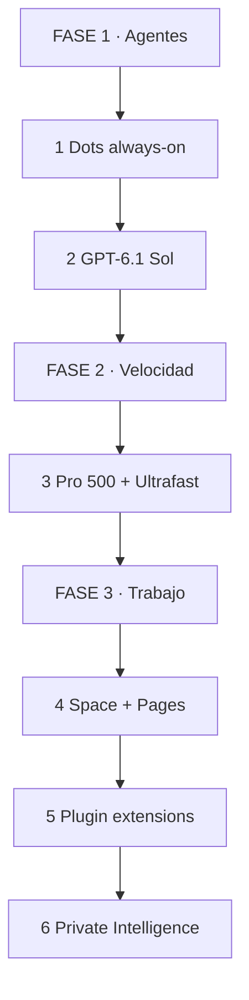
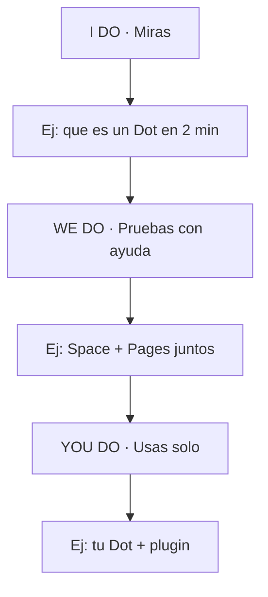

# 🚀 OpenAI DevDay 2026 — Guía de Cada Feature 🧠🤖

## 🎯 INTRODUCCIÓN 💡

El 29-sep-2026 OpenAI hizo su DevDay en San Francisco con 20+ anuncios y 2.500 asistentes. El hilo común: pasar del chatbot que responde al **agente que trabaja en segundo plano**, más velocidad, más colaboración y más privacidad.

> **🎯 Objetivo** — Al terminar sabrás qué es cada feature anunciado hoy, para qué sirve y cuándo te conviene usarlo.

> **⚠️ Nota** — Info basada en keynote + CNBC live + The Verge + Help Center del 29-sep-2026. Disponibilidad por tiers y regiones; verifica en tu cuenta.

---

## 🗺️ MAPA — LEE DE ARRIBA HACIA ABAJO 🗺️

Cómo leerlo: empiezas en FASE 1, bajas hasta FASE 3. Cada fase es independiente pero se combinan.

| Fase 🧩 | Qué logras 🎯 | Habilidad 🛠️ |
|------|---------------|--------------|
| **FASE 1 · Agentes** (1-2) | Delegar tareas de fondo | Configurar + Supervisar |
| **FASE 2 · Velocidad** (3) | Respuestas más rápidas | Elegir tier correcto |
| **FASE 3 · Trabajo** (4-6) | Colaborar y desplegar seguro | Integrar + Privacidad |

### Cómo aprenderla: I Do → We Do → You Do

---

## 🟣 1. DOTS — AGENTES ALWAYS-ON

El anuncio principal. Dots son asistentes persistentes que trabajan en segundo plano, no solo cuando chateas.

| Punto 📋 | Detalle 🎯 |
|----------|-----------|
| Motor | GPT-6 Astra (lanzado a inicios de mes) |
| Dónde viven | Cloud computer propio con browser |
| Conexiones | 4.000+ apps |
| Dónde hablas con ellos | ChatGPT, Slack, Teams; SMS pronto; voz en web/desktop/mobile |
| Memoria | Aprenden de feedback con el tiempo; contexto entre apps |
| Equipos de Dots | Pueden colaborar entre sí por ti (roadmap) |
| Disponibilidad | Pro, Business Premium y Enterprise (admin lo habilita en Edu/Healthcare) |

> **📌 Idea clave** — No es un chatbot más rápido. Es un worker que trae resultados para tu revisión. Tú nombras y personalizas tu dot primario.

**Dots vs Meta Muse:**

| 📋 | Dots (OpenAI) | Muse (Meta) |
|----|---------------|-------------|
| Precio inicial | Pago (Pro/Business/Enterprise) | Gratis |
| Forma | Avatar personalizable, chat + voz | Avatar, estilo text-message |
| Ecosistema | 4.000 apps + Slack/Teams | Social/shopping Meta |

---

## 🧠 2. GPT-6.1 SOL — MODELO NUEVO

Lanzado solo una semana después de GPT-6 Sol. OpenAI lo llama "major upgrade".

| Punto 📋 | Detalle 🎯 |
|----------|-----------|
| Foco | Trabajo profesional, uso de computadoras, agentic coding |
| Contexto | Ayer se frenó GPT-6.1 Astra por no pasar el bar de safety |
| Familia | GPT-6 Astra → Sol / Luna (económicos) → 6.1 Sol |

> **📌 Idea clave** — Si usas Codex o automatizas PC, prueba 6.1 Sol primero. Si Astra te fue bloqueado por policy, Sol es el camino oficial de hoy.

---

## ⚡ 3. PRO 500 + ULTRAFAST

Nuevo tier de $500/mes con los límites más altos y acceso a Ultrafast en ChatGPT, Codex y API.

| Punto 📋 | Detalle 🎯 |
|----------|-----------|
| Ultrafast | Hasta 8x tokens en Codex, 6x en API |
| Frase de Altman | "No vas a querer volver" |
| Además | Tier $200 reabierto con nuevos límites |
| Usuarios | ChatGPT llega a 1.2B semanales (vs 1B en julio) |

> **📌 Idea clave** — Paga Pro 500 solo si el cuello de botella es velocidad/tokens (coding pesado, agentes). Para uso normal, el tier $200 reabierto alcanza.

---

## 🤝 4. SPACE + PAGES — TRABAJO EN EQUIPO

Colaboración humano + agente.

| Feature 📋 | Qué es 🎯 |
|------------|----------|
| **Space** | Espacio donde teammates y dots trabajan juntos |
| **Pages** | Documento vivo para crear texto, imágenes, charts y visualizaciones entre humanos y agentes |

> **📌 Idea clave** — Space es el lugar, Pages es el artefacto. Si tu equipo pierde hilos en chats, mueve la entrega a una Page.

---

## 🧩 5. PLUGIN EXTENSIONS

Developers pueden construir plugins que son "apps enteras nativas" dentro de ChatGPT y Codex, distribuidas por OpenAI.

| Punto 📋 | Detalle 🎯 |
|----------|-----------|
| Qué puedes construir | Editor, dashboard, workspace completo |
| Ejemplo del keynote | App de meetings con tus próximas reuniones dentro del chat |
| Diferencia vs plugins viejos | Antes: acción puntual. Ahora: UI completa embebida |

> **📌 Idea clave** — Si ibas a hacer una web aparte para acompañar tu agente, evalúa primero plugin extension: distribución + contexto incluidos.

---

## 🔒 6. PRIVATE INTELLIGENCE (PREVIEW)

Controles fuertes de datos sin perder capacidad frontier.

| Punto 📋 | Detalle 🎯 |
|----------|-----------|
| Zero Data Retention | No guarda tu contenido en servidores |
| Private safety processing | Safety sin almacenar contenido |
| Private inference | Privacidad al momento de inferencia |
| Diseño con | Cisco, Databricks, Snowflake |

> **📌 Idea clave** — Si tu blocker era compliance, este preview es tu puerta de entrada a Enterprise. Pide acceso con tu caso de uso.

---

## 🧩 I DO / WE DO / YOU DO

### I Do — Entiende un Dot en 2 minutos

| Paso | Acción | Resultado |
|------|--------|-----------|
| 1 | Crea tu dot en app desktop/web | Dot con nombre |
| 2 | Conecta 1 app (ej: Slack) | Dot responde con contexto |
| 3 | Pide 1 tarea de fondo | Resultado para revisión |

### We Do — Space + Page juntos

| Decisión | Opción | Por qué |
|----------|--------|---------|
| Lugar | Space del equipo | Contexto compartido |
| Entregable | 1 Page con chart | Humano + dot colaboran |
| Revisión | Humano aprueba | Nada se publica solo |

### You Do — Tu stack DevDay

| Criterio | Peso |
|----------|------|
| Dot configurado con 2+ apps | 30% |
| Prueba 6.1 Sol o Ultrafast medida | 30% |
| 1 Space/Page o plugin evaluado | 20% |
| Decisión privacidad documentada | 20% |

---

## ✅ CHECKLIST

| Bloque 📦 | Check ✔️ |
|--------|-------|
| Dots | Sé qué hacen y en qué tier están |
| Modelo | Sé cuándo usar 6.1 Sol vs Astra |
| Velocidad | Sé si me conviene Pro 500 o $200 |
| Colab | Sé diferencia Space vs Pages |
| Build | Sé qué es plugin extension |
| Privacidad | Sé qué promete Private Intelligence |

---

## 📝 PREGUNTAS

1. ¿Qué diferencia un Dot de un chat normal? Menciona 3 (cloud computer, apps, always-on).
2. ¿Cuándo pagarías Pro 500 en vez del tier $200?
3. Diseña un Space + Page para tu equipo: ¿quién hace qué, humano vs dot?
4. ¿Qué app convertirías en plugin extension y por qué no como web separada?
5. ¿Qué requisito de privacidad te desbloquearía Private Intelligence?

---

## 📖 GLOSARIO

| Término | Definición |
|---------|------------|
| **Dots** | Agentes always-on de OpenAI con cloud computer |
| **GPT-6 Astra** | Modelo que potencia Dots |
| **GPT-6.1 Sol** | Upgrade para trabajo pro y agentic coding |
| **Ultrafast** | Tier de velocidad premium (8x Codex, 6x API) |
| **Pro 500** | Plan $500/mes con máximos límites |
| **Space** | Espacio colaborativo equipo + dots |
| **Pages** | Documento vivo humano + agente |
| **Plugin extensions** | Apps completas dentro de ChatGPT/Codex |
| **Private Intelligence** | Suite privacidad: ZDR + safety + inferencia privada |

*Fuentes: CNBC DevDay live 29-sep-2026, The Verge biggest announcements, OpenAI Help Center release notes.*
