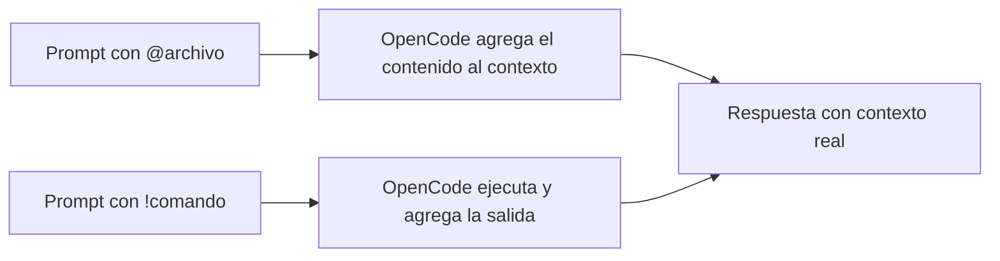

# Guía OpenCode (octubre 2026)

## 🎯 Introducción: por qué esta guía es diferente

OpenCode ya no es solo "una TUI para chatear con un modelo". En 2026 se convirtió en un **sistema de orquestación**: maneja sesiones, contexto, subagentes, permisos granulares, skills, plugins, MCP, compactación inteligente y, ahora, una beta 2.0 que cambia la API de configuración.

El problema no es la cantidad de features. Es que la documentación está dispersa, el flujo óptimo no es obvio y la línea 1.18.x y la 2.0 beta conviven sin que quede claro cuál elegir.

Esta guía te da **un mapa mental del stack de OpenCode**, un flujo de trabajo probado, consejos prácticos y un glosario de los comandos que aparecen al escribir `/`.

> **Objetivo de Aprendizaje** — Al finalizar, podrás elegir entre la estable 1.18.x y la 2.0 beta, configurar un proyecto con `AGENTS.md`, usar skills y comandos propios, delegar en subagentes sin ensuciar el contexto, y automatizar revisiones y flujos repetitivos.

> **Advertencia** — Algunos datos de la 2.0 beta salen de la documentación oficial, no de un changelog versión por versión (el agregador no lo trae). Los marcamos como **[Oficial]** si salen de docs oficiales, **[Secundaria]** si salen de artículos o agregadores, e **[Inferencia]** si son recomendaciones mías deducidas del funcionamiento.

---

## 🔢 0. Primero: ¿cuál es "la última versión"?

Hoy conviven **dos líneas** y conviene no mezclarlas:

| Línea | Versión más reciente | Estado |
|---|---|---|
| **Estable 1.18.x** | **v1.18.34**, 30 de septiembre de 2026 **[Oficial: changelog]** | Es la que instalás con los métodos habituales (curl, Homebrew, npm, etc.) |
| **OpenCode 2.0 (beta)** | **v2.0.22**, 2 de octubre de 2026 **[Secundaria: Releasebot]** | Beta pública. El ejecutable se llama `opencode2` y la propia documentación avisa que pueden borrarse datos y cambiar APIs, configuración y plugins **[Oficial]** |

En la versión beta de la doc, dicen que el ejecutable es `opencode2` durante el beta, y que Homebrew, paquetes de Arch, instaladores de Windows y Docker todavía no están disponibles **[Oficial]**.

**Recomendación [Inferencia]:** para trabajo real, quedate en la **estable 1.18.x**. Probá la 2.0 beta en un proyecto descartable.

> Nota de transparencia: no pude leer las notas de release detalladas de cada versión 2.0.x (el agregador no las trae), así que la sección de la 2.0 se apoya en la documentación oficial de la beta, no en un changelog versión por versión.

---

## 🆕 PARTE 1: Qué hay de nuevo

### 1.1 Línea estable 1.18.x (julio a septiembre de 2026)

Lo más relevante que figura en el changelog oficial **[Oficial]**:

**Modelos y proveedores**
- Soporte y ajustes para modelos nuevos: familia GPT-6, estabilidad con Claude 5, DeepSeek V4 Flash, Kimi/Moonshot, xAI, Meta Muse, entre otros.
- **Autenticación con Microsoft Entra ID vía Azure CLI**, sin necesidad de API keys para proveedores Azure (v1.18.24).
- Mejoras para Cloudflare AI Gateway (timeouts, rutas nativas OpenAI/Anthropic), Bedrock, Vertex AI multi-región y GitHub Copilot (adjuntar PDFs, razonamiento resumido).
- **Variantes de esfuerzo de razonamiento** nuevas para modelos Claude y GitLab (v1.18.30), y alineación de los controles de "thinking" de Gemini.
- **Timeouts por defecto de cinco minutos** para arranques lentos de modelo y streaming (v1.18.27).

**Sesiones y contexto**
- **Mejoras en la compactación de sesiones**: resúmenes más claros, mejor comportamiento con modelos chicos y reintentos automáticos con límite y *jitter* (v1.18.17); compactaciones repetidas más robustas (v1.18.15).
- Orden cronológico correcto de mensajes y mayor precisión en *revert/fork*.
- **Los subagentes pueden reanudar llamadas a herramientas** (v1.18.20) y se mantiene el estado de sesión (modelo, esfuerzo, modo) al usar ACP (v1.18.31).

**Configuración y robustez**
- El parseo de configuración **ignora campos desconocidos en vez de fallar** (v1.18.16): útil si compartís config entre versiones.
- Se ocultan credenciales en la salida de depuración de configuración (v1.18.33).
- Binarios de macOS firmados y vueltos a firmar localmente para macOS 27+ (v1.18.34).

**Desktop**
- El rediseño **"Desktop v2"** (julio de 2026, línea 1.18) trae sesiones en pestañas, terminal integrada, panel de revisión con diffs y un compositor unificado para adjuntos, contexto y modelo **[Secundaria: artículo de daleseo.com]**. Además: exportar sesión como JSON, más idiomas y mejoras en el menú de proyectos **[Oficial]**.

### 1.2 OpenCode 2.0 beta

Todo esto sale de la documentación de la beta **[Oficial]**:

**Tres cambios incompatibles a propósito**
1. **Nueva API de plugins:** los plugins de v1 no funcionan en v2; hay que migrarlos.
2. **Nueva API de servidor y clientes.**
3. **El cliente de terminal se configura en un único `cli.json` global**, en vez de archivos `tui.json(c)` por capas.

**Cambios de configuración que importan**
- Renombres: `agent`→`agents`, `command`→`commands`, `provider`→`providers`, `plugin`→`plugins`, `snapshot`→`snapshots`, `attachment`→`media`, `autoshare`→`share` (con valores `manual`, `auto`, `disabled`).
- **Permisos como un arreglo ordenado de reglas** (acción + recurso + efecto), en lugar de agrupar por herramienta. Ejemplo oficial: `{ "action": "shell", "resource": "git push *", "effect": "ask" }`. Acciones renombradas: `bash`→`shell`, `task`→`subagent`, `write`/`patch`→`edit`.
- **Variantes de modelo en la misma cadena:** `"anthropic/claude-sonnet-4-5#high"`.
- Servidores MCP agrupados en `mcp.servers`, con `timeout` dividido en `catalog` y `execution`.
- Skills como una lista única que mezcla rutas y URLs.
- Compactación por tokens (`keep.tokens`, `buffer`) en lugar de turnos.
- **Se ignora la configuración `lsp`** (el soporte de servidores de lenguaje se eliminó) y también `server` y `logLevel`.

**Funcionalidades nuevas en la documentación**
- **`references`:** acceso con nombre a carpetas o **repositorios Git externos** (por ejemplo `Effect-TS/effect`), con una descripción que orienta al agente sobre cuándo usarlos. Respetan los permisos de lectura.
- **`warming`:** envía pedidos periódicos al modelo mientras estás inactivo para **mantener vivo el caché de prompts** del proveedor. Viene apagado; por defecto, cada 4 minutos durante 30 minutos. Son pedidos reales que consumen tokens.
- **`policies` (experimental):** reglas binarias que **solo pueden endurecer** lo que permiten los permisos y proveedores; nunca preguntan. Las políticas de la organización desde OpenCode Console no se pueden anular localmente.
- **Comandos con `subagent: true`:** corren en una sesión hija en segundo plano.
- **CLI nuevo:** `opencode mini` (interfaz interactiva mínima), `opencode run` (automatización), servicio compartido en segundo plano (`opencode service ...`), `--standalone` y `opencode pair` para acceso web.
- **Plan "OpenCode Go"** (USD 10/mes) para modelos de código abierto, según la documentación.

**Cómo migrar [Oficial]:** mantené tu configuración v1 mientras instalás la v2, verificá que todo funcione, migrá plugins aparte y, si querés, pedile al propio OpenCode que convierta tu configuración al formato v2.

---

## 🚀 PARTE 2: Cómo sacarle el mayor provecho

### 2.1 El flujo de trabajo recomendado: Plan → Build → Revisar

OpenCode trae dos agentes principales que alternás con **Tab** **[Oficial]**:

- **Plan:** analiza y propone, **sin modificar** el código (restringe edición y bash).
- **Build:** el agente por defecto, con acceso completo para implementar.

**Patrón que recomiendo [Inferencia]:**
1. Arrancás en **Plan** y describís la tarea con contexto (archivos con `@`, criterios de aceptación).
2. Iterás el plan hasta que esté claro (qué archivos, qué orden, qué tests).
3. Cambiás a **Build** con Tab y pedís que lo implemente.
4. Revisás los cambios. Si algo no gusta, **`/undo`**.
5. Cuando la sesión se hinche, **`/compact`**; cuando cambies de tema, **`/new`**.

Con esto, el caro "pensar" ocurre antes de tocar archivos.

```mermaid
flowchart TD
    A[Plan: analiza sin modificar] --> B[Iterar hasta tener un plan concreto]
    B --> C[Build: implementar por partes]
    C --> D[Revisar diff]
    D --> E{¿Está bien?}
    E -->|No| F[/undo]
    E -->|Sí| G[Confirmar en Git]
    F --> C
    G --> H[Capturar aprendizaje en AGENTS.md]
```

### 2.2 Dale contexto permanente con `AGENTS.md`

- Corré **`/init`**: genera o **mejora en sitio** el `AGENTS.md`, escaneando el repo, documentando comandos de build/lint/test, arquitectura y convenciones, y preservando reglas de Cursor o Copilot **[Oficial]**.
- Ubicaciones: `AGENTS.md` en la raíz del proyecto, y `~/.config/opencode/AGENTS.md` para preferencias personales. `CLAUDE.md` se acepta como alternativa, pero si existen los dos, gana `AGENTS.md` **[Oficial]**.
- Podés sumar archivos extra con `instructions` en `opencode.json` (rutas, globs o URLs) **[Oficial]**.
- **Consejo:** versioná `AGENTS.md` en Git y mantenelo corto y verificable (cómo correr tests, convenciones, cosas que NO hay que hacer) **[Inferencia]**.

### 2.3 Usá `@` y `!` para dar contexto exacto

- **`@archivo`**: búsqueda difusa de archivos; su contenido se agrega a la conversación **[Oficial]**.
- **`!comando`**: ejecuta un comando de shell y agrega la salida como resultado de herramienta **[Oficial]**. Útil para pasar el output real de un test que falla en vez de describirlo.



### 2.4 Delegá en subagentes

| Tipo | Acceso | Cuándo usarlo |
|---|---|---|
| **General** | Completo | Investigación de varios pasos y trabajo en paralelo |
| **Explore** | Solo lectura | Navegar el código rápido |
| **Scout** | Solo lectura | Documentación externa y dependencias |

- Los invocás con `@` (por ejemplo `@explore ...`) o los usa el agente principal solo **[Oficial]**.
- **Consejo:** mandá la exploración ruidosa (buscar dónde está algo) a un subagente para no llenar el contexto de la sesión principal **[Inferencia]**.

### 2.5 Automatizá lo repetitivo con comandos propios

Un archivo `.opencode/commands/review.md` se convierte en `/review` **[Oficial]**. Podés usar:

- `$ARGUMENTS` o `$1`, `$2` para argumentos.
- `` !`comando` `` para inyectar la salida de un comando de shell.
- `@archivo` para incluir contenido.
- Frontmatter: `description`, `agent`, `model`, y `subtask` (en v2: `subagent`) para correrlo en un subagente y mantener limpio el contexto.

Ejemplo (adaptado a un proyecto Angular, **[Inferencia]**):

```markdown
---
description: Revisar cambios pendientes
agent: plan
---

Revisá este diff y señalá bugs, falta de tests y problemas de accesibilidad:
!`git diff`

Seguí las convenciones de @AGENTS.md. No modifiques archivos.
```

Los comandos propios también aparecen cuando escribís "/" en la TUI.

### 2.6 Enseñale procesos con Skills

- Una skill es una carpeta con un `SKILL.md` en `.opencode/skills/<nombre>/` o `~/.config/opencode/skills/` (también lee `.claude/skills/` y `.agents/skills/`) **[Oficial]**.
- Requiere `name` (minúsculas con guiones, igual al nombre de la carpeta) y `description` **[Oficial]**.
- El agente las carga con su herramienta `skill`, y podés poner `allow`, `ask` o `deny` por skill **[Oficial]**.
- **Cuándo conviene:** para procesos de varios pasos que repetís (armar un release, migrar un componente, checklist de PR). Para una instrucción de una línea, usá un comando.

### 2.7 Controlá permisos: seguridad sin perder velocidad

Acciones posibles: `allow`, `ask`, `deny`, con comodines (`*`, `?`) **[Oficial]**.

- Por defecto casi todo se permite, salvo que `external_directory` y `doom_loop` preguntan, y **leer `.env` está denegado** **[Oficial]**.
- Configuración conservadora de partida (documentada): todo en `ask`, `read` permitido, `bash` y `edit` denegados, y después abrir lo que confíes **[Oficial]**.
- Patrón útil **[Oficial]:** `"bash": { "git *": "allow", "rm *": "deny" }`.
- La bandera **`--auto`** aprueba automáticamente lo que no esté denegado **[Oficial]**. **Cuidado [Inferencia]:** usala solo con reglas `deny` bien puestas y, de preferencia, en un repo con Git limpio.

### 2.8 MCP: poco y bien elegido

- Local (`type: "local"`, con `command`) o remoto (`type: "remote"`, con `url`); el OAuth se maneja solo ante un 401 **[Oficial]**.
- **Advertencia oficial:** los servidores MCP **suman a tu contexto**; algunos, como el de GitHub, pueden consumir muchísimos tokens **[Oficial]**.
- **Consejo:** activalos por agente (`"my-mcp*": true` solo en el agente que lo necesita) y desactivalos globalmente **[Oficial/Inferencia]**.

### 2.9 Plugins para automatizar

Se cargan desde `.opencode/plugins/`, `~/.config/opencode/plugins/` o npm, y pueden reaccionar a eventos como `session.idle`, `tool.execute.before/after`, `file.edited`, `permission.asked` **[Oficial]**. Casos típicos: notificarte cuando termina una tarea larga, bloquear lecturas de `.env`, inyectar variables de entorno. **En v2 la API cambió**: no reutilices plugins de v1 sin migrarlos.

### 2.10 Referencias externas (solo v2 beta)

Si trabajás con un sistema de diseño o una librería, definí un `reference` (carpeta local o repo Git) con una `description` clara. El agente lo consulta sin que lo copies a tu proyecto **[Oficial]**.

### 2.11 Fuera de la TUI

Comandos del CLI útiles **[Oficial]**:

- `opencode run "prompt"`: ejecuta sin interfaz (scripts, CI). Flags: `--model`, `--agent`, `--file`, `--continue`, `--session`, `--share`.
- `opencode -c` / `--continue` y `-s <id>`: retomar sesiones.
- `opencode pr <número>`: baja un PR de GitHub y abre OpenCode sobre él.
- `opencode stats`: consumo de tokens y costos por días, modelos o proyecto.
- `opencode export --sanitize`: exporta una sesión limpiando datos sensibles.
- `opencode agent create`: asistente para crear agentes propios.
- `opencode serve`, `web`, `attach`: servidor sin interfaz, interfaz en el navegador y TUI conectada a un servidor.
- `opencode models --refresh`, `opencode auth login|list|logout`, `opencode mcp add|list|auth|debug`.

---

## 📋 PARTE 3: Receta paso a paso para implementar una tarea

```mermaid
flowchart TD
    A[Abrir proyecto y ver AGENTS.md] --> B{Elegir modelo con /models}
    B --> C[Modo Plan: pedir plan con @archivos]
    C --> D[Iterar hasta que sea concreto]
    D --> E[Modo Build: implementar por partes]
    E --> F[Verificar con !comando]
    F --> G{¿Está bien?}
    G -->|No| H[/undo]
    G -->|Sí| I[Revisar diff final]
    H --> E
    I --> J[Confirmar en Git]
    J --> K[Capturar aprendizaje en AGENTS.md]
```

1. **Abrí el proyecto** y confirmá que existe `AGENTS.md` (si no, `/init`).
2. **Elegí el modelo** con `/models` (uno potente para planificar, uno más barato para ejecución mecánica, si te sirve).
3. **Modo Plan** (Tab): pedí un plan con `@` a los archivos clave. Pedí explícitamente: archivos a tocar, riesgos, tests, y qué NO tocar.
4. **Iterá el plan** hasta que sea concreto. Si hay mucho código por explorar, delegá en `@explore`.
5. **Pasá a Build** (Tab) y pedí implementar **por partes** (un cambio verificable por vez).
6. **Verificá con `!`**: por ejemplo `!npm test` o `!ng build`, así el agente ve el resultado real.
7. **Si se desvía:** `/undo`. Si te arrepentís del undo: `/redo`.
8. **Si la sesión se alarga:** `/compact`. Si cambiás de tema: `/new`.
9. **Revisá el diff final** vos mismo antes de confirmar en Git.
10. **Capturá lo aprendido:** si descubriste una convención o un comando útil, agregalo a `AGENTS.md` o convertilo en un comando/skill.

---

## ⚡ PARTE 4: Consejos rápidos

### Hacé

| Acción | Por qué |
|--------|---------|
| Pedí cambios chicos y verificables | Es más fácil revertirlos con `/undo` |
| Mantené `AGENTS.md` corto y accionable | Menos ruido, mejor contexto |
| Usá `/details` para auditar herramientas | Sabés qué tocó el agente |
| Usá `/thinking` para ver el razonamiento | Entendés cómo "piensa" |
| Compartí sesión con `/share` para revisión | Otros ven tu razonamiento |
| Revisá `opencode stats` de vez en cuando | Detectás sesiones carísimas |

### Evitá

| Acción | Por qué |
|--------|---------|
| Activar muchos servidores MCP "por las dudas" | Inflan el contexto y el costo |
| Usar `--auto` sin reglas de `deny` | Puede hacer cambios sin supervisión |
| Pegar secretos en el chat | `.env` está protegido por defecto, pero `!cat .env` lo expone |
| Dejar sesiones gigantes sin compactar | El modelo pierde foco y cuesta más |
| Habilitar `warming` sin necesitarlo | Son llamadas reales al proveedor que consumen tokens |

### Ojo con `/undo` [Inferencia]

La documentación dice que revierte el último mensaje **y los cambios de archivos**, apoyándose en Git para el control de cambios. Funciona mejor en un repositorio Git, con el árbol de trabajo limpio al empezar.

---

## ⌨️ PARTE 5: Glosario de comandos "/"

La lista oficial de comandos integrados de la TUI de la **versión estable** es esta. El atajo usa la tecla *leader*, que por defecto es `ctrl+x`: presionás `ctrl+x` y después la letra **[Oficial]**.

| Comando | Atajo | Alias | Para qué sirve | Cuándo usarlo |
|---|---|---|---|---|
| `/connect` | n/a | n/a | Agrega un proveedor de modelos | La primera vez, o para sumar otro proveedor |
| `/compact` | `ctrl+x c` | `/summarize` | Compacta la sesión actual: resume el historial para liberar contexto | Cuando la conversación es larga y el agente empieza a perder foco |
| `/details` | n/a | n/a | Muestra u oculta los detalles de ejecución de herramientas | Para auditar qué comandos y archivos tocó el agente |
| `/editor` | `ctrl+x e` | n/a | Abre tu editor externo para redactar el mensaje | Prompts largos o con formato (requiere `EDITOR`) |
| `/exit` | `ctrl+x q` | `/quit`, `/q` | Sale de OpenCode | Al terminar |
| `/export` | `ctrl+x x` | n/a | Exporta la conversación a Markdown y la abre en tu editor | Para documentar una sesión o adjuntarla a un PR |
| `/help` | n/a | n/a | Muestra el diálogo de ayuda | Cuando no recordás un atajo |
| `/init` | n/a | n/a | Configuración guiada para crear o actualizar `AGENTS.md` | Al empezar en un proyecto |
| `/models` | `ctrl+x m` | n/a | Lista los modelos disponibles y permite cambiar | Para probar otro modelo o cambiar de uno potente a uno barato |
| `/new` | `ctrl+x n` | `/clear` | Inicia una sesión nueva | Al cambiar de tarea |
| `/redo` | `ctrl+x r` | n/a | Rehace un mensaje que habías deshecho | Si te arrepentís de un `/undo` |
| `/sessions` | `ctrl+x l` | `/resume`, `/continue` | Lista y cambia entre sesiones | Para retomar un trabajo anterior |
| `/share` | n/a | n/a | Comparte la sesión actual (genera un enlace) | Para pedir una revisión o mostrar un problema |
| `/themes` | `ctrl+x t` | n/a | Lista los temas visuales disponibles | Para cambiar el aspecto de la TUI |
| `/thinking` | n/a | n/a | Muestra u oculta los bloques de razonamiento del modelo | Para ver cómo "piensa" el modelo |
| `/undo` | `ctrl+x u` | n/a | Deshace el último mensaje y revierte los cambios de archivos | Cuando el agente hizo un cambio que no querés |
| `/unshare` | n/a | n/a | Deja de compartir la sesión actual | Después de `/share`, para revocar el acceso |

### Otras entradas rápidas de la TUI [Oficial]

| Entrada | Qué hace |
|---|---|
| `@` | Búsqueda difusa de archivos; agrega su contenido a la conversación. También podés mencionar subagentes (`@explore`). |
| `!` al principio del mensaje | Ejecuta un comando de shell y agrega la salida como resultado de herramienta. |
| `Tab` | Alterna entre agentes principales (Build y Plan). |
| `tui.json` | Personaliza tema, atajos, velocidad de scroll, estilo de diff, cursor, mouse y notificaciones. |

### Tus comandos propios

Todo archivo en `.opencode/commands/` (proyecto) o `~/.config/opencode/commands/` (global) también aparece en la lista de "/" con la `description` que le pongas **[Oficial]**.

### Aviso sobre la beta 2.0

La documentación de la 2.0 beta que pude leer explica cómo crear comandos propios, pero **no publica una lista de comandos integrados distinta**. Es probable que la mayoría coincida con los de arriba, pero no lo pude confirmar; en la beta, escribí "/" en tu TUI para ver la lista real. Además, el cliente de terminal se configura en `cli.json` en lugar de `tui.json`.

---

## 📚 PARTE 6: Glosario — otros términos de OpenCode

**ACP (Agent Client Protocol):** protocolo para integrar OpenCode con editores. Las versiones recientes preservan modelo, esfuerzo y modo de la sesión.

**Agente (Build / Plan):** perfil con su propio conjunto de permisos. *Build* puede editar y ejecutar; *Plan* solo analiza.

**Agent Skill:** carpeta con `SKILL.md` que el agente carga a demanda para un proceso específico.

**AGENTS.md:** archivo de reglas del proyecto (comandos, convenciones, arquitectura) que se agrega al contexto de cada sesión.

**Compactación:** resumir el historial para liberar contexto. En v2 se controla por tokens (`keep.tokens`, `buffer`).

**Doom loop:** protección contra bucles de repetición del agente; por defecto pide confirmación.

**Esfuerzo de razonamiento / variante:** nivel de "pensamiento" del modelo (por ejemplo `high`). En v2 se escribe junto al modelo: `provider/model#variant`.

**External directory:** acceso a rutas fuera del proyecto; pide confirmación por defecto.

**Formatter / LSP:** formateadores y servidores de lenguaje. En v2 beta, la configuración `lsp` se ignora.

**MCP (Model Context Protocol):** estándar para conectar herramientas y datos externos; suma al contexto, así que usalo con criterio.

**OpenCode Console / OpenCode Go:** servicios de la plataforma: acceso a modelos y una suscripción para modelos abiertos; la Console también puede imponer políticas de organización.

**Permisos (allow / ask / deny):** reglas por herramienta o recurso. En v2 son un arreglo ordenado de reglas.

**Plugin:** código que extiende OpenCode con herramientas y reacciones a eventos. La API de v2 no es compatible con la de v1.

**Policies (v2, experimental):** reglas binarias que solo endurecen lo que permitirían los permisos; nunca preguntan.

**Referencia (`references`, v2):** carpeta o repo Git externo con nombre, disponible para que el agente lo consulte.

**Sesión:** una conversación con su historial; se pueden listar, retomar, compartir, exportar, forkear y revertir.

**Snapshot:** instantánea de archivos que habilita el undo/redo del sistema de archivos (en v2, `snapshots`).

**Subagente (General / Explore / Scout):** agente auxiliar que trabaja en una sesión hija, útil para no ensuciar el contexto principal. En comandos v2: `subagent: true`.

**Warming (v2):** peticiones periódicas para mantener vivo el caché del proveedor; consumen tokens y vienen apagadas.

---

## 📎 Fuentes

- Documentación oficial (estable): [TUI](https://opencode.ai/docs/tui/), [Comandos](https://opencode.ai/docs/commands/), [Agentes](https://opencode.ai/docs/agents/), [Skills](https://opencode.ai/docs/skills/), [Permisos](https://opencode.ai/docs/permissions/), [Reglas](https://opencode.ai/docs/rules/), [MCP](https://opencode.ai/docs/mcp-servers/), [Plugins](https://opencode.ai/docs/plugins/), [CLI](https://opencode.ai/docs/cli/), [Introducción](https://opencode.ai/docs/)
- Documentación de la beta 2.0: [Migración desde v1](https://opencode.ai/v2/docs/migrate-v1), [Inicio](https://opencode.ai/v2/docs/), [CLI](https://opencode.ai/v2/docs/cli), [Comandos](https://opencode.ai/v2/docs/commands), [Referencias](https://opencode.ai/v2/docs/references), [Warming](https://opencode.ai/v2/docs/warming), [Policies](https://opencode.ai/v2/docs/policies), [Configuración](https://v2.opencode.ai/docs/config), [Build](https://v2.opencode.ai/build)
- Changelog oficial: [opencode.ai/changelog](https://opencode.ai/changelog)
- Secundarias: [Releasebot (SST)](https://releasebot.io/updates/sst), [daleseo.com sobre Desktop v2](https://daleseo.com/opencode/)

> Nota: la página de releases de GitHub que pude consultar mostraba una versión más vieja (v1.18.18, 13 de agosto de 2026), por eso la versión estable la tomé del changelog oficial.


