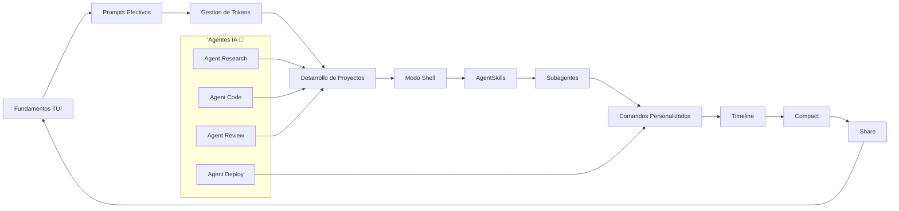
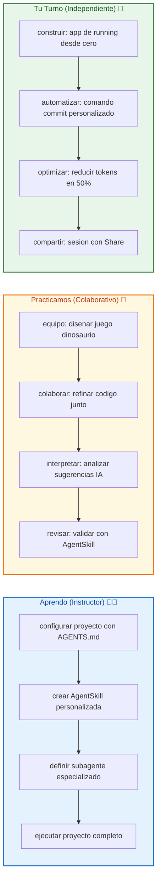
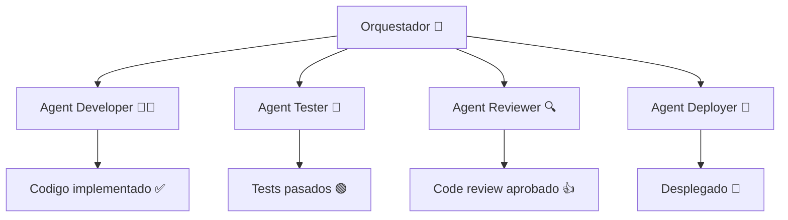

# 🚀 MASTERCLASS: OpenCode - Domina la Terminal con IA 🖥️✨

## 🎯 INTRODUCCIÓN: POR QUÉ ESTE MASTERCLASS CAMBIA TODO 💡

El desarrollo tradicional hoy funciona así: abres el editor ✍️, escribes código 📝, consultas la documentación en otra pestaña 🗂️, pruebas en consola 🧪, buscas errores en Stack Overflow 🔍 y repites el ciclo cincuenta veces por día. 😮‍💨🥱

OpenCode propone otro flujo: **una terminal inteligente 🤖 donde la IA entiende tu proyecto 🧠, ejecuta comandos reales ⚡, recuerda el contexto 🧵 y automatiza tareas repetitivas 🔁**. No se trata de reemplazar al programador 👨‍💻. Se trata de tener un copiloto que vive en tu terminal y conoce tu código 🏠.

En esta masterclass aprenderás a dominar OpenCode desde cero hasta técnicas avanzadas que usan profesionales 🎓. Construirás proyectos reales 🏗️, configurarás agentes especializados 🧩 y automatizaras tu flujo de trabajo completo 🔄. 🎓

> **🎯 Objetivo de Aprendizaje** — Al final de esta guía podrás navegar la TUI de OpenCode 🖥️, crear AgentSkills personalizados 🧩, configurar subagentes 👥, optimizar tokens 🪙, automatizar tareas con comandos personalizados ⚡ y construir aplicaciones completas 🚀 con asistencia de IA.

> **⚠️ Advertencia** — OpenCode acelera el desarrollo ⚡, pero no elimina la necesidad de entender lo que haces 🧠. Verifica siempre el código generado ✅. La IA es un acelerador 🚀, no un substituto de la lógica.

---

## 🗺️ MAPA DEL WORKFLOW 🗺️



| Fase 🧩 | Pregunta que responde ❓ | Output principal 🎯 |
|------|-----------------------|------------------|
| **Fundamentos TUI** 🖥️ | ¿Como interactuar con OpenCode? 👆 | Dominio de la interfaz 🎮 |
| **Prompts Efectivos** ✨ | ¿Como obtener mejores respuestas? 💬 | Prompts optimizados 🚀 |
| **Gestion de Tokens** 🪙 | ¿Como ahorrar costos? 💰 | Estrategias de optimizacion 📈 |
| **Desarrollo de Proyectos** 🛠️ | ¿Como construir con IA? 🏗️ | Proyectos funcionales ✅ |
| **Modo Shell** 💻 | ¿Como ejecutar comandos? ⚡ | Automatizacion real 🔄 |
| **AgentSkills** 🧩 | ¿Como habilitar capacidades? 🔌 | Skills instaladas 🎯 |
| **Subagentes** 👥 | ¿Como dividir tareas? 🧩 | Agentes especializados 🤖 |
| **Comandos Personalizados** ⚡ | ¿Como repetir tareas? 🔁 | Shortcuts productivos 🚀 |
| **Timeline** 📅 | ¿Como navegar el historial? ⏳ | Contexto recuperado 🧵 |
| **Compact** 🗜️ | ¿Como resumir sesiones? 📝 | Contexto limpio ✨ |
| **Share** 🔗 | ¿Como compartir sesiones? 🌐 | URL comparticion 🔗 |

---




---

## 📋 PARTE 1: FUNDAMENTOS Y TUI — EL LABORATORIO DE DESARROLLO 🧪

### 1.1 🖥️ Que es la TUI de OpenCode 🖥️

La interfaz TUI (Terminal User Interface) de OpenCode transforma tu terminal en un entorno de desarrollo inteligente 🧠. No es una CLI simple. Es un workspace interactivo 🎮 donde el contexto del proyecto, el historial de conversaciones y la ejecución de comandos conviven en la misma pantalla.

**Componentes principales de la TUI 🧩:**

| Componente 🧩 | Funcion ⚙️ | Atajo ⌨️ |
|-----------|---------|--------|
| **Chat Input** | Escribir prompts a la IA 💬 | Tecla para escribir |
| **History Panel** | Ver prompts anteriores 📜 | Navegacion con flechas |
| **File Tree** | Ver archivos del proyecto 📁 | Explorador lateral |
| **Diff View** | Ver cambios de codigo 🔍 | Visual diff |
| **Terminal** | Ejecutar comandos del sistema 💻 | Modo shell |
| **Status Bar** | Informacion de modelo y tokens 📊 | Inferior |

### 1.2 🎨 Como realizar prompts efectivos 💡

Un prompt efectivo en OpenCode no es solo una pregunta ❓. Es un documento tecnico conciso 📄 que incluye contexto 🧵, restricciones ⛓️ y formato esperado.

**Estructura de prompt profesional:**

```
🎯 Objetivo claro:
- Que quiero lograr
- Por que es importante

🧵 Contexto:
- Archivos relevantes
- Tecnologias involucradas
- Restricciones conocidas

📝 Formato de salida:
- Como debe presentarse el resultado
- Estructura de archivos si aplica

✅ Validacion:
- Como verifico que funciono
```

### 1.3 💾 Gestion del historial y contexto 🧵

OpenCode guarda el historial completo de tu sesion 📖. Pero no todo el historial es relevante todo el tiempo ⏳.

| Comando ⚡ | Funcion 🎯 | Cuando usar 🕐 |
|---------|---------|-------------|
| **`Timeline`** 📅 | Visualizar historial de prompts | Buscar idea anterior 🔍 |
| **`Compact`** 🗜️ | Resumir sesion actual | Reducir tokens 🪙 sin perder contexto 🧵 |
| **`Share`** 🔗 | Compartir sesion por URL | Colaborar 🤝 o documentar 📝 |

### 1.4 🛠️ Estructura minima del proyecto 🏗️

```text
mi-proyecto-opencode/
├── AGENTS.md 🤖
├── SPEC.md 📄
├── src/
│   ├── main.py 🐍
│   ├── utils.py 🧩
│   └── config.py ⚙️
├── tests/
│   └── test_main.py 🧪
├── docs/
│   └── README.md 📖
└── skills/
    └── mi-skill.md 🧩
```

---

## 💻 PARTE 2: GESTION DE TOKENS Y COSTES 🪙💰

### 2.1 💡 Por que los tokens importan 💡

Los modelos de lenguaje cobran por tokens procesados 🪙💸. En una sesion larga de desarrollo, el contexto puede crecer rapidamente 🔝. Entender como funciona el conteo 📊 te permite ahorrar dinero sin sacrificar productividad 📈.

> **📌 Idea clave** — Un token es aproximadamente 4 caracteres 🔤. Un prompt largo ➕ respuesta larga = muchos tokens 🪙 = costo alto 💰.

### 2.2 📈 Estrategias de ahorro de tokens 📊

| Estrategia 🧩 | Ahorro estimado 📈 | Dificultad 📊 |
|-----------|----------------|-----------|
| **Compact regular** 🗜️ | 30-50% | Baja |
| **Prompts concisos** ✨ | 20-40% | Baja |
| **Reusar contexto** ♻️ | 40-60% | Media |
| **Elegir modelo adecuado** 🎯 | Variable | Media |
| **Dividir tareas grandes** 🧩 | 50-70% | Alta |

### 2.3 🧠 Compact: El comando magico ✨

El comando `Compact` resume tu sesion actual 🗜️, preservando el contexto esencial 🧵 y eliminando repeticiones 🗑️. Es como un compresor de contexto.

**Cuando usar Compact ⏰:**

- 🕐 Antes de una nueva fase de desarrollo 🚀
- 📊 Cuando el historial supera los 50 mensajes
- 🔄 Cuando cambias de tema radicalmente
- 📅 Diariamente como rutina de limpieza

### 2.4 🎛️ OpenCode GO: Modelos de pago 💰

OpenCode GO ofrece modelos de pago con ventajas 💎:

| Modelo 🎯 | Ventaja ✅ | Mejor para 🎯 |
|--------|---------|-----------|
| **GO Mini** 🪙 | Rapido y economico | Tareas simples 📝 |
| **GO** ⚖️ | Balance costo/rendimiento | Desarrollo diario 🛠️ |
| **GO Pro** 🚀 | Maximo rendimiento | Tareas complejas 🧩 |

> **💡 Pro tip** — Usa GO Mini para prototipar 🪙 y GO Pro solo cuando necesites razonamiento profundo 💡. Ahorras tokens 🪙 y dinero 💰 sin perder calidad ✅.

### 2.5 📈 Monitoreo de uso 📊

OpenCode muestra el uso de tokens 🪙 en tiempo real ⏱️. Aprovecha esta informacion 📊 para:

- 🔍 Identificar prompts excesivamente largos
- 📝 Descubrir respuestas que incluyen demasiado codigo
- 🎯 Ajustar tu estilo de prompting

---

## 🎮 PARTE 3: DESARROLLO DE PROYECTOS 🛠️🚀

### 3.1 🦕 El juego del dinosaurio: Proyecto practico 🎮

Construir un juego del dinosaurio 🦕 (estilo Chrome offline 🌐) es el proyecto clasico para aprender OpenCode 📚. Vamos a desglosarlo 🔍.

**Estructura del proyecto 🏗️:**

```text
dino-game/
├── SPEC.md 📄
├── AGENTS.md 🤖
├── index.html 🌐
├── style.css 🎨
├── game.js ⚡
└── README.md 📖
```

**SPEC.md - Especificacion del proyecto 📄:**

```markdown
# 🦕 Dino Game - Especificacion

## 🎯 Objetivo
Juego de dinosaurio con graficos CSS 🎨, obstaculos aleatorios 🧩 y puntuacion 📊.

## 📜 Reglas
- Saltar con barra espaciadora ⬆️
- Agacharse con flecha abajo ⬇️
- Velocidad aumenta progresivamente ⚡
- Colision = fin del juego 💥

## ⛓️ Restricciones
- Sin frameworks externos 🚫
- Solo HTML 🗂️, CSS 🎨 y JS vanilla ⚡
- Responsive para movil 📱
```

**AGENTS.md - Restricciones para la IA 🤖:**

```markdown
# Agentes del Proyecto 🤖

## ⚠️ Restricciones
- 🚫 Nunca usar bibliotecas externas
- 📝 Mantener codigo en un solo archivo JS
- 🧪 Validar en consola del navegador
- 🚫 No generar alert() nativas

## 📋 Estructura esperada
- 📄 game.js: logica principal
- 🎨 style.css: estilos del juego
```

### 3.2 🏃 App de running: Proyecto avanzado 🏃‍♂️

La aplicacion de running 🏃‍♂️ es un proyecto mas complejo 🧩 que combina frontend 🌐, almacenamiento local 💾 y visualizacion de datos 📊.

**Caracteristicas a implementar ✅:**

| Feature ⚡ | Descripcion 📝 | Complejidad 📊 |
|---------|-------------|------------|
| **Registro de carreras** 📝 | Guardar distancia y tiempo ⏱️ | Baja |
| **Visualizacion de progreso** 📈 | Graficos de mejora | Media |
| **Historial** 📜 | Lista de entrenamientos | Baja |
| **Metas** 🎯 | Objetivos personalizados | Media |
| **Calculos** 🔢 | Ritmo, distancia, calorias | Media |

**Flujo de trabajo con OpenCode 🔄:**

1. 📄 Definir `SPEC.md` con funcionalidades
2. 🤖 Configurar `AGENTS.md` con restricciones
3. 🚀 Pedir a OpenCode estructura base
4. 🔁 Iterar feature por feature
5. 🧩 Usar `AgentSkills` para testing y SEO
6. ✅ Validar con tests automaticos

### 3.3 📝 Especificaciones efectivas ✨

Una buena especificacion 📄 es la diferencia entre un proyecto exitoso ✅ y uno caotico 🚫.

**Elementos esenciales de SPEC.md:**

| Elemento 🧩 | Ejemplo 📝 |
|----------|---------|
| **Descripcion** 📋 | Juego de memoria con cartas 🃏 |
| **Funcionalidades** ✨ | Emparejar, puntuar, reiniciar |
| **Tecnologias** 💻 | HTML, CSS, JS vanilla ⚡ |
| **Restricciones** ⚠️ | Sin dependencias externas 🚫 |
| **Criterios de exito** ✅ | 100% pruebas pasan |

### 3.4 🤖 AGENTS.md: Controlando a la IA ⛓️

El archivo `AGENTS.md` es tu contrato 📄 con OpenCode 🤖. Define lo que la IA puede 🔓 y no puede hacer ❌ en tu proyecto.

**Restricciones comunes ⚠️:**

- 🚫 Nunca modificar archivos fuera de `/src`
- 📝 Mantener convenciones de nomenclatura
- 💬 Incluir comentarios en cada funcion
- 🏗️ Respetar patrones de arquitectura existentes
- 🚫 No generar codigo de ejemplo sin implementar

---

## 🤖 PARTE 4: AUTOMATIZACION Y AGENTES 🧩✨

### 4.1 🛠️ AgentSkills: Capacidades especializadas 🧩

Los AgentSkills 🧩 son modulos 🔌 que expanden las capacidades de OpenCode para tareas especificas 🎯. Piensalos como plugins 🌐 o extensiones 🧩.

**Skills populares:**

| Skill 🧩 | Funcion ⚙️ | Uso 🎯 |
|-------|---------|-----|
| **SEO** 🔍 | Optimizar meta tags y contenido | Proyectos web 🌐 |
| **Testing** 🧪 | Generar tests automaticos | Calidad de codigo ✅ |
| **Docker** 🐳 | Crear Dockerfiles | Despliegue 🚀 |
| **Docs** 📖 | Generar documentacion | Proyectos grandes 🏗️ |
| **Video** 🎬 | Crear contenido con Hyperframes | Marketing 📢 |

### 4.2 🔧 Instalando AgentSkills 🔧

```bash
# 🎯 Ver skills disponibles
opencode skills list

# 🚀 Instalar skill
opencode skills install seo

# ⚙️ Configurar skill
opencode skills config seo --api-key=tu_key
```

### 4.3 👥 Subagentes: Dividir y conquistar 🧩✨

Los subagentes 👥 son versiones especializadas 🤖 de la IA que trabajan en tareas especificas 🎯. Permiten dividir problemas complejos 🧩 en partes manejables 📦.

**Arquitectura de subagentes 🏗️:**



### 4.4 🎬 Hyperframes: Videos promocionales automaticos 🎬✨

Hyperframes 🎬 es una skill 🧩 que genera videos promocionales a partir de tu codigo 🎥. Captura la interfaz 📸, agrega transiciones 🎞️ y exporta contenido listo para redes 📢.

| Paso 🚶 | Accion ⚡ | Output 🎯 |
|------|--------|--------|
| 1️⃣ 📸 | Capturar pantalla | Frames del juego 🎮 |
| 2️⃣ 🎞️ | Agregar transiciones | Video fluido 🎥 |
| 3️⃣ 📤 | Exportar | MP4 listo para compartir 🚀 |

---

## ⚡ PARTE 5: PERSONALIZACION Y PRODUCTIVIDAD ✨🚀

### 5.1 ⚡ Comandos personalizados ⚡

Los comandos personalizados ⚡ son atajos 🚀 para tareas recurrentes 🔁. En lugar de escribir el mismo prompt una y otra vez 🔄, defines un comando una vez ✅ y lo reutilizas ♻️.

**Ejemplo: Comando de commit 📝**

```yaml
# .opencode/commands/commit.md
📌 name: commit
📝 description: Generar mensaje de commit convencional
📥 args:
  - 🧩 type: string
    📛 name: scope
    📋 description: "Scope del cambio: feat, fix, docs, etc"
📄 template: |
  Genera un mensaje de commit convencional siguiendo el formato:
  <type>(<scope>): <description>

  Tipo: {args.scope}
  Cambios: {changes}
  Contexto: {context}
```

**Uso ✨:**

```
💾 /commit feat
🐛 /commit fix
📖 /commit docs
```

### 5.2 🔄 Automatizando flujos completos 🔄✨

OpenCode permite automatizar secuencias de comandos ⚡:

```yaml
# .opencode/workflows/deploy.yml
📌 name: Deploy
📋 steps:
  - ▶️ run: tests
  - 🏗️ run: build
  - 🧪 run: lint
  - 🚀 run: deploy-staging
```

### 5.3 🎯 Argumentos dinamicos 🎯✨

Los argumentos dinamicos 🎯 permiten parametrizar comandos ⚡:

```
👤 /users create --name=Juan --role=admin
🏗️ /project scaffold --type=react --state=typescript
```

| Argumento 🎯 | Tipo 📝 | Ejemplo 📋 |
|-----------|------|---------|
| 🏷️ --name | 📝 String | Nombre del proyecto |
| 🔽 --type | Enum | react, vue, svelte |
| 🔢 --count | Number | Cantidad de archivos |
| 🔘 --force | Boolean | Sobrescribir archivos |

---

## ✨ PARTE 6: FUNCIONALIDADES DESTACADAS 💎✨

### 6.1 💻 Modo Shell 💻⚡

El Modo Shell 💻 permite ejecutar comandos reales ⚡ del sistema directamente desde OpenCode 🤖. No necesitas cambiar de ventana 🪟.

```bash
# 📍 Desde OpenCode
💡 $ npm install express
📂 $ git status
🧪 $ pytest tests/
▶️ $ node server.js
```

**🔒 Seguridad:** OpenCode pide confirmacion ✅ antes de comandos destructivos ⚠️.

### 6.2 📅 Timeline: Navegando el tiempo ⏳✨

Timeline 📅 es la herramienta 🛠️ para visualizar 📊 y navegar 🧭 por el historial de prompts 💬. Branching visual 🎨 de tu proceso creativo 💡.

| Accion ⚡ | Funcionalidad 🎯 |
|--------|---------------|
|⬆️⬇️ flecha arriba/abajo| 🧭 Navegar entre prompts |
| 🔍 Ctrl+R | 🔍 Buscar en historial |
| ▶️ Enter | 🔁 Reejecutar prompt anterior |
| ✏️ Shift+Enter | ✏️ Editar y reenviar |

### 6.3 🗜️ Compact: Resumiendo sin perder contexto ✨🧠

El comando Compact 🗜️ resume sesiones largas 📖 preservando la informacion relevante 🎯.

**Antes de Compact 📉:**
- 📊 80 mensajes en historial
- 🪙 15,000 tokens de contexto
- 🧩 Varios temas mezclados

**Despues de Compact 📈:**
- 📝 20 mensajes esenciales
- 🪙 3,000 tokens optimizados
- 🧵 Contexto limpio y enfocado

### 6.4 🔗 Share: Colaboracion sin friccion 🤝✨

Share 🔗 genera una URL 🌐 con tu sesion completa para compartir con equipo 🤝 o documentar soluciones 📝.

```
🔗 https://opencode.ai/s/xK9mP2
```

**Casos de uso ✨:**

- 🐛 Reportar bugs con contexto completo
- 📝 Documentar soluciones complejas
- 🎓 Ensenar flujos de trabajo
- 🔍 Colaborar en revision de codigo

---

## 🔧 PARTE 7: CONFIGURACION AVANZADA ⚙️✨

### 7.1 📄 El archivo de configuracion 📄

OpenCode usa `opencode.json` 🗂️ para configuracion global 🌍:

```json
{
  "providers": {
    "openai": {
      "apiKey": "tu_api_key"
    }
  },
  "defaultModel": "gpt-4-turbo",
  "contextWindow": 128000,
  "telemetry": false,
  "theme": "dark"
}
```

### 7.2 🎨 Temas y personalizacion 🎨✨

| Tema 🎨 | Descripcion 📝 | Mejor para 🎯 |
|------|-------------|-----------|
| **🌙 Dark** | Fondo oscuro 🌑 | Desarrollo nocturno 🌙 |
| **☀️ Light** | Fondo claro 🌕 | Presentaciones 📊 |
| **High Contrast** | Accesibilidad ♿ | Vista cansada 👀 |

### 7.3 🔌 MCPs y extensiones 🔌✨

Los MCPs (Model Context Protocol) 🔌 extienden OpenCode 🤖 con capacidades adicionales ➕:

| MCP 🔌 | Funcionalidad ⚙️ |
|-----|--------------|
| **📁 filesystem** | Acceso a archivos avanzado |
| **🔗 github** | Integracion con repos |
| **🗄️ database** | Consultas directas |
| **🌐 web** | Busquedas en vivo |

---

## 🚦 PARTE 8: WORKFLOW PROFESIONAL DE DESARROLLO 🏗️♻️

### 8.1 🔄 Ciclo de desarrollo con OpenCode 🔄✨

```
1. 📄 Escribir SPEC.md
2. 🤖 Configurar AGENTS.md
3. 🚀 Generar estructura base
4. 🔁 Iterar feature por feature
5. 🧪 Ejecutar tests
6. 🪙 Optimizar tokens con Compact
7. ⚡ Automatizar con comandos
8. 🔗 Compartir con Share
```

### 8.2 📝 Especificaciones efectivas ✨

Una buena especificacion 📄 es la diferencia entre un proyecto exitoso ✅ y uno caotico 🚫.

**Elementos esenciales de SPEC.md 📋:**

| Elemento 🧩 | Ejemplo 📝 |
|----------|---------|
| **📋 Descripcion** | Juego de memoria con cartas 🃏 |
| **✨ Funcionalidades** | Emparejar, puntuar, reiniciar |
| **💻 Tecnologias** | HTML, CSS, JS vanilla ⚡ |
| **⚠️ Restricciones** | Sin dependencias externas 🚫 |
| **✅ Criterios de exito** | 100% pruebas pasan |

### 8.3 🤖 Restricciones en AGENTS.md ⛓️✨

El archivo `AGENTS.md` es tu contrato 📄 con OpenCode 🤖. Define lo que la IA puede 🔓 y no puede hacer ❌ en tu proyecto.

**Restricciones comunes ⚠️:**

- 🚫 Nunca modificar archivos fuera de `/src`
- 📝 Mantener convenciones de nomenclatura
- 💬 Incluir comentarios en cada funcion
- 🏗️ Respetar patrones de arquitectura existentes
- 🚫 No generar codigo de ejemplo sin implementar

---

## 🎓 PARTE 9: I DO / WE DO / YOU DO 🎓✨

### 9.1 🏫 I Do — Configuracion inicial guiada 🏫✨

**🎯 Objetivo:** configurar un proyecto con OpenCode desde cero 🚀.

| Paso 🚶 | Accion ⚡ | Resultado esperado ✅ |
|------|--------|--------------------|
| 1️⃣ 📁 | Crear carpeta del proyecto | Directorio vacio |
| 2️⃣ 🚀 | Iniciar OpenCode en la carpeta | TUI activa 🖥️ |
| 3️⃣ 📄 | Crear SPEC.md | Documento de especificacion |
| 4️⃣ 🤖 | Crear AGENTS.md | Restricciones definidas ⚠️ |
| 5️⃣ 🏗️ | Pedir estructura base | 📁 Archivos generados |

```bash
mkdir mi-juego
cd mi-juego
opencode
```

**Interpretacion guiada 💡:**

- 📄 El archivo `SPEC.md` es tu contrato con la IA
- 🤖 `AGENTS.md` evita que la IA haga cosas fuera de lo planeado
- ✅ Siempre valida el codigo generado antes de ejecutarlo

### 9.2 👥 We Do — Crear un AgentSkill en equipo 👥✨

**🎯 Escenario:** necesitan automatizar la generacion de tests 🧪 para su proyecto.

**📝 Tarea colaborativa:** crear un AgentSkill 🧩 de testing 🧪.

| Decision 🎯 | Opcion recomendada ✅ | Justificacion 💡 |
|----------|--------------------|---------------|
| 🔔 Trigger | Cuando se modifica un archivo .py 🐍 | Ejecucion automatica ⚡ |
| 🧪 Framework | pytest | Estandar en Python 🐍 |
| 📋 Estructura | AAA (Arrange-Act-Assert) | Claridad ✨ |
| 📊 Coverage | Minimo 80% | Calidad minima ✅ |

```bash
opencode skills create testing
opencode skills config testing --framework=pytest
```

### 9.3 🎯 You Do — Automatizar con comandos personalizados ⚡✨

**📝 Tarea:** crea un comando personalizado ⚡ para generar commits 📝 convencionales ✅.

| Criterio 📊 | Peso 📈 |
|----------|------|
| 📋 Formato correcto | 25% |
| 🎯 Scope valido | 25% |
| 💡 Descripcion clara | 20% |
| 🔗 Integracion con git | 20% |
| ♻️ Reutilizable | 10% |

```yaml
# .opencode/commands/git-commit.md
📌 name: commit
📥 args:
  - 🧩 type: string
    📛 name: type
    📋 enum: [feat, fix, docs, style, refactor, test, chore]
📄 template: |
  Genera mensaje de commit convencional:
  {args.type}: {description}
  Contexto: {context}
```

### 9.4 🔍 I Do — Optimizacion de tokens 🔍✨

**🎯 Objetivo:** reducir el consumo de tokens 🪙 sin perder productividad 📈.

| Escenario 📊 | Tokens antes 📉 | Tokens despues 📈 | Tecnica ⚡ |
|-----------|-------------|----------------|---------|
| Prompt largo 📝 | 2,500 | 1,100 | 🗜️ Compact |
| Respuesta verbosa 📝 | 3,000 | 800 | ✨ Especificar formato |
| Multiples archivos 📁 | 4,000 | 2,000 | 🎯 Solo relevantes |

### 9.5 👥 We Do — Configurar subagente especializado 👥✨

**🎯 Escenario:** necesitan un agente 🤖 que solo se dedique a testing 🧪.

| Paso 🚶 | Accion ⚡ |
|------|--------|
| 1️⃣ 🤖 | Definir rol en AGENTS.md |
| 2️⃣ 🧪 | Especificar framework de testing |
| 3️⃣ ⚡ | Configurar trigger automatico |
| 4️⃣ 📊 | Definir formato de reporte |

### 9.6 🎯 You Do — Diseño de workflow automatizado 🎯✨

**📝 Tarea:** diseña un workflow completo 🔄 de deploy automatico 🚀.

| Widget 🧩 | Accion ⚡ | Alerta 🔔 |
|--------|--------|--------|
| 🧪 Tests | 🚀 Ejecutar suite | ❌ Fallos detectados |
| 🧹 Lint | ✅ Validar formato | ⚠️ Errores de estilo |
| 🏗️ Build | 🚀 Compilar proyecto | ❌ Errores de compilacion |
| 🚀 Deploy | 📤 Subir a produccion | ✅ Exito o fallo |
| 📢 Notify | 📨 Enviar notificacion | 📊 Status final |

---

## ✅ PARTE 10: CHECKLIST Y VERIFICACION ✅✨

### 10.1 🔧 Checklist de configuracion inicial 🔧✨

| Bloque 🧩 | Check ✅ |
|--------|-------|
| 💻 OpenCode instalado | 📦 Version actualizada |
| 🔑 API keys configuradas | 🎯 Proveedor valido |
| 📁 Carpeta de proyecto | 🏗️ Estructura creada |
| 📄 SPEC.md definido | 🎯 Objetivos claros |
| 🤖 AGENTS.md configurado | ⚠️ Restricciones establecidas |
| 🧩 AgentSkills instaladas | 🎯 Skills necesarias activas |

### 10.2 📊 Checklist de optimizacion 📊✨

| Bloque 🧩 | Check ✅ |
|--------|-------|
| 🗜️ Compact regular | 🧵 Sesiones limpias |
| 🪙 Tokens monitoreados | 📈 Uso controlado |
| ✨ Prompts optimizados | 🚫 Sin repeticiones innecesarias |
| 🎯 Modelo adecuado | 🪙 GO Mini para tareas simples |
| 🧵 Contexto enfocado | 🚫 Sin informacion irrelevante |

### 10.3 🤖 Checklist de automatizacion 🤖✨

| Bloque 🧩 | Check ✅ |
|--------|-------|
| ⚡ Comandos personalizados | 🚀 Shortcuts definidos |
| 👥 Subagentes configurados | 🎯 Roles claros |
| 🔄 Workflows definidos | ♻️ Flujos automatizados |
| ⚡ Triggers configurados | ⏱️ Ejecucion automatica |
| ✅ Validaciones activas | 🧪 Tests y lint |

### 10.4 🔒 Checklist de seguridad 🔒✨

| Bloque 🧩 | Check ✅ |
|--------|-------|
| ✅ Confirmacion comandos | 💻 Modo shell seguro |
| ⚠️ Restricciones AGENTS.md | 🚫 Sin archivos externos |
| 🔑 Variables de entorno | 🛡️ Secrets protegidos |
| ✅ Validacion de output | 💻 Codigo verificado |

---

## 📝 PARTE 11: PREGUNTAS DE VERIFICACION 📝✨

Responde cada pregunta basandote en los conceptos de esta master class 📚. Escribe tus respuestas o compartelas para profundizar tu aprendizaje 📝. 📝

### 📚 Preguntas sobre Fundamentos TUI 🖥️✨

1. **✏️ Aplica**: Tu equipo adopta OpenCode 🤖 pero hay resistencia 📉 por la curva de aprendizaje 📈. Que 3 funcionalidades enseñas primero para mostrar valor inmediato 📈?

2. **🔍 Analiza**: Compara una sesion tipica 📋 de desarrollo antes y despues de OpenCode. Que etapas se eliminan 🗑️, cuales se aceleran ⚡?

### 📚 Preguntas sobre Gestion de Tokens 🪙✨

3. **🔢 Calcula**: Un proyecto genera 50,000 tokens 🪙 por sesion. Si implementas Compact 🗜️ cada 20 mensajes, cual es tu ahorro estimado porcentual 📈?

4. **💭 Reflexiona**: En que situaciones vale la pena usar un modelo de pago 💰 (GO) versus el modelo gratuito 🆓? Cual es tu criterio de decision 🎯?

### 📚 Preguntas sobre Proyectos 🛠️✨

5. **✏️ Diseña**: Crea una especificacion 📄 para un clon de Tetris 🎮. Define el minimo viable en SPEC.md 📄 y las restricciones ⚠️ en AGENTS.md.

6. **✅ Evalua**: Por que es importante separar la especificacion 📄 de las restricciones ⚠️? Que pasa si mezclas ambos 🚫?

### 📚 Preguntas sobre Automatizacion 🤖✨

7. **🔗 Conecta**: Explica como los AgentSkills 🧩 y los subagentes 👥 se complementan. Que tipo de tarea va en cada uno 🎯?

8. **💡 Propón un sistema**: Diseña un stack 🏗️ de AgentSkills 🧩 para un proyecto de e-commerce 🛒. Que skills necesitas y en que orden ⏱️ se ejecutan?

### 📚 Preguntas Integradoras 🔗✨

9. **🧠 Sintetiza**: Toma una tarea de desarrollo real 🎯 (ej: login con OAuth 🔐) y planificala completa usando todas las funcionalidades de OpenCode 🤖.

10. **💭 Reflexion final**: De todas las funcionalidades de OpenCode 🤖, cual crees que es la mas transformadora ✨ para el dia a dia 📅 de un desarrollador? Por que 💡?

---

## 📚 GLOSARIO RAPIDO 📖✨

| Termino 📝 | Definicion 📋 |
|---------|------------|
| **TUI** 🖥️ | Interfaz de usuario para terminal |
| **Token** 🪙 | Unidad basica de texto procesada por la IA |
| **AgentSkill** 🧩 | Modulo de capacidad especializada |
| **Subagente** 👥 | Agente con rol especifico 🎯 |
| **Compact** 🗜️ | Comando para resumir contexto 🧵 |
| **Timeline** 📅 | Historial visual de prompts 💬 |
| **Share** 🔗 | Funcionalidad para compartir sesiones 🤝 |
| **MCP** 🔌 | Model Context Protocol |
| **SPEC.md** 📄 | Archivo de especificacion |
| **AGENTS.md** 🤖 | Archivo de restricciones ⚠️ |
| **OpenCode GO** 💰 | Modelos de pago |
| **Prompt** 💬 | Instruccion enviada a la IA |

---

## 📐 ANEXO: FORMATO IDEAL PARA MASTERCLASS EDUCATIVAS 📐✨

### 📏 Estructura visual recomendada 📏✨

El ancho optimo 📏 para masterclasses educativas es **60–75 caracteres por linea** 📐.

```css
.article-content {
  🎨 font-size: 18px;
  📏 line-height: 1.75;
  📐 max-width: 65ch;
}
```

### 📊 Jerarquia visual muy clara 📊✨

El usuario deberia poder "escanear" 📊 el contenido sin leerlo 📖.

| Elemento 🧩 | Tamano recomendado 📏 |
|----------|------------------|
| H1 | 40–56 px |
| H2 | 28–36 px |
| H3 | 22–28 px |
| 🅿️ Parrafos | 18–20 px |

### 🅿️ Parrafos cortos 🅿️✨

El cerebro percibe los bloques grandes como "trabajo" 💼.

Mejor ✅:

- 🖥️ Imagina la TUI como tu nuevo entorno de trabajo.
- 🧠 OpenCode entiende tu proyecto completo.
- 🧩 Los AgentSkills automatizan tareas repetitivas.
- ⚡ Los comandos personalizados son tus shortcuts.

Peor 🚫:

- Imagina la TUI como tu nuevo entorno de trabajo donde OpenCode entiende tu proyecto completo mientras los AgentSkills automatizan tareas repetitivas y los comandos personalizados son tus shortcuts...

### 📏 Espacio en blanco abundante 📏✨

Para aprendizaje profundo 📚:

```css
.article-content {
  📏 line-height: 1.75;
}
```

### 📋 Secciones cortas 📋✨

Una buena regla: **200–400 palabras 📝 por seccion** y luego un nuevo subtitulo.

### 🎨 Alternar patrones visuales 🎨✨

Cada pocas pantallas 📱, alterna entre 📊:

- 📋 Lista
- 🗺️ Diagrama
- 📊 Tabla
- ✨ Ejemplo practico
- ✅ Resumen

### 📌 Resumenes frecuentes 📌✨

Despues de cada tema 📚, agrega un cierre visual 👁️:

> **📌 Idea clave** — OpenCode es mas que un chat con IA 💬🤖. Es un workspace completo 🖥️ que entiende tu proyecto 🧠 y automatiza tu flujo de trabajo 🔄.

### 🎯 Combinacion recomendada de anchura y tamano de fuente 🎯✨

```css
.article-content {
  🎨 font-size: 18px;
  📏 line-height: 1.75;
  📐 max-width: 65ch;
}
```

Esto crea una experiencia ✨ similar a la documentacion 📖 de alta calidad 🏆 de empresas tecnologicas modernas 🏢. ✨🤖

---

## 🎯 CIERRE PRACTICO 🎯✨

| Nivel 📊 | Debes poder hacer ✨ |
|-------|------------------|
| **🏫 I Do** | ✅ Seguir una configuracion completa de OpenCode |
| **👥 We Do** | 🧩 Crear AgentSkills 🧩 y subagentes 🤖 colaborativamente |
| **🎯 You Do** | 🚀 Construir un workflow automatizado 🔄 completo |

---

## 🎁 RECURSOS ADICIONALES 🎁✨

- 📖 [📚 Documentacion oficial OpenCode](https://opencode.ai/docs)
- 🎥 [🎬 Video del curso midudev](https://www.youtube.com)
- 💻 [💻 Repositorio de ejemplos](https://github.com/opencode-ai/examples)
- 🛠️ [🛠️ Marketplace de AgentSkills](https://opencode.ai/skills)

---

## 🏆 CHECKLIST FINAL DE DOMINIO DE OPECODE 🏆✅

| Bloque 🧩 | Check ✅ |
|--------|-------|
| 🖥️ TUI dominada | 🎮 Navegas sin mirar los atajos ⌨️ |
| ✨ Prompts optimizados | ✅ Respuestas utiles en un solo intento |
| 🪙 Tokens gestionados | 🗜️ Compact y Share 🔗 como rutina 🔄 |
| 🚀 Proyecto completado | ✅ Al menos un proyecto real 🏗️ con OpenCode |
| 🧩 AgentSkills instaladas | 3+ skills 🧩 productivas ⚡ |
| 👥 Subagentes configurados | ✅ Al menos uno personalizado 🤖 |
| ⚡ Comandos personalizados | 2+ shortcuts 🚀 utiles |
| 🔄 Workflow automatizado | ✅ CI/CD 🚀 o deployment automatico |
| 🔗 Share usado | 📝 Sesiones compartidas documentadas |
| 🔒 Seguridad | ⚠️ AGENTS.md 🤖 protege tu proyecto |

---

**🎉 Felicitaciones! Has completado la masterclass de OpenCode 🤖✨. Ahora tienes todas las herramientas 🛠️ para transformar tu flujo de desarrollo 🔄.**

> **💡 Proximo paso:** Aplica lo aprendido ✨ en tu proyecto actual 🎯. Escribe tu primer SPEC.md 📄, configura AGENTS.md 🤖 y deja que OpenCode 🔄 acelere tu productividad 🚀.
