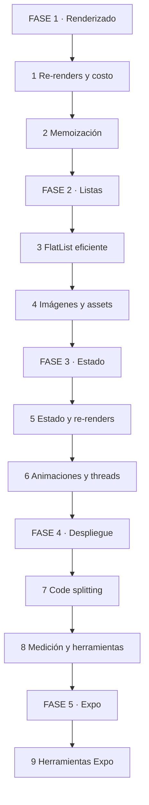
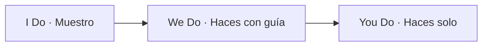
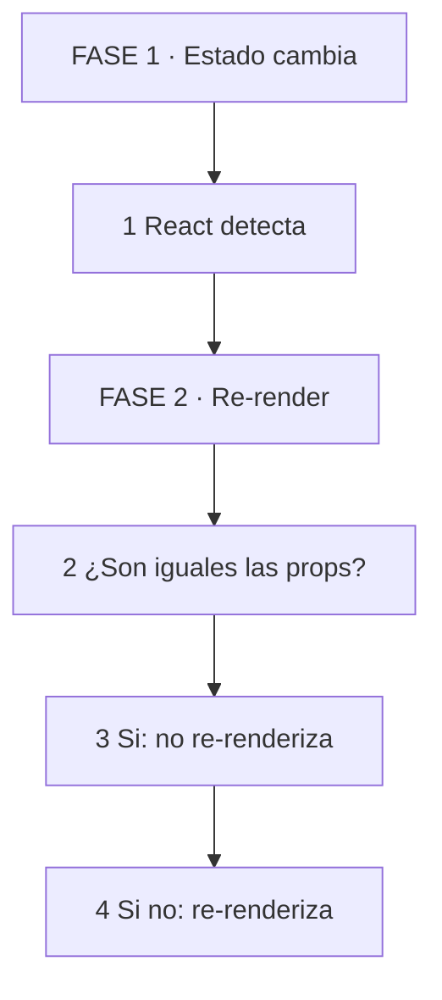
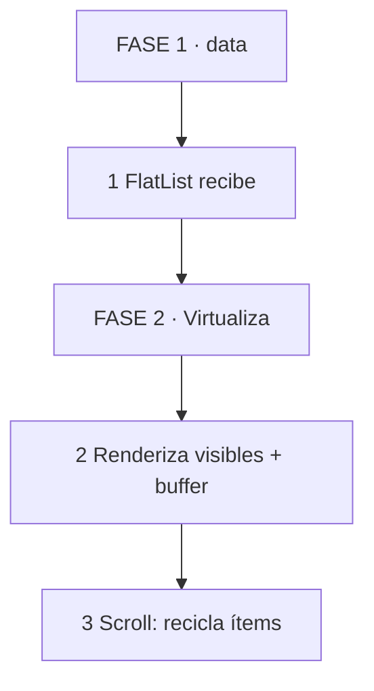
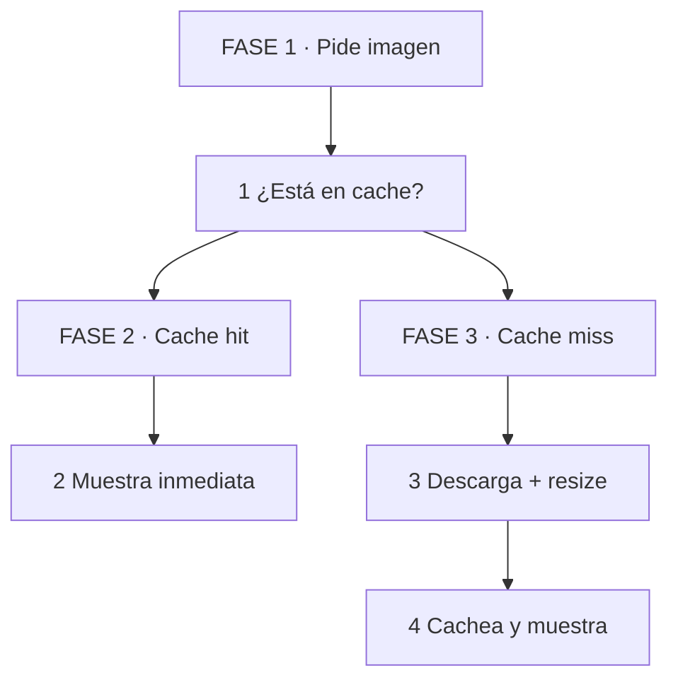
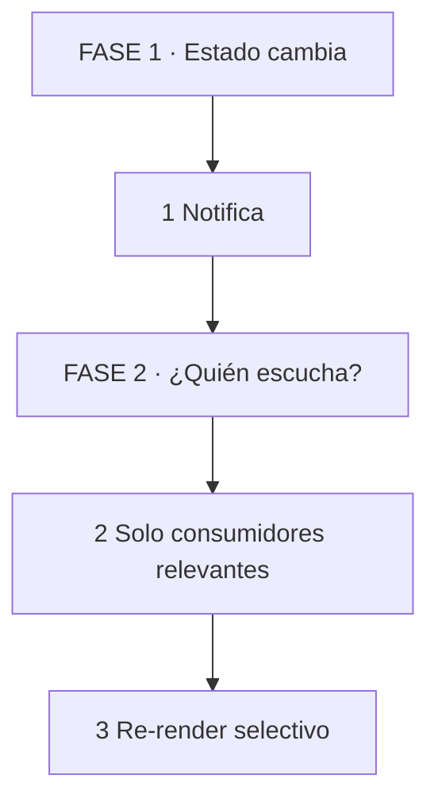
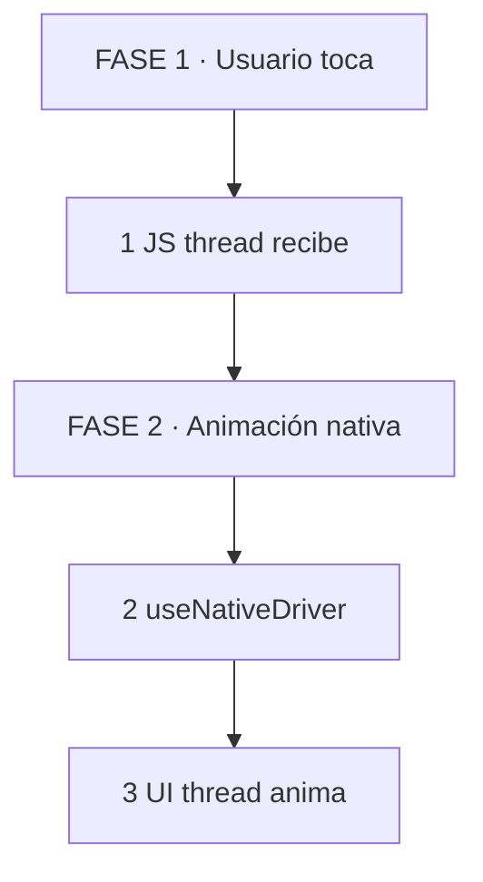
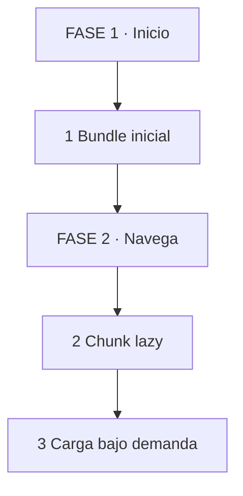
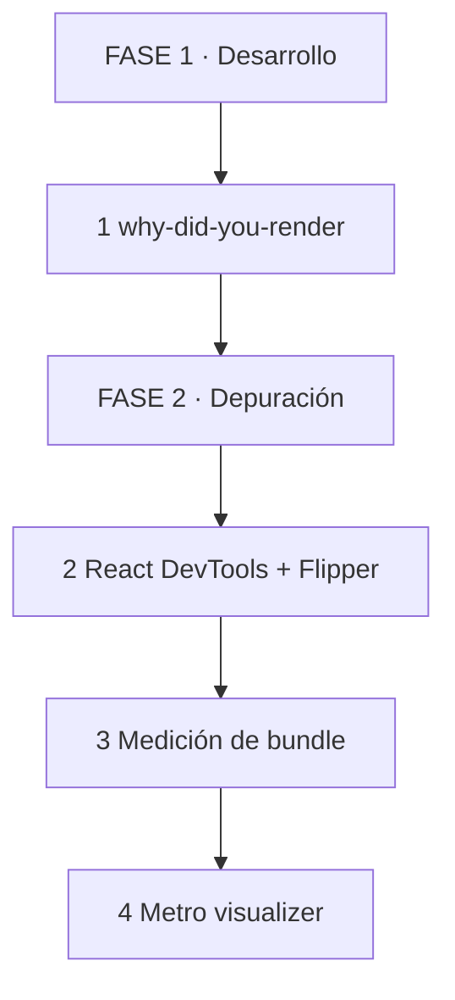
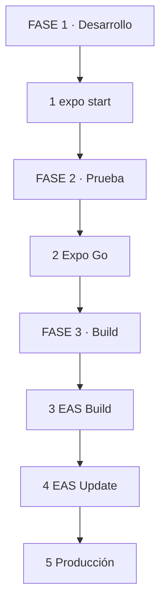

# ⚡ Patrones de optimización en React Native: Velocidad, renderizado y memoria

## 🗺️ MAPA DE LA GUÍA

*Se lee de arriba hacia abajo. Empezás por renderizado, pasás por listas y estado, terminás en despliegue, medición y herramientas Expo.*

| 🧩 Fase | ❓ Pregunta que responde | 📤 Resultado principal |
|---------|------------------------|------------------------|
| **FASE 1 · Renderizado** | ¿Por qué mi app se relentiza y cómo lo evito? | Menos re-renders |
| **FASE 2 · Listas** | ¿Cómo muestro miles de ítems sin trabar? | FlatList eficiente |
| **FASE 3 · Estado** | ¿Cómo diseño estado para no disparar renders innecesarios? | Estado localizado |
| **FASE 4 · Despliegue** | ¿Cómo mido y valido que la optimización funciona? | Métricas y herramientas |
| **FASE 5 · Expo** | ¿Qué herramientas de Expo me ayudan a medir, compilar y desplegar sin perder rendimiento? | Stack Expo productivo |

*Se lee de izquierda a derecha. Muestro el patrón, lo aplicamos juntos, lo implementás solo.*

> **🎯 Objetivo** — Al final podrás identificar re-renders innecesarios, aplicar memoización correcta, diseñar listas eficientes, elegir el estado adecuado y medir el impacto de cada cambio.
> **⚠️ Advertencia** — Optimizar sin medir es adivinar. Usá herramientas antes y después de cada cambio.

---

## 🧩 PARTE 1: RENDERIZADO — POR QUÉ SE RELENTIZA UNA APP 🧩

### 1.1 ❓ PRETEST

¿Qué es un re-render y por qué es costoso en React Native?

> Respuesta esperada: Es cuando un componente se vuelve a renderizar sin necesidad. En React Native, cada re-render ejecuta el ciclo completo: crear elementos nativos, reconciliar el árbol y posiblemente modificar la vista. En listas largas o animaciones, eso genera picos de CPU y caídas de fps.
> Si acertás: camino rápido → andá al punto 7.

### 1.2 🎯 POR QUÉ + LOGRO

Importa porque **React no renderiza solo cuando cambia la pantalla**. Renderiza cuando cambia el estado, las props o el contexto, incluso si el resultado visual es idéntico. En una app con 50 componentes por pantalla, un re-render en la raíz puede regenerar toda la jerarquía. Vas a lograr **identificar re-renders innecesarios y reducirlos con patrones claros**.

### 1.3 ⚡ VICTORIA RÁPIDA (<5 min)

Instalá `why-did-you-render` en tu proyecto. Habilitalo en un componente sencillo. Cambiá un estado en un componente hermano. Si ves re-renders sin motivo, acabas de diagnosticar el problema más común.

### 1.4 💡 CONCEPTO

Analogía: Un re-render es como **volver a pintar toda la pared porque moviste un cuadro**. Si el cuadro cambió, tal vez alcanza con repintar ese sector. Si la pared entera se vuelve a pintar, el gasto es innecesario.

Definición: Re-render = ejecución completa de un componente function body, creando un nuevo árbol de elementos React. Causas: cambio de estado local, cambio de props, cambio de contexto consumido, cambio de padre. Costo: CPU + bridge (JS → native) + layout + paint. Objetivo: reducir la frecuencia y el alcance de los re-renders.

### 1.5 👀 EJEMPLO RESUELTO

| Patrón | Antes | Después | Efecto |
|--------|-------|---------|--------|
| Inline object en props | `<Box style={{margin: 8}} />` | `const styles = useMemo(() => ({margin: 8}), [])` | No re-renderiza por style |
| Inline function | `<Button onPress={() => doIt()} />` | `const handle = useCallback(() => doIt(), [])` | No re-renderiza por onPress |
| Componente sin memo | `export default function Item() {}` | `export default React.memo(Item)` | No re-renderiza si props iguales |

*Se lee de izquierda a derecha. Estado cambia, React decide si el componente debe re-renderizar.*

### 1.6 ⚠️ CONTRA-EJEMPLO / Error Típico

Error: Memorizar todo por defecto. `React.memo` agrega un costo de comparación de props. Si el componente es muy simple o sus props cambian siempre, el memo empeora el rendimiento.

Corrección: Memorizá selectivamente. Medí primero. Si el componente es puro y recibe props complejas (objetos, funciones), memorizalo. Si es presentacional y liviano, dejalo sin memo.

### 1.7 🧪 PRÁCTICA

Abrí una pantalla con lista de ítems. Cada ítem recibe `onPress` inline y `style` inline. Identificá cuántos re-renders se generan al cambiar el estado de un ítem que no está en pantalla. Proponé la corrección.

> Respuesta esperada / criterio: Debe identificar que cada ítem se re-renderiza porque `onPress` y `style` son referencias nuevas en cada render. Corrección: `useCallback` para `onPress`, `useMemo` para `style`, `React.memo` para el ítem.

### 1.8 🔁 RECALL — Nivel Bloom: Aplicar

¿Por qué una función inline en un prop dispara re-render incluso si el componente hijo usa `React.memo`? Respondé en 1 línea.

### 1.9 📌 IDEA CLAVE

React re-renderiza por referencia, no por valor. Si la prop es una función u objeto nueva cada vez, el memo no sirve.

### 1.10 ✅ AUTO-CHEQUEO + SIGUIENTE

- [ ] Instalé y usé `why-did-you-render` para diagnosticar
- [ ] Identifiqué 3 fuentes de re-renders innecesarios
- [ ] Apliqué `useCallback` o `useMemo` donde corresponde

Siguiente: FlatList y listas eficientes.

---

## 🧩 PARTE 2: LISTAS EFICIENTES CON FLATLIST 🧩

### 2.1 ❓ PRETEST

¿Qué es la virtualización en una lista y por qué es indispensable en React Native?

> Respuesta esperada: Es la técnica de renderizar solo los ítems visibles en pantalla más un pequeño buffer. Sin virtualización, una lista de 1000 ítems crea 1000 componentes nativos, consumiendo memoria y CPU. Con virtualización, solo existen los ítems visibles.
> Si acertás: camino rápido → andá al punto 7.

### 2.2 🎯 POR QUÉ + LOGRO

Importa porque **las listas son la fuente #1 de problemas de rendimiento en apps móviles**. Un `ScrollView` con 500 tarjetas es una receta para crashes por memoria y baja de fps. FlatList con virtualización es la solución nativa. Vas a lograr **mostrar listas largas sin trabar la UI**.

### 2.3 ⚡ VICTORIA RÁPIDO (<5 min)

Reemplazá un `ScrollView` con 100 ítems por un `FlatList` con `data` y `renderItem`. Medí el fps con Flipper antes y después. La diferencia es inmediata.

### 2.4 💡 CONCEPTO

Analogía: FlatList es como **un escaparate** — solo muestra las prendas visibles desde la calle. El resto está en el depósito. Cuando el cliente se mueve, se reemplazan las prendas visibles por otras del depósito. ScrollView es como **colgar todas las prendas a la vez** — la vidriera se llena, se cae y nadie ve nada.

Definición: FlatList = componente que implementa virtualización. Solo renderiza ítems visibles + ventana. `windowSize` controla cuántos ítems extra se renderizan fuera de pantalla. `getItemLayout` proporciona alto fijo para evitar mediciones costosas. `keyExtractor` asigna clave estable por ítem. `removeClippedSubviews` elimina ítems fuera de vista para liberar memoria. En Expo, FlatList viene preconfigurado y funciona sin configuración nativa adicional.

### 2.5 👀 EJEMPLO RESUELTO

| Prop | Para qué sirve | Valor recomendado |
|------|----------------|-------------------|
| `data` | Array de ítems | Array plano, no anidado |
| `renderItem` | Componente por ítem | Componente memoizado |
| `keyExtractor` | Clave única por ítem | `item.id` |
| `getItemLayout` | Alto fijo por ítem | Si el alto es conocido |
| `windowSize` | Cantidad de ítems extra | 5-10 (default: 21) |
| `removeClippedSubviews` | Elimina ítems fuera de vista | `true` si el layout es complejo |
| `maxToRenderPerBatch` | Ítems por lote | 10-20 |
| `initialNumToRender` | Ítems iniciales | Cantidad visible en pantalla |

*Se lee de izquierda a derecha. FlatList recibe datos, virtualiza la renderización, recicla ítems al hacer scroll.*

### 2.6 ⚠️ CONTRA-EJEMPLO / Error Típico

Error: Pasar una función anónima a `renderItem`. `renderItem={() => <Item {...item} />}` crea una función nueva en cada render, invalidando cualquier memoización del ítem.

Corrección: Usá `renderItem={({ item }) => <Item {...item} />}` con componente `Item` memoizado. O separá el render en una función estable con `useCallback`.

### 2.7 🧪 PRÁCTICA

Convertí una lista de 500 productos en un `FlatList` optimizado. Definí `keyExtractor`, `getItemLayout`, `windowSize` y `removeClippedSubviews`. Medí el tiempo de carga inicial y el fps durante scroll.

> Respuesta esperada / criterio: FlatList con virtualización activa, `getItemLayout` definido, componente de ítem memoizado, fps > 55 durante scroll.

### 2.8 🔁 RECALL — Nivel Bloom: Aplicar

¿Por qué `getItemLayout` mejora el rendimiento del scroll? Respondé en 1 línea.

### 2.9 📌 IDEA CLAVE

FlatList con virtualización y props optimizadas es la base de listas rápidas. Sin virtualización, cualquier lista larga es un riesgo.

### 2.10 ✅ AUTO-CHEQUEO + SIGUIENTE

- [ ] Usé `FlatList` en toda lista con más de 20 ítems
- [ ] Definí `keyExtractor` y `getItemLayout`
- [ ] Ajusté `windowSize` y `removeClippedSubviews`
- [ ] Componente de ítem está memoizado

Siguiente: Imágenes y assets.

---

## 🧩 PARTE 3: IMÁGENES Y ASSETS 🧩

### 3.1 ❓ PRETEST

¿Qué es más costoso: cargar una imagen de 2MB en un Image nativo o en una librería con cache y resize?

> Respuesta esperada: El Image nativo decodifica la imagen completa en memoria y no cachea agresivamente. Una librería con cache, resize y lazy loading reduce el tamaño en memoria, reutiliza la imagen cacheada y evita descargas repetidas.
> Si acertás: camino rápido → andá al punto 7.

### 3.2 🎯 POR QUÉ + LOGRO

Importa porque **las imágenes suelen ser el 60-70% del peso de una pantalla y una fuente común de crashes por memoria**. Un `Image` sin optimizar carga el archivo completo, decodifica en el hilo principal y puede generar tirones. Vas a lograr **mostrar imágenes fluidas sin consumir memoria innecesaria**.

### 3.3 ⚡ VICTORIA RÁPIDA (<5 min)

Reemplazá un `<Image source={{uri: url}} />` por una imagen optimizada con resize y cache. Medí el uso de memoria con Flipper. La diferencia es visible.

### 3.4 💡 CONCEPTO

Analogía: Una imagen sin optimizar es como **imprimir una foto afiche para mirarla de lejos** — gastás tinta y papel de más. Una imagen optimizada es como **bajar la resolución al tamaño exacto que necesitás** — se ve igual pero pesa menos y carga más rápido.

Definición: Librerías como `expo-image` o `react-native-fast-image` implementan cache agresivo, resize antes de decodificar, prioridad de carga y descarte de memoria. `resizeMode` controla cómo se adapta la imagen al contenedor. Lazy loading = cargar la imagen solo cuando entra en pantalla. Cache = guardar la imagen decodificada en memoria o disco para reutilizarla. En Expo, `expo-image` viene preconfigurado en el SDK y se integra con el optimizador de assets.

### 3.5 👀 EJEMPLO RESUELTO

| Estrategia | Antes | Después | Efecto |
|-----------|-------|---------|--------|
| Resize | Imagen original 2000x2000 | `width: 100, height: 100` | Decodifica solo 100x100 |
| Cache | Descarga en cada scroll | Cache en memoria/disco | Sin descargas repetidas |
| Lazy loading | Todas cargan al inicio | Solo visibles cargan | Menos memoria inicial |
| Placeholder | Espacio vacío | Imagen borrosa o color | Percepción de velocidad |

*Se lee de izquierda a derecha. Pide imagen, revisa cache, si no está descarga y guarda.*

### 3.6 ⚠️ CONTRA-EJEMPLO / Error Típico

Error: Usar `Image` nativo con URLs grandes en una lista. Cada ítem descarga su imagen al entrar en pantalla. Si el usuario scrollea rápido, se generan decenas de descargas simultáneas y la memoria se desborda.

Corrección: Usá `expo-image` o `fast-image` con cache, prioridad de carga y lazy loading. Definí `width` y `height` fijos o `aspectRatio` para evitar layout shifts.

### 3.7 🧪 PRÁCTICA

Convertí una lista de 50 avatares en un FlatList con imágenes optimizadas. Definí cache, resize, placeholder y lazy loading. Medí el uso de memoria antes y después.

> Respuesta esperada / criterio: Imágenes con width/height definidos, cache activo, placeholder visible, uso de memoria reducido.

### 3.8 🔁 RECALL — Nivel Bloom: Aplicar

¿Por qué definir `width` y `height` en una imagen evita layout shifts costosos? Respondé en 1 línea.

### 3.9 📌 IDEA CLAVE

Imágenes optimizadas = menor memoria, menos CPU, mejor UX. Nunca muestres una imagen sin dimensiones fijas o `aspectRatio`.

### 3.10 ✅ AUTO-CHEQUEO + SIGUIENTE

- [ ] Usé librería con cache y resize
- [ ] Definí dimensiones fijas o `aspectRatio`
- [ ] Implementé lazy loading en listas
- [ ] Medí uso de memoria antes y después

Siguiente: Estado y re-renders.

---

## 🧩 PARTE 4: ESTADO Y RE-RENDERS 🧩

### 4.1 ❓ PRETEST

¿Por qué un Context que cambia frecuentemente puede relentizar toda la app?

> Respuesta esperada: Porque cualquier componente que consuma ese Context se re-renderiza cada vez que el valor cambia, incluso si solo usa una parte del estado. Si el Context contiene todo el estado global, un cambio en un contador re-renderiza toda la app.
> Si acertás: camino rápido → andá al punto 7.

### 4.2 🎯 POR QUÉ + LOGRO

Importa porque **el estado es el motor de los re-renders**. Un estado mal diseñado genera renders innecesarios en cascada. Un estado bien localizado reduce el alcance de cada cambio. Vas a lograr **diseñar estado para que cada cambio solo renderice lo necesario**.

### 4.3 ⚡ VICTORIA RÁPIDA (<5 min)

Abrí una pantalla con un contador y un formulario. Mové el estado del contador a un Context global. Si el formulario se re-renderiza al cambiar el contador, acabás de ver el problema del Context monolítico.

### 4.4 💡 CONCEPTO

Analogía: El estado es como **la red eléctrica de una casa** — si tenés un solo interruptor general, encender una luz hace que todos los aparatos se enciendan. Si tenés interruptores por ambiente, cada luz se controla independientemente.

Definición: Estado local = `useState` dentro del componente. Solo ese componente se re-renderiza. Context = estado compartido, pero consume cuidado porque todos los consumidores se re-renderizan al cambiar. Estado global externo (Zustand, Redux, Jotai) = selector permite suscribirse a una porción del estado. En Expo, `expo-secure-store` es ideal para guardar secretos sin re-renders, ya que se accede de forma asíncrona fuera del ciclo de React. Principio: localizá el estado lo más cerca posible del componente que lo usa.

### 4.5 👀 EJEMPLO RESUELTO

| Patrón | Estado | Re-render afectado |
|--------|--------|-------------------|
| Estado local | `const [count, setCount] = useState(0)` | Solo el componente |
| Context monolítico | `const [state, dispatch] = useGlobalState()` | Todos los consumidores |
| Context dividido | `const [user] = useUserState()` + `const [cart] = useCartState()` | Solo consumidores de user o cart |
| Selector (Zustand) | `const count = useStore(state => state.count)` | Solo cuando count cambia |

*Se lee de izquierda a derecha. Estado cambia, notifica solo a quienes escuchan esa porción, re-render selectivo.*

### 4.6 ⚠️ CONTRA-EJEMPLO / Error Típico

Error: Poner todo el estado de la app en un solo Context o store global. Un cambio en el carrito re-renderiza el perfil, las notificaciones y la pantalla de inicio.

Corrección: Dividí el estado por dominio. Un Context por feature, o usá una librería con selectores. Si el estado de un componente solo se usa en ese componente, dejalo local.

### 4.7 🧪 PRÁCTICA

Tomá una pantalla con 3 secciones: perfil, carrito y notificaciones. Refactorizá el estado para que un cambio en el carrito no re-renderice el perfil. Usá Context dividido o estado local.

> Respuesta esperada / criterio: Estado localizado, cambio en carrito no afecta perfil, componentes memoizados donde corresponde.

### 4.8 🔁 RECALL — Nivel Bloom: Analizar

¿Por qué un selector en Zustand reduce re-renders comparado con consumir todo el store? Respondé en 1 línea.

### 4.9 📌 IDEA CLAVE

Localizá el estado. Cuanto más cerca del componente, menos re-renders en cascada.

### 4.10 ✅ AUTO-CHEQUEO + SIGUIENTE

- [ ] Estado local siempre que se pueda
- [ ] Context dividido por dominio
- [ ] Selectores en estado global externo
- [ ] Evito estado global monolítico

Siguiente: Animaciones y threads.

---

## 🧩 PARTE 5: ANIMACIONES Y HILOS 🧩

### 5.1 ❓ PRETEST

¿Por qué una animación en el hilo de JS puede causar tirones?

> Respuesta esperada: Porque el hilo de JS compite con la lógica de la app, los re-renders y el bridge. Si el JS thread está ocupado, la animación se retrasa. `useNativeDriver` envía la animación al hilo nativo, desacoplándola de JS.
> Si acertás: camino rápido → andá al punto 7.

### 5.2 🎯 POR QUÉ + LOGRO

Importa porque **las animaciones son la percepción más sensible de rendimiento para el usuario**. Una app con lógica lenta pero animaciones fluidas se siente rápida. Una app con animaciones trabadas se siente rota. Vas a lograr **ejecutar animaciones en el hilo nativo y medir su rendimiento**.

### 5.3 ⚡ VICTORIA RÁPIDA (<5 min)

Creá una animación con `Animated.timing` sin `useNativeDriver`. Ejecutá la app en un dispositivo físico. Ahora agregá `useNativeDriver: true`. La diferencia en fluidez es notable.

### 5.4 💡 CONCEPTO

Analogía: El hilo de JS es como **el cerebro** — piensa, decide, calcula. El hilo nativo es como **las manos** — mueven la pantalla. Si el cerebro está ocupado calculando impuestos, las manos se traban. `useNativeDriver` le pasa la animación directamente a las manos, sin preguntarle al cerebro.

Definición: `useNativeDriver` = envía animaciones al hilo nativo, sin pasar por el bridge JS. `InteractionManager` = ejecuta código después de que terminen las animaciones y las interacciones. `runOnJS` / `runOnUI` (Reanimated) = comunican entre hilos de forma controlada. El objetivo es mantener el hilo de JS libre para lógica y el hilo nativo libre para UI.

### 5.5 👀 EJEMPLO RESUELTO

| Estrategia | Hilo | Cuándo usar |
|-----------|------|-------------|
| `useNativeDriver: true` | Nativo | Transformaciones: opacity, translate, scale |
| `useNativeDriver: false` | JS | Layout: width, height, margin |
| `InteractionManager.runAfterInteractions` | JS, pospuesto | Después de transiciones |
| `runOnUI` (Reanimated) | Nativo | Animaciones complejas en UI thread |

*Se lee de izquierda a derecha. Toque llega a JS, animación se envía a nativo, UI thread anima sin bloqueos.*

### 5.6 ⚠️ CONTRA-EJEMPLO / Error Típico

Error: Animar `width` o `height` con `useNativeDriver: true`. Estas propiedades afectan layout, que solo se puede calcular en el hilo de JS o en un layout nativo completo. `useNativeDriver` solo funciona con propiedades de transformación y opacity.

Corrección: Animá transformaciones (translate, scale, rotate) y opacity en el hilo nativo. Si necesitás animar layout, considerá `LayoutAnimation` o Reanimated 3 con worklets.

### 5.7 🧪 PRÁCTICA

Creá dos animaciones: una opacidad con `useNativeDriver: true` y un cambio de ancho con `useNativeDriver: false`. Medí el fps de cada una durante 10 segundos. Compará.

> Respuesta esperada / criterio: Animación de opacidad fluida (60 fps), animación de ancho con posibles tirones. Explicación de por qué.

### 5.8 🔁 RECALL — Nivel Bloom: Aplicar

¿Qué propiedades de animación soporta `useNativeDriver` y por qué? Respondé en 1 línea.

### 5.9 📌 IDEA CLAVE

Mantené el hilo de JS libre. Animaciones en hilo nativo. Lógica pesada en background.

### 5.10 ✅ AUTO-CHEQUEO + SIGUIENTE

- [ ] Uso `useNativeDriver: true` en animaciones de transformación
- [ ] Uso `InteractionManager` para tareas pospuestas
- [ ] Mido fps durante animaciones con Flipper

Siguiente: Code splitting y lazy loading.

---

## 🧩 PARTE 6: CODE SPLITTING Y LAZY LOADING 🧩

### 6.1 ❓ PRETEST

¿Qué es code splitting y por qué reduce el tiempo de carga inicial?

> Respuesta esperada: Es la técnica de dividir el bundle en chunks más pequeños que se cargan bajo demanda. En lugar de descargar toda la app al inicio, el usuario descarga solo lo necesario para la pantalla actual. Las pantallas adicionales se cargan cuando se navega a ellas.
> Si acertás: camino rápido → andá al punto 7.

### 6.2 🎯 POR QUÉ + LOGRO

Importa porque **el bundle de JS es el primer cuello de botella en el inicio de la app**. Un bundle de 5MB tarda segundos en parsear y ejecutar. El code splitting reduce ese tiempo inicial y mejora la percepción de velocidad. Vas a lograr **diseñar navegación con carga diferida y medir el tiempo de inicio**.

### 6.3 ⚡ VICTORIA RÁPIDA (<5 min)

Agregá `lazy` a una pantalla del navigator. Medí el bundle inicial con `npx react-native-bundle-visualizer`. Si la pantalla lazy aparece en un chunk separado, el splitting funcionó.

### 6.4 💡 CONCEPTO

Analogía: Code splitting es como **una mochila de viaje** — no llevás toda la casa en la mochila desde el primer día. Llevás lo esencial y el resto lo enviás por correo cuando lo necesites. La app inicia más rápido porque carga menos código al principio.

Definición: Code splitting = dividir el bundle en chunks. Lazy loading = cargar un chunk solo cuando se necesita. En React Native, `React.lazy` y `Suspense` permiten cargar pantallas o componentes bajo demanda. EAS Update = actualiza el bundle JS sin rebuild nativo, permitiendo deploy rápido de parches y features. En Expo, `expo-updates` maneja automáticamente las actualizaciones OTA y el fallback a la versión embebida.

### 6.5 👀 EJEMPLO RESUELTO

| Técnica | Antes | Después | Efecto |
|---------|-------|---------|--------|
| Eager loading | Todas las pantallas en bundle inicial | Todas las pantallas en el bundle inicial | Inicio lento |
| Lazy pantallas | Pantallas en chunks separados | Pantallas se cargan al navegar | Inicio rápido |
| EAS Update | Deploy completo por cambio | Update OTA de JS solo | Deploy en minutos |

*Se lee de izquierda a derecha. Inicio con bundle mínimo, al navegar se carga el chunk de la pantalla.*

### 6.6 ⚠️ CONTRA-EJEMPLO / Error Típico

Error: Lazy todas las pantallas sin considerar el flujo del usuario. Si el usuario siempre navega de A a B, lazy de B empeora la experiencia porque agrega un loading en el primer acceso.

Corrección: Lazy las pantallas secundarias (ajustes, perfil, detalle). Las pantallas principales (home, login) se cargan eager.

### 6.7 🧪 PRÁCTICA

Convertí 2 pantallas secundarias en lazy loading. Medí el tamaño del bundle inicial antes y después con el visualizador de bundles. Documentá la mejora.

> Respuesta esperada / criterio: Bundle inicial reducido, pantallas lazy en chunks separados, tiempo de inicio medido y mejorado.

### 6.8 🔁 RECALL — Nivel Bloom: Aplicar

¿Por qué EAS Update acelera el deploy de cambios de JS sin tocar el binario nativo? Respondé en 1 línea.

### 6.9 📌 IDEA CLAVE

Code splitting reduce el tiempo de inicio. Lazy loading carga bajo demanda. EAS Update deploya JS sin rebuild.

### 6.10 ✅ AUTO-CHEQUEO + SIGUIENTE

- [ ] Pantallas principales en bundle inicial
- [ ] Pantallas secundarias lazy
- [ ] Medí tamaño de bundle inicial
- [ ] Configuré EAS Update para deploys rápidos

Siguiente: Medición y herramientas.

---

## 🧩 PARTE 7: MEDICIÓN Y HERRAMIENTAS 🧩

### 7.1 ❓ PRETEST

¿Qué herramienta te permite ver re-renders en tiempo real en React Native?

> Respuesta esperada: React DevTools con highlight de re-renders, o `why-did-you-render` que loguea en consola los componentes que se re-renderizan sin necesidad.
> Si acertás: camino rápido → andá al punto 7.

### 7.2 🎯 POR QUÉ + LOGRO

Importa porque **no podés mejorar lo que no medís**. Las optimizaciones sin métricas son suposiciones. Con las herramientas correctas, podés cuantificar re-renders, uso de memoria, fps y tamaño de bundle. Vas a lograr **medir antes y después de cada cambio y tomar decisiones basadas en datos**.

### 7.3 ⚡ VICTORIA RÁPIDA (<5 min)

Instalá `why-did-you-render`. Habilitalo en tu componente raíz. Hacé un cambio de estado. Leé la consola. Esa es la lista de re-renders que no sabías que tenías.

### 7.4 💡 CONCEPTO

Analogía: Medir rendimiento es como **pesarse antes de empezar una dieta** — si no tenés un número inicial, no podés saber si el régimen funcionó.

Definición: Herramientas: React DevTools (inspector de componentes, highlight de re-renders), Flipper (plugins de red, base de datos, rendimiento), `why-did-you-render` (logging de re-renders), Hermes (motor de JS optimizado para RN), Metro visualizer (tamaño de bundle). En Expo, Expo DevTools incluye inspector de elementos, visor de red, perfil de rendimiento, gestión de updates y compatibilidad con `expo-image` y `expo-updates`. EAS Build y EAS Update son parte del flujo de medición en producción. Métricas: fps (frames por segundo), tiempo de inicio, uso de memoria, cantidad de re-renders, tamaño de bundle.

### 7.5 👀 EJEMPLO RESUELTO

| Herramienta | Mide | Cuándo usarla |
|------------|------|---------------|
| React DevTools | Re-renders, props, estado | Durante desarrollo |
| Flipper | Red, rendimiento, Shared Preferences | Debug en dispositivo |
| `why-did-you-render` | Re-renders innecesarios | Desarrollo |
| Metro visualizer | Tamaño de bundle | Antes de deploy |
| Hermes | Tiempo de parseo y ejecución | Comparación de motor |

*Se lee de izquierda a derecha. Desarrollo, depuración, bundle.*

### 7.6 ⚠️ CONTRA-EJEMPLO / Error Típico

Error: Optimizar sin medir. Agregar `React.memo` por todos lados sin saber qué componentes se re-renderizan. El resultado es código más complejo sin mejora medible.

Corrección: Medí primero. Identificá los componentes con más re-renders o mayor costo. Optimizá solo esos.

### 7.7 🧪 PRÁCTICA

Ejecutá una pantalla con lista. Activá React DevTools y Flipper. Medí fps y re-renders. Aplicá una optimización (memo de ítem, `getItemLayout`). Medí de nuevo. Compará.

> Respuesta esperada / criterio: Métrica antes, métrica después, diferencia cuantificable (ej: de 45 fps a 58 fps, de 200 re-renders a 30).

### 7.8 🔁 RECALL — Nivel Bloom: Evaluar

¿Por qué medir fps en el emulador no es suficiente? Respondé en 1 línea.

### 7.9 📌 IDEA CLAVE

Optimizar sin medir es adivinar. Usá herramientas para cuantificar, optimizá, medí de nuevo.

### 7.10 ✅ AUTO-CHEQUEO + SIGUIENTE

- [ ] Uso React DevTools para highlight de re-renders
- [ ] Uso Flipper para red y rendimiento
- [ ] Medí bundle con Metro visualizer
- [ ] Comparo métricas antes y después de cada cambio
- [ ] Uso Expo CLI, EAS Build/Update y DevTools en el flujo diario

---

## 🧩 PARTE 8: HERRAMIENTAS EXPO — MEDICIÓN, BUILD Y DEPLOY 🧩

### 8.1 ❓ PRETEST

¿Qué herramienta de Expo te permite medir el rendimiento de tu app en producción sin agregar código de tracking manual?

> Respuesta esperada: Expo Analytics y EAS Insights, o bien el perfil de rendimiento integrado en Expo DevTools. También Expo CLI con `expo start --no-dev --minify` para medir el bundle en modo producción.
> Si acertás: camino rápido → andá al punto 7.

### 8.2 🎯 POR QUÉ + LOGRO

Importa porque **Expo no es solo un wrapper de React Native: es un ecosistema con herramientas que afectan directamente el rendimiento y la experiencia de deploy**. Entender qué hace cada herramienta y cuándo usarla te permite iterar más rápido sin sacrificar performance. Vas a lograr **usar Expo como plataforma de optimización, no solo de desarrollo**.

### 8.3 ⚡ VICTORIA RÁPIDA (<5 min)

Ejecutá `expo start --no-dev --minify`. Abrí la app en Expo Go o en un build de preview. Medí el tiempo de inicio. Esa es la medición más realista que podés obtener antes de EAS Build.

### 8.4 💡 CONCEPTO

Analogía: Expo es como **un taller de herramientas** — tenés el taladro (Expo CLI), el generador (EAS Build), el sistema de actualizaciones (EAS Update), el tablero de control (DevTools) y el analizador de rendimiento (Expo Analytics). Si solo usás el taladro, estás desperdiciando el taller.

Definición: Expo CLI = interfaz de línea de comandos para crear, iniciar y publicar apps. EAS Build = servicio de compilación en la nube que produce APK/AAB/IPA firmados. EAS Update = actualizaciones over-the-air del bundle JS sin rebuild nativo. Expo Go = app cliente para probar durante desarrollo. DevTools = inspector de elementos, red, rendimiento y actualizaciones. Hermes = motor de JS optimizado para RN, activado por defecto en Expo.

### 8.5 👀 EJEMPLO RESUELTO

| Herramienta | Propósito | Cuándo usarla |
|------------|-----------|---------------|
| `expo start` | Desarrollo local | Durante codificación |
| `expo start --no-dev --minify` | Medir bundle producción | Antes de build |
| EAS Build | Compilar APK/AAB/IPA | Cada release |
| EAS Update | Deploy JS sin rebuild | Parches, fixes, experimentos |
| Expo DevTools | Inspector de componentes, red, rendimiento | Desarrollo y debug |
| Expo Go | Probar en dispositivo sin build | Desarrollo rápido |
| Hermes | Motor JS optimizado | Siempre (default en Expo) |
| expo-optimize | Optimizar assets (imágenes) | Antes de commit |
| `npx expo export` | Exportar bundle web/nativo | Para inspeccionar bundle |

*Se lee de izquierda a derecha. Desarrollo local, prueba en dispositivo, build en la nube, deploy con OTA.*

### 8.6 ⚠️ CONTRA-EJEMPLO / Error Típico

Error: Usar `expo start` con `--dev` para medir rendimiento. El modo development desactiva optimizaciones, minificación y Hermes parcialmente. El resultado no representa producción.

Corrección: Medí siempre con `--no-dev --minify`. Si usás EAS Build, el perfil de producción aplica todas las optimizaciones.

### 8.7 🧪 PRÁCTICA

Ejecutá `expo start --no-dev --minify`. Medí el tamaño del bundle JS con Metro visualizer. Compilá un preview con EAS Build. Descargá el APK y ejecutá `npx expo export` para comparar el tamaño del bundle incluido.

> Respuesta esperada / criterio: Tamaño de bundle en modo producción, diferencia con modo development, build de preview funcionando.

### 8.8 🔁 RECALL — Nivel Bloom: Aplicar

¿Por qué `expo-optimize` debe ejecutarse antes de commit y no solo antes de build? Respondé en 1 línea.

### 8.9 📌 IDEA CLAVE

Expo no es solo para prototipar: EAS Build, EAS Update y DevTools son herramientas de optimización y despliegue profesional.

### 8.10 ✅ AUTO-CHEQUEO + SIGUIENTE

- [ ] Mido bundle con `--no-dev --minify`
- [ ] Uso EAS Build para compilaciones de preview y producción
- [ ] Uso EAS Update para deploys rápidos de JS
- [ ] Optimizo assets con `expo-optimize` antes de commit
- [ ] DevTools está habilitado para inspeccionar rendimiento

Siguiente: Glosario y verificación final.

---

## 📝 PREGUNTAS DE VERIFICACIÓN

1. **Aplica**: ¿Qué causa un re-render en React Native y por qué es costoso?
2. **Analiza**: ¿Por qué una lista de 500 ítems en ScrollView es peor que FlatList?
3. **Diseña**: Optimizá una pantalla con lista de tarjetas que tiene imágenes, texto y botón. Definí las props clave de FlatList y las técnicas de memoización.
4. **Reflexiona**: ¿Por qué el estado global monolítico relentiza toda la app?
5. **Evalúa**: Una animación usa `useNativeDriver: false` y se traba. ¿Qué cambias y por qué?
6. **Conecta**: ¿Cómo se relacionan re-renders, bridge y fps en React Native?
7. **Propón**: Diseñá una estrategia de code splitting para una app con 8 pantallas.
8. **Síntesis**: Explicá en 3 líneas cómo interactúan renderizado, estado y memoria en una lista de 1000 ítems.
9. **Aplica**: ¿Qué herramientas de Expo usarías para medir el rendimiento de tu app antes y después de optimizar? Mencioná 3 y para qué sirve cada una.

---

## 📚 GLOSARIO

| Término | Definición en 1 línea |
|---------|-----------------------|
| **Re-render** | Ejecución completa de un componente que regenera su árbol de elementos |
| **Bridge** | Canal de comunicación entre el hilo de JS y el hilo nativo en React Native |
| **Virtualización** | Renderizar solo los ítems visibles en pantalla |
| **FlatList** | Componente de lista con virtualización en React Native |
| **React.memo** | Memoriza un componente para evitar re-renders si las props no cambian |
| **useMemo** | Memoriza un valor computado entre renders |
| **useCallback** | Memoriza una función entre renders |
| **Context** | Mecanismo para compartir estado sin prop drilling |
| **Selector** | Función que extrae una porción del estado global |
| **Lazy loading** | Cargar código o recursos bajo demanda |
| **Code splitting** | Dividir el bundle en chunks más pequeños |
| **useNativeDriver** | Ejecuta animaciones en el hilo nativo |
| **Flipper** | Herramienta de debugging para React Native |
| **Hermes** | Motor de JavaScript optimizado para React Native |
| **Metro** | Bundler de JavaScript para React Native |
| **FPS** | Frames por segundo, medida de fluidez visual |
| **Layout shift** | Cambio de posición o tamaño de un elemento después de cargar |
| **Dangling prop** | Prop que cambia de referencia en cada render sin necesidad |
| **Expo CLI** | Herramienta de línea de comandos para crear, iniciar y publicar apps Expo |
| **EAS Build** | Servicio de compilación en la nube para producir APK/AAB/IPA firmados |
| **EAS Update** | Sistema de actualizaciones OTA para deployar JS sin rebuild nativo |
| **Expo Go** | App cliente para probar apps en desarrollo sin compilar |
| **Expo DevTools** | Inspector de componentes, red, rendimiento y updates en desarrollo |
| **Hermes** | Motor de JavaScript optimizado para React Native, activado por defecto en Expo |
| **Metro** | Bundler de JavaScript para React Native |
| **expo-image** | Componente de imagen optimizado con cache, resize y lazy loading |
| **expo-secure-store** | Almacenamiento seguro para secretos fuera del ciclo de React |
| **expo-updates** | Gestión de actualizaciones OTA y fallback a versión embebida |
| **expo-optimize** | Optimizador de assets (imágenes) que se ejecuta antes de commit |
