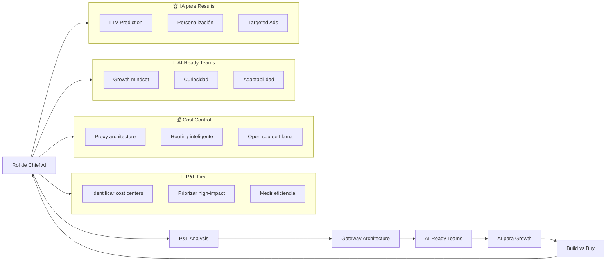
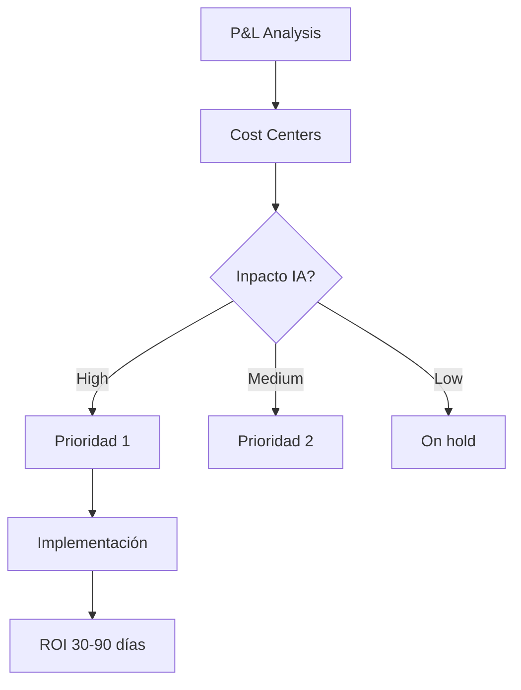
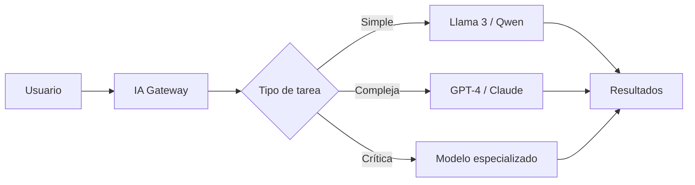
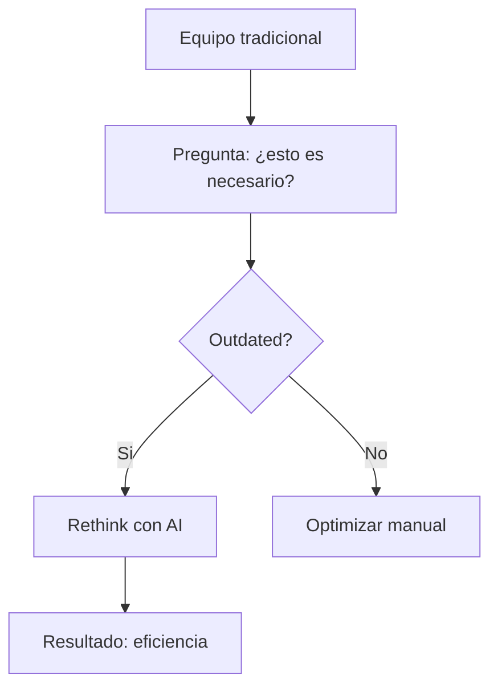
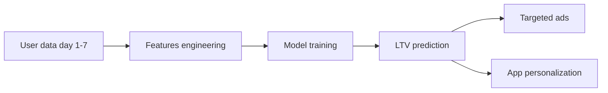
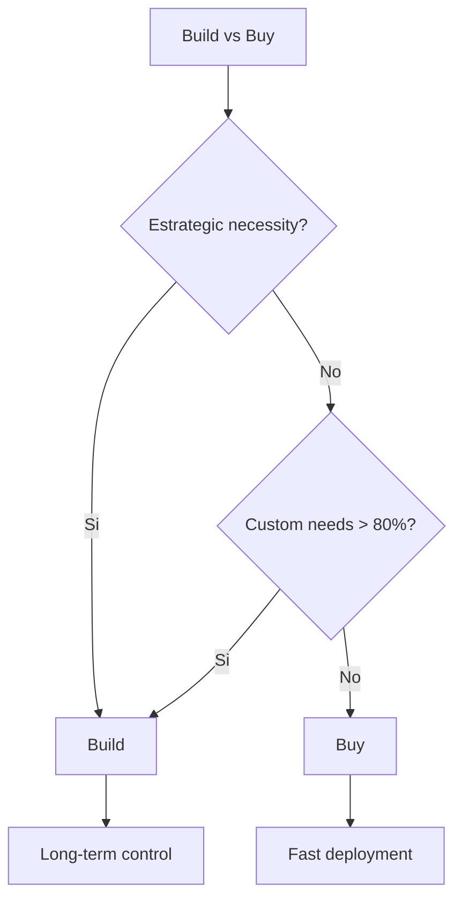

# MASTERCLASS: IA en Acción según Pablo Guzzi de Ualá — De la Estrategia a la Ejecución 🇦🇮🏢🚀💼

## INTRODUCCIÓN: POR QUÉ ESTE MASTERCLASS ES DIFERENTE 🎯🔍🧠

> **🎯 Objetivo de Aprendizaje** — Dominarás la implementación práctica de IA en empresas: desde identificar oportunidades en tu P&L, hasta controlar costos con gateway architecture, construir equipos AI-ready y tomar decisiones de build vs buy. Todo basado en la experiencia real de Pablo Guzzi, ex-Chief Data & AI Officer de Ualá.

> **⚠️ Advertencia educativa** — Este contenido sintetiza la experiencia de Pablo Guzzi. Las decisiones de inversión dependen de tu contexto específico. No constituye asesoramiento financiero.

---

## MAPA DEL MASTERCLASS 🗺️🧭🧠



| Concepto | Pregunta clave | Output esperado |
|----------|----------------|-----------------|
| **🎯 P&L First** | ¿Dónde hay mayor coste/ineficiencia? | Lista de oportunidades AI |
| **💰 Gateway** | ¿Cómo controlar gastos de tokens? | Arquitectura de costos |
| **👥 Equipos** | ¿Qué habilidades son clave? | Plan de contratación/adaptación |
| **🏆 Growth** | ¿Qué valor crea la IA en marketing? | Modelos predictivos funcionando |
| **🏗️ Build/Buy** | ¿Desarrollar o adquirir? | Decision tree claro |

---

## PARTE 1: EL ROL DEL CHIEF AI OFFICER — DEMOCRATIZANDO LA IA 🎯👨‍💼

### 1.1 Evolución del rol AI en empresas 🔄📈

> **🎯 La Verdad de Pablo Guzzi** — El Chief AI Officer no es un "jefe de IA". Es un **democratizador**, **governanza establecedora** y **experiencia mejorador**. El rol está evolucionando de "experimentador" a "operacionalizar".

| Fase | Enfoque | Responsabilidad |
|------|---------|-----------------|
| 🔬 **Fase 1: Experimentación** | Pruebas piloto | Demostrar valor |
| ⚙️ **Fase 2: Democratización** | Acceso empresarial | Que todos usen IA éticamente |
| 🛡️ **Fase 3: Gobernanza** | Ética + cumplimiento | Políticas de uso y control |
| 🚀 **Fase 4: Experiencia** | Producto + usuario | IA generando valor visible |

> **💡 Tip de Guzzi #1** — El Chief AI Officer debe pensar como un **CTO + CMO + Risk Officer** combinado. No es solo tecnología. Es **valor + ética + experiencia**.

### 1.2 Democratización de la IA: el principio del acceso 📱👥

Democratizar la IA significa **hacerla accesible a todos los niveles**, no solo a ingenieros de élite. 🧠⚡

| Grupo | Cómo democratizar |
|-------|------------------|
| 👨‍💼 **Business teams** | Chatbots de IA para análisis de datos |
| 🎨 **Creativos** | Herramientas de generación de contenido |
| 📈 **Growth** | Modelos de scoring sin codear |
| 🔧 **Engineers** | SDKs y APIs unificadas |

> **🧠 Hack de Guzzi #1** — "La democratización no significa que cualquiera haga deep learning. Significa que cualquiera **entiende** y **aplica** IA según su rol, sin bloquearla tras complejidad técnica."

### 1.3 Gobernanza de IA: ética y cumplimiento 🛡️📜

> **⚡ La Verdad de PNL aplicada** — La gobernanza no es un freno. Es un **ancla segura** que permite escalar con confianza.

| Elemento | Acción concreta | Herramienta típica |
|----------|-----------------|-------------------|
| **Ética** | Principios de IA explicables | Framework de ética interna |
| **Bias** | Tests de fairness en modelos | Fairlearn, AIF360 |
| **Transparencia** | Decisiones explicables | SHAP, LIME |
| **Privacidad** | Datos anonimizados | Differential privacy |
| **Cumplimiento** | Auditorías periódicas | Checklist de gobernanza |

---

## PARTE 2: COMENZAR CON IA — EL MÉTODO P&L QUE PABLO GUZZI SWEAR 🧾💰

### 2.1 El primer paso: analizar tu P&L 🟢🎯

> **🎯 La Verdad de Guzzi** — "Antes de tocar cualquier tecnología, abrí tu P&L. La IA debe impactar **costos o revenue**, no solo ser 'cool'."



### 2.2 Identificando los 5 grandes cost centers 🎯📊

| Cost Center | Cómo la IA ayuda | ROI típico |
|-------------|-------------------|------------|
| 👥 **Customer Support** | Chatbots, clasificación de tickets | 30-50% reducción de costos |
| 📞 **Call Centers** | Transcripción + análisis en tiempo real | 20-30% ahorro en headcount |
| 📄 **Procesamiento de docs** | OCR + extracción automática | 70%+ reducción de tiempo |
| 📊 **Reporting** | Generación automática de reportes | 80% menos horas manuales |
| 📧 **Email triage** | Clasificación y respuesta automática | 60% menos tiempo en inbox |

> **💡 Tip de Guzzi #2** — "Empezá por dónde la IA genera ahorro inmediato. No por donde es más emocionante. El ROI rápido paga la exploración."

### 2.3 El checklist de oportunidades IA ✅📋🧠

| Pregunta | Score (0-3) |
|----------|-------------|
| ¿Este proceso consume >10 horas/semana manuales? | |
| ¿Tiene datos históricos estructurados? | |
| ¿Es repetitivo, no creativo? | |
| ¿El error humano cuesta dinero? | |
| ¿Hay un proceso de feedback rápido? | |

| Score | Acción recomendada |
|-------|-------------------|
| **12-15** | 🎯 Prioridad inmediata |
| **8-11** | 📋 Evaluar con piloto |
| **4-7** | ⏳ Dejar para después |

> **⚡ Hack PNL #2** — Visualizá tu P&L como un mapa de calor. Los "hotspots" rojos son donde **más duele** y donde la IA ataca con mayor efecto.

---

## PARTE 3: CONTROL DE COSTOS — GATEWAY ARCHITECTURE 💰🔌🤖

### 3.1 El problema de los tokens descontrolados 💸🌪️

> **🎯 La Verdad de Guzzi** — "Los tokens no son gratis. Cada llamada a GPT-4 puede costar 10x más que Llama 3. La IA sin control de costos se convierte en una loca adicción."

| Escenario | Costo (ejemplo) |
|-----------|-----------------|
| 📝 1,000 resúmenes GPT-4 | $500 |
| 📝 1,000 resúmenes Llama 3 | $30 |
| **Ahorro potencial** | **94%** |

### 3.2 El gateway architecture: tu control de tráfico de IA 🚦🌐



| Tarea | Modelo óptimo | Costo vs GPT-4 |
|-------|---------------|----------------|
| 📝 **Clasificación** | Llama 3 8B | 10x más barato |
| 📄 **Resumen** | GPT-4o mini | 5x más barato |
| 🎨 **Creatividad** | Claude 3.5 | Equiv. |
| 🧠 **Razonamiento** | GPT-4 | Referente |

### 3.3 El protocolo de routing inteligente 🧠📊🔍

| Paso | Acción | Herramienta |
|------|--------|-------------|
| 1️⃣ | **Clasificar tarea** | Prompt de clasficiación |
| 2️⃣ | **Calificar complejidad** | Scoring 1-10 |
| 3️⃣ | **Seleccionar modelo** | Lookup table |
| 4️⃣ | **Medir calidad** | Feedback loop |
| 5️⃣ | **Optimizar** | A/B testing |

> **🧠 Hack de Guzzi #3** — "Usá un prompt tipo: 'Task: clasificación de intención. Complejidad: 2/10. Modelo sugerido: Llama 3.' La IA clasifica la IA." 🤖🤖

### 3.4 El budget tracker de IA 💰📊📈

| Concepto | Mensual | Alerta |
|----------|---------|--------|
| **Tokens GPT-4** | $2,500 | ⚠️ >$3,000 |
| **Tokens Llama 3** | $200 | ✅ < $500 |
| **GPT-4o mini** | $800 | ✅ |
| **Total** | $3,500 | ⚠️ Límite: $4,000 |

> **⚡ Tip de Guzzi #4** — "Pon una alarma: cuando GPT-4 supere el 30% del presupuesto, el fallback automático pasa a Llama 3."

---

## PARTE 4: EQUIPOS AI-READY — LA GROWTH MINDSET 🧠👥🚀

### 4.1 El gran mito: "necesitamos ingenieros de ML" 🤯❌

> **🎯 La Verdad de Guzzi** — "Contratar especialistas de ML es caro y lento. La IA exitosa viene de **equipos curiosos que identifican procesos obsoletos**."



### 4.2 Las 3 habilidades que tu equipo necesita hoy 🧠⚡🤝

| Habilidad | Por qué importa | Cómo desarrollarla |
|-----------|-----------------|--------------------|
| **Curiosidad** 🔍 | Identifica oportunidades | Hackathons internos |
| **Adaptabilidad** 🔄 | Abraza el cambio | Rotación de proyectos |
| **Growth mindset** 📈 | Aprende de fallos | Post-mortems constructivas |

| Perfil | Fortaleza | Debilidad |
|--------|-----------|-----------|
| 👶 **Young talent** | Adaptabilidad, curiosidad | Menos experiencia |
| 👨‍💼 **Experiencia** | Conocimiento del negocio | Resistencia al cambio |
| 🎨 **Creativo** | Pensamiento lateral | Menos rigor técnico |

### 4.3 El protocolo de "growth mindset" PNL 👨‍🏫🔄📈

| Paso | Acción | Resultado |
|------|--------|-----------|
| 1️⃣ | **Test fallido público** | Se normaliza el error |
| 2️⃣ | **Celebrar micro-logros** | Refuerza comportamientos |
| 3️⃣ | **Rotar roles** | Expone nuevas perspectivas |
| 4️⃣ | **Post-mortem sin culpables** | Enfoca en sistemas, no personas |

> **💡 Tip de Guzzi #5** — "Un error de IA que aprendés de, vale más que un éxito sin lección. La cultura debe recompensar el aprendizaje."

### 4.4 El "AI champion" interno 🏆🧠🔍

> **⚡ Hack PNL #3** — Designa a alguien del equipo como "AI champion", no por seniority sino por **curiosidad demostrada**. Su rol: encontrar 1 uso de IA por semana. ✨

---

## PARTE 5: IA PARA GROWTH — EL CASO DE UALÁ 📈🎯🚀

### 5.1 El caso ganador: LTV prediction en 7 días 🎯💰⏱️

> **🎯 La Verdad de Guzzi** — "Predecir Customer Lifetime Value con solo 7 días de datos no es magia. Es **ingeniería predictiva ágil**."



| Input (7 days) | Feature | Poder predictivo |
|----------------|---------|------------------|
| 📱 App sessions | Engagement | Alto |
| 💸 Transacciones | Spending pattern | Muy alto |
| 👆 Click patterns | Interest signals | Medio |
| ⏱️ Tiempo activo | Stickiness | Alto |

### 5.2 Results: cómo la LTV prediction cambió las cosas 📊📈

| Métrica | Antes IA | Después IA | Mejora |
|---------|----------|------------|--------|
| 🎯 **Target CAC** | 3x LTV | 5x LTV | +67% |
| 💰 **ROI publicidad** | 2.1x | 3.8x | +81% |
| 📱 **Retention D7** | 42% | 61% | +45% |
| 💸 **Revenue per user** | $12 | $18 | +50% |

> **💡 Tip de Guzzi #6** — "La IA no necesita meses. Con 7 días de datos bien ingenierizados, podés predecir comportamientos con 85%+ de precisión."

### 5.3 Personalización de app experience 📱🎨🎯

| Segmento | IA aplica | Resultado |
|----------|-----------|-----------|
| 🔥 **High LTV probado** | Features premium early | +30% engagement |
| 💰 **Low LTV** | Offers de reactivación | +25% reactivación |
| 🆕 **New user** | Onboarding personalizado | +40% onboarding completion |
| 🔄 **Churn risk** | Intervención predictiva | -35% churn |

---

## PARTE 6: BUILD VS BUY — LA DECISIÓN ESTRATÉGICA 🏗️🛒🤔

### 6.1 El framework de decisión de Guzzi 🧠📊📋

> **🎯 La Verdad de Guzzi** — "Build vs Buy no es una religión. Es un cálculo."



### 6.2 Tabla de decisión rápida 🚀📋⚡

| Factor | Build (Construir) | Buy (Comprar) |
|--------|-------------------|---------------|
| 💰 **Costo inicial** | Alto | Bajo/medio |
| ⏱️ **Time to market** | 6-12 meses | 1-4 semanas |
| 🔧 **Customización** | Ilimitada | Limitada |
| 🛡️ **Control de datos** | Total | Parcial |
| 📈 **Escalabilidad** | Propias | Depende vendor |
| 👥 **Recursos necesarios** | Equipo ML interno | Equipo de integración |

| Pregunta clave | Build | Buy |
|----------------|-------|-----|
| ¿Es crítico para tu modelo de negocio? | ✅ | ❌ |
| ¿Tienés 3+ ingenieros ML disponibles? | ✅ | ❌ |
| ¿El problema es único de tu industria? | ✅ | ❌ |
| ¿Necesitás salir en 30 días? | ❌ | ✅ |
| ¿La solución es commodity? | ❌ | ✅ |

> **💡 Tip de Guzzi #7** — "Si la funcionalidad te diferencia de la competencia, build. Si es algo que todos hacen igual, buy."

### 6.3 El caso Ualá: ejemplo real 🏢💡🎯

| Decision | Build o Buy | Razón |
|----------|-------------|-------|
| **Core ML models** | Build | Diferencial competitivo |
| **OCR de documentos** | Buy | Commodity disponible |
| **Chatbots** | Buy + Custom | Rápido + ajustes |
| **Analytics dashboard** | Build | Datos sensibles |

> **⚡ Hack de Guzzi #8** — "Empezá comprando para validar, y build cuando el 20% de customización que necesitás justifique el 80% de costo extra."

---

## PARTE 7: EJERCICIOS PROGRESIVOS — APLICA LO APRENDIDO 📈📚🎯

### 7.1 I Do — Guzzi corrige 3 errores comunes 👨‍🏫🔍🧠

> **❌ Error 1:** "Vamos a usar IA porque todos lo hacen" → ✅ "Identifico en P&L dónde la IA genera ROI"

> **❌ Error 2:** "Contratamos 5 ingenieros de ML" → ✅ "Formo un equipo AI-ready con growth mindset"

> **❌ Error 3:** "Build todo, porque no confío en vendors" → ✅ "Buy commodity, build diferencial"

### 7.2 We Do — Auditá tu P&L 📊📋

| Cost Center | % P&L | IA Opportunity | Score (1-5) |
|-------------|-------|----------------|-------------|
| Customer Support | | | |
| Call Centers | | | |
| Document Processing | | | |
| Reporting | | | |
| Email/Scheduling | | | |

| Criterio | Score mínimo para acción |
|----------|------------------------|
| Ahorro estimado | 2/5 |
| Datos disponibles | 5/5 |
| Feedback rápido | 3/5 |

### 7.3 You Do — Diseña tu roadmap AI de 90 días 💪🚀📅

| Mes | Objetivo | KPIs | Hitos |
|-----|----------|------|-------|
| 1 | | | |
| 2 | | | |
| 3 | | | |

| Criterio de evaluación | Peso |
|------------------------|------|
| ✅ Audit P&L completado | 20% |
| ✅ Caso de IA prioritario identificado | 20% |
| ✅ Plan de costos (gateway) definido | 20% |
| ✅ Equipo AI-ready asignado | 20% |
| ✅ Build vs Buy decidido | 20% |

---

## CHECKLIST FINAL: IA EN ACCIÓN ✅📋🎯🚀

| Bloque | Estado |
|--------|--------|
| ✅ Auditaste P&L y priorizaste cost centers | ☐ |
| ✅ Diseñaste tu gateway architecture | ☐ |
| ✅ Identificaste oportunidades de LTV prediction | ☐ |
| ✅ Evaluaste build vs buy con framework | ☐ |
| ✅ Asignaste equipo AI-ready con growth mindset | ☐ |
| ✅ Plan de 90 días definido | ☐ |

---

## PREGUNTAS DE VERIFICACIÓN 📝❓✨🔍

1. **🎯 Filosofía:** ¿Cuál de los 4 roles del Chief AI Officer es el más crítico hoy en tu empresa? ¿Cómo lo estarías cubriendo?
2. **💰 P&L:** ¿Qué cost center de tu P&L tendría el mayor impacto con IA? ¿Calculaste el ahorro potencial?
3. **🔌 Gateway:** Si implementaras un gateway ahora, ¿qué tareas irían a Llama 3 vs GPT-4?
4. **👥 Equipos:** ¿Tu equipo tiene growth mindset? ¿Qué harías para fomentarlo?
5. **📈 LTV:** ¿Con qué 7-day data podrías predecir comportamiento en tu negocio?
6. **🏗️ Build/Buy:** ¿Qué parte de tu stack actual debería ser build vs buy? ¿Por qué?
7. **🧠 PNL Hack:** Si tu mente dice "esto es muy complejo", ¿qué técnica aplicarías de inmediato?
8. **🚀 Roadmap:** ¿Cuál es tu primer proyecto AI de 30 días? ¿Qué ROI esperás?

---

## GLOSARIO RÁPIDO 📚📖🧠

| Término | Definición | Contexto Ualá |
|---------|------------|--------------|
| **Chief AI Officer** | Líder de estrategia y ejecución de IA | Democratiza + governa |
| **P&L** | Profit & Loss, estados financieros | Identifica cost centers |
| **Gateway Architecture** | Proxy que dirige queries a modelos | Control de costos de tokens |
| **Token** | Unidad de medida en modelos de lenguaje | $0.0003 por 1K tokens (Llama) |
| **LTV** | Customer Lifetime Value | Predicción con 7 días de datos |
| **Growth Mindset** | Mentalidad de aprendizaje continuo | Clave para adoption de IA |
| **Build vs Buy** | Estrategia de desarrollo vs adquisición | Commodity=buy, Core=build |
| **OCR** | Optical Character Recognition | Procesamiento de documentos |
| **Feat. Eng.** | Feature Engineering | Ingeniería de características |
| **CAC** | Customer Acquisition Cost | Relación CAC/LTV ideal = 3x |

---

## ANEXO: FORMATO IDEAL PARA GUÍAS DE IA EMPRESARIAL 🧠📄🏢

### Recomendaciones de legibilidad para emprendedores 💼📏🎯

```css
.article-content {
  font-size: 18px;
  line-height: 1.75;
  max-width: 65ch;
}
```

### Lo que hace agradable una guía de IA al cerebro empresarial 🧠💼✨

- 🎯 **Casos reales** (Ualá) anclan conceptos abstractos a implementaciones reales.
- 📊 **Tablas comparativas** facilitan decisiones rápidas (build vs buy, modelos vs costos).
- ⚡ **Scripts y checklists** permiten aplicar de inmediato sin paralizar.
- 🔄 **Ejercicios progresivos** (I Do / We Do / You Do) construyen confianza escalonada.
- 💰 **Tablas de costos** hacen tangibles los ahorros de tokens y presupuesto.
- 📈 **KPIs reales** conectan con mentalidad de results, no de features.

> **🗣️ La frase del profe Pablo Guzzi** 🌟 — *"La IA no es una carrera de velocidad. Es una carrera de eficiencia. Empezá por donde duele más y escalá con sistemas."*

