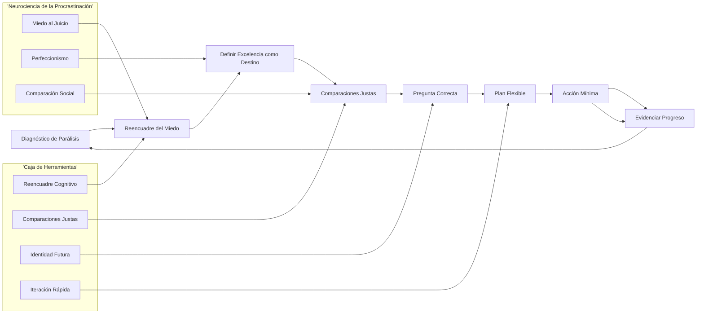
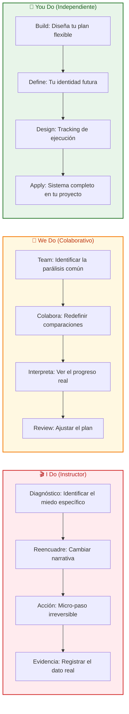

# Parálisis por Análisis: La Masterclass para Dejar de Postergar y Ejecutar 🚀🧠

## INTRODUCCIÓN: POR QUÉ ESTA MASTERCLASS ES DIFERENTE

Existe un fenómeno curioso: muchas de las personas más inteligentes, capaces y con mayor potencial son también las que más postergan sus proyectos más importantes. No es pereza. No es falta de tiempo. Es un mecanismo de defensa contra el miedo a enfrentar datos reales sobre sí mismas.

Este masterclass no te promete trucos motivacionales niDietas de productividad. Te promete un **sistema de ejecución mental** para transformar la parálisis en movimiento, incluso cuando la incertidumbre sea alta.

> **🎯 Objetivo de Aprendizaje** — Al final de esta guía, entenderás por qué tu inteligencia puede ser tu propia trampa, y tendrás 4 herramientas prácticas para pasar de la planificación infinita a la ejecución tangible.

> **⚠️ Advertencia educativa** — Este contenido es formativo. La procrastinación crónica puede estar asociada a condiciones clínicas como ansiedad o TDAH. Si sientes que tu funcionamiento está comprometido, busca apoyo profesional.

---

## 🗺️ MAPA DEL WORKFLOW DE EJECUCIÓN



| Fase | Pregunta que responde | Output principal |
|------|-----------------------|------------------|
| **Diagnóstico** | ¿Por qué paralizo este proyecto específico? | Mapa de miedos identificados |
| **Reencuadre** | ¿Qué historia me estoy contando? | Narrativa alternativa |
| **Excelencia** | ¿Qué significa "hacerlo bien"? | Definición de éxito realista |
| **Comparaciones** | ¿Contra qué me estoy comparando? | Criterios de comparación justos |
| **Pregunta** | ¿Qué necesito convertirme en hacerlo? | Diseño de identidad futura |
| **Plan** | ¿Qué tan flexible es mi hoja de ruta? | Plan con pivot permitido |
| **Acción** | ¿Cuál es la micro-acción irreversible? | Primer paso definido |
| **Evidencia** | ¿Cómo sé que avanzar? | Registro tangible del progreso |



---

## 🎭 PARTE 1: EL ORIGEN DEL PROBLEMA — LA PARÁLISIS POR ANÁLISIS

### 1.1 No Es Pereza, Es Miedo a la Evidencia 😨

La procrastinación en personas altamente capaces tiene un origen muy específico: mientras el proyecto existe solo en la mente, el potencial permanece intacto. Al empezar, los datos reales reemplazan la fantasía.

```
Mecanismo de la parálisis:
// Paso 1: Tengo una idea brillante en la mente
// Paso 2: Mientras no la ejecute, sigo siendo "alguien con potencial"
// Paso 3: Al ejecutar, puedo fracasar y obtener datos concretos
// Paso 4: Esos datos pueden ser imperfectos, feos, incómodos
// Paso 5: Prefiero no obtener esos datos
// Paso 6: Postergo para proteger mi autoimagen
```

> **💡 Concepto Clave**: La parálisis no es un problema de ejecución. Es un problema de **protección del ego**.

### 1.2 El Mecanismo de Defensa 🛡️

```
El proyecto en papel:
// Perfecto
// Intacto
// Lleno de promesa
// Sin evidencia en contra

El proyecto en ejecución:
// Imperfecto
// Vulnerable
// Con datos reales
// Posiblemente feo

Mantenerse en papel:
// Protege tu identidad de "persona brillante"
// Evita el juicio propio y ajeno
// Preserva la esperanza infinita
// ... pero nunca genera resultados
```

### 1.3 La Paradoja del Inteligente 🧠⚡

| Característica | Como fortaleza | Como trampa |
|----------------|----------------|--------------|
| **Planificación excesiva** | Anticipa escenarios | Nunca se decide a empezar |
| **Alto estándar** | Busca calidad | Paraliza por perfección |
| **Visión sistémica** | Ve el todo | Se ahoga en complejidad |
| **Miedo al fracaso** | Quiere hacerlo bien | Prefiere no intentar |

---

## ⚡ PARTE 2: LAS 4 CLAVES PARA EJECUTAR — ARGUMENTOS CONTRA LA PARÁLISIS

### 2.1 Clave 1: La Excelencia es un Destino, no un Punto de Partida 🏁

La perfección no debe ser el requisito para empezar. El éxito no llega por hacerlo bien desde el principio; llega por tener un **propósito lo suficientemente fuerte** como para persistir a través de los errores iniciales.

```
La falacia de la excelencia inicial:
// ❌ "Espero a estar listo"
// ❌ "Tengo que dominarlo antes de mostrar"
// ❌ "Si no es perfecto, no lo publico"

La realidad del aprendizaje:
// ✅ Empiezas mal
// ✅ Iteras rápido
// ✅ Aprendes en el proceso
// ✅ La excelencia llega como RESULTADO, no como REQUISITO
```

> **🚀 Insight clave**: Lo que te lleva al éxito no es la perfección inicial, sino la **capacidad de persistir** pese a los errores.

### 2.2 Clave 2: Comparaciones Justas — Tu Día 1 vs Tu Ayer 📊

Comparar tu "día uno" con el "escaparate" de los demás es una batalla perdida antes de empezar. Cada camino tiene recursos, tiempos y sacrificios invisibles que no ves.

```
Comparación injusta:
// Tu día 1 con tu esfuerzo
// vs. El día 1000 de alguien con su experiencia
// vs. El showcase de alguien que solo muestra lo bueno

Comparación justa:
// Tu día 1 vs Tu día 0
// Tu esfuerzo actual vs Tu esfuerzo de ayer
// Tu resultado actual vs Tu resultado de hace 30 días
```

### 2.3 Tabla de Comparación Justa

| Comparación Injusta | Comparación Justa | Resultado emocional |
|---------------------|-------------------|---------------------|
| Mi proyecto inicial vs. Su proyecto final | Mi versión actual vs. Mi versión anterior | Desaliento |
| Mi día 1 vs. Su día 1000 | Mi proceso vs. Mi proceso anterior | Motivación |
| Mi todo vs. Su highlight reel | Mi incremento semanal | Claridad |
| Mi potencial sin ejecutar vs. Su ejecución | Mi ejecución real vs. Mi ejecución anterior | Acción |

### 2.4 Clave 3: La Pregunta Correcta — Sé vs Haz 🤔

Hay dos formas de enfrentar un proyecto difícil, y producen resultados radicalmente distintos:

```
Pregunta equivocada:
❌ "¿Cómo lo voy a lograr?"
// Genera infinitas estrategias
// Te atrapa en planificación infinita
// Nunca satisface la respuesta
// Te mantiene en parálisis

Pregunta correcta:
✅ "¿En qué tipo de persona me tengo que convertir para que esto suceda?"
// Genera crecimiento de identidad
// Conecta con valores profundos
// Te impulsa a adoptar hábitos nuevos
// El éxito se convierte en un subproducto de quién eres
```

> **🎯 Concepto transformador**: El éxito no se logra. El éxito se atrae mediante la **identidad y los hábitos** que construyes cada día.

### 2.5 Clave 4: Ajusta el Plan, no el Objetivo 🎯

Cuando algo sale mal, la reacción natural es abandonar el sueño. La respuesta correcta es tratar el resultado no deseado como un **dato científico** que te ayuda a descartar lo que no funciona.

```
Resultado inesperado:
// ❌ "Esto no es para mí"
// ❌ "No puedo"
// ❌ "Abandono"

// ✅ "Esto es un dato"
// ✅ "Esto me dice qué NO funciona"
// ✅ "Ajusto la estrategia, no el sueño"
```

---

## 🧠 PARTE 3: LA NEUROCIENCIA DETRÁS DE LA PARÁLISIS

### 3.1 El Cerebro que Planifica Demasiado 🧠🔄

```
El cerebro inteligente:
// ✅ Ve múltiples escenarios
// ✅ Anticipa riesgos
// ✅ Busca la solución óptima
// ❌ Se atasca en la anticipación
// ❌ Olvida que la realidad es la mejor maestra
// ❌ Confunde planificación con acción
```

### 3.2 El Ciclo de la Parálisis por Análisis 🔄

| Etapa | Pensamiento | Resultado |
|-------|-------------|-----------|
| **Idea brillante** | "Tengo un proyecto increíble" | Entusiasmo inicial |
| **Planificación excesiva** | "Tengo que prepararme más" | Investigación infinita |
| **Anticipación de errores** | "Podría fallar de muchas maneras" | Miedo creciente |
| **Comparación con otros** | "Los demás ya lo hacen mejor" | Desvalorización |
| **Postergación** | "Mañana empiezo" | Parálisis mantenida |
| **Auto-juicio** | "Soy un procrastinador" | Baja autoestima |

### 3.3 Código de Detección de Parálisis 🖥️

```python
from dataclasses import dataclass
from datetime import date, timedelta
from typing import Optional

@dataclass
class ParalysisSignal:
    thought_pattern: str
    avoidance_behavior: str
    days_delayed: int
    fear_type: str  # "failure", "judgment", "imperfection"

class ParalysisDetector:
    def __init__(self, project_name: str):
        self.project_name = project_name
        self.delays: list[ParalysisSignal] = []
        self.last_action_date: Optional[date] = None

    def log_delay(self, thought: str, avoidance: str, fear: str):
        self.delays.append(ParalysisSignal(
            thought_pattern=thought,
            avoidance_behavior=avoidance,
            days_delayed=(date.today() - self.last_action_date).days if self.last_action_date else 0,
            fear_type=fear
        ))

    def paralysis_score(self) -> float:
        if not self.delays:
            return 0.0
        avg_days = sum(d.days_delayed for d in self.delays) / len(self.delays)
        fear_weight = {"failure": 1.0, "judgment": 1.5, "imperfection": 1.2}
        weighted = sum(fear_weight.get(d.fear_type, 1.0) for d in self.delays)
        return min((avg_days * 0.1) + (weighted * 0.05), 10.0)

    def intervention_suggestion(self) -> str:
        score = self.paralysis_score()
        if score > 5.0:
            return "URGENTE: Usa la regla de los 2 minutos. Actúa sin preparación."
        elif score > 2.5:
            return "MODERADO: Identifica el miedo específico. Escribe 3 comparaciones justas."
        return "LEVE: Define la micro-acción de hoy. Ejecuta sin condiciones."
```

---

## ⚡ PARTE 4: LA ACCIÓN PRECEDE A LA MOTIVACIÓN — EL MOTOR DE LA EJECUCIÓN

### 4.1 El Error Número Uno: Esperar Sentirse Listo 🚫

```
Secuencia incorrecta (la que paraliza):
// Espero motivación
// Espero claridad
// Espero el momento perfecto
// Espero a estar "listo"
// ... y nunca empiezo

Secuencia correcta (la que ejecuta):
// Defino una micro-acción (<2 minutos)
// La ejecuto sin importar cómo me sienta
// Obtengo un dato real
// Ajusto el siguiente paso
// La motivación aparece DESPUÉS de la acción
```

> **⚡ Insight clave**: La motivación no es el motor. La motivación es el **premio** por haber actuado primero.

### 4.2 La Espiral de la Ejecución 🔄

| Ciclo | Acción | Resultado |
|-------|--------|-----------|
| **Vuelta 1** | Micro-acción sin motivación | Dato real obtenido |
| **Vuelta 2** | Micro-acción + registro de evidencia | Patrón emergente |
| **Vuelta 3** | Acciones alineadas a propósito | Progreso tangible |
| **Vuelta 4** | Emoción de avance | Motivación sostenida |
| **Vuelta N** | Ejecución automática | Identidad consolidada |

### 4.3 Protocolo de Ejecución Express de 2 Minutos ⏱️

```
PROTOCOLO DE LOS 2 MINUTOS:

PASO 1 (30 seg):
// Escribe exactamente la micro-acción
// No "trabajar en el proyecto"
// Sí "abrir el documento y escribir 3 líneas"

PASO 2 (10 seg):
// Cuenta regresiva: 3, 2, 1...
// Sin negociación

PASO 3 (1 min):
// Ejecuta sin evaluar calidad
// Solo importa que se haga

PASO 4 (20 seg):
// Registra: "Hecho. Evidencia: [lo que sea]"
// No hay vuelta atrás
```

> **🎯 Regla de Oro**: No puedes negociar con el cerebro antes de actuar. Actúa primero,-negocia después.

---

## 🧩 PARTE 5: DISEÑO CONSCIENTE DEL PROYECTO — ARQUITECTURA DE EJECUCIÓN

### 5.1 Tu Identidad como Eje del Proyecto 🏗️

El proyecto no se completa solo con estrategias. Se completa cuando te conviertes en el tipo de persona que ejecuta ese tipo de proyecto.

```
Diseño de identidad projectal:
// No es "voy a escribir un libro"
// Es "soy el tipo de persona que escribe 500 palabras diarias"

// No es "voy a aprender programación"
// Es "soy el tipo de persona que programa cada mañana"

// No es "voy a hacer ejercicio"
// Es "soy el tipo de persona que entrena sin importar el clima"
```

### 5.2 Matriz de Ejecución de Proyectos 🔧

| Componente | Pregunta Clave | Output |
|------------|---------------|---------|
| **Propósito** | ¿Por qué esto importa realmente? | Declaración de propósito |
| **Identidad** | ¿En quién me convierto al hacerlo? | Definición de rol futuro |
| **Micro-acción** | ¿Cuál es el paso más pequeño irreversible? | Acción mínima definida |
| **Evidencia** | ¿Qué prueba tangible obtengo hoy? | Métrica de progreso |
| **Ajuste** | ¿Qué dato me dio el resultado? | Iteración planificada |

### 5.3 Prompt para Diseñar tu Proyecto 🚀

```text
Actúa como arquitecto de proyectos senior.
Objetivo: transformar un proyecto postergado en un sistema de ejecución.
Entradas:
- Proyecto postergado: [nombre del proyecto]
- Razón de postergación: [tu honestidad]
- Miedo principal: [identifica el miedo]
- Recurso más escaso: [tiempo, energía, dinero]
Entrega:
1. Declaración de identidad asociada al proyecto
2. Micro-acción irreversible de 2 minutos
3. 3 comparaciones justas para desactivar parálisis
4. Plan de iteración semanal con pivot permitido
5. Una consecuencia clara si no ejecutas hoy
```

---

## 🔁 PARTE 6: CONSOLIDACIÓN DEL CAMBIO — DE LA PARÁLISIS AL HÁBITO

### 6.1 El Umbral de la Incomodidad Inicial 🥶

```
Fases de la ejecución:
// 1. Activación (días 1-3) 🚀
//    - Micro-acciones generan datos reales
//    - El cerebro empieza a confiar
//
// 2. Resistencia (días 4-14) 🧱
//    - La novedad se desvanese
//    - Aparecen excusas más sofisticadas
//
// 3. Punto de quiebre (días 14-21) ⚡
//    - Los datos empiezan a mostrar progreso
//    - La identidad empieza a consolidarse
//
// 4. Momentum (semanas 3-6) 🌱
//    - La ejecución se vuelve automática
//    - La incomodidad disminuye drásticamente
//
// 5. Hábito consolidado (mes 2-3) 🏆
//    - El proyecto avanza sin negociación
//    - La identidad está integrada
```

### 6.2 Protocolo de Evidencias Diarias 📸

Tu cerebro necesita **datos**, no motivación. Registra evidencias tangibles de que el proyecto avanza.

```
Registro diario MÍNIMO:

✅ Proyecto del día: [nombre del proyecto]
✅ Micro-acción ejecutada: [qué hiciste exactamente]
✅ Dato obtenido: [qué aprendiste o produjiste]
✅ Nivel de incomodidad: [1-10]
✅ Evidencia # del día: [señal concreta de avance]
```

### 6.3 Tabla de Consolidación

| Día | Acción Mínima | Evidencia Esperada | Incomodidad Esperada |
|-----|---------------|-------------------|---------------------|
| **1-3** | Micro-acción de 2 minutos | Dato real, sin juicio | Alta (8-10/10) |
| **4-10** | Micro-acción + registro | Patrones empiezan a aparecer | Alta-Moderada (6-8) |
| **11-21** | Acciones alineadas a propósito | Progreso visible | Moderada (4-6) |
| **22-42** | Sistema fluido | La ejecución se vuelve natural | Baja (2-4) |
| **43-90** | Hábito consolidado | Proyecto tangible | Muy baja (1-3) |

### 6.4 Código de Seguimiento de Ejecución 📊

```python
import json
from datetime import date
from dataclasses import dataclass, field
from typing import Optional

@dataclass
class ExecutionEntry:
    project: str
    date: str
    micro_action: str
    evidence: str
    data_learned: str
    discomfort: int
    completed: bool = False

class ExecutionTracker:
    def __init__(self):
        self.entries: list[ExecutionEntry] = []
        self.streak: int = 0

    def log_execution(self, project: str, action: str, evidence: str, data: str, discomfort: int):
        entry = ExecutionEntry(
            project=project,
            date=date.today().isoformat(),
            micro_action=action,
            evidence=evidence,
            data_learned=data,
            discomfort=discomfort,
            completed=bool(action)
        )
        self.entries.append(entry)
        if entry.completed:
            self.streak += 1
        return entry

    def weekly_report(self, project: Optional[str] = None) -> dict:
        entries = [e for e in self.entries[-7:] if not project or e.project == project]
        if not entries:
            return {"error": "No data yet"}
        completed = sum(1 for e in entries if e.completed)
        avg_discomfort = sum(e.discomfort for e in entries) / len(entries)
        evidence_list = [e.evidence for e in entries if e.evidence]
        return {
            "week_completion": f"{completed}/{len(entries)}",
            "avg_discomfort": round(avg_discomfort, 1),
            "current_streak": self.streak,
            "evidence_collected": len(evidence_list),
            "last_evidence": evidence_list[-1] if evidence_list else None
        }

    def save(self, path: str):
        serializable = [
            {
                "project": e.project,
                "date": e.date,
                "micro_action": e.micro_action,
                "evidence": e.evidence,
                "data_learned": e.data_learned,
                "discomfort": e.discomfort,
                "completed": e.completed
            }
            for e in self.entries
        ]
        with open(path, "w", encoding="utf-8") as f:
            json.dump(serializable, f, ensure_ascii=False, indent=2)
```

---

## 🎯 PARTE 7: LOS TRES MODOS DE APRENDIZAJE — I DO / WE DO / YOU DO

### 7.1 I Do — Diagnóstico de Parálisis Guiado 🎬

**Objetivo**: identificar el mecanismo de defensa específico detrás de tu postergación.

| Paso | Acción | Resultado esperado |
|------|--------|--------------------|
| 1 | Nombrar el proyecto postergado | Claridad del objeto de parálisis |
| 2 | Escribir el miedo específico | Externalizar el mecanismo |
| 3 | Identificar la comparación injusta | Desactivar el juicio automático |
| 4 | Definir la micro-acción | Primer paso irreversible |
| 5 | Ejecutar sin preparación | Obtener primer dato real |

```python
# Ejecución del diagnóstico
tracker = ExecutionTracker()
tracker.log_execution(
    project="Mi Proyecto X",
    action="Abrir documento y escribir 3 líneas",
    evidence="Escribí 3 líneas sin editor de texto abierto",
    data="El miedo era a la página en blanco, no a la calidad",
    discomfort=7
)
```

> **🎥 Interpretación guiada**: Después de ejecutar la micro-acción, ¿tu nivel de miedo cambió? Apunta la diferencia.

### 7.2 We Do — Reestructurar Comparaciones en Equipo 🤝

**Escenario**: un equipo posterga el lanzamiento de un proyecto porque comparan su "día uno" con lanzamientos de productos maduros.

**Ejercicio colaborativo**: reescribir las comparaciones del equipo.

| Comparación Original | Reestructuración Justa |
|---------------------|------------------------|
| "Nuestro MVP vs. su producto final" | "Nuestro MVP vs. Nuestra idea original" |
| "Nuestra semana 1 vs. Su año 5" | "Nuestra semana 1 vs. Nuestra semana 0" |
| "Nuestro primer intento vs. Su mejor versión" | "Nuestro primer intento vs. No tener nada" |
| "Lo que sabemos vs. Lo que ellos saben" | "Lo que sabemos ahora vs. Lo que sabíamos ayer" |

### 7.3 You Do — Construye tu Sistema Anti-Parálisis 🔨

**Tarea**: crea tu sistema completo.

| Fase | Acción | Entregable |
|------|--------|-----------|
| **Diagnóstico** | Identifica 3 proyectos postergados y sus miedos | Mapa de parálisis personal |
| **Reencuadre** | Reescribe cada miedo como narrativa alternativa | Narrativas de ejecución |
| **Comparaciones** | Define tus comparaciones justas | Criterios claros |
| **Identidad** | Escribe tu declaración de identidad para cada proyecto | "Soy el tipo de persona que..." |
| **Tracking** | Implementa ExecutionTracker por 30 días | Datos y tendencias |
| **Revisión** | Analiza tu progreso semanal | Ajustes al sistema |

---

## 📓 PARTE 8: ANEXOS Y RECURSOS

### Anexo A: Plantilla de Redefinición de Proyecto 📝

```
PROYECTO: [Nombre del proyecto]

PROPÓSITO:
¿Por qué esto importa realmente?
[Escribe 1-2 frases que te emocionen]

IDENTIDAD ASOCIADA:
"Soy el tipo de persona que [comportamiento observable relacionado]."

MIEDO ESPECÍFICO:
¿Qué evidencia temo obtener?
[Escribe el miedo sin juicio]

COMPARACIÓN INJUSTA:
¿Contra qué me estaba comparando?
[Identifica la comparación injusta]

COMPARACIÓN JUSTA:
¿Cuál es la comparación válida?
[Redefine con criterios justos]

MICRO-ACCIÓN IRREVERSIBLE:
¿Cuál es el paso más pequeño que puedo dar HOY?
[Menos de 2 minutos, sin preparación]

EVIDENCIA ESPERADA:
¿Qué dato concreto obtendré al ejecutar?
[Sea lo que sea, está bien]

PROTOCOLO DE AJUSTE:
Si sale mal: [consecuencia o aprendizaje]
Si sale bien: [siguiente paso]
```

### Anexo B: Checklist Anti-Parálisis ✅

| Item | Check | Frecuencia |
|------|-------|-----------|
| Proyecto identificado y nombrado | ☐ | Al empezar |
| Miedo específico externalizado | ☐ | Al empezar |
| Micro-acción definida (<2 min) | ☐ | Diaria |
| Comparación justa establecida | ☐ | Semanal |
| Ejecución registrada | ☐ | Diaria |
| Datos/evidencia recolectada | ☐ | Diaria |
| Ajuste de plan (si aplica) | ☐ | Semanal |
| Celebración del progreso | ☐ | Semanal |

### Anexo C: Preguntas de Activación Rápida ⚡

Cuando la parálisis aparezca, responde:

1. ¿Qué tan terrible sería obtener este dato real?
2. Si no empiezo HOY, ¿qué estoy protegiendo realmente?
3. ¿Qué haría la mejor versión de mí en este momento?
4. ¿Qué comparación injusta estoy haciendo ahora mismo?
5. ¿Qué micro-acción puedo hacer en los próximos 2 minutos?

---

## 📚 GLOSARIO RÁPIDO

| Término | Definición |
|---------|------------|
| **Parálisis por análisis** | Postergación causada por exceso de planificación |
| **Evidencia** | Dato concreto obtenido de la ejecución |
| **Micro-acción** | Paso irreversible menor a 2 minutos |
| **Reencuadre** | Cambio de narrativa sobre un evento |
| **Comparación justa** | Criterio de medición basado en progreso propio |
| **Excelencia como destino** | La calidad como resultado, no como requisito |
| **Identidad projetal** | La identidad que se construye al ejecutar un proyecto |
| **Pivote** | Cambio de estrategia manteniendo el objetivo |

---

## 📝 PREGUNTAS DE VERIFICACIÓN

Responde cada pregunta basándote en los conceptos de esta master class. Escribe tus respuestas o compártelas para profundizar tu aprendizaje.

### Preguntas sobre el Origen del Problema

1. **Define**: ¿Por qué la procrastinación en personas inteligentes no es pereza? Explica el mecanismo de "miedo a la evidencia".

2. **Analiza**: ¿De qué forma la planificación excesiva puede convertirse en una forma de postergación? Da un ejemplo de tu vida.

### Preguntas sobre las 4 Claves

3. **Explica**: ¿Por qué la excelencia como destino cambia la relación con el error? ¿Qué implicaciones tiene para tu primer borrador?

4. **Aplica**: Toma un proyecto que hayas abandonado. Reescribe tus comparaciones usando el formato de comparación justa.

5. **Reflexiona**: ¿Qué diferencia hay entre preguntar "¿cómo lo voy a lograr?" y "¿en quién me tengo que convertir?"? ¿Cuál te genera más movimiento?

6. **Diseña**: Describe una situación donde ajustar el plan (no el objetivo) te salvó de abandonar un proyecto.

### Preguntas sobre Ejecución

7. **Aplica**: Diseña tu protocolo de 2 minutos para un proyecto específico.

8. **Analiza**: Usando el código `ParalysisDetector`, ¿qué métricas usarías para medir tu progreso en 30 días?

### Preguntas Integradoras

9. **Conecta**: ¿Cómo se relaciona el diseño de identidad (Parte 5) con la consolidación del cambio (Parte 6)? ¿Qué pasaría si diseñas una identidad pero no ejecutas micro-acciones?

10. **Síntesis**: Diseña un sistema completo para alguien que quiere escribir un libro pero nunca empieza. Incluye: diagnóstico de miedo, identidad asociada, micro-acción diaria, métricas y protocolo de ajuste.

11. **Reflexión final**: De las 4 claves presentadas, ¿cuál consideras más crítica para ti en este momento? ¿Por qué?

---

## 🌍 ANEXO: FORMATO IDEAL PARA ARTÍCULOS EDUCATIVOS

### Recomendaciones de ancho para lectura larga

El ancho óptimo para artículos educativos es **60–75 caracteres por línea** (incluyendo espacios). Equivale aproximadamente a:

- `max-width: 65ch` en CSS (una de las mejores opciones).
- 550–750 px de ancho de contenido.

```css
.article-content {
  max-width: 65ch;
}
```

Muchos estudios de legibilidad consideran que entre **50 y 75 caracteres por línea** es la zona óptima para lectura prolongada.

---

### Anchura recomendada para guías de aprendizaje

Las guías educativas tienen necesidades diferentes a las noticias o blogs normales.

**Ancho recomendado:**

```css
.article-content {
  max-width: 60ch;
}
```

o

```css
.article-content {
  max-width: 65ch;
}
```

Esto facilita:

- Mantener la atención
- Reducir la fatiga visual
- Mejorar la comprensión
- Facilitar el seguimiento de conceptos complejos

---

### Lo que hace agradable una guía al cerebro

- Jerarquía visual clara (títulos, subtítulos, listas)
- Pausas de descanso (más espacios entre bloques grandes)
- Variedad de formatos (texto, tablas, código, listas)
- Transiciones explícitas entre conceptos
- Ritmo de dificultad: fácil → medio → retador

---

*¿Qué proyecto estás postergando? Cuéntame en los comentarios.*
