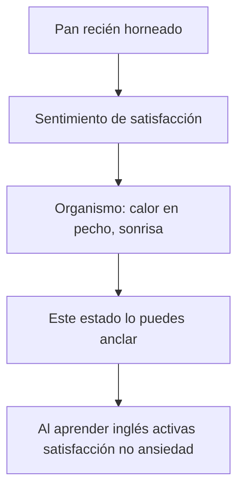
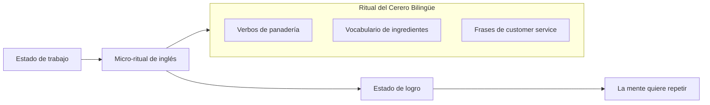
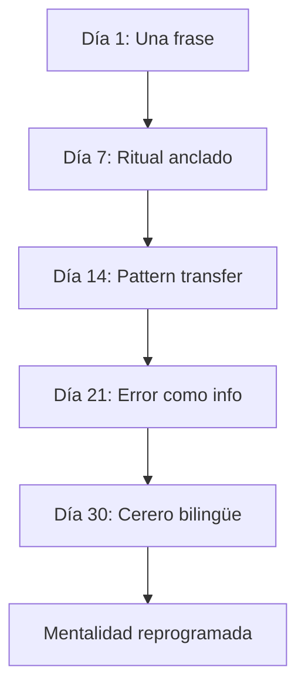

# MASTERCLASS PNL: Inglés para Cereros — Reprograma tu Mente para Aprender sin Estrés 🧠🇬🇧🇺🇸

## INTRODUCCIÓN: POR QUÉ ESTE MASTERCLASS ES DIFERENTE 🎯🔄

> **🎯 Objetivo de Aprendizaje** — Al final de esta guía, entenderás cómo la Programación Neurolingüística puede reescribir las restricciones mentales que te bloquean el inglés. Verás beneficios concretos para tu trabajo de cerero, hackearás las excusas que repites y establecerás rutinas de constancia que tu mente no resistirá.

> **⚠️ Advertencia educativa** — Este contenido es formativo. La PNL es una herramienta de cambio, no un tratamiento terapéutico. Si tienes bloqueos profundos con el aprendizaje, busca ayuda profesional.

---

## MAPA DEL MASTERCLASS 🗺️🧠

```mermaid
flowchart LR
    A[Restricciones Mentales] --> B[Análisis PNL]
    B --> C[Reencuadre Estratégico]
    C --> D[Anclas de Constancia]
    D --> E[Rutinas Automáticas]
    E --> F[Beneficios Concretos]
    F --> A

    subgraph LIMITACIONES ["💭 Limitaciones Identificadas"]
        L1[😱 "No tengo tiempo"]
        L2[🤔 "No soy bueno para las lenguas"]
        L3[😴 "Me cuesta la concentración"]
        L4[😰 "Tengo miedo de equivocarme"]
    end

    subgraph RECOMPENSAS ["🏆 Beneficios Reales"]
        R1[💰 +Clientes internacionales]
        R2[🌐 +Recetas de otros países]
        R3[📱 +Videos tutoriales en inglés]
        R4[📦 +Oportunidades laborales]
    end

    style A fill:#E3F2FD
    style B fill:#E1BEE7
    style C fill:#F3E5F5
    style D fill:#E8F5E9
    style E fill:#FFF8E1
    style F fill:#E0F2F1
```

| Fase PNL | Pregunta clave | Herramienta |
|----------|---------------|-------------|
| **🔍 Diagnosticar** | ¿Qué creencia te miente? | Mapa de restricciones |
| **🔄 Reencuadrar** | ¿Qué otra interpretación funciona? | Reencuadre ecológico |
| **⚡ Anclar** | ¿Qué estado activas cuando aprendes? | Anclas positivas |
| **📋 Rutinar** | ¿Cómo automatizas la constancia? | Rutinas implícitas |
| **🏆 Recompensar** | ¿Qué ganas realmente con aprender? | Beneficios concretos |

---

## PARTE 1: LAS RESTRICCIONES MENTALES QUE TE BLOQUEAN 💭🔒

### 1.1 El mapa de limitaciones que tu mente repite 🗺️

Carlos 👨‍🍳, un cerero de 38 años con 15 años de experiencia, llegó a su sesión de PNL diciendo:

> "No tengo tiempo con el horario de la panadería. Y además, no soy de letras, me cuesta cualquier cosa. Y la verdad es que cuando veo videos en inglés, me duermo. Entonces, ¿para qué?"

Tu mente repite patrones. Identifícalos: 🕵️‍♂️

> **🎯 La Verdad de PNL** — Tu mente no se opone al inglés. Tu mente se opone a **las creencias que inventaste** sobre el inglés.

### 1.2 Las 6 creencias que te roban el constancia 🚨

| # | Creencia mentada | Lo que la mente cree | El engaño detrás |
|---|------------------|---------------------|------------------|
| 1 | 😴 "No tengo tiempo" | El tiempo es un obstáculo | **Tú haces tiempo para lo que priorizas** |
| 2 | 🤯 "No soy bueno para las lenguas" | Tienes una limitación fija | **El cerebro se adapta; es cuestión de método** |
| 3 | 😴 "Me cuesta concentrar" | El rendimiento es pasivo | **La concentración es un hábito entrenable** |
| 4 | 😰 "Tengo miedo de equivostar" | El error es peligroso | **El error es información, no fracaso** |
| 5 | 💸 "El inglés cuesta mucho" | El aprendizaje es caro | **Hay métodos gratis y de bajo costo** |
| 6 | 🤷 "¿Para qué quiero yo el inglés?" | La motivación no es clara | **El beneficio aún no lo has conectado** |

> **⚡ Hack PNL #1** — Cada creencia tiene una **contra-existencia**. Si crees "no tengo tiempo", prueba: "hago 5 minutos antes del amasillado". Si crees "me cuesta concentrar", prueba: "escucho inglés mientras amaso". La mente cede cuando pruebas.

### 1.3 El patrón de "resistencia pasiva" que mantiene el estancamiento 🛑

```mermaid
flowchart TD
    A[Decidís aprender inglés] --> B[La mente activa resistencia]
    B --> C{"¿Por qué no empiezas?"}
    C --> D[Excusa 1: No tengo tiempo]
    C --> E[Excusa 2: No tengo ganas]
    C --> F[Excusa 3: Es muy difícil]
    D --> G[Postergación]
    E --> G
    F --> G
    G --> H[Sentimiento de culpa]
    H --> I[La mente dice: "Te lo dije"]
    I --> A
```

> **🧠 La clave PNL** — La resistencia no es tu enemiga. Es tu mente **protegiéndote** de un riesgo percibido. El truco no es luchar contra ella, sino **redefinir el riesgo**. Pregúntale a tu mente: "¿qué riesgo ves si aprendo inglés?"

---

## PARTE 2: BENEFICIOS CONCRETOS PARA UN CERERO 🇪🇸→🇬🇧💼

### 2.1 El "por qué real" que tu mente nunca te contó 🧾💰

> **🎯 La Verdad de PNL** — Un cerero que habla inglés no es "un cerero diferente". Es un cerero con **más opciones**.

| Beneficio | Cómo afecta tu panadería | Impacto real |
|-----------|--------------------------|--------------|
| 🌐 **Clientes turísticos** | Explicar el origen de tus panes, recomendar sabores | +20-40% en ventas turísticas |
| 📦 **Importar harinas** | Proveedores internacionales, nuevos ingredientes | Productos únicos, diferenciación |
| 📱 **Videos en inglés** | Tutoriales de panadería, recetas, behind the scenes | Alcance global, branding personal |
| 👥 **Emplear extranjeros** | Comunicación directa con staff internacional | Reducción de errores, mejor cultura |
| 🎯 **Cursos especializados** | Webinars internacionales, masterclasses | Actualización constante |
| 💼 **Oportunidades laborales** | Trabajar en cadenas internacionales | Escalabilidad de carrera |
| 🏆 **Reconocimiento** | Participar en concursos internacionales | Prestigio profesional |

> **💡 Ejemplo real:** María, cerera en Barcelona, aprendió inglés solo para entender un curso online de panadería francesa. Tras 6 meses, sus videos en inglés en YouTube llegaron a 50K seguidores. Hoy exporta sus panes a restaurantes franceses y factura 3x más.

### 2.2 La reconexión emocional: el "yo cerero bilingüe" 🥐🚀

Tu mente necesita **una imagen** de quién eres cuando hablas inglés. No un "futuro yo" abstracto. Un **"tú presente" con un nuevo skill**.

```
Antes: "Soy un cerero que no entiende videos en inglés"
Después: "Soy un cerero que traduce recetas francesas para innovar"

Antes: "Me cuesta el inglés"
Después: "Conozco el 30% y aprendo mientras trabajo"

Antes: "No tengo tiempo"
Después: "Tengo 5 minutos entre cada horneado"
```

> **⚡ Hack PNL #2** — Escribe tu nueva identidad en 3 frases usando presente. Ponlas donde veas tu cara: tu estación de trabajo, tu celular, tu delantal.

---

## PARTE 3: REENCUADRE ECOLÓGICO — CAMBIA LA INTERPRETACIÓN 🔄🧠

### 3.1 El arte de reencuadrar: no cambies el inglés, cambia la historia 🔄

El **reencuadre** es una técnica PNL que consiste en cambiar la **interpretación** que le das al mismo hecho. El hecho no cambia. Tu relación con él sí.

| Situación real | Historia limitante | Reencuadre poderoso |
|----------------|--------------------|---------------------|
| No entendés un video | "No entiendo nada" | "Estoy aprendiendo a reconocer sonidos" |
| Te equivocás al hablar | "Soy malo" | "Estoy practicando un idioma nuevo" |
| Te cuesta tiempo | "Voy muy lento" | "Voy a mi ritmo, como amaso el pan" |
| Te duermás escuchando | "No puedo" | "Necesito un format más activo: subtítulos" |
| No entendés un cliente | "Fracasado" | "Tengo que mejorar mi listening, como mi masa" |

> **🧠 La Verdad de PNL** — Un reencuadre no es positividad tóxica. Es **una interpretación más útil** que te acerque a la acción.

### 3.2 El reencuadre del "tiempo" ⌚ — convierte tu horario en aliado

La mente dice: "No tengo tiempo". Pero un cerero trabaja con **ritmos naturales**. Aprovechalos:

```mermaid
flowchart LR
    A[ Horario de panadería ] --> B[ Micro-sesiones PNL ]
    B --> C[ Resultado ]

    subgraph MAÑANA
        M1[5:00 am - Amasillado] --> M2[Ing: "Dough is resting"]
        M2 --> M3[5 min de listening]
    end

    subgraph MEDIO DIA
        L1[12:00 pm - Refrigeración] --> L2[Ing: "Let it proof"]
        L2 --> L3[5 min de subtítulos]
    end

    subgraph TARDE
        T1[3:00 pm - Limpieza] --> T2[Ing: "Clean the oven"]
        T2 --> T3[10 min de repaso]
    end

    A --> MAÑANA
    A --> MEDIO DIA
    A --> TARDE
```

> **⚡ Hack PNL #3** — El "tiempo no disponible" es una **historia de escasez**. La realidad es: tenés 15-20 minutos micro-fragments en tu día. El inglés necesita 10 minutos de constancia, no 5 horas de perfección.

### 3.3 El reencuadre del "ser malo para las lenguas" 📚 🔧

Tu mente dice: "No soy de letras". Pero un cerero domina:

- ✅ Medir ingredientes 📏
- ✅ Controlar temperaturas 🔥
- ✅ Seguir procesos paso a paso 📋
- ✅ Detectar cuándo algo "no sale bien" 👀

```
"No soy bueno para las lenguas" se convierte en
"Soy bueno detectando lo que no funciona — aplico lo mismo al inglés"
```

> **🎯 La Verdad de PNL** — Tu cerebro ya sabe aprender. Lo hiciste con la panadería. El inglés usa los mismos circuitos: repetición, error, corrección, consolidación.

---

## PARTE 4: ANCLAS POSITIVAS — ASOCIA EL INGLÉS CON ESTADOS AGENABLES ⚡🎯

### 4.1 ¿Qué estado activás cuando aprendés? 🧠🕵️‍♂️

La PNL usa **anclas** para asociar un estado emocional a un estímulo. El objetivo: que el inglés active curiosidad, no ansiedad.

> **⚡ Ejercicio PNL:** Cierra los ojos. Piensa en el momento en que sentiste más satisfacción en tu panadería. ¿Recuerdas el calor del horno? El olor de la masa? El orgullo al ver el pan dorado? Ese estado es tu **ancla pozitiva**.



### 4.2 El protocolo de anclaje en 5 pasos para el inglés 🔗🔑

| Paso | Acción concreta | Ejemplo concreto para el cerero |
|------|----------------|-------------------------------|
| 1️⃣ | **Identifica tu estado** | "La satisfacción al cortar una masa perfecta" |
| 2️⃣ | **Aíslalo** | Visualiza el momento con todos los sentidos |
| 3️⃣ | **Estabilízalo** | Presioná el pulgar y el índice juntos |
| 4️⃣ | **Refuerzalo** | Repite 5 veces en 24 horas con el mismo estado |
| 5️⃣ | **Aplica al inglés** | Usa el gesto antes de practicar vocabulario |

> **💡 Tip PNL #1** — Anclas con **gestos físicos**. El dedo índice pulsando el pulgar = "estoy en estado de aprendizaje seguro". Usalo antes de cada sesión.

### 4.3 El "estado de curiosidad" vs el "estado de miedo" 🦁👋

| Estado de miedo 😱 | Estado de curiosidad 🤔 |
|-------------------|---------------------|
| "¿Y si no entiendo?" | "¿Qué descubro hoy?" |
| "Me va a quedar mal" | "Estoy explorando" |
| "Es muy difícil" | "Es un reto entretenido" |
| Tensión muscular | Relajación activa |
| Evito la acción | Busco el patrón |

> **⚡ Hack PNL #4** — Antes de practicar inglés, activá tu ancla. Si no la tenés, usa **el gesto de "amasar"**. Mueve las manos como si estuvieras trabajando la masa. Asociá esa movida suave con curiosidad, no con presión.

---

## PARTE 5: RUTINAS IMPLÍCITAS — LA CONSTANCIA QUE TU MENTE NO RESISTE 📋🔄

### 5.1 El "ritual micro" que se engancha 🔄

La constancia no es fuerza de voluntad. Es **un ritual tan pequeño que la mente no se resiste**.

> **🎯 La Verdad de PNL** — La mente resista las cosas grandes. Nunca resiste las cosas pequeñas. Si tu rutina es "1 frase en inglés al amasar", la mente dirá: "fácil, ¿para qué más quieres?".

| Momento de tu día | Micro-ritual PNL | Duración | Frase objetivo |
|-------------------|------------------|----------|----------------|
| ⏰ **5:00 am** | Mientras amasas la masa base | 1 min | "Dough is resting, let it rise" |
| 🧹 **12:00 pm** | Limpiando el mostrador | 2 min | "Clean the oven, wipe the counter" |
| 📱 **Al cerrar** | Registro de ventas | 2 min | "Today we sold 30 croissants" |



### 5.2 El "feedback inmediato" que tu mente necesita 🔄📈

La mente aprende por refuerzo. Sin feedback, se aburre. El truco PNL: **vincula el aprendizaje a algo que ya disfrutás**.

| Actividad | Feedback inmediato | Por qué engancha |
|-----------|-------------------|------------------|
| 🍳 Escuchar inglés mientras amasas | El pan sube = "estoy haciendo algo bien" | Multiplica el placer |
| 💧 Ver subtítulos en inglés mientras limpiás | Limpiar rápido = "entendí rápido" | Crea asociación positiva |
| 📱 Repetir frases en voz alta | Tu voz suena mejor = "mejorando" | Refuerza auditivamente |

> **💡 Tip PNL #2** — Usa **el sonido de tu panadería** como metáfora. El "pop" del horno = tu progreso en inglés. El "crujido" de la corteza = tu acento mejorando. La mente vincula lo audible con lo nuevo.

### 5.3 El "juego de recompensas" que no engaña 📦🏆

La PNL enseña: **la motivación sigue la recompensa**. Si el único premio es "hablar bien en 5 años", la mente no cree.

| Logro pequeño | Recompensa inmediata |
|---------------|---------------------|
| Entender un video de 2 minutos | Un café especial que te merecés |
| Usar 3 frases nuevas con un cliente | Un descanso más largo |
| Escribir un post de Instagram en inglés | Subir el post con orgullo |

> **⚡ Hack PNL #5** — El premio debe ser **inmediato y simbólico**. La mente no valora promesas lejanas. Un "¡bien hecho!" del cerero bilingüe al espejo es más poderoso que "ser bilingüe algún día".

---

## PARTE 6: LOS HACKS PNL PARA LAS EXCUSAS MÁS COMUNES 🛠️🎯

### 6.1 "No tengo tiempo" — el hack del "microslot" ⏱️⌛

**Técnica PNL:** No luches contra la percepción de falta de tiempo. **Cambia el formato**.

| Excusa original | Hack PNL aplicado |
|-----------------|-------------------|
| "No tengo tiempo" | "Tengo microslots de 60 segundos" |
| "El trabajo es mucho" | "El trabajo da slots de micro-aprendizaje" |
| "Voy a ser interrumpido" | "Interrupción = pausa para escuchar inglés" |

> **🧠 Ejercicio PNL:** Mapea tu día de panadería. Marca con un ✅ cada momento de >30 segundos sin interrupción. Verás que tenés **8-12 microslots diarios**. Cada uno vale un vocabulario nuevo.

### 6.2 "No soy bueno para las lenguas" — el hack del "pattern transfer" 🔁🧩

**Técnica PNL:** Tu cerería ya te enseñó patrones. Transfiérelos al inglés.

| Patrón de panadería | Patrón equivalente en inglés |
|---------------------|---------------------------|
| Secuencia de amasillado | Secuencia de verbos en presente |
| Medir y ajustar | Escuchar y corregir |
| Probar la masa | Probar el vocabulario |
| Fermentación lenta | Práctica constante |
| Control de temperatura | Tono de voz al hablar |

> **⚡ Hack PNL #6** — La próxima vez que pienses "no soy bueno para las lenguas", di: "soy un patrón experto. Aplico el patrón a este nuevo contexto". La mente cambia de resistencia a curiosidad.

### 6.3 "Me cuesta concentrar" — el hack del " estado asociado" 🎧🧠

**Técnica PNL:** La concentración no es un don. Es un **estado que puedes anchar**.

| Estado de distracción | Estado de concentración |
|----------------------|----------------------|
| Pensamientos dispersos | Un foco: el sonido del horno |
| Multitarea constante | Una tarea con atención plena |
| Ansiedad por el futuro | Presencia en el momento actual |

> **💡 Tip PNL #3** — Usa **el sonido del horno** como ancla de concentración. Cada vez que el horno se enciende, asocia: "ahora es tiempo de enfocarse". La mente aprende a asociar ese sonido con estado concentrado.

### 6.4 "Tengo miedo de equivostar" — el hack del "error informativo" ❌✅

**Técnica PNL:** Reencuadra el error como **información valiosa**, no como amenaza.

```
Antes: "Me equivoco = fracaso"
Después: "Me equivoco = dato sobre lo que necesito practicar"

Antes: "Todos me van a juzgar"
Después: "Todos aprenden, incluidos los que me juzgan"
```

> **🎯 La Verdad de PNL** — Un error en inglés es como una masa que no sube. No es un fracaso. Es información: "necesito más calor", "falta sal", "no amasé lo suficiente". Tu cerería ya te enseñó esto.

---

## PARTE 7: EL PLAN DE ACCIÓN PNL DE 30 DÍAS 📅📈

### 7.1 El calendario micro-ritual PNL 🗓️🎯

| Día | Micro-actividad | Ancla asociada | Recompensa |
|-----|-----------------|----------------|------------|
| 1-7 | 1 frase nueva/día | Gesto de amasar | Café especial |
| 8-14 | 3 frases con cliente | Sonido del horno | Descanso largo |
| 15-21 | Vídeo de 1 min con subtítulos | Toque de pulgar | Post en Instagram |
| 22-30 | Conversación de 2 min con cliente | Sonrisa de logro | Compartir con colega |



### 7.2 El "check-in emocional" PNL 💭📋

| Pregunta PNL | Frecuencia | Herramienta |
|--------------|------------|-------------|
| ¿Qué emoción siento al pensar en inglés? | Diario | Escala 1-10 |
| ¿Activé mi ancla hoy? | Diario | Sí/No |
| ¿El error me enseñó algo? | Cada error | Registro breve |
| ¿Celebro mis micro-logros? | Diario | Pequeño gesto |

> **⚡ Hack PNL #7** — Al final de cada día, di en voz alta: "Hoy aprendí algo nuevo". La mente graba el reforzamiento. El sonido de tu propia voz es el mejor feedback PNL.

### 7.3 El protocolo de "crisis de resistencia" 🆘🔄

Cuando la mente diga "basta ya", activa este protocolo PNL:

1. **🛑 PAUSA** — Para lo que estás haciendo. La resistencia es información, no enemiga.
2. **🎯 IDENTIFICA** — ¿Qué creencia activó la resistencia? ("es muy difícil", "no sirvo")
3. **🔄 REENCUADRA** — Cambia la interpretación: "es desafiante" → "es entrenable"
4. **⚡ ANCLA** — Usa tu gesto de amasar para activar curiosidad
5. **🔄 REINICIA** — Solo 30 segundos. No más. La mente cede con micro-exposición.

---

## CHECKLIST FINAL: PNL PARA INGLÉS SIN ESTRÉS ✅🎯📋

| Paso PNL | Estado |
|----------|--------|
| ✅ Diagnosticaste tus 6 creencias limitantes | ☐ |
| ✅ Reencuadraste al menos 3 excusas | ☐ |
| ✅ Creaste una ancla de curiosidad/seguridad | ☐ |
| ✅ Diseñaste micro-rituales en tu horario | ☐ |
| ✅ Asociaste el inglés con recompensas inmediatas | ☐ |
| ✅ Implementaste el protocolo de crisis de resistencia | ☐ |
| ✅ Conectaste beneficios reales con tu panadería | ☐ |

---

## PREGUNTAS DE VERIFICACIÓN 📝❓✨

1. **🔍 Diagnostica:** ¿Cuál de las 6 creencias te roba más constancia? ¿Cómo la reencuadrarías específicamente?
2. **🔄 Reencuadra:** Piensa en tu última "excusa de inglés". Escríbeela y reencuádrala 3 veces.
3. **⚡ Ancla:** ¿Qué estado de tu panadería puedes anclar al aprendizaje? ¿Ya lo practicaste?
4. **📋 Rutina:** ¿Dónde insertarías un micro-slot de 60 segundos en tu rutina de hoy?
5. **🏆 Recompensa:** ¿Qué recompensa inmediata asociarías a tu primera semana de práctica?
6. **🛠️ Hack:** Si la mente dice "no tengo tiempo", ¿qué técnica PNL aplicarías de inmediato?
7. **🆘 Crisis:** Cuando surja resistencia, ¿qué protocolo activarías? ¿Cuál es tu ancla personal?

---

## GLOSARIO PNL-ES 🔍📚

| Término | Definición | Aplicación al inglés |
|---------|------------|---------------------|
| **Ancla** | Asociación estado-estímulo | Tocar dedos = curiosidad por el idioma |
| **Reencuadre** | Cambiar interpretación | "No entiendo" → "estoy aprendiendo sonidos" |
| **Estado asociado** | Emoción ligada a un gesto | Amarar masa = calma + aprendizaje |
| **Pattern transfer** | Trasladar patrones | Secuencias de panadería = secuencias de verbos |
| **Feedback inmediato** | Refuerzo en el momento | Pan sube = progreso en inglés visible |
| **Micro-slot** | Fragmento de tiempo micro | 60 segundos entre horneados |
| **Resistencia pasiva** | Obstáculo emocional sutil | "No es hora" = evasión creativa |
| **Recompensa simbólica** | Premio inmediato y pequeño | Café especial por 1 frase nueva |

---

## ANEXO: FORMATO IDEAL PARA DOMAR EL INGLÉS 🧠📄

### Recomendaciones PNL para tu espacio de trabajo 💼🛠️

```css
.article-content {
  font-size: 18px;
  line-height: 1.75;
  max-width: 65ch;
}
```

### Lo que hace agradable una guía PNL al cerebro 🧠✨

- 🎯 **Ejemplos concretos** anclan conceptos abstractos en casos reales (como tu panadería).
- 🔄 **Casos de reencuadre** estimulan la creatividad aplicada a tus excusas.
- 📊 **Tablas comparativas** facilitan el contraste rápido entre excusa y hack PNL.
- ⚡ **Micro-ejercicios** permiten aplicar de inmediato (1 minuto cada uno).
- 📋 **Checklist y protocolos** permiten seguir sin pensar demasiado.
- 📚 **Glosario PNL** conecta términos con aplicaciones reales.

> **🗣️ La frase del coach PNL** 🌟 — *"La mente no se opone al cambio. Se opone a lo que interpreta como riesgo. Cambia la interpretación, cambia el resultado."*

---


