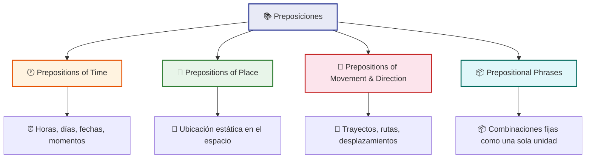

# 📍📘 MASTERCLASS: Preposiciones en Inglés — at, in, on y Más

## 🎯💡 IDEA PRINCIPAL

Las preposiciones son las palabras más pequeñas del inglés 🔬, pero también las más poderosas 💪. Cambiar una preposición puede alterar por completo el significado de una oración:

| Oración | Significado | Emoji |
|---------|-------------|-------|
| I'm **at** Platzi | Estoy en la institución (como estudiante o empleado) | 🏫 |
| I'm **on** Platzi | Estoy usando la plataforma (el sitio web/app) | 💻 |
| I'm **in** Platzi | Estoy dentro de las instalaciones físicas | 🏢 |

> 🌟 **Regla de oro** — Las preposiciones no se traducen literalmente. Se aprenden como combinaciones fijas que suenan naturales para un nativo.

---

## 🗺️📋 LOS 4 BLOQUES DEL CURSO



| Bloque | Símbolo | Qué dominas | Ejemplo clave |
|--------|---------|-------------|---------------|
| 🕐 **Time** | ⏰ | Horas, días, fechas y momentos | *at 3pm, in July, on Monday* |
| 📍 **Place** | 📍 | Ubicación estática de objetos/personas | *at the office, in London, on the table* |
| 🚶 **Movement** | 🚶 | Trayectos, rutas y desplazamientos | *from A to B, into the room, along the street* |
| 📦 **Phrases** | 📦 | Combinaciones fijas que funcionan como una unidad | *look after, depend on, deal with* |

---

## 🕐⏰ BLOQUE 1: Prepositions of Time

### 📋📌 Reglas fundamentales

| Preposición | Cuándo usarla | Ejemplo | Emoji |
|-------------|---------------|---------|-------|
| **at** | Horas exactas, momentos del día | at 3pm, at noon, at night, at sunrise | ⏰ |
| **in** | Meses, años, estaciones, partes del día | in July, in 2026, in the morning, in winter | 🗓️ |
| **on** | Días de la semana, fechas específicas | on Monday, on July 28, on Christmas Day | 📅 |

### 📊🔢 Tabla de referencia rápida

| Categoría | Preposición | Ejemplos | Emoji |
|-----------|-------------|----------|-------|
| **Hora exacta** | ⏰ **at** | at 7:00, at half past six, at midnight | 🕐 |
| **Parte del día** | ⏰ **in** | in the morning, in the afternoon, in the evening | 🌅 |
| **Día de la semana** | 📅 **on** | on Monday, on Friday night, on weekends | 📆 |
| **Fecha específica** | 📅 **on** | on July 28, on Christmas Day, on New Year's Eve | 🎄 |
| **Mes** | 🗓️ **in** | in July, in December, in August | 📅 |
| **Año** | 🗓️ **in** | in 2026, in 1999, in the future | 📆 |
| **Estación** | 🗓️ **in** | in summer, in winter, in spring | 🌞 |
| **Periodo largo** | 🗓️ **in** | in the 2020s, in the last decade | 📊 |

### 💡🧠 Trucos para recordar

```text
at → punto exacto (un momento en el tiempo) ⏱️
in → caja amplia (un período que te "contiene") 📦
on → superficie plana (un día específico como una línea) 📐
```

| Imagina | Preposición | Por qué | Emoji |
|---------|-------------|---------|-------|
| 📍 Un punto en el tiempo | **at** | Es exacto, específico | 🎯 |
| 📦 Una caja que lo contiene todo | **in** | Es un período amplio | 📮 |
| 📐 Una línea o superficie | **on** | Es un día concreto | 📏 |

### ⚠️🚨 Errores comunes

| ❌ Incorrecto | ✅ Correcto | Explicación | Emoji |
|---------------|-------------|-------------|-------|
| I go to work **in** 8am | I go to work **at** 8am | Las horas exactas usan **at** | ⏰ |
| She was born **on** 1995 | She was born **in** 1995 | Los años usan **in** | 📆 |
| We met **at** Monday | We met **on** Monday | Los días de la semana usan **on** | 📅 |
| He runs **in** the morning | He runs **in** the morning | ✅ Correcto — partes del día usan **in** | 🌅 |

---

## 📍📍 BLOQUE 2: Prepositions of Place

### 📋📌 Reglas fundamentales

| Preposición | Cuándo usarla | Ejemplo | Emoji |
|-------------|---------------|---------|-------|
| **at** | Un punto específico (dirección, ubicación exacta) | at the corner, at 55 Main Street | 🎯 |
| **in** | Un espacio cerrado o área delimitada | in the room, in London, in the park | 📦 |
| **on** | Una superficie o línea | on the wall, on the floor, on the coast | 📐 |

### 📊🔢 Tabla de referencia rápida

| Categoría | Preposición | Ejemplos | Emoji |
|-----------|-------------|----------|-------|
| **Punto exacto / dirección** | 🎯 **at** | at the bus stop, at the door, at home, at work | 📍 |
| **Espacio cerrado** | 📦 **in** | in the car, in the hospital, in the office | 🏠 |
| **Superficie** | 📐 **on** | on the ceiling, on the table, on the screen | 🖥️ |
| **Línea** | 📐 **on** | on the corner, on the left, on the right | ➡️ |
| **Ciudad / país** | 🏙️ **in** | in Madrid, in Spain, in Europe | 🌍 |
| **Isla** | 🏝️ **on** / **in** | on the island, in the island (según contexto) | 🏝️ |

### 💡🧠 Trucos para recordar

```text
at → punto (un lugar como si fuera un punto en el mapa) 📍
in → volumen (un espacio que tiene interior) 📦
on → superficie (algo que toca una cara) 📐
```

| Imagina | Preposición | Por qué | Emoji |
|---------|-------------|---------|-------|
| 📌 Un punto en el mapa | **at** | Es una ubicación precisa | 🎯 |
| 📦 Una caja con espacio interior | **in** | Algo está dentro de un volumen | 📮 |
| 📐 Una mesa o pared | **on** | Algo está apoyado en una superficie | 🖼️ |

### 🏠🔑 Ejemplos por escenario

| Escenario | at | in | on | Emoji |
|-----------|-----|-----|-----|-------|
| **Casa** | at home | in the kitchen | on the table | 🏠 |
| **Trabajo** | at work | in the office | on the desk | 💼 |
| **Transporte** | at the station | in the train | on the platform | 🚆 |
| **Ciudad** | at the airport | in the city | on the main road | 🏙️ |

---

## 🚶🚶 BLOQUE 3: Prepositions of Movement & Direction

### 📋📌 Reglas fundamentales

| Preposición | Significado | Ejemplo | Emoji |
|-------------|-------------|---------|-------|
| **to** | Hacia un destino | I'm going to the school | 🎯 |
| **from** | Desde un origen | I come from Spain | 📍 |
| **into** | Hacia el interior | She walked into the room | 🚪 |
| **out of** | Hacia el exterior | He ran out of the building | 🚪 |
| **through** | A través de (de un lado a otro) | We walked through the park | 🌳 |
| **along** | A lo largo de | We drove along the river | 📏 |
| **across** | De un lado al otro (cruzando) | She swam across the river | ➡️ |
| **around** | Alrededor de | We walked around the block | 🔄 |
| **towards** | Hacia (dirección general) | He walked towards the door | ➡️ |

### 📊🔢 Tabla de referencia rápida

| Tipo de movimiento | Preposición | Ejemplo | Emoji |
|--------------------|-------------|---------|-------|
| **Hacia un destino** | 🎯 **to** | Go to the hospital | 🏥 |
| **Desde un origen** | 📍 **from** | Come from the office | 🏢 |
| **Al interior** | 🚪 **into** | Walk into the room | 🚪 |
| **Al exterior** | 🚪 **out of** | Get out of the car | 🚗 |
| **A través de** | 🌳 **through** | Go through the tunnel | 🕳️ |
| **A lo largo** | 📏 **along** | Walk along the street | 🛤️ |
| **Cruzando** | ➡️ **across** | Swim across the pool | 🏊 |
| **Alrededor** | 🔄 **around** | Drive around the city | 🏙️ |
| **Hacia (general)** | ➡️ **towards** | Move towards the exit | 🚪 |

### 💡🧠 Trucos para recordar

```text
to     → destino final (llegas) 🎯
from   → origen (de dónde sales) 📍
into   → entrar (cruzar la frontera hacia dentro) 🚪
out of → salir (cruzar la frontera hacia fuera) 🚪
through → pasar de un lado a otro (dentro de algo) 🌳
across → cruzar de un lado al otro (sobre la superficie) ➡️
along  → seguir una línea 📏
```

### 🗺️🧭 Ejemplos de rutas

| Ruta | Oración | Emoji |
|------|---------|-------|
| 🏠 → 🏫 | I go **from** home **to** school | 🚶 |
| 🏢 → 🌳 | She walked **out of** the office **into** the park | 🌿 |
| 🛣️ → 🏙️ | We drove **along** the highway **towards** the city | 🚗 |
| 🌊 → 🏝️ | They swam **across** the river **to** the island | 🏝️ |

---

## 📦📦 BLOQUE 4: Prepositional Phrases

### 🤔 ¿Qué es una prepositional phrase?

Una **prepositional phrase** es un grupo de palabras que empieza con una preposición y termina con un sustantivo o pronombre. Funciona como una unidad única para dar información extra a la oración.

```text
Preposition + Object = Prepositional Phrase 🧩

at home → "at" + "home" 🏠
in the morning → "in" + "the morning" 🌅
on the table → "on" + "the table" 📐
```

### 📋📌 Las más comunes en inglés cotidiano

| Prepositional Phrase | Significado | Ejemplo | Emoji |
|----------------------|-------------|---------|-------|
| **at home** | en casa | I'm at home right now | 🏠 |
| **at work** | en el trabajo | She's at work until 5pm | 💼 |
| **at school** | en la escuela | The kids are at school | 🎒 |
| **in charge of** | a cargo de | He's in charge of the team | 👔 |
| **on purpose** | a propósito | I didn't do it on purpose | 🎯 |
| **by accident** | por accidente | I broke the vase by accident | 💥 |
| **in fact** | de hecho | In fact, I agree with you | ✅ |
| **on time** | a tiempo | The train arrived on time | ⏰ |
| **in time** | a tiempo (antes del deadline) | We arrived in time for the meeting | 🕐 |
| **at the moment** | en este momento | I'm busy at the moment | 🔄 |
| **by the way** | por cierto | By the way, did you eat? | 💬 |
| **in front of** | delante de | The cat is in front of the TV | 🐱 |
| **behind** | detrás de | The park is behind the school | 🌳 |
| **next to** | al lado de | My seat is next to the window | 🪟 |
| **between** | entre | The bank is between the hotel and the store | 🏦 |
| **opposite** | enfrente de | The café is opposite the museum | ☕ |
| **close to** | cerca de | The airport is close to the city | ✈️ |
| **far from** | lejos de | The beach is far from here | 🏖️ |

### 🧩🔧 Cómo funcionan en la oración

```text
Oración base:  She works ___ the office.
Con frase:     She works at the office. ✅

Oración base:  He arrived ___ time.
Con frase:     He arrived on time. ✅

Oración base:  The cat sat ___ the table.
Con frase:     The cat sat on the table. ✅
```

> 🌟 **Nota clave** — Las prepositional phrases son como "adornos" que le dan información extra a la oración. No cambian la estructura principal de la oración, pero la hacen mucho más precisa y natural.

---

## 🔄🔀 TABLA COMPARATIVA: at vs in vs on

| Criterio | at | in | on | Emoji |
|----------|-----|-----|-----|-------|
| **Tiempo** | Hora exacta | Período amplio | Día/ fecha específica | ⏰ |
| **Lugar** | Punto exacto | Espacio cerrado | Superficie | 📍 |
| **Movimiento** | Llegada a un punto | Entrar en un espacio | Apoyarse en una superficie | 🚶 |
| **Ejemplo (tiempo)** | at 5pm | in the summer | on Tuesday | 🕐 |
| **Ejemplo (lugar)** | at the station | in the building | on the platform | 🚉 |
| **Ejemplo (movimiento)** | arrive at | go in | step on | 👣 |

---

## 🎧🎬 METODOLOGÍA DE PRÁCTICA

### 🎯👂 Escucha activa

El núcleo del aprendizaje es entrenar el oído con situaciones reales. Las preposiciones no se aprenden solo con tablas — se aprenden escuchándolas en contexto.

**Cómo practicar:**
1. 🎧 Escucha un clip de audio o video en inglés
2. ✏️ Subraya todas las preposiciones que escuches
3. 📝 Anota el contexto (¿tiempo, lugar o movimiento?)
4. 🗣️ Repite las oraciones en voz alta

### 📓📝 Workbook descargable

El workbook incluye ejercicios prácticos divididos en 4 secciones, una por cada módulo:

| Sección | Tipo de ejercicio | Objetivo | Emoji |
|---------|-------------------|----------|-------|
| 🕐 **Time** | Completa con at / in / on | Dominar preposiciones de tiempo | ⏰ |
| 📍 **Place** | Ubica objetos en un mapa | Dominar preposiciones de lugar | 🗺️ |
| 🚶 **Movement** | Describe rutas en un mapa | Dominar preposiciones de movimiento | 🧭 |
| 📦 **Phrases** | Matching y fill-in-the-blank | Memorizar frases fijas comunes | 📋 |

### 🖼️📺 Apoyo visual y auditivo

| Recurso | Cómo usarlo | Emoji |
|---------|-------------|-------|
| 🗺️ Mapas de ubicación | Coloca objetos usando preposiciones de lugar | 📍 |
| 📹 Videos con subtítulos | Sigue las referencias en pantalla mientras escuchas | 🎥 |
| 🎙️ Role plays | Simula situaciones reales (pedir direcciones, describir lugares) | 🎭 |
| 📝 Flashcards | Una cara: la oración. Otra cara: la traducción + la preposición clave | 🃏 |

---

## ✅📝 EJERCICIOS PRÁCTICOS

### Ejercicio 1: Completa con at, in o on 🔤

| # | Oración | Respuesta | Emoji |
|---|---------|-----------|-------|
| 1 | I wake up ___ 7am every day. | **at** | ⏰ |
| 2 | She lives ___ Madrid. | **in** | 🏙️ |
| 3 | The meeting is ___ Monday. | **on** | 📅 |
| 4 | He works ___ a bank. | **at** | 🏦 |
| 5 | We went ___ the weekend. | **on** | 📆 |
| 6 | The cat is ___ the roof. | **on** | 🏠 |
| 7 | I was born ___ 1995. | **in** | 📆 |
| 8 | She waited ___ the bus stop. | **at** | 🚌 |
| 9 | They moved ___ a new apartment. | **into** | 🚪 |
| 10 | He walked ___ the door. | **out of** | 🚪 |

### Ejercicio 2: ¿at, in o on? 🤔

| # | Oración | Respuesta | Emoji |
|---|---------|-----------|-------|
| 1 | The restaurant is ___ the corner of the street. | **at** | 📍 |
| 2 | We'll travel ___ the summer. | **in** | ☀️ |
| 3 | The painting is ___ the wall. | **on** | 🖼️ |
| 4 | I'll meet you ___ the library. | **at** | 📚 |
| 5 | She's ___ holiday this week. | **on** | 🏖️ |
| 6 | The hotel is ___ the beach. | **on** | 🏖️ |
| 7 | He arrived ___ a quarter to eight. | **at** | ⏰ |
| 8 | The kids are ___ the playground. | **in** | 🎢 |
| 9 | We walked ___ the forest. | **through** | 🌲 |
| 10 | The shop is ___ the left. | **on** | ➡️ |

### Ejercicio 3: Prepositional phrases — Matching 🧩

| Columna A | Columna B | Emoji |
|-----------|-----------|-------|
| **by accident** | a) a propósito | 💥 |
| **on purpose** | b) de hecho | 🎯 |
| **in fact** | c) a tiempo | ✅ |
| **on time** | d) por accidente | ⏰ |
| **in charge of** | e) a cargo de | 👔 |

### Ejercicio 4: Describe la ruta 🗺️

Escribe la ruta completa usando preposiciones de movimiento:

> *Imagina que sales de tu casa, caminas a la estación, tomas el tren hacia el centro, bajas en la estación central y caminas hacia la oficina.*

**Tu respuesta:**

```text
I go ___ home ___ the station.
I take the train ___ the center.
I get off ___ the central station.
I walk ___ the office.
```

---

## 📚📖 RESUMEN VISUAL: LA REGLA DE LOS 3

```
         at              in              on
         │               │               │
    PUNTO EXACTO    VOLUMEN/CAJA    SUPERFICIE
         │               │               │
    ┌────┴────┐    ┌────┴────┐    ┌────┴────┐
    │         │    │         │    │         │
  hora     lugar  mes      espacio  día     superficie
  exacto   exacto año       cerrado  fecha   plana
  noche    específico estación  edificio fin de   pared
  mediodía         país      ciudad   semana   mesa
```

---

## 🧠📚 GLOSARIO RÁPIDO

| Término | Definición | Emoji |
|---------|------------|-------|
| **Preposition** | Palabra que conecta un sustantivo/pronombre con otro elemento de la oración | 🔗 |
| **Prepositional phrase** | Grupo de palabras que empieza con una preposición y termina con un sustantivo | 📦 |
| **at** | Preposición de punto exacto (tiempo o lugar) | 🎯 |
| **in** | Preposición de volumen o período amplio | 📮 |
| **on** | Preposición de superficie o día específico | 📐 |
| **Collocation** | Combinación frecuente de palabras que suenan naturales | 🤝 |
| **Movement preposition** | Preposición que indica dirección o desplazamiento | 🚶 |
| **Static preposition** | Preposición que indica ubicación fija | 📍 |
| **Fill-in-the-blank** | Ejercicio donde se completa una oración con la palabra faltante | ✏️ |
| **Role play** | Simulación de una situación real para practicar | 🎭 |
| **Shadowing** | Técnica de repetir en voz alta lo que escuchas, imitando ritmo y pronunciación | 🎙️ |

---

## 📝📋 Preguntas de Verificación

1. **Aplica**: ¿Qué preposición usas para decir "Llegué a las 3pm"? ¿Y para "Llegué en julio"? ¿Y para "Llegué el lunes"? ⏰📅

2. **Analiza**: ¿Por qué decimos *"at the station"* pero *"in the train"*? ¿Qué patrón hay detrás? 🧠

3. **Transforma**: Convierte estas oraciones cambiando la preposición para que el significado cambie:
   - a) *She is in the garden.* → Ahora está sobre la mesa del jardín. 🌿
   - b) *He walked to the store.* → Ahora caminó desde la tienda. 🚶

4. **Memoriza**: Escribe 5 prepositional phrases que uses en tu vida diaria. ¿En qué contexto las usas? 📝

5. **Identifica**: Escucha un podcast o video en inglés durante 5 minutos. Subraya todas las preposiciones que escuches. ¿Cuántas son de tiempo, lugar o movimiento? 🎧

6. **Producción**: Describe tu ruta desde tu casa hasta el trabajo o la escuela usando al menos 5 preposiciones de movimiento diferentes. 🗺️

7. **Comparación**: ¿En tu idioma nativo las preposiciones funcionan igual que en inglés? ¿Qué diferencias has notado? 🌐

8. **Desafío**: Escribe un párrafo de 10 oraciones sobre tu día usando al menos 8 preposiciones diferentes (at, in, on, to, from, into, out of, through, along, across, around, towards). ✍️

9. **Reflexión**: ¿Qué bloque del curso te resultó más difícil? ¿Por qué crees que es el más complicado? 🤔

10. **Síntesis**: ¿Cuál es la diferencia entre *"I arrived on time"* y *"I arrived in time"*? ¿Cuándo usarías cada una? ⏰

---

## ✅📋 CHECKLIST FINAL

| Bloque | Check | Pregunta clave | Emoji |
|--------|-------|----------------|-------|
| ⏰ Time | ☐ | ¿Uso **at** para horas, **in** para períodos y **on** para días? | ⏰ |
| 📍 Place | ☐ | ¿Uso **at** para puntos, **in** para espacios cerrados y **on** para superficies? | 📍 |
| 🚶 Movement | ☐ | ¿Conozco **to, from, into, out of, through, across, along**? | 🚶 |
| 📦 Phrases | ☐ | ¿Memoricé las prepositional phrases más comunes? | 📦 |
| 🎧 Listening | ☐ | ¿Practiqué escuchando preposiciones en contexto real? | 🎧 |
| 📝 Exercises | ☐ | ¿Completé todos los ejercicios y revisé mis errores? | ✅ |

---

## 🏁🚀 CIERRE

Las preposiciones no tienen reglas lógicas perfectas — son combinaciones que se aprenden con práctica y exposición. Pero una vez que dominas los patrones básicos de **at** (punto), **in** (volumen) y **on** (superficie), el 80% de los casos cotidianos se resuelven automáticamente. 🎯

> *"Las preposiciones son el pegamento del inglés. Pequeñas, invisibles, pero sin ellas, todo se desmorona."* 📍💬

Empieza por el Bloque 1, practica todos los días con los ejercicios del workbook, y en 4 semanas las preposiciones dejarán de ser un problema. 🚀✨

---