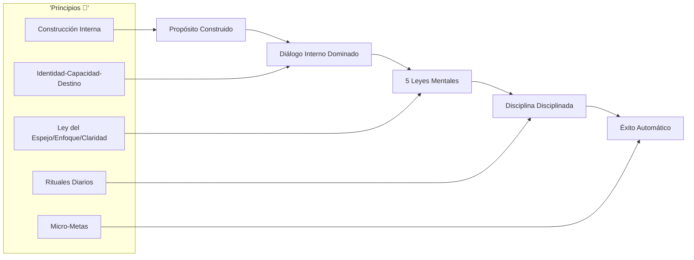
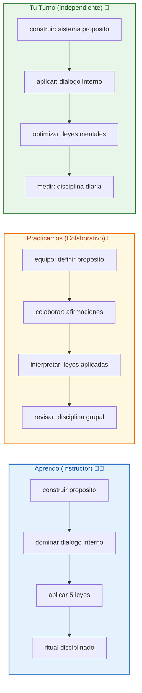
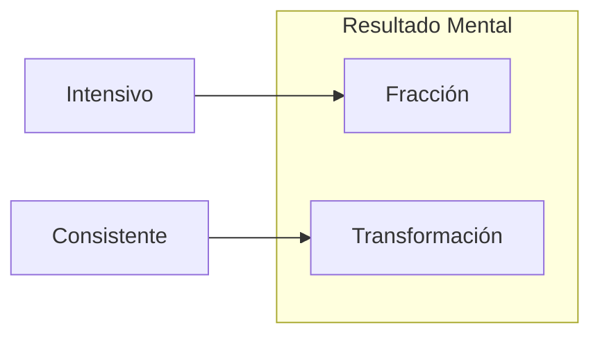

# 🎯 MASTERCLASS: Los Principios de Éxito de Brian Tracy — Propósito, Diálogo Interno y Leyes Mentales 🔥

## 🎯 INTRODUCCIÓN: POR QUÉ ESTE MASTERCLASS ES DIFERENTE 💡

La mayoría busca el éxito como si fuera un destino alejado. Pero Brian Tracy revela que el éxito es **interno antes que externo**. Se construye desde adentro: con propósito, diálogo interno preciso y leyes mentales que regulan tu mente.

Este masterclass transforma conceptos en sistemas prácticos: de la construcción del propósito hasta la disciplina mediante rituales diarios.

> **🎯 Objetivo de Aprendizaje** — Al final de esta guía, construirás tu propósito consciente, dominarás tu diálogo interno, aplicarás las 5 leyes mentales y tendrás disciplina mediante micro-hábitos.

> **⚠️ Advertencia transformacional** — Este contenido es formativo. Los cambios internos requieren práctica constante. Ningún principio funciona sin ejecución diaria.

---

## 🗺️ MAPA DE LOS PRINCIPIOS DEL ÉXITO 🗺️🚀



| Principio 🎯 | Pregunta que responde ❓ | Resultado principal 🎯 |
|------------|-----------------------|------------------|
| **Propósito** 🎯 | ¿Qué construyo internamente? | Dirección clara |
| **Diálogo Interno** 🧠 | ¿Cómo me hablo a mí mismo? | Mentalidad ganadora |
| **5 Leyes Mentales** ⚖️ | ¿Qué leyes rigen mi éxito? | Coherencia mental |
| **Disciplina** 💪 | ¿Cómo mantengo el ritmo? | Ritual automático |

---



---

## 🎯 PARTE 1: CONSTRUCCIÓN DEL PROPÓSITO (0:00 - 34:53) 🎯✨

### 1.1 🛠️ El propósito se construye, no se encuentra

"El propósito no es algo que se encuentra por suerte, sino que se construye internamente a través de decisiones conscientes."

**Clave:** No esperes el propósito perfecto. **Sé el tipo de persona que decide y construye**.

### 1.2 🔗 Coherencia: clave del propósito

"La verdadera plenitud proviene de la coherencia entre lo que pensamos, sentimos y hacemos."

| Pensamiento | Sentimiento | Acción | Resultado |
|-------------|-------------|--------|-----------|
| Mis alineado | Energía | Coherente | Plenitud |
| Desalineado | Incongruencia | Contradictorio | Vacío |

### 1.3 ⚡ Vivir con intención

"Vivir con intención transforma tareas cotidianas en actos significativos y aumenta la energía personal."

```
🎯 Intención diaria:
1. ¿Qué acto haré HOY con intención?
2. ¿Qué significado le doy?
3. ¿Qué energía libero al hacerlo?
```

### 1.4 🛠️ Plantilla de construcción de propósito

```
🔨 Propósito en construcción:
VALORES:
- [ ] Valor 1 (ej: crecimiento)
- [ ] Valor 2 (ej: servicio)
- [ ] Valor 3 (ej: excelencia)

DECISIONES:
- [ ] Decidir ser aquel tipo de persona
- [ ] Practicar coherencia diaria
- [ ] Convertir lo pensado en acción

RESULTADO:
- [ ] Mayor energía
- [ ] Sentido de significado
- [ ] Dirección clara
```

---

## 🧠 PARTE 2: EL PODER DEL DIÁLOGO INTERNO (34:54 - 58:43) 🧠✨

### 2.1 💪 La herramienta más poderosa

"El diálogo interno es la herramienta más poderosa para reprogramar la mente hacia el éxito."

Tu mente cree lo que repites. Cambia lo que dices a ti mismo, cambia tu vida.

### 2.2 🔺 Fórmula de tres pilares

"Identidad, capacidad y destino forman la base del diálogo interno transformador."

| Pilar | Pregunta | Afirmación Ejemplo |
|-------|----------|-------------------|
| **Identidad** 🆔 | ¿Quién soy? | "Soy una persona disciplinada" |
| **Capacidad** 💪 | ¿Qué puedo? | "Puedo aprender cualquier cosa" |
| **Destino** 🎯 | ¿Hacia dónde voy? | "Estoy en el camino correcto" |

### 2.3 🔄 Consistencia vs Intensidad

"La consistencia en cómo nos hablamos a nosotros mismos supera a la intensidad esporádica."



---

## ⚖️ PARTE 3: LAS 5 LEYES MENTALES DEL ÉXITO (59:40 - 1:30:48) ⚖️✨

### 3.1 🪞 Ley del Espejo Interno

"Proyectamos en el exterior lo que albergamos internamente."

| Interno | Externo | Estrategia |
|----------|---------|------------|
| Amor propio | Relaciones saludables | Auto-diálogo positivo |
| Miedo al juicio | Aislamiento | Aceptación consciente |
| Capacidad | Oportunidades | Afirmación de habilidades |

### 3.2 🎯 Ley del Enfoque Mental

"La atención expande aquello en lo que nos concentramos."

> **Regla:** Donde pones tu atención, crece tu mundo.

```
🔍 Enfoque consciente:
- ¿En qué piensas más?
- ¿Qué creces por pensar?
- ¿Cómo rediriges tu atención?
```

### 3.3 🔍 Ley de la Claridad Absoluta

"El éxito requiere saber con exactitud qué se quiere lograr y sacrificar lo innecesario."

| Claridad Parcial | Claridad Total | Diferencia |
|------------------|----------------|------------|
| "Quiero más dinero" | "$100K/año en 2 años" | Dirección precisa |
| Metas nubladas | Metas escritas | Acción específica |
| Todo sirve | Sacrificios claros | Enfoque real |

---

## 💪 PARTE 4: PRESENCIA Y DISCIPLINA (1:31:48 - 2:16:25) 💪✨

### 4.1 🙇 El respeto se entrena

"El respeto no se exige con fuerza, sino que se entrena mediante el autocontrol, el silencio estratégico y la postura."

| Elemento | Entrenamiento | Resultado |
|----------|---------------|-----------|
| **Autocontrol** 💪 | Dominar micro-decisiones | Credibilidad |
| **Silencio** 🤫 | Escuchar más | Sabiduría |
| **Postura** 🧍 | Presencia física | Dominio |

### 4.2 🐢 Micro-metas para fortalecer identidad

"Empezar con metas pequeñas para fortalezar la identidad disciplinada."

```
🐢 Progreso por micro-metas:
1. Meta ridícula (ej: 2 minutos)
2. Completar sin negociación
3. Sentir victoria
4. Repetir con consistencia
5. Identity shift sucede
```

### 4.3 📋 Rituales diarios vs Motivación

"Apoyarse en rituales diarios en lugar de depender únicamente de la motivación emocional."

| Motivación | Ritual | Diferencia |
|------------|--------|------------|
| Depende del estado | Independiente del estado | Confiable |
| Altibajos | Constante | Predecible |
| Exhaustiva | Energizante | Sostenible |

---

## 🎓 PARTE 5: I DO / WE DO / YOU DO — EJERCICIOS PRÁCTICOS 🎓✨

### 5.1 🏫 I Do — Construir propósito

| Paso 🚶 | Acción ⚡ | Resultado esperado ✅ |
|------|--------|--------------------|
| 1️⃣ 🎯 | Escribir 3 valores clave | Lista definida |
| 2️⃣ 🔗 | Alinear pensamiento/sentimiento/acción | Coherencia planeada |
| 3️⃣ ⚡ | Practicar intención en 1 tarea | Energía liberada |
| 4️⃣ 📊 | Medir plenitud post-ejecución | Feedback real |

### 5.2 👥 We Do — Diálogo interno grupal

**Tarea colaborativa:**

```
👥 Afirmaciones grupales:
1. Identidad compartida: "Somos disciplinados"
2. Capacidad: "Podemos lograr objetivos"
3. Destino: "Estamos en el camino correcto"
4. Repetir juntos 3 veces
5. Compartir sensación post-afirmación
```

### 5.3 🎯 You Do — Sistema de disciplina

**Tarea:** elige UNA micro-meta esta semana:

| Sistema 🛠️ | Acción ⚡ | Alerta 🔔 |
|------------|---------|----------|
| 🎯 Propósito | Intención en 1 tarea diaria | Sin intención 3 días |
| 🧠 Diálogo | Afirmación 3 veces/día | Sin afirmación 5 días |
| ⚖️ Leyes | Aplicar una ley hoy | Sin aplicación 2 días |
| 💪 Disciplina | Ritual matutino | Sin ritual 7 días |

---

## ✅ PARTE 6: CHECKLIST FINAL 🏁✨

| Principio 🛠️ | Check ✅ |
|------------|-------|
| **Propósito construido** | 🎯 Decisiones conscientes de valores |
| **Diálogo interno dominado** | 🧠 Afirmaciones de identidad/capacidad/destino |
| **Ley del Espejo** | 🪞 Crecimiento interno = crecimiento externo |
| **Ley del Enfoque** | 🎯 Atención dirigida con intención |
| **Claridad absoluta** | 🔍 Metas precisas y sacrificios claros |
| **Disciplina ritualizada** | 💪 Rutina diaria sin motivación |

---

## 📝 PARTE 7: PREGUNTAS DE VERIFICACIÓN 📝✨

Responde cada pregunta basándote en los conceptos.

### Preguntas sobre propósito

1. **🎯 Aplica**: ¿Qué valores construyes hoy? ¿Cómo los alineas con tus acciones?

2. **🔍 Analiza**: ¿En qué tarea puedes poner intención ahora? ¿Qué energía liberas?

### Preguntas sobre diálogo interno

3. **🧠 Diseña**: Escribe tu afirmación de los 3 pilares (identidad, capacidad, destino). ¿Cómo suena?

4. **✅ Evalúa**: ¿Eres intenso o consistente con tu diálogo interno? ¿Qué cambiarías?

### Preguntas sobre leyes

5. **🪞 Conecta**: ¿Qué proyecto mental estás proyectando afuera? ¿Qué necesitas cambiar internamente?

6. **🎯 Propón**: Toma una meta difusa. Aplítale la claridad absoluta. ¿Qué sacrificarías?

---

## 📚 GLOSARIO RÁPIDO 📖✨

| Término 📝 | Definición 📋 |
|---------|------------|
| **Propósito construido** 🛠️ | Dirección creada por decisiones |
| **Diálogo interno** 🧠 | Lo que repites a ti mismo |
| **Afirmación** 💬 | Declaración de identidad real |
| **Intención** ⚡ | Actuar con significado |
| **Ley del Espejo** 🪞 | Interno proyectado externo |
| **Ley del Enfoque** 🎯 | Atención expande lo que observa |
| **Claridad absoluta** 🔍 | Metas precisas y sacrificios definidos |
| **Micro-meta** 🐢 | Objetivo tan pequeño que no falla |

---

## 📐 ANEXO: FORMATO IDEAL PARA MASTERCLASS EDUCATIVAS 📐✨

### 📏 Estructura visual recomendada 📏✨

El ancho óptimo 📏 para masterclasses educativas es **60–75 caracteres por línea** 📐.

```css
.article-content {
  font-size: 18px;
  line-height: 1.75;
  max-width: 65ch;
}
```

---

### 🎯 CIERRE PRÁCTICO 🎯✨

| Nivel 📊 | Debes poder hacer ✨ |
|-------|------------------|
| **🏫 I Do** | ✅ Construir propósito y practicar intención |
| **👥 We Do** | 🤝 Dominar diálogo interno en grupo |
| **🎯 You Do** | 🚀 Disciplina ritualizada sin motivación |

---

## 🎁 RECURSOS ADICIONALES 🎁✨

- 📖 [📚 Brian Tracy - Éxito](https://www.briantracy.com)
- 🎥 [🎬 Video original: "Los Principios del Éxito"]
- 💻 [💻 Herramientas: Afformaciones, Meditación guiada]
- 🛠️ [🛠️ Libros: "Las 21 leyes inmutables", "El poder del ahora"]

---

**🎉 Felicitaciones! Has completado la masterclass de los principios de éxito de Brian Tracy. 🚀 Ahora tienes sistemas para construir propósito, dominar tu diálogo interno, aplicar las leyes mentales y disciplina ritualizada sin depender de la motivación.**