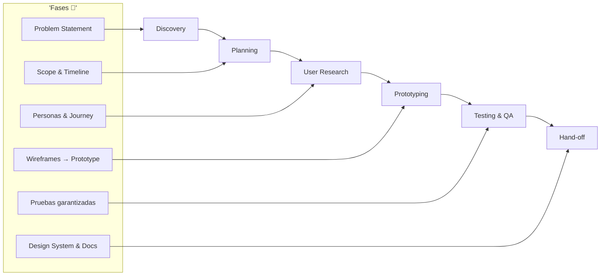
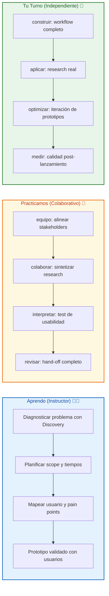

# 🎯 MASTERCLASS: El Proceso de Diseño y Desarrollo de Producto Digital 🔥

## 🎯 INTRODUCCIÓN: POR QUÉ ESTE MASTERCLASS ES DIFERENTE 💡

Un producto digital exitoso no nace de una buena idea aislada, sino de un **proceso repetible que convierte incertidumbre en decisiones validadas**. Esta masterclass desarrolla en profundidad las seis fases que forman ese proceso, explicando el concepto detrás de cada una, la metodología que la sostiene, las herramientas típicas y los entregables que marcan que una fase está lista para avanzar.

La idea central es doble: por un lado, reducir el **riesgo de valor** (construir algo que nadie necesita); por otro, reducir el **riesgo de ejecución** (construir mal algo que sí se necesita).

> **🎯 Principio guía** — Nunca se avanza de fase por calendario, se avanza cuando la evidencia recogida en la fase actual sustenta la siguiente decisión.

> **⚠️ Advertencia estratégica** — Este contenido es formativo. Cada fase requiere práctica. Nadie obtiene evidencia significativa sin involucrar a usuarios reales y stakeholders.

---

## 🗺️ MAPA DEL WORKFLOW: SEIS FASES DEL PRODUCTO 🗺️🚀



| Fase 🎯 | Pregunta que responde ❓ | Resultado principal 🎯 | Riesgo mitigado |
|--------|-----------------------|------------------|------------|
| **Discovery** 🎯 | ¿Qué problema vale la pena resolver? | Problem statement validado | Riesgo de valor |
| **Planning** 📋 | ¿Cómo lo vamos a construir juntos? | Scope + cronograma | Riesgo de ejecución |
| **User Research** 🧠 | ¿Quién es el usuario y qué necesita? | Personas + journey map | Riesgo de valor |
| **Prototyping** 🎨 | ¿Cómo se verá y sentirá el producto? | Prototipo clicable validado | Riesgo de usabilidad |
| **Testing & QA** 🧪 | ¿El producto funciona como debe? | Reporte sin bugs críticos | Riesgo de ejecución |
| **Hand-off** 🚀 | ¿Cómo se entrega con claridad? | Design system + docs | Riesgo de continuidad |

---



---

## 🔍 PARTE 1: DISCOVERY — DIAGNÓSTICO DEL PROBLEMA (0:00 - 25:00) 🔍✨

### 1.1 🛠️ El problema vs. el síntoma

La fase de Discovery no busca generar soluciones, sino **delimitar con evidencia qué problema vale la pena resolver**. Muchos equipos empiezan a diseñar sin entender la causa raíz.

| Enfoque | Acción | Resultado |
|--------|--------|-----------|
| **Síntoma** | Resolver primera queja | Solución parcial |
| **Causa raíz** | Investigar profundamente | Solución sistémica |

### 1.2 💡 Ideas y conceptos clave

| Concepto | Qué mide | Por qué importa |
|----------|---------|-----------------|
| **Problem vs. Síntoma** | Causa raíz | Solución real |
| **Investigación de mercado** | Tamaño oportunidad | Viabilidad |
| **Análisis competitivo** | Vacíos del mercado | Diferenciación |
| **Objetivos SMART** | KPIs medibles | Dirección clara |
| **Alineación stakeholders** | Visión compartida | Evita conflictos |

### 1.3 🛠️ Metodología ejecutada

```
🔧 Protocolo de Discovery:
1. Entrevistas a stakeholders internos
2. Benchmark de 3-5 competidores directos
3. Revisión de datos existentes (si aplica)
4. Kickoff workshop: problem statement colectivo
```

### 1.4 📦 Herramientas habituales

Notion/Confluence, Miro/FigJam, GA4/Mixpanel

### 1.5 ✅ Entregables de salida

- **Problem statement** validado y aprobado
- Documento de contexto de mercado y competencia
- Objetivos de producto medibles (KPIs iniciales)

### 1.6 ⚠️ Error crítico

> Saltarse Discovery "para ganar tiempo" suele costar más tiempo después: equipos rediseñan cuando el negocio descubre que el foco era otro.

---

## 📋 PARTE 2: PLANNING — PLAN DE EJECUCIÓN (25:00 - 35:00) 📋✨

### 2.1 🛠️ Planificación como puente

Planning traduce el problema validado en un plan de ejecución: alcance, secuencia, tiempos y forma de colaborar.

### 2.2 💡 Ideas y conceptos clave

| Concepto | Función | Ejemplo |
|----------|---------|---------|
| **Scope** | Qué entra y qué no | Funcionalidades priorizadas |
| **Enfoque ágil** | Iteración corta | Sprints de 2 semanas |
| **Transparencia** | Comunicación clara | Updates semanales |
| **Gestión de riesgos** | Identificar dependencias | Recursos limitados |

### 2.3 🛠️ Metodología ejecutada

```
🔧 Protocolo de Planning:
1. Definición conjunta del alcance (qué queda fuera)
2. Desglose en tareas con estimaciones
3. Cronograma con milestones y checkpoints
4. Protocolo de comunicación y feedback
```

### 2.4 📦 Herramientas habituales

Jira/Asana/Trello, Gantt (Notion/ClickUp), Slack/Teams

### 2.5 ✅ Entregables de salida

- **Scope of work** firmado o acordado
- Cronograma con hitos y responsables
- Protocolo de comunicación y reporte

### 2.6 ⚠️ Error crítico

> Planificar en exceso de detalle para fases lejanas genera planes frágiles: mejor precisión inmediata y dirección para el futuro.

---

## 🧠 PARTE 3: USER RESEARCH — INVESTIGACIÓN DE USUARIOS (35:00 - 75:00) 🧠✨

### 3.1 🛠️ Evidencia sobre suposiciones

Esta fase convierte suposiciones internas en **evidencia externa** sobre usuarios reales.

### 3.2 💡 Ideas y conceptos clave

| Concepto | Qué mide | Qué descubre |
|----------|----------|--------------|
| **Persona** | Segmento real | Arquetipo representativo |
| **Journey Map** | Recorrido completo | Pain points y emociones |
| **Cualitativo** | El "por qué" | Comportamiento profundo |
| **Cuantitativo** | El "cuánto" | Escala del problema |

### 3.3 🛠️ Metodología ejecutada

```
🔧 Protocolo de User Research:
1. Entrevistas semiestructuradas (5-8 por segmento)
2. Encuestas para validar magnitud de hallazgos
3. Análisis de datos existentes (heatmaps, soporte)
4. Síntesis en personas y journey maps priorizados
```

### 3.4 📦 Herramientas habituales

Maze/UserTesting, Dovetail, Miro/FigJam, Typeform/Forms

### 3.5 ✅ Entregables de salida

- 1-3 user personas priorizadas y validadas
- Journey map con touchpoints y pain points marcados
- Lista priorizada de necesidades y oportunidades

### 3.6 ⚠️ Error crítico

> Confundir "lo que el usuario dice" con "lo que hace" es el error más costoso: siempre contrastar discurso con datos de comportamiento.

---

## 🎨 PARTE 4: PROTOTYPING — HIPÓTESIS TANGIBLES (75:00 - 125:00) 🎨✨

### 4.1 🛠️ Fidelidad progresiva

Prototyping materializa decisiones en artefactos tangibles. **Se avanza de baja a alta fidelidad** para gastar esfuerzo solo cuando la dirección está validada.

### 4.2 💡 Ideas y conceptos clave

| Nivel | Tipo | Cuándo usar |
|-------|------|-------------|
| **Wireframes** | Baja fidelidad | Validar estructura |
| **Mockups** | Fidelidad visual | Definir estética |
| **Prototipo** | Interactividad | Test con usuarios |

### 4.3 🛠️ Metodología ejecutada

```
🔧 Protocolo de Prototyping:
1. Wireframes para flujos críticos (baja fidelidad)
2. Mockups estáticos con sistema visual definitivo
3. Prototipo clicable para pruebas de usabilidad
4. Ciclos cortos: cada test genera ajustes inmediatos
```

### 4.4 📦 Herramientas habituales

Figma (estándar), Framer/Origami (microinteracciones)

### 4.5 ✅ Entregables de salida

- Wireframes aprobados de flujos críticos
- Mockups de alta fidelidad alineados a marca
- Prototipo clicable navegable para usuarios reales

### 4.6 ⚠️ Error crítico

> Saltar a alta fidelidad sin validar estructura fuerza a "re-trabajar" pantallas completas cuando el flujo es el problema.

---

## 🧪 PARTE 5: TESTING & QA — CALIDAD GARANTIZADA (125:00 - 165:00) 🧪✨

### 5.1 🛠️ QA como proceso continuo

QA verifica que lo construido funcione como se diseñó. **Idealmente corre en paralelo al desarrollo**, no como último paso.

### 5.2 💡 Ideas y conceptos clave

| Tipo de prueba | Qué evalúa | Herramienta típica |
|---------------|------------|-------------------|
| **Funcional** | El producto hace lo especificado | Test cases |
| **Rendimiento** | Tiempos de carga, carga concurrente | Lighthouse, k6 |
| **Seguridad** | Vulnerabilidades, datos sensibles | OWASP ZAP |
| **Usabilidad** | Facilidad y agrado | Maze, UserTesting |

### 5.3 🛠️ Metodología ejecutada

```
🔧 Protocolo de Testing:
1. Definición de casos de prueba a partir de requisitos
2. Pruebas de regresión automatizadas
3. Pruebas exploratorias manuales en flujos críticos
4. Registro y priorización de bugs por severidad
```

### 5.4 📦 Herramientas habituales

Jira/Linear, Cypress/Playwright, Lighthouse, OWASP ZAP

### 5.5 ✅ Entregables de salida

- Reporte de pruebas con casos ejecutados y bugs abiertos
- Cero bugs críticos o bloqueantes
- Evidencia de pruebas de rendimiento y seguridad

### 5.6 ⚠️ Error crítico

> Tratar QA como el último paso concentra riesgo al final, cuando menos margen de tiempo queda para corregir.

---

## 🚀 PARTE 6: HAND-OFF — ENTREGA CON CLARIDAD (165:00 - 185:00) 🚀✨

### 6.1 🛠️ Documentación como activo viviente

Hand-off es la transición ordenada del diseño y conocimiento hacia quien lo mantiene. **No debe depender de la memoria** del diseñador.

### 6.2 💡 Ideas y conceptos clave

| Elemento | Qué incluye | Por qué importa |
|----------|-------------|-----------------|
| **Documentación** | Specs, decisiones, justificación | Contexto preservado |
| **Design system** | Componentes, estados, reglas | Consistencia futura |
| **Soporte post-entrega** | Acompañamiento implementación | Reducción fricción |

### 6.3 🛠️ Metodología ejecutada

```
🔧 Protocolo de Hand-off:
1. Organización de archivos con nomenclatura clara
2. Documentación de specs técnicas (medidas, colores, estados)
3. Sesión de traspaso en vivo con equipo receptor
4. Acuerdo de soporte post-lanzamiento (SLA, canales)
```

### 6.4 📦 Herramientas habituales

Figma Dev Mode/Zeplin, Storybook, Notion/Confluence

### 6.5 ✅ Entregables de salida

- Archivo de diseño limpio con specs exportables
- Documento de design system o guía de estilo
- Acuerdo de soporte post-lanzamiento

### 6.6 ⚠️ Error crítico

> Entregar solo el archivo visual sin las decisiones obliga al equipo a adivinar intención, generando desviaciones en la implementación.

---

## 🎓 PARTE 7: I DO / WE DO / YOU DO — EJERCICIOS PRÁCTICOS 🎓✨

### 7.1 🏫 I Do — Diagnosticar con Discovery

| Paso 🚶 | Acción ⚡ | Resultado esperado ✅ |
|------|--------|--------------------|
| 1️⃣ 🔍 | Mapear problem statement | Problema raíz identificado |
| 2️⃣ 📊 | Revisar datos de mercado | Contexto cuantificado |
| 3️⃣ 👥 | Alinear stakeholders en workshop | Visión compartida |
| 4️⃣ 📋 | Definir KPIs SMART | Metas medibles |

```
🔍 Ejercicio guiado:
- Toma un producto existente
- Escribe el problem statement actual
- ¿Está validado con evidencia o es solo intuición?
```

### 7.2 👥 We Do — Planning colaborativo

**Tarea colaborativa:**

```
📋 Checklist grupal:
1. ¿Qué entra y qué no entra en el scope?
2. ¿Qué dependencias externas hay?
3. ¿Quién es el responsable de cada milestone?
4. ¿Qué protocolo de comunicación funciona mejor?
```

### 7.3 🎯 You Do — Research y prototype

**Tarea:** diseña tu proceso completo:

| Sistema 🛠️ | Acción ⚡ | Alerta 🔔 |
|------------|---------|----------|
| 🔍 Discovery | Problem statement validado | Sin evidencia en 3 días |
| 📋 Planning | Scope y timeline definido | Sin alineación en 1 semana |
| 🧠 Research | Personas y journey map | Sin datos reales en 2 semanas |
| 🎨 Prototype | Wireframes + test usuarios | Sin validación en 3 semanas |
| 🧪 QA | Pruebas automatizadas | Sin cobertura 80% en 4 semanas |
| 🚀 Hand-off | Design system entregado | Sin docs en 5 días |

---

## ✅ PARTE 8: CHECKLIST FINAL 🏁✨

| Fase 🧩 | Check ✅ |
|--------|---------|
| **Discovery** 🔍 | 🎯 Problema raíz identificado y validado |
| **Planning** 📋 | 📋 Scope acordado por escrito |
| **User Research** 🧠 | 🧠 Personas basadas en datos reales |
| **Prototyping** 🎨 | 🎨 Prototipo testeado con usuarios |
| **Testing & QA** 🧪 | 🧪 Sin bugs críticos abiertos |
| **Hand-off** 🚀 | 🚀 Documentación completa entregada |

---

## 📝 PARTE 9: PREGUNTAS DE VERIFICACIÓN 📝✨

Responde cada pregunta basándote en los conceptos de esta masterclass.

### Preguntas sobre Discovery

1. **🎯 Aplica**: Toma un producto que conozcas. ¿Cuál es el problem statement real? ¿Está validado?

2. **🔍 Analiza**: ¿Qué sucede si saltas Discovery para entrar directo a prototipar? ¿Qué riesgos acumulas?

### Preguntas sobre User Research

3. **🧠 Diseña**: Un usuario dice "quiero más opciones" pero los datos muestran que abandona al ver muchas. ¿Qué harías?

4. **✅ Evalúa**: ¿Por qué es peligroso confiar solo en entrevistas cualitativas sin datos de comportamiento?

### Preguntas sobre Testing

5. **🧪 Conecta**: ¿Cómo afecta tu proceso si QA es solo el último paso antes de lanzar?

6. **📈 Propón**: Diseña un test de usabilidad para validar un flujo de onboarding. ¿Qué métricas medirías?

### Preguntas integradoras

7. **🔄 Síntesis**: Si en Testing descubres que el journey map estaba mal, ¿puedes retroceder a Research? ¿Qué gates debes revisar?

8. **⚡ Reflexión final**: De las 6 fases, ¿cuál consideras la más crítica para evitar fracasos de producto? Justifica tu respuesta.

---

## 📚 GLOSARIO RÁPIDO 📖✨

| Término 📝 | Definición 📋 |
|---------|------------|
| **Discovery** 🔍 | Fase de diagnóstico del problema real |
| **Planning** 📋 | Traducción del problema a plan de ejecución |
| **User Research** 🧠 | Investigación que sustituye suposiciones por evidencia |
| **Prototyping** 🎨 | Materialización de hipótesis en artefactos tangibles |
| **Testing & QA** 🧪 | Verificación de calidad y funcionalidad |
| **Hand-off** 🚀 | Entrega ordenada con documentación |
| **Problem statement** 🎯 | Definición precisa del problema a resolver |
| **User persona** 🧍 | Arquetipo representativo basado en datos |
| **Journey map** 🗺️ | Visualización del recorrido del usuario |
| **Design system** 🎨 | Componentes y reglas reutilizables |

---

## 📐 ANEXO: FORMATO IDEAL PARA MASTERCLASS EDUCATIVAS 📐✨

### 📏 Estructura visual recomendada 📏✨

El ancho óptimo 📏 para masterclasses educativas es **60–75 caracteres por línea** 📐.

```css
.article-content {
  font-size: 18px;
  line-height: 1.75;
  max-width: 65ch;
}
```

---

### 🎯 CIERRE PRÁCTICO 🎯✨

| Nivel 📊 | Debes poder hacer ✨ |
|-------|------------------|
| **🏫 I Do** | 🔍 Diagnosticar problemas con Discovery |
| **👥 We Do** | 🤝 Alinear stakeholders y research colaborativo |
| **🎯 You Do** | 🚀 Ejecutar workflow completo con QA integrado |

---

## 🎁 RECURSOS ADICIONALES 🎁✨

- 📖 [📚 Figma - Design Systems](https://www.figma.com/resources/design-systems/)
- 🎥 [🎬 Video original: "Proceso de Diseño de Producto Digital"]
- 💻 [💻 Herramientas: Figma, Notion, Jira, Maze]
- 🛠️ [🛠️ Libros: "Sprint" de Jake Knapp, "Lean UX" de Jeff Gothelf]