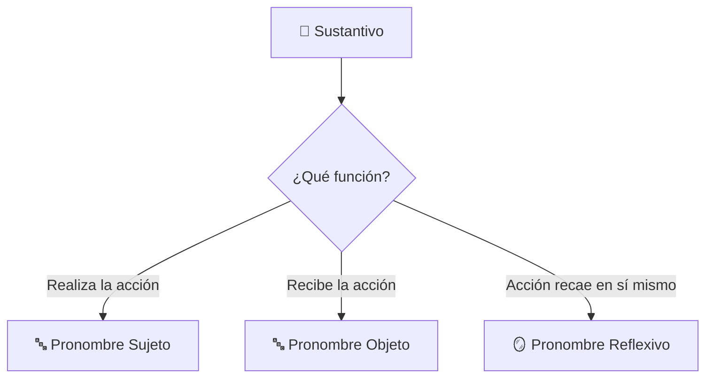
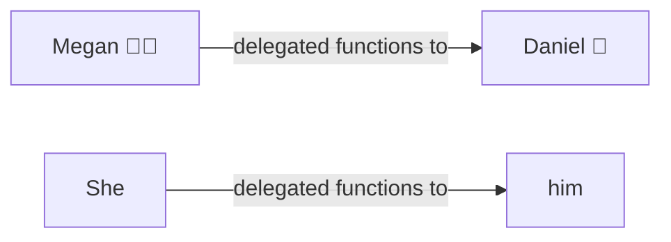
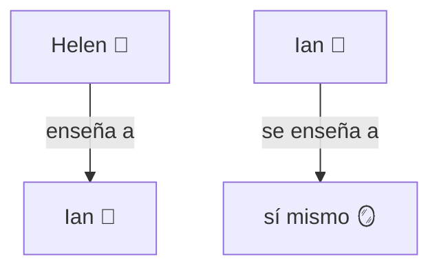

# MASTERCLASS: Pronombres en Inglés 🔤 — Sujeto, Objeto y Reflexivos ✨

## 📌 INTRODUCCIÓN: POR QUÉ ESTA MASTERCLASS ES DIFERENTE 🚀

Hablar y escribir en inglés se siente pesado cuando repetimos el mismo nombre una y otra vez: *"John called John's friend because John wanted John's friend to help John."* 😵 Eso suena robótico y poco natural.

Esta masterclass resuelve ese problema con un sistema claro: los **pronombres**. 🧩 Son palabras pequeñas que reemplazan a los sustantivos para que la comunicación fluya y suene natural. 🌊

La meta no es memorizar palabras sueltas. La meta es entender **qué función cumple cada pronombre en la oración** (¿quién hace la acción o quién la recibe?) y aplicarlo sin pensar. 🎯

> **🎯 Objetivo de Aprendizaje** — Al final de esta guía, podrás identificar y usar correctamente los pronombres de sujeto, de objeto y reflexivos, añadir énfasis con *"by"* y transformar oraciones evitando la repetición innecesaria.

> **⚠️ Nota educativa** — Este contenido es formativo. Los pronombres son una base gramatical; dominarlos mejora tu fluidez, pero debes practicarlos en contexto real (conversación, lectura y escritura) para interiorizarlos.

---

## 🗺️ MAPA DE LA MASTERCLASS 🧭

```mermaid
flowchart LR
    A[¿Por qué importan?] --> B[Pronombres Sujeto]
    B --> C[Pronombres Objeto]
    C --> D[Reflexivos]
    D --> E[Énfasis con "by"]
    E --> F[Ejercicios]
    F --> G[Practica Libre]

    subgraph TIPOS ['🔤 Tipos de Pronombre']
        B1[Subject 🧍]
        C1[Object 🎯]
        D1[Reflexive 🪞]
    end

    B1 --> B
    C1 --> C
    D1 --> D
```

| 🧩 Fase | ❓ Pregunta que responde | 📤 Resultado principal |
|------|-----------------------|------------------|
| **¿Por qué importan?** | ¿Para qué sirven los pronombres? | Evitar repetición y sonar natural |
| **Sujeto** | ¿Quién realiza la acción? | `I, you, he, she, it, we, they` |
| **Objeto** | ¿Quién recibe la acción? | `me, you, him, her, it, us, them` |
| **Reflexivos** | ¿Sujeto = objeto? | `myself, yourself, himself...` |
| **Énfasis "by"** | ¿Algo hecho solo? | `by myself, by himself...` |
| **Ejercicios** | ¿Puedo aplicarlo? | Oraciones transformadas |

```mermaid
flowchart LR
    subgraph I_Do["🧑‍🏫 I Do (Instructor)"]
        direction TB
        A1[Explicar regla sujeto/objeto] --> A2[Demostrar reemplazo en ejemplo] --> A3[Mostrar reflexivo en acción] --> A4[Enfatizar con "by"]
    end
    
    subgraph We_Do["🤝 We Do (Colaborativo)"]
        direction TB
        B1[Analizar oraciones en equipo] --> B2[Decidir sujeto u objeto] --> B3[Corregir reflexivos] --> B4[Revisar énfasis]
    end
    
    subgraph You_Do["💪 You Do (Independiente)"]
        direction TB
        C1[Reemplazar sustantivos] --> C2[Construir reflexivos] --> C3[Diseñar énfasis] --> C4[Aplicar en tu texto]
    end
    
    classDef I_DoStyle fill:#E3F2FD,stroke:#1565C0,stroke-width:2px,color:#0D47A1;
    classDef We_DoStyle fill:#FFF8E1,stroke:#EF6C00,stroke-width:2px,color:#BF360C;
    classDef You_DoStyle fill:#E8F5E9,stroke:#2E7D32,stroke-width:2px,color:#1B5E20;
    
    class I_Do I_DoStyle;
    class We_Do We_DoStyle;
    class You_Do You_DoStyle;
```

---

## 📖 PARTE 1: ¿POR QUÉ SON IMPORTANTES LOS PRONOMBRES? 💡

### 1.1 🧠 Principio Central

Los pronombres **reemplazan a los sustantivos** para evitar la repetición innecesaria de nombres. 👥 Esto hace que la comunicación sea más natural y fluida. 🌊

Reemplazan personas o cosas según su **función en la oración**:

- 🧍 **Sujeto** → quien realiza la acción o de quien se habla.
- 🎯 **Objeto** → quien recibe la acción.



### 1.2 ✅ Regla de Oro

> **✨ Idea clave** — Si puedes borrar el nombre y la oración sigue teniendo sentido con un pronombre, úsalo. Repetir el sustantivo suena artificial. 🤖

| 🚫 Sin pronombre | ✅ Con pronombre |
|------------------|------------------|
| Megan delegated functions to Daniel. | **She** delegated functions to **him**. |
| Peter monitored Brian and Vicky. | **He** monitored **us**. |
| Gio and Liam organized the event. | **They** organized **it**. |

---

## 🧍 PARTE 2: PRONOMBRES SUJETO vs. PRONOMBRES OBJETO ⚖️

### 2.1 🔎 La diferencia esencial

| 🔤 Función | 📍 Posición típica | ❓ Pregunta |
|------------|--------------------|-------------|
| **Sujeto** (Subject) | Antes del verbo | ¿Quién hace la acción? |
| **Objeto** (Object) | Después del verbo | ¿A quién / qué afecta? |

### 2.2 📊 Tabla completa de pronombres

| 🧍 Pronombre Sujeto | 🎯 Pronombre Objeto | 🌐 Equivalente / Notas |
|---------------------|---------------------|------------------------|
| **I** | **me** | Yo / A mí |
| **You** | **you** | Tú / A ti (se mantiene igual) |
| **He** | **him** | Él / A él |
| **She** | **her** | Ella / A ella |
| **It** | **it** | Eso / A eso (se mantiene igual) |
| **We** | **us** | Nosotros / A nosotros |
| **They** | **them** | Ellos / A ellos |

> **⚠️ Ojo** — `you` e `it` son idénticos como sujeto y como objeto. No cambian. 🔁

### 2.3 🧪 Ejemplos de la clase

| 📝 Oración original | 🔄 Con pronombres |
|---------------------|-------------------|
| "Megan delegated functions to Daniel." | "**She** delegated functions to **him**." 🧑‍💼➡️👨 |
| "Peter monitored Brian and Vicky." | "**He** monitored **us**." 👁️ |
| "Gio and Liam organized the event." | "**They** organized **it**." 🎉 |

### 2.4 🧩 Diagrama de reemplazo



> **✨ Idea clave** — El sujeto (`Megan` → `She`) hace la acción; el objeto (`Daniel` → `him`) la recibe.

---

## 🪞 PARTE 3: PRONOMBRES REFLEXIVOS (REFLEXIVE PRONOUNS) 🔄

### 3.1 💡 Cuándo usarlos

Se utilizan cuando el **sujeto y el objeto son la misma persona o cosa** — la acción recae sobre quien la ejecuta. 🎯

### 3.2 📊 Lista completa

| 🧍 Sujeto | 🪞 Reflexivo | 🌐 Equivalente |
|-----------|--------------|----------------|
| **I** | **myself** | Yo mismo |
| **You** | **yourself** | Tú mismo |
| **He** | **himself** | Él mismo |
| **She** | **herself** | Ella misma |
| **It** | **itself** | Eso mismo |
| **We** | **ourselves** | Nosotros mismos |
| **They** | **themselves** | Ellos mismos |

### 3.3 🧪 Ejemplos de la clase

| 📝 Oración | 🔍 Explicación |
|------------|----------------|
| "Helen taught **him** how to use the platform." | Enseñó a **otra persona** (Ian). ➡️ Objeto normal. |
| "Ian taught **himself** how to use the platform." | Se enseñó a **sí mismo**. 🪞 Reflexivo. |
| "The computer turned **itself** off." | La computadora se apagó **sola**. 💻🪞 |



> **✨ Idea clave** — Si la persona que hace y la que recibe es la misma, usa reflexivo. Si es otra, usa objeto simple.

---

## 💪 PARTE 4: ÉNFASIS CON "BY" 🔥

### 4.1 🧱 La estructura

Agregar la palabra **"by"** antes de un pronombre reflexivo enfatiza que algo se hizo **solo y sin ayuda**. 🚫🤝

### 4.2 📊 Ejemplos

| 📝 Oración | 🔍 Significado |
|------------|----------------|
| "He created the presentation **by himself**." | Lo hizo **él solo**. 🧍 |
| "She solved the problem **by herself**." | Lo resolvió **ella sola**. 🧑‍💻 |
| "We finished the project **by ourselves**." | Lo terminamos **nosotros solos**. 🧑‍🤝‍🧑 |

> **✨ Idea clave** — `by + reflexive` = "solo/a, sin ayuda". Potencia el mensaje. ⚡

---

## 🏋️ PARTE 5: EJERCICIOS DE LA CLASE PARA PRACTICAR ✍️

### 5.1 🎯 Reemplaza los sustantivos por sus respectivos pronombres

| 📝 Oración original | 🔄 Respuesta |
|---------------------|--------------|
| "The phone called Tyron by mistake." | "**It** called **him** by mistake." 📱➡️👤 |
| "Henry saw Henry in the window reflection." | "**He** saw **himself** in the window reflection." 🪞 |
| "Ingrid emailed Gabby and Iris." | "**She** emailed **them**." 📧 |
| "John innovated the platform." | "**He** innovated **it**." 💡 |

---

## 🧑‍🏫 PARTE 6: I DO / WE DO / YOU DO — EJERCICIOS PROGRESIVOS 🪜

### 6.1 🧑‍🏫 I Do — Reemplazo guiado

**🎯 Objetivo:** identificar sujeto y objeto y sustituirlos correctamente.

| 🔢 Paso | 🔍 Acción | ✅ Resultado esperado |
|------|--------|--------------------|
| 1 | 🔎 Localizar el sujeto | ¿Quién hace la acción? |
| 2 | 🔎 Localizar el objeto | ¿A quién afecta? |
| 3 | 🔄 Elegir pronombre sujeto | `I, you, he, she, it, we, they` |
| 4 | 🔄 Elegir pronombre objeto | `me, you, him, her, it, us, them` |
| 5 | 🪞 ¿Sujeto = objeto? | Usar reflexivo |
| 6 | 🔥 ¿Énfasis de "solo"? | Agregar `by + reflexive` |

**📝 Ejemplo resuelto:**

> "Megan delegated functions to Daniel." → **She** (sujeto) delegated functions to **him** (objeto). ✅

### 6.2 🤝 We Do — Analizar en equipo

**🎯 Escenario:** "Peter monitored Brian and Vicky."

| 🤔 Decisión | ✅ Opción recomendada | 💬 Justificación |
|----------|--------------------|---------------|
| Sujeto | **He** (Peter) | Quien realiza la acción |
| Objeto | **us** (Brian y Vicky) | Quienes la reciben |
| Resultado | "**He** monitored **us**." | 🎯 Natural y sin repetición |

### 6.3 💪 You Do — Construye tus propios pronombres

**📋 Tarea:** transforma estas oraciones usando pronombres.

1. "The manager congratulated Laura." → _______________________
2. "My friends and I prepared the dinner." → _______________________
3. "The cat cleaned the cat." → _______________________
4. "Tom completed the report alone." → _______________________

| 🧩 Criterio | 🏅 Peso |
|----------|------|
| Sujeto correcto | 25% |
| Objeto correcto | 25% |
| Reflexivo cuando aplica | 25% |
| Énfasis "by" cuando aplica | 15% |
| Naturalidad | 10% |

### 6.4 🧑‍🏫 I Do — Reflexivo en acción

**🎯 Objetivo:** distinguir objeto normal de reflexivo.

| 📝 Caso | 🔍 Tipo | 🔄 Pronombre |
|-----------|----------|--------------|
| Enseñó a otra persona | Objeto | **him / her / them** |
| Se enseñó a sí mismo | Reflexivo | **himself / herself / themselves** |
| La máquina se apagó sola | Reflexivo | **itself** |

### 6.5 🤝 We Do — Interpretar énfasis

**💬 Caso:** "He created the presentation by himself."

| ❓ Pregunta | ✅ Respuesta esperada |
|----------|--------------------|
| ¿Recibió ayuda? | No 🚫 |
| ¿Qué enfatiza? | Que lo hizo solo 🧍 |
| ¿Qué estructura? | `by + himself` |
| ¿Se puede cambiar? | Sí: `by herself`, `by themselves` |

### 6.6 💪 You Do — Diseña con énfasis

**📋 Tarea:** escribe 3 oraciones con `by + reflexive` sobre tu día. 🗓️

| 🧩 Criterio | 🏅 Peso |
|----------|------|
| Gramática correcta | 40% |
| Uso de `by` | 30% |
| Claridad | 30% |

### 6.7 🧑‍🏫 I Do — Verificación rápida

**🎯 Objetivo:** confirmar que el pronombre coincide con la función.

| 🔢 Paso | 🔍 Acción | ✅ Validación |
|------|--------|------------|
| 1 | Leer la oración | ¿Tiene verbo? |
| 2 | Marcar sujeto | ¿Antes del verbo? |
| 3 | Marcar objeto | ¿Después del verbo? |
| 4 | Comparar | ¿Iguales? → reflexivo |
| 5 | Reescribir | Sin repetir nombre |

### 6.8 🤝 We Do — Revisar errores comunes

**⚠️ Escenario:** un estudiante escribe "Her taught the class."

| 🔢 Paso | 🔧 Acción |
|------|--------|
| 1 | Detectar función (sujeto) |
| 2 | Recordar: sujeto de "ella" es `She` |
| 3 | Corregir → "**She** taught the class." |
| 4 | Explicar la regla |
| 5 | Practicar 2 más |

### 6.9 💪 You Do — Monitorea tu progreso

**📋 Tarea:** lleva un registro de pronombres usados hoy.

| 📊 Widget | 🔤 Métrica | 🚨 Alerta |
|--------|---------|--------|
| Sujeto | Veces usado | < 5 al día |
| Objeto | Veces usado | Confundir con sujeto |
| Reflexivo | Veces usado | Olvidar `-self` |
| Énfasis | `by + reflexive` | No usarlo cuando aplica |

### 6.10 🏁 Cierre práctico

| 🏆 Nivel | ✅ Debes poder hacer |
|-------|-------------------|
| **🧑‍🏫 I Do** | Seguir un ejemplo completo de reemplazo y énfasis |
| **🤝 We Do** | Decidir sujeto/objeto y corregir en equipo |
| **💪 You Do** | Transformar tus propias oraciones con los 3 tipos |

---

## ✅ CHECKLIST FINAL DE PRONOMBRES 📋

| 🧩 Bloque | ✔️ Check |
|--------|-------|
| 💡 Propósito | Entendí que evitan repetición y dan fluidez |
| 🧍 Sujeto | Identifico `I, you, he, she, it, we, they` |
| 🎯 Objeto | Identifico `me, you, him, her, it, us, them` |
| 🪞 Reflexivo | Uso `-self / -selves` cuando sujeto = objeto |
| 🔥 Énfasis | Agrego `by + reflexive` para "solo" |
| ✍️ Práctica | Transformé oraciones sin repetir nombres |
| 🔍 Revisión | Verifiqué función antes de elegir pronombre |

---

## ❓ PREGUNTAS DE VERIFICACIÓN 📝

Responde cada pregunta basándote en los conceptos de esta master class. ✍️

### 🧍 Preguntas sobre Sujeto y Objeto

1. **🔎 Aplica**: En "Maria called Pablo", ¿qué pronombres usarías y por qué?

2. **🔍 Analiza**: ¿Por qué `you` e `it` no cambian entre sujeto y objeto? Da un ejemplo de cada.

### 🪞 Preguntas sobre Reflexivos

3. **🪞 Diseña**: Convierte "The dog dried the dog" en una oración con pronombre reflexivo.

4. **💭 Reflexiona**: ¿En qué se diferencia "She helped her" de "She helped herself"?

### 🔥 Preguntas sobre Énfasis

5. **🔥 Crea**: Escribe una oración con `by themselves` y explica su énfasis.

6. **⚖️ Evalúa**: ¿Cuándo es mejor usar `by myself` en lugar de solo `myself`?

### 🧩 Preguntas Integradoras

7. **🔗 Conecta**: Explica cómo relacionas sujeto, objeto y reflexivo en una misma oración como "I taught myself".

8. **🛠️ Propón**: Diseña un sistema para no confundir `he/him` ni `she/her` al hablar. ¿Qué truco usarías?

9. **🧪 Síntesis**: Toma una conversación real tuya y reescríbela Cambiando nombres por pronombres. Señala los críticos.

10. **🌟 Reflexión final**: De los 3 tipos (sujeto, objeto, reflexivo), ¿cuál consideras más fácil de confundir al principio? Justifica.

---

## 📖 GLOSARIO RÁPIDO ⚡

| 🔤 Término | 📚 Definición |
|---------|------------|
| **Pronombre** | Palabra que reemplaza a un sustantivo |
| **Sujeto (Subject)** | Quien realiza la acción en la oración |
| **Objeto (Object)** | Quien recibe la acción en la oración |
| **Reflexivo (Reflexive)** | Pronombre cuando sujeto = objeto (`-self`) |
| **Énfasis** | Uso de `by + reflexive` para "solo, sin ayuda" |
| **Repetición** | Error de nombrar otra vez al mismo sustantivo innecesariamente |
| **Fluidez** | Sensación natural de la comunicación sin pausas forzadas |

---

## 🎁 ANEXO: FORMATO IDEAL PARA ARTÍCULOS EDUCATIVOS 📐

### 📏 Recomendaciones de ancho para lectura larga

El ancho óptimo para artículos educativos es **60–75 caracteres por línea** (incluyendo espacios). Equivale aproximadamente a:

- `max-width: 65ch` en CSS (una de las mejores opciones). 💻
- 550–750 px de ancho de contenido.

```css
.article-content {
  max-width: 65ch;
}
```

### 🧠 Lo que hace agradable una guía al cerebro 💚

1. **🏗️ Jerarquía visual clara** — Escaneable sin leer todo.
2. **📝 Párrafos cortos** — Bloques pequeños se perciben como avance.
3. **⬜ Espacio en blanco abundante** — Menos fatiga visual.
4. **🧩 Secciones cortas** — 200–400 palabras y un nuevo subtítulo.
5. **🔁 Alternar patrones** — Lista, diagrama, tabla, ejemplo, resumen.
6. **📌 Resúmenes frecuentes** — Cierres visuales con "Idea clave".
7. **🔤 Tipografía cómoda** — 18px, `line-height: 1.75`, `max-width: 65ch`.

```css
.article-content {
  font-size: 18px;
  line-height: 1.75;
  max-width: 65ch;
}
```

Con estos ajustes, una guía de gramática se siente cómoda, ligera y fácil de repasar. 🚀
