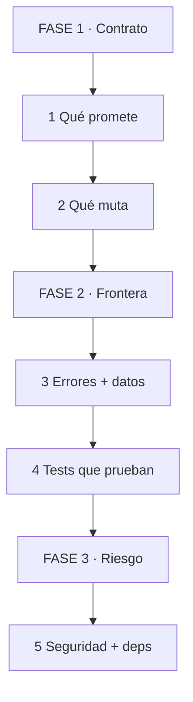
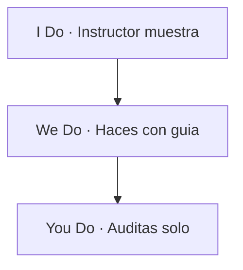
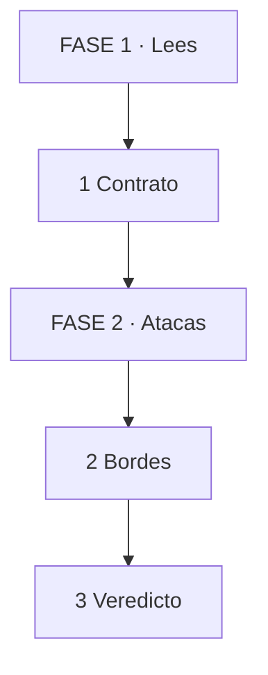

# MASTERCLASS: Python para Revisores — Validar Código de IA sin Mirar Sintaxis

## INTRODUCCIÓN: YA NO ERES ESCRITOR, ERES AUDITOR

La IA escribe Python aceptable en 10 segundos. El problema ya no es producir código. Es saber si lo producido es correcto, seguro y mantenible.

El 80% de los bugs en código generado por IA no son de sintaxis. Son de supuestos invisibles: una lista mutada por accidente, un `None` no manejado, un `except` que traga todo, un `float` para dinero, un `pickle` inseguro, un test que no prueba nada.

Este masterclass propone otro rol: **revisor blindado**. No memorizas sintaxis. Desarrollas 6 reflejos de validación que atrapan lo que la IA inventa con confianza.

> **Objetivo de Aprendizaje** — Al final podrás auditar cualquier script Python con 6 preguntas: ¿qué contrato promete? ¿qué estado muta? ¿qué errores traga? ¿qué datos rompen? ¿qué test lo prueba? ¿qué riesgo de seguridad abre?

> **Regla operativa** — Nunca aceptes código que no puedas explicar en 1 línea. Si la IA no puede justificar el `except`, el `default` o la dependencia, se rechaza.

---

## MAPA DEL WORKFLOW



*Cómo leerlo: Empiezas en FASE 1 arriba, bajas hasta FASE 3. No es un ciclo.*

| Fase | Qué logras | Habilidad |
|------|------------|-----------|
| **FASE 1 · Contrato** | Leer intención sin leer sintaxis | Detectar promesas rotas |
| **FASE 2 · Frontera** | Probar bordes y errores | Romper código con datos |
| **FASE 3 · Riesgo** | Frenar daño en prod | Auditar seguridad y costos |



*Cómo leerlo: I muestra 1 auditoría, W la haces acompañado, Y la haces solo con checklist.*

---

## PARTE 1: EL NUEVO ROL — PREGUNTAR, NO ESCRIBIR

Analogía en 1 línea: eres como un escribano que revisa escrituras — no redactas, verificas identidad, firmas y sellos.

| Paso | Tú ves | Qué pasa dentro | Ejemplo |
|------|--------|-----------------|---------|
| 1 Lees | Firma + docstring | Contrato declarado | `def cobrar(total: Decimal) -> Ticket` |
| 2 Preguntas | 6 preguntas | Buscas supuestos | ¿Qué pasa si `total` es None? |
| 3 Veredicto | Aprueba / rechaza | Con evidencia | Test + riesgo citado |



*Cómo leerlo: Lees contrato arriba, atacas bordes en medio, das veredicto abajo.*

Las 6 preguntas del revisor (memoriza estas, no sintaxis):

1. **Contrato:** ¿qué recibe y qué devuelve? ¿Tipos reales o `Any` disfrazado?
2. **Estado:** ¿qué muta? ¿La lista de entrada sale modificada?
3. **Error:** ¿qué excepciones traga en silencio? ¿Hay `except:` pelado?
4. **Dato:** ¿qué rompe con `None`, `""`, `0`, zona horaria, archivo gigante?
5. **Test:** ¿qué test prueba el borde, no solo el camino feliz?
6. **Riesgo:** ¿abre shell, red, pickle, secret hardcodeado, dependencia nueva?

> **📌 Idea clave** — Revisar es preguntar con sistema. Sin checklist, apruebas por cansancio.

**Pregunta recall:** ¿por qué un `except:` sin tipo es motivo de rechazo automático?

---

## PARTE 2: CONTRATOS — QUÉ PROMETE EL CÓDIGO

Analogía en 1 línea: el contrato es como el cartel del puente — dice peso máximo. Si el camión pesa más, no cruza, no se discute.

La IA ama poner `def procesar(data):` sin tipos. Tu trabajo: exigir el cartel.

Lo que pides a la IA (prompt de revisión):

```text
Agrega a cada función pública:
1. Tipos de entrada y salida reales (no Any)
2. Qué puede ser None y qué nunca
3. Qué excepción lanza y cuándo
4. 1 ejemplo de uso en docstring
```

Ejemplo de antes/después (no lo escribes tú, lo exiges):

```python
# ANTES (IA vaga): ¿qué es data? ¿qué devuelve si falla?
def procesar(data):
    return [x["total"] for x in data]

# DESPUÉS (contrato auditable):
from decimal import Decimal

def totales(items: list[dict]) -> list[Decimal]:
    """Devuelve totales. Lanza KeyError si falta 'total'. Nunca devuelve None."""
    return [Decimal(str(x["total"])) for x in items]
```

Tabla de validación de contratos:

| Señal | Qué significa | Veredicto |
|-------|---------------|-----------|
| `Any`, `dict` sin forma | Contrato vago | Pedir `TypedDict` o `dataclass` |
| `Optional` sin manejo | `None` explotará | Exigir `if x is None` o prohibir |
| Sin docstring en pública | Intención oculta | Rechazar hasta documentar |

```python
from dataclasses import dataclass
from typing import TypedDict

class ItemIn(TypedDict):
    total: str  # forma explícita, no dict ciego

@dataclass(frozen=True)
class Ticket:
    total: Decimal  # frozen = inmutable, revisor aprueba
```

Consejo: `frozen=True` y `TypedDict` son tus aliados. Todo lo que la IA declare inmutable es una clase de bugs menos. Lo mutable exige test extra.

> **📌 Idea clave** — Sin tipos reales no hay revisión posible. `Any` es decir "confía en mí" — no confíes.

**Pregunta recall:** ¿qué pides cuando ves `def f(data):` sin tipos?

---

## PARTE 3: MUTABILIDAD — EL BUG QUE LA IA MÁS REPITE

Analogía en 1 línea: un objeto mutable es como un mate compartido — todos toman del mismo, nadie sabe quién lo contaminó.

El top 3 de horrores que la IA genera:

```python
# 1. Default mutable: la lista sobrevive entre llamadas
def agregar(item, bolsa=[]):  # MAL: bolsa se comparte
    bolsa.append(item)
    return bolsa

# Lo que exiges:
def agregar(item, bolsa=None):
    bolsa = [] if bolsa is None else bolsa
    return [*bolsa, item]  # nueva lista, no muta entrada
```

```python
# 2. Aliasing: modificas la entrada sin avisar
def aplicar_descuento(items):
    for i in items:
        i["total"] = i["total"] * 0.9  # MAL: muta diccionarios del llamador
    return items

# Lo que exiges: copiar o declarar mutación en el nombre
def con_descuento(items: list[ItemIn]) -> list[ItemIn]:
    return [{**i, "total": str(Decimal(i["total"]) * Decimal("0.9"))} for i in items]
```

```python
# 3. Shallow vs deep: copio la caja pero no el contenido
import copy
nueva = vieja.copy()  # copia lista, pero dicts internos siguen compartidos
nueva = copy.deepcopy(vieja)  # copia todo, más lento pero seguro
```

| Paso | Tú ves | Qué pasa dentro | Ejemplo |
|------|--------|-----------------|---------|
| 1 Detectas | `=[]`, `.append`, `[x]=` | Mutación posible | Nombre sin `con_`/`nuevo` |
| 2 Preguntas | ¿Muta entrada? | Test de alias | `assert entrada == antes` |
| 3 Exiges | Copia o renombre | Intención explícita | `con_descuento` no `aplicar` |

Regla de nombres que impones a la IA: si muta, el nombre lo grita (`ordenar_en_sitio`). Si devuelve nuevo, usa `con_` / `nuevo_` (`con_descuento`). Nombre ambiguo = rechazo.

> **📌 Idea clave** — Todo lo que entra no debe salir modificado salvo que el nombre lo prometa. Test de alias siempre.

**Pregunta recall:** ¿por qué `def f(x=[])` es el primer `grep` de toda auditoría?

---

## PARTE 4: ERRORES Y DATOS — LA FRONTERA DONDE MUERE EL CÓDIGO FELIZ

### 4.1 Errores: EAFP vs tragar todo

Analogía: manejar errores es como el matafuego — debe estar visible, etiquetado y solo para el fuego que dice. Un `except:` pelado es un matafuego que apaga todo incluido el timbre de alarma.

```python
# MAL: traga KeyboardInterrupt, MemoryError, bugs tuyos. Nunca sabes qué falló.
try:
    cobrar(cliente)
except:
    pass

# BIEN: captura lo esperado, loguea contexto, deja explotar lo demás
try:
    cobrar(cliente)
except KeyError as e:
    logger.warning("cliente sin total", extra={"cliente": cliente_id, "falta": str(e)})
    raise TicketInvalido(f"falta {e}") from e
```

Lo que validas:

| Señal | Veredicto |
|-------|-----------|
| `except:` o `except Exception: pass` | Rechazo automático |
| Sin `from e` al re-lanzar | Pedir cadena de causa |
| Sin log con contexto | Pedir `extra={ids}` |

> **📌 Idea clave** — Excepción específica + log con IDs + `raise ... from e`. Lo demás es esconder mugre.

### 4.2 Datos: los 7 bordes que rompen todo

No necesitas saber sintaxis de `datetime`. Necesitas esta lista de ataque y lanzársela a la IA:

1. `None` donde esperabas valor
2. `""` y `"   "` donde esperabas texto
3. `0` y negativos donde esperabas positivo
4. `float` para dinero (`0.1 + 0.2 = 0.30000000004`)
5. Fecha sin zona horaria (naive vs aware)
6. Archivo vacío, gigante o con encoding raro
7. JSON con campo faltante o tipo cambiado

```python
from decimal import Decimal
from datetime import datetime, timezone

# Dinero: exiges Decimal, nunca float
total = Decimal("10.10")  # exacto
# total = 10.10  # MAL: binario impreciso

# Fechas: exiges aware UTC
ahora = datetime.now(timezone.utc)  # auditable
# ahora = datetime.now()  # MAL: naive, rompe al comparar con aware
```

Prompt que usas con la IA:

```text
Para esta función genera 7 tests de borde:
None, string vacío, cero, negativo, decimal con centavos,
fecha naive vs aware, JSON sin el campo clave.
Si alguno falla, corrige el código, no el test.
```

> **📌 Idea clave** — El código feliz lo escribe cualquiera. El código correcto sobrevive a tus 7 bordes.

**Pregunta recall:** ¿por qué `float` para dinero es rechazo aunque los tests pasen?

---

## PARTE 5: TESTS — LO ÚNICO QUE PRUEBA QUE LA IA NO MINTIÓ

Analogía en 1 línea: el test es como el control de alcoholemia — no importa lo sobrio que dice estar, importa lo que marca el aparato.

No lees tests para admirarlos. Los lees para ver qué **no** prueban.

Checklist de test que exiges (3 niveles):

| Nivel | Qué pides | Ejemplo |
|-------|------------|---------|
| Camino feliz | 1 caso típico | `cobrar([100, 200]) == 300` |
| Borde | 3 casos límite | `None`, `[]`, `0` |
| Propiedad | 1 invariante | `con_descuento` no muta entrada |

```python
def test_no_muta_entrada():
    original = [{"total": "100"}]
    copia = [dict(x) for x in original]
    con_descuento(original)
    assert original == copia  # si falla, hay aliasing

def test_rechaza_sin_total():
    import pytest
    with pytest.raises(KeyError):
        totales([{"otro": "1"}])
```

Señales de test inútil generado por IA:

- Sin `assert` real (solo llama y no verifica).
- Con `mock` de todo (prueba el mock, no tu código).
- Nombres como `test_1`, `test_ok` (no dicen qué invariante cuidan).
- Tardan > 1s cada uno (nadie los correrá).

Prompt de exigencia:

```text
Reescribe los tests con nombres que digan el invariante:
test_<qué_garantiza>_cuando_<condición>.
Agrega 1 test de no-mutación y 1 de excepción esperada.
Elimina mocks innecesarios.
```

> **📌 Idea clave** — Test sin borde es decoración. Exige feliz + borde + no-mutación.

**Pregunta recall:** ¿qué 3 tests mínimos pides antes de aprobar un PR de IA?

---

## PARTE 6: SEGURIDAD Y DEPENDENCIAS — DONDE EL BUG CUESTA PLATA

### 6.1 Seguridad: 5 prohibidos

| Prohibido | Por qué | Qué exiges |
|-----------|---------|------------|
| `eval`, `exec` | Ejecuta código arbitrario | `ast.literal_eval` o parser |
| `pickle.loads` de red | Ejecución remota | `json` |
| `shell=True`, `os.system` | Inyección shell | Lista de args sin shell |
| `f"SELECT ... {var}"` | Inyección SQL | Queries parametrizadas |
| Secret en código | Se filtra en git | Variables de entorno |

```python
# MAL: IA lo genera con confianza y es un agujero
import subprocess
subprocess.run(f"convert {nombre} out.pdf", shell=True)  # inyección si nombre = "; rm -rf /"

# BIEN: sin shell, args separados
subprocess.run(["convert", nombre, "out.pdf"], shell=False)
```

```python
# MAL: SQL con f-string
query = f"SELECT * FROM users WHERE id = {user_id}"

# BIEN: parámetro, nunca interpolación
cursor.execute("SELECT * FROM users WHERE id = %s", (user_id,))
```

Tu `grep` de auditoría (pégalo siempre):

```text
eval\( | exec\( | pickle\.loads | shell=True | os\.system | password\s*=\s*["'] | api_key\s*=\s*["']
```

Si aparece, rechazo hasta justificación escrita.

> **📌 Idea clave** — Seguridad no se prueba, se prohíbe. Lista de 5 prohibidos en cada revisión.

### 6.2 Dependencias y reproducibilidad

La IA ama agregar `pip install lib-milagrosa`. Cada dependencia es un proveedor con llaves de tu casa.

Lo que validas:

- ¿Para qué está? ¿Lo resuelves con stdlib (`pathlib`, `dataclasses`, `zoneinfo`)?
- ¿Está pineada? (`requirements.lock` con versión exacta, no `>=` abierto).
- ¿Sigue mantenida? (último commit < 1 año, sin CVEs críticos).

```text
# requirements.txt vago (rechazo):
requests>=2.0
pandas

# requirements.lock auditable (aprueba):
requests==2.31.0
pandas==2.2.2
```

> **📌 Idea clave** — Menos dependencias, menos superficie de ataque. Cada una pineada y justificada.

**Pregunta recall:** ¿qué haces cuando la IA propone una librería nueva para algo que hace `pathlib`?

---

## PARTE 7: I DO / WE DO / YOU DO — AUDITAR DE VERDAD

### 7.1 I Do — Auditar función con default mutable

**Código IA:**

```python
def registrar(evento, historial=[]):
    historial.append(evento)
    return historial
```

| Paso | Acción | Hallazgo |
|------|--------|----------|
| 1 | Contrato | `historial` sin tipo, default mutable |
| 2 | Ataque | Llamar 2 veces sin `historial` contamina |
| 3 | Veredicto | Rechazo + fix con `None` + test alias |

```python
def test_no_contamina():
    assert registrar("a") == ["a"]
    assert registrar("b") == ["b"]  # falla con default mutable
```

### 7.2 We Do — Auditar lectura de JSON + dinero

**Código IA:**

```python
def total_factura(path):
    import json
    data = json.load(open(path))
    return sum(x["total"] for x in data["items"])
```

Preguntas guía (respóndelas con la IA):

| Pregunta | Respuesta esperada |
|----------|--------------------|
| ¿Y si falta `items`? | `KeyError` no manejado |
| ¿Y si `total` es float? | Error centavos, exigir `Decimal(str(...))` |
| ¿Y si archivo no existe? | `FileNotFoundError` sin contexto |
| ¿Test de borde? | Ninguno, pedir 7 bordes |

### 7.3 You Do — Audita este snippet solo

```python
def enviar_reporte(nombre, query):
    import subprocess
    subprocess.run(f"generar {nombre} --sql '{query}'", shell=True)
```

Criterio de auto-corrección:

- [ ] Detectas `shell=True` + f-string (inyección doble)
- [ ] Propones args sin shell + query parametrizada aparte
- [ ] Pides test que intente `nombre = "; rm -rf /"`
- [ ] Veredicto: rechazo de seguridad, no solo estilo

### 7.4 Cierre práctico

| Nivel | Debes poder hacer |
|-------|-------------------|
| **I Do** | Detectar default mutable + proponer fix + test alias |
| **We Do** | Romper JSON/dinero/fechas con 7 bordes |
| **You Do** | Rechazar `shell=True` + dependencia injustificada con evidencia |

---

## CHECKLIST FINAL DEL REVISOR

| Bloque | Check |
|--------|-------|
| Contrato | Tipos reales, nada de `Any`, `None` declarado |
| Estado | Sin default mutable, sin mutación oculta, test alias pasa |
| Errores | Sin `except:` pelado, con `from e` y log con IDs |
| Datos | `Decimal` para dinero, fechas aware UTC, 7 bordes probados |
| Tests | Feliz + borde + no-mutación, nombres con invariante |
| Seguridad | Sin eval/pickle/shell/SQL-fstring/secrets, deps pineadas |

---

## Preguntas de Verificación 📝

1. **Aplica**: IA te entrega `def f(data, cache={})`. ¿Qué bug contiene y qué test lo demuestra en 2 llamadas?
2. **Analiza**: ¿Por qué `except Exception: pass` es peor que no manejar nada? ¿Qué log exigirías?
3. **Diseña**: Convierte `def procesar(data)` en contrato auditable con `TypedDict` + retorno `Decimal` + docstring de excepción.
4. **Reflexiona**: ¿Cuándo aceptas mutación de entrada? ¿Qué convención de nombres impones?
5. **Calcula**: `sum([0.1, 0.2])` da `0.30000000000000004`. ¿Qué tipo exiges para facturación y por qué?
6. **Evalúa**: Un test solo llama a la función sin `assert`. ¿Apruebas? ¿Qué 3 tests pides?
7. **Conecta**: `pickle.loads(request.body)` funciona y pasa tests. ¿Por qué lo rechazas igual?
8. **Propón**: IA propone `lib-fecha-milagrosa` para restar días. ¿Qué preguntas haces antes de aceptar la dependencia?
9. **Síntesis**: `subprocess.run(f"cmd {user}", shell=True)` pasa en local. Diseña el ataque con `user = "x; rm -rf /"` y el fix.
10. **Reflexión final**: Si solo pudieras hacer 3 preguntas a todo código IA, ¿cuáles eliges y por qué?

## GLOSARIO — CONCEPTOS PRINCIPALES

| Término | Definición en 1 línea |
|---------|-----------------------|
| **Contrato** | Promesa de tipos, Nones y excepciones de una función |
| **TypedDict** | Forma explícita de un dict, sin adivinar claves |
| **Frozen** | Inmutable por construcción, no se puede contaminar |
| **Aliasing** | Dos nombres apuntando al mismo objeto mutable |
| **Default mutable** | `=[]` compartido entre llamadas, bug clásico |
| **EAFP** | Pedir perdón: intenta y captura específico |
| **Tragar excepción** | `except: pass` que esconde el error real |
| **Borde** | Dato límite que rompe el camino feliz |
| **Decimal** | Número exacto para dinero, sin error binario |
| **Naive vs aware** | Fecha sin zona vs con UTC, no mezclar |
| **Test invariante** | Prueba que garantiza lo que nunca debe romperse |
| **Inyección** | Dato de usuario ejecutado como código o SQL |
| **Pineado** | Dependencia con versión exacta en lock |
| **Stdlib primero** | Resolver con estándar antes de agregar librería |
