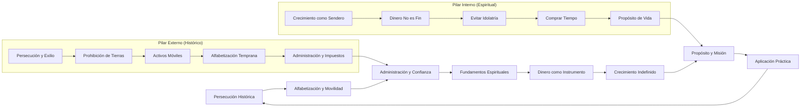
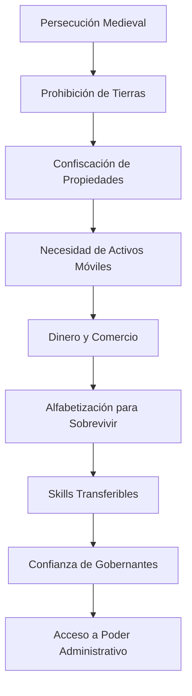
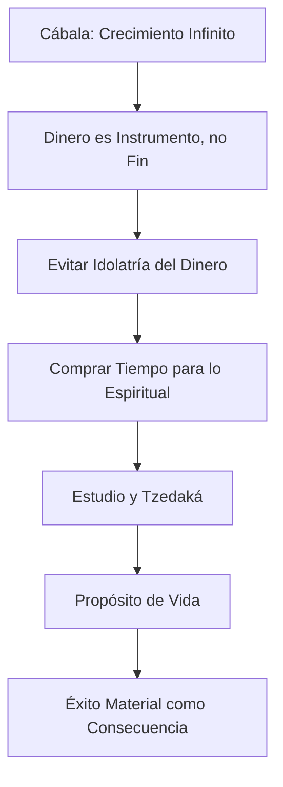
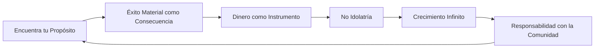
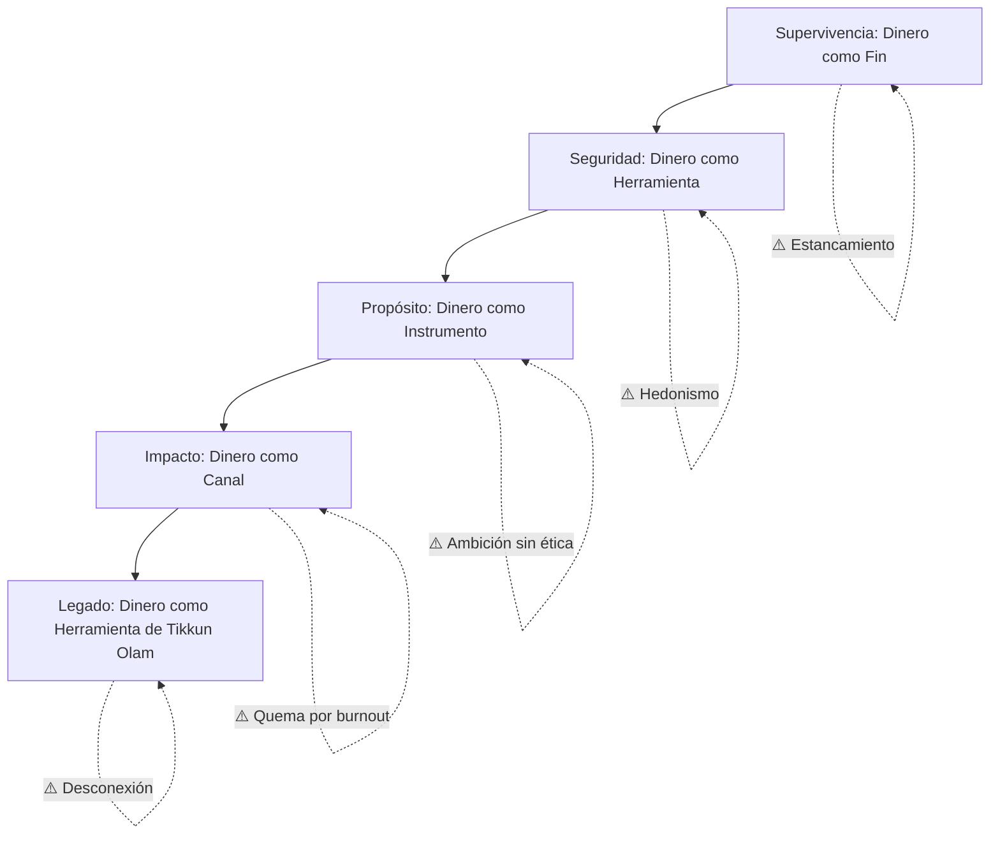
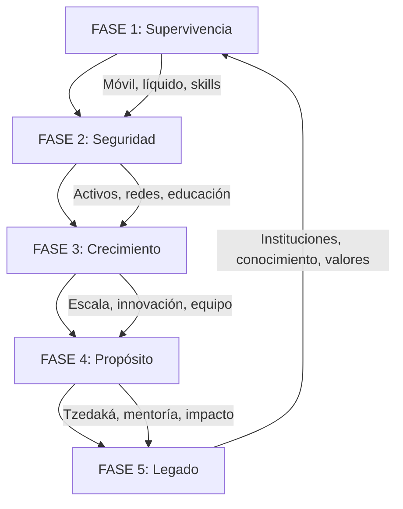
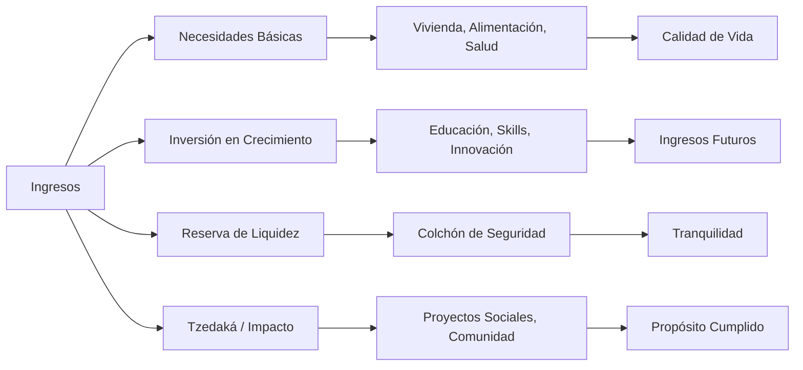
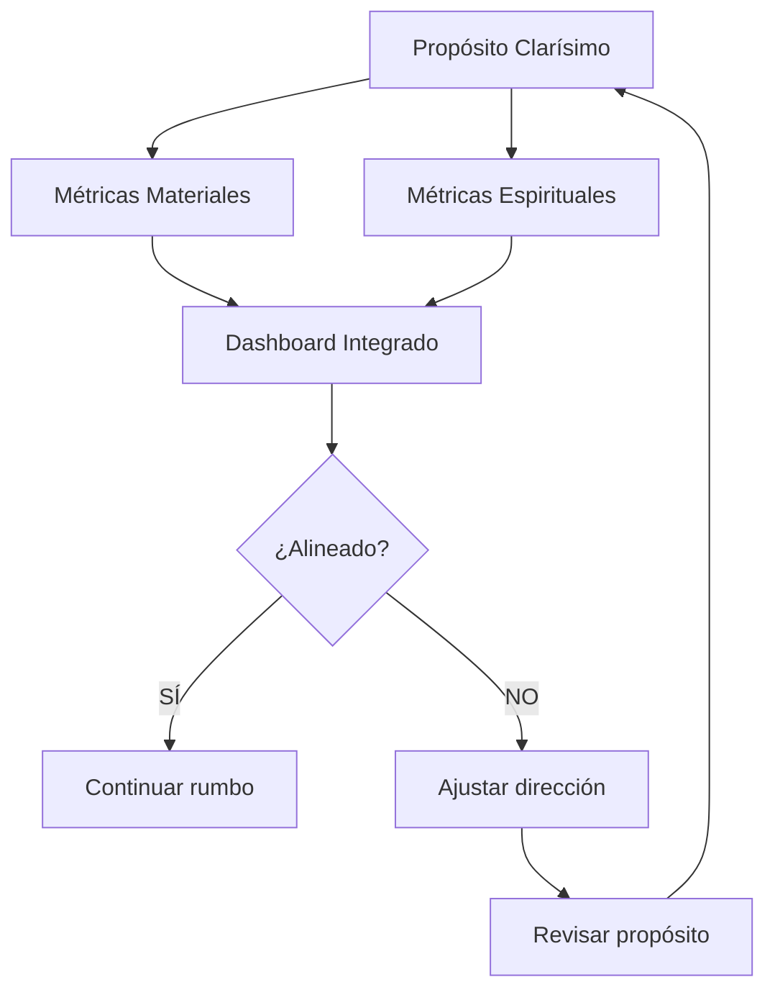

# MASTERCLASS: Raíces Históricas y Espirituales del Éxito Judío en los Negocios 🕎💰

## INTRODUCCIÓN: POR QUÉ ESTE MASTERCLASS TRANSFORMA TU VISIÓN DEL DINERO 🤔

La relación entre el pueblo judío y el mundo de los negocios y finanzas ha sido objeto de fascinación, estereotipos y admiración durante siglos. Sin embargo, detrás de esta asociación no hay un "don innato" ni una conspiración. Hay factores históricos concretos 🌍 y una cosmovisión espiritual profunda 🧠 que explican por qué tantas comunidades judías han desarrollado una relación particular con el dinero, el comercio y el éxito material.

En este video, el historiador Mario Sabán explora ambos factores: el **externo** (persecución, movilidad, alfabetización) y el **interno** (crecimiento espiritual, el dinero como instrumento, el propósito como motor). Este masterclass te permitirá entender no solo el pasado, sino también aplicar estas lecciones a tu propia vida financiera y empresarial.

> **🎯 Objetivo de Aprendizaje** — Al final de esta guía, comprenderás los dos pilares del éxito judío en los negocios (histórico y espiritual), y podrás aplicar sus principios éticos y estratégicos a tu propio camino financiero.

> **⚠️ Advertencia educativa** — Este contenido es formativo e histórico. No constituye consejo financiero ni promueve generalizaciones culturales. La aplicación individual depende de tus valores, contexto y decisiones personales.

---

## MAPA DEL FLUJO DE SABIDURÍA 🗺️



| Fase | Pregunta que responde | Output principal |
|------|-----------------------|------------------|
| **Persecución Histórica** | ¿Qué obligó a las comunidades a adaptarse? | Movilidad y activos transferibles |
| **Alfabetización y Movilidad** | ¿Qué skills priorizaron? | Educación, escritura y aritmética |
| **Administración y Confianza** | ¿Cómo ganaron acceso a poder? | Gestión de recursos para gobernantes |
| **Crecimiento como Sendero** | ¿Qué enseña la Cábala sobre el progreso? | Mentalidad de crecimiento infinito |
| **Dinero como Instrumento** | ¿Cuál es la filosofía financiera judía? | El dinero como medio, no fin |
| **Propósito y Misión** | ¿Cómo se relaciona éxito material con espiritualidad? | El dinero al servicio de una causa mayor |

```mermaid
flowchart LR
    subgraph I_Do["👨‍🏫 I Do (Instructor)"]
        direction TB
        A1[Explicar: contexto medieval europeo] --> A2[Mostrar: conexión alfabetización-comercio] --> A3[Analizar: texto cabalístico sobre crecimiento] --> A4[Ilustrar: anécdota de los hermanos Reichman]
    end
    
    subgraph We_Do["🤝 We Do (Colaborativo)"]
        direction TB
        B1[Debatir: persecución como ventaja competitiva] --> B2[Reflexionar: ¿el dinero es fin o medio?] --> B3[Discutir: propósito vs. ganancia] --> B4[Identificar: ejemplos en la historia]
    end
    
    subgraph You_Do["💪 You Do (Independiente)"]
        direction TB
        C1[Investigar: tu propia relación con el dinero] --> C2[Diseñar: tu "propósito financiero"] --> C3[Crear: plan de crecimiento espiritual y material] --> C4[Aplicar: lecciones en tu negocio/carrera]
    end
    
    classDef I_DoStyle fill:#E3F2FD,stroke:#1565C0,stroke-width:2px,color:#0D47A1;
    classDef We_DoStyle fill:#FFF8E1,stroke:#EF6C00,stroke-width:2px,color:#BF360C;
    classDef You_DoStyle fill:#E8F5E9,stroke:#2E7D32,stroke-width:2px,color:#1B5E20;
    
    class I_Do I_DoStyle;
    class We_Do We_DoStyle;
    class You_Do You_DoStyle;
```

---

## PARTE 1: RAÍCES HISTÓRICAS (EL FACTOR EXTERNO) 📜

### 1.1 Principio Central

La historia no es un telón de fondo: es la primera causa. Las comunidades judías en la diáspora desarrollaron patrones de supervivencia que, paradójicamente, se convirtieron en ventajas competitivas económicas. No fue una elección cultural inicial: fue una respuesta forzada a la persecución, la expulsión y la prohibición de propiedad feudal. 🏰❌

> **💡 Idea clave** — La historia forzó a las comunidades judías a volverse "líquidas" en términos económicos. Sin tierra, sin raíces fijas, el conocimiento y la movilidad se convirtieron en el verdadero patrimonio.



### 1.2 Persecución y Movilidad: La Tierra Prohibida 🌍

Durante la Edad Media, especialmente en Europa cristiana, las comunidades judías enfrentaron sistemáticamente la persecución y la confiscación de propiedades. La Iglesia y las autoridades feudales prohibían a los judíos poseer tierras. Sin posesiones inmobiliarias, las familias judías aprendieron a priorizar **activos líquidos y móviles** sobre bienes raíces. 💼✈️

| Restricción Histórica | Consecuencia Económica | Adaptación Estratégica |
|------------------------|------------------------|------------------------|
| Prohibición de poseer tierras 🚫 | Sin patrimonio inmobiliario | Dinero, joyas, conocimientos |
| Expulsiones recurrentes (España 1492, Inglaterra 1290) | Necesidad de migrar rápido | Activos transportables |
| Ghettos y restricciones de residencia | Vida en espacios limitados | Comercio interregional |
| Impuestos especiales y discriminación | Falta de protección legal | Redes comunitarias de confianza |

**Del 1:25 al 3:00 del video**, Mario Sabán explica este punto con detalle. La persecución no era solo violencia: era un sistema económico que excluía a los judíos de la propiedad feudal. La respuesta no fue la sumisión, sino la adaptación: aprender a ser móviles, líquidos y educados.

### 1.3 Alfabetización y Administración: El Poder del Conocimiento 📚🧮

Esta necesidad de movilidad empujó a las comunidades judías a priorizar la educación y la alfabetización desde edades tempranas. El resultado fue una **ventaja comparativa en escritura y aritmética** que pronto fue reconocida por reyes y señores feudales. 👑📜

| Skill Desarrollada | Aplicación Histórica | Valor para los Gobernantes |
|---------------------|----------------------|----------------------------|
| Lectura y escritura hebrea 📖 | Contratos, testamentos, correspondencia | Gestión documental confiable |
| Aritmética y contabilidad 🔢 | Cobro de impuestos, auditoría | Control fiscal eficiente |
| Lenguas múltiples (hebreo, latín, vernáculo) 🗣️ | Mediación comercial internacional | Puente entre culturas |
| Redes comunitarias transnacionales 🌐 | Información comercial, préstamos | Inteligencia económica |

> **📌 Idea clave** — La educación no era un lujo cultural: era una herramienta de supervivencia económica. Y esa herramienta se convirtió, con el tiempo, en una ventaja competitiva irreversible.

**Del 3:30 al 4:17 del video**, Sabán detalla cómo los judíos fueron contratados como administradores y recaudadores de impuestos precisamente porque dominaban estas habilidades, mientras que la población cristiana analfabeta no podía ofrecer servicios equivalentes.

---

## PARTE 2: FUNDAMENTOS ESPIRITUALES (EL FACTOR INTERNO) 🕯️

### 2.1 Principio Central

Los factores externos explican el *cómo*, pero no el *porqué* espiritual. El historiador Mario Sabán introduce aquí el factor interno: la cosmovisión judía, especialmente la Cábala, que entiende el crecimiento material como un **camino espiritual**, no como un fin en sí mismo. 🔄✨

> **🧠 Idea clave** — En la tradición judía, crecer no es acumular por acumular. Crecer es tener más recursos para cumplir un propósito mayor: el estudio, la tzedaká (justicia/charity) y la conexión con lo divino.



### 2.2 Crecimiento como Sendero: La Filosofía Cabalística 📈

La Cábala enseña que el crecimiento es un principio divino. Dios es infinito, y la creación está llamada a expandirse. En términos prácticos, esto significa que **la estancación es una anomalía espiritual**. El deseo de crecer, cuando está orientado correctamente, refleja la imagen divina del creador. 🌱

| Concepto Cabalístico | Traducción Práctica | Aplicación Empresarial |
|----------------------|---------------------|------------------------|
| Tzimtzum (contracción divina) 🙌 | Espacio para que exista lo nuevo | Innovación requiere dejar espacio |
| Sefirot (canales de energía) ⚡ | Flujo de valor entre personas | Negocios como canales, no fines |
| Tikkun Olam (reparación del mundo) 🌍 | Propósito material del éxito | Dinero para reparar, no solo acumular |

**Del 4:37 al 5:00 del video**, Mario Sabán introduce esta idea central: la cultura judía enfatiza el crecimiento indefinido, pero entendido como camino, no como destino.

### 2.3 El Dinero como Instrumento: Evitar la Idolatría 💰🚫

El punto más delicado y transformador de la filosofía financiera judía es la condena de la **idolatría del dinero**. Cuando el dinero se convierte en un fin en sí mismo, se transforma en un ídolo: algo que se adora, que da sentido, que define el valor de una persona. 🛑

| Enfoque Incorrecto ❌ | Enfoque Correcto ✅ |
|----------------------|---------------------|
| Dinero = estatus personal | Dinero = herramienta de impacto |
| Acumular por acumular | Crecer para dar y estudiar |
| El éxito = patrimonio neto | El éxito = alineación con propósito |
| Trabajar hasta el colapso | Trabajar para comprar tiempo espiritual |
| El dinero es fin último | El dinero es medio para tikkun olam |

> **⚠️ Advertencia ética** — "No tendrás otros dioses delante de mí" (Éxodo 20:3) se interpreta en la tradición judía como una advertencia contra cualquier cosa que ocupe el lugar central en tu vida, incluyendo el dinero.

**Del 8:04 al 11:44 del video**, Mario Sabán desarrolla extensamente esta idea. El dinero debe servir para:
1. **Comprar tiempo** para el estudio espiritual 📖
2. **Apoyar a la comunidad** (tzedaká) 🤝
3. **Proteger a la familia** y garantizar continuidad generacional 👨‍👩‍👧‍👦
4. **Crear espacios** para el crecimiento ajeno 🌱

### 2.4 El Caso de los Hermanos Reichman y el Rebe de Lubavitch 👨‍💼👨‍💼

La teoría se hace carne en la historia real de los hermanos Reichman, multimillonarios del sector inmobiliario canadiense, y su relación con el Rebe de Lubavitch, el líder espiritual de la dinastía jasídica. 🏘️✨

**Del 5:38 al 7:46 del video**, Sabán relata esta anécdota poderosa:

- Los hermanos Reichman alcanzaron un éxito inmenso y consideraron retirarse para disfrutar su fortuna. 🏖️
- Consultaron al Rebe de Lubavitch sobre si era correcto retirarse.
- El Rebe les respondió que **no debían retirarse**.
- Su razonamiento: para poder **recibir** (éxito material, bendiciones, oportunidades), uno debe estar abierto a seguir dando. Retirarse cierra el canal de recepción y, por lo tanto, el de generosidad. 💎
- La enseñanza: **el crecimiento material es un ciclo**, no un destino final. Mientras estés vivo y capacitado, tienes el deber de seguir operando en el mundo para seguir generando valor.

| Lección del Rebe | Aplicación Moderna |
|------------------|-------------------|
| No retirarse mientras puedas recibir 🔄 | Seguir creando incluso en éxito |
| El retiro cierra el canal de dar ❌ | La jubilación debe ser transición, no fin |
| La prosperidad es un medio, no meta 🎯 | Reinvertir en propósito, no solo en lifestyle |
| La responsabilidad aumenta con el éxito 📈 | Más dinero = más obligación ética |

---

## PARTE 3: LECCIONES CLAVE PARA EL ÉXITO EMPRESARIAL 🎓

### 3.1 Principio Central

Sabían historia, Sabían espiritualidad... pero, ¿qué significa todo esto para tu negocio, tu carrera y tu relación con el dinero hoy? Esta sección sintetiza las lecciones prácticas que puedes aplicar inmediatamente. 🔧



### 3.2 Encuentra tu Propósito: El Motor del Éxito Sostenible 🎯

La lección más contundente del video (del 12:20 al 14:55) es que el **éxito financiero es una consecuencia**, no una causa. Cuando una persona descubre el sentido y propósito de su vida, el aspecto material sigue naturalmente. ✨

| Enfoque | Resultado Típico |
|---------|-----------------|
| Buscar dinero primero 💸 | Estrés, vacío, riesgo de idolatría |
| Buscar propósito primero 🧭 | Motivación sostenible, creatividad, lealtad |
| Alinear trabajo interno y externo 🔗 | Flujo, resiliencia, satisfacción |
| Ignorar propósito ⏭️ | Burnout, éxito hueco, preguntas sin respuesta |

> **📌 Idea clave** — El dinero sigue al propósito como la sombra sigue al cuerpo. No puedes perseguir la sombra directamente y esperar que te siga de manera consistente. Debes iluminar el cuerpo (tu misión) y el dinero vendrá como consecuencia natural.

### 3.3 Tabla de Aplicación Práctica

| Lección Histórica 📜 | Lección Espiritual 🕯️ | Aplicación Moderna 💼 |
|----------------------|------------------------|----------------------|
| Alfabetización = supervivencia | Crecimiento como camino | Inversión continua en educación |
| Movilidad > propiedad fija | Dinero como instrumento | Liquidez antes que estatus |
| Confianza por skills | Responsabilidad ética | Excelencia en tu trabajo |
| Redes comunitarias | Tzedaká / dar | Networking con propósito |
| Adaptación forzada | Tikkun Olam | Negocios con impacto |

---

## PARTE 4: DIAGNÓSTICO DE TU RELACIÓN CON EL DINERO 🔍

### 4.1 Autoevaluación: ¿Dónde estás hoy?

Antes de aplicar estas lecciones, es fundamental entender tu posición actual. Este diagnóstico te permitirá mapear tu relación con el dinero, el propósito y el crecimiento. 📊

| Dimensión | Pregunta de Reflexión | Señal de Alerta ⚠️ |
|-----------|----------------------|-------------------|
| **Propósito** 🎯 | ¿Puedo explicar por qué hago lo que hago en una frase? | "No lo sé" o respuesta materialista pura |
| **Actitud hacia el dinero** 💰 | ¿El dinero es medio o fin en mi vida? | Ansiedad cuando no hay ganancia |
| **Crecimiento** 📈 | ¿Veo el éxito como destino o camino? | Deseo de "retirarse joven" sin plan espiritual |
| **Responsabilidad** 🤝 | ¿Qué porcentaje doy/impacto genero? | Cero % o solo para deducciones fiscales |
| **Educación financiera** 📚 | ¿Invierto regularmente en aprender? | No he leído un libro de finanzas en años |
| **Toma de riesgos** ⚡ | ¿Cómo manejo la incertidumbre? | Evitación total o especulación ciega |

### 4.2 Mapa de Desarrollo Personal



### 4.3 Tabla de Creencias Limitantes vs. Creencias Potenciadoras

| Creencia Limitante ❌ | Creencia Potenciadora ✅ | Resultado Esperado |
|----------------------|------------------------|-------------------|
| "El dinero es la raíz de todos los males" 💀 | "El dinero es un reflejo del valor que creo" | Relación sana con la riqueza |
| "No puedo ser rico y espiritual a la vez" ⛪ | "Puedo usar mi riqueza para crecer espiritualmente" | Alineación entre valores y acciones |
| "Los negocios son una competencia de suma cero" ⚔️ | "El mercado premia la creación de valor genuino" | Mentalidad de abundancia |
| "Debo sufrir para merecer el éxito" 😭 | "El éxito es consecuencia del propósito alineado" | Motivación intrínseca |
| "Retirarse es la meta final" 🏖️ | "Seguir creando mientras tenga capacidad" | Ciclo continuo de contribución |

---

## PARTE 5: ARQUITECTURA DE UN NEGOCIO CON PROPÓSITO 🏗️

### 5.1 De la Supervivencia al Impacto

La historia judía en los negocios no es una receta para hacerse rico rápido. Es una **arquitectura de sostenibilidad** que prioriza el largo plazo sobre el corto plazo, la comunidad sobre el individuo aislado, y el propósito sobre la ganancia a cualquier costo. 🏛️



### 5.2 Las 5 Capas del Éxito Sostenible

| Capa 🏗️ | Enfoque | Herramientas Clave | Métrica de Éxito |
|----------|---------|-------------------|-----------------|
| **1. Supervivencia** 🛡️ | Liquidez, movilidad, skills básicas | Educación continua, networking | Ingreso estable |
| **2. Seguridad** 🔒 | Diversificación, activos reales | Inversiones, propiedad (cuando es posible) | Patrimonio neto |
| **3. Crecimiento** 📈 | Escala, innovación, mercados nuevos | Estrategia, tecnología, equipo | CAGR sostenible |
| **4. Propósito** 🎯 | Misión clara, valores operativos | Propuesta de valor con impacto | Satisfacción + ROI |
| **5. Legado** 🌳 | Sistemas que perduran sin ti | Instituciones, mentoría, fundaciones | Impacto a largo plazo |

### 5.3 Modelo de Negocio con Propósito: Plantilla Práctica

```text
Negocio: [Nombre]
Propósito Central: [Una frase que define el impacto]
Misión Financiera: [Cómo el dinero sirve al propósito]

Estructura:
├── 1. Flujo de Caja (Supervivencia)
│   ├── Ingresos recurrentes
│   └── Reserva de liquidez (3-6 meses)
├── 2. Activos (Seguridad)
│   ├── Diversificación
│   └── Protección contra riesgo
├── 3. Crecimiento (Escala)
│   ├── Innovación constante
│   └── Expansión controlada
├── 4. Propósito (Impacto)
│   ├── Medición de impacto social/ambiental
│   └── Alineación de equipo con valores
└── 5. Legado (Sostenibilidad)
    ├── Sistemas que funcionan sin el fundador
    └── Transmisión de valores
```

### 5.4 Checklist de Ética Empresarial (Inspirado en la Tzedaká)

| Pregunta Ética 🤔 | Criterio de Evaluación |
|-------------------|------------------------|
| ¿Mi negocio crea valor genuino o extrae valor? ⚖️ | Valor real para cliente = Sí/No |
| ¿Cómo trato a proveedores, empleados y clientes? 🤝 | Relaciones justas y transparentes |
| ¿Qué porcentaje de ganancias reinvierto en impacto? 📊 | Meta: 10% mínimo en proyectos sociales |
| ¿Mis precios son justos o explotan necesidad? 💲 | Precio justo vs. precio máximo |
| ¿Mi éxito depende del fracaso de otros? ⚔️ | Suma positiva = Sí/No |
| ¿Qué legado deja mi modelo de negocio? 🌍 | Sostenibilidad a 50 años |

---

## PARTE 6: SISTEMA DE CRECIMIENTO FINANCIERO PERSONAL 📈

### 6.1 Flujo de Dinero con Propósito

Este sistema integra la sabiduría histórica y espiritual con herramientas financieras modernas. No se trata solo de "ahorrar más", sino de **alinear cada flujo monetario con tu propósito de vida**. 🔄



### 6.2 Las 3 Cuentas del Propósito

| Cuenta 🏦 | Porcentaje Recomendado | Destino |
|-----------|------------------------|---------|
| **Cuenta de Supervivencia** 🛡️ | 50% | Gastos fijos, reserva de emergencia |
| **Cuenta de Crecimiento** 📚 | 30% | Educación, inversiones, nuevos proyectos |
| **Cuenta de Impacto** 🌍 | 20% | Tzedaká, donaciones, proyectos sociales |

> **💡 Regla adaptable** — Los porcentajes pueden variar según tu fase de vida, pero la estructura tripartita (supervivencia, crecimiento, impacto) debe mantenerse siempre.

### 6.3 Métricas de Salud Financiera Espiritual

| Métrica 📊 | Pregunta de Evaluación | Meta |
|------------|------------------------|------|
| Ratio de liquidez 💧 | ¿Puedo cubrir 6 meses sin ingresos? | > 6 meses |
| Ratio de crecimiento 📈 | ¿Qué % reinvierto en mi desarrollo? | > 15% de ingresos |
| Ratio de impacto 🌱 | ¿Qué % destino a causas? | > 10% de ganancias |
| Diversificación 🌐 | ¿Cuántas fuentes de ingreso tengo? | > 3 fuentes |
| Independencia temporal ⏰ | ¿Cuánto trabajo para cubrir gastos mensuales? | < 40 horas/mes |
| Alineación propósito-propósito 🎯 | ¿Mi trabajo refleja mis valores? | Sí/No evaluación trimestral |

---

## PARTE 7: DE LA TEORÍA A LA PRÁCTICA — CASOS DE ESTUDIO 🏢

### 7.1 Los Rothschild: Redes, Confianza y Movilidad 🏦

La familia Rothschild ejemplifica la aplicación de los factores históricos y espirituales. Sin tierras, sin fortuna inicial, construyeron un imperio financiero basado en:

- **Redes familiares transnacionales** 🌍
- **Alfabetización y contabilidad avanzada** 📊
- **Confianza generacional** 🤝
- **Valores de comunidad y tzedaká** 💎

### 7.2 George Soros: Filosofía de Mercado y Propósito 🌍

Soros aplica la idea cabalística de "crecimiento" no solo a su fortuna, sino a la sociedad a través de sus fundaciones Open Society. El dinero como instrumento para el tikkun olam en escala global.

### 7.3 Empresas Modernas con Propósito: Patagonia, Salesforce, etc. 🌿

| Empresa | Propósito Central | Modelo de Impacto |
|---------|-------------------|-------------------|
| **Patagonia** 🏔️ | "No compres lo que no necesitas" | 1% para el planeta |
| **Salesforce** ☁️ | Tecnología con propósito | 1-1-1 modelo (1% equity, 1% producto, 1% tiempo) |
| **Warby Parker** 👓 | "Compre una, done una" | Modelo buy-one-give-one |
| **Grameen Bank** 🏦 | Microcrédito para pobres | Empoderamiento económico comunitario |

---

## PARTE 8: I DO / WE DO / YOU DO — EJERCICIOS PROGRESIVOS 🎓

### 8.1 I Do — Diagnóstico de tu relación con el dinero 🧭

**Objetivo:** aplicar el marco histórico-espiritual a tu situación personal.

| Paso | Acción | Herramienta | Resultado Esperado |
|------|--------|-------------|--------------------|
| 1 | Identifica tus creencias sobre el dinero | Autocuestionario | Lista de 5-10 creencias |
| 2 | Clasifica cada creencia como limitante o potenciadora | Tabla de creencias | Mapa de mentalidad |
| 3 | Identifica tu "propósito financiero" en una frase | Reflexión guiada | Propósito de 1 línea |
| 4 | Analiza tu flujo de caja de últimos 3 meses | Hoja de cálculo o app | Ratio supervivencia/crecimiento/impacto |
| 5 | Propón una acción concreta de alineación | Plan de acción | 3 acciones específicas |

**Ejemplo guiado:**

> "Mi propósito financiero es generar recursos para financiar proyectos educativos en comunidades vulnerables."

- Supervivencia: 55%
- Crecimiento: 25%
- Impacto: 20%

**Acciones concretas:**
1. Abrir cuenta separada para impacto (20% automático)
2. Inscribirme en curso de inversiones éticas
3. Donar 5% de ganancias extra a fundación educativa

### 8.2 We Do — Rediseñar un modelo de negocio existente 🤝

**Escenario:** tienes un negocio de consultoría digital. Hoy genera ingresos suficientes, pero sientes que falta propósito y hay riesgo de estancamiento.

**Tarea colaborativa:** rediseña el modelo aplicando las 5 capas del éxito sostenible.

| Decisión | Opción Recomendada | Justificación |
|----------|--------------------|---------------|
| Flujo de caja 🛡️ | 3 meses de reserva + 20% automático a impacto | Liquidez + propósito desde día 1 |
| Crecimiento 📈 | Añadir línea de formación para jóvenes | Inversión en capital humano |
| Propósito 🎯 | "Democratizar habilidades digitales" | Misión clara y medible |
| Impacto 🌱 | Programas gratuitos para ONGs | Tzedaká operativa |
| Legado 🌳 | Documentar procesos y formar sucesores | Sistema que perdure |

```python
# Template: Modelo de negocio con propósito
business_model = {
    "name": "Consultoría Digital Propósito",
    "mission": "Democratizar habilidades digitales",
    "financial_mission": "Crecer para financiar formación gratuita",
    "layers": {
        "survival": {"reserve_months": 3, "impact_percent": 0.20},
        "security": {"diversification": "3 clientes mínimo por sector"},
        "growth": {"innovation_budget": 0.15, "team_training": 0.10},
        "purpose": {"impact_metric": "personas_formadas", "alignment_check": "quarterly"},
        "legacy": {"documentation": True, "succession_plan": True}
    }
}
```

### 8.3 You Do — Diseña tu sistema de crecimiento financiero personal 💪

**Tarea:** crea tu propio sistema financiero alineado con propósito.

| Criterio | Peso |
|----------|------|
| Claridad del propósito | 25% |
| Viabilidad económica | 25% |
| Medición de impacto | 20% |
| Sostenibilidad temporal | 20% |
| Adaptabilidad (frente a crisis) | 10% |

**Entregable:**
1. **Propósito financiero** (1 frase)
2. **Flujo de caja ideal** (3 cuentas)
3. **Métricas de seguimiento** (mínimo 3)
4. **Acciones de impacto** (2-3 concretas)
5. **Plan de revisión** (trimestral)

---

## PARTE 9: MATRIZ DE DECISIONES ÉTICAS ⚖️

### 9.1 Cuando el Dinero Choca con los Valores

En la vida empresarial, surgen constantemente dilemas entre ganancia y ética. La tradición judía ofrece un framework de toma de decisiones que prioriza la justicia (tzedek) sobre la optimización financiera ciega.

| Dilema 🎭 | Enfoque Tradicional | Enfoque Propósito |
|-----------|---------------------|-------------------|
| Reducir costos despidiendo personal 💼❌ | Maximizar margen | Reducir sin sacrificar dignidad |
| Aumentar precios en crisis 🩺 | Ley de oferta/demanda | Precio justo + ayuda a vulnerables |
| Vender datos de clientes 📊 | Monetizar activos | Transparencia y consentimiento |
| Externalizar a países con menores estándares 🌍 | Minimizar costos | Proveedores alineados con valores |
| Publicidad engañosa 📢 | Aumentar conversión | Honestidad radical |

### 9.2 Código de Decisión Rápida

```text
¿Esta decisión genera valor real para alguien?
├── SÍ → ¿El valor es justo y transparente?
│   ├── SÍ → Proceder + medir impacto
│   └── NO → Rediseñar la propuesta
└── NO → Rechazar o transformar la iniciativa
```

---

## PARTE 10: ROADMAP DE APLICACIÓN PRÁCTICA 🗺️

### 10.1 Ruta de 90 Días

| Semana | Fase | Acción Principal | Entregable |
|--------|------|------------------|------------|
| **1-2** 🔍 | Diagnóstico | Mapear creencias y flujo de caja actual | Informe de situación |
| **3-4** 🎯 | Definir propósito | Redactar propósito financiero de 1 frase | Propósito documentado |
| **5-6** 🏗️ | Estructurar sistema | Crear 3 cuentas, automatizar ratios | Sistema operativo |
| **7-8** 📚 | Invertir en crecimiento | Matricularse en curso de finanzas éticas | Plan de formación |
| **9-10** 🌱 | Primer impacto | Ejecutar acción de tzedaká operativa | Proyecto de impacto lanzado |
| **11-12** 📊 | Medir y ajustar | Revisar métricas y ajustar sistema | Dashboard de seguimiento |
| **13-26** 🔄 | Ciclo de mejora | Iterar mensualmente | Informes trimestrales |
| **27-39** 📈 | Escalar impacto | Aumentar porcentaje de impacto | Objetivos ampliados |
| **40-52** 🌳 | Legado | Documentar sistema y formar sucesor | Manual de legado |

### 10.2 Métricas de Progreso

| Indicador | Semana 4 | Semana 12 | Semana 26 | Semana 52 |
|-----------|----------|-----------|-----------|-----------|
| Claridad de propósito (1-10) | ? | ? | ? | ? |
| Ratio supervivencia | ?% | ?% | ?% | ?% |
| Ratio crecimiento | ?% | ?% | ?% | ?% |
| Ratio impacto | ?% | ?% | ?% | ?% |
| Horas de estudio financiero/semana | ? | ? | ? | ? |
| Proyectos de impacto activos | 0 | ? | ? | ? |
| Diversificación de ingresos | 1 | ? | ? | ? |

---

## PARTE 11: GLOSARIO DE CONCEPTOS CLAVE 📚

| Término Hebreo 🕎 | Significado | Aplicación Moderna |
|-------------------|-------------|-------------------|
| **Tzedaká** 🤝 | Justicia, caridad, dar con responsabilidad | Inversión de impacto, filantropía estratégica |
| **Tikkun Olam** 🌍 | Reparación del mundo | Negocios con propósito social |
| **Kabbalah** 🔮 | Recepción, tradición esotérica | Filosofía de crecimiento continuo |
| **Mitzvah** ✅ | Mandamiento, deber ético | Responsabilidad corporativa |
| **Shmita** 🌾 | Año sabático (descanso de la tierra) | Sostenibilidad y renovación empresarial |
| **Talmud** 📜 | Sabiduría rabínica, debate intelectual | Cultura de aprendizaje continuo |
| **Rebe** 👨‍🏫 | Líder espiritual jasídico | Mentor con autoridad moral |
| **Ghettos** 🏚️ | Barrios obligados | Contexto de adaptación forzada |

| Concepto Histórico 📜 | Definición | Lección para Hoy |
|----------------------|------------|-----------------|
| **Diáspora** 🌍 | Dispersión del pueblo judío | Adaptabilidad como ventaja competitiva |
| **Persecución medieval** ⚔️ | Expulsiones, prohibiciones, violencia | Resiliencia y reinvención forzada |
| **Alfabetización hebrea** 📖 | Lectura obligatoria desde niño | Educación como herramienta de supervivencia |
| **Administración feudal** 🏰 | Gestión de recursos para nobles | Skills transferibles generan confianza |
| **Redes comunitarias** 🔗 | Apoyo mutuo entre comunidades judías | Networking basado en valores compartidos |

| Concepto Financiero 💰 | Significado en Contexto |
|------------------------|------------------------|
| **Activos móviles** 💼 | Dinero, joyas, conocimientos (no tierra) |
| **Liquidez** 💧 | Capacidad de migrar sin perder patrimonio |
| **Sobreadaptación** 🔄 | Volverse excesivamente líquido (riesgo) |
| **Confianza como moneda** 🤝 | El capital social es más valioso que el capital financiero |
| **Propósito como métrica** 🎯 | El ROI espiritual es tan importante como el ROI financiero |

---

## PARTE 12: SISTEMA DE MONITOREO ESPIRITUAL-FINANCIERO 📊

### 12.1 Dashboard de Alineación

Para que un negocio o una vida financiera no se desvíe de su propósito, necesitas un sistema de monitoreo que integre métricas materiales y espirituales. Este dashboard te permite detectar desviaciones antes de que se conviertan en crisis.



### 12.2 Tabla de Métricas Integradas

| Dominio 📊 | Métrica | Frecuencia | Umbral de Alerta ⚠️ |
|------------|---------|------------|---------------------|
| **Material - Liquidez** 💧 | Ratio de reserva (meses) | Mensual | < 3 meses |
| **Material - Crecimiento** 📈 | CAGR de ingresos | Trimestral | < 0% por 2 trimestres |
| **Material - Diversificación** 🌐 | Número de fuentes de ingreso | Semestral | = 1 fuente |
| **Espiritual - Propósito** 🎯 | Alineación diaria (1-10) | Diaria | < 6/10 por 3 días |
| **Espiritual - Impacto** 🌱 | % de ganancias a tzedaká | Mensual | < 10% |
| **Espiritual - Estudio** 📚 | Horas de aprendizaje/semana | Semanal | < 2 horas |
| **Integrado - Tiempo** ⏰ | Horas trabajadas en propósito vs. total | Semanal | < 50% en propósito |

### 12.3 Alertas y Acciones Correctivas

| Alerta 🚨 | Condición | Acción Correctiva |
|-----------|-----------|-------------------|
| Liquidez baja 💧 | Reserva < 3 meses | Pospender gastos no esenciales, aumentar liquidez |
| Crecimiento estancado 📉 | CAGR negativo 2 trimestres | Revisar modelo de negocio, innovar |
| Propósito difuminado 🌫️ | Alineación < 6/10 por 3 días | Retiro estratégico, redefinir propósito |
| Impacto cero 🌑 | % tzedaká = 0 por 1 mes | Automatizar donaciones, redesignar presupuesto |
| Sobretrabajo ⚠️ | Horas > 60/semana por 2 semanas | Delegar, contratar, simplificar |
| Aislamiento 🔒 | Networking < 1 contacto/semana | Reactivar comunidades, eventos, mentorías |

---

## PARTE 13: CASOS DE APLICACIÓN POR SECTOR 🏢

### 13.1 Emprendedores y Startups 🚀

| Principio Aplicado | Implementación Práctica |
|--------------------|-------------------------|
| Liquidez primero 💧 | Runway de 18-24 meses, no invertir todo en producto |
| Educación continua 📚 | 5% del tiempo en formación, 1 libro/mes |
| Propósito desde día 1 🎯 | Misión clara en pitch, no solo métricas |
| Redes comunitarias 🤝 | 2 eventos de networking/semana, dar antes de pedir |
| Impacto integrado 🌱 | 10% de ganancias o equity para impacto |

### 13.2 Profesionales y Empleados 💼

| Principio Aplicado | Implementación Práctica |
|--------------------|-------------------------|
| Skills como activos móviles 🧠 | Certificaciones, portafolio, marca personal |
| Liquidez de carrera 💧 | 6 meses de gastos en reserva, freelance como opción |
| Propósito en el rol 🎯 | Elegir empresas alineadas con valores |
| Educación continua 📚 | 1 curso/semestre, mentorías |
| Redes profesionales 🤝 | LinkedIn activo, referidos, comunidad |

### 13.3 Inversores y Finanzas Personales 📈

| Principio Aplicado | Implementación Práctica |
|--------------------|-------------------------|
| Diversificación 🌐 | Mínimo 3 clases de activos, 5-10 posiciones |
| Largo plazo 📅 | Horizonte de inversión > 5 años |
| Impacto 🌱 | 20% en ESG, fondos de impacto, tzedaká |
| Educación 📚 | 5 libros/año sobre inversión y filosofía |
| Propósito 🎯 | Cartera alineada con valores personales |

---

## PARTE 14: I DO / WE DO / YOU DO — EJERCICIOS AVANZADOS 🎓

### 14.1 I Do — Análisis del caso Rothschild 🏦

**Objetivo:** entender cómo los factores históricos y espirituales se combinaron para crear un modelo de negocio sostenible.

| Factor Histórico | Aplicación Concreta | Resultado |
|------------------|---------------------|-----------|
| Prohibición de tierras 🚫 | Enfoque en finanzas, no inmobiliario | Especialización en banca |
| Alfabetización hebrea 📖 | Contabilidad rigurosa, contratos precisos | Confianza de gobernantes |
| Redes comunitarias 🌐 | Sucursales en 5 capitales europeas | Inteligencia de mercado rápida |
| Movilidad forzada ✈️ | Capacidad de reubicación rápida | Ventaja en crisis |

**Análisis guiado:**
> Mayer Amschel Rothschild envió a sus 5 hijos a 5 capitales europeas (Londres, París, Viena, Nápoles, Frankfurt). Esta red no era solo geográfica: era una red de **confianza verificada** (familia + valores compartidos) que permitía mover capital e información más rápido que cualquier banco estatal.

### 14.2 We Do — Rediseñar un modelo de negocio tradicional 🤝

**Escenario:** una cafetería local genera buenos ingresos, pero el dueño siente que el modelo es solo "sobrevivir" y quiere agregar propósito.

| Capa | Estado Actual | Estado Objetivo | Acciones Clave |
|------|---------------|-----------------|----------------|
| Supervivencia 🛡️ | Ingreso suficiente, sin reserva | 3 meses de reserva | Ahorro automatizado |
| Crecimiento 📈 | Un solo local | Franquicia social | Modelo replicable |
| Propósito 🎯 | Vender café | Comunidad + café | Eventos culturales gratuitos |
| Impacto 🌱 | Sin donaciones | 10% de ganancias a causas | Fondo de tzedaká operativo |
| Legado 🌳 | Depende del dueño | Manual de operaciones | Documentar procesos |

### 14.3 You Do — Crea tu manifiesto financiero-personal 💪

**Tarea:** escribe un manifiesto de 1 página que integre tus creencias, propósito y sistema financiero.

| Sección del Manifiesto | Contenido Requerido |
|------------------------|---------------------|
| **Propósito Central** 🎯 | Una frase que define tu relación con el dinero |
| **Principios Rectores** ⚖️ | 3-5 valores no negociables |
| **Sistema Financiero** 📊 | Flujo de caja con 3 cuentas |
| **Compromiso de Impacto** 🌱 | % de ganancias destinadas a causas |
| **Plan de Crecimiento** 📈 | Educación y skills a desarrollar |
| **Métricas de Seguimiento** 📈 | 3-5 indicadores con metas |
| **Revisión Trimestral** 🔄 | Proceso de ajuste y mejora |

---

## PARTE 15: CHECKLIST FINAL DE IMPLEMENTACIÓN ✅

### 15.1 Diagnóstico Completado

| Check ✅ | Estado |
|----------|--------|
| He identificado mis creencias limitantes sobre el dinero | ☐ |
| He clasificado cada creencia como limitante o potenciadora | ☐ |
| He definido mi propósito financiero en una frase | ☐ |
| He mapeado mi flujo de caja de los últimos 3 meses | ☐ |
| He calculado mis ratios (supervivencia, crecimiento, impacto) | ☐ |

### 15.2 Sistema Implementado

| Check ✅ | Estado |
|----------|--------|
| Tengo 3 cuentas separadas (supervivencia, crecimiento, impacto) | ☐ |
| He automatizado transferencias a cada cuenta | ☐ |
| Tengo una reserva de liquidez de mínimo 3 meses | ☐ |
| Invierto al menos 15% de ingresos en crecimiento personal | ☐ |
| Destino al menos 10% de ganancias a impacto | ☐ |

### 15.3 Propósito y Legado

| Check ✅ | Estado |
|----------|--------|
| Mi negocio/carrera tiene un propósito claro y documentado | ☐ |
| He medido el impacto de mi trabajo en los últimos 3 meses | ☐ |
| Tengo un plan de legado (qué dejo cuando ya no esté) | ☐ |
| He compartido mi manifiesto con alguien de confianza | ☐ |
| Tengo un mentor o comunidad de accountability | ☐ |

---

## PREGUNTAS DE VERIFICACIÓN 📝

Responde cada pregunta basándote en los conceptos de esta masterclass. Escribe tus respuestas o compártelas para profundizar tu aprendizaje.

### Preguntas sobre Raíces Históricas

1. **Aplica**: Si hoy te prohibieran poseer activos inmobiliarios y tuvieras que migrar cada 5 años, ¿qué habilidades desarrollarías y por qué?

2. **Analiza**: ¿Por qué la alfabetización se convirtió en ventaja competitiva en la Edad Media? ¿Qué skills serían equivalentes hoy?

3. **Compara**: ¿En qué se parece la situación medieval de los judíos a la de un emprendedor moderno sin acceso a crédito bancario tradicional?

### Preguntas sobre Fundamentos Espirituales

4. **Reflexiona**: ¿Has experimentado alguna vez el "dinero como fin" generando vacío? Describe la situación.

5. **Analiza**: ¿Qué significa "comprar tiempo" con dinero en tu vida actual? ¿En qué actividades lo invertirías?

6. **Aplica**: Si el Rebe de Lubavitch te aconsejara no retirarte para seguir dando, ¿qué cambiaría en tu plan de jubilación?

### Preguntas sobre Propósito y Éxito

7. **Sintetiza**: Explica con tus palabras por qué el éxito material es una consecuencia del propósito, no una causa.

8. **Diseña**: Crea un manifiesto financiero personal de 3 líneas que integre propósito, crecimiento y responsabilidad.

9. **Evalúa**: ¿Qué porcentaje de tu tiempo actual dedicarías a cada capa (supervivencia, seguridad, crecimiento, propósito, legado)?

### Preguntas Integradoras

10. **Conecta**: ¿Cómo se relacionan la persecución medieval y la Cábala en la formación de la mentalidad empresarial judía?

11. **Propón un sistema**: Diseña un modelo de negocio para una cafetería que integre los 5 factores de éxito sostenible.

12. **Reflexión final**: ¿Qué lección de esta masterclass aplicarías mañana mismo en tu vida financiera? ¿Por qué esa y no otra?

---

## GLOSARIO RÁPIDO 📚

| Término | Definición |
|---------|------------|
| **Tzedaká** 🤝 | Justicia distributiva en la tradición judía; no es caridad, es obligación ética de redistribuir recursos. |
| **Tikkun Olam** 🌍 | "Reparación del mundo": la idea de que el ser humano tiene la responsabilidad de mejorar la sociedad. |
| **Kabbalah** 🔮 | Tradición esotérica judía que estudia la naturaleza divina, la creación y el propósito humano. |
| **Rebe** 👨‍🏫 | Líder espiritual de una dinastía jasídica; figura de autoridad moral y guía comunitaria. |
| **Idolatría del dinero** 💰 | La adoración del dinero como fin último, considerada una forma de idolatría en la ética judía. |
| **Diáspora** 🌍 | Dispersión del pueblo judío fuera de su tierra ancestral; contexto histórico de adaptación forzada. |
| **Alfabetización hebrea** 📖 | Lectura obligatoria de textos sagrados desde la infancia; generó ventaja educativa histórica. |
| **Shmita** 🌾 | Año sabático agrícola; metáfora de renovación y no-explotación en negocios. |
| **Mitzvah** ✅ | Mandamiento ético; en contexto empresarial, significa actuar con responsabilidad social. |
| **Liquidez** 💧 | Capacidad de convertir activos en efectivo rápidamente; clave histórica para comunidades nómadas. |

---

## ANEXO: FORMATO IDEAL PARA CONTENIDO EDUCATIVO 📖

### Recomendaciones de ancho para lectura larga

El ancho óptimo para artículos educativos es **60–75 caracteres por línea** (incluyendo espacios). Equivale aproximadamente a:

- `max-width: 65ch` en CSS (una de las mejores opciones).
- 550–750 px de ancho de contenido.

```css
.article-content {
  max-width: 65ch;
}
```

Muchos estudios de legibilidad consideran que entre **50 y 75 caracteres por línea** es la zona óptima para lectura prolongada.

---

### Anchura recomendada para guías de aprendizaje

Las guías educativas tienen necesidades diferentes a las noticias o blogs normales.

**Ancho recomendado:**

```css
.article-content {
  max-width: 60ch;
}
```

o

```css
.article-content {
  max-width: 65ch;
}
```

Esto facilita:

- Mantener la atención
- Reducir la fatiga visual
- Mejorar la comprensión
- Facilitar el seguimiento de conceptos complejos

---

### Lo que hace agradable una guía al cerebro

#### 1. Jerarquía visual muy clara

El usuario debería poder "escanear" el contenido sin leerlo.

**Ejemplo:**

```text
H1: Guía Avanzada de Orquestación
Introducción
H2: ¿Qué es la orquestación?
Texto...
H2: Arquitectura Multiagente
Texto...
H3: Coordinador
Texto...
```

**Regla práctica:**

| Elemento | Tamaño recomendado |
|----------|------------------|
| H1 | 40–56 px |
| H2 | 28–36 px |
| H3 | 22–28 px |
| Párrafos | 18–20 px |

#### 2. Párrafos cortos

El cerebro percibe los bloques grandes como "trabajo".

**Mejor:**

Imagina agentes IA como empleados especializados.

Uno analiza datos.

Otro genera reportes.

Un tercero coordina el flujo de trabajo.

**Peor:**

Imagina agentes IA como empleados especializados, uno analiza datos, otro genera reportes y un tercero coordina el flujo de trabajo...

#### 3. Espacio en blanco abundante

Para aprendizaje profundo:

```css
.article-content {
  line-height: 1.75;
  /* Separación entre párrafos: 1–1.5 líneas */
  /* Mucho espacio antes de cada sección */
}
```

#### 4. Secciones cortas

Una buena regla: **200–400 palabras por sección** y luego un nuevo subtítulo.

La sensación psicológica es:

- "Estoy avanzando"

En lugar de:

- "Esto nunca termina"

#### 5. Alternar patrones visuales

Cada pocas pantallas, alterna entre:

- Lista
- Diagrama
- Tabla
- Ejemplo práctico
- Resumen

**Ejemplo de patrón:**

```text
Concepto
↓
Explicación
↓
Ejemplo
↓
Resumen
```

Esto reduce la carga cognitiva.

#### 6. Resúmenes frecuentes

Después de cada tema, agrega un cierre visual:

> **📌 Idea clave** — La orquestación permite coordinar agentes especializados para resolver tareas complejas.

El cerebro recuerda mejor cuando recibe cierres frecuentes.

#### 7. Combinación recomendada de anchura y tamaño de fuente

Una combinación muy utilizada en documentación técnica moderna:

```css
.article-content {
  font-size: 18px;
  line-height: 1.75;
  max-width: 65ch;
}
```

Esto crea una experiencia similar a la de documentación de alta calidad como la de empresas tecnológicas modernas.

---

### Evaluación de legibilidad

Una guía educativa bien estructurada debería aspirar a:

- **Diseño visual:** 9/10
- **Tipografía:** 8.5/10
- **Jerarquía de títulos:** 9/10
- **Legibilidad para lectura larga:** 7.5/10+

Las mejoras más importantes a aplicar:

- Reducir el ancho del texto principal a 60–65ch
- Aumentar ligeramente el interlineado
- Dividir algunos párrafos en bloques más pequeños
- Añadir cajas de "Idea clave", diagramas y resúmenes cada pocas secciones

Con esos ajustes, una guía técnica de **5.000–15.000 palabras** se sentiría mucho más cómoda y menos agotadora de leer.

---

## REFERENCIAS Y RECURSOS ADICIONALES 📚

### Libros Recomendados 📖

| Título | Autor | Por qué leerlo |
|--------|-------|----------------|
| **"The Chosen"** | Chaim Potok | Novela sobre tradición y modernidad en comunidades judías |
| **"The Kabbalah of Money"** | Rabbi Nison E. Bulman | Filosofía financiera judía aplicada |
| **"The Rothschilds"** | Niall Ferguson | Historia financiera de la dinastía |
| **"Poor Economics"** | Abhijit Banerjee | Economía del desarrollo desde la perspectiva de las comunidades marginadas |
| **"The Infinite Game"** | Simon Sinek | Mentalidad de crecimiento a largo plazo |

### Videos y Conferencias 🎥

| Recurso | Descripción |
|---------|-------------|
| **Mario Sabán - Historia y Dinero** 🎬 | Video original que inspiró esta masterclass |
| **Seminario de Ética Empresarial Judía** 🎓 | Ciclo de conferencias sobre tzedaká en los negocios |
| **Cábala y Negocios** 🔮 | Serie sobre aplicación de principios cabalísticos en empresa |

### Citas Inspiradoras 💎

> "El dinero no es la meta. El dinero es el combustible para cumplir la misión."
> — Adaptado de enseñanzas jasídicas

> "No te retires mientras puedas recibir, porque al retirarte cierras el canal de lo que puedes dar."
> — Rebe de Lubavitch (según relato de los hermanos Reichman)

> "La alfabetización no era un lujo: era la primera herramienta de supervivencia económica."
> — Mario Sabán

> "El crecimiento es un camino, no un destino. Y ese camino debe beneficiar a otros."
> — Principio de Tikkun Olam

---

## CIERRE: TU TURNO DE ESCRIBIR LA HISTORIA 📝

Has recorrido las raíces históricas que forzaron la adaptación, los fundamentos espirituales que orientaron el crecimiento, y las herramientas prácticas para aplicar todo esto en tu vida financiera. Ahora te queda una tarea: **decidir qué historia quieres escribir con tu relación con el dinero**. 📖✨

La historia de las comunidades judías en los negocios no es un destino: es un ejemplo de cómo la adversidad puede transformarse en ventaja, y cómo el crecimiento material sin propósito se convierte en idolatría. Tú tienes la libertad (y la responsabilidad) de elegir cómo relacionarte con el dinero en tu propio contexto. 🎯

> **🎓 Cierre final** — La sabiduría de Mario Sabán nos recuerda que el éxito financiero no es un fin en sí mismo, sino un instrumento para el crecimiento personal, la responsabilidad comunitaria y la reparación del mundo. Como dijo el Rebe de Lubavitch: mientras puedas recibir, debes seguir dando. Y mientras sigas dando, tendrás motivos para seguir creciendo. 🌱💰

**Tu próximo paso:** elige UNA acción de las propuestas en esta guía y ejecútala HOY. El conocimiento sin acción es solo información. La acción con propósito es transformación. ⚡

---

## APPENDIX: PROMPTS PARA REFLEXIÓN GUIADA 🧠

### Prompt Diario (5 minutos)

> "¿Cómo usé el dinero ayer para acercarme a mi propósito? ¿Qué ajuste haré hoy?"

### Prompt Semanal (15 minutos)

> "¿Mis ratios financieros (supervivencia, crecimiento, impacto) están alineados con mis valores? ¿Qué cambio concreto haré esta semana?"

### Prompt Mensual (30 minutos)

> "¿Estoy construyendo un legado o solo acumulando? ¿Qué sistema estoy creando que me sobreviva?"

### Prompt Trimestral (1 hora)

> "Revisando los últimos 3 meses: ¿crecí financieramente? ¿crecí espiritualmente? ¿mi impacto aumentó? ¿mi propósito sigue siendo el mismo?"

---

**Fin de la Masterclass** 🎓✨

*Creada siguiendo los lineamientos de skill.md | Adaptada del video de Mario Sabán | Enfoque educativo y transformacional*
