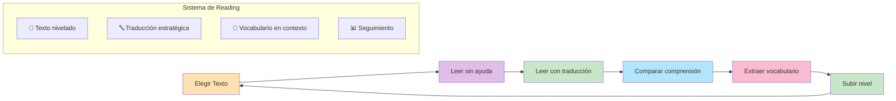
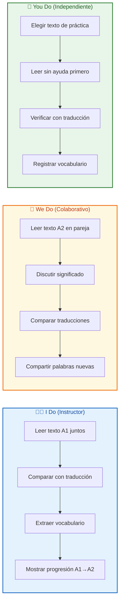
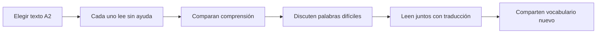
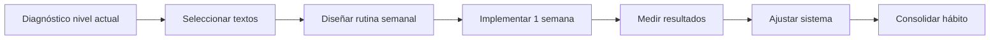

# MASTERCLASS: Reading en Inglés A1-A2 - Textos Cortos con Traducción para Practicar 📖🇬🇧

## INTRODUCCIÓN: POR QUÉ ESTA MASTERCLASS ES DIFERENTE 🎯

Leer en inglés desde cero suele generar frustración: textos muy largos, vocabulario desconocido y la sensación de no avanzar. Esta masterclass cambia el enfoque: **textos cortos, nivelados y con traducción integrada** para que tu cerebro construya significado sin bloqueos.

El objetivo no es leer rápido. El objetivo es **leer con confianza**, frase a frase, hasta que el inglés deje de sonar como ruido.

> **🎯 Objetivo de Aprendizaje** — Al final de esta guía, podrás leer textos breves en inglés de nivel A1-A2, usar la traducción como apoyo estratégico, autoevaluar tu comprensión y construir un hábito sostenible de reading diario.

> **⚠️ Nota educativa** — Este contenido es formativo. El reading se entrena con exposición diaria y paciencia. No avances de nivel sin antes consolidar el anterior.

---

## 🗺️ MAPA DE LA MASTERCLASS 🧭

| 🧩 Fase | ❓ Pregunta que responde | 📤 Resultado principal |
|------|-----------------------|------------------|
| **📖 Elegir texto** | ¿Qué elijo para mi nivel? | Texto adecuado A1-A2 |
| **👀 Leer sin ayuda** | ¿Qué entiendo sin ayuda? | Medición inicial |
| **🔤 Leer con traducción** | ¿Cómo apoyo mi comprensión? | Significado completo |
| **📊 Comparar comprensión** | ¿Cuánto avanzé? | Métrica de progreso |
| **📓 Extraer vocabulario** | ¿Qué palabras nuevas aprendí? | Vocabulario en contexto |
| **🚀 Subir nivel** | ¿Estoy listo para algo más difícil? | Progresión continua |

---

## 📖 PARTE 1: POR QUÉ LOS TEXTOS CORTOS FUNCIONAN MEJOR 📖🧠

### 1.1 Principio Central: Menos es Más en el Reading 📏

Cuando empiezas a leer en inglés, un texto largo genera fatiga antes de aprendizaje. Los textos cortos de 80 a 150 palabras permiten que tu cerebro complete el ciclo de comprensión, traducción y consolidación sin saturarse.

| Característica | Texto largo sin apoyo | Texto corto con traducción |
|----------------|----------------------|----------------------------|
| **Fatiga** | Alta | Baja |
| **Comprensión** | Parcial, se pierde en detalles | Completa, frase a frase |
| **Vocabulario** | Muchas palabras desconocidas | Pocas, manejables |
| **Motivación** | Baja (no terminas) | Alta (terminas rápido) |
| **Retención** | Baja | Alta |

### 1.2 Los Niveles A1 y A2 en Reading 📊

| Nivel | Qué sabes hacer | Comprensión esperada | Ejemplo de texto |
|-------|-----------------|----------------------|------------------|
| **A1 (Principiante)** | Lees palabras aisladas, frases muy cortas | 60-70% sin ayuda | "My name is Ana. I live in Madrid." |
| **A2 (Elemental)** | Lees párrafos breves sobre temas cotidianos | 70-80% sin ayuda | "Every morning I drink coffee. Then I walk to the station." |

### 1.3 Cómo Usar la Traducción sin Depender de Ella 🔄

La traducción es un apoyo, no un andador. Úsala en este orden:

1. **Primera lectura**: lee el texto en inglés sin ayuda.
2. **Segunda lectura**: lee con traducción solo donde no entendiste.
3. **Tercera lectura**: lee el texto en inglés nuevamente. Ahora deberías entender más.
4. **Cuarta lectura**: intenta leer de memoria, frase por frase.

| Intento | Uso de traducción | Objetivo |
|---------|-------------------|----------|
| 1 | Sin traducción | Medir comprensión inicial |
| 2 | Solo frases difíciles | Apoyo puntual |
| 3 | Sin traducción | Consolidar significado |
| 4 | Opcional | Verificar retención |

---

## 📝 PARTE 2: TEXTOS CORTOS A1-A2 CON TRADUCCIÓN 📝✍️

### 2.1 Cómo Leer Estos Textos 👀

Cada texto sigue la misma estructura:
- **Texto en inglés** (nivel A1 o A2)
- **Traducción al español** (para verificar)
- **Vocabulario clave** (palabras nuevas en contexto)
- **Pregunta de comprensión** (1 pregunta para verificar entendimiento)

**Regla**: no mires la traducción hasta haber leído el texto en inglés al menos 2 veces.

### 2.2 Texto 1 - A1: Mi Rutina Matutina 🌅

**Texto en inglés**:

My name is Carlos. I live in Buenos Aires. Every morning I wake up at seven o'clock. I drink coffee with milk. I eat toast and fruit. Then I brush my teeth and leave home. I take the subway to work. I arrive at the office at nine.

**Traducción**:

Me llamo Carlos. Vivo en Buenos Aires. Cada mañana me despierto a las siete. Tomo café con leche. Como tostadas y fruta. Luego me cepillo los dientes y salgo de casa. Tomo el subte para ir al trabajo. Llego a la oficina a las nueve.

**Vocabulario clave**:

| Palabra | Tipo | Significado | Ejemplo |
|---------|------|-------------|---------|
| wake up | Verbo | despertarse | I wake up early |
| brush | Verbo | cepillar | brush your teeth |
| leave | Verbo | salir, irse | leave home |
| take | Verbo | tomar | take the subway |
| arrive | Verbo | llegar | arrive at work |

**Pregunta de comprensión**:

¿A qué hora llega Carlos a la oficina?

✅ Respuesta esperada

A las nueve.

### 2.3 Texto 2 - A1: Mi Familia 👨‍👩‍👧‍👦

**Texto en inglés**:

I have a small family. My father is a teacher. My mother is a nurse. I have one brother. His name is Diego. He is twenty years old. We live in a big apartment. I love my family very much.

**Traducción**:

Tengo una familia pequeña. Mi padre es profesor. Mi madre es enfermera. Tengo un hermano. Su nombre es Diego. Tiene veinte años. Vivimos en un apartamento grande. Amo mucho a mi familia.

**Vocabulario clave**:

| Palabra | Tipo | Significado | Ejemplo |
|---------|------|-------------|---------|
| family | Sustantivo | familia | my family |
| father | Sustantivo | padre | your father |
| mother | Sustantivo | madre | her mother |
| brother | Sustantivo | hermano | my brother |
| apartment | Sustantivo | apartamento | a big apartment |

**Pregunta de comprensión**:

¿Cuántos años tiene Diego?

✅ Respuesta esperada

Veinte años.

### 2.4 Texto 3 - A1: La Tienda 🛍️

**Texto en inglés**:

On Saturday I go to the supermarket. I buy bread, milk, and eggs. The bread is two dollars. The milk is three dollars. The eggs are four dollars. I pay with a card. The cashier is very friendly.

**Traducción**:

El sábado voy al supermercado. Compro pan, leche y huevos. El pan cuesta dos dólares. La leche cuesta tres dólares. Los huevos cuestan cuatro dólares. Pago con una tarjeta. El cajero es muy amable.

**Vocabulario clave**:

| Palabra | Tipo | Significado | Ejemplo |
|---------|------|-------------|---------|
| supermarket | Sustantivo | supermercado | go to the supermarket |
| bread | Sustantivo | pan | a loaf of bread |
| milk | Sustantivo | leche | a glass of milk |
| eggs | Sustantivo | huevos | six eggs |
| cashier | Sustantivo | cajero | the cashier |

**Pregunta de comprensión**:

¿Cómo paga Carlos en el supermercado?

✅ Respuesta esperada

Con una tarjeta.

### 2.5 Texto 4 - A2: Mi Vecindario 🏘️

**Texto en inglés**:

I live in a quiet neighborhood. There is a park near my house. I often walk in the park with my dog. The park has many trees and a small lake. On Sundays, families meet there for picnics. I think it is the best place in the city.

**Traducción**:

Vivo en un barrio tranquilo. Hay un parque cerca de mi casa. A menudo camino por el parque con mi perro. El parque tiene muchos árboles y un lago pequeño. Los domingos, las familias se reúnen allí para hacer picnics. Creo que es el mejor lugar de la ciudad.

**Vocabulario clave**:

| Palabra | Tipo | Significado | Ejemplo |
|---------|------|-------------|---------|
| neighborhood | Sustantivo | barrio | my neighborhood |
| park | Sustantivo | parque | city park |
| walk | Verbo | caminar | walk in the park |
| tree | Sustantivo | árbol | many trees |
| picnic | Sustantivo | picnic | family picnic |

**Pregunta de comprensión**:

¿Por qué el autor cree que el parque es el mejor lugar de la ciudad?

✅ Respuesta esperada

Porque es tranquilo, tiene árboles, un lago y las familias se reúnen allí los domingos.

### 2.6 Texto 5 - A2: Un Día de Lluvia 🌧️

**Texto en inglés**:

Last Sunday it rained all day. I stayed at home and read a book. The book was about a man who travels to the moon. I made tea and cookies. My cat slept on the sofa. It was a calm and happy day.

**Traducción**:

El domingo pasado llovió todo el día. Me quedé en casa y leí un libro. El libro trataba sobre un hombre que viaja a la luna. Preparé té y galletas. Mi gato durmió en el sofá. Fue un día tranquilo y feliz.

**Vocabulario clave**:

| Palabra | Tipo | Significado | Ejemplo |
|---------|------|-------------|---------|
| rain | Verbo | llover | it rains |
| stay | Verbo | quedarse | stay at home |
| book | Sustantivo | libro | read a book |
| travel | Verbo | viajar | travel to the moon |
| cookie | Sustantivo | galleta | chocolate cookie |

**Pregunta de comprensión**:

¿Qué hizo el autor durante el día de lluvia?

✅ Respuesta esperada

Se quedó en casa, leyó un libro, preparó té y galletas, y su gato durmió en el sofá.

### 2.7 Texto 6 - A2: Mi Comida Favorita 🍝

**Texto en inglés**:

My favorite food is pasta. I usually cook it on weekends. First, I boil water and add salt. Then I cook the pasta for ten minutes. After that, I prepare the sauce with tomatoes, garlic, and olive oil. Finally, I mix everything and eat with my friends.

**Traducción**:

Mi comida favorita es la pasta. Normalmente la cocino los fines de semana. Primero hiervo agua y agrego sal. Luego cocino la pasta durante diez minutos. Después preparo la salsa con tomates, ajo y aceite de oliva. Finalmente mezclo todo y como con mis amigos.

**Vocabulario clave**:

| Palabra | Tipo | Significado | Ejemplo |
|---------|------|-------------|---------|
| pasta | Sustantivo | pasta | eat pasta |
| boil | Verbo | hervir | boil water |
| salt | Sustantivo | sal | add salt |
| sauce | Sustantivo | salsa | tomato sauce |
| olive oil | Sustantivo | aceite de oliva | olive oil |

**Pregunta de comprensión**:

¿Cuáles son los ingredientes de la salsa según el texto?

✅ Respuesta esperada

Tomates, ajo y aceite de oliva.

---

## 🎯 PARTE 3: CÓMO LEER SIN DEPENDER DE LA TRADUCCIÓN 🎯🔁

### 3.1 El Método de los 3 Intentos 🔄

| Intento | Uso de traducción | Objetivo |
|---------|-------------------|----------|
| **1** | ❌ Sin traducción | Medir comprensión inicial |
| **2** | ✅ Solo en frases difíciles | Apoyo puntual |
| **3** | ❌ Sin traducción | Consolidar comprensión |

### 3.2 Señales de que estás progresando 📈

| Señal | ¿Qué significa? | Acción |
|-------|----------------|--------|
| Entiendes más en el intento 1 | ✅ Tu cerebro reconoce patrones | Mantén nivel actual |
| Necesitas menos traducción | ✅ Menos fricción, más fluidez | Considera subir a A2 |
| Lees más rápido sin perder comprensión | ✅ Procesas inglés más eficiente | Aumenta longitud de textos |
| Te frustras con facilidad | ⚠️ Texto muy difícil | Baja a A1 o elige tema más familiar |
| Olvidas lo leído al día siguiente | ⚠️ Falta repaso | Agrega repaso 24h después |

### 3.3 Tabla de Progresión A1 → A2 📊

| Habilidad | A1 (Inicial) | A2 (Objetivo) |
|-----------|--------------|---------------|
| Comprensión sin ayuda | 60-70% | 70-80% |
| Longitud de texto | 80-100 palabras | 120-150 palabras |
| Vocabulario nuevo por texto | 3-5 palabras | 5-8 palabras |
| Velocidad de lectura | Lenta, con pausas | Más fluida, menos pausas |
| Dependencia de traducción | Alta | Moderada |

---

## 📊 PARTE 4: CÓMO MEDIR TU PROGRESO 📊📈

### 4.1 Métricas Clave de Reading 📏

| Métrica | Cómo Medir | Meta A1 | Meta A2 |
|---------|------------|---------|---------|
| **Comprensión sin ayuda** | % entendido en primer intento | 60-70% | 70-80% |
| **Tiempo por texto** | Minutos por texto de 100 palabras | 5-8 min | 3-5 min |
| **Vocabulario nuevo retenido** | Palabras que recuerdas al día siguiente | 3-5 | 5-8 |
| **Textos por semana** | Cantidad de textos completados | 3-5 | 5-7 |
| **Dependencia de traducción** | % de frases que necesitas ver | 40-50% | 20-30% |

### 4.2 Tabla de Autoevaluación Semanal 📋

| Día | Texto | Nivel | Tiempo (min) | Comprensión 1er intento (%) | Vocabulario nuevo | Traducción usada |
|-----|-------|-------|--------------|----------------------------|-------------------|------------------|
| Lunes | | | | | | |
| Martes | | | | | | |
| Miércoles | | | | | | |
| Jueves | | | | | | |
| Viernes | | | | | | |
| Sábado | | | | | | |
| Domingo | | | | | | |
| **Total** | | | | **Promedio** | | |

### 4.3 Cómo Interpretar tus Resultados 📈

| Tendencia | ¿Qué significa? | Acción |
|-----------|----------------|--------|
| Comprensión sube semana a semana | ✅ Estás progresando | Mantén la rutina actual |
| Comprensión se estanca | ⚠️ Necesitas más práctica o textos más fáciles | Reduce dificultad o aumenta frecuencia |
| Tiempo por texto baja | 🚀 Lees más rápido | Considera textos más largos |
| Vocabulario nuevo baja | 📚 No estás registrando palabras | Crea el hábito de anotar 3-5 palabras por texto |
| Dependencia de traducción no baja | ⚠️ Necesitas más exposición | Practica sin traducción en intento 1 |

---

## 🏗️ PARTE 5: CONSTRUYENDO TU SISTEMA DE READING 🏗️🧱

### 5.1 Los 5 Componentes de un Sistema Sostenible

| Componente | Función | Implementación práctica |
|------------|---------|-------------------------|
| **1. Textos nivelados** | Asegura progresión sin frustración | Lista de textos A1 y A2 organizados por tema |
| **2. Traducción estratégica** | Apoya sin crear dependencia | 3 intentos: sin ayuda → apoyo puntual → sin ayuda |
| **3. Vocabulario en contexto** | Convierte palabras nuevas en conocimiento | Anota palabra + frase + dibujo/ejemplo |
| **4. Repetición espaciada** | Consolida la memoria | Repasa textos a las 24h, 3 días y 1 semana |
| **5. Seguimiento métrico** | Mide progreso real | Registro semanal de comprensión, tiempo y vocabulario |

### 5.2 ✅ Checklist de Sistema de Reading

- [ ] 📖 Tengo textos A1 y A2 organizados por tema y longitud
- [ ] 🔤 Uso la traducción solo en el segundo intento
- [ ] 📝 Anoto 3-5 palabras nuevas por texto con su contexto
- [ ] 🔁 Repaso cada texto a las 24h, 3 días y 1 semana
- [ ] 📊 Registro mi progreso semanalmente
- [ ] ⏱️ Empiezo con sesiones de 10-15 minutos diarios
- [ ] 🎯 Leo sobre temas que me interesan (no textos aburridos)
- [ ] 📈 Aumento dificultad solo cuando alcance 75% comprensión

---

## 🎓 PARTE 6: I DO / WE DO / YOU DO - EJERCICIOS PROGRESIVOS 🎓🚀

### 6.1 🧭 I Do — Lectura guiada de texto A1

**🎯 Objetivo**: Experimentar el método de 3 intentos con un texto corto.

| Paso | Acción | Tiempo |
|------|--------|--------|
| 1 | Lee el texto A1 sin ayuda | 2 min |
| 2 | Subraya frases que no entendiste | 1 min |
| 3 | Lee con traducción solo en esas frases | 2 min |
| 4 | Responde la pregunta de comprensión | 1 min |
| 5 | Anota 2 palabras nuevas en tu cuaderno | 2 min |

**📋 Ejemplo guiado**:
- Texto: Mi Rutina Matutina (A1)
- Comprensión inicial: 70%
- Después de traducción: 100%
- Vocabulario nuevo: wake up, brush, leave

### 6.2 🤝 We Do — Lectura colaborativa de texto A2

**👥 Ejercicio grupal**: Lean un texto A2 en pareja y comparen resultados.

**📜 Reglas del ejercicio**:
1. 🚫 No se permite usar traducción en el primer intento
2. 📝 Cada uno subraya 2 frases difíciles
3. 🤔 Comparen: ¿quién entendió más? ¿por qué?
4. 📚 Cada persona comparte 1 palabra nueva aprendida

### 6.3 🚀 You Do — Tu sistema personal de reading

**📋 Tarea**: Diseña tu rutina semanal de reading con textos A1-A2.

**✅ Checklist de implementación**:

- [ ] 📖 Creé lista de textos A1 y A2 por tema
- [ ] ⏱️ Definí duración objetivo por sesión (10-15 min)
- [ ] 🔤 Establecí regla de traducción (3 intentos)
- [ ] 📝 Creé sistema de registro de vocabulario (cuaderno o app)
- [ ] 📅 Programé 5-7 sesiones por semana
- [ ] 📆 Definí día de revisión semanal (domingos)
- [ ] 📈 Seleccioné métricas a medir (comprensión, tiempo, vocabulario)
- [ ] 🤝 Compromiso de 21 días de práctica continua

---

## 📦 PARTE 7: RECURSOS Y TEXTOS RECOMENDADOS 📦📚

### 7.1 Fuentes de Textos A1-A2

| Fuente | Tipo de texto | Nivel | Duración |
|--------|---------------|-------|----------|
| **Oxford Bookworms Starter** | Lecturas graduadas | A1 | 10-15 min |
| **Cambridge English Readers** | Lecturas graduadas | A1-A2 | 15-20 min |
| **British Council - LearnEnglish** | Textos cortos gratuitos | A1-A2 | 5-10 min |
| **ESL Lounge** | Ejercicios y lecturas | A1-A2 | Variable |
| **Simple English Wikipedia** | Artículos cortos | A2 | 10-15 min |
| **Children's stories** | Cuentos cortos | A1-A2 | 5-10 min |

### 7.2 Temas Recomendados para A1-A2

| Tema | Por qué funciona | Ejemplo de texto |
|------|------------------|------------------|
| **Rutina diaria** | Vocabulario repetitivo, estructuras simples | "I wake up at 7. I eat breakfast." |
| **Familia** | Nombres comunes, relaciones básicas | "My mother is a doctor." |
| **Comida** | Verbos de acción, números | "I buy bread and milk." |
| **Ciudad/barrio** | Lugares concretos, preposiciones | "The park is near my house." |
| **Pasatiempos** | Verbos de ocio, horarios | "I like to read books." |
| **Viajes simples** | Pasado reciente, lugares | "Last week I visited Madrid." |

### 7.3 Ejemplo de Rutina Semanal

| Día | ⏱️ Duración | 📺 Tipo de texto | 🎯 Nivel | 📝 Actividad |
|-----|----------|----------------|---------|--------------|
| 📅 Lunes | 10 min | Rutina matutina | A1 | 3 intentos + vocabulario |
| 📅 Martes | 10 min | Familia | A1 | 3 intentos + pregunta |
| 📅 Miércoles | 15 min | Tienda/compra | A1-A2 | 3 intentos + resumen |
| 📅 Jueves | 15 min | Vecindario | A2 | 3 intentos + vocabulario |
| 📅 Viernes | 15 min | Comida/cocina | A2 | 3 intentos + pregunta |
| 📅 Sábado | 20 min | Viaje/pasatiempo | A2 | 3 intentos + resumen |
| 📅 Domingo | 10 min | Repaso de textos | A1-A2 | Releer sin ayuda |
| **📊 Total** | **95 min** | | | |

---

## 🧩 PREGUNTAS DE VERIFICACIÓN 📝✅

1. **Aplica**: Toma el texto "Mi Rutina Matutina" y aplícalo en 3 intentos siguiendo el método. ¿En qué intento entendiste más frases sin ayuda?

2. **Analiza**: ¿Por qué los textos cortos de 80-150 palabras son más efectivos para A1-A2 que textos largos?

3. **Diseña**: Crea tu lista de 5 textos A1-A2 organizados por tema y nivel, con su traducción y 1 pregunta de comprensión cada uno.

4. **Reflexiona**: ¿Qué pasa cuando usas la traducción en el primer intento? ¿Cómo afecta tu aprendizaje a largo plazo?

5. **Crea**: Diseña tu rutina semanal de reading considerando duración, nivel, tema y métricas de progreso.

---

## 📖 GLOSARIO RÁPIDO 📚⚡

| Término | Definición | Emoji |
|---------|------------|-------|
| **Reading** | Comprensión de textos escritos en inglés | 📖 |
| **A1** | Nivel principiante: frases cortas, vocabulario básico | 🟢 |
| **A2** | Nivel elemental: párrafos breves, temas cotidianos | 🟡 |
| **Traducción estratégica** | Uso de traducción como apoyo puntual, no como muleta | 🔄 |
| **Comprensión sin ayuda** | % de texto entendido en primer intento sin traducción | 📊 |
| **Vocabulario en contexto** | Palabra nueva aprendida dentro de una frase real | 📝 |
| **Repetición espaciada** | Repasar textos a 24h, 3 días y 1 semana para retener | 🔁 |
| **Reading extensivo** | Leer por placer y exposición general, no por examen | 🌊 |

---

## 🎓 NOTAS FINALES 🎓✨

El reading en inglés no se mejora leyendo mucho de una vez. Se mejora leyendo **poco, pero todos los días**, con textos nivelados y traducción estratégica.

Recuerda:
1. **Los textos cortos ganan** - 80-150 palabras es el rango ideal para A1-A2
2. **La traducción es apoyo, no muleta** - úsala solo en el segundo intento
3. **El vocabulario en contexto retiene** - anota palabras con su frase, no aisladas
4. **La repetición espaciada consolida** - repasa a 24h, 3 días y 1 semana
5. **La constancia vence a la intensidad** - 15 minutos diarios valen más que 2 horas un domingo

> **🌟 Mensaje final**: Tu cerebro necesita miles de exposiciones cortas y exitosas para reconocer patrones en inglés. Cada texto corto que completas es una repetición más. La confianza no viene de leer textos imposibles, sino de completar textos que puedes dominar.

---

**Creado con propósito educativo. Tu progreso en reading depende de la calidad de tu práctica diaria, no de la cantidad de texto que leas en un solo día.**

📖🇬🇧✨
