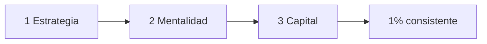
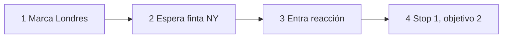
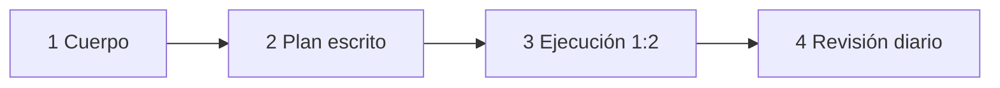
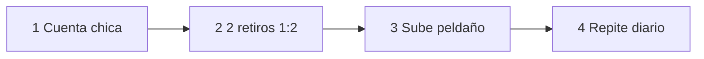

# Roadmap Trading 2026: Estrategia, Mentalidad y Capital

Este es el resumen accionable del roadmap 2026 de El Sensei Trading: la consistencia no viene de un indicador mágico, viene de estrategia simple + mente disciplinada + capital escalado con paciencia.

## Mapa de 3 FASES

| Fase | Pregunta que resuelve | Resultado visible |
|------|----------------------|-------------------|
| 1. Estrategia | ¿Dónde entro y salgo sin adivinar? | 1 setup repetible Londres → Nueva York |
| 2. Mentalidad | ¿Cómo ejecuto sin sabotearme? | Rutina diaria de 4 hábitos |
| 3. Capital | ¿Cómo crezco sin quemarme? | Plan de cuenta pequeña a escala |

*Se lee como tabla de ruta: empezás en Fase 1 y solo pasás a la siguiente cuando cumplís su checklist.*

*Se lee de izquierda a derecha. 3 fases + 1 resultado final.*

## Antes de empezar: 6 términos en 1 minuto

- **Order block:** como la huella que deja un camión grande al frenar. Zona donde el precio reaccionó fuerte en Londres.
- **Manipulación:** como la finta en fútbol. Rompe un nivel para atrapar impacientes y luego gira.
- **Riesgo-beneficio 1:2:** como apostar 1 ficha para ganar 2. Arriesgás 10 para buscar 20.
- **Sesión Londres / Nueva York:** como dos turnos de trabajo. Londres marca el mapa, Nueva York ejecuta.
- **Prop firm:** como alquilar un taxi para trabajar. Operás capital ajeno y repartís ganancias.
- **Diario emocional:** como la caja negra del avión. Registra qué sentiste antes y después de cada trade.

Si ya conocés estos 6, seguí a la PARTE 1. Si no, releelos una vez más.

## PARTE 1: Estrategia Londres → Nueva York (Nivel 1/5)

1. PRETEST — ¿Qué hace Londres y qué hace Nueva York? (Activa previas | Media)
   > Respuesta esperada: Londres marca; NY entra tras finta con 1:2.
   > Si acertás: camino rápido → andá al punto 7.

2. POR QUÉ + LOGRO — Sin mapa entrás por ansiedad. Vas a lograr marcar 1 zona y definir 1:2. (Motivación | Media)

3. VICTORIA RÁPIDA (<5 min) — Abrí el gráfico de ayer y marcá máximo y mínimo de Londres. (Motivación | Heurística)

4. CONCEPTO — Analogía: Londres dibuja la cancha, Nueva York juega. Definición: Londres deja un order block, NY lo manipula y entrás en la reacción con 1:2. (Pre-training + señalización | Media)

5. EJEMPLO RESUELTO (I Do) — EURUSD, cuenta 1.000, riesgo 1% = 10. Pasos 1→3 con caso concreto. (Worked example | Alta)

| Paso | Qué hacés | Número concreto |
|------|-----------|-----------------|
| 1. Mapa | Marcás order block de Londres | Zona 1,0850–1,0860 |
| 2. Caza | Esperás manipulación en NY | Rompe a 1,0845 y vuelve |
| 3. Entrada | Comprás reacción, stop 10 pips, objetivo 20 pips | Arriesgás 10 para buscar 20 |

*Se lee de izquierda a derecha. 4 pasos lineales sin vuelta atrás.*

¿Por qué funciona? Vas con la liquidez. ¿Cuándo falla? Con noticias fuertes sin respeto a zonas.

6. CONTRA-EJEMPLO / ERROR TÍPICO (We Do) — Entrar durante la finta sin esperar cierre → Corrección: sin vuelta a la zona en 2 velas, no hay trade. (Autoexplicación | Media-Alta)

7. PRÁCTICA (You Do) — En GBPUSD de ayer, marcá entrada, stop y objetivo 1:2.
   > Respuesta esperada / criterio: zona + finta + stop tras la finta y objetivo el doble. Si el objetivo es menor, se rehace. (Práctica + feedback | Media)

8. RECALL — Sin mirar: ¿cuáles son los 3 pasos Londres → NY con 1:2? (Nivel Bloom: recordar) (Recuperación | Alta)

9. IDEA CLAVE — Londres marca, Nueva York paga: sin finta no hay entrada.

10. AUTO-CHEQUEO + SIGUIENTE — [ ] Marqué zona Londres [ ] Esperé finta [ ] Definí 1:2 antes de entrar. Siguiente: PARTE 2 te enseña a no romper ese plan. (Metacognición | Media)

## PARTE 2: Mentalidad y Hábitos que Sostienen el Plan (Nivel 2/5)

1. PRETEST — ¿Por qué la psicología es 70%? (Activa previas | Media)
   > Respuesta esperada: la estrategia es simple; lo difícil es ejecutarla.
   > Si acertás: camino rápido → andá al punto 7.

2. POR QUÉ + LOGRO — Tu cuenta refleja tu rutina. Vas a lograr tu hoja de 4 hábitos. (Motivación | Media)

3. VICTORIA RÁPIDA (<5 min) — Escribí en 3 líneas: objetivo, riesgo máximo y ánimo del 1 al 10. (Motivación | Heurística)

4. CONCEPTO — Analogía: la mente es un músculo que se cansa con pantallas y se ordena con rutina. Definición: disciplina es repetir 4 hábitos: leer 30 min, podcast útil, ejercicio 30–45 min, diario. (Pre-training + señalización | Media)

5. EJEMPLO RESUELTO (I Do) — Día modelo con caso concreto. (Worked example | Alta)

| Bloque | Qué hacés | Número concreto |
|--------|-----------|-----------------|
| 1. Mañana | Ejercicio 30 min + lectura 15 min | 7:00–7:45 sin celular |
| 2. Pre-mercado | Diario: plan + riesgo 1% | Escribís 3 líneas |
| 3. Post-mercado | Revisás 1 trade: ¿respeté Londres + finta + 1:2? | Sí / No + emoción |

*Se lee de izquierda a derecha. El diario cierra el día.*

¿Por qué funciona? Ejercicio y escritura bajan reactividad. ¿Cuándo falla? Si no ligás hábitos al trade.

6. CONTRA-EJEMPLO / ERROR TÍPICO (We Do) — Operar 5 veces por venganza tras perder → Corrección: si pierdo 1 trade 1:2, cierro 24 h y lo anoto. (Autoexplicación | Media-Alta)

7. PRÁCTICA (You Do) — Armá tu versión mínima para mañana con horarios reales para los 4 hábitos.
   > Respuesta esperada / criterio: 4 horarios + frase si-entonces. Si falta 1 hábito, incompleta. (Práctica + feedback | Media)

8. RECALL — Sin mirar: ¿cuáles son los 4 hábitos y para qué sirve cada uno? (Nivel Bloom: comprender) (Recuperación | Alta)

9. IDEA CLAVE — No operes tu ánimo, operá tu rutina escrita.

10. AUTO-CHEQUEO + SIGUIENTE — [ ] Tengo horarios [ ] Tengo regla si-entonces [ ] Ligué diario a order block + 1:2. Siguiente: PARTE 3 convierte esa disciplina en capital. (Metacognición | Media)

## PARTE 3: Escalar Capital sin Quemarte (Nivel 3/5)

1. PRETEST — ¿Por qué empezar con cuenta pequeña? (Activa previas | Media)
   > Respuesta esperada: valida retiros con presión baja antes de escalar.
   > Si acertás: camino rápido → andá al punto 7.

2. POR QUÉ + LOGRO — Importa porque lo emocional quema más que lo financiero. Vas a lograr escribir tu escalera con regla de retiro. (Motivación | Media)

3. VICTORIA RÁPIDA (<5 min) — Escribí tu peldaño 1: cuenta, riesgo en dinero y meta de 2 retiros. (Motivación | Heurística)

4. CONCEPTO — Analogía: escalar es subir de cinturón, no apostar doble. Definición: empezás chico en prop, lográs 2 retiros con setup + diario, recién subís. (Pre-training + señalización | Media)

5. EJEMPLO RESUELTO (I Do) — Cuenta 5.000, riesgo 0,5% = 25 buscando 50. (Worked example | Alta)

| Paso | Qué hacés | Número concreto |
|------|-----------|-----------------|
| 1. Base | Operás solo setup PARTE 1 | Máx 1 trade por día |
| 2. Valida | Lográs 2 retiros | Retiro 1: 150, retiro 2: 150 |
| 3. Escala | Recién subís un peldaño | De 5.000 a 10.000 |

*Se lee de izquierda a derecha. Solo se avanza con 2 retiros.*

¿Por qué funciona? El retiro valida ejecución, no suerte. ¿Cuándo falla? Si escalás en racha sin diario ni 1:2.

6. CONTRA-EJEMPLO / ERROR TÍPICO (We Do) — Sobreoperar 6 trades y quemar evaluación → Corrección: tope 1–2 trades/día y -3% semanal; al tocarlo, semana cerrada. (Autoexplicación | Media-Alta)

7. PRÁCTICA MIXTA (You Do) — Tomá un trade perdedor 1:2 con order block, decí qué hábito te frena y qué pasa con tu escalera.
   > Respuesta esperada / criterio: -25 aceptada + cerrar y anotar + escalera intacta. (Práctica + feedback | Media)

8. RECALL — Sin mirar: ¿qué te permite subir de peldaño y qué te obliga a frenar? (Nivel Bloom: aplicar) (Recuperación | Alta)

9. IDEA CLAVE — Retirá primero, agrandá después: la escala premia al constante.

10. AUTO-CHEQUEO + SIGUIENTE — [ ] Tengo peldaño 1 [ ] Tengo regla 2 retiros [ ] Tengo tope diario/semanal. Siguiente: operá 20 días solo PARTE 1 + diario. (Metacognición | Media)

## Cierre: la regla del 1%

Pocos sobreviven porque pocos sostienen rutina. Repaso: ¿qué marca Londres? ¿qué 4 hábitos? ¿cuándo escalás?

*Aviso educativo, no asesoría. Practicá en demo.*
